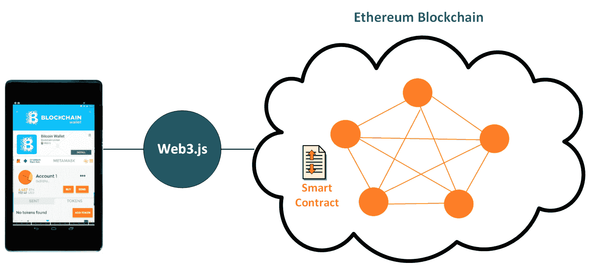
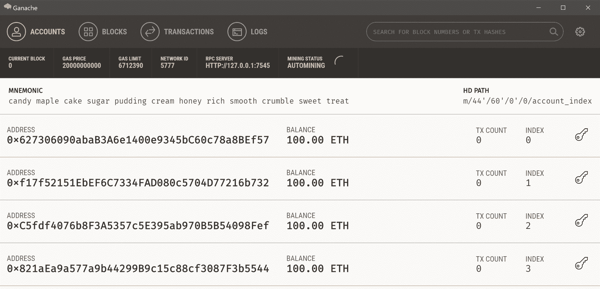
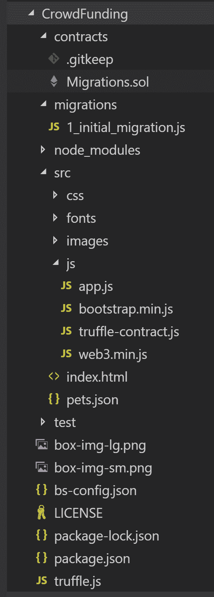
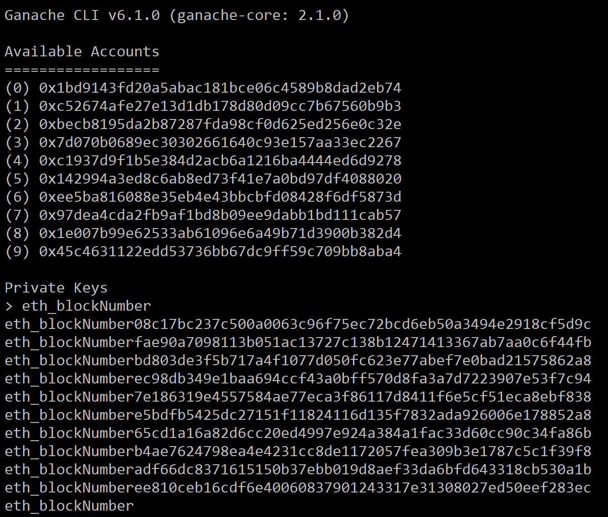
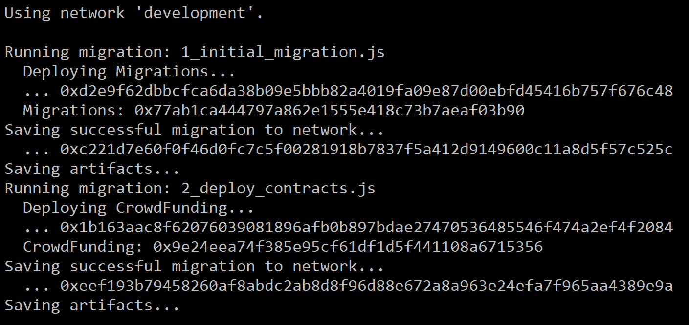
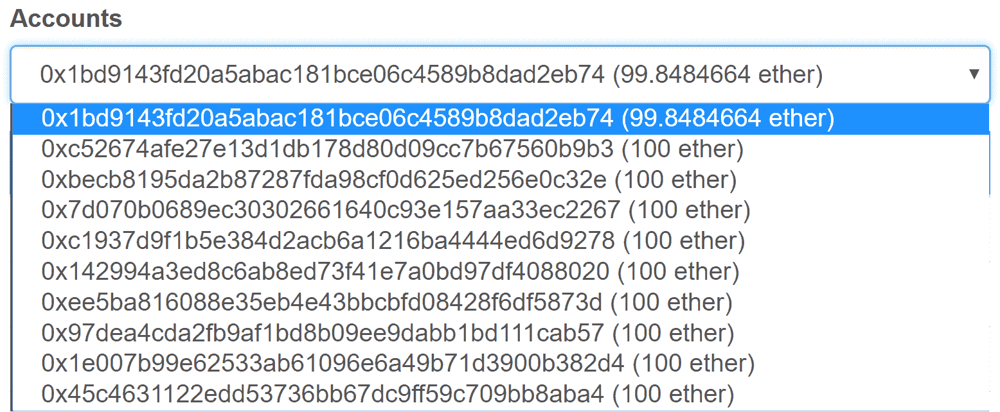
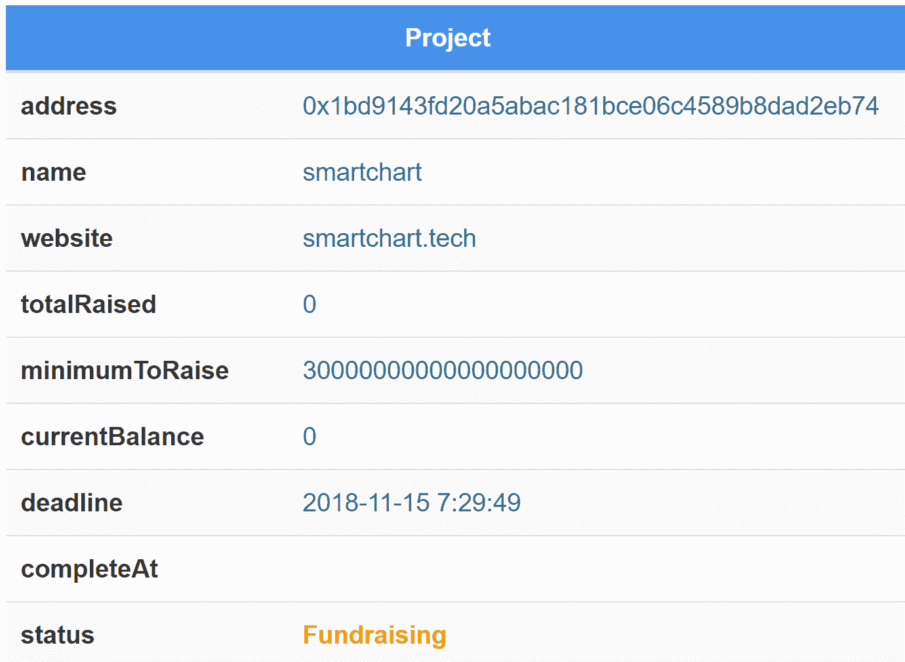
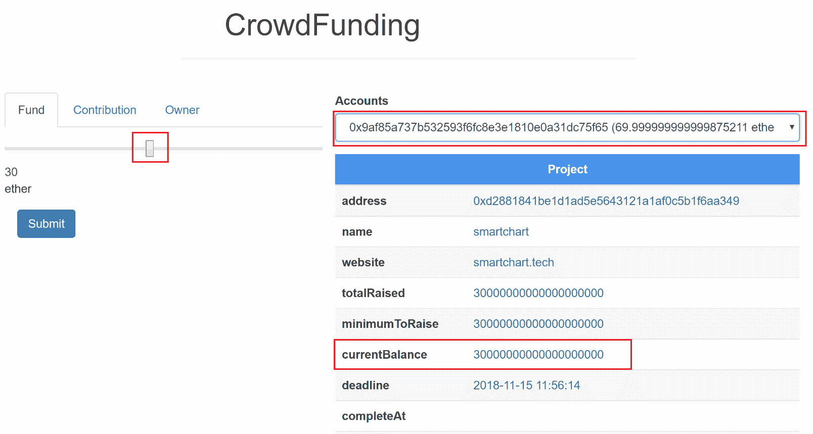
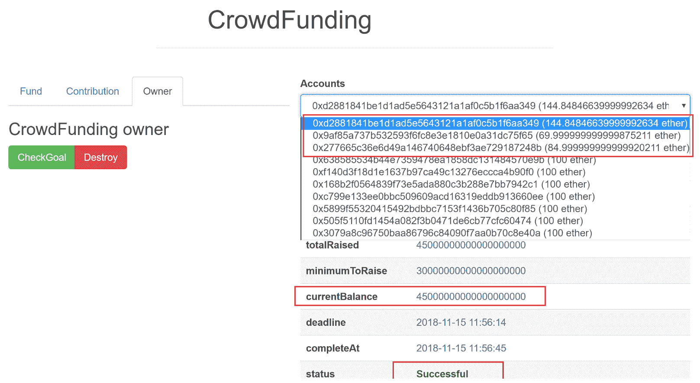

# 构建以太坊区块链应用程序

在上一章中，我们回顾了智能合约的基本特性以及如何编写一个众筹智能合约示例。在我们将智能合约部署到区块链之后，我们需要编写 Web 应用程序来与智能合约交互。以太坊区块链通过调用智能合约函数和获取器提供了 web3 API。

在本章中，我们将涵盖以下主题：

+   什么是**去中心化应用**（**DApp**）

+   web3js 快速概述

+   设置以太坊开发环境

+   开发和测试 DApp

# 去中心化应用概述

**去中心化应用**（或**DApp**）是一种利用智能合约运行的应用程序。智能合约部署在**以太坊虚拟机**（**EVM**）上。它类似于客户端-服务器低层架构。一个 DApp 可以有一个前端（Web），通过 web3.js API 调用其后端（智能合约）。

以下结构是我们将为我们的众筹 DApp 构建的：



我们将为众筹 DApp 构建的结构

# web3.js 快速概述

web3.js 是一个以太坊 JavaScript API，提供了一系列库来与本地或远程以太坊网络交互。web3js 与以太坊之间的连接是通过使用 HTTP 或 IPC 协议进行的。在下表中，我们快速审查了一些重要的 web3.js API 概念：

| **API 参考** | **描述** | **示例** |
| --- | --- | --- |
| web3-eth | 该包提供了与以太坊区块链和智能合约交互的 API | `getBalance`, `sendTransaction, coinbase`, `getBlockNumber, getAccounts` |
| web3-shh | 该包提供了与 whisper 协议进行广播交互的 API |

```
web3.shh.post({
        symKeyID: identities[0],
        topic: '0xffaadd11',
        payload: '0xffffffdddddd1122'
    }).then(h => console.log(`Message with hash ${h} was successfuly sent`))
```

|

| web3-bzz | 该包提供了与以太坊疯蜂网络（Ethereum swarm）交互的 API，即去中心化文件存储平台 | `web3.bzz.currentProvider``web3.bzz.download(bzzHash [, localpath])` |
| --- | --- | --- |
| web3-utils | 该包提供了一组针对以太坊 DApp 和其他 web3.js 包的实用函数 | `web3.utils.toWei(number [, unit])``web3.utils.isAddress(address)` |

# 提供者

提供者抽象了与以太坊区块链进行通信的连接。它将向区块链发出查询并发送交易。web3 提供了 `JsonRpcProvider` 和 `IpcProvider`，允许您连接到本地或远程以太坊节点，包括 Mainnet、Ropsten 测试网、Kovan 测试网、Rinkeby 测试网和自定义的远程过程调用（**RPC**），如 Ganache。下面是展示如何使用 web3 API 连接以太坊节点的代码片段。

```
var Web3 = require('web3');
var web3 = new Web3('http://localhost:8545');
// or
var web3 = new Web3(new Web3.providers.HttpProvider('http://localhost:8545'));
// change provider
web3.setProvider('ws://localhost:8546');
// or
web3.setProvider(new Web3.providers.WebsocketProvider('ws://localhost:8546'));
```

# DApp 开发工具

有一些流行的区块链 Web 开发工具被开发者用于创建 DApp 项目的基本结构。以下部分列出了其中的一些。

# Truffle

Truffle 是一个以太坊 DApp 端到端开发工具，提供了一个开发环境，用于编写、编译和部署测试智能合约和 DApps。您可以为前端编写 HTML、CSS 和 JavaScript；Solidity 用于智能合约，并使用 web3.js API 与 UI 和智能合约交互。Truffle Boxes 提供了有用的样板文件，其中包含了有用的模块、Solidity 合约和库、前端代码以及许多其他有用的文件。Truffle Boxes 帮助开发人员快速启动他们的 DApp 项目。

Truffle 命令行使用以下格式：

+   `truffle [command] [options]`

这里是命令行工具中常用的选项：

| **命令** | **描述** |
| --- | --- |
| `compile` | 编译 Solidity 合约文件。 |
| `console` | 与部署的智能合约交互的命令行界面。 |
| `create` | 此命令可帮助创建新的合约、新的迁移文件和基本测试。 |
| `debug` | 在调试器会话中对特定交易进行实验。 |
| `deploy`/`migration` | 将合约部署到区块链网络。 |
| `develop` | 在本地开发环境中通过命令行与合约交互。 |
| `init` | 从以太坊包注册表中安装包。 |

# Ganache

Ganache 是一个私有的以太坊区块链环境，允许您模拟以太坊区块链，以便您可以在自己的私有区块链中与智能合约交互。以下是 Ganache 提供的一些功能：

+   显示区块链日志输出

+   提供高级挖掘控制

+   内置区块浏览器

+   以太坊区块链环境

+   Ganache 有一个桌面应用程序和一个命令行工具

这是 Ganache 桌面版的外观：



命令行使用以下格式：

```
ganache-cli <options>
```

这些是命令行工具的常用选项：

| **选项** | **描述** |
| --- | --- |
| `-a 或 --accounts` | 启动时要生成的账户数量。 |
| `-e 或 --defaultBalanceEther` | 配置默认的测试账户以太币数量。默认值为 `100`。 |
| `-b 或 --blockTime` | 指定以秒为单位的区块时间作为挖掘间隔。如果未指定此选项，当调用事务时，Ganache 将立即挖掘新块。 |
| `-h 或 --host 或 --hostname` | 指定要侦听的主机名。默认值为 `127.0.0.1`。 |
| `-p 或 --port` | 指定端口号。默认值为 `8545`。 |
| `-g 或 --gasPrice` | 以 Wei 指定气价（默认为 `20000000000`）。 |
| `-l 或 --gasLimit` | 区块气体限制（默认为 `0x6691b7`）。 |
| `--debug` | 为调试目的显示 VM 操作码。 |
| `-q 或 --quiet` | 不记录任何日志运行 `ganache-cli`。 |

# 设置以太坊开发环境

按照以下说明获取以太坊开发工具，并启动以太坊私有本地区块链环境（主要用于在本地区块链上运行/部署您的智能合约）。

# 安装Truffle

打开命令行并运行以下命令：

```
npm install -g truffle
```

# 安装Ganache

打开命令行并安装Ganache的命���行接口，如下所示：

```
npm install -g ganache-cli
```

# 创建一个Truffle项目

要初始化一个新的DApp项目，我们可以运行truffle `init`命令来初始化一个空的Truffle项目。这将创建DApp目录结构，包括应用程序、合约和测试以及Truffle配置。由于Truffle Boxes提供了许多可用的模板，在我们的DApp示例中，我们将使用宠物商店模板——一个JavaScript UI库的JQuery版本——来开发我们的众筹DApp示例。

创建一个名为`Crowdfunding`的文件夹，打开命令行提示符，导航到`Crowdfunding`文件夹，并运行以下命令：

```
truffle unbox pet-shop
```

项目结构如下：



我们在上一章中编写了众筹智能合约。让我们将`CrowdFunding.sol`文件复制到`Crowdfunding`下的contracts文件夹中。

# 启动Ganache环境

打开一个新的终端窗口并运行以下命令：

```
Ganache-cli
```

这将在端口`8545`上运行`Ganache-cli`，而且Ganache将为我们创建10个默认账户。每个账户默认拥有100以太币。你应该在控制台中看到类似这样的东西：



在我们的Truffle项目中，`truffle.js`将`7545`定义为默认端口号。我们需要将端口号更新为`8545`以与Ganache的端口号匹配，如下所示：

```
module.exports = {
  networks: {
    development: {
      host: "127.0.0.1",
      port: 8545,
      network_id: "*" // Match any network id
    }
  }
};
```

# 部署智能合约

正如你可能已经注意到的，先前的命令创建了两个与迁移相关的文件，`Migrations.sol`和`1_initial_migration.js`。`Migrations.sol`存储了对应于最后一个应用的“迁移”脚本的编号。当你添加一个新的合约并部署合约时，存储中的最后一个部署编号将增加。合约运行一次后，就不会再次运行。编号的约定是`x_script_name.js`，x从1开始，即`1_initial_migration.js`。你的新合约通常会在以`2_...`开始的脚本中。

在我们的情况下，我们将添加一个新的迁移合约以部署`CrowdFunding`。让我们创建一个名为`2_deploy_contracts.js`的文件。

`CrowdFunding.sol`将构造函数定义如下：

```
constructor (address _owner, uint _minimumToRaise, uint _durationProjects,
        string _name, string _website)
```

要部署合约，可以调用truffle deploy函数，带有可选的构造函数参数，`deployer.deploy(contract, args..., options)`。

我们将使用由Ganache提供的第一个账户作为所有者账户，如下所示：

```
var CrowdFunding = artifacts.require("./CrowdFunding.sol");
module.exports = (deployer, network, accounts) => {
  const ownerAddress = accounts[0];
  deployer.deploy(CrowdFunding, ownerAddress, 30, 60, "smartchart", "smartchart.tech");
}
```

让我们将智能合约部署到我们的网络。运行`truffle`命令，如下所示：

```
truffle migrate
```

以下截图显示了运行`truffle migrate`命令的结果：



这样可以在本地Ganache区块链环境中部署我们的众筹智能合约。

要启动本地节点服务器，请运行以下命令，这将在我们的浏览器中打开宠物商店页面：

```
npm run dev
```

# 编写众筹去中心化应用

我们刚刚在我们的本地 Ganache 区块链环境上部署了我们的智能合约。现在，我们将开始编写 UI 代码，通过 RPC 调用触发智能合约函数。本章的源代码可在 [https://bit.ly/2X8xPBL](https://bit.ly/2X8xPBL) 上找到。

# 选择一个 web3 提供程序

当我们加载网页时，我们需要连接到一个 web3 提供程序。如果您已经安装了像 MetaMask 这样的提供程序，您可以使用您的正确提供程序选项，如下所示：

```
App.web3Provider = web3.currentProvider;
```

在我们的众筹示例中，为了简单起见，我们将直接连接到我们的本地 Ganache 服务器，如下所示：

```
App.web3Provider = new Web3.providers.HttpProvider('http://localhost:8545');
```

# 加载账户信息

要加载账户，我们定义一个内容为空的下拉菜单，如下所示：

```
<div class="form-group">
                <label for="exampleFormControlSelect1">Accounts</label>
                <select class="form-control" id="accts">
                </select>
              </div>
```

当我们加载页面时，我们将使用 `web3.eth.accounts` 获取所有 10 个默认账户。请注意，第一个账户的以太均衡为 99.84；这是因为我们使用第一个账户作为所有者账户来部署合约，并燃烧了一些以太作为交易费用，如下代码所示：

```
    web3.eth.accounts.forEach( function(e){
        $('#accts').append($('<option>', {
            value:e,
            text : e + " (" +web3.fromWei(web3.eth.getBalance(e), "ether") + " ether)"
        }));
})
```

一旦账户加载完毕，将显示如下：



# 加载项目信息

在众筹中，我们定义了一个包含筹款信息的项目结构，如下所示：

```
struct Project {
        address addr;
        string name;
        string website;
        uint totalRaised;
        uint minimumToRaise;
        uint currentBalance;
        uint deadline;
        uint completeAt;
        Status status;  
    }
```

让我们在 HTML 中定义一些相关信息，例如：

```
<table class="table table-hover table-striped">
                  <tbody>
                    <tr>
                      <th scope="row">address</th>
                      <td><span class="text-info" id="address"></span
</td>
                    </tr>
                    <tr>
                      <th scope="row">name</th>
                      <td><span class="text-info" id="name"></span></td>
                    </tr>
                    <tr>
                        <th scope="row">website</th>
                        <td><span class="text-info" id="website"></span></td>
                    </tr>
                    <tr>
                        <th scope="row">totalRaised</th>
                        <td><span class="text-info" id="totalRaised"></span></td>
…
                  </tbody>
                </table>
```

`CrowdFunding.deployed()` 函数将创建一个代表由 `CrowdFunding` 管理的默认地址的 `CrowdFunding` 实例。这里的代码显示了我们如何显示项目信息：

```
    App.contracts.CrowdFunding.deployed().then(function(instance) {
      crowdFundingInstance = instance;
      return crowdFundingInstance.project();
    }).then(function(projectInfo) {
        $("#address").text(projectInfo[0].toString());
        $("#name").text(projectInfo[1]);
        $("#website").text(projectInfo[2]);
        $("#totalRaised").text(projectInfo[3].toString());
        ..
        if(projectInfo[6].toString().length>0) {
          var deadline = new
Date(Number(projectInfo[6].toString())*1000);
          deadlineDate = moment(deadline).format("YYYY-MM-DD h:mm:ss");
          $("#deadline").text(deadlineDate);
        }
        if(projectInfo[7].toString().length>0 && projectInfo[7].toString()!='0') {
          console.log(projectInfo[7].toString());
          var completeAt = new Date(Number(projectInfo[7].toString())*1000);
          completeAtDate = moment(completeAt).format("YYYY-MM-DD h:mm:ss");
          $("#completeAt").text(completeAtDate);
        }   
    }).catch(function(error) {
..
    });
```

结果将如下显示：



# 处理基金功能

要筹集资金，我们需要调用 fund 函数，在我们的众筹智能合约中定义。在我们的网页中，我们使用 HTML 范围输入滑块组件来贡献资金金额，如下所示：

```
<form id="fund-form" method="post" role="form" style="display: block;">
                                      <div class="form-group row">
                                          <div class="row">
                                              <div class="col-lg-12">
                                                  <input type="range" name="ageInputName" id="ageInputId" value="0" min="1" max="100" oninput="ageOutputId.value = ageInputId.value">
                                                  <div style="display: inline;"><output name="ageOutputName" id="ageOutputId">0</output> <span>ether</span></div>             
                                              </div>
                                            </div>
                                       </div>
                                      <div class="form-group">
                                        <div class="row">
                                          <div class="col-lg-12">
                                              <button type="button" id="fundBtn" class="btn btn-primary pull-left">Submit</button>
                                          </div>
                                        </div>
                                      </div>                              
                                  </form>
```

`Crowdfunding fund` 函数是一个可支付的回退函数；因此，我们需要从 UI 传递 `msg.sender` 和 `msg.value` 来调用它，如下所示。

```
   function fund() public atStage(Status.Fundraising) payable {
        contributions.push(
            Contribution({
                addr: msg.sender,
                amount: msg.value
                })
            );
……
}
```

您可以按如下方式定义发送地址和值参数：

```
  handleFund: function(event) {
    event.preventDefault();
    var fundVal =  $('#ageOutputId').val();
    var selectAcct = $('#accts').find(":selected").val();
    $("#displayMsg").html("");
    App.contracts.CrowdFunding.deployed().then(function(instance) {
      return instance.fund({ from: selectAcct, value:web3.toWei(fundVal, "ether"), gas:3500000});
    }).then(function(result) {
      App.loadProject();
    }).catch(function(err) {
      console.error(err);
      $("#displayMsg").html(err);
    });
  },
```

一旦我们收到结果返回，我们将调用 `loadProject` 函数刷新项目信息。我们可以看到当前余额基金增加了，如下截图所示：



# checkGoalReached

一旦达到筹款目标，众筹所有者将通过运行 `checkGoalReached` 方法收集所有资金。

HTML 仅为一个简单的按钮，如下所示的代码：

```
<button type="button" id="checkGoal" class="btn btn-success">CheckGoal</button>
```

与 fund 函数类似，我们使用以下代码在 JavaScript 中调用智能合约：

```
instance.checkGoalReached({ from: selectAcct, gas:3500000});
```

这是详细的逻辑：

```
  handleCheckGoal: function(event) {
    event.preventDefault();
    $("#displayMsg").html("");
    var selectAcct = $('#accts').find(":selected").val();
    App.contracts.CrowdFunding.deployed().then(function(instance) {
      return instance.checkGoalReached({ from: selectAcct, gas:3500000});
    }).then(function(result) {
      App.loadProject();
    }).catch(function(err) {
      console.error(err);
      $("#displayMsg").html(err);
    });
  },
```

结果将如下显示：



如果您跟随整个示例并运行了这一步，恭喜！您现在可以编写并运行一个众筹 DApp 了。

# 概要

在本章中，我们学习了 DApp 的基础知识，现在我们了解了 web3.js API。通过在本地以太坊环境中运行 Ganache，我们可以使用 Truffle 开发工具创建一个众筹项目并编写一个 DApp 组件。最后，我们部署并启动了众筹 DApp。在下一章中，我们将开始探索最受欢迎的企业区块链——Hyperledger Fabric。
