# 使用Hyperledger Fabric探索企业区块链应用

在前一章中，我们讨论了以太坊区块链。以太坊是一个公共区块链；任何人都可以阅读区块链数据并进行合法的更改。任何人都可以向链中写入一个新区块。以太坊是完全自治的，不受任何人控制。智能合约用Solidity语言编写，作为一个几乎图灵完备的语言，可以在**以太坊虚拟机** (**EVM**)上执行各种交易。开发人员可以使用这些智能合约构建和部署**去中心化应用** (**DApps**)。以太是以太坊中的加密货币，作为执行以太坊中的每个操作的燃料，包括执行智能合约、DApps、交易等。然而，这并不是构建区块链的唯一方法。

可以创建需要在区块链节点中建立访问控制层以读取区块链上受限信息的区块链。这将限制网络中能够参与共识机制中交易的参与者数量。这种区块链称为许可区块链。

下表显示了公共和许可区块链之间的区别：

|  | **无需许可** | **许可** |
| --- | --- | --- |

| 公共 | 每个人都可以阅读交易数据。每个人都可以验证区块中的交易。

+   **速度**: 差

+   **一致性**: 工作量证明

+   **区块链**: 比特币、以太坊

+   **代币**: 需要

| 每个人都可以阅读交易数据。只有预定义的用户可以验证交易。

+   **速度**: 良好

+   **一致性**: 工作量证明

+   **区块链**: 卡斯帕后的以太坊

+   **代币**: 需要

|

| 私有 | 只有预定义的用户可以读取交易数据。只有预定义的用户可以验证交易。

+   **速度**: 良好

+   **一致性**: **联邦拜占庭协议** (**FBA**)

+   **代币**: 不需要

只有预定义的用户可以读取交易数据。只有有权的用户可以验证交易。

+   **速度**: 良好

+   **一致性**: **实用拜占庭容错算法** (**PBFT**)

+   **区块链**: Hyperledger Fabric

+   **代币**: 不需要

|

Hyperledger Fabric是一种私有的许可区块链之一。在本章中，我们将讨论Hyperledger Fabric区块链。

Hyperledger Fabric是一种开源企业区块链技术。该项目最初由IBM和数字资产贡献。Hyperledger Fabric是Linux基金会托管的区块链项目之一。Hyperledger Fabric中的智能合约称为*链码*，它定义了Fabric应用的业务逻辑。模块化的架构设计使Fabric能够支持高度的机密性、恢复能力、灵活性和可扩展性。Fabric中的组件，如共识和成员服务，可以插拔式部署。

在本章中，我们将涵盖以下主题：

+   发行声明

+   设置Hyperledger Fabric环境

+   编写链码

+   配置Hyperledger Fabric

# 发行索赔

在本节中，我们将探讨并实施一个发行索赔的用例。

没有人希望有保险索赔，但当事情出错和发生事故时，这可能会导致财务损失。这些损失将由您的保险单承担。传统的保险理赔流程几十年来都保持不变，因为流程中存在许多关键问题，包括虚假索赔、欺诈检测、缓慢和繁琐的索赔处理、人为错误、不佳的客户体验以及再保险中信息流的低效。

使用区块链，分类账中的交易记录是不可变的，只有当所有各方都同意时，状态数据才能更新。区块链中的记录可以实时共享。这使得保险公司可以迅速行动，因为大部分用于索赔验证的必要信息可以在短时间内处理。保险公司可以跟踪区块链中资产数据的使用情况。文件工作可以被消除，客户可以通过网络应用提交索赔。

让我们看一下保险索赔流程，如下截图所示。为了演示目的，我们简化了索赔流程，因为在实际应用中可能会更加复杂：

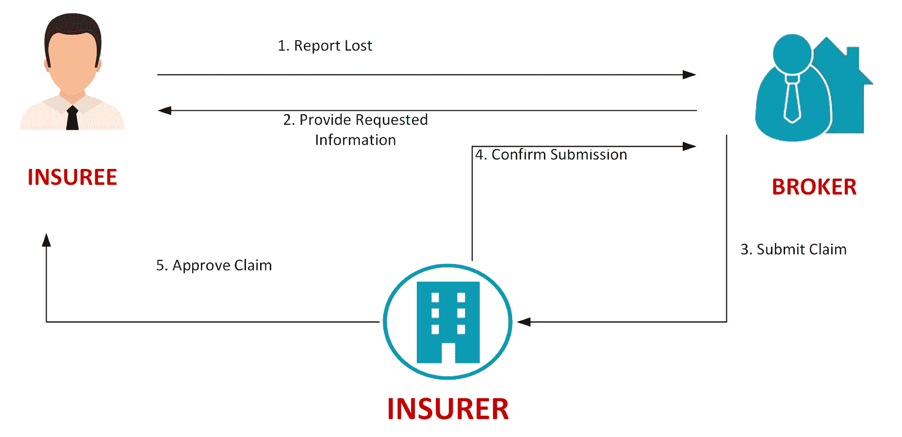

对于上述流程，步骤如下：

1.  被保险人向经纪人报告索赔

1.  经纪人提供请求的信息

1.  经纪人向发行人提交索赔

1.  发行人确认索赔

1.  发行人处理并批准索赔

# 配置Hyperledger Fabric环境

到目前为止，我们已经了解了Hyperledger Fabric的关键概念。在本节中，我们将建立一个Hyperledger Fabric开发环境。在继续进行安装步骤之前，让我们看一下fabric安装的先决条件。

# 安装先决条件

安装所需的开发工具的先决条件如下：

| Ubuntu Linux 14.04 / 16.04 LTS（均为64位），或 macOS 10.12 | Docker Engine：版本17.03或更高 |
| --- | --- |
| Docker-Compose：版本1.8或更高 | Node：8.9或更高（注意不支持9版本） |
| npm：v5.x | git：2.9.x或更高 |
| Python：2.7.x |  |

我们将在开发环境中使用Ubuntu。我们可以使用以下命令下载先决条件：

```
curl -O https://hyperledger.github.io/composer/latest/prereqs-ubuntu.sh
chmod u+x prereqs-ubuntu.sh
./prereqs-ubuntu.sh
```

它可能在执行过程中提示您输入密码，因为它在执行过程中使用了`sudo`。

# 安装Hyperledger Fabric

创建并转到名为`insurance-claim`的项目文件夹，如下所示：

```
mkdir ~/insurance-claim && cd ~/insurance-claim
```

输入以下命令以安装Hyperledger Fabric特定于平台的二进制文件：

```
curl -sSL https://raw.githubusercontent.com/hyperledger/fabric/release-1.3/scripts/bootstrap.sh | bash
```

执行此命令后，它会在`bin`文件夹中下载以下特定于平台的二进制文件，该文件夹位于`fabric-samples`文件夹下。您可以将`fabric-samples/bin`设置为`PATH`变量，如下所示：

```
export PATH=<path to download location>/bin:$PATH
```

我们还从本书的代码文件中提供 `bootstrap-hyperledger.sh`，您可以从 Packt 网站下载。一旦获得文件，您可以直接运行以下脚本，它将创建一个 bin 文件夹并将二进制文件下载到此文件夹中：

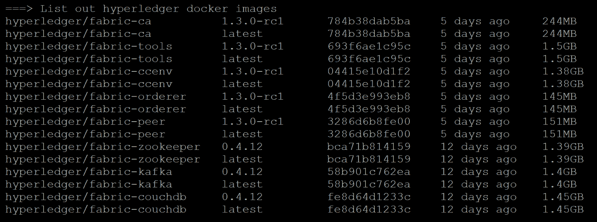

这些组件将成为我们的 Hyperledger Fabric 网络的一部分。

# 编写链码

Chaincode 类似于*智能合约*。它定义并执行由特定网络中的授权参与者调用的业务逻辑。链码是用 Go 或 Node.js 编写的。在我们的示例中，我们将使用 Go。

有许多 IDE 和工具支持 Golang。以下是一些与 Golang 配合得很好的流行 IDE。

# 开发工具

有各种工具支持 Go 开发。一些流行的 IDE 在以下部分列出。

# LiteIDE

LiteIDE 是专为 Golang 设计的开源 Go IDE。有许多适用于 Go 开发人员的有用功能，包括可配置的代码编辑器、自定义构建命令、许多构建选项和 Golang 支持。

# JetBrains Gogland

Gogland 拥有强大的内置自动完成引擎、错误检测、代码重构工具等等。

# Visual Studio Code

您可以在 Visual Studio Code 中安装 Go 扩展。它提供代码提示和调试代码的能力。

在本章中，我们将使用 LiteIDE 来开发我们的链码。请按照官方 LiteIDE 安装指南设置您的本地 IDE 环境，该指南可从以下链接获取：

[https://github.com/visualfc/liteide/blob/master/liteidex/deploy/welcome/en/install.md](https://github.com/visualfc/liteide/blob/master/liteidex/deploy/welcome/en/install.md).

# Chaincode 关键概念和 API

Fabric 链码中有三个重要的函数：`Init`、`Invoke`、`Query`。每个链码程序都必须实现链码接口，如下所示：

```
type Chaincode interface {
    Init(stub ChaincodeStubInterface) pb.Response
    Invoke(stub ChaincodeStubInterface) pb.Response
}
```

`Init()`在应用程序初始化其内部数据以供其他链码函数使用时被调用。当链码接收到实例化或升级事务时，它将被触发。

当应用程序客户端提出更新或查询事务时，将调用`Invoke()`函数。

当链码查询链码状态时，将调用`Query()`。Hyperledger Fabric 使用 LevelDB（键值存储）作为存储 world;state 数据的默认数据库。您可以使用键来获取当前账本状态数据。查询函数通过传入键值读取链码状态的值。

shim 包提供了用于链码访问其状态变量、事务上下文和调用其他链码的 API。

`ChaincodeStubInterface` 是其中一个重要的接口。它提供了各种函数，让您可以查询、更新和删除账本中的资产。这些函数如下所示：

| `GetState(key string) ([]byte, error)` | `GetState` 函数从账本中返回指定键的值。 |
| --- | --- |
| `PutState(key string, value []byte) error` | `PutState`将指定的键和值放入交易的写集作为数据写提案 |
| `DelState(key string) error` | `DelState`记录了交易提案的写集中将要删除的指定键 |

# 定义发行理赔

让我们写一段链码。打开LiteIDE并创建一个名为`claimcontract.go`的新文件，如下所示：

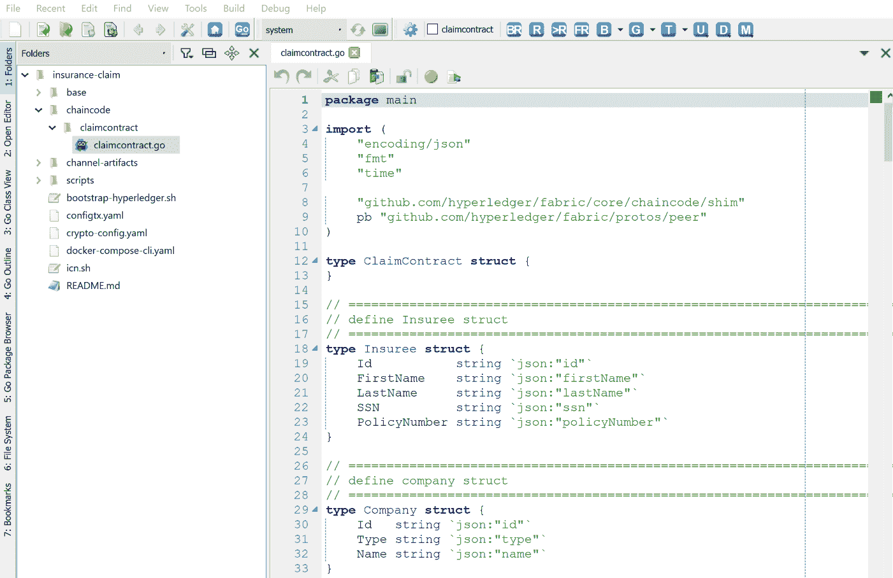

在保险理赔使用案例分析中，我们分析了发行理赔流程中的参与者。我们需要定义一个链码的参与者有三个：被保险人、经纪人和保险人，如下例所示：

```
type Insuree struct {
         Id           string `json:"id"`
         FirstName    string `json:"firstName"`
         LastName     string `json:"lastName"`
         SSN          string `json:"ssn"`
         PolicyNumber string `json:"policyNumber"`
}
```

在`Insuree`中，我们定义了`Id`、`firstname`、`LastName`、`SSN`和`policyNumber`。

在Go语言中，字段名的第一个字母可以是大写或小写。当我们需要一个导出字段对任何代码使用时，它需要是一个大写字母。你可以使用JSON包中的编码将数据解析为结构体，定义JSON中的字段名为`firstName`，如下所示：

```
type Member struct {
  Name string `json:"member_name"`
}
```

经纪人和保险人的数据模型类似，只是类型不同。我们将其定义如下：

```
type Company struct {
         Id   string `json:"id"`
         Type string `json:"type"`
         Name string `json:"name"`
}
```

在发行理赔流程中，`Insuree`初始化理赔请求。理赔文件将在区块链中跟踪流程的每一步。它记录了所有必要的信息，包括状态、用户理赔描述、`insueeId`、`brokerId`、`insurerId`、每个步骤的处理时间以及授权方输入的评论，如下例所示：

```
type Claim struct {
         Id        string `json:"id"`        //the fieldtags are needed to keep case from bouncing around
         Desc      string `json:"desc"`      //claim description
         Status    string `json:"status"`    //status of claim
         InsureeId string `json:"insureeId"` //InsureeId
         BrokerId  string `json:"brokerId"`  //BrokerId
         InsurerId string `json:"insurerId"` //InsurerId
         Comment   string `json:"comment"`   //comment
         ProcessAt string `json:"processAt"` //processAt
}
```

# 初始化链码

接下来，我们将实现`Init`函数。`Init()`允许链码初始化被保险人数据以开始理赔请求。在我们的情况下，我们将设置并注册被保险人的个人信息，如下所示：

```
func (c *ClaimContract) Init(stub shim.ChaincodeStubInterface) pb.Response {
         args := stub.GetStringArgs()
         if len(args) != 5 {
                 return shim.Error("Incorrect arguments. Expecting a key and a value")
         }
         insureeId := args[0]
         firstName := args[1]
         lastName := args[2]
         ssn := args[3]
         policyNumber := args[4]
         insureeData := Insuree{
                 Id:           insureeId,
                 FirstName:    firstName,
                 LastName:     lastName,
                 SSN:          ssn,
                 PolicyNumber: policyNumber}
         insureeBytes, _ := json.Marshal(insureeData)
         err := stub.PutState(insureeId, insureeBytes)
         if err != nil {
                 return shim.Error(fmt.Sprintf("Failed to create asset: %s", args[0]))
         }
         return shim.Success(nil)
}
```

`ChaincodeStubInterface.GetStringArg`获取输入参数。它期望参数的长度应为5。拥有所有必需的保险人数据后，我们构建保险人JSON数据，并将其编码为JSON字节字符串–`json.Marshal(insureeData)`。然后，我们将键和值存储在分类账上。如果一切顺利，它将返回一个成功的`peer.Response`对象给Fabric的`client.c`。

# 调用链码

要触发调用函数，可以调用链码应用函数的名称，并将`shim.ChaincodeStubInterface`作为签名传递。在保险理赔案例中，我们定义了几个函数来支持我们的用例，例如：

`AddCompany`, `ReportLost`, `RequestedInfo`, `SubmitClaim`, `ConfirmClaimSubmission`, `ApproveClaim`.

我们还定义了一个查询来跟踪当前理赔请求和`getHistory`来获取所有历史理赔交易记录，如下所示：

```
func (c *ClaimContract) Invoke(stub shim.ChaincodeStubInterface) pb.Response {
         function, args := stub.GetFunctionAndParameters()
         if function == "AddCompany" {
                 return c.AddCompany(stub, args)
         } else if function == "ReportLost" {
                 return c.ReportLost(stub, args)
         } else if function == "RequestedInfo" {
                 return c.RequestedInfo(stub, args)
         } else if function == "SubmitClaim" {
                 return c.SubmitClaim(stub, args)
         } else if function == "ConfirmClaimSubmission" {
                 return c.ConfirmClaimSubmission(stub, args)
         } else if function == "ApproveClaim" {
                 return c.ApproveClaim(stub, args)
         } else if function == "query" {
                 return c.query(stub, args)
         } else if function == "getHistory" {
                 return c.getHistory(stub, args)
         }

         return shim.Error("Invalid function name")
}
```

# AddCompany

`AddCompany`类似于我们在初始化步骤添加被保险人的方式。链码可以通过此函数注册经纪人和保险人。公司类型可以是*经纪人*或*保险人*，如下所示：

```
func (c *ClaimContract) AddCompany(stub shim.ChaincodeStubInterface, args []string) pb.Response {
         id := args[0]
         name := args[1]
         companyType := args[2]
         companyData := Company{
                 Id:   id,
                 Type: companyType,
                 Name: name}
         companyBytes, _ := json.Marshal(companyData)
         stub.PutState(id, companyBytes)
         return shim.Success(companyBytes)
}
```

# 报告丢失

在此步骤中，投保人向经纪人报告丢失物品，并提供所有索赔信息。此函数还在`processAt`字段记录当前系统处理时间。`currentts.Format(2006-01-02 15:04:05)`是一个Go自定义格式；它将当前时间转换为YYYY-MM-dd hh:mm:ss格式，如以下示例所示：

```
func (c *ClaimContract) ReportLost(stub shim.ChaincodeStubInterface, args []string) pb.Response {
         claimId := args[0]
         desc := args[1]
         insureeId := args[2]
         brokerId := args[3]
         currentts := time.Now()
         processAt := currentts.Format("2006-01-02 15:04:05")
         //initialized claim
         claimData := Claim{
                 Id:        claimId,
                 Desc:      desc,
                 Status:    "ReportLost",
                 InsureeId: insureeId,
                 BrokerId:  brokerId,
                 InsurerId: "",
                 Comment:   "",
                 ProcessAt: processAt}
         claimBytes, _ := json.Marshal(claimData)
         stub.PutState(claimId, claimBytes)
         return shim.Success(claimBytes)
}
```

# RequestedInfo

投保人报告损失后，下一步是经纪人返回`RequestedInfo`，如下所示：

```
func (c *ClaimContract) RequestedInfo(stub shim.ChaincodeStubInterface, args []string) pb.Response {
         return c.UpdateClaim(stub, args, "RequestedInfo")
}
func (c *ClaimContract) UpdateClaim(stub shim.ChaincodeStubInterface, args []string, currentStatus string) pb.Response {
         claimId := args[0]
         comment := args[1]
         claimBytes, err := stub.GetState(claimId)
         claim := Claim{}
         err = json.Unmarshal(claimBytes, &claim)
         if err != nil {
                 return shim.Error(err.Error())
         }
         if currentStatus == "RequestedInfo" && claim.Status != "ReportLost" {
                 claim.Status = "Error"
                 fmt.Printf("Claim is not initialized yet")
                 return shim.Error(err.Error())
         } else if currentStatus == "SubmitClaim" && claim.Status != "RequestedInfo" {
                 claim.Status = "Error"
                 fmt.Printf("Claim must be in RequestedInfo status")
                 return shim.Error(err.Error())
         } else if currentStatus == "ConfirmClaimSubmission" && claim.Status != "SubmitClaim" {
                 claim.Status = "Error"
                 fmt.Printf("Claim must be in Submit Claim status")
                 return shim.Error(err.Error())
         } else if currentStatus == "ApproveClaim" && claim.Status != "ConfirmClaimSubmission" {
                 claim.Status = "Error"
                 fmt.Printf("Claim must be in Confirm Claim Submission status")
                 return shim.Error(err.Error())
         }
         claim.Comment = comment
         if currentStatus == "RequestedInfo" {
                 insurerId := args[2]
                 claim.InsurerId = insurerId
         }
         currentts := time.Now()
         claim.ProcessAt = currentts.Format("2006-01-02 15:04:05")
         claim.Status = currentStatus
         claimBytes0, _ := json.Marshal(claim)
         err = stub.PutState(claimId, claimBytes0)
         if err != nil {
                 return shim.Error(err.Error())
         }
         return shim.Success(claimBytes0)
}
```

由于剩余的流程函数非常相似，我们将`UpdateClaim`定义为一个通用函数，与剩余步骤共享。

`UpdateClaim`函数首先从输入参数中获取`claimId`和当前参与者评论。然后，它查询并从区块链中获取索赔以解码索赔数据，并将其转换为JSON字符串—`json.Unmarshal(claimBytes, &claim)`。

在更新索赔内容之前，它将验证输入的索赔状态并确保其处于预期步骤上。如果一切顺利，我们将更新索赔状态、参与者评论和处理时间。

最后，我们使用`claimId`作为键在账本上更新索赔数据。

# 提交索赔，确认提交索赔，批准索赔

提交、确认和批准索赔与`RequestedInfo`非常相似，并且这些步骤由`UpdateClaim`函数调用。只有评论、状态和处理时间值不同。

# 查询

查询是您从分类帐中读取数据的方式。查询函数用于查询链码的状态。由于我们将索赔数据存储在以`claimId`为键的分类帐中，为了读取当前索赔，我们调用`GetState`，传递`claimId`作为键，如下所示：

```
func (c *ClaimContract) query(stub shim.ChaincodeStubInterface, args []string) pb.Response {
         var ENIITY string
         var err error
         if len(args) != 1 {
                 return shim.Error("Incorrect number of arguments. Expected ENIITY Name")
         }
         ENIITY = args[0]
         Avalbytes, err := stub.GetState(ENIITY)         if err != nil {
                 jsonResp := "{\"Error\":\"Failed to get state for " + ENIITY + "\"}"
                 return shim.Error(jsonResp)
         }
         if Avalbytes == nil {
                 jsonResp := "{\"Error\":\"Nil order for " + ENIITY + "\"}"
                 return shim.Error(jsonResp)
         }
         return shim.Success(Avalbytes)
}
```

# getHistory

正如其名称所示，`gethistory`函数读取一个键的所有历史值记录的索赔，以及`TxId`和索赔值。

首先我们定义了`AuditHistory`结构，其中包含`TxId`和值。`GetHistoryForKey`通过`resultsIterator`返回结果列表，其中包含所有历史交易记录。我们遍历这些记录并将它们添加到一个`AuditHistory`数组中。后来，我们将其转换为JSON字节并作为响应发送回来，如下所示：

```
func (c *ClaimContract) getHistory(stub shim.ChaincodeStubInterface, args []string) pb.Response {
         type AuditHistory struct {
                 TxId  string `json:"txId"`
                 Value Claim  `json:"value"`
         }
         var history []AuditHistory
         var claim Claim
         if len(args) != 1 {
                 return shim.Error("Incorrect number of arguments. Expecting 1")
         }
         claimId := args[0]
         fmt.Printf("- start getHistoryForClaim: %s\n", claimId)

         // Get History
         resultsIterator, err := stub.GetHistoryForKey(claimId)
         if err != nil {
                 return shim.Error(err.Error())
         }
         defer resultsIterator.Close()

         for resultsIterator.HasNext() {
                 historyData, err := resultsIterator.Next()
                 if err != nil {
                          return shim.Error(err.Error())
                 }
                 var tx AuditHistory
                 tx.TxId = historyData.TxId
                 json.Unmarshal(historyData.Value, &claim)
                 tx.Value = claim              //copy claim over
                 history = append(history, tx) //add this tx to the list
         }
         fmt.Printf("- getHistoryForClaim returning:\n%s", history)

         //change to array of bytes
         historyAsBytes, _ := json.Marshal(history) //convert to array of bytes
         return shim.Success(historyAsBytes)
}
```

这涵盖了我们的发行索赔链码。我们将在下一节学习有关Hyperledger Fabric配置的信息。

# 配置Hyperledger Fabric

保险索赔网络中有三个实体—投保人、经纪人和保险公司。所有这些参与者都将在Fabric中注册为对等节点。以下表格描述了三个对等角色和MSP信息：

| **用户ID** | **角色** | **组织MSP ID** |
| --- | --- | --- |
| `user_001` | 投保人 | Org1MSP |
| `broker_001` | 经纪人 | Org2MSP |
| `insurer_001` | 保险公司 | Org3MSP |

我们有一个保险人加入了具有 MSP ID org1 的组织，一个经纪人加入了具有 MSP ID org2 的组织，以及一个保险人加入了具有 MSP ID org3 的组织。为了引导 fabric 网络，我们需要首先为我们需要运行的三个组件生成加密材料。

# 生成证书

我们需要定义 `crypto-config.yaml` 并使用 cryptogen 工具为每个节点生成证书。Cryptogen 可在工具镜像中获得。`crypto-config.yaml` 包含以下信息：

+   **OrdererOrgs**：管理排序节点的组织定义

+   **PeerOrgs**：管理对等节点的组织定义

OrdererOrgs 包含关于集群中排序节点的以下信息：

+   **名称**：订单者的名称

+   **域**：订单者的域 URL；在我们的案例中，它是 ic.com

+   **主机名**：订单者的主机名

这里是一个例子：

```
OrdererOrgs:
  - Name: Orderer
    Domain: ic.com
    Specs:
      - Hostname: orderer
```

PeerOrgs 包含关于集群中对等节点的以下信息：

+   **名称**：组织的名称；我们有三个不同的组织：`Org1`、`Org2` 和 `Org3`

+   **模板计数**：组织的节点数

+   **用户计数**：组织的用户数

这里是一个例子：

```
PeerOrgs:
  # ---------------------------------------------------------------------------
  # Org1
  # ---------------------------------------------------------------------------
  - Name: Org1
    Domain: org1.ic.com
    Template:
      Count: 2
    Users:
      Count: 1
  # ---------------------------------------------------------------------------
  # Org2
  # ---------------------------------------------------------------------------
  - Name: Org2
    Domain: org2.ic.com
    Template:
      Count: 2
    Users:
      Count: 1
  # ---------------------------------------------------------------------------
  # Org3
  # ---------------------------------------------------------------------------
  - Name: Org3
    Domain: org3.ic.com
    Template:
      Count: 2
    Users:
      Count: 1
```

以下是用于生成加密材料的命令：

```
cryptogen generate --config=./crypto-config.yaml
```

运行 cryptogen 工具后，您应该在控制台上看到以下输出：

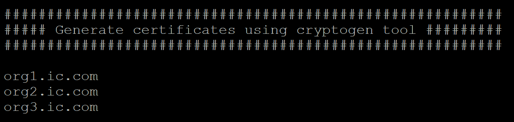

# 生成订单者创世区块

生成证书后，该过程的下一步是生成订单者创世区块。`configtxgen` 命令允许用户创建和检查通道配置。`configtxgen` 工具的输出主要由 `configtx.yaml` 的内容控制，如下所示：

```
Profiles:
    ICOrgsOrdererGenesis:
        Orderer:
            <<: *OrdererDefaults
            Organizations:
                - *OrdererOrg
        Consortiums:
            InsuranceClaimConsortium:
                Organizations:
                    - *Org1
                    - *Org2
                    - *Org3
    ICOrgsChannel:
        Consortium: InsuranceClaimConsortium
        Application:
            <<: *ApplicationDefaults
            Organizations:
                - *Org1
                - *Org2
                - *Org3
Organizations:
    - &OrdererOrg
        Name: OrdererOrg
        ID: OrdererMSP
        MSPDir: crypto-config/ordererOrganizations/ic.com/msp
    - &Org1
        Name: Org1MSP
        ID: Org1MSP
        MSPDir: crypto-config/peerOrganizations/org1.ic.com/msp
        AnchorPeers:
            - Host: peer0.org1.ic.com
              Port: 7051
    - &Org2
        Name: Org2MSP
        ID: Org2MSP
        MSPDir: crypto-config/peerOrganizations/org2.ic.com/msp
        AnchorPeers:
            - Host: peer0.org2.ic.com
              Port: 7051         
    - &Org3
        Name: Org3MSP
        ID: Org3MSP
        MSPDir: crypto-config/peerOrganizations/org3.ic.com/msp

        AnchorPeers:
            - Host: peer0.org3.ic.com
              Port: 7051              
Orderer: &OrdererDefaults
    OrdererType: solo
    Addresses:
        - orderer.ic.com:7050
    BatchTimeout: 2s
    BatchSize:
        MaxMessageCount: 10
        AbsoluteMaxBytes: 20 MB
        PreferredMaxBytes: 512 KB
    Kafka:
        Brokers:
            - 127.0.0.1:9092
    Organizations:
Application: &ApplicationDefaults

    Organizations:
```

我们在 `configtx` 文件的 `Organizations` 部分定义了三个组织；我们指定了每个组织的名称、`ID`、`MSPDir` 和 `AnchorPeers`。`MSPDir` 描述了 cryptogen 生成的输出 MSP 目录。`AnchorPeers` 指向节点的主机和端口。它更新事务以便在不同组织的节点之间启用通信，并找到通道的所有活动参与者，如下所示：

```
configtxgen -profile ICOrgsOrdererGenesis -outputBlock ./channel-artifacts/genesis.block
```

类似以下的输出将显示在控制台上：

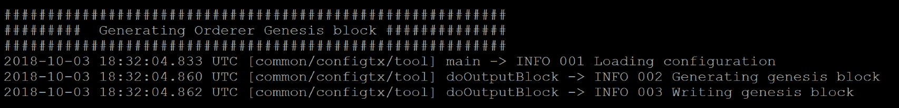

# 生成通道配置事务

`configtxgen` 通过执行通道配置事务将通道创建事务写入 `channel.tx`，如下所示：

```
configtxgen -profile ICOrgsChannel -outputCreateChannelTx ./channel-artifacts/channel.tx -channelID icchannel
```

类似以下的输出将显示在控制台上：

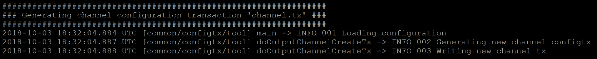

执行通道配置事务的输出

# Hyperledger Fabric Docker 组合器配置文件概述

Hyperledger Fabric 利用 Docker compose 来定义 fabric 应用服务。`docker-compose-cli.yaml` 服务部分是定义所有对等服务和相关容器的地方。Hyperledger Fabric 的 *first-network* 提供了一个 `.yaml` 模板，帮助您快速开始从头创建 yaml 文件：

[https://github.com/hyperledger/fabric-samples/tree/release-1.2/first-network](https://github.com/hyperledger/fabric-samples/tree/release-1.2/first-network)。

在 `docker-compose-cli.yaml` 中，我们定义了以下信息：

+   `networks`：定义区块链网络名称。在我们的案例中，它是 `icn`。

+   `services`：定义所有对等服务和相关 Docker 容器

+   `cli`：定义了用于替代 SDK 客户端的 Cli 容器，并设置了 Docker compose 命令行行为的环境变量

这是网络和服务部分的示例配置：

```
networks:
  icn:
services:
  orderer.ic.com:
    extends:
      file:   base/docker-compose-base.yaml
      service: orderer.ic.com
    container_name: orderer.ic.com
    networks:
      - icn
  peer0.org1.ic.com:
    container_name: peer0.org1.ic.com
    extends:
      file:  base/docker-compose-base.yaml
      service: peer0.org1.ic.com
    networks:
      - icn
```

如您所见，有一个文件扩展目录：`base/docker-compose-base.yaml`。Docker compose 支持使用 *extends* 字段为单个服务共享公共配置。我们稍后会详细讨论 `docker-compose-base.yaml`。

这是 `cli` 部分的配置示例：

```
cli:
    container_name: cli
    image: hyperledger/fabric-tools
    tty: true
    environment:
      - GOPATH=/opt/gopath
      - CORE_VM_ENDPOINT=unix:///host/var/run/docker.sock
      - CORE_LOGGING_LEVEL=DEBUG
      - CORE_PEER_ID=cli
      - CORE_PEER_ADDRESS=peer0.org1.ic.com:7051
      - CORE_PEER_LOCALMSPID=Org1MSP
      - CORE_PEER_TLS_ENABLED=true
      - CORE_PEER_TLS_CERT_FILE=/opt/gopath/src/github.com/hyperledger/fabric/peer/crypto/peerOrganizations/org1.ic.com/peers/peer0.org1.ic.com/tls/server.crt
      - CORE_PEER_TLS_KEY_FILE=/opt/gopath/src/github.com/hyperledger/fabric/peer/crypto/peerOrganizations/org1.ic.com/peers/peer0.org1.ic.com/tls/server.key
      - CORE_PEER_TLS_ROOTCERT_FILE=/opt/gopath/src/github.com/hyperledger/fabric/peer/crypto/peerOrganizations/org1.ic.com/peers/peer0.org1.ic.com/tls/ca.crt
      - CORE_PEER_MSPCONFIGPATH=/opt/gopath/src/github.com/hyperledger/fabric/peer/crypto/peerOrganizations/org1.ic.com/users/Admin@org1.ic.com/msp
    working_dir: /opt/gopath/src/github.com/hyperledger/fabric/peer
    command: /bin/bash -c './scripts/script.sh ${CHANNEL_NAME} ${DELAY}; sleep $TIMEOUT'
    #for mapping the directories that are being used in the environment configurations
    volumes:
        - /var/run/:/host/var/run/
        - ./chaincode/:/opt/gopath/src/github.com/chaincode
        - ./crypto-config:/opt/gopath/src/github.com/hyperledger/fabric/peer/crypto/
        - ./scripts:/opt/gopath/src/github.com/hyperledger/fabric/peer/scripts/
        - ./channel-artifacts:/opt/gopath/src/github.com/hyperledger/fabric/peer/channel-artifacts
    depends_on:
      - orderer.ic.com
      - peer0.org1.ic.com
      - peer0.org2.ic.com
      - peer0.org3.ic.com
    networks:
      - icn
```

`docker-compose` 工具使用 `docker-compose-cli.yaml` 文件来初始化 fabric 运行时环境。以下是在使用 `docker-compose-cli.yaml` 文件时您将使用的一些最常见的命令：

| `TTY` | TTY 基本上意味着 *控制台*，我们将其设置为 true。 |
| --- | --- |
| `Image` | 指向 fabric-tools 图像目录。 |
| `Environment` | 指定环境变量，例如 GOPATH，由 cryptogen 工具生成的与 TLS 相关的文件位置。 |
| `working_dir` | 设置了对等体的工作目录。 |
| `command` | 指定容器启动时发出的命令。 |
| `volumes` | 映射了在环境配置中使用的目录。 |
| `depends_on` | 按依赖顺序启动服务。 |

然后生成四个 fabric-peer 事务节点容器，一个 fabric-order 订单节点容器和一个 fabric-tools cli 容器。

# Fabric 项目目录结构

在我们的 Fabric 示例 first-network 中，项目结构类似于以下内容：

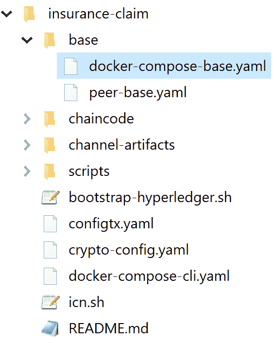

正如我们之前讨论的，`docker-compose-cli.yaml` 服务是从 `base/docker-compose-base.yaml` 继承的。有两个文件基目录：`peer-base.yaml` 和 `docker-compose-base.yaml`。

# Docker-compose-base.yaml

此文件包含基本配置，包括每个对等体和订单容器的环境和端口号。这定义了保险索赔网络的整体拓扑，如下：

```
services:
  orderer.ic.com:
    container_name: orderer.ic.com
    image: hyperledger/fabric-orderer
    environment:
      - ORDERER_GENERAL_LOGLEVEL=debug
      - ORDERER_GENERAL_LISTENADDRESS=0.0.0.0
      - ORDERER_GENERAL_GENESISMETHOD=file
      - ORDERER_GENERAL_GENESISFILE=/var/hyperledger/orderer/orderer.genesis.block
      - ORDERER_GENERAL_LOCALMSPID=OrdererMSP
      - ORDERER_GENERAL_LOCALMSPDIR=/var/hyperledger/orderer/msp
      # enabled TLS
      - ORDERER_GENERAL_TLS_ENABLED=true
      - ORDERER_GENERAL_TLS_PRIVATEKEY=/var/hyperledger/orderer/tls/server.key
      - ORDERER_GENERAL_TLS_CERTIFICATE=/var/hyperledger/orderer/tls/server.crt
      - ORDERER_GENERAL_TLS_ROOTCAS=[/var/hyperledger/orderer/tls/ca.crt]
    working_dir: /opt/gopath/src/github.com/hyperledger/fabric
    command: orderer
    volumes:
    - ../channel-artifacts/genesis.block:/var/hyperledger/orderer/orderer.genesis.block
    - ../crypto-config/ordererOrganizations/ic.com/orderers/orderer.ic.com/msp:/var/hyperledger/orderer/msp
    - ../crypto-config/ordererOrganizations/ic.com/orderers/orderer.ic.com/tls/:/var/hyperledger/orderer/tls
    ports:
      - 7050:7050

  peer0.org1.ic.com:
    container_name: peer0.org1.ic.com
    extends:
      file: peer-base.yaml
      service: peer-base
    environment:
      - CORE_PEER_ID=peer0.org1.ic.com
      - CORE_PEER_ADDRESS=peer0.org1.ic.com:7051
      - CORE_PEER_GOSSIP_EXTERNALENDPOINT=peer0.org1.ic.com:7051
      - CORE_PEER_LOCALMSPID=Org1MSP
    volumes:
        - /var/run/:/host/var/run/
        - ../crypto-config/peerOrganizations/org1.ic.com/peers/peer0.org1.ic.com/msp:/etc/hyperledger/fabric/msp
        - ../crypto-config/peerOrganizations/org1.ic.com/peers/peer0.org1.ic.com/tls:/etc/hyperledger/fabric/tls
    ports:
      - 7051:7051
      - 7053:7053
…..
```

# Peer-base.yaml

这个文件为保险索赔 `docker-compose-base.yaml` 定义了对等网络配置，如下：

```
services:
  peer-base:
    image: hyperledger/fabric-peer
    environment:
      - CORE_VM_ENDPOINT=unix:///host/var/run/docker.sock
      - CORE_VM_DOCKER_HOSTCONFIG_NETWORKMODE=${COMPOSE_PROJECT_NAME}_icn
      - CORE_LOGGING_LEVEL=DEBUG
      - CORE_PEER_TLS_ENABLED=true
      - CORE_PEER_GOSSIP_USELEADERELECTION=true
      - CORE_PEER_GOSSIP_ORGLEADER=false
      - CORE_PEER_PROFILE_ENABLED=true
      - CORE_PEER_TLS_CERT_FILE=/etc/hyperledger/fabric/tls/server.crt
      - CORE_PEER_TLS_KEY_FILE=/etc/hyperledger/fabric/tls/server.key
      - CORE_PEER_TLS_ROOTCERT_FILE=/etc/hyperledger/fabric/tls/ca.crt
    working_dir: /opt/gopath/src/github.com/hyperledger/fabric/peer
    command: peer node start
```

在对等体中的命令让对等体安装系统链码和其他配置。

我们了解了关键的 Hyperledger Fabric 配置文件的概述，所以让我们使用以下代码启动我们的保险索赔网络：

```
      - CORE_PEER_TLS_KEY_FILE=/etc/hyperledger/fabric/tls/server.key
      - CORE_PEER_TLS_ROOTCERT_FILE=/etc/hyperledger/fabric/tls/ca.crt
    working_dir: /opt/gopath/src/github.com/hyperledger/fabric/peer
    command: peer node start
```

# 启动 Hyperledger Fabric 网络

现在，是时候启动我们的 Hyperledger Fabric 网络了。我们将使用 Docker 命令来初始化新的 Docker 组合：

```
docker-compose -f docker-compose-cli.yaml up
```

Docker 容器将触发在 `docker-compose-cli.yaml` 中定义的命令，如下所示：

```
command: /bin/bash -c './scripts/script.sh
```

`script.sh` 是一个包含一系列用于部署和测试命令的脚本。我们还在 `utils.sh` 中定义了一些业务特定的 shell 脚本函数。

# 创建一个通道

首先，我们需要创建一个通道以构建创世块。运行以下命令：

```
peer channel create -o orderer.ic.com:7050 -c icchannel -f ./channel-artifacts/channel.tx
```

这个命令从 `channel.tx` 中读取一个创世块，然后用于加入通道并创建 `icchannel` 通道。这是控制台上的结果：

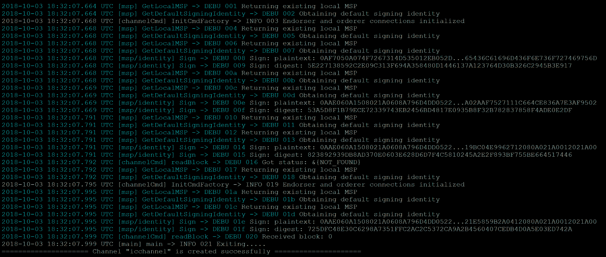

控制台的输出，加入并创建通道

# 加入通道

在订购服务创建通道之后，我们可以将对等节点添加到通道中，如下所示：

```
peer channel join -b icchannel.block
```

这是控制台上的结果：

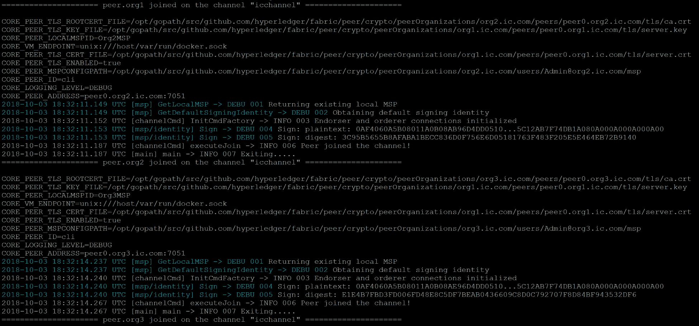

将对等节点添加到通道中

我们可以看到 `peer0.org1`、`peer0.org2` 和 `peer0.org3` 加入了通道。

# 更新锚点

在我们开始与我们的发行索赔网络进行交互之前，我们需要完成的最后一个操作是更新锚定对等点。锚定对等点接收并广播事务更新给组织中的其他对等点。锚定对等点在网络中是可搜索的。因此，任何注册为锚定对等点的对等点都可以被订购对等点或任何其他对等点发现，例如：

```
peer channel update -f ./channel-artifacts/Org1MSPanchors.tx -c icchannel -o orderer.ic.com:7050 --tls true --cafile $ORDERER_CA
```

这是此步骤的控制台输出：

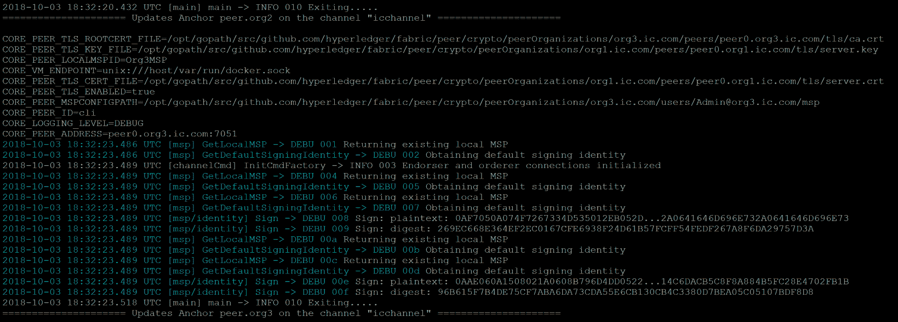

被订购对等节点或任何其他对等节点发现

# 安装链码

在之前的步骤之后，我们几乎可以使用我们的发行索赔区块链应用程序了。但是首先，我们需要在我们的网络上安装 `claimcontract.go` 链码，如下所示：

```
peer chaincode install -n iccc -v 1.0 -l golang -p github.com/chaincode/claimcontract
```

我们将看到前述命令的输出：

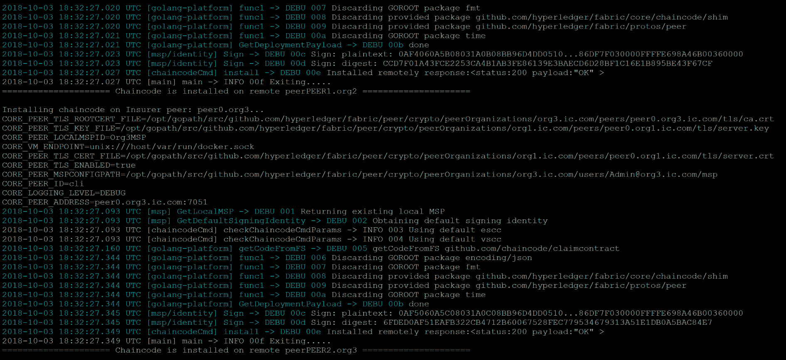

安装链码到我们的网络

# 实例化链码

在安装链码之后，我们需要实例化它。正如我们之前讨论的，我们将在 `init()` 链码中引入被保人。因此，我们需要传递必需的参数来创建一个被保人参与者，如下所示：

```
peer chaincode instantiate -o orderer.ic.com:7050 -C icchannel -n iccc -l golang -v 1.0 -c '{"Args":[ "user_001","John","Smith", "9999","4394497111/1"]}' -P "OR    ('Org1MSP.member'
```

这是此步骤的输出：

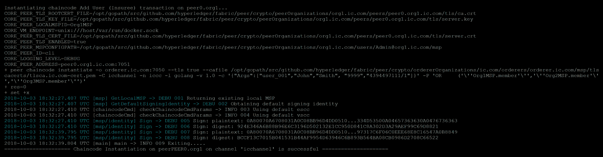

创建一个被保人参与者

我们查询被保人以验证记录是否已在区块链中创建，如下所示：

```
peer chaincode query -C $CHANNEL_NAME -n iccc -c '{"Args":["query","user_001"]}'
```

从这个输出中我们可以看到，被保人（`user_001`）已经被添加到我们的区块链中：

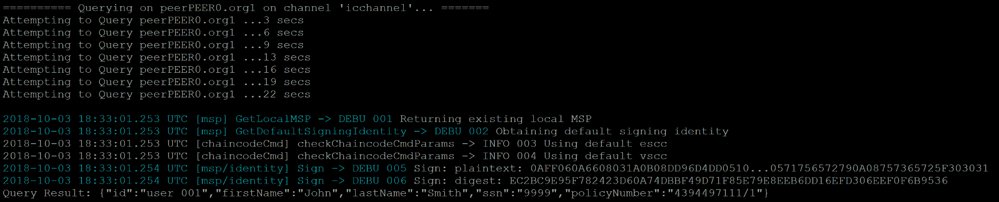

被保人添加到我们的区块链中

# 调用添加经纪人

让我们将一个经纪人加入到我们的保险索赔区块链中，如下所示：

```
peer chaincode invoke -o orderer.ic.com:7050 -C icchannel -n iccc -c '{"Args":["AddCompany","broker_001","BROKER","BNC Brokerage"]}'
```

这是结果：

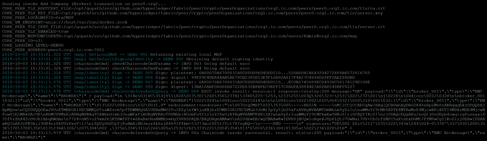

将经纪人引入我们的保险索赔区块链

# 调用添加保险商

将最后一方保险商添加到保险索赔区块链中，如下所示：

```
peer chaincode invoke -o orderer.ic.com:7050 -C icchannel -n iccc -c '{"Args":["AddCompany","insurer_001","INSURER","Western Insurance"]}'
```

显示的输出如下：

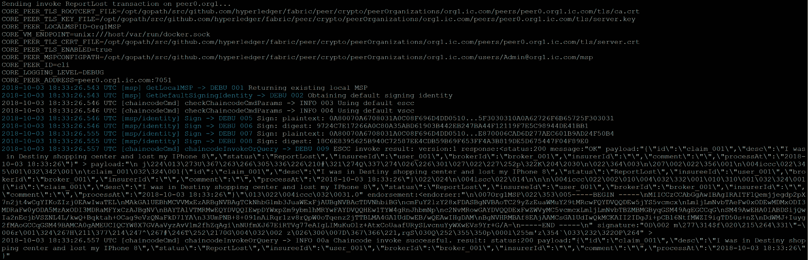

将最后一方保险商添加到保险索赔区块链中

# 调用 ReportLost

所有参与者都已加入网络，现在是开始保险索赔流程的时候了。被保险人向经纪人报告索赔，以下是调用'ReportLost'链代码的命令。

```
peer chaincode invoke -o orderer.ic.com:7050 -C icchannel -n iccc -c '{"Args":["ReportLost","claim_001", "I was in Destiny shopping center and lost my IPhone 8", "user_001", "broker_001"]}
```

将显示以下输出：

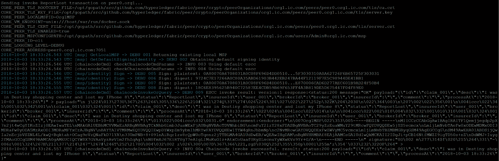

被保险人向经纪人报告索赔

# 调用 RequestedInfo

经纪人提供请求的信息，如下所示：

```
peer chaincode invoke -o orderer.ic.com:7050 -C icchannel -n iccc -c '{"Args":["RequestedInfo","claim_001", "Broker processsed user John Smith report and sent Requested Info to user.", "insurer_001"]}'
```

将显示以下输出：

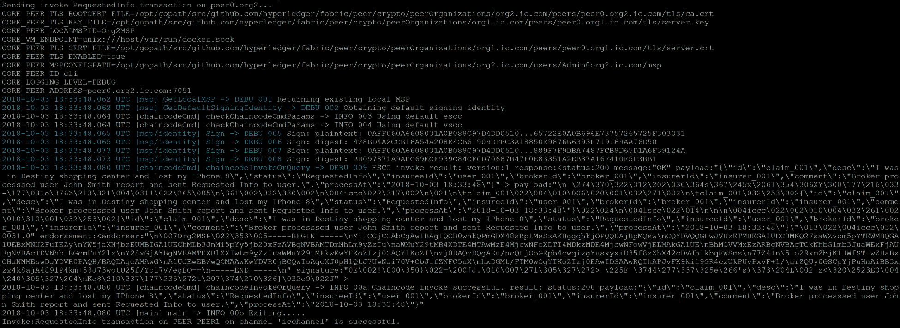

提供所请求的信息

# 调用 SubmitClaim

经纪人向发行人提交索赔，如下所示：

```
peer chaincode invoke -o orderer.ic.com:7050 -C icchannel -n iccc -c '{"Args":["SubmitClaim","claim_001", "Broker submitted a claim"]}'
```

将显示以下输出：

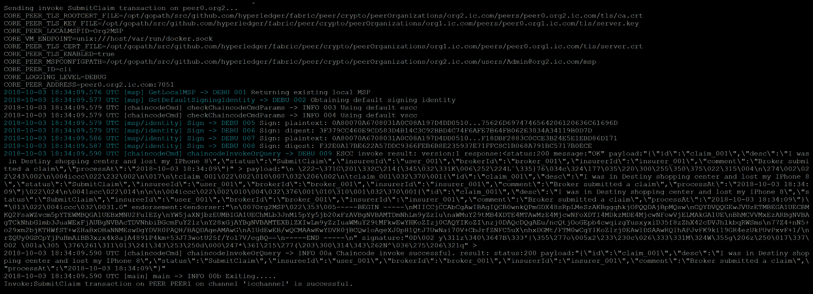

向发行人提交索赔

# 调用 ConfirmClaimSubmission

发行人确认索赔，如下所示：

```
peer chaincode invoke -o orderer.ic.com:7050 -C icchannel -n iccc -c '{"Args":["ConfirmClaimSubmission","claim_001", "Insurer received and confirmed a claim"]}'
```

将显示以下输出：

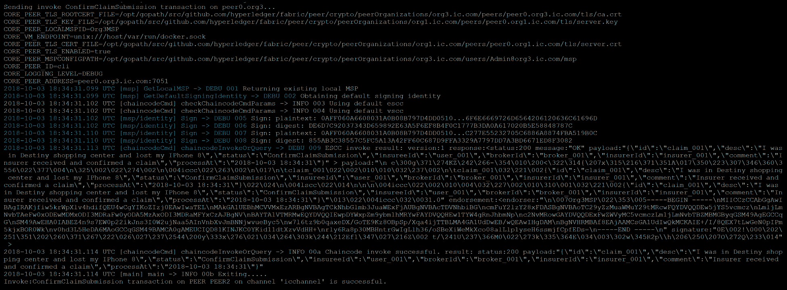

确认索赔

# 调用 ApproveClaim

发行人处理并批准索赔，如下所示：

```
peer chaincode invoke -o orderer.ic.com:7050 -C icchannel -n iccc -c '{"Args":["ApproveClaim","claim_001", "Insurer processed and approved the claim."]}'
```

将显示以下输出：

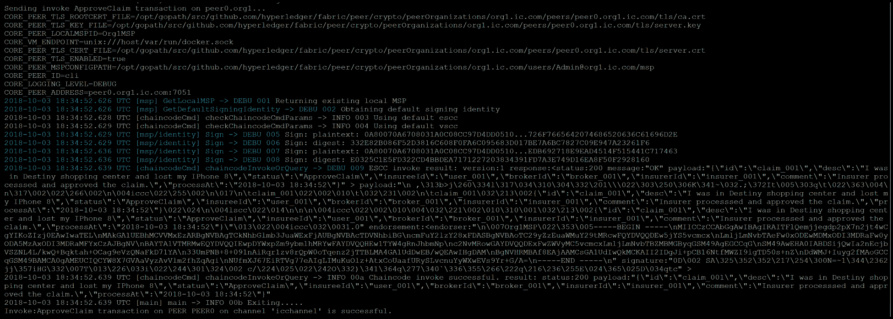

处理并批准索赔

# 查询索赔历史

在发行人批准索赔后，整个流程完成，我们可以使用Fabric API查询索赔的整个生命周期，如下所示：

```
peer chaincode query -C icchannel -n iccc -c '{"Args":["getHistory","claim_001"]}'
```

从此查询获得的输出中，我们可以看到索赔请求的整个Fabric交易历史。

测试执行结束。

# 端到端测试执行

我们已经完成了保险索赔流程的每一步。为了简化整个端到端应用程序流程，您可以导航到`insurance-claim`文件夹，然后运行以下命令：

```
cd ~/insurance-claim
#change path if insurance-claim directory is different
export PATH=/home/ubuntu/insurance-claim/bin:$PATH 
./icn.sh -m up
```

输出结果如下：

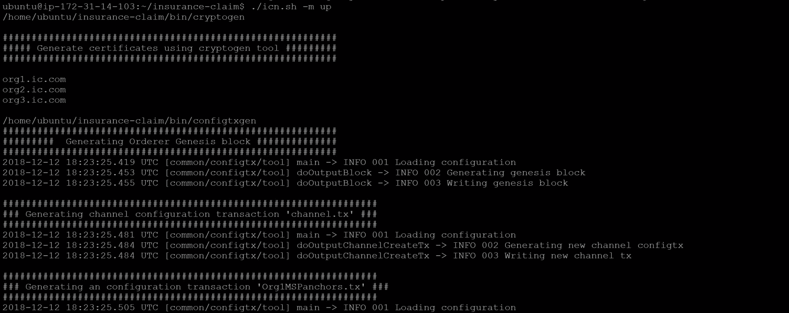

简化整个端到端应用程序流程

最终输出如下：

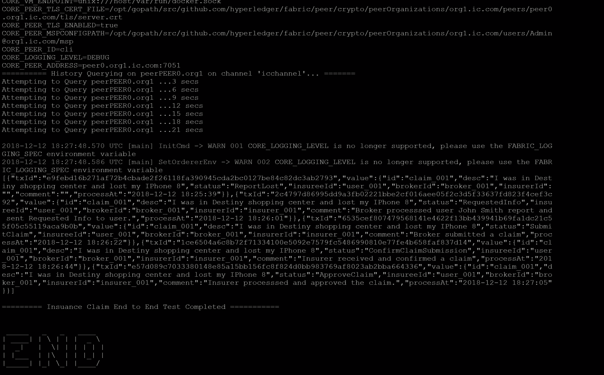

保险索赔端到端测试完成

# 摘要

在本章中，我们学习了Hyperledger Fabric的基础知识。在设置开发环境之后，我们为保险索赔用例编写了链代码。然后，我们学习了面料组合器配置。最后，我们对我们的保险索赔应用程序进行了端到端的面料测试执行。我们可以看到，使用Hyperledger Fabric实现保险索赔应用程序相当复杂。在下一章中，我们将学习如何使用Hyperledger Composer快速编写保险索赔应用程序。
