# 使用 Hyperledger Composer 实现业务网络

Hyperledger Composer 是一个高级工具集和框架，旨在快速构建和运行基于 Hyperledger Fabric 区块链的应用程序。

在前一章中我们了解了 Hyperledger Fabric，所以你已经知道开发基于 Fabric 的应用程序相当复杂，因为它需要处理许多网络级别的配置。

在本章中，我们将讨论以下主题：

+   Hyperledger Composer — 一个快速概述

+   设置 Hyperledger Composer 环境

+   分析业务场景

+   业务网络存档

+   实现业务交易功能

# Hyperledger Composer — 一个快速概述

Hyperledger Composer 是一组基于 JavaScript 的高级工具集和框架，可以简化并快速构建和运行基于 Hyperledger Fabric 区块链的应用程序。业务所有者和开发人员可以通过 composer 工具快速创建智能合约和应用程序。Composer 工具生成一个 RESTful 端点，用于与 Fabric 通道交互。与使用 Golang 编写链码不同，Composer 使用模型语言为区块链网络生成业务网络存档（`.BNA`）文件。

这是一个 Hyperledger Composer 解决方案架构的示例：

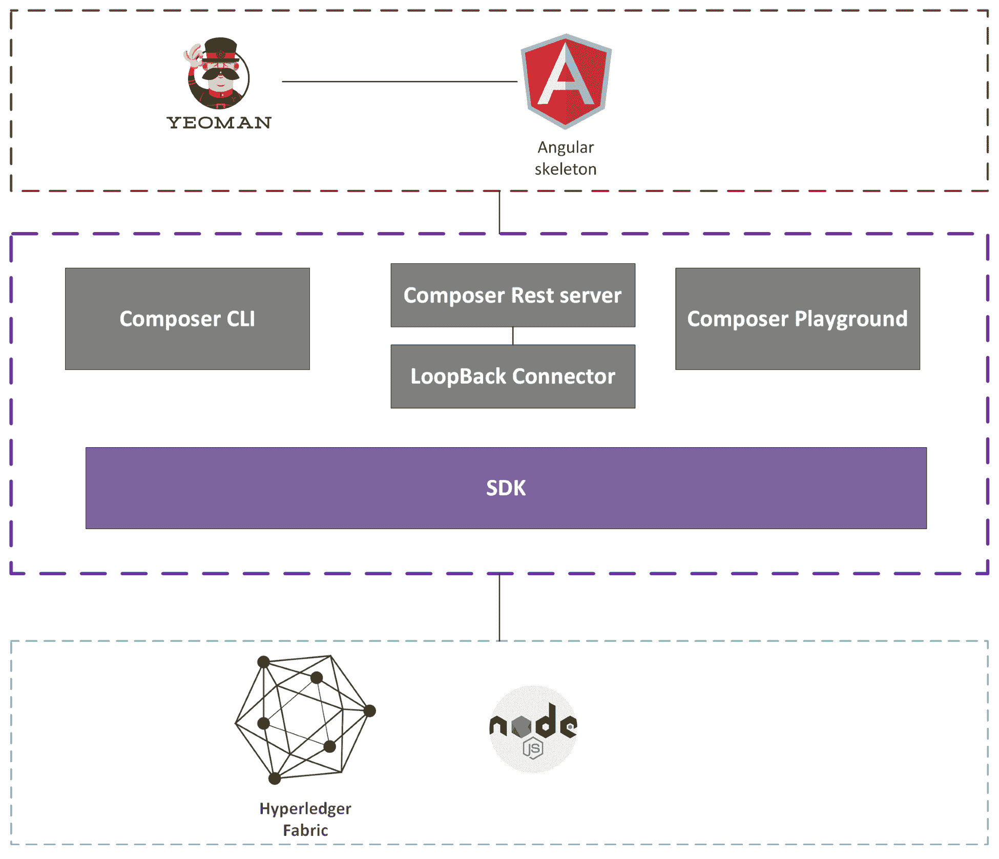

Hyperledger Composer 包含以下部分。

# Yeoman 生成器

Yeoman 中的 npm 模块 generator-hyperledger-composer 用于创建 Hyperledger Composer 的模板。它支持并生成三种不同类型的模板：

+   CLI 应用程序

+   Angular 2 应用程序

+   骨架业务网络

你可以使用 Yeoman 生成的 angular 骨架连接到 Hyperledger Composer REST 服务器。

# Composer REST 服务器

Composer 的 REST 服务器利用一个独立的 Node.js 进程，并从部署的 composer 业务网络公开一组 RESTful API 端点。这些生成的 API 可以与 fabric 链码进行交互。侧面的代码然后可以触发 **创建**、**读取**、**更新**、**删除**（**CRUD**）资产、参与者和交易。

# LoopBack 连接器

LoopBack 连接器利用 Node.js 的 LoopBack 框架来为业务网络中定义的资产、参与者和交易暴露 GET/POST/PUT/DELETE 操作。

# JavaScript SDK

JavaScript SDK API 用于与部署的业务网络交互。它由客户端和管理 API 组成。

客户端 API 提供了从客户端应用程序查询、创建、更新和删除资源（资产和参与者），以及提交交易的功能。

管理 API 用于部署业务网络。

# Composer playground

Hyperledger Composer playground 是一个基于浏览器的界面，用于创建和测试业务网络。你可以使用 playground 来构建和测试你的业务网络。

# Composer-cli

Composer-cli 是一个命令行工具，可以让你部署和管理业务网络。

以下是一些命令的列表：

| **命令** | **描述** |
| --- | --- |
| `composer archive create` | 创建业务网络存档文件（nba）的命令。 |
| `composer archive list` | 验证业务网络存档的内容。 |
| `composer card create` | 从个别组件创建业务网络卡。 |
| `composer card delete` | 从个别组件中删除业务网络卡。 |
| `composer card list` | 列出存储在本地钱包中的所有业务网络卡。 |
| `composer network deploy` | 将业务网络存档从本地磁盘部署到Hyperledger Fabric网络。 |
| `composer network list` | 列出业务网络卡的详细信息。 |
| `composer network ping` | 测试已部署业务网络的连接。 |

# 设置Hyperledger Composer环境

我们刚刚审查了Hyperledger Composer解决方案体系结构。在本节中，我们将设置Hyperledger开发环境。

# 安装先决条件

在安装composer工具之前，请确保按照Hyperledger Fabric环境设置 - 安装先决条件一节来获取所需的先决条件。

# 安装开发环境

以下是开发环境安装命令：

+   安装CLI工具：

```
 npm install -g composer-cli@0.20
```

+   安装`composer-rest-server`：

```
 npm install -g composer-rest-server@0.20
```

+   安装Hyperledger Composer生成器：

```
 npm install -g generator-hyperledger-composer@0.20
```

+   安装Yeoman：

```
 npm install -g yo
```

+   安装游乐场：

```
 npm install -g composer-playground
```

+   安装fabric运行时：

下载并安装composer的fabric运行时如下：

```
 mkdir ~/fabric-devserver && cd ~/fabric-devserver
 curl -O https://raw.githubusercontent.com/hyperledger/composer- tools/master/packages/fabric-dev-servers/fabric-dev-servers.zip
 unzip fabric-dev-servers.zip
 export FABRIC_VERSION=hlfv12
 ./downloadFabric.sh
```

在这一步，你已经安装了典型的composer开发环境所需的一切。

# 分析业务场景

在*[第16章](d750faf6-ca67-49d3-b78b-5837c3789633.xhtml)*，*使用Hyperledger Fabric探索企业区块链应用程序*中，我们讨论了对保险索赔的区块链用例。它包括以下步骤：

1.  保险人向经纪人报告索赔

1.  经纪人提供请求的信息

1.  经纪人向发行者提交索赔

1.  发行者确认索赔

1.  发行者处理并批准索赔

在本章中，我们将使用相同的保险索赔用例，但也通过Hyperledger Composer构建端到端应用程序。

# 业务网络存档

Composer业务由四种不同类型的文件组成：模型文件（.cto）、脚本文件（.js）、访问控制列表（ACL）文件（.acl）和查询文件（.qry）。

# 网络模型文件（.cto）

CTO文件由以下元素组成：

| **元素** | **描述** |
| --- | --- |
| 单个命名空间 | 定义composer模型命名空间；每个.cto模型文件都需要一个命名空间。 |
| 资源 - 资产 | 可以在各方之间交换的任何有价值的东西。 |
| 资源 - 参与者 | 业务网络成员。 |
| 资源 - 枚举 | 由一组命名值组成的数据类型。 |
| 资源 - 概念 | 你想要建模的任何对象，而不是其他类型的对象。 |
| 资源 - 交易 | 定义区块链业务逻辑。 |
| Resources - events | 区块链事务通知。 |
| Import | 从其他命名空间导入资源。 |

Composer 模型语言，就像其他编程语言一样，具有包括 String、Double、Integer 等数据类型。

让我们看一些资产、参与者、交易和事件的示例。

IBM Bluemix 提供了一个无需安装的浏览器版本 Playground；我们可以使用这个工具快速进行原型设计。这是链接：[https://composer-playground.mybluemix.net/](https://composer-playground.mybluemix.net/)。

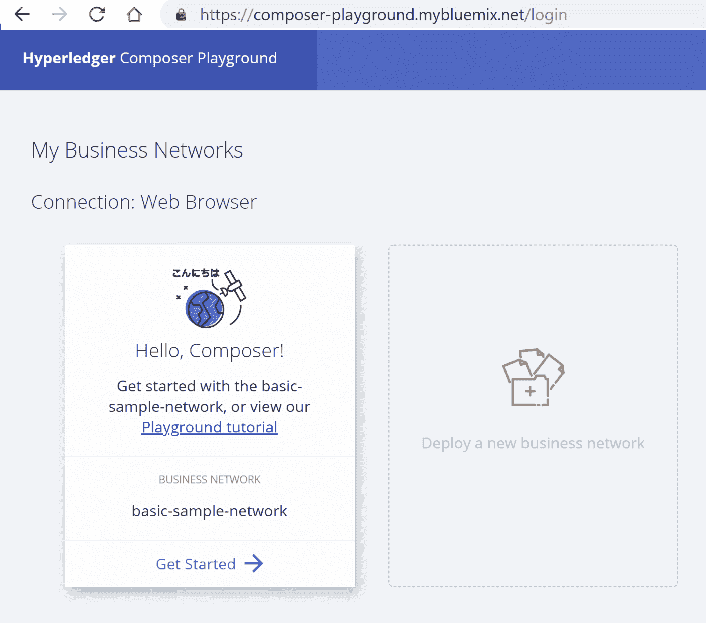

连接到基本样本网络。 Playground 将为您生成一些默认的示例资产、参与者、交易和事件，例如：

```
sample.cto
/**
* Sample business network definition.
 */
namespace org.example.basic
asset SampleAsset identified by assetId {
  o String assetId
  --> SampleParticipant owner
  o String value
}
participant SampleParticipant identified by participantId {
  o String participantId
  o String firstName
  o String lastName
}
transaction SampleTransaction {
  --> SampleAsset asset
  o String newValue
}
event SampleEvent {
  --> SampleAsset asset
  o String oldValue
  o String newValue
}
```

在 `sample.cto.SampleAsset` 中定义了一个 `namespace org.example.basic`，这是一个 `Asset` 类的示例。它定义了一个资产，其名称后跟着一个标识性的 `field.o` `String assetId`：`SampleAsset` 的一个字段。`--> SampleParticipant owner`：字段指向 `SampleParticipant` `instance.SampleParticipant` 是 `Participant` 类的一个示例，语法与 `SampleAsset.SampleTransaction` 是一个事务的示例 `class.SampleEvent` 是一个事件类的示例。

# 脚本文件 (.js)

我们在模型文件中定义了交易和事件，脚本文件实现了这些交易功能。注释中的装饰器用于用于事务处理所需的元数据注释函数，例如：

```
/**
 * Sample transaction processor function.
 * @param {org.example.basic.SampleTransaction} tx The sample transaction instance.
 * @transaction
 */
async function sampleTransaction(tx) {  // eslint-disable-line no-unused-vars
..
    emit(event);
}
```

在 `sampleTransaction` 函数中，`@param` 标签后跟着触发事务处理器函数的事务的资源名称。 `@transaction` 将此函数标记为事务处理器函数。

# 访问控制列表 (ACL) 文件 (.acl)

ACL 文件定义了业务网络中参与者的权限，例如：

```
rule OwnerHasFullAccessToTheirAssets {
    description: "Allow all participants full access to their assets"
    participant(p): "org.example.basic.SampleParticipant"
    operation: ALL
    resource(r): "org.example.basic.SampleAsset"
    condition: (r.owner.getIdentifier() === p.getIdentifier())
    action: ALLOW
}
```

在前面的 ACL 示例中，指定参与者为 `SampleParticipant`。任何注册为 `SampleParticipant` 的实例都可以对所有的 `org.example.SampleAsset` 实例执行 `ALL` 操作。此事务在 `SampleAsset` 的所有者与提交事务的参与者相同时触发。

# 查询文件 (.qry)

查询文件定义了用于返回关于区块链世界状态的数据的查询。查询语法与 SQL 语言非常相似，例如：

```
query queryName {
    description: "Select SampleAsset by assetId "
    statement:
        SELECT org.example.basic.SampleAsset
            WHERE (_$assetId = assetId)
}
```

# 设计业务模型

现在我们已经审查了基本的 Composer 模型语言和结构，是时候使用 Hyperledger Composer 实现一个保险理赔了。

为简单起见，我们将允许参与者在此示例中有权限读取和写入所有资源。删除与 ACL 相关的示例资源，并更新规则如下：

```
rule EverybodyCanReadEverything {
    description: "Allow all participants read access to all resources"
    participant: "**"
    operation: READ
    resource: "com.packt.quickstart.claim.*"
    action: ALLOW
}
rule EverybodyCanSubmitTransactions {
    description: "Allow all participants to submit transactions"
    participant: "**"
    operation: CREATE
    resource: "**"
    action: ALLOW
}
```

简化后的 ACL，我们开始按照以下方式处理我们的模型文件：

1.  将 `sample.cto` 重命名为 `insurance-claim.cto`

1.  将命名空间更改为 `com.packt.quickstart.claim` 并删除其余代码

1.  定义参与者和资产

我们在[*第16章*](d750faf6-ca67-49d3-b78b-5837c3789633.xhtml)中编写了一个名为`claimcontract.go`的链码，*使用Hyperledger Fabric探索企业区块链应用程序*，该链码定义了被保险人、经纪人、保险人和索赔的结构。我们可以类似于这个结构定义参与者和资产。如下所示，这非常简单：

```
      namespace com.packt.quickstart.claim
      participant Insuree identified by id {
        o String id
        o String firstName
        o String lastName
        o String ssn
        o String policyNumber
      }
      participant Company identified by id {
        o String id
        o String type
        o String name
      }
      asset Claim identified by id {
        o String id
        o String desc
        o Integer status
        o String insureeId
        o String brokerId
        o String insurerId
        o String comment
        o String processAt
      }
```

1.  定义交易和事件。通过使用`Init`函数，我们登记被保险人，如下所示：

```
      transaction Init {
        o String insureeId
        o String firstName
        o String lastName
        o String ssn
        o String policyNumber
      }
      event InitEvent {
        --> Insuree insuree
      }
```

1.  Composer的JavaScript API提供了用于创建资源（包括参与者）的CRUD。对于保险人和经纪人，我们将使用这种方法。我们在进行测试时会更详细地解释这一点。

1.  定义`ReportLost`：被保险人向经纪人报告索赔—这启动了一个索赔，如下所示：

```
      transaction ReportLost {
        o String claimId
        o String desc
        o String insureeId
        o String brokerId
      }
      event ReportLostEvent {
         --> Claim claim
      }
```

1.  定义`RequestedInfo`：经纪人提供请求的信息，如下所示：

```
      transaction RequestedInfo {
        --> Claim claim
      }
      event RequestedInfoEvent {
        --> Claim claim
      }
```

1.  定义`SubmitClaim`：经纪人向发行人提交索赔。

1.  定义`ConfirmClaimSubmission`：发行人确认索赔。

1.  定义`ApproveClaim`：发行人处理并批准索赔。

步骤8、9和10是交易函数，与步骤7非常相似。

我们在模型文件中定义了所有的交易、参与者和资产。作为下一步，我们将实现模型文件中定义的交易。

# 实现业务交易函数

我们通过审查`SampleTransaction`在前一节学习了如何实现交易函数。按照类似的方法，我们将实现一个保险索赔交易函数。将`sample.js`重命名为`logic.js`。

实现`Init`函数，如下所示：

```
Init() function is used to register insuree person information.
/** 
  * Create the insuree
  * @param {com.packt.quickstart.claim.Init} initalAppliation - the InitialApplication transaction
  * @transaction
  */
 async function Init(application) { // eslint-disable-line no-unused-vars
     const factory = getFactory();
     const namespace = 'com.packt.quickstart.claim';
     const insuree = factory.newResource(namespace, 'Insuree', application.insureeId);
     insuree.firstName = application.firstName;;     insuree.lastName = application.lastName

     insuree.ssn = application.ssn;;
     insuree.policyNumber = application.policyNumber;;
     const participantRegistry = await
getParticipantRegistry(insuree.getFullyQualifiedType());
     await participantRegistry.add(insuree);
     // emit event
     const initEventEvent = factory.newEvent(namespace, 'InitEvent');
     initEventEvent.insuree = insuree;
     emit(initEventEvent);
 }
```

实现`ReportLost`，设置并创建索赔，如下所示：

```
/**
  * insuree report lost item
  * @param {com.packt.quickstart.claim.ReportLost} ReportLost - the ReportLost transaction
  * @transaction
  */
 async function ReportLost(request) {
     const factory = getFactory();
     const namespace = 'com.packt.quickstart.claim';
     let claimId = request.claimId;
     let desc = request.desc;
     let insureeId = request.insureeId;
     let brokerId = request.brokerId;
     const claim = factory.newResource(namespace, 'Claim', claimId);
     claim.desc = desc;
     claim.status = "ReportLost";
     claim.insureeId = insureeId;
     claim.brokerId = brokerId;
     claim.insurerId = "";
     claim.comment = "";
     claim.processAt = (new Date()).toString();
     const claimRegistry = await getAssetRegistry(claim.getFullyQualifiedType());
     await claimRegistry.add(claim);
     // emit event
     const reportLostEvent = factory.newEvent(namespace, 'ReportLostEvent');
     reportLostEvent.claim = claim;
     emit(reportLostEvent); }
```

实现`RequestedInfo`以验证和更新索赔状态，如下所示：

```
/**
  * broker send Requested Info to insuree
  * @param {com.packt.quickstart.claim.RequestedInfo} RequestedInfo - the RequestedInfo transaction
  * @transaction
  */
 async function RequestedInfo(request) { // eslint-disable-line no-unused-vars
     const factory = getFactory();
     const namespace = 'com.packt.quickstart.claim';
     let claim = request.claim;
     if (claim.status !== 'ReportLost') {
         throw new Error ('This claim should be in ReportLost status');
     }
     claim.status = 'RequestedInfo';
     claim.processAt = (new Date()).toString();
     const assetRegistry = await getAssetRegistry(request.claim.getFullyQualifiedType());
     await assetRegistry.update(claim);
     // emit event
     const requestedInfoEventEvent = factory.newEvent(namespace, 'RequestedInfoEvent');
     requestedInfoEventEvent.claim = claim;
     emit(requestedInfoEventEvent); }
```

实现`SubmitClaim`、`ConfirmClaimSubmission`和`ApproveClaim`。这些功能与`RequestedInfo`类似。

# 在游乐场进行测试

我们刚刚在前一节中实现了所有的模型和逻辑文件，所以现在是测试我们的composer应用程序的时候了：

1.  单击游乐场左下角的部署更改按钮。这将部署composer代码。

1.  点击顶部导航栏上的测试链接。将弹出提交交易页面。从交易类型下拉菜单中选择`init`方法。输入JSON值，如下截图所示；输入数据与我们在*[第16章](d750faf6-ca67-49d3-b78b-5837c3789633.xhtml)*中测试的相同，*使用Hyperledger Fabric探索企业区块链应用程序*。实例化面料链码步骤。提交交易，如下所示：

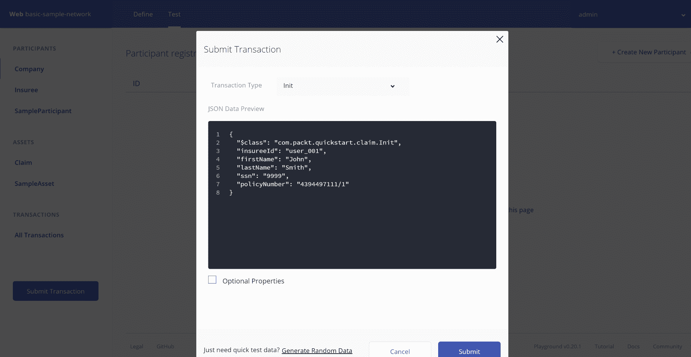

如果交易提交成功，我们将能够看到被保险人参与者已创建，例如：

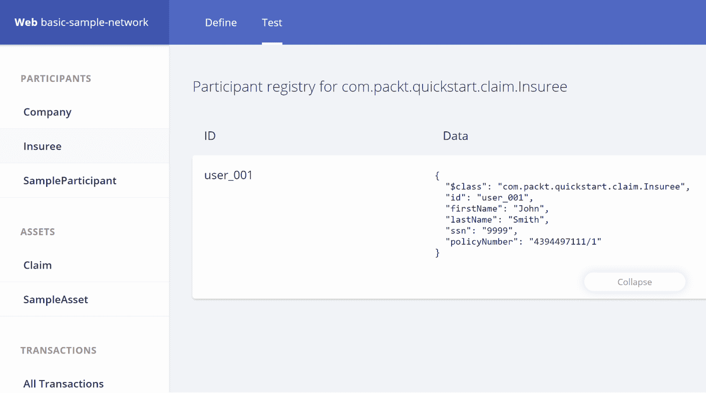

1.  现在，让我们入职经纪人和保险人。在参与者部分中点击公司，然后点击创建新参与者。输入经纪人数据，方式与我们在[*第16章*](d750faf6-ca67-49d3-b78b-5837c3789633.xhtml)中的`chaincodeInvokeAddBroker`步骤相同，*使用Hyperledger Fabric探索企业区块链应用程序*。点击创建新，如下所示：

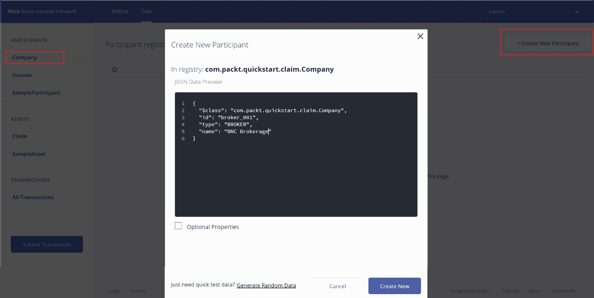

如果交易提交成功，这将入职经纪人。重复相同步骤以入职保险人，如下所示：

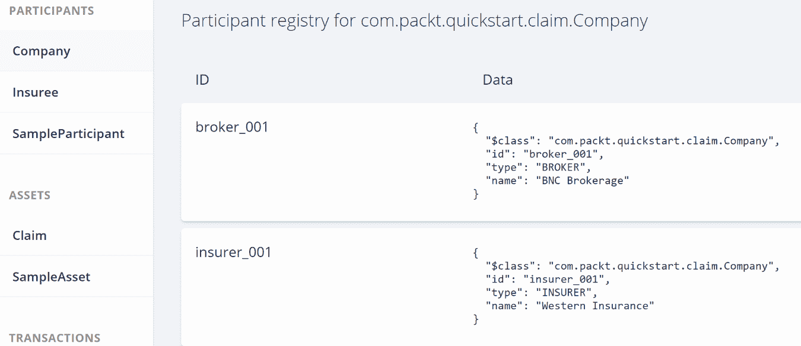

1.  提交`ReportLost`，如下所示：

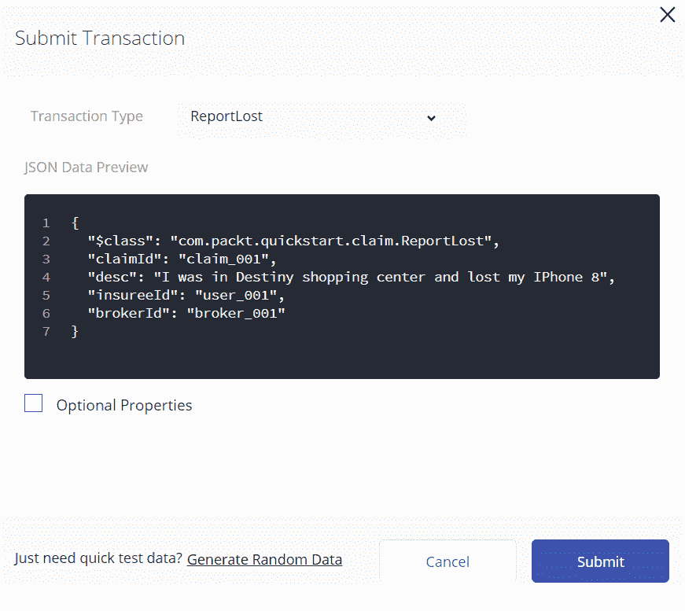

这是结果：

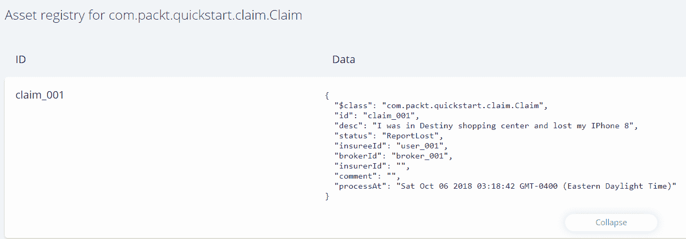

1.  用以下结果测试`RequestedInfo`：

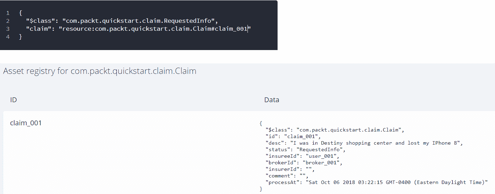

剩下的`SubmitClaim`，`ConfirmClaimSubmission`和`ApproveClaim`步骤与`RequestedInfo`非常相似。

# 部署业务网络

我们在游乐场中测试了composer应用程序，接下来我们将把它部署到区块链上：

1.  创建一个名为`insurance-claim-network`的文件夹，并导航到该文件夹。

1.  生成业务网络项目模板，如下所示：

```
 yo hyperledger-composer:businessnetwork
```

它会提示几个问题。输入`insurance-claim-network`作为网络名称，并选择空模板网络，如下截图所示：

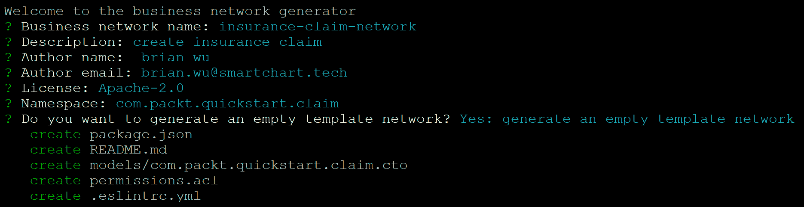

这将生成一些具有默认模板的文件。替换`com.packt.quickstart`的内容，如下所示：

用我们之前测试过的模型文件`.claim.cto`。

创建一个名为`lib`的新文件夹，在`lib`文件夹下，将测试过的`logic.js`复制到这里。

用被测试过的`acl`文件替换`permissions.acl`，如下所示：

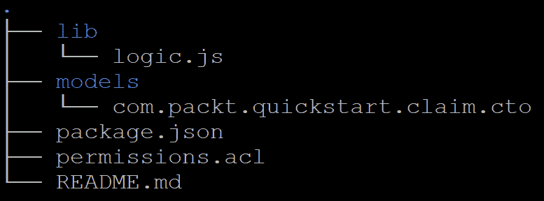

1.  启动Hyperledger Fabric，如下所示：

```
 cd ~/fabric-devservers
 export FABRIC_VERSION=hlfv12
 ./startFabric.sh
 ./createPeerAdminCard.sh
```

这将创建`PeerAdminCard`，如下截图所示：

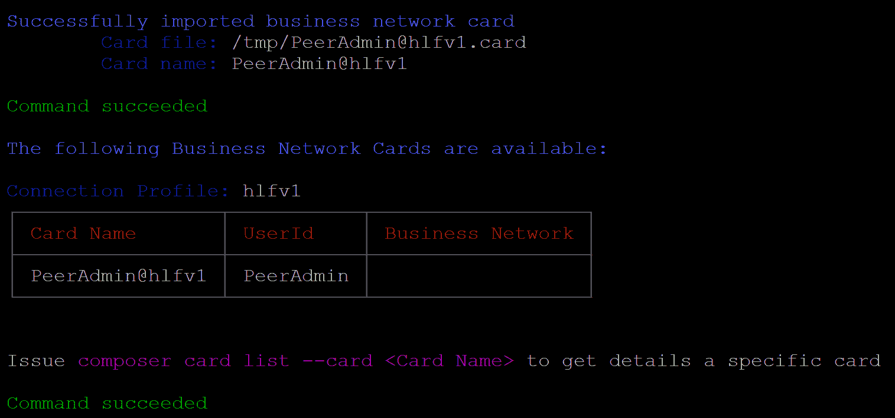

1.  生成业务网络档案。从`insurance-claim-network`目录中运行以下命令：

```
 composer archive create -t dir -n 
```

这将生成`insurance-claim-network@0.0.1.bna`。

1.  安装业务网络。从`insurance-claim-network`目录中运行以下命令：

```
 composer network install --card PeerAdmin@hlfv1 --archiveFile 
      insurance-claim-network@0.0.1.bna
```

1.  启动业务网络。从`insurance-claim-network`目录中运行以下命令：

```
 composer network start --networkName insurance-claim-network --
      networkVersion 0.0.1 --networkAdmin admin --networkAdminEnrollSecret 
      adminpw --card PeerAdmin@hlfv1 --file networkadmin.card
```

1.  导入网络管理员卡。从`insurance-claim-network`目录中运行以下命令。这将会将`insurance-claim-network`导入到网络中：

```
 composer card import --file networkadmin.card
```

1.  检查业务网络是否已成功部署。从`insurance-claim-network`目录中运行以下命令：

```
 composer network ping --card admin@insurance-claim-network
```

结果应如下所示：

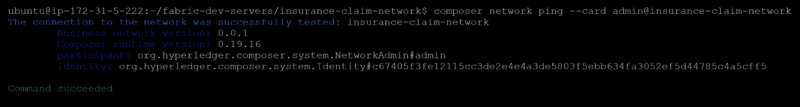

检查业务网络是否已成功部署

# 与REST服务器集成

我们刚刚在 fabric 网络中部署了`insurance-claim-network`。下一步是构建一个保险索赔客户端 API，与网络中的智能合约函数进行交互。Hyperledger Composer REST 服务器可用于生成 REST API。REST 客户端可以调用这些端点函数，并与 Fabric 区块链上的业务网络链码交互。

# 生成 Hyperledger Composer REST API

运行以下命令生成 composer 服务器 API：

```
composer-rest-server
```

从业务网络卡中输入`admin@insurance-claim-network`，如下截图所示：

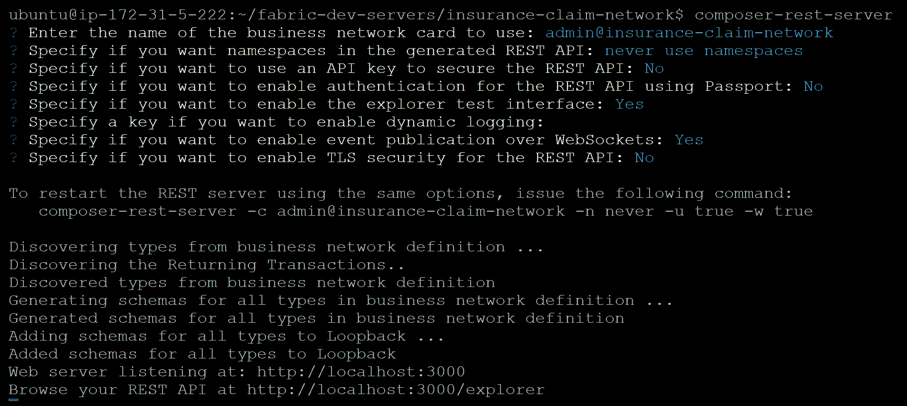

输入业务网络卡

这将生成 REST API，将其暴露为`http://serverIP:3000`和`http://serverIP:3000/explorer`。

打开浏览 URL。你会看到生成的 REST 端点，如下所示：

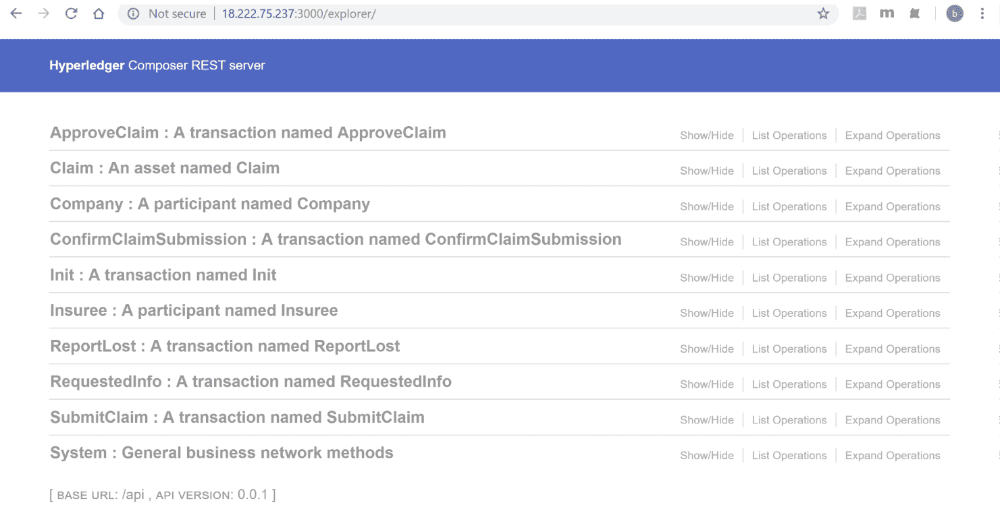

让我们尝试多种方法来演示这些端点是如何与 fabric 网络进行交互。

从端点中选择`init Post`方法，并提供 post JSON 数据，然后点击 Try it out! 按钮。JSON 数据示例如下所示：

```
{
  "$class": "com.packt.quickstart.claim.Init",
  "insureeId": "user-001",
  "firstName": "John",
  "lastName": "Smith",
  "ssn": "9999",
  "policyNumber": "string"
}
```

这是点击 Try it out! 按钮后显示的结果截图：

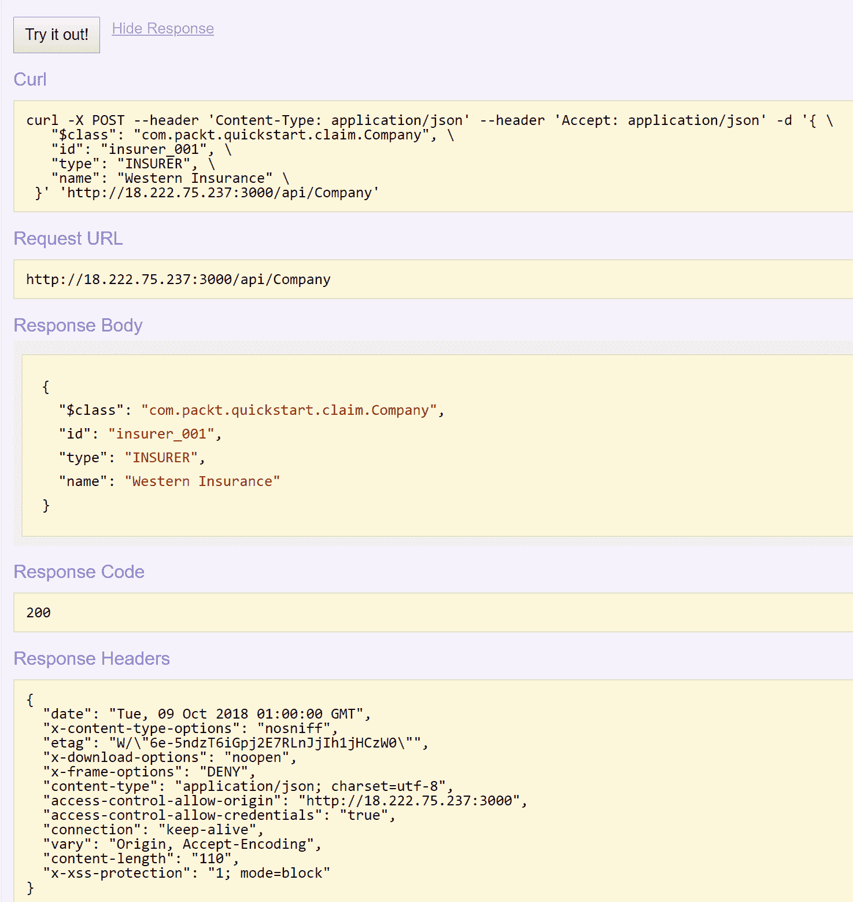

JSON 数据示例

API 将调用 fabric 网络中的`Init`链码，并将响应返回给浏览器。

使用 post 方法选择一个公司来创建被保险人。输入以下 JSON 请求如下：

```
{
  "$class": "com.packt.quickstart.claim.Init",
  "insureeId": "user-001",
  "firstName": "John",
  "lastName": "Smith",
  "ssn": "9999",
  "policyNumber": "string"
}
```

你应该会看到一个成功的返回，类似于下面截图中展示的：

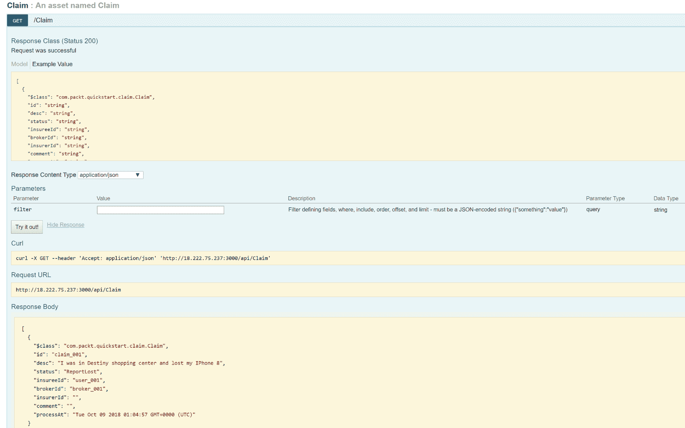

使用 post 方法选择一个公司来创建被保险人，输入以下 JSON 请求

从端点中选择`ReportLost Post`方法，并提供 post JSON 数据，然后点击**T**ry it out!**:**

```
{
  "$class": "com.packt.quickstart.claim.ReportLost",
  "claimId": "claim_001",
  "desc": "I was in Destiny shopping center and lost my IPhone 8",
  "insureeId": "user_001",
  "brokerId": "broker_001"
}
```

您应该会从区块链中得到一个成功的响应。

要验证索赔是否成功在网络中创建，您可以选择索赔 get 方法并点击 Try it out! 您应该能够获取到索赔结果，如下所示：

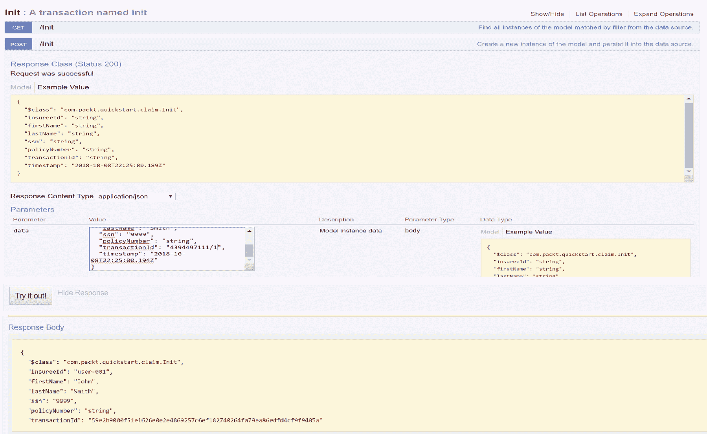

验证网络中索赔是否成功创建

其他保险索赔端点 API 将会和我们探索过的很相似。

# 总结

我们已经到达本章末尾。在这一章中，我们概述了 Hyperledger Composer 并安装了相关工具。我们使用 composer 模型语言开发了同样的保险索赔用例，就像[*第16章*](d750faf6-ca67-49d3-b78b-5837c3789633.xhtml)中所探索过的*使用 Hyperledger Fabric 探索企业区块链应用*，并将其部署到 fabric 网络中。最后，我们将应用与 composer REST 服务器集成，生成客户端 API，并从 web 中与这些 API 进行交互。

到这一步，你应该已经熟悉了 Hyperledger Composer 的工作方式。现在我们已经到了本章的结尾，我们已经了解了两种最流行的公共和企业级区块链。作为一名区块链开发者，你应该具备基本的区块链知识，以便能够编写你自己的区块链应用程序。在下一章中，我们将讨论各种真实世界的区块链使用案例。
