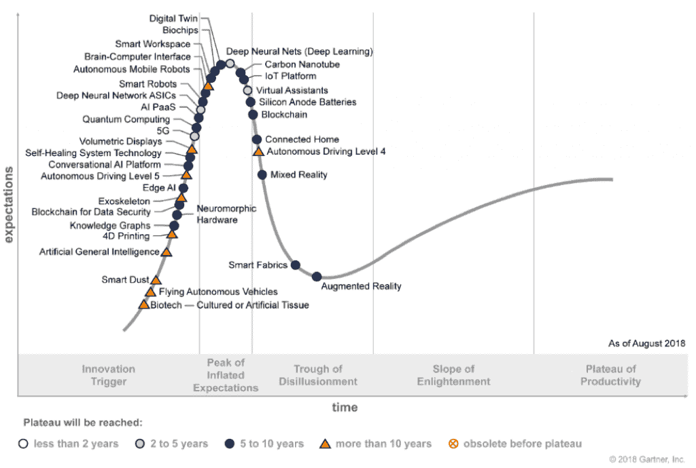
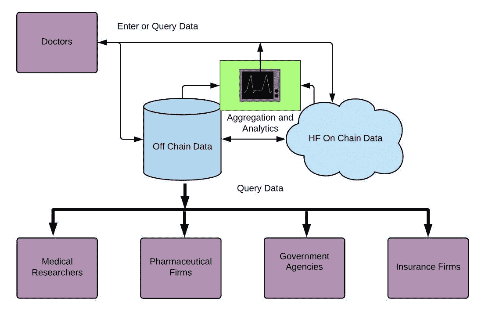
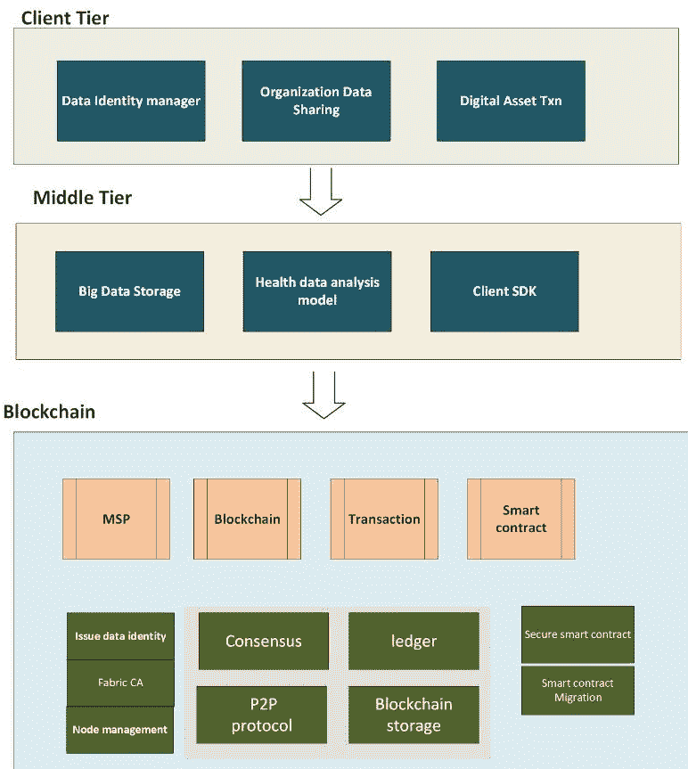

# 区块链使用案例

完成前六章后，你应该已经掌握了足够的知识，可以思考如何将你新获得的技能应用于解决现实生活中的问题。正如之前讨论的那样，区块链被认为是一种颠覆性的技术，可以通过使中间服务过时来潜在地破坏现有的商业模式，并激发新的、具有成本效益的商业模式的创造。然而，这项技术无法解决所有问题，其价值只有通过与其他成熟或新兴技术结合使用才能充分实现，例如大数据平台、云计算、数据科学/人工智能和物联网。

在本章中，我们首先高层次地讨论了跨行业流行的区块链使用案例，包括金融、公共服务、供应链、物联网和医疗保健。然后，我们将讨论考虑因素，确定适当的使用案例，并开发成功的 DApp。最后，我们以健康数据共享使用案例为例，对构建其 DApp 进行高层次评论。具体而言，我们涵盖以下主题：

+   区块链使用案例示例

+   如何选择适当的使用案例

+   对医疗数据共享使用案例的深入讨论

# 区块链应用案例示例

技术的发展从根本上改变了人们的生活。在人类历史上，机器曾经取代人类执行各种任务。例如，在农业领域，农用车辆使农业工作变得不那么劳动密集，并大大提高了生产力。截至 2008 年，在美国，直接从事农业工作的人口不到 2%。他们不仅供应其他 98%人口所需的食物，还使美国成为最大的农产品出口国。其他领域的例子包括可编程电话交换机替代电话操作员，以及自动电梯替代电梯操作员。

机器取代人类的趋势在过去的几十年里加快了，这在很大程度上是由于计算机的发明。到目前为止，技术领域已经出现了三次以计算机为主导的革命。每一次革命都从根本上影响了现有的商业模式，并激发了新的商业方式。我们现在正处于第四个阶段的黎明：由区块链技术主导的革命。以下是各个阶段：

+   **主机和个人电脑的发明**：计算机以更快、更好地执行重复计算取代了人类。计算机驱动自动化的应用无处不在，数量巨大。

+   **互联网**：互联网指的是全球互联的计算机网络。互联网的到来从根本上改变了服务的提供方式。比如，在 90 年代，在本地租赁商店租一盘录像带或 CD/DVD 是一个周末的热门家庭娱乐活动。Blockbuster 是一个提供租赁服务的家喻户晓的品牌，其商业模式运转良好。到 2004 年，Blockbuster 在全球雇用了 84300 名员工，总共拥有 9094 家门店。有了互联网，新公司如 Netflix 崛起并打破了 Blockbuster 等公司的霸主地位。家庭不再需要去实体店拿 CD/DVD。相反，他们可以在互联网上下载电影的虚拟副本。2010 年，Blockbuster 申请破产。如今，Netflix 是一家市值 1450 亿美元的公司。这样的故事在其他领域也反复出现过很多次。

+   **社交媒体网站**：诸如 Facebook、Twitter 或 YouTube 等社交媒体网站不仅改变了现有的商业模式，还改变了人们获取新闻以及新闻传播方式。纸媒和基于广播/电视的新闻传播不再是新闻传播的唯一渠道。许多新闻发布者由于失去订阅者而不得不关闭。另一方面，自由撰稿的新闻记者开始通过 YouTube 等方式出现。社交媒体网站也从根本上影响了政府，因为新闻审查变得更加困难。

第 4 阶段——区块链技术：即使在社交媒体网站上，审查制度——尽管更加困难——仍然可能存在，因为信息是托管和处理在一个集中的服务器上，所以审查可以在那个集中的服务器上实施。而在区块链网络中，由于区块链技术的去中心化设计，审查就不太实际。唯一的方法就是关闭国内网络的所有节点。区块链对现有商业模式的最大影响来自于这项技术将使中介服务过时。它将特别影响到金融行业，其中大部分金融服务本质上是中介服务。这项技术即将带来的变革不仅仅局限于金融行业，而且几乎对每个其他行业都会产生影响。

接下来，我们列举了一些潜在的区块链技术应用的例子。我们使用了*潜在*这个词，因为这项技术仍在不断发展，并且其当前形式有许多限制。没有保证这些应用案例能被实施。许多这些应用案例要成为现实还需要一段时间，而有些可能永远无法实现。无论一个应用案例能否被实施，我们都应该把讨论重点放在业务问题上，以及利用这项技术解决业务*痛点*的想法上。随着技术的进步，比如性能的提高，一些应用案例将成为现实。我们首先讨论的是金融行业中的应用案例。

# 支付和结算服务

在传统方式下，银行之间的交易对账成本高昂且耗时。例如，2016 年仅美国就有 70 亿笔借记卡交易。同年，VisaNet（世界最大的电子支付网络之一）每天处理平均 1.5 亿笔交易。在这么高的交易量下，即使每笔交易节省极微，也会在企业运营总成本上产生巨大降低。在股票交易中，一笔交易加上结算需要三天的完整周期。在未能解决一笔交易对账时可能导致重大经济损失。（因此，像 DTCC 这样的清算中心实施一种保险机制来减轻结算风险。）通过区块链技术，支付处理正逐渐向全球即时支付发展。例如，Ripple 可以在几分钟内完成跨境支付。该技术结合了交易和结算。它大幅降低了相关交易成本。交易的步骤对请求者可见。最近的一份研究报告声称，Ripple 的支付成本仅占传统交易成本的 0.1%。同样，对于股票交易，由于区块链实施将交易和结算归为一体，不再存在结算风险。交易所会员公司不需要为结算保险支付溢价，也不需要一个专门处理结算的大后勤团队。这将显著降低公司营业成本。

# 进出口贸易融资

在商品交易中，进口商和出口商分别使用他们的银行发行**信用证**（**LC**）并结算支付。区块链将使银行简化文件管理。它为参与方提供透明度，减轻了文件欺诈的潜在风险。它使银行之间和内部的交易对账变得更加简单，从而实现重大节省。去中心化账本提供可审计的交易日志，使法律纠纷不太可能发生，且更容易解决。

# 不可变账本

记账或记录方法，例如使用分类帐，由于参与者数量的增加和交易复杂性的增加而变得越来越复杂。维护分类帐的传统方式是集中式的。这种方法缺乏透明度，导致经常发生法律或非法的争端。还很难识别错误，因为参与交易的各方没有有效的实时方法来检查和验证交易事实与分类帐相对应。区块链技术可以无缝解决这些问题。在链上维护的分散和不可变的分类帐几乎消除了任何争端的机会，并在交易中为各方带来信任。区块链允许实时查询并允许各方确保其正确性。与传统方式不同，其中两个交易方分别在其各自的分类帐中保存条目，可能导致不一致，区块链分类帐允许所有参与方维护统一的分类帐，消除了不一致性的可能性。

# 监管合规和审计

凭借其不可变性，监管机构可以信任他们从记录在企业区块链上的交易中提取的任何信息。金融公司无需采取措施准备数据并大力投资于实施数据治理以确保数据的正确性。因此，区块链技术潜在地可以帮助金融公司降低监管合规和审计成本，涉及领域包括证券交易、反洗钱（AML）和了解您的客户（KYC）。

# 身份盗窃检测

分散的区块链系统阻止了银行盗窃和黑客活动。采用区块链技术将使身份盗窃的检测变得更加容易。如果一个小偷盗窃了身份并开设了银行账户或提出了欺诈性的税务要求，受影响的个人可以看到所有以其名字注册的账户，并识别出可疑活动。然后，这个人可以立即向银行或国税局报告，防止他们进一步遭受损失。

# 后勤后台操作

区块链可用于在新客户入职时提高满足 AML 和 KYC 法规要求的措施的效率。它可以帮助计算资金的净现值，以及其他后勤活动，如对账和处理公司行为（如股票拆分、公司并购等）。

# 抵押管理

在传统方式下，无论是双边交易还是三方交易，抵押品信息都无法实时提供给参与交易的各方。区块链可用于提供去中心化的抵押品管理系统。它提供了实时透明度，并维护了抵押品使用状态的一份副本，从而消除了由于各方保留其个人记录以及传统的抵押品管理方法而导致的抵押品信息不一致的可能性。

在前一节中，我们讨论了金融行业的用例示例。接下来，我们将涵盖金融行业以外的示例。

# 医疗系统

区块链可以帮助解决有效管理健康数据的问题。采用区块链技术可以简化医疗数据管理。例如，患者的病史、诊断信息和检测结果保存在各自的医生办公室。在医生之间共享医疗信息，例如患者的家庭医生和专家，是耗时且困难的。这可能导致诊断延迟或生成重复的医学测试。区块链可以使数据共享更容易，同时保护机密数据。然后可以对详细的医疗记录进行汇总。汇总的信息可以提供给医学研究人员、政府机构以及制药或保险公司。通过简化和全球范围的访问，健康数据共享有助于促进研究人员和制药公司在新治疗和药物开发方面的合作。基于真实的健康数据，政府机构可以制定改进的卫生政策。医疗保险公司可以利用数据计算计划的保费，并减少收集所需数据的成本。临床试验结果的去中心化也是如此。总之，区块链可以彻底改变健康数据的存储、管理和共享方式。它将深刻影响整个健康产业的发展。

# 房地产交易和租赁市场

在美国，房地产经纪人收取经纪费，通常为售价的 5%至 6%，用于将卖方和买方联系起来进行房地产交易。律师为买方或卖方提供法律服务，收取数百美元的费用。在纽约市，房地产经纪人通常会向客户收取一个月的租金，通常数千美元，以促成租赁交易。与提供的有限服务相比，这相当昂贵。区块链提供了一个成本更低的解决方案，并提供了透明度的附加价值。房地产区块链网络为不信任的买方/卖方或租户/房东进行配对交易。脚本化的法律文件，即智能合约，取代了房地产律师提供的大多数法律服务，因此使它们变得不必要。由于区块链将交易和结算合二为一，因此不需要第三方担保账户。换句话说，房屋所有权的转移和付款同时进行。在租赁房产的情况下，类似的解决方案也是适用的。这将导致双方在交易中实现大幅度的节省。面对区块链技术带来的威胁，房地产经纪人将不得不找到一种创新的方式来提供增值服务，或者转行从事其他职业。

# 知识产权市场

IP 指的是知识产权。这可以是数字或数字化资产，例如小说、歌曲、电影、绘画、专利或软件。区块链技术可以潜在地用于建立一个购买和出售 IP 的市场。这将允许所有者将 IP 资产出售给买方。例如，小说完成后，作者可以生成预定数量的数字副本，并直接销售给读者。每个数字副本都有一对公钥/私钥和一个地址。在支付书的价格后，此副本的所有权转移给买方。买方可以在未来在二级 IP 市场上转售此副本。这种新的业务模式不涉及出版商。作者可以从书籍销售中获得大部分收入。

# 选举

目前进行选举的方式有多个缺点。首先，它经常需要投票者亲自到场投票。许多选举仍然依赖于纸质投票。这使得计票非常耗时、劳动密集和昂贵。这也可能导致漫长的重新计票，就像之前美国总统选举中在几个险象环生的州发生的情况一样。重新计票需要数周甚至更长的时间才能完成。操纵结果、重复投票或伪造投票是其他经常被提及的问题，即使在其他国家的几次备受关注的选举中也是如此。

区块链技术可以用来解决这些问题。通过基于区块链的选举 DApp，投票可以在全球范围内进行。每个选民都被分配一个独特的账户、一个地址，使得双重投票变得不可行。选举结果是不可变的。因此，操纵选举结果是不可能的。该技术还带来了另一个优势，即使全球范围内的跨境公民投票成为可能，涉及的问题可以是环境主题等。

# 人力资源和招聘

大型公司人力资源部门面临的一个常见问题是如何识别具有正确技能、工作经验和教育背景的候选人。通常，解决方案是聘请专业的招聘人员或猎头，他们通过个人网络或通过扫描 LinkedIn 等社交媒体网站来识别候选人。支付给招聘人员的费用等于被聘用候选人一个月的工资或更多。区块链可以用于构建专业人士的分散数据库。这可以达到两个目的。首先，它提供了透明度，以匹配雇主和候选人。其次，每家公司都可以了解潜在员工的历史和该人员的当前就业状态。这有助于过滤掉潜在的欺诈者被公司雇佣。

# 公共记录

政府的市政行政办公室维护着各种类型的记录，例如公民、纳税申报、土地所有者和产权证书持有人、建筑许可证、分区信息、专利、水管线和污水布局等。这些记录需要持续更新。此外，这些办公室经常收到查询。将这些记录保存在纸上很昂贵，因为政府必须雇佣一组办公室职员来手动管理记录。即使记录是电子文件，也仍然需要手来回应查询。通过区块链托管的数字账本，可以通过软件查询工具而不是通过办公室职员来满足查询。这种解决方案将数据免受恶意篡改。这也有助于减少身份盗窃。

# 减少合同纠纷

区块链被 IBM 内部用于解决网络合作伙伴之间的合同纠纷。根据 IBM 的估计，其 290 万笔交易中平均有 0.9%导致纠纷。这些纠纷导致大约 1 亿美元的资本被束缚，无法投入运营以获利。1 亿美元的资本融资成本不容忽视。解决纠纷也会带来显著的成本。通过区块链解决方案，IBM 可以结合网络参与者提供的数据，创建所有交易的全面视图。区块链通过访问控制的治理机制提供了强大的隐私和机密性控制。该解决方案大大减少了纠纷数量。

# 共享经济

区块链技术可以用来创建一个市场，促进物品或服务的剩余价值共享或租赁给他人。例如，一个人可能有一台未充分利用的计算机，可以租给另一个需要临时增加计算能力的用户。在这种情况下，区块链共享市场可以用来完成这样的租赁安排。该平台基本上允许个人在几乎任何可以共享的东西上经营私人租赁业务。基于区块链技术的市场适用于任何使用可以方便地通过数字方式共享的设备，如计算机。市场也可用于促进一般服务的共享。例如，在一个欧洲国家，年轻人为老年人提供托儿服务，以换取积分。累积的积分可以在一个人变老时用来获得类似的服务。通过区块链解决方案，该人将获得为他人提供的服务的数字硬币，可以后来使用这些硬币来获得服务。这可能是解决美国托儿保育成本高的问题的一种解决方案。

# 与物联网的整合

**物联网**指的是物联网。物联网是许多不同类型的事物的网络，例如物理设备、车辆、家用电器和传感器。这些物品连接在一起，可以收集和共享数据。当结合区块链技术和物联网时，我们可以潜在地实施许多有意义的应用。它们可以有很多好处，比如提供人们生活的便利性，拯救生命，以及降低经营成本。以下是一些可能的用例：

+   当嵌入式传感器检测到洗涤剂的水平低于预设水平时，可以自动调用智能合约来订购额外的洗涤剂。

+   一个健康手环或嵌入式传感器在衣物中可能会检测到一个人的重要统计数据，指示可能发生心脏病的可能性。然后，它会自动触发一个智能合约，向药店发送订单，并通过短信或电子邮件向个人发送警报。当这种应用实施得当时，它可以拯救许多生命。

+   冰箱内置传感器可以检测蔬菜或肉类的数量，并触发智能合约从当地农民和肉类供应商那里订购额外的蔬菜/肉类，而不需要超市参与。这将避免商店对食品增加的成本，并为消费者节省开支。

+   当酒店客人准备退房时，客人只需在指定地点放下房间钥匙（或智能钥匙）。传感器触发结账智能合同。触发后，智能合同将访问通过房间其他传感器收集的数据，例如迷你吧中零食/饮料的消费信息或房间设施可能的损坏信息。根据收集的数据，智能合同将计算最终金额，并通过调用和完成付款交易完成客人的结账。有了这样的解决方案，客人无需前往酒店前台，这节约了客人的时间。这也有助于酒店减少运营成本，因为酒店无需雇佣员工在前台值班。

# 促进商业和社交关系

澳大利亚政府实体、**CSIRO**（澳大利亚联邦科学与工业研究组织）进行了为澳大利亚利益进行科学研究。该机构指出，区块链可以用作促进商业和社交关系的数据库系统。区块链技术的有效应用在于与多个组织互动的复杂市场。

# 如何选择合适的使用案例

鉴于对区块链技术及其对现有商业模式潜在影响的诸多猜测，现在是现实主义的时候了。在高德纳最新的*新兴技术曲线*报告中，区块链被称为进入了公司*曲线炒作*评估的第三阶段—*幻灭谷*阶段，如下截图所示：

在 2017 年第四季度和 2018 年第一季度之间，1 BTC 的价格曾一度超过 19K，然后在几天内迅速下跌至 10k。截至 2018 年 12 月 11 日，价格为 3.4K。比特币价格的这种惊人过山车式起伏导致了对加密货币的疯狂炒作的降温，进而减少了对加密货币项目的投资。此外，技术的局限性也是一个因素，使得技术不适用于某些使用案例。众所周知的问题是大多数区块链平台从比特币继承的**每秒交易量**（**TPS**）很低，如在*第十三章*的讨论中所述，*以太坊基础*。成功的区块链应用仍然稀少，主要集中在金融行业。瑞波是一个成功的案例，专注于现金支付。

由于区块链技术并不适用于所有使用案例，在开始行动之前选择一个合适的使用案例非常重要。以下评论可能有助于帮助您确定要处理的使用案例以及如何选择用于其实施的区块链平台以及其他架构考虑因素：

+   并不是每一个用例都适合使用区块链。例如，许多用例可以使用传统技术实现。的确，区块链是一个数据存储库。如果唯一目的是托管数据，选择普通数据库可能足够了。目前写入区块链仍然比写入数据库要慢得多。插入到区块链需要几秒钟或几分钟。插入到数据库只需要几毫秒。这使得数据库在许多需要高吞吐量的用例中更好的选择，例如捕获信用/借记卡交易或股票交易市场数据。未来，随着性能和可扩展性的提高，区块链技术可以用于这些用例。

+   在物联网用例中，需要考虑如何将物联网设备与区块链网络集成。物联网设备不是计算机。因此，物联网设备不能是区块链网络的节点。一个可能的解决方案是通过 API 将设备与网络上的节点连接起来。节点与区块链分类帐进行交互，并在接收到物联网设备信号时触发相应的智能合约。性能也是一个问题。一些物联网设备，如飞机传感器，会产生高频测量。低 TPS 的区块链网络无法快速响应这些设备的请求。

+   区块链平台的区块大小是有限的。例如，比特币的区块大小限制在大约`1 MB`。以下图表（来自[blockchain.com](https://www.blockchain.com/)）展示了其截至`2018 年 10 月`的平均区块大小历史。对于像出售小说或电影的 IP 市场这样的用例，对数字资产的详细信息需要大量存储空间。可以考虑将链上和链下存储结合起来设计以解决区块大小受限的问题。数字资产的详细信息可以在集中的地方链外保存。以太坊已经采用了链上和链下数据存储方法：

！

+   如果一个用例涉及到数字化资产，需要解决一些关于管理底层物理资产的问题：

    +   实物资产需要公证以证明其真实性。

    +   需要一个解决方案来确保底层资产在被公证和转让其所有权之间保持不变。

    +   与数字货币的双重支付问题类似，需要一个解决方案来确保一个实物资产映射到一个且仅一个数字资产。

    +   有价值的实物资产需要安全的存放地点。当所有权在数字上转移时，需要记录和转移底层资产的相应所有权。一个可能的解决方案可以从黄金交易中借鉴。物理黄金可以存放在一个安全的地方，比如纽约联邦黄金库。当一堆黄金条的所有权发生变化时，物理黄金条并不离开保险库。

+   尽管以太坊是一个支持 DApp 开发的通用平台，但其实现涉及数字货币。每当加密货币是解决方案的一部分时，可能需要处理与之相关的法律复杂性。例如，在美国，BTC 被定义为资产，而不是货币。换句话说，当一笔 BTC 被卖给买家时，会产生税务影响（比如销售税）。某些国家如中国禁止加密货币交易。因此，可能更喜欢企业区块链解决方案，如 **超级账本**（**HF**），因为它的实现不涉及加密货币。

+   许多用例，如医疗数据共享或信用数据数字化，并不适合公共使用。需要基于许可的企业（或私有）区块链，而不是像以太坊这样的公共区块链。

+   与以太坊相比，HF 或 R3 的 Corda 这样的私有链的另一个优势是，HF 和 Corda 都支持 Java 开发，而以太坊则要求程序员学习一种新的语言如 Solidity。鉴于 Solidity 的人才稀缺，要找到合格的开发者是困难且昂贵的。另一方面，将 Java 程序员转变成 HF 或 Corda 开发者可能是一个更容易的解决方案。

+   区块链技术意味着所谓的智能合同，也就是脚本化的法律文件的保证执行，这使得不信任的交易方感到放心。如果一个用例不需要担保交易，那么它就不是一个适合的用例。例如，区块链不需要取代传统的网络约会网站。约会是非常个人化的，而且不会导致担保交易——比如婚姻。

+   如果区块链仅被用作分布式账本，由于与区块链解决方案相关的成本，这是不合理的。如果容错性和透明性是主要目标，可以通过在多个节点上制作相同的账本副本来在传统方式下实现分布式账本，而不需要涉及比特币的挖矿和共识机制等额外组件。共识组件是为了解决双花问题而引入的。分布式账本不涉及双花问题。换句话说，如果只需要分布式账本，区块链就是画蛇添足。

+   目前，区块链对于许多需要高吞吐量的用例仍然不是一个合适的解决方案，比如股票交易或信用卡交易。现有的区块链平台的速度要比其他平台（比如传统数据库）慢得多，用于托管交易数据。例如，需要专门的数据库 KDB 来保存每天数十亿条记录的市场数据。

+   由于智能合同是脚本化的法律文件，还有待应对的法律挑战：

    +   智能合约运行时是否适用本地法律？如果答案是肯定的，那么当合同在节点的某些位置合法而在其他位置不合法时，如何处理与本地法律的冲突？

    +   区块链和加密货币的法规和法律尚未充分发展。最近，一名美国立法者敦促美国国内税务局澄清区块链的法规。

    +   由于智能合约的执行是自动的且无法阻止的，当无法充分解决非法活动（如洗钱）等问题时，区块链应用可能被判定为非法。

    +   加密货币在不同国家获得不同的地位。例如，在美国被定义为资产，在新加坡被视为货币。

# DApp 的用例 - 医疗数据共享

在本小节中，我们将更详细地讨论一个用例，并谈论导致 DApp 实施的步骤。将进一步研究医疗数据共享的用例。这里仅讨论了想法，并不一定可实施。大部分讨论集中在业务和架构考虑方面。

# 业务问题

在着手实施 DApp 之前，应从业务问题开始，例如提出*什么是挑战或痛点*之类的问题？在医疗数据的情况下，挑战的示例如下：

+   **数字化**：许多患者的医疗记录只能以纸质形式获得。对于家庭医生办公室来说，情况尤为明显，因为这些办公室通常规模较小。当患者访问医生办公室时，医生办公室的前台助手仍然经常需要在文件柜中搜索并拉出患者的医疗历史文件夹。然后，这些记录被交给医生。医生在与患者交谈时阅读这些记录。这种方法不具可扩展性且风险较大。自然灾害，如洪水或火灾，很容易毁坏这些记录。当患者更换医生时，旧的记录不会被转移。新的医生办公室将建立一个新文件夹，并开始积累患者的医疗史。由于旧记录的丢失，可能需要重新进行一些医学检查，导致患者额外的费用和不便。更重要的是，历史的丢失可能会导致失去本应用于治疗疾病的宝贵时间。

+   **及时性**：由于患者的医疗记录在多个办公室物理维护，例如患者的家庭医生和专科之间共享记录是困难且耗时的。为了方便共享记录，患者首先将他/她的医生联系信息提供给专科办公室。然后，专科办公室接待员联系医生办公室。医生办公室安排通过传真或常规邮件发送信息。这种方法缓慢，昂贵且不安全。患者的医疗信息在信息传输期间可能被未经授权的人看到，而被盗的保险信息可能被用于恶意目的。

+   **所有权**：医疗记录是患者的健康史。患者应该是医疗数据的所有者。医生办公室只是托管人。实际上，情况很少是这样。维护医疗记录的人成为事实上的所有者，并决定数据的使用或访问方式。

+   **透明度**：由于医疗记录是纸质的，并分散在医生办公室，个人和机构用户，如医学研究人员，政府机构和保险公司没有方便的方式来访问聚合的医疗信息，以进行立法和其他目的。访问不涉及个人机密信息的聚合医疗信息，对于推动医学研究，优先考虑药物开发或制定政府卫生政策可能是有益的。

# 区块链解决方案

在确定业务问题及其*痛点*后，下一步是寻找合适的解决方案。对于前面的业务问题，需要一个通用解决方案来构建基于计算机的医疗数据共享平台。该平台将允许授权方，如医生，研究人员，政府机构，保险公司和制药公司访问医疗数据。开发这样的平台需要大量的工作。仅对现有纸质记录进行数字化就远远超出了我们的能力范围，并且需要许多团体和组织的参与。由于本书侧重于区块链技术，我们将集中精力解决方案的区块链部分，而不太担心其实际实施的可行性。

提议将区块链技术与其他技术结合，如大数据平台和数据科学。区块链将用于托管交易。大数据平台提供足够的空间，以在详细和聚合级别托管大部分医疗数据。基于数据科学的分析组件计算聚合的医疗数据并得出分析摘要。

+   **数据仓库**：患者医疗数据的大小很容易达到几 TB。仅仅在链上托管医疗数据是不可行的。选择将链上和链下记录结合保存详细的医疗数据是合理的。事实上，以太坊区块链已经使用了在链下维护状态变量的想法，同时将交易和智能合约保存在链上。患者的医疗信息可以保存在链下，其哈希保存在链上。在这里使用哈希是为了防止未经授权修改医疗记录。每个患者的医疗记录都将被分配一个地址。当患者的医疗记录更新时，在链上生成一个类型为*update*的交易。生成新哈希对应于患者更新的医疗记录，并保存在链上。更新后的记录将有一个新的地址。类似地，当用户访问患者的医疗记录时，在链上保存一个类型为*access*的交易。这些交易的数字资产就是医疗记录。

+   **区块链平台选择**：选择适当的区块链平台是一个重要的架构决策。需要考虑技术和非技术因素。一个关键的非技术考虑因素是如果一个 DApp 解决方案涉及加密货币，则法律影响如何，因为不同的国家对加密货币交易有不同的法律。试图遵循这些法律发行基于币的 DApp 是一项艰巨的任务，不值得去做。我们 DApp 的目的是解决一个业务问题，而不是发行数字货币。通用的公共区块链平台（如以太坊）涉及数字货币或代币。企业区块链平台（如 Hyperledger Fabric）不涉及加密货币。因此，HF 应该被考虑。由于 HF 是基于许可的，其共识算法不需要繁重和冗长的计算。因此，HF 提供了更高的 TPS。它还包含一个访问权和控制组件，用于管理医疗信息访问。

+   **分析组件**：需要一个分析组件来执行诸如聚合详细的医疗信息和提供有用统计信息等任务。聚合是强制性的，以掩盖机密个人信息，并使医疗信息可被用户（如医学研究人员、政府机构或保险/制药公司）使用。患者的详细医疗信息只应在患者同意的情况下由患者的医生使用。聚合数据应至少使任何患者的信息无法被逆向工程出来。

+   **数据保护**：对于任何 DApp 实现来说，保护平台上托管的数字资产是一个关键要求。有许多例子显示黑客攻击区块链平台、加密货币交易所或钱包，并窃取数百万美元的数字货币。一些著名的事件有几年前 Mt Gox 和 Bitfinex 的被黑客攻击。最近的一个例子是针对 Zaif 的攻击。此外，法律要求保护患者的隐私。不遵守隐私法将导致 DApp 应用的关闭，并产生昂贵的法律诉讼。为了保护患者的医疗信息，我们可以对链外数据进行加密。当患者授权医生访问医疗记录时，将提供一个临时密钥。医生办公室使用临时密钥获取一个用于解密记录的掩码私钥。私钥随后不应对医生办公室可见。只有临时密钥是可见的，并且在短时间内有效。下一次访问请求将生成一个新的临时密钥。汇总信息可能不需要加密。但是，根据明确定义的认证和获取模型，对信息的访问受到严格控制。

+   **后端组件**：后端组件指的是智能合约开发。需要多个合约来提供规定交易的规则，包括上传医疗记录、访问详细医疗记录或查询汇总数据。由于这些交易在链上进行，它们提供了数据上传以及数据访问的审计迹象。通过这些审计迹象，患者可以轻松监控其医疗信息的使用，并有效保护其隐私和个人健康信息。

+   **前端组件**：为了完成一个 DApp，需要一个前端组件。该组件包括与用户的界面以及与 HF 账本或分析组件的交互。与用户的接口允许用户，如医生办公室的接待员，上传或更新医疗记录。它还包含 GUI 工具，供用户访问详细和汇总的医疗信息。任何访问医疗信息的请求首先通过授权验证模块。在请求通过权限检查后，请求将被发送到模块，这些模块与 HF 节点交互以触发相应的智能合约并执行请求。这些模块还与区块链网络互动以上传数据。

下图显示了用户如何与健康数据共享平台组件互动：

用户与健康数据共享平台组件的互动

前端和后端组件的实施需要对区块链和 GUI 开发有深入的了解。仅凭 IDE 的准备和设置就不是一件容易的任务。有几家初创公司介入填补这些空白，使这些任务变得更加容易。有了这些工具，用户不再需要编写代码来执行重复的任务，如环境设置、测试和部署。相反，用户只需点击几下按钮。因此，开发人员可以专注于解决真正的业务问题。

+   **涉及的各方**: 该平台涉及多个参与方。 医生办公室是主要的数据上传者，也是病人详细医疗记录的用户。 医学研究人员、政府机构、制药公司和保险公司是聚合医疗信息的用户。

+   **架构图**：下面的架构图显示了实施医疗数据共享平台的分层设计。顶层包含前端组件。中间层用于离线数据处理和分析。底层是包含智能合约和其他 HF 组件的后端组件：

+   **项目资金**：需要筹集足够的资金来支持医疗数据共享项目。一个想法是建立一个区块链初创公司，并游说潜在投资者资助努力。如今，由于新兴技术和在线服务的出现，建立和运行初创公司变得更加容易。例如，像 Linode 这样的云计算供应商提供了初创公司所需的经济实惠的硬件供应。同样，通过利用微信，初创公司的成员可以进行全球范围的可视会议，而不产生任何费用。Google Drive、Slides、Docs 和 Sheets 可作为虚拟团队的文档协作和共享软件。GitHub 用于软件共享和版本控制。对于财务审计，像 BitAudit（[`www.bitaudit.vip/`](http://www.bitaudit.vip/)）这样的公司专门为区块链技术公司提供审计服务。鉴于加密货币和区块链技术的法律尚未成熟且仍在发展中，这是有帮助的。

# 概要

与九十年代的互联网情况一样，区块链正处于区块链时代的黎明时刻。这项技术将颠覆现有的商业模式，并催生新的模式。它将激发建立在区块链网络上的社区经济的出现，其中每个参与者都为社区做出贡献，并从中获益。不再有单一实体控制并从经济中获得股息。

在本章中，我们讨论了跨行业的使用案例，以便让您了解潜在的区块链应用。鉴于现有技术的限制，并非所有这些案例都能立即实施。随着技术的进步，将能处理更多的使用案例。最后，我们讨论了在选择适当的使用案例时需要考虑的重要因素，以及通过对医疗数据共享使用案例的深入讨论来开发完整 DApp 的步骤。
