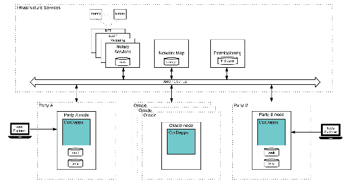

# 什么是去中心化应用程序？

从互联网诞生以来，所有开发的基于互联网的应用程序都基于客户端-服务器架构，其中有一个中心化的服务器构成应用程序的后端并控制整个应用程序。这些应用程序经常出现一系列问题，比如存在单一故障点，无法阻止网络审查，缺乏透明度，用户不相信他们的数据、活动和身份隐私等。这种中心化的架构甚至使构建某种应用程序成为不可能。例如，你不能使用这种架构构建数字货币。由于这些问题，出现了一种新的架构类型，称为**去中心化应用程序**（**DApps**）。在本章中，我们将学习关于DApps的知识。

在本章中，我们将涵盖以下主题：

+   什么是DApps？

+   去中心化、中心化和分布式应用程序之间有什么不同？

+   什么是区块链？

+   公共DApps和权限DApps之间的区别是什么？

+   某些流行的联合DApps的示例及其工作原理

+   用于构建企业DApps的各种流行平台是什么？

# 什么是DApp？

DApp是一种其后端运行在去中心化对等网络上，并且其源代码是开源的应用程序。网络中没有一个单一的节点完全控制DApp。记住，当我们说一个应用程序是去中心化的，我们指的是技术上是去中心化的，但治理可以是分布式的、去中心化的或中心化的。

区块链应用程序（DApps）的主要优势在于它们没有单一的故障点，并且可以防止审查。 DApps确实有一些缺点：一旦部署，很难修复错误或添加功能，因为网络中的每个人都必须更新他们的节点软件，而且将不同的DApps耦合在一起非常复杂，因为与集中式应用程序相比，它们很难构建，并涉及非常复杂的协议。

要使用DApp，您首先需要运行DApp的节点服务器，以便您可以连接到对等网络。然后，您需要一个与DApp对应的客户端，该客户端连接到节点服务器并公开用于使用DApp的UI或命令行界面。

目前，DApps在性能和可扩展性方面还没有像集中式应用程序那样成熟。在这些主题上仍然存在大量研究和开发，如性能、可扩展性、用户身份、隐私、DApp之间的通信、数据冗余等。一个用例可能适用于DApp，但基于当前可用技术使用例可以投入生产可能是一个挑战。去中心化应用程序的流行示例包括Torrent，Bitcoin，Ethereum，Quorum等。

一个 DApp 可以是公开的或许可的。公开的 DApp 是任何人都可以参与的，换句话说，它们是无需许可的，而许可的 DApp 是不是每个人都能加入的，所以你需要许可才能加入。当 DApp 的参与者是企业和/或政府实体时，许可的 DApp 被称为**联盟 DApp**。同样地，当许可的 DApp 的参与者只是企业时，我们可以称之为企业 DApp。在这本书中，我们将学习关于许可的 DApp 的一切。

你刚刚对分布式应用有了基本介绍，你一定想知道分布式应用和去中心化应用的区别是什么。好吧，当一个应用分布在多个服务器上时，就说这个应用是分布式的。去中心化应用默认情况下是分布式的，而中心化应用可能是分布式的也可能不是。中心化应用通常分布在多个服务器上，以防止停机，并处理大量数据和流量。

# 什么是区块链？

在我们讨论什么之前，我们需要理解什么是账本。在计算机科学中，账本是存储交易的软件。数据库与账本不同，因为在数据库中我们可以添加、删除和修改记录，而在账本中我们只能追加而不能删除或修改。

区块链基本上是一个实现去中心化账本的数据结构。区块链是相互连接的块链。每个块包含一系列交易和某些其他元数据，比如它是何时创建的，它的前一个块是什么，块号是多少，谁是块的创建者等等。每个块都维护前一个块的哈希值，因此创建了相互链接的块链。网络中的每个节点都应该保存完整的区块链副本，当一个新节点加入时，它将从其他节点请求并下载区块链。

像区块链这样的技术被称为**分布式账本技术**（**DLT**）。DLT 是在许多地点、国家和/或机构之间复制、共享和同步数字交易的过程。你可以将区块链看作是一种 DLT。此外，并不是每个 DLT 系统都必须是去中心化的。在这本书中，我们只学习构建基于区块链的去中心化应用。

使用区块链的主要优势是它使交易无需中央信任方进行 facilitation；数据使用密码学进行安全保护，并且数据是不可变的，因为区块链消除了摩擦并降低了风险，因此结算实时发生，等等。基本上，它自动化了审计，使应用程序透明化，并提供了唯一的真相来源。

在现实世界中，私有区块链被用于贸易金融、跨境支付、数字身份、代币化和数字资产的结算与清算、产品所有权溯源、关键数据记录、签订合同、多方汇总（即它们可以用作共享的行业信息主库，允许成员查询数据）、支付与支付或支付与交付等等。

每个区块链节点维护一个包含区块链状态的数据库。状态包含运行区块链中所有交易的最终结果。例如，在区块链中，状态表示所有地址的最终余额。因此，当您查询区块链节点的地址余额时，它不必浏览所有交易并计算地址的最终余额；相反，它直接从区块链的状态中获取余额。比特币使用LevelDB来维护区块链的状态。即使数据库损坏，也可以通过简单地运行区块链中的所有交易来恢复数据库。

# 理解拜占庭容错

**拜占庭容错**（**BFT**）是分布式系统的一个特性，表示它能容忍拜占庭失败。崩溃故障是指节点停止做任何事情（根本没有消息），而拜占庭失败是指节点根本不做任何事情或展示任意行为。基本上，拜占庭失败包括崩溃故障。

在任何使用区块链数据结构的去中心化计算环境中，都存在一个或多个恶意或不可靠参与者可能导致环境解散的风险。如果服务器集群中的几台服务器不能以一致的方式传递数据给其他服务器，那么服务器集群将无法正常工作。为了可靠，去中心化计算环境必须以一种方式设计，即它有解决这类拜占庭失败的解决方案。

在基于区块链的去中心化应用中，按定义没有中央权威，因此使用一种称为**共识协议**的特殊协议来实现BFT。

简单来说，你一定想知道如何确保每个人都有相同的区块链副本，以及当两个节点发布不同的区块链时如何确定哪个区块链是正确的？此外，在分布式架构中没有主节点的情况下，如何决定谁创建区块？好吧，共识协议为这些问题提供了答案。共识协议的几个例子包括**工作量证明**（**PoW**）、**权益证明**（**PoS**）、**权威证明**（**PoA**）、PBFT等等。

共识协议专为许可或公共区块链设计。为公共区块链设计的共识协议在实现为许可区块链时可能会产生安全性和性能问题。每个共识协议都有不同的性能和可扩展性向量。在为基于区块链的DApp选择共识协议时必须保持警惕。

Raft和Paxos等共识协议不是BFT；相反，它们只是使系统具有崩溃容错性。因此，在选择共识协议时，您也应考虑这一点。

您可能已经听说过PoA这个术语。 PoA是共识协议的一种分类，在其中有一组权限节点，这些节点明确被允许创建新的区块并保护区块链。 Ripple的迭代过程，PBFT，Clique，Aura等都是基于PoA的共识协议的例子。

# 用户账户的表示

在基于区块链的应用程序中，用户账户使用非对称密钥对进行标识和认证。私钥用于代表用户签署交易。基于用户名和密码的账户系统在区块链上无法工作，因为它无法证明哪个用户发送了交易。使用私钥-公钥对的缺点包括它们不用户友好，如果你丢失了私钥则无法恢复它。因此，它为用户增加了一个新的责任，即保护他们的私钥。用户账户的地址在区块链上充当账户标识符。用户账户的地址是由公钥派生的。

# 什么是UTXO？

一些区块链应用程序使用UTXO模型进行交易。比特币和MultiChain等区块链应用程序使用此模型。即使像R3 Corda这样的分布式账本技术也使用此模型。让我们通过理解比特币交易的工作方式来理解这个模型。

在比特币中，一个交易是零个或多个输入和输出的集合。这些输入和输出对象被称为**未使用的交易输出**（**UTXO**）。交易的输出被用作未来交易的输入。一个UTXO只能被使用一次。在比特币中，每个UTXO包含一个面额和一个所有者（比特币地址）。在这个模型中，未使用的UTXO中的地址余额被存储。要使交易有效，必须满足以下要求：

1.  交易必须包含对每个消耗的UTXO的所有者的有效签名

1.  所消耗的UTXO的总面额必须等于或大于所生产的UTXO的总面额

用户的余额被计算为他们拥有的UTXO的面额总和。交易可以消耗零个或多个UTXO并产生零个或多个UTXO。为了向矿工支付奖励，它在区块中包含一个交易，该交易消耗零个UTXO，但产生一个UTXO，其面额分配给它应该授予自己的比特币数量。

当区块链交易涉及资产转移时，UTXO事务模型是合适的，但对于无资产转移交易（如记录事实、调用智能合约等），这种模型就不合适了。

# 流行的许可制区块链平台

现在，我们已经基本了解了什么是DApp、区块链和DLT，让我们来概述一下可用于构建许可制区块链应用程序和DApp的平台。我们只会介绍市场上流行的、有需求的平台。

# 以太坊

以太坊是继比特币之后最受欢迎的DApp。以太坊是一个分散的平台，允许我们在其上构建其他基于区块链的DApp。在以太坊中，我们使用以太坊智能合约来构建DApp。智能合约是一种完全按程序运行的应用程序，没有任何停机时间、审查、欺诈或第三方干预的可能性。以太坊可以看作是一个部署和运行智能合约的平台。以太坊支持两种共识协议，即PoW和PoA（Clique）。

主要的以太坊公共网络使用PoW进行共识。如果您想部署自己的私有以太坊网络，那么您必须使用PoA。PoW需要大量的计算能力来保护区块链的安全，因此适用于公共区块链使用，而PoA则没有任何这样的计算能力要求；相反，它需要网络中的少数权威节点来达成共识。

你一定在想为什么我们需要智能合约来构建DApp。为什么不能简单地在区块链上放置格式化消息，以交易的形式在客户端上解释它们呢？好吧，使用智能合约可以为你带来技术和商业上的双重利益。

# Quorum

Quorum是一个分散的平台，允许我们在其上构建基于许可制区块链的DApp。实际上，Quorum是以太坊的一个分叉（实际上Quorum是以太坊的一个分叉，使用Golang实现的以太坊的一个实现），因此如果你曾经在以太坊上工作过，那么你将会发现学习并使用Quorum来构建许可制区块链是很容易的。许多企业选择Quorum来构建区块链，因为以太坊拥有庞大的社区，这使得找到以太坊开发人员变得容易。Quorum与以太坊的不同之处在于，它支持隐私（让各方可以私下进行交易）、对等节点白名单，因此可以指定允许连接到您的节点的其他节点列表（在以太坊中，这需要在网络级别完成），适用于许可制区块链的许多不同类型的共识协议，并提供非常高的性能。

Quorum目前支持三种共识协议，QuorumChain、IBFT和Raft。在本书中，我们将跳过QuorumChain，因为Raft和IBFT满足了我们的所有需求。

Microsoft Azure提供了BaaS，可以在云上轻松构建自己的Quorum网络。但是，在本书中，我们将学习如何手动安装，并不会使用BaaS。

# 奇偶校验

以太坊的流行节点软件包括 Go Ethereum、以太坊 C++ 和 Parity。Parity 还支持两种与以太坊的 PoW 不同的共识协议，专为权限区块链设计。这些共识协议是 Aura 和 Tendermint。许多以太坊开发者在不需要 Quorum 提供的额外功能时，会使用 Parity 而不是 Quorum。

由于 Parity 与 Quorum 没有提供任何独特的功能，所以我们将在本书中跳过 Parity。但是，一旦你完成了这本书，你会发现很容易掌握 Parity 的概念，并且也能够利用它构建一些东西。

# MultiChain

MultiChain 是一个构建基于权限的区块链 DApps 的平台。MultiChain 的独特功能包括权限管理、数据流和资产。它不支持智能合约。这是一个构建基于区块链的 DApps 的非智能合约平台的例子。MultiChain 使用循环验证共识。

最初，MultiChain 的理念是在区块链上管理资产的所有权和转移。对资产的操作包括发行、再发行、转移、原子交换、托管和销毁。后来，数据流被引入以提供在 MultiChain 中表示数据的不同方式。在 MultiChain 中可以创建任意数量的流，每个流都是独立的追加集合。关于流的操作包括创建流、写入、订阅、索引和检索。因此，基本上，MultiChain 上的区块链用例可以建立在资产或流的基础上。最后，权限管理用于控制谁能连接、交易、创建资产/流、挖掘/验证和管理。

MultiChain 提供与比特币生态系统最大的兼容性，包括点对点协议、交易/区块格式、UTXO 模型和比特币核心 API/运行时参数。因此，在开始学习 MultiChain 之前，最好至少了解比特币的工作原理。

# Hyperledger Fabric 1.0

在介绍 Hyperledger Fabric 1.0 之前，我们需要明确了解 Hyperledger 的概念。Hyperledger 是由 Linux 基金会于 2015 年 12 月发起的一个开源区块链和相关工具的整体项目。在撰写本书时，Hyperledger 有四个项目：Fabric、Sawtooth、Iroha 和 Burrow。

Hyperledger Fabric 是 Hyperledger 下最受欢迎的项目。IBM 是该项目的主要贡献者。IBM 的 Bluemix 还提供了在云上构建自己的 Fabric 网络的 BaaS 服务。

Hyperledger Fabric 1.0 是一个构建自己的基于区块链的权限管理应用的平台。当前，在撰写本书时，Hyperledger Fabric 1.0 仅支持分布式架构，并且对于区块的创建，它依赖于一个名为**orderer**的中心可信节点。它支持智能合约、网络许可、隐私和其他功能。在 HLF 1.0 中，有一种特殊的节点称为**OSN**，由可信方托管。这个 OSN 创建区块并分发给网络中的对等方。由于信任这个节点，没有必要进行共识。HLF 1.0 目前支持CouchDB和LevelDB来存储区块链的状态。网络中的对等方默认在LevelDB数据库中存储区块链的状态。

HLF 1.0 通过频道的概念实现隐私。频道是网络中的子区块链，并且允许根据配置让某些参与方成为某个频道的一部分。实际上，每个交易都必须属于一个频道，当部署 HLF 1.0 网络时，默认会创建一个默认频道。OSN 可以看到所有频道中的所有数据，因此它应该是一个可信的方。从技术上讲，如果你不能信任单个方处理所有频道，可以配置网络来拥有托管不同频道的多个OSN。即使流量庞大或者OSN的可用性至关重要，也可以将Kafka连接到OSN以获得更好的性能和更高的稳定性。如果需要高可用性，我们甚至可以每个频道连接多个经过Kafka连接的OSN。

Fabric 1.0 有一个名为**交易背书**的特性，提供了在发送交易之前从特定方批准的机制。当我们说一个成员在网络中背书了一笔交易时，我们的意思是该成员已经验证了交易。HLF 中的每个链码（智能合约）在部署时都有一个背书策略。该策略规定了哪些成员必须背书与该链码相关的交易。默认策略规定频道中的任一成员必须签署交易。但是，我们可以定义包含**AND**和**OR**运算符的自定义策略。

此外，同一频道的对等方无论是否存在OSN，都会向彼此广播区块，但在缺乏OSN的情况下，无法为频道创建新的区块。对等方使用称为**gossip数据传播协议**的特殊协议广播区块。

HLF 1.0 拥有非常先进的成员功能，可以控制网络成员，并且也内部使用于特定组织。在 HLF 1.0 中，您可以用 Java 或 Go 编程语言编写链码。将来，Fabric 1.0 将配备 **Simple Byzantine Fault Tolerance**（**SBFT**）共识协议和其他一些功能，这将使我们能够构建 DApps。同样，还有各种新功能正在开发中，并将作为产品的子版本在将来发布。

构建您的第一个 HLF 1.0 应用程序的最佳方式是查看 [https://github.com/hyperledger/fabric-samples](https://github.com/hyperledger/fabric-samples) 上的示例，并根据您的应用程序需求进行修改。您可以在 [http://hyperledger-fabric.readthedocs.io/en/latest/](http://hyperledger-fabric.readthedocs.io/en/latest/) 找到 HLF 1.0 的详细文档。

# BigchainDB

BigchainDB 是一个使用区块链的分布式数据库。BigchainDB 具有高度可扩展性和可定制性。它使用区块链数据结构。它支持诸如丰富的权限、PB 级容量、高级查询、线性扩展等功能。在编写本书时，BigchainDB 尚未达到生产就绪，但可用于构建**概念验证**（**PoCs**）。我们将在后面的章节中学习它的工作原理，并使用它创建一个基本的 PoC。

# 星际文件系统

**星际文件系统**（**IPFS**）是一个分布式文件系统。IPFS 使用 **分布式哈希表**（**DHT**）和 Merkle **有向无环图**（**DAG**）数据结构。它使用类似于 Torrent 的协议来决定如何在网络中移动数据。IPFS 的一个高级功能是它支持文件版本控制。为了实现文件版本控制，它使用类似于 Git 的数据结构。

尽管它被称为分布式文件系统，但它并不遵循文件系统的一个主要属性，即，当我们将某物存储在文件系统中时，应该一直存在，直到删除。但是，IPFS 的工作方式并不是这样的。每个节点并不存储所有文件，而是仅存储它需要的文件。因此，如果一个文件不受欢迎，那么许多节点将不会拥有该文件，因此文件在网络中消失的可能性很大。由于这个原因，我们可以称 IPFS 为分布式点对点文件共享应用程序。我们将在后面的章节中了解它的工作方式。

# Corda

Corda 是一个用于构建自己的基于权限的 DLT 应用程序的平台。Corda 是 R3 的产品。R3 是一个与超过 100 家银行、金融机构、监管机构、贸易协会、专业服务公司和技术公司合作的企业软件公司，致力于开发 Corda。Corda 的最新版本是 1.0，旨在取代用于金融交易的传统软件，并使组织能够数字化使用传统软件系统繁琐的各种业务流程。

上述图表显示了 Corda 网络的高级架构。让我们从高层次了解 Corda 的架构。R3 的 Corda 的想法是为金融交易提供共享可信赖的分类账。R3 的 Corda 不是一个区块链平台，因此没有区块、全局广播等概念。所有交易都是点对点的。Corda 应用程序不是去中心化的。在 Corda 中，智能合约称为**CorDapps**，它们是用 Java 或 Kotlin 编写的。

基础设施服务形成了网络中的节点，应由信任方承载。网络地图发布了所有其他节点的 IP 地址，以便节点可以联系其他节点。权限服务为节点提供加入网络的权限；如果允许加入网络，则节点将从网络的权限服务收到根权威签名的 TLS 证书。记帐员提供交易排序和时间戳服务（可选地，记帐员还充当时间戳授权，验证交易在记帐之前发生在特定时间窗口内）。记帐服务可以是单个网络节点、一组互相信任的节点集群或一组互相不信任的节点集群。

预期由网络不信任的企业承载记帐员，因此记帐员之间需要达成共识，因此 Corda 提供了各种可插拔的共识协议，如 Raft、BFT 等。

有时，Corda 应用需要依赖外部应用程序 API。例如，使用 Corda 构建的多币种银行间支付应用程序需要获取汇率。在这种情况下，发起交易的节点可以获取汇率并放入交易中，但你如何信任该节点？另外，每个节点都不能简单地重新获取汇率以验证其是否正确，因为其他节点获取汇率时汇率可能已经发生变化，并且这也不是可扩展的解决方案。因此，Corda 提供了 Oracle 来解决这个问题。网络中可以有一个或多个 Oracle。Oracle 是作为两个应用程序之间通信的桥梁的服务。在 Corda 中，交易发起者可以从 Corda 网络外获取信息，并从**Oraclize**获取签名以证明其有效性。可选地，Oraclize 还可以根据请求向交易发起者提供信息。显然，Oraclize 应该由信任的方承载，关于他们提供和签名的信息。

Corda支持任何可插拔的RDBMS（当前正在使用H2数据库）来存储智能合约数据。数据隐私由哪些节点可以看到交易来维护。框架还提供了多重签名支持，这使得多个节点可以签署交易。Corda的一个主要缺点是，由于没有全局广播，每个节点必须以传统方式维护自己的备份和故障转移冗余，因为网络中没有内置冗余。节点将存储交易并重试向接收者发送消息，直到接收者成功接收为止。一旦消息被接收，发送方就没有更多的责任。

# 交易的有效性

由于并非所有交易都广播给网络中的所有参与方，为了防止双重支付（双重支付是一种攻击DLT，将相同的资金花费两次，转移相同的资产两次等），我们使用公证员。公证员包含所有未使用的UTXOs，在公证之后，他们将其标记为已使用，并将新的未使用的UTXOs加入其状态。在发送给其他参与方之前，交易发起者会请公证员对交易进行公证。

只有在公证员先前签署了交易的输入状态时，公证员才能签署交易。但是，这并不总是情况，因此Corda还让我们改变状态的指定公证员。这种情况通常是由于以下原因导致的：

+   消耗具有不同指定公证员的状态的交易

+   一个节点希望使用不同的公证员以实现隐私或效率

在这些交易可以创建之前，状态必须首先被重新指向以使所有状态具有相同的公证员。这是通过特殊的改变公证的交易来实现的。

CorDapps不像其他平台的智能合约那样有状态。它们的目的只是验证所产生的输出是否正确。每个UTXO指向一个CorDapp。CorDapps定义了UTXOs的格式。在一个交易中，我们可以有来自多个CorDapps的UTXOs，在这种情况下，每个CorDapp只运行一次，并验证属于它的所有输入和输出。要使交易有效，它必须在合约上有效；CorDapp应该批准它。

除了输入和输出，交易可能还包含命令，即平台本身不解密但有助于 CorDapps 处理输入和输出的小数据包。命令是与一些公钥关联的数据片段。命令用于向 CorDapps 提供它无法通过 UTXOs 获得的附加信息。在合同开始执行之前，平台确保交易由命令中列出的每个密钥签名。因此，CorDapp 可以相信所有列出的密钥已签署了交易，但需要验证预期的各方是否已签署。公钥可能是随机的或无身份的以保护隐私，也可能与知名的法律身份相关联。

Oracle 会以命令的形式向交易提出者提供已签名的信息，这些命令封装了特定的事实，并将 Oracle 列为必需的签名者。

交易也可以包含附件的哈希值。附件是 ZIP/JAR 文件。当存在大量数据片段可以在多个不同的交易中重用时，附件非常有用。

在验证提议的交易时，节点可能没有所需的交易链上的所有交易。因此，Corda 允许节点从提议者那里请求缺失的交易。交易提出者始终会拥有所需交易链的所有交易，因为在验证交易并创建提议的交易输入状态时，他们会请求这些交易。

最后，一旦交易提交，您可以查询 Vault（跟踪未消耗和已消耗的状态）。

要了解有关 Corda 的更多信息并构建您的第一个 Corda 应用程序，请访问 [https://docs.corda.net/](https://docs.corda.net/)，其中包含详细的文档。您可以下载并尝试几个示例应用程序。

# Hyperledger Sawtooth

Sawtooth 是一个用于构建自己的许可 DApps 的分散平台。 Sawtooth 的主要贡献者是英特尔。 Sawtooth 的特殊之处在于它使用了 **受信任的执行环境** (**TEE**)（目前仅支持 Intel 的 SGX）进行共识，这使得网络非常安全和可信，并增加了对共识最终结果的信任。

TEE 是主处理器的安全区域。它保证了加载到内部的代码和数据在机密性和完整性方面的保护。 TEE 是一个隔离的执行环境，提供了诸如隔离执行、受信任应用程序的完整性以及其资产的机密性等安全功能。

**已过时间的证明** (**PoET**) 是 Sawtooth 使用的共识协议的名称。在 PoET 中，有一种特殊类型的节点称为验证者。验证者必须在支持 SGX 的 CPU 上运行其节点。这就是 PoET 的工作原理。

每个验证器向隔离区（一个可信函数）请求等待时间。对于特定的交易块，等待时间最短的验证器被选为领导者。一个函数，比如 `CreateTimer`，为交易块创建一个定时器，这个定时器被保证是由隔离区创建的。另一个函数，比如 `CheckTimer`，验证定时器是否由隔离区创建，并且如果定时器已经过期，则创建一个可以用来验证验证器是否确实等待了规定时间后才声明领导地位的认证。PoET 在整个验证器群体中随机分配领导选举。选举的概率与贡献的资源成比例（在这种情况下，资源是具有 TEE 的通用处理器）。执行的认证提供了一个验证证书是在隔离区内创建的（以及验证器是否等待了规定的时间）的信息。此外，参与的低成本增加了验证器群体庞大的可能性，增加了共识算法的稳健性。

Sawtooth 也支持智能合约（具体来说，以太坊智能合约可以在 Sawtooth 上执行）。在性能方面，Sawtooth 在大量交易和节点方面都表现出色。

# 流行的区块链用例

让我们看一些许可区块链的流行用例。这将帮助我们了解企业可以使用许可区块链做什么以及什么用例适用于许可区块链。

# Everledger

Everledger 是一个由区块链支持的钻石数字登记处。它是区块链上的供应链管理的一个例子。之所以使用区块链，是因为在区块链中，记录是不可变的。Everledger 使用了 40 多个特征，包括颜色和净度，来创建钻石的 ID。当这些信息被放置在区块链上时，这些信息就成为了一份记录宝石所有权的证书，从矿山到戒指。Everledger 已经将超过一百万颗钻石数字化，并与包括巴克莱在内的公司合作。区块链网络的参与者，如商户、银行和保险公司，可以验证钻石是否合法。Everledger 建立在 Hyperledger Fabric 平台上。未来，他们还计划将其他珍贵商品添加到他们的区块链中。

让我们举个例子场景，看看区块链如何在这个用例中发挥作用。Alice 购买了一颗钻石，对其进行了保险，并在 Everledger 区块链上注册了它。接下来，她丢失了钻石，并报告了失窃。保险公司随后对她进行了赔偿。最后，小偷 Bob 试图向珠宝商 Eve 出售被盗的钻石。她向 Everledger 请求验证，并发现这是一颗被盗的钻石。保险公司被通知有关被盗的钻石，并将其占有。

# 沃尔玛的食品追踪

沃尔玛的食品追踪用例是区块链和物联网的结合，使食品产品的历史透明化和可追溯到其来源。这是区块链上的供应链管理示例。沃尔玛的食品追踪供应链管理建立在Hyperledger Fabric平台之上。

每年有很多人死于食物中毒。一旦有人因食物中毒而生病或死亡，当局会试图追踪食物的来源，并确保源自该地的所有食品暂停销售并召回。这拯救了很多人的生命。但问题在于，由于供应链中的每个参与方都有自己的存储和检索信息的方式和过程，因此当局需要数周的时间来追踪来源，并阻止链中的每个人销售食品。区块链结合物联网也许能够解决这个问题。

随着供应链中的每个参与方都存储和检索信息，区块链可以加快查找食品来源的过程。以下是区块链可以添加的额外好处列表：

+   消费者可以准确地了解食品产品的收获地点。

+   由于对食物中毒的恐慌，人们倾向于扔掉干净的食物，这增加了食物浪费的数量。区块链可以准确定位有问题的食物，从而防止食物浪费。

+   供应链中的每个步骤对所有人都是可见的。可以避免欺诈性食品进入市场。

+   区块链可以作为证据证明某个有问题的食品是从特定生产者那里运出的。由于这个原因，生产者会小心并遵守安全操作规程，因为如果他们不这样做，就会被证据抓住。

+   最后，每个食品都有一个与之相关的故事。这使用户能够了解食品的历史。

物联网技术，如传感器和射频识别标签，使食品产品沿着供应链传递时可以实时写入区块链的数据。

让我们看一个例子，了解在这种情况下区块链记录了什么，以及参与者是谁。参与者包括食物的原产地农场、打包加工厂、运输食物的货运公司、沃尔玛商店等等。记录在区块链上的数据包括农场原产地数据、批号、工厂和加工数据、过期日期、储存温度和运输细节。

# 加纳的土地登记

BenBen 是一支致力于为加纳建设创新产品以改善政府技术的研发工程师团队。他们利用区块链为加纳公民开发了数字土地登记解决方案。

在加纳，银行在发放贷款时不接受土地作为抵押品。这是因为在加纳，纸质登记系统在法庭上不可执行。这导致数百万人无法获得贷款。

BenBen 为金融机构提供了一流的栈顶土地登记和验证平台。该平台捕获交易并验证数据。BenBen 与金融机构合作更新当前登记册，启用智能交易，并为客户分发私钥，以实现各方之间自动化和可信赖的房地产交易。

# 迪拜的住房租赁

迪拜的住房租赁用例是一个区块链应用程序，让个人外籍人士在几分钟内在线租赁公寓或更新他们的住房租赁合同。在迪拜，如果一个人想租一间公寓，那么他们必须提供 KYC 文件，支票作为合同期限的保证，并创建 Ejari（迪拜政府合同，用于合法化迪拜房东和租户之间原本不愉快的关系）。在迪拜，大多数房地产公司只有在您想要长期居住（例如，至少一年）并确保您遵守合同的情况下才会租给您公寓，并要求您提供预期支票作为保证，因为在迪拜，支票被退回被视为犯罪行为。由于租赁公寓和续签租赁合同的过程对租户和房地产公司来说都是繁琐的过程，迪拜智能政府（Smart Dubai 的技术部门，致力于将迪拜在技术上进行转型的城市范围倡议）启动了一个使整个流程更轻松、更快速的使命，使用区块链。

此住房租赁应用程序是使用 Hyperledger Fabric 1.0 构建的，最初有七个实体参与了网络。迪拜智能政府（DSG，迪拜智能的技术部门，是一个旨在通过区块链使租赁合同的创建和续签更容易的全市倡议）, 迪拜移民和外国人事务总局（DNRD），wasl，迪拜土地部门，迪拜电力和水务局（DEWA），阿联酋迪拜国民银行（NBD）和阿联酋伊斯兰银行（EI）是参与分享他们的区块链数据，以使租赁合同的创建和续签更加容易的实体。

早先，DSG 和**阿联酋身份局**（**EIDA**）推出了DubaiID，允许迪拜居民通过一个登录统一访问政府机构提供的所有电子服务，并通过互联网与之交互。在这个区块链用例中，租户必须使用DubaiID登录到房地产门户；在这种情况下，wasl的租户必须有DubaiID才能登录。一旦登录，DSG 将阿联酋身份证号写入区块链，而DNRD则在区块链上为该租户共享签证和护照信息。然后，wasl的门户将用户重定向到使用阿联酋NBD或EI银行账户提交数字支票。一旦提交了数字支票，就会通过区块链向DLD发出请求以续签或创建Ejari。最后，一旦Ejari处理完成，DEWA将被通知激活水电供应。所以基本上，第一个试点是为想要租赁或续签wasl公寓并拥有阿联酋NBD或EI银行账户的个人服务的。很快，更多的银行和房地产公司将被添加到网络中，以为迪拜更多的人提供此服务。在这个过程中，确保一条信息只能被相关方看到。

这个用例非常适合作为一个区块链用例，因为需要一个签名的不可变总账来存储KYC、支票和Ejaris，后者如果客户或任何实体试图进行欺诈，都可以得到证明。例如，当阿联酋NBD发放支票时，如果他们没有使用区块链，而是简单地进行点对点的API调用，那么ENBD、租户和wasl之间关于数字支票的存在或当前状态存在故意和非故意的分歧的可能性就非常大。因此，如果发生任何争议，区块链可以成为最终的参考工具。

# Ubin 项目

**Ubin 项目**是新加坡金融管理局（**MAS**）和R3合作的数字现金总账项目，参与方包括**美国银行**（**BOA**）**美林证券**、**瑞士信贷**、星展银行、**香港上海汇丰银行有限公司**、摩根大通、**三菱日联金融集团**（**MUFG**）、华侨银行、**新加坡交易所**（**SGX**）和**大华银行**（**UOB**），以及**BCS信息系统**作为技术提供商。

Ubin 项目的目标是在分布式账本上构建SGD（新加坡国家货币）的数字化形式，以为新加坡的金融生态系统带来许多好处。这些好处与任何其他加密货币的好处相同。

目前，该应用程序是使用Quorum构建的，但未来可能会转移到Corda，因为R3是合作伙伴之一。

MAS 是新加坡的中央银行和金融监管机构。MAS充当新加坡支付、清算和结算系统的结算代理、运营商和监管机构，着重于安全性和效率。

# 摘要

在本章中，我们了解了什么是 DApps，并对基于区块链的 DApps 进行了概述。我们了解了区块链是什么，它的好处是什么，并看到了我们可以使用的各种平台来构建基于区块链的 DApps。最后，我们看到了一些用例以及区块链如何为金融和非金融行业带来改变。在下一章中，我们将深入了解以太坊和 Quorum，并构建一个基本的示例 DApp。
