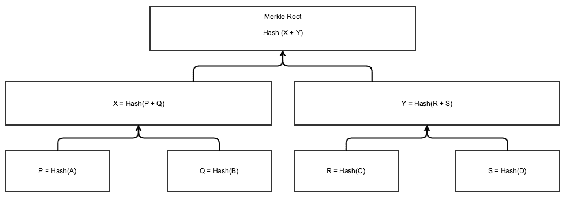

# 第二章：使用 Quorum 构建区块链

在上一章中，我们了解了什么是 DApp、DLT 和区块链。我们还看到了一些流行的基于区块链的 DApp 的概述。目前，以太坊是继比特币之后最流行的公共 DApp。在本章中，我们将学习如何使用 Quorum 构建基于权限的区块链 DApp。我们将通过探索 Quorum 支持的所有不同共识协议、其权限和隐私功能以及最后能够快速部署 Quorum 网络的工具来深入了解 Quorum。

在本章中，我们将涵盖以下主题：

+   以太坊用户账户

+   Merkle 树是什么以及在区块链中如何使用它？

+   **伊斯坦布尔拜占庭容错**（**IBFT**）和 Raft 如何工作？

+   Quorum 支持的各种机制，以实现隐私

+   设置星座、Raft 和 IBFT 网络

+   与 Quorum 相关的各种第三方工具或库

# Quorum 概述

Quorum 是一个允许我们在其上部署 DApp 的权限分散平台。DApp 是使用一个或多个智能合约创建的。智能合约是按照程序编写的、没有任何停机、审查、欺诈或第三方接口可能性的程序。在 Quorum 中，智能合约可以用 Solidity、LLL 或 Serpent 编写。Solidity 是首选。一个智能合约可以有多个实例。每个实例由唯一地址标识，并且您可以在同一 Quorum 网络上部署多个 DApp。

在以太坊中，有一种名为**以太**的内部货币。要部署或执行智能合约，您需要向矿工支付以太，而 Quorum 是以太坊的一个分叉，这里也存在同样的情况。但在 Quorum 中，以太是无价值的，并且在**创世块**生成了固定数量的以太，之后不会再生成更多的以太。用户账户和智能合约都可以持有以太。在 Quorum 中，您需要一些以太来执行网络上的交易，但不会扣除以太，并且向另一个账户发送以太也不会扣除以太，因此可以说，在 Quorum 中，以太提供了一种跟踪账户所有者的方法，如果有任何可疑情况通过跟踪以太转账并提供一种方式使您需要从网络成员中获取一些以太才能进行交易的话，这就是，从一个允许的成员获取一些以太。

目前，Quorum 支持三种共识协议：QuorumChain、IBFT 和 Raft。在本书中，我们将只学习 Raft 和 IBFT，因为它们是最常用的。对于隐私，它支持两种机制：零知识安全层协议和私有合约。我们将学习私有合约，但不会涵盖 ZSL，因为它仍未达到生产就绪状态。

# 以太坊账户

要创建一个账户，我们只需要一个非对称密钥对。有各种算法，例如**Rivest–Shamir–Adleman**（**RSA**）和**椭圆曲线密码学**（**ECC**）用于生成非对称密钥对。以太坊使用 ECC。ECC 有各种曲线。这些曲线具有不同的速度和安全性。以太坊使用**secp256k1**曲线。深入了解 ECC 及其曲线需要数学知识，但深入理解它并不是构建使用以太坊的 DApps 所必需的。

以太坊使用 256 位加密。以太坊的私钥和公钥是一个 256 位的数字。由于处理器无法表示如此大的数字，因此它总是被编码为长度为 64 的十六进制字符串。

每个账户都由一个地址表示。一旦我们有了生成地址所需的密钥，这里是生成地址的步骤，以及从公钥生成地址的步骤：

1.  首先，生成公钥的**Keccak-256**哈希值。它将给你一个 256 位的数字。

1.  丢弃前 90 位和 12 字节。现在，您应该有 160 位的二进制数据（20 字节）。

1.  现在，将地址编码为十六进制字符串。因此，最后，您将得到一个 40 个字符的字节字符串，这就是您的账户地址。

现在，任何人都可以向这个地址发送以太币，然后您可以签名并从这个地址发送交易。

# 以太坊交易是什么？

交易是一个数据包，用于将以太币从一个账户转移到另一个账户或合约，调用合约的方法，或部署一个新的合约。交易使用**椭圆曲线数字签名算法**（**ECDSA**），这是一种基于 ECC 的数字签名算法。一笔交易包含一个标识发送者并证明其意图的签名，要转移的以太币金额，交易执行允许的最大计算步骤数（称为**燃气限额**），以及发送交易的人愿意支付的每个计算步骤的成本（称为**燃气价格**）。用燃气使用量乘以燃气价格得到的乘积称为**交易费用**。

在受权限控制的网络中，以太币是无价值的。在 Quorum 网络中，以太币在创世块中提供，并且不是在运行时动态生成的。您需要在创世块中提供以太币。您需要提供燃气以防止攻击，例如无限循环。交易被挖掘时，以太币不会从账户中扣除。

如果交易的意图是调用合约的方法，它还包含输入数据，或者如果它的意图是部署一个合约，那么它可以包含初始化代码。要发送以太币或执行合约方法，您需要向网络广播一个交易。发送者需要用其私钥签名交易。

如果我们确信一笔交易将始终出现在区块链的同一位置，我们就说该交易已确认。在以太坊的工作证明中，建议在最新区块的下方等待该交易出现 15 个区块（即等待 15 个确认）再假定该交易已确认，因为存在分叉的可能性，交易可能从区块链中消失。但是，在 Quorum 的 Raft 或 IBFT 中，一旦交易出现在其中一个区块中，我们就可以说它已确认，因为没有分叉的可能性。

# 什么是 Merkle 树？

在我们深入了解区块链中区块的 Merkle 根之前，让我们先了解区块链的结构。一个区块由两部分组成；第一部分是区块头，第二部分是该区块的交易集。区块头包含诸如上一个区块哈希（实际上是上一个区块头的哈希）、时间戳、Merkle 根以及与达成共识相关的信息。

在同步时，当一个节点下载一个区块时，该节点下载区块头和区块的交易。那么，接收节点如何知道这些交易实际上是该区块的一部分，并且按正确的顺序排列的呢？每个区块都由唯一的哈希标识，但是区块哈希不是区块头的一部分，并且是每个节点在下载区块后独立计算的唯一哈希；因此我们不能使用区块哈希的概念。相反，我们可以依赖类似交易哈希的东西；一个存储在区块头中的哈希，通过组合所有交易并对其进行哈希计算得到。这个想法将完美地发挥作用，并且我们可以检测到是否有任何交易丢失或额外交易包含在内，或者交易是否按正确的顺序。

嗯，Merkle 根是交易哈希方法的一种替代方法，但提供了另一个主要优势：它允许网络拥有轻节点。当然，我们可以实现没有 Merkle 根的区块链，但如果网络需要轻节点，则必须使用 Merkle 根。轻节点是仅下载区块头而不下载交易的节点，但仍应能够为客户端提供所有 API。例如：智能手机无法拥有完整的区块链，因为它可能非常庞大；因此，我们可以在智能手机中安装轻客户端。

让我们首先了解二进制 Merkle 树在区块链中是什么。哈希树或 Merkle 树是一种树，其中每个叶节点是一个交易的哈希，每个非叶节点是其子节点的哈希的哈希。哈希树允许高效和安全地验证哪些交易是区块的一部分。每个区块都形成自己的 Merkle 树。当每个父节点都有两个子节点时，Merkle 树被称为**二进制 Merkle 树**。二进制 Merkle 树是区块链中使用的树。以下是二进制 Merkle 树的示例：



在上面的图表中，首先计算每个交易的单独哈希。然后，它们被分成两组。然后，对于每一对，计算两个哈希的哈希。这个过程将持续进行，直到我们有一个称为**默克尔根**的单一哈希。如果交易数量为奇数，最后一个交易会被复制，以使交易总数为偶数。

现在，在下载完整区块、区块头和区块的交易时，节点可以通过形成二叉默克尔树并检查生成的默克尔根是否与包含在区块头中的默克尔根相同，来验证交易集是否正确。当然，这也可以在没有默克尔树的情况下完成，正如前面讨论过的。

轻节点可以利用默克尔树为客户端提供服务。例如，轻节点可以向完整节点发出请求，询问特定交易是否已经在某个区块中提交，完整节点会回复区块编号和默克尔证明，以证明交易是否已经在某个区块中提交。然而，轻节点不能仅仅相信完整节点提供的区块编号，因此完整节点还需提供默克尔证明。为了理解什么是默克尔证明，让我们来看看前面的图表以及轻节点询问完整节点 *TxD* 是否已提交的情况。现在，完整节点返回区块编号以及一个子树，其中包括 *H[ABCD]*、*H[AB]*、*H[CD]*、*H[C]* 和 *H[D]*。这个子树就是默克尔证明。现在，轻客户端可以拿到这个默克尔证明并验证它。验证将包括检查默克尔证明是否构造正确以及默克尔证明的默克尔根是否与完整节点声称交易所在的区块头中的默克尔根相同。你可能会想，如果一个完整节点声称交易已提交，但实际上尚未提交，该怎么办呢？在这种情况下，解决这个问题的唯一方法是请求多个完整节点，而且它们都不太可能撒谎。没有默克尔树，这个功能是无法实现的。

以太坊区块链更加复杂。现在，假设以太坊轻节点想要知道某个账户的余额、从智能合约中读取数据、找到交易的燃气估算值等等，那么通过这种简单的交易二叉默克尔树将无法提供这种功能。因此，在以太坊中，每个区块头不仅包含一个默克尔树，而是包含三个默克尔树，用于三种类型的对象：

+   交易

+   交易收据（基本上是显示每个交易效果的数据片段）

+   状态

现在我们有了三棵树，让我们来看一个轻节点向完整节点提出的高级查询示例。查询是*假装在这个合约上运行这个交易。交易收据和新状态会是什么？* 这由状态树处理，但计算方式更为复杂。在这里，我们需要构造一个**Merkle 状态**转换证明。基本上，它是一种证明，宣称：如果在具有根*S*的状态上运行交易*T*，则结果将是具有根*S'*的状态，其中包括交易收据*R*。为了计算状态交易证明，完整节点在本地创建一个虚假块，将状态设置为*S*，并假装成为一个轻节点，同时应用交易。也就是说，如果应用交易的过程需要轻节点确定账户余额，则轻节点进行余额查询。如果轻节点需要检查特定合约的存储中的特定项目，则轻节点进行该查询，依此类推。完整节点*正确响应*自己的所有查询，但跟踪发送回的所有数据。然后完整节点将来自所有这些请求的组合数据作为证明发送给轻节点。然后轻客户端执行完全相同的过程，但使用提供的证明作为其数据库，而不是向完整节点发出请求，如果其结果与完整节点声称的相同，则轻客户端接受输出为完整节点所声称的输出。

对于状态，以太坊使用**Merkle Patricia 树**而不是二叉树。对于状态树，情况更加复杂。以太坊中的状态基本上由键值映射组成，其中键是地址，值是每个账户的账户余额、nonce、代码和存储（其中存储本身是一棵树）。要了解 Merkle Patricia 树的工作原理，请访问[`easythereentropy.wordpress.com/2014/06/04/understanding-the-ethereum-trie/.`](https://easythereentropy.wordpress.com/2014/06/04/understanding-the-ethereum-trie/)

在企业区块链中，不使用轻客户端，因为节点代表一个企业，而企业有基础设施来运行完整节点。

# 区块链中的分叉是什么？

当节点之间关于区块链的有效性存在冲突时，即网络中存在多个区块链时，就会发生分叉。分叉有三种类型：常规、软分叉和硬分叉。

当同时存在两个或更多个相同高度的区块时，就会发生常规分叉。这是一种暂时的冲突，会自动解决。节点通过选择最准确的区块链来解决这个问题。例如，在工作量证明中，如果两个矿工同时挖出一个区块，那么就会创建一个常规分叉。这是通过选择具有最高难度的区块链来解决的，因为它被认为是最准确的一个。

相比之下，软分叉是指对区块链协议的任何更改都是向后兼容的。比如，新规则可能只允许 1 MB 区块，而不是 2 MB 区块。非升级的节点仍然会将新的交易视为有效（在本例中，1 MB 小于 2 MB）。然而，如果非升级的节点继续创建区块，那么它们创建的区块将被升级的节点拒绝。因此，如果网络中的少数节点升级了，则它们形成的链将变得不太准确，并被非升级节点创建的区块链覆盖。软分叉在网络中的大多数节点升级其节点软件时解决。

硬分叉是一种软件升级，引入了一个与旧软件不兼容的新规则到网络中。你可以把硬分叉看作是规则的扩展。例如，允许区块大小为 2 MB 而不是 1 MB 的新规则将需要进行硬分叉。继续运行旧版本软件的节点将会将新交易视为无效。因此，只有当网络中的所有节点都升级其节点软件时，分叉才能解决。在那之前，网络中将会有两个不同的区块链。

你一定听说过比特币和以太坊的分叉。例如，比特币现金和以太经典是硬分叉的形成。网络中的许多矿工和节点不同意新协议，并选择运行旧软件，从而分裂出网络并形成了一个不同的网络。

# Raft 共识

让我们看看 Raft 共识协议的工作原理，以一个足以让我们舒适地构建 DApps 的水平。我们不会深入研究 Raft，因为这并不必要。

Raft 用于半可信网络，并且有一种希望获得更快的区块时间（以毫秒为单位而不是秒）和单次确认（没有定期的分叉）的愿望。

网络中的每个节点都会保留网络中所有其他节点的列表，无论它们是否正在运行。Raft 集群中的服务器可以是领导者或追随者，并且在选举时可能是候选者，这种情况发生在领导者不可用时。每次只能有一个领导者。领导者负责创建和发送区块给追随者。它通过定期发送心跳消息来告知追随者自己的存在。每个追随者都有一个超时（通常在 150 和 300 毫秒之间），称为**选举超时**，在此期间它期望来自领导者的心跳。每个节点都使用在 120-300 ms 范围内的随机选举超时。收到心跳后，选举超时会被重置。如果没有收到心跳，追随者会将其状态更改为候选者，并开始领导者选举，以选举网络中的新领导者。当候选者启动领导者选举时，它基本上将自己提出为新领导者，并且如果超过 50%的节点投票支持它，它就成为领导者。如果在一定的超时内没有选举出领导者，则会启动新的领导者选举过程。深入理解领导者选举过程并非必要。

Raft 的设计是这样的，一个 Raft 网络需要超过 50%的节点可用，才能将新的交易提交到区块链；如果集群有*2 * F + 1*个节点，则可以容忍*F*个故障并仍然正常运行。如果超过*F*个节点失败，则应用程序将失败，并且一旦集群再次有超过 F 个节点正常工作，它将再次正确地恢复工作。即使领导者选举也会在网络中超过 50%的节点不可用时失败。

每个节点的每笔交易都会发送到网络中的每个其他节点。领导者负责创建和广播区块。当领导者创建一个区块时，它首先将区块发送给所有的追随者，一旦超过 50%的追随者接收到了该区块，领导者将把该区块提交到其区块链中，然后向追随者发送一个提交消息，以便追随者也将该区块提交到其区块链中。在追随者不可用的情况下，领导者会无限期地重试请求，直到所有的追随者最终都提交了该区块。这个过程确保了一旦一个区块提交到区块链上，就无法撤销。即使领导者选举过程也确保了谁被选为领导者，其区块链是最新的。

在 Quorum 中，默认的区块时间是 50 毫秒，您可以根据需要进行更改。因此，每 50 毫秒会创建一个区块，但请记住，如果没有交易，那么就不会创建区块；在 Raft 中不会创建空块。领导者可以在先前的区块提交之前创建新的区块并将其发送给跟随者，区块创建是异步的。但是当然，它们是按顺序提交的。当节点启动时，它只会从领导者那里获取丢失的区块，而不会从网络中的其他节点获取。

对于 Raft 集群的正常运行，非常重要的一点是，服务器发送心跳请求到集群中的每个服务器并接收响应的平均时间小于选举超时时间。此外，领导者没有办法删除或修改已提交的区块；领导者只能将新的区块追加到区块链中。

# 伊斯坦布尔拜占庭容错

让我们看看 IBFT 共识协议是如何工作的，这将使我们足够放心去构建 DApps。我们不会深入研究 IBFT，因为这并不是必要的。

IBFT 是一种权威证明协议。在 IBFT 中，有两种类型的节点：验证者节点（当它们与物理实体连接时称为权威节点）和常规节点。权威节点是创建区块的节点。IBFT 用于需要 BFT 的网络，几秒钟的区块时间足够好，并且我们需要单一确认（没有常规分叉）。

系统最多能容忍 *F* 个拜占庭或崩溃节点，在一个 *N* 个验证节点网络中，即 *F = (N-1)/3*。IBFT 中的默认区块时间为一到十秒，Quorum 允许您自定义此时间。

在 IBFT 中，一个轮次涉及创建并提交一个新的区块到区块链中。在 *(2F + 1)* 个验证者的区块链中提交了一个新的区块后，就会开始一个新的轮次。在每个区块创建轮次之前，验证者将从中选择一个作为提议者。提议者是负责创建区块的验证者。为了将区块提交到区块链上，必须至少有 *(2F + 1)* 个验证者签名。因此，在每一轮中，提议者和其他验证者之间需要发送和接收各种消息的过程以同意新的区块。

夸姆支持两种算法来选择提议者：轮询和粘性提议者。默认情况下使用轮询，而在轮询算法中，提议者按轮询方式选择。但是，在粘性提议者算法中，单个验证者成为所有轮次的提议者，如果提议者崩溃，则选择下一个验证者作为新的提议者，其再次成为所有轮次的唯一提议者；提议者保持不变，直到失败。无论是轮询还是粘性提议者算法，如果提议者在*1-10*秒的时间内未能提交区块，则会启动新一轮，下一个验证者成为新一轮的提议者。

如果网络设法拥有多于*F*个故障节点，则这些故障节点可以通过拒绝签署区块来阻止新区块的创建。当网络中的崩溃节点重新上线时，它可以从网络中的任何节点获取丢失的区块。超过*F*个故障节点无法重新编写区块。

验证者列表存储在创世区块的头部，并且头部的`extraData`字段包含验证者列表。对于第一轮，选择第一个验证者。头部还包含与 IBFT 相关的各种其他字段和详细信息，以帮助网络达成共识。

验证者可以添加或删除验证者。即使将新验证者添加或删除到网络中也需要*2F + 1*个验证者同意。验证者同意或不同意添加或删除验证者的过程是手动进行的。它不能是一个自动过程，因为验证者可以开始添加多个自己的验证节点并危害网络。因此，手动过程确保其他验证者了解新验证者是谁，并决定是否允许它。

你可以在[`github.com/ethereum/EIPs/issues/650.`](https://github.com/ethereum/EIPs/issues/650)深入了解 IBFT 的工作原理。

# 私有合约和星座

私有合约是夸姆提供的一个开箱即用的功能，用于实现数据隐私。私有合约用于在两个或多个节点之间私下共享信息，而其他节点无法看到。

让我们看看 Quorum 中的私有合约是什么。使用私有交易部署的合约称为**私有合约**。私有交易基本上是一种其有效负载（合约部署的合约代码或调用函数的函数参数，交易的数据部分）在区块链之外点对点共享的交易，在发送交易时选择的一组节点之间共享有效负载，并且有效负载的哈希在区块链中被记录，用有效负载的哈希替换实际有效负载。现在，网络中的节点检查它们是否有内容哈希为区块链中存在的有效负载的哈希，并且如果是，则执行原始有效负载。Quorum 形成同一区块链的两个不同状态：公共状态和私有状态。私有交易形成私有状态，而公共交易形成公共状态。这些状态之间不能互相交互。但是，私有-私有合约可以相互交互。

Quorum 使用 constellation 来发送和接收私有交易的实际交易有效负载。Constellation 是由 J.P. Morgan 构建的独立软件。Constellation 形成一个节点网络，每个节点都会公布一个它们是接收方的公钥列表。每个节点暴露了一个 API，允许用户将有效负载发送到一个或多个公钥。在传输到接收节点之前，有效负载将被加密为公钥。它通过 IPC 公开了应用程序连接到其 constellation 节点并发送或接收数据的 API。在高层次上，如果您连接到 constellation 网络，则只需提及接收方的公钥，数据就会被加密并发送到与公钥映射的 IP 地址。在发送私有交易时，仅在有效负载成功发送到所有列出的 constellation 节点后，才将公钥列表和交易广播到区块链网络。如果任何列出的 constellation 节点宕机，则交易失败，并且永远不会广播到区块链网络。

所以，在启动您的 Quorum 节点之前，您需要启动您的 constellation 节点，并在启动 Quorum 节点之前提供 constellation 的 IPC 路径给 Quorum 节点。然后，您的 Quorum 节点使用 constellation 来发送或接收私有交易。

私有交易并不是在 Quorum 中实现隐私的最终解决方案。它们有各种缺点。以下是其中一些：

+   一旦您向一组节点发送了私有交易，就无法将新节点添加到该列表中。例如，如果您部署了用于银行间转账的私有合约。假设最初中央银行不是网络的一部分，如果后来他们决定加入，那么他们将无法监视交易，因为我们无法使私有合约对他们可见，也不能使之前的银行转账对他们可见。虽然他们可以看到新的私有交易，但由于他们没有新的私有交易，他们无法执行交易，因此将无法查看输出。

+   无法检查指向私有合约的私有交易是否具有与部署私有合约时使用的完全相同的公钥列表。这可能导致双重花费攻击；换句话说，您可以将相同的资产转移两次。例如，在部署合约时，您提到了三个节点 *A*、*B* 和 *C*。现在，当 *A* 转移资产时，它可能会从私有交易中排除 *C*，然后稍后通过创建新的私有交易将相同的资产转移到 *C*。*C* 无法验证资产的新所有者是 *B*。因此，私有交易不用于转移数字资产，但私有交易可用于所有其他形式的数据表示。

+   您需要为星座节点构建自己的备份机制。因此，如果您的星座节点崩溃，则不会自动从星座网络中获取有效负载。

# 安装 Quorum 和星座

现在我们对 Quorum 的共识协议、以太坊账户、交易和私有合约非常有信心。是时候构建一个 Quorum 网络了。在此之前，我们需要学习如何安装 Quorum 和星座。请记住，星座是可选的，仅在需要私有合约时才应将其集成到 Quorum 网络中。

安装 Quorum 和星座的最佳方法是构建源代码。在本书中，我们将仅集中在 Ubuntu 和 macOS 上的步骤。您可以在[`github.com/jpmorganchase/quorum`](https://github.com/jpmorganchase/quorum)找到 Quorum 的源代码，而星座源代码可以在[`github.com/jpmorganchase/constellation`](https://github.com/jpmorganchase/constellation)找到。

以下是从源代码构建 Quorum 的三个基本命令：

```
git clone https://github.com/jpmorganchase/quorum.git
cd quorum
make all
```

现在，进入 `build/bin/` 目录，您会找到 `geth` 可执行文件，这是运行 Quorum 节点的节点软件。此外，您还会找到另一个名为 `bootnode` 的可执行文件，我们将仅使用它来生成 enode ID。稍后我们将看到什么是 enode ID。

要安装星座（constellation），您需要几个先决条件。在 Ubuntu 中，运行以下命令安装先决条件：

```
apt-get install libdb-dev libleveldb-dev libsodium-dev zlib1g-dev libtinfo-dev
curl -sSL https://get.haskellstack.org/ | sh
stack setup  
```

而在 macOS 中，运行以下命令安装先决条件：

```

brew install berkeley-db leveldb libsodium
brew install haskell-stack
stack setup
```

现在，要安装星座，运行以下命令：

```
git clone https://github.com/jpmorganchase/constellation.git
cd constellation
stack install
```

现在，在运行上述命令并成功执行后，你将收到一条消息，指明了`constellation-node`可执行文件的路径。将可执行文件从那个路径移动到一个方便你找到的地方。

# 构建你的第一个 Raft 网络

现在，我们已经成功安装了 Quorum 和星座，现在是时候设置我们的第一个 Quorum 网络了。在设置网络之前，你需要决定是否要使用 Raft 还是 IBFT，然后相应地进行计划和设置。我们将学习如何设置这两种类型的网络。我们还将设置一个星座网络。

现在，让我们使用星座构建一个 Raft 网络。一旦网络运行起来，我们还将看到如何添加和删除新节点。我们将构建一个四个节点的网络。

创建一个名为`raft`的目录。然后，在其中放置`geth`和`constellation-node`的二进制文件。你可以使用`geth`和`constellation-node`的`--help`选项来查找各种子命令和可用选项。

# 设置星座网络

现在，让我们首先创建四个星座节点。为了开发目的，我们将在同一台机器上运行所有四个节点。对于每个星座节点，我们必须生成一个单独的非对称密钥对。在`raft`目录中运行以下命令来创建密钥对：

```
./constellation-node --generatekeys=node1
./constellation-node --generatekeys=node2
./constellation-node --generatekeys=node3
./constellation-node --generatekeys=node4
```

在这里，我们为每个星座节点生成了一个公钥。但是，你可以为每个星座节点有多个公钥。在运行上述命令时，它将要求你输入一个密码来加密密钥，但是你可以通过按下*Enter*键来跳过这一步。如果你想在运行星座节点时加密，则必须提供解密密码。为了让事情简单，我们将不设置密码。

在启动星座节点时，你需要传递各种必需和可选变量，例如广告给其他节点的 URL（它们可以访问的），本地监听的端口，存储负载、公钥、私钥、TLS 设置等的目录。你可以将这些变量作为命令的选项传递给星座节点，或者以配置文件的形式传递。让我们为每个星座节点创建一个配置文件，为星座节点提供这些设置以启动。以下是星座节点的配置文件：

以下是`constellation1.conf`的代码：

```
url = "http://127.0.0.1:9001/"
port = 9001
storage = "dir:./cnode_data/cnode1/"
socket = "./cnode_data/cnode1/constellation_node1.ipc"
othernodes = ["http://127.0.0.1:9002/", "http://127.0.0.1:9003/", "http://127.0.0.1:9004/"]
publickeys = ["./cnode1.pub"]
privatekeys = ["./cnode1.key"]
tls = "off"
```

以下是`constellation2.conf`的代码：

```
url = "http://127.0.0.1:9002/"
port = 9002
storage = "dir:./cnode_data/cnode2/"
socket = "./cnode_data/cnode1/constellation_node2.ipc"
othernodes = ["http://127.0.0.1:9001/"]
publickeys = ["./cnode2.pub"]
privatekeys = ["./cnode2.key"]
tls = "off"
```

以下是`constellation3.conf`的代码：

```
url = "http://127.0.0.1:9003/"
port = 9003
storage = "dir:./cnode_data/cnode3/"
socket = "./cnode_data/cnode1/constellation_node3.ipc"
othernodes = ["http://127.0.0.1:9001/"]
publickeys = ["./cnode3.pub"]
privatekeys = ["./cnode3.key"]
tls = "off"
```

以下是`constellation4.conf`的代码：

```
url = "http://127.0.0.1:9004/"
port = 9004
storage = "dir:./cnode_data/cnode4/"
socket = "./cnode_data/cnode1/constellation_node4.ipc"
othernodes = ["http://127.0.0.1:9001/"]
publickeys = ["./cnode4.pub"]
privatekeys = ["./cnode4.key"]
tls = "off"
```

这里，变量名揭示了变量的含义。需要注意的一点是，在最后三个节点中我们并没有提供其他三个节点的 URL，因为 constellation 具有内置的自动发现协议来发现网络中的节点。所以，第一个节点指向最后三个节点，而最后三个节点与第一个节点有连接，但最终所有节点都能找到彼此。

现在，在不同的 shell 窗口中运行以下命令来启动 constellation 节点：

```
./constellation-node constellation1.conf
./constellation-node constellation2.conf
./constellation-node constellation3.conf
./constellation-node constellation4.conf
```

# 生成 enode

在 Raft 中，在设置网络之前，你必须确定网络中将有多少个节点，然后为每个节点生成并 enode ID。随后，你创建一个列出所有节点的 enode URL 的 `static-nodes.json` 文件，并将此文件提供给网络中的每个节点。一旦配置好网络，向网络中添加节点涉及不同的流程。

在继续之前，你需要了解以太坊中的 enode 是什么。Enode 是一种以 URI 形式描述以太坊节点的方式。网络中的每个节点都有一个不同的 enode。Enode 包含一个名为**节点 ID**的 512 位公钥，用于验证网络上特定节点的通信。Enode 还包含节点 ID 的 IP 地址和端口号。与节点 ID 相关联的私钥称为**节点密钥**。

我们将建立一个由三个节点组成的网络，然后动态添加第四个节点。使用以下三条命令生成所有四个节点的节点密钥：

```
./bootnode -genkey enode_id_1
./bootnode -genkey enode_id_2
./bootnode -genkey enode_id_3
./bootnode -genkey enode_id_4
```

上述命令将创建私钥。现在，要查找节点 ID，需要运行下面的命令：

```
./bootnode -nodekey enode_id_1
./bootnode -nodekey enode_id_2
./bootnode -nodekey enode_id_3
./bootnode -nodekey enode_id_4
```

上述命令将不会创建任何新文件；相反，它们将仅打印带有相应私钥相关联的实际节点 ID 的示例节点 URL。例如：`enode://[nodeID]@[IP]:[port]`。

现在，创建一个名为 `static-nodes.json` 的文件，并添加以下代码。确保将节点 ID 替换为你生成的节点 ID：

```
[
 "enode://480cd6ab5c7910af0e413e17135d494d9a6b74c9d67692b0611e4eefea1cd082adbdaa4c22467c583fb881e30fda415f0f84cfea7ddd7df45e1e7499ad3c680c@127.0.0.1:23000?raftport=21000",
 "enode://60998b26d4a1ecbb29eff66c428c73f02e2b8a2936c4bbb46581ef59b2678b7023d300a31b899a7d82cae3cbb6f394de80d07820e0689b505c99920803d5029a@127.0.0.1:23001?raftport=21001",
 "enode://e03f30b25c1739d203dd85e2dcc0ad79d53fa776034074134ec2bf128e609a0521f35ed341edd12e43e436f08620ea68d39c05f63281772b4cce15b21d27941e@127.0.0.1:23002?raftport=21002"
]
```

这里，`2300x` 端口用于以太坊协议通信，`2100x` 端口用于 Raft 协议通信。

在以太坊中，`static-nodes.json` 被用来列出一些你总是想要连接的节点的 enode。并且，使用这些节点，你的节点可以发现网络中的其他节点。但在 Quorum 的 Raft 中，这个文件必须包含网络中所有节点的 enode，因为在 Raft 中，这个文件用于达成共识，不同于以太坊中的用途是节点发现。

# 创建一个账户

现在，我们需要生成一个以太坊账户。现在进行这个操作是因为在创建创世块时，我们必须为网络提供以太币。因此，我们将为此生成的账户提供以太币。以下是创建以太坊账户的命令：

```
./geth --datadir ./accounts account new
```

在运行此命令时，它将要求输入密码以加密帐户。 您可以按两次 *Enter* 键跳过。 这将使空字符串成为解密帐户的密码。 在这里，`--datadir` 选项用于指定在哪里存储密钥。 基本上，在 `accounts/keystore` 目录中，您将找到一个格式为 `UTC--DATE-TIME--ADDRESS` 的文件。 将此文件重命名为 `key1`。 此文件存储帐户的私钥和地址。 打开文件并复制地址，因为您在创建创世块时将需要它。

# 创建创世块

现在，最后一步是创建创世块。 创世块始终在网络中硬编码。 以下是创世块的内容。 创建一个 `genesis.json` 文件并将以下代码放入其中：

```
{
     "alloc": {
         "0x65d8c00633404140986e5e23aa9de8ea689c1d05": {
             "balance": "1000000000000000000000000000"
          }
     },
     "coinbase": "0x0000000000000000000000000000000000000000",
     "config": {
         "homesteadBlock": 0
     },
     "difficulty": "0x0",
     "extraData": "0x",
     "gasLimit": "0x7FFFFFFFFFFFFFFF",
     "mixhash": "0x00000000000000000000000000000000000000
       647572616c65787365646c6578",
     "nonce": "0x0",
     "parentHash": "0x00000000000000000000000000000000
       00000000000000000000000000000000",
     "timestamp": "0x00"
}
```

在这里，请确保用您的帐户地址 `0x65d8c00633404140986e5e23aa9de8ea689c1d05` 替换帐户地址。 在这里，我们向 `0x65d8c00633404140986e5e23aa9de8ea689c1d05` 帐户提供了以太币。

如果您想在 Quorum 网络中摆脱以太币，可以在启动 `geth` 时使用 `--gasPrice 0` 选项。 因此，您将不需要在创世块中提供以太币。 但是，以太币具有可追溯性的优势。

# 启动节点

现在，在我们启动节点之前，我们需要初始化它们并为每个节点创建数据目录；将 `static-nodes.json` 文件复制到每个节点的数据目录中，将帐户密钥复制到数据目录中，并使用创世块引导区块链。

以太坊节点的数据目录结构包括 `geth` 和 `keystore` 目录，还有一个 `static-nodes.json` 文件。 `keystore` 目录包含帐户文件，而 `geth` 目录包含与以太坊相关的所有其他数据，例如区块链交易、状态和 enode 密钥。

以下是对所有节点执行所有初始化操作的命令：

```
#Configuring Node 1
#'keystore' dir stores acccounts and 'geth' dir stores all other data
mkdir -p qdata/node1/{keystore,geth} 
cp static-nodes.json qdata/node1
cp accounts/keystore/key1 qdata/node1/keystore
cp enode_id_1 qdata/node1/geth/nodekey
./geth --datadir qdata/node1 init genesis.json #bootstrap the blockchain

#Configuring Node 2
mkdir -p qdata/node2/geth
cp static-nodes.json qdata/node2
cp enode_id_2 qdata/node2/geth/nodekey
./geth --datadir qdata/node2 init genesis.json

#Configuring Node 3
mkdir -p qdata/node3/geth
cp static-nodes.json qdata/node3
cp enode_id_3 qdata/node3/geth/nodekey
./geth --datadir qdata/node3 init genesis.json
```

上述命令是不言自明的。 现在，运行以下命令以启动 Quorum 节点。 在新的 shell 窗口中运行每个命令：

```
#Starting node 1
PRIVATE_CONFIG=constellation1.conf ./geth --datadir qdata/node1 --port 23000 --raftport 21000 --raft --ipcpath "./geth.ipc"

#Starting node 2
PRIVATE_CONFIG=constellation2.conf ./geth --datadir qdata/node2 --port 23001 --raftport 21001 --raft --ipcpath "./geth.ipc"

#Starting node 3
PRIVATE_CONFIG=constellation3.conf ./geth --datadir qdata/node3 --port 23002 --raftport 21002 --raft --ipcpath "./geth.ipc"
```

以下是我们提供的不同选项的含义：

+   `PRIVATE_CONFIG`：此变量用于使 `geth` 知道需要将私有负载发送到的 constellation 节点。 它指向 constellation 节点的配置文件。

+   `--datadir`：用于存储状态、交易、帐户等的数据目录。

+   `--raft`：用于指定我们要运行 Raft 共识。

+   `--port`：用于绑定以太坊传输的端口。

+   `--raft-port`：用于绑定 Raft 传输的端口。

+   `--ipcpath`：IPC 套接字和管道的文件名。 IPC 默认已启用。

`geth`为客户端提供了用于与其通信的 JSON-RPC API。`geth`使用 HTTP、WS 和 IPC 提供 JSON-RPC API。JSON-RPC 提供的 API 分为各种类别。`geth`还提供了一个交互式的 JavaScript 控制台，以便使用 JavaScript API 对其进行编程交互。交互式控制台使用 IPC 上的 JSON-RPC 与`geth`进行通信。我们稍后会详细了解这个。

现在，要打开`node1`的交互式控制台，请使用以下命令：

```
./geth attach ipc:./qdata/node1/geth.ipc
```

现在，我们已经完成了创建我们的第一个 Raft 网络。

# 动态添加或移除节点

现在，让我们动态添加第四个节点。 任何节点都可以向网络添加第四个节点。 让我们从`node1`添加它。 第一步是对`node4`进行初始化操作。 为此运行以下命令：

```
#Configuring Node 4
mkdir -p qdata/node4/geth
cp enode_id_4 qdata/node4/geth/nodekey
./geth --datadir qdata/node4 init genesis.json
```

请注意，这里我们没有复制`static-nodes.json`文件，因为我们是动态添加它。 现在，从第四个节点的交互式控制台中，运行以下行代码将第四个对等体添加到网络中：

```
raft.addPeer("enode://27d3105b2c1173792786ab40e466fda80edf9582cd7fa1a867123dab9e2f170be0b7e16d4065cbe81637759555603cc0619fcdf0fc7296d506b9c26c26f3ae0c@127.0.0.1:23003?raftport=21003") 

```

在这里，请用您生成的节点 ID 替换节点 ID。 当您运行以下命令时，将获得一个数字作为返回值。 这个数字很重要，被称为节点的 Raft ID。 Raft 共识为每个节点分配一个唯一 ID。 静态`nodes.json`文件中的第一个节点被赋予 Raft ID `1`，下一个节点被赋予 Raft ID `2`，依此类推。第四个节点将具有 Raft ID `4`。 在启动第四个节点时，您将需要这个数字。 现在，使用以下命令启动第四个节点：

```
PRIVATE_CONFIG=constellation4.conf ./geth --datadir qdata/node4 --port 23003 --raftport 21003 --raft --ipcpath "./geth.ipc" --raftjoinexisting 4
```

在前面的命令中，一切看起来都很相似，除了一个新选项，`--raftjoinexisting`。 在启动动态添加的节点时，我们需要指定此选项并赋予它节点的 Raft ID。 当使用`raft.addPeer`添加节点时，这个 Raft ID 将出现。

现在，让我们从网络中移除一个节点。 让我们从`static-nodes.json`文件中删除第三个节点。 这个节点的`raft` ID 将是`3`。 在节点 1 的交互式控制台中，运行以下代码从网络中移除第三个节点：

```
raft.removePeer(3)
```

现在，第三个对等体将从网络中移除。 您现在可以使用`admin.peers` API 来检查连接到此节点的节点总数列表。 列表中应该有两个节点，网络中共有三个节点。

如果一个节点在添加或移除新节点到网络时处于宕机状态，那么宕机的节点将在其恢复运行后知道网络的更改。

# 搭建你的第一个 IBFT 网络

我们将构建一个六个节点的网络。 前四个将是验证者，另外两个将是非验证者。 在这个网络中，我们将不添加星座。 如果您想添加一个，指令与之前相同。

在 IBFT 中，每个验证者都是通过从其节点密钥派生的以太坊账户唯一标识的。类似于 Raft，在设置网络之前，我们在 IBFT 中必须决定网络中的验证者总数，然后为每个验证者生成一个 enode。然后，我们创建一个列出所有验证节点 enode 的 `static-nodes.json` 文件，并将此文件提供给网络中的每个验证者。之后，从节点 ID 派生以太坊地址。最后，我们构造 `extraData` 字段并创建 `genesis` 文件。

对于 IBFT，创建 `static-nodes.json` 文件并非必需。你也可以使用 `admin.addPeer(url)` API 连接节点。

# 安装 IBFT 工具

IBFT 软件包含配置 IBFT 网络、生成 enode、从节点密钥生成地址、创建创世块等工具。为 IBFT 创建创世块并不像为 Raft 创建那样简单，因为创世块中需要包含一个编码的 `extraData` 字段，其中列出了验证者列表。

以下是安装 IBFT 工具的步骤：

```
cd ~
mkdir -p go/src/github.com/getamis
cd go/src/github.com/getamis
git clone https://github.com/getamis/istanbul-tools.git
export GOPATH=~/go
go get github.com/getamis/istanbul-tools/cmd/istanbul
cd ~/go/bin
```

现在，在 `~/go/bin` 目录中，你会找到一个名为 `istanbul` 的可执行文件。这是用于创建创世块的工具。创建一个名为 `ibft` 的目录，并将可执行文件移动到那里。

# 创建一个创世块

IBFT 工具可以自动创建创世块。同时，它还会生成节点密钥、从节点密钥生成的地址和 `static-nodes.json` 文件。

运行以下命令以生成所有这些内容：

```
./istanbul setup --num 4 --nodes --verbose
```

现在，你会得到类似的输出：

```
validators
{
 "Address": "0x05a6245732c2350ba2ed64e840394c2239f8ad1f",
 "Nodekey": "eae5093e524bf14ba6e95c13591d6a785be9ea486b9e8e9c1281314f75a3d4f9",
 "NodeInfo":     "enode://bd1049d796f1b71bef17d428ce8db5f22e478ecbeb9513c57e90d93ca1e9ec107f4f4b43585556ca8bb3ab630f1f6543d0d4147f5d890e1fde301b2af1fd7a08@0.0.0.0:30303?discport=0"
}
{
 "Address": "0x97a80dc7a7e27f41ae006fa1253f1f105f77335c",
 "Nodekey": "decc1787fda1f4079511bcff92e83f868755c8e06636303c42cfb3cce554919e",
 "NodeInfo":     "enode://6344e12a9b3f4fd5c154ee13ebe5351a5460a44302fd493a5e742adf8a294b6dc112fab1fa8ff19dde0027373c96c51ab6254153877c9fadabfc057624e522f0@0.0.0.0:30303?discport=0"
}
{
 "Address": "0xf69faf33e8690e82b0043e9131e09bbbc394cbed",
 "Nodekey": "7e1a7660f4ec525096ebea34a7a3b78803138fbaaa3f61b7dc13439ce3e08c95",
 "NodeInfo": "enode://0955966accd8f36256e876790c9b66098675f7ac6bfc10b805d7356d66844cf696902b8dadb62c44cdb783db69197ebacc709ab1908229fe7e13be3f1eae35fe@0.0.0.0:30303?discport=0"
}
{
 "Address": "0x68795d3e326b553dc8b2c5739b87a9cb827037c8",
 "Nodekey": "9f0e0b268671c29c43a0976faa7e08fd20aae24219ad1db6dfc7e645413600c1",
 "NodeInfo": "enode://a76bf5be8ddd1b1b9bd8d46e5947ccef9c1ce492d4e8fe800e234e61be67a0dbd586e33afb4e17998dc53fa2ea5c72a8a0544c7baae45fc4c16c401c1de90a22@0.0.0.0:30303?discport=0"
}

static-nodes.json
[
 "enode://bd1049d796f1b71bef17d428ce8db5f22e478ecbeb9513c57e90d93ca1e9ec107f4f4b43585556ca8bb3ab630f1f6543d0d4147f5d890e1fde301b2af1fd7a08@0.0.0.0:30303?discport=0",
 "enode://6344e12a9b3f4fd5c154ee13ebe5351a5460a44302fd493a5e742adf8a294b6dc112fab1fa8ff19dde0027373c96c51ab6254153877c9fadabfc057624e522f0@0.0.0.0:30303?discport=0",
 "enode://0955966accd8f36256e876790c9b66098675f7ac6bfc10b805d7356d66844cf696902b8dadb62c44cdb783db69197ebacc709ab1908229fe7e13be3f1eae35fe@0.0.0.0:30303?discport=0",
 "enode://a76bf5be8ddd1b1b9bd8d46e5947ccef9c1ce492d4e8fe800e234e61be67a0dbd586e33afb4e17998dc53fa2ea5c72a8a0544c7baae45fc4c16c401c1de90a22@0.0.0.0:30303?discport=0"
]

genesis.json
{
 "config": {
 "chainId": 2017,
 "homesteadBlock": 1,
 "eip150Block": 2,
 "eip150Hash": "0x0000000000000000000000000000000000000000000000000000000000000000",
 "eip155Block": 3,
 "eip158Block": 3,
 "istanbul": {
 "epoch": 30000,
 "policy": 0
 }
 },
 "nonce": "0x0",
 "timestamp": "0x5a213583",
 "extraData": "0x0000000000000000000000000000000000000000000000000000000000000000f89af8549405a6245732c2350ba2ed64e840394c2239f8ad1f9497a80dc7a7e27f41ae006fa1253f1f105f77335c94f69faf33e8690e82b0043e9131e09bbbc394cbed9468795d3e326b553dc8b2c5739b87a9cb827037c8b8410000000000000000000000000000000000000000000000000000000000000000000000000000000000000000000000000000000000000000000000000000000000c0",
 "gasLimit": "0x47b760",
 "difficulty": "0x1",
 "mixHash": "0x63746963616c2062797a616e74696e65206661756c7420746f6c6572616e6365",
 "coinbase": "0x0000000000000000000000000000000000000000",
 "alloc": {
 "05a6245732c2350ba2ed64e840394c2239f8ad1f": {
 "balance": "0x446c3b15f9926687d2c40534fdb564000000000000"
 },
 "68795d3e326b553dc8b2c5739b87a9cb827037c8": {
 "balance": "0x446c3b15f9926687d2c40534fdb564000000000000"
 },
 "97a80dc7a7e27f41ae006fa1253f1f105f77335c": {
 "balance": "0x446c3b15f9926687d2c40534fdb564000000000000"
 },
 "f69faf33e8690e82b0043e9131e09bbbc394cbed": {
 "balance": "0x446c3b15f9926687d2c40534fdb564000000000000"
 }
 },
 "number": "0x0",
 "gasUsed": "0x0",
 "parentHash": "0x0000000000000000000000000000000000000000000000000000000000000000"
}

```

你会看到不同的地址、enode 等。现在，创建 `static-nodes.json`、`genesis.json` 和 `enode` 密钥文件，并将前述内容放入其中。将节点密钥文件名设为 `enode_id_1`、`enode_id_2`、`enode_id_3` 和 `enode_id_1`。将 enode URL 中的端口更改为 `23000`、`23001`、`23002` 和 `23003`。

现在，让我们生成一个以太坊账户，并在创世块中分配一些以太币给它。以太币不是动态生成的，因此我们需要预先提供。使用以下命令生成以太坊账户：

```
./geth --datadir ./accounts account new
```

现在，将 `accounts/keystore` 目录中的文件名更改为 `key1`。然后将地址复制，放入 `genesis` 文件中，并分配一些余额。例如，如果我新生成的账户地址是 `0x65d8c00633404140986e5e23aa9de8ea689c1d05`，那么我的 `genesis` 文件内容将如下所示：

```
{
     "config": {
         "chainId": 2017,
         "homesteadBlock": 1,
         "eip150Block": 2,
         "eip150Hash": 
           "0x000000000000000000000000000000000000000000
            0000000000000000000000",
         "eip155Block": 3,
         "eip158Block": 3,
         "istanbul": {
             "epoch": 30000,
             "policy": 0
         }
     },
     "nonce": "0x0",
     "timestamp": "0x5a213583",
     "extraData": "0x00000000000000000000000000000000000000000000
       00000000000000000000f89af8549405a6245732c2350ba2ed64e840
       394c2239f8ad1f9497a80dc7a7e27f41ae006fa1253f1f105f77
       335c94f69faf33e8690e82b0043e9131e09bbbc394cbed9468795
       d3e326b553dc8b2c5739b87a9cb827037c8b841000000000000000
       0000000000000000000000000000000000000000000000
       0000000000000000000000000000000000000000000000
       00000000000000000000000c0",
     "gasLimit": "0x47b760",
     "difficulty": "0x1",
     "mixHash": "0x63746963616c2062797a616e74696e65206661756c7
       420746f6c6572616e6365",
     "coinbase": "0x0000000000000000000000000000000000000000",
     "alloc": {
         "05a6245732c2350ba2ed64e840394c2239f8ad1f": {
             "balance": "0x446c3b15f9926687d2c40534fdb564000000000000"
         },
         "68795d3e326b553dc8b2c5739b87a9cb827037c8": {
             "balance": "0x446c3b15f9926687d2c40534fdb564000000000000"
         },
         "97a80dc7a7e27f41ae006fa1253f1f105f77335c": {
             "balance": "0x446c3b15f9926687d2c40534fdb564000000000000"
         },
         "f69faf33e8690e82b0043e9131e09bbbc394cbed": {
             "balance": "0x446c3b15f9926687d2c40534fdb564000000000000"
         },
         "65d8c00633404140986e5e23aa9de8ea689c1d05": {
             "balance": "0x446c3b15f9926687d2c40534fdb564000000000000"
         }
     },
     "number": "0x0",
     "gasUsed": "0x0",
     "parentHash": "0x00000000000000000000000000000
       00000000000000000000000000000000000"
}
```

# 起始节点

现在，在我们启动节点之前，我们需要初始化它们：为每个节点创建数据目录，将账户密钥复制到数据目录，复制验证者的 enode 密钥，并使用创世块引导区块链。

以下是为所有六个节点实现这些的命令：

```
#Configuring Node 1
mkdir -p qdata/node1/{keystore,geth}
cp accounts/keystore/key1 qdata/node1/keystore
cp static-nodes.json qdata/node1
cp enode_id_1 qdata/node1/geth/nodekey
./geth --datadir qdata/node1 init genesis.json 

#Configuring Node 2
mkdir -p qdata/node2/geth
cp static-nodes.json qdata/node2
cp enode_id_2 qdata/node2/geth/nodekey
./geth --datadir qdata/node2 init genesis.json 

#Configuring Node 3
mkdir -p qdata/node3/geth
cp static-nodes.json qdata/node3
cp enode_id_3 qdata/node3/geth/nodekey
./geth --datadir qdata/node3 init genesis.json 

#Configuring Node 4
mkdir -p qdata/node4/geth
cp static-nodes.json qdata/node4
cp enode_id_4 qdata/node4/geth/nodekey
./geth --datadir qdata/node4 init genesis.json 

#Configuring Node 5
mkdir -p qdata/node5/geth
cp static-nodes.json qdata/node5
./geth --datadir qdata/node5 init genesis.json 

#Configuring Node 6
mkdir -p qdata/node6/geth
cp static-nodes.json qdata/node6
./geth --datadir qdata/node6 init genesis.json 
```

上述命令是不言自明的。对于最后两个节点，我们没有生成任何 enode 密钥，因为 `geth` 如果不存在，则会自动生成一个。现在，运行以下命令启动 Quorum 节点。在新的 shell 窗口中运行每个命令：

```
./geth --datadir qdata/node1 --mine --port 23000 --ipcpath "./geth.ipc" --istanbul.requesttimeout 5000 --istanbul.blockperiod 1 --istanbul.blockpausetime 20 console
./geth --datadir qdata/node2 --mine --port 23001 --ipcpath "./geth.ipc" --istanbul.requesttimeout 5000 --istanbul.blockperiod 1 --istanbul.blockpausetime 20 console
./geth --datadir qdata/node3 --mine --port 23002 --ipcpath "./geth.ipc" --istanbul.requesttimeout 5000 --istanbul.blockperiod 1 --istanbul.blockpausetime 20 console
./geth --datadir qdata/node4 --mine --port 23003 --ipcpath "./geth.ipc" --istanbul.requesttimeout 5000 --istanbul.blockperiod 1 --istanbul.blockpausetime 20 console
./geth --datadir qdata/node5 --port 23004 --ipcpath "./geth.ipc" console
./geth --datadir qdata/node6 --port 23005 --ipcpath "./geth.ipc" console

```

下面是我们刚刚传递的不同选项的含义：

+   在运行验证者时需要 `--mine`。

+   `--istanbul.requesttimeout` 是最大区块时间（默认值：`10000ms`）。

+   `--istanbul.blockperiod` 是最小区块时间（默认值：`1s`）。

+   `--istanbul.blockpausetime` 是前一个区块中没有交易时的暂停时间。值应大于 `istanbul.blockperiod`（默认值：`2s`）。

要获取网络中所有验证者的列表，您可以使用 `istanbul.getValidators()` API。

# 动态添加或移除验证者

让我们首先看看如何动态添加新的验证节点。要添加验证节点，我们首先需要生成新验证节点的节点密钥和地址。运行以下命令生成它：

```
./istanbul setup --num 1 --nodes --verbose

```

这是我们之前使用的相同命令。现在，我们不需要 `genesis` 文件或 `static-nodes.json` 文件。我们只需要节点密钥和地址。创建一个名为 `node_id_5` 的文件，并将节点密钥放入其中。运行以下命令初始化新的验证者：

```
#Configuring Node 7
mkdir -p qdata/node7/geth
cp static-nodes.json qdata/node7
cp enode_id_5 qdata/node7/geth/nodekey
./geth --datadir qdata/node7 init genesis.json
```

现在，在上述命令成功运行后，是时候让 (*2F+ 1*) 其他验证者同意插入新的验证者了。为此，在所有其他验证者中运行以下命令：

```
istanbul.propose("0x349ec6eefe8453a875c4905f5581ea792806a3e5", true)
```

将第一个参数替换为您获得的新验证节点地址。现在，使用以下命令启动新的验证节点：

```
./geth --datadir qdata/node7 --mine --port 23006 --ipcpath "./geth.ipc" --istanbul.requesttimeout 5000 --istanbul.blockperiod 1 --istanbul.blockpausetime 20 console
```

现在，您可以运行 `istanbul.getValidators()` 来检查网络中所有验证者的列表。现在应该有五个。让我们从网络中移除一个验证者。假设我们想要移除第一个验证者。在第一个验证者的控制台中运行 `eth.coinbase` 找到其唯一地址。然后，在 (*2F + 1*) 个验证者中运行以下命令以从网络中移除第一个验证者：

```
istanbul.propose("0x05a6245732c2350ba2ed64e840394c2239f8ad1f", false)

```

在此处，使用您生成的第一个验证节点的地址替换第一个参数。

在移除或添加验证节点时，如果某个验证节点宕机，那么一旦它重新运行起来，它将自动了解到这些更改。

# 概要

在本章中，我们从以太坊区块链的基础知识开始，然后深入探讨了 Quorum 的特性和共识协议。然后，通过设置星座、Raft 和 IBFT 网络，我们第一次实践了 Quorum。现在，您应该对设置网络的过程感到满意了。下一步是学习编写智能合约，并部署我们的第一个智能合约。我们将在下一章中实现这一点。
