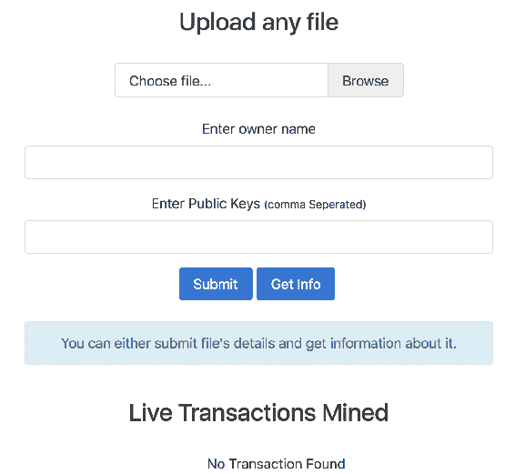
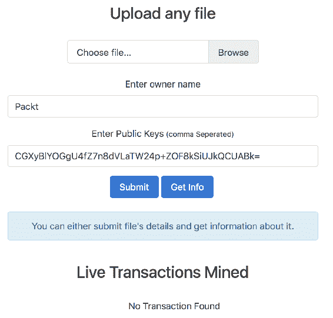
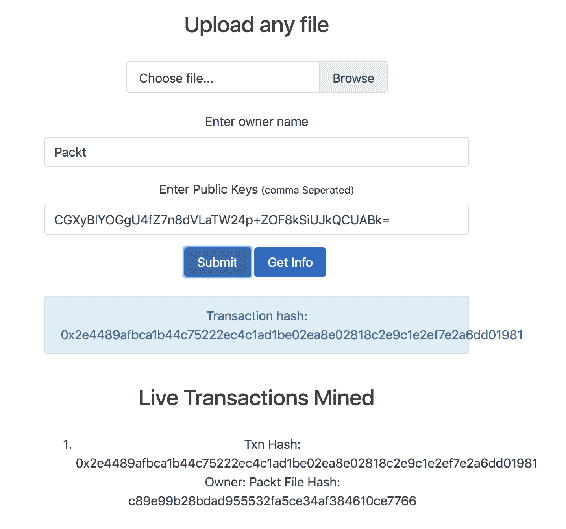
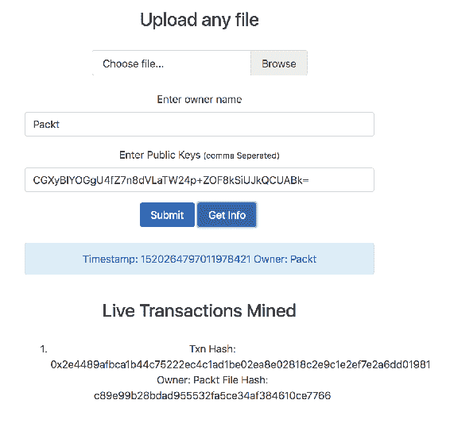

# 第四章：使用 web3.js 入门

在上一章中，我们学习了如何使用 Solidity 编写和部署智能合约。在本章中，我们将学习有关 **web3.js** 的知识，以及如何导入它，连接到 geth，并在 Node.js 或客户端 JavaScript 中使用它。我们还将学习如何使用 web3.js 构建一个网络客户端，用于上一章中创建的智能合约。

在本章中，我们将涵盖以下主题：

+   在 Node.js 和客户端 JavaScript 中导入 web3.js

+   连接到 geth

+   探索 web3.js

+   发现 web3.js 最常用的 API

+   为所有权合约构建 Node.js 应用程序

本章与作者之前的书籍 *Blockchain for Projects* 中的章节相同。这不是第二版书籍，而是用于向读者解释基本概念。

# web3.js 简介

web3.js 为我们提供了与 geth 通信的 JavaScript API。它在内部使用 JSON-RPC 与 geth 通信。web3.js 也可以与支持 JSON-RPC 的任何其他类型的以太坊节点通信。它将所有 JSON-RPC API 公开为 JavaScript API。它不仅支持与以太坊相关的所有 API，还支持与 **Whisper** 和 **Swarm** 相关的 API。

随着我们构建各种项目，你将继续学习更多关于 web3.js 的知识。不过，现在让我们先了解一些 web3.js 最常用的 API。稍后，我们将使用 web3.js 为我们在上一章中创建的所有权智能合约构建一个前端。

在撰写本文时，web3.js 的最新版本是 1.0.0-beta.18。我们将使用此版本学习所有内容。

web3.js 托管在 [`github.com/ethereum/web3.js`](https://github.com/ethereum/web3.js)，完整文档托管在 [`github.com/ethereum/wiki/wiki/JavaScript-API`](https://github.com/ethereum/wiki/wiki/JavaScript-API)。

# 导入 web3.js

只需在项目目录中运行 `npm install web3` 即可在 Node.js 中使用 web3.js。在源代码中，可以使用 `require("web3");` 进行导入。

要在客户端 JavaScript 中使用 web3.js，可以将 `web3.js` 文件入队，该文件位于项目源代码的 `dist` 目录中。现在，`web3` 对象将全局可用。

# 连接到节点

web3.js 可以使用 HTTP 或 IPC 与节点通信，并允许我们连接多个节点。我们将使用 HTTP 进行节点通信。`web3` 的一个实例表示与节点的连接。该实例公开了 API。

当应用程序在 mist 中运行时，它会自动创建一个连接到 mist 节点的 `web3` 实例。实例的变量名为 `web3`。

这是连接到节点的基本代码：

```
if (typeof web3 !== 'undefined') { 
  web3 = new Web3(new Web3.providers.HttpProvider("http://localhost:8545")); 
} 
```

首先，我们通过检查 `web3` 是否为 `undefined` 来验证代码是否在 mist 中运行。如果 `web3` 已定义，那么我们使用已有的实例；否则，我们通过连接到自定义节点来创建一个实例。如果你想无论应用是否在 mist 中运行都连接到自定义节点，可以从上述代码中移除 `if` 条件。在这里，我们假设我们的自定义节点在本地的 `8545` 端口上运行。

`Web3.providers` 对象暴露了构造函数（在这个上下文中称为`providers`），用于建立连接并使用各种协议传输消息。`Web3.providers.HttpProvider` 允许我们建立 HTTP 连接，而 `Web3.providers.IpcProvider` 允许我们建立 IPC 连接。

`web3.currentProvider` 属性会自动分配给当前的提供者实例。在创建一个 `web3` 实例后，你可以使用 `web3.setProvider()` 方法来更改它的提供者。它接受一个参数，即新提供者的实例。

请记住，默认情况下，geth 禁用了 HTTP-RPC。因此，在运行 geth 时通过传递 `--rpc` 选项来启用它。HTTP-RPC 默认运行在 `8545` 端口上。

`web3` 暴露了一个 `isConnected()` 方法，用于检查是否连接到节点。根据连接状态，它返回一个 `true` 或 `false` 的值。

# API 结构

`web3` 包含一个专门用于以太坊区块链交互的 `eth` 对象（`web3.eth`）以及一个用于 Whisper 交互的 `shh` 对象（`web3.shh`）。大部分 web3.js API 都在这两个对象内部。

所有 API 默认情况下都是同步的。对于异步请求，你可以为大多数函数的最后一个参数传递一个可选的回调。所有回调都使用错误优先的回调风格。

一些 API 对于异步请求有一个别名。例如，`web3.eth.coinbase()` 是同步的，而 `web3.eth.getCoinbase()` 是异步的。

这里有一个例子：

```
//sync request 
try 
{ 
  console.log(web3.eth.getBlock(48)); 
} 
catch(e) 
{ 
  console.log(e); 
} 

//async request 
web3.eth.getBlock(48, function(error, result){ 
    if(!error) 
        console.log(result) 
    else 
        console.error(error); 
}) 
```

`getBlock` 用于使用其编号或哈希获取块的信息。或者它可以接受字符串，例如 `"earliest"`（创世块）、`"latest"`（区块链的顶块）或 `"pending"`（正在挖矿的块）。如果不传递参数，则默认为 `web3.eth.defaultBlock`，默认分配为 `"latest"`。

所有需要块标识作为输入的 API 默认情况下可以接受数字、哈希或可读字符串之一。如果未传递值，这些 API 默认使用 `web3.eth.defaultBlock`。

# BigNumber.js

JavaScript 在处理大数时表现很差。因此，对于需要处理大数并进行精确计算的应用程序，请使用 **BigNumber.js** 库。

web3.js 也依赖于 BigNumber.js，并自动添加它。web3.js 总是返回 `BigNumber` 对象作为数字值。它可以接受 JavaScript 数字、数字字符串和 `BigNumber` 实例作为输入。

让我们来演示一下，如下所示：

```
web3.eth.getBalance("0x27E829fB34d14f3384646F938165dfcD30cFfB7c")
  .toString(); 
```

在这里，我们使用 `web3.eth.getBalance()` 方法获取地址的余额。此方法返回一个 `BigNumber` 对象。我们需要对 `BigNumber` 对象调用 `toString()` 来将其转换为数字字符串。

BigNumber.js 无法正确处理具有超过 20 个浮点数字的数字。因此，建议您将余额存储在 wei 单位中，并在显示时将其转换为其他单位。web3.js 本身总是以 wei 单位返回和接受余额。例如，`getBalance()` 方法返回以 wei 为单位的地址余额。

# 单位转换

web3.js 提供了将 wei 余额转换为任何其他单位以及反之的 API。

`web3.fromWei()` 方法将 wei 数字转换为另一个单位，而 `web3.toWei()` 方法将任何其他单位的数字转换为 wei。以下是一个示例来演示这一点：

```
web3.fromWei("1000000000000000000", "ether"); 
web3.toWei("0.000000000000000001", "ether"); 
```

在第一行中，我们将 wei 转换为 `ether`；在第二行中，我们将 `ether` 转换为 wei。这两个方法中的第二个参数可以是以下字符串之一：

+   `kwei` 或 `ada`

+   `mwei` 或 `babbage`

+   `gwei` 或 `shannon`

+   `szabo`

+   `finney`

+   `ether`

+   `kether` / `grand` / `einstein`

+   `mether`

+   `gether`

+   `tether`

# 检索 gas 价格、余额和交易详细信息

让我们来看一下检索 gas 价格、地址余额以及已挖掘交易信息的 API：

```
//It's sync. For async use getGasPrice 
console.log(web3.eth.gasPrice.toString()); 

console.log(web3.eth.getBalance("0x407d73d8a49eeb85d32cf465507dd71d5071
  00c1", 45).toString()); 

console.log(web3.eth.getTransactionReceipt("0x9fc76417374aa880d4449a1f7
  f31ec597f00b1f6f3dd2d66f4c9c6c445836d8b")); 
```

输出将以此格式显示：

```
20000000000 
30000000000 
{ 
 "transactionHash": "0x9fc76417374aa880d4449a1f7f31ec597f00b1f6f3dd2d66f4c9c6c445836d8b ", 
 "transactionIndex": 0, 
 "blockHash": "0xef95f2f1ed3ca60b048b4bf67cde2195961e0bba6f70bcbea9a2c4e133e34b46", 
 "blockNumber": 3, 
 "contractAddress": "0xa94f5374fce5edbc8e2a8697c15331677e6ebf0b", 
 "cumulativeGasUsed": 314159, 
 "gasUsed": 30234 
} 
```

以下是前述方法的工作原理：

+   `web3.eth.gasPrice()`: 通过 *x* 最新区块的中位数 gas 价格确定 gas 价格。

+   `web3.eth.getBalance()`: 返回给定地址的余额。所有的哈希都应该以十六进制字符串（而不是十六进制字面值）的形式提供给 web3.js API。对于 Solidity 地址类型的输入也应该是十六进制字符串。

+   `web3.eth.getTransactionReceipt()`: 用于使用其哈希获取有关交易的详细信息。如果在区块链中找到了交易，则返回一个交易收据对象；否则返回 `null`。交易收据对象包含以下属性：

    +   `blockHash`: 交易所在区块的哈希。

    +   `blockNumber`: 此交易所在的区块编号。

    +   `transactionHash`: 交易的哈希。

    +   `transactionIndex`: 交易在区块中的位置的整数。

    +   `from`: 发送者的地址。

    +   `to`: 接收方的地址；当它是一个合约创建交易时，这个参数被设为 `null`。

    +   `cumulativeGasUsed`: 在该交易在区块中执行时使用的总 gas 量。

    +   `gasUsed`: 仅由此特定交易使用的 gas 量。

    +   `contractAddress`: 如果交易是合约创建，则创建的合约地址。否则，这将被设为 `null`。

    +   `logs`: 此交易生成的日志对象数组。

# 发送 ether

让我们看看如何向任何地址发送`ether`。要发送`ether`，您需要使用`web3.eth.sendTransaction()`方法。此方法可用于发送任何类型的交易，但主要用于发送`ether`。这是因为使用此方法部署合约或调用合约的方法很麻烦，因为您需要手动生成交易数据而不是自动生成。它接受一个具有以下属性的交易对象：

+   `from`：发送账户的地址。如果未指定，则使用`web3.eth.defaultAccount`属性。

+   `to`：这是可选的。这是消息的目的地地址，对于合约创建交易则未定义。

+   `value`：这是可选的。交易的价值以 wei 为单位进行转移，如果是合约创建交易，则还包括捐赠金。

+   `gas`：这是可选的。这是用于交易的燃气量（未使用的燃气将退还）。如果未提供，则会自动确定。

+   `gasPrice`：这是可选的。这是交易的燃气价格，以 wei 为单位，默认为平均网络燃气价格。

+   `data`：这是可选的。它要么是包含消息相关数据的字节字符串，要么在合约创建交易的情况下是初始化代码。

+   `nonce`：这是可选的。这是一个整数。每个交易都与`nonce`相关联。`nonce`是一个计数器，表示发送者所做交易的数量。如果未提供，它将自动确定。它有助于防止重放攻击。此`nonce`不是与块相关联的`nonce`。如果我们使用的`nonce`大于交易应该具有的`nonce`，则该交易将放入队列，直到其他交易到达。例如，如果下一个交易的`nonce`应为四，而我们将`nonce`设置为十，则 geth 将等待其余的六个交易到达后再广播此交易。`nonce`为十的交易称为**排队的交易**，而不是待处理的交易。

下面是一个发送`ether`到地址的示例：

```
var txnHash = web3.eth.sendTransaction({ 
  from: web3.eth.accounts[0], 
  to: web3.eth.accounts[1], 
  value: web3.toWei("1", "ether") 
}); 
```

在这里，我们从账户编号`0`发送了一个`ether`到账户编号`1`。我们需要确保在运行 geth 时使用`unlock`选项来解锁两个账户。geth 交互式控制台会提示输入密码，但是在交互式控制台之外使用的 web3.js API 如果账户被锁定，将会抛出错误。此方法返回交易的事务哈希。然后，您可以使用`getTransactionReceipt()`方法检查交易是否已被挖掘。

你还可以使用`web3.personal.listAccounts()`、`web3.personal.unlockAccount(addr, pwd)`和`web3.personal.newAccount(pwd)` API 在运行时管理账户。

# 与合约工作

让我们学习如何部署新合同，使用其地址获取已部署合同的引用，向合同发送`ether`，发送交易以调用`contract`方法，并估算方法调用的 gas。

要部署新合同或获取对已部署合同的引用，您需要首先使用`web3.eth.contract()`方法创建一个`contract`对象。它以合同 ABI 作为参数，并返回`contract`对象。

这是创建`contract`对象的代码：

```
var proofContract = web3.eth.contract([{"constant":false,"inputs":
  [{"name":"fileHash","type":"string"}],"name":"get","outputs":
  [{"name":"timestamp","type":"uint256"},
  {"name":"owner","type":"string"}],"payable":false,"type":"function"},
  {"constant":false,"inputs":[{"name":"owner","type":"string"},
  {"name":"fileHash","type":"string"}],"name":"set","outputs":
  [],"payable":false,"type":"function"},{"anonymous":false,"inputs":
  [{"indexed":false,"name":"status","type":"bool"},
  {"indexed":false,"name":"timestamp","type":"uint256"},
  {"indexed":false,"name":"owner","type":"string"}, 
  {"indexed":false,"name":"fileHash","type":"string"}],"name"
  :"logFileAddedStatus","type":"event"}]);
```

一旦您获得了合同，您可以使用`contract`对象的`new`方法部署它，或者使用`at`方法获取与 ABI 匹配的已部署合同的引用。

让我们看一个部署新合同的示例，如下所示：

```
 var proof = proofContract.new({
         from: web3.eth.accounts[0],
         data: "0x606060405261068...",
         gas: "4700000"
     },
     function(e, contract) {
         if (e) {
             console.log("Error " + e);
         } else if (contract.address != undefined) {
             console.log("Contract Address: " + contract.address);
         } else {
             console.log("Txn Hash: " + contract.transactionHash)
         }
     })
```

这里，`new`方法是异步调用的，因此如果交易成功创建并广播，则回调将被调用两次。第一次，在交易广播后调用，第二次，在交易挖掘后调用。如果您不提供回调函数，则`proof`变量的`address`属性将设置为`undefined`。一旦`contract`被挖掘，`address`属性将被设置。

在`proof`合同中，没有构造函数，但如果有构造函数，则构造函数的参数应该放在`new`方法的开头。我们传递的对象包含`from`地址，合同的字节码和要使用的最大`gas`。这三个属性必须存在才能创建交易。此对象可以具有传递给`sendTransaction()`方法的对象中存在的属性，但在这里，`data`是合同的字节码，`to`属性被忽略。

您可以使用`at`方法获取已部署合同的引用。以下是演示此操作的代码：

```
var proof = 
  proofContract.at("0xd45e541ca2622386cd820d1d3be74a86531c14a1");
```

现在让我们看一下发送交易以调用合同方法的情况。以下是演示此操作的示例：

```
proof.set.sendTransaction("Owner Name", 
  "e3b0c44298fc1c149afbf4c8996fb92427ae41e4649b934ca495991b7852b855", { 

from: web3.eth.accounts[0], 
}, function(error, transactionHash){ 

if (!err) 

console.log(transactionHash); 
}) 
```

在这里，我们为同名方法调用对象的`sendTransaction`方法。传递给此`sendTransaction`方法的对象具有与`web3.eth.sendTransaction()`相同的属性，只是忽略了`data`和`to`属性。

如果您想调用节点本身的方法，而不是创建交易并广播它，那么您可以使用`sendTransaction`而不是`sendTransaction`。如下所示：

```
var returnValue = proof.get.call
  ("e3b0c44298fc1c149afbf4c8996fb92427ae41e4649b934ca495991b7852b855"); 
```

有时，有必要了解调用方法所需的 gas 量，以便您可以决定是否调用它。您可以使用`web3.eth.estimateGas`来实现此目的。然而，使用`web3.eth.estimateGas()`需要您直接生成交易的数据；因此，我们可以使用合同对象的`estimateGas()`方法。以下是演示此操作的示例：

```
var estimatedGas = proof.get.estimateGas
  ("e3b0c44298fc1c149afbf4c8996fb92427ae41e4649b934ca495991b7852b855"); 
```

要向合同发送一些`ether`而不调用任何方法，您可以简单地使用`web3.eth.sendTransaction`方法。

# 检索和监听合约事件

监听事件非常重要，因为通常通过触发事件返回交易调用的方法结果。

在学习如何检索和监听事件之前，我们需要了解事件的索引参数。 事件的最多三个参数可以具有 `indexed` 属性。 此属性用于指示节点将其索引，以便应用客户端可以搜索具有匹配返回值的事件。 如果不使用 `indexed` 属性，则必须从节点检索所有事件并过滤所需的事件。 例如，您可以这样编写 `logFileAddedStatus` 事件：

```
event logFileAddedStatus(bool indexed status, uint indexed timestamp,
  string owner, string indexed fileHash); 
```

下面是一个示例，演示如何监听合约事件：

```
var event = proof.logFileAddedStatus(null, {
 fromBlock: 0,
 toBlock: "latest"
});
event.get(function(error, result) {
 if (!error) {
 console.log(result);
 } else {
 console.log(error);
 }
})
event.watch(function(error, result) {
 if (!error) {
 console.log(result.args.status);
 } else {
 console.log(error);
 }
})
setTimeout(function() {
 event.stopWatching();
}, 60000)
var events = proof.allEvents({
 fromBlock: 0,
 toBlock: "latest"
});
events.get(function(error, result) {
 if (!error) {
 console.log(result);
 } else {
 console.log(error);
 }
})
events.watch(function(error, result) {
 if (!error) {
 console.log(result.args.status);
 } else {
 console.log(error);
 }
})
setTimeout(function() {
 events.stopWatching();
}, 60000)
```

以下是上述代码的工作原理：

+   首先，我们通过在合约实例上调用事件同名方法来获取 `event` 对象。 此方法接受两个对象作为参数，用于筛选事件：

    +   第一个对象用于通过索引返回值筛选事件，例如，`{'valueA': 1, 'valueB': [myFirstAddress, mySecondAddress]}`。 所有筛选值默认设置为 `null`。 这意味着它们将匹配来自此合约的给定类型的任何事件。

    +   下一个对象可以包含三个属性：`fromBlock`（“最早”的块；默认情况下为`"latest"`）；`toBlock`（“最新”的块；默认情况下为`"latest"`）；和 `address`（仅从中获取日志的地址列表；默认情况下为合约地址）。

+   `event` 对象公开三种方法：`get`、`watch` 和 `stopWatching`。 `get` 用于获取区块范围内的所有事件。 `watch` 类似于 `get`，但它在获取事件后监视更改。 `stopWatching` 可用于停止监视更改。

+   然后，我们有了合约实例的 `allEvents` 方法。 它用于检索合约的所有事件。

每个事件都由一个对象表示，其中包含以下属性：

+   `args`：包含事件参数的对象。

+   `event`：表示事件名称的字符串。

+   `logIndex`：表示块中的日志索引位置的整数。

+   `transactionIndex`：表示创建此索引位置日志的事务的整数。

+   `transactionHash`：表示创建此日志的交易的哈希的字符串。

+   `address`：表示此日志来源地址的字符串。

+   `blockHash`：表示包含此日志的块的哈希的字符串。 当处于待定状态时，此字段为 `null`。

+   `blockNumber`：此日志所在的块号。 当处于待定状态时，此字段为 `null`。

web3.js 提供了一个`web3.eth.filter` API 来检索和监视事件。您可以使用这个 API，但是在前一种方法中处理事件的方式要简单得多。您可以在[`github.com/ethereum/wiki/wiki/JavaScript-API#web3ethfilter`](https://github.com/ethereum/wiki/wiki/JavaScript-API#web3ethfilter)了解更多信息。

# 为所有权合约构建客户端

在上一章中，我们为所有权合约编写了 Solidity 代码。在上一章和本章中，我们学习了 web3.js 以及如何使用 web3.js 调用合约的方法。现在，是时候为我们的智能合约构建一个客户端，以便用户可以轻松地使用它。

我们将构建一个客户端，企业用户选择文件，输入所有者细节，然后点击`提交`来广播一个交易来调用合约的`set`方法，使用文件哈希和所有者细节。一旦成功广播交易，我们将显示交易哈希。用户还可以选择一个文件，并从智能合约获取所有者的细节。客户端还将实时显示最近的`set`交易。

我们将在前端使用 sha1.js 来获取文件哈希，使用 jQuery 进行 DOM 操作，并使用 Bootstrap 4 来创建响应式布局。我们将在后端使用 Express.js 和 web3.js。我们将使用`socket.io`，这样后端就可以将最近挖掘到的交易推送到前端，而无需前端周期性地请求数据。

# 项目结构

在本章的练习文件中，您会找到两个目录：`Final`和`Initial`。`Final`包含项目的最终源代码，而`Initial`包含空白源代码文件和库，以便您快速开始构建应用程序。

要测试`Final`目录，您需要在其中运行`npm install`，并将`app.js`中的硬编码合约地址替换为部署合约后获得的合约地址。然后，使用`Final`目录内的`node app.js`命令运行应用程序。

在`Initial`目录中，您会找到一个`public`目录和两个名为`app.js`和`package.json`的文件。`package.json`包含我们应用的后端依赖，`app.js`是您放置后端源代码的地方。

`public`目录包含与前端相关的文件。在`public/css`目录内，您会找到`bootstrap.min.css`，这是 Bootstrap 库；在`public/html`目录内，您会找到`index.html`，您将在其中放置应用程序的 HTML 代码；而在`public/js`目录内，您会找到用于 jQuery、sha1 和 socket.io 的 JS 文件。在`public/js`目录内，您还会找到一个`main.js`文件，您将在其中放置我们应用的前端 JS 代码。

# 构建后端

首先，在 `Initial` 目录内运行 `npm install` 安装我们后端所需的依赖项。在开始编写后端之前，请确保 geth 正在运行，并启用了 `rpc`。最后，请确保账户 `0` 存在并已解锁。

在开始编码之前，你需要做的最后一件事是使用我们在前一章中看到的代码部署所有权合同，并复制合同地址。

现在让我们创建一个单独的服务器，该服务器将为浏览器提供 HTML，并接受 `socket.io` 连接：

```
var express = require("express"); 
var app = express(); 
var server = require("http").createServer(app); 
var io = require("socket.io")(server); 
server.listen(8080); 
```

在这里，我们将 `express` 和 `socket.io` 服务器整合到一个运行在端口 `8080` 上的服务器中。

现在让我们创建路由来提供静态文件并为应用程序的主页创建路由。以下是执行此操作的代码：

```
app.use(express.static("public")); 
app.get("/", function(req, res){ 
  res.sendFile(__dirname + "/public/html/index.html"); 
}) 
```

这里，我们使用 `express.static` 中间件来提供静态文件服务。我们要求它在 `public` 目录中查找静态文件。

现在让我们连接到 geth 节点，并获取已部署的合同的引用，以便我们可以发送交易并监听事件。以下是执行此操作的代码：

```
var Web3 = require("web3"); 

web3 = new Web3(new Web3.providers.HttpProvider("http://localhost:8545")); 

var proofContract = web3.eth.contract([{"constant":false,"inputs":[{"name":"fileHash","type":"string"}],"name":"get","outputs":[{"name":"timestamp","type":"uint256"},{"name":"owner","type":"string"}],"payable":false,"type":"function"},{"constant":false,"inputs":[{"name":"owner","type":"string"},{"name":"fileHash","type":"string"}],"name":"set","outputs":[],"payable":false,"type":"function"},{"anonymous":false,"inputs":[{"indexed":false,"name":"status","type":"bool"},{"indexed":false,"name":"timestamp","type":"uint256"},{"indexed":false,"name":"owner","type":"string"},{"indexed":false,"name":"fileHash","type":"string"}],"name":"logFileAddedStatus","type":"event"}]); 

var proof = 
  proofContract.at("0xf7f02f65d5cd874d180c3575cb8813a9e7736066"); 
```

代码很直观。只需用你得到的合同地址替换原来的地址即可。

现在让我们创建路由来广播交易并获取有关文件的信息。以下是执行此操作的代码：

```
app.get("/submit", function(req, res){
  var fileHash = req.query.hash;
  var owner = req.query.owner;
  var pkeys = req.query.pkeys;

  pkeys = pkeys.split(",")

  proof.set.sendTransaction(owner, fileHash, {
    from: web3.eth.accounts[0],
    privateFor: pkeys
  }, function(error, transactionHash){
    if (!error)
    {
      res.send(transactionHash);
    }
    else
    {
      res.send("Error");
    }
  })
})

app.get("/getInfo", function(req, res) {
    var fileHash = req.query.hash;
    var details = proof.get.call(fileHash);
    res.send(details);
})
```

这里，`/submit` 路由用于创建和广播交易。一旦我们获得了交易哈希，我们就将其发送给客户端。我们不会做任何等待交易挖矿的操作。`/getInfo` 路由调用节点上合同的 `get` 方法，而不是创建一个交易。它只是简单地将收到的任何响应发送回去。

现在让我们监听来自合同的事件，并将它们广播给所有客户端。以下是执行此操作的代码：

```
proof.logFileAddedStatus().watch(function(error, result) {
    if (!error) {
        if (result.args.status == true) {
            io.send(result);
        }
    }
})
```

在这里，我们检查 `status` 是否为 `true`，只有当它为 `true` 时，我们才将事件广播到所有连接的 `socket.io` 客户端。

# 构建前端

让我们从应用程序的 HTML 开始。将此代码放在 `index.html` 文件中，如下所示：

```
<!DOCTYPE html> 
<html lang="en"> 
    <head> 
        <meta name="viewport" content="width=device-width, initial-
          scale=1, shrink-to-fit=no"> 
        <link rel="stylesheet" href="/css/bootstrap.min.css"> 
    </head> 
    <body> 
        <div class="container"> 
            <div class="row"> 
                <div class="col-md-6 offset-md-3 text-xs-center"> 
                    <br> 
                    <h3>Upload any file</h3> 
                    <br> 
                    <div> 
                        <div class="form-group"> 
                            <label class="custom-file text-xs-left"> 
                                <input type="file" id="file" 
                                  class="custom-file-input"> 
                                <span class="custom-file-control">
                                </span> 
                            </label> 
                        </div> 
                        <div class="form-group"> 
                            <label for="owner">Enter owner name</label> 
                            <input type="text" class="form-control"
                              id="owner"> 
                        </div> 
                        <div class="form-group">
                            <label for="owner">Enter Public Keys
                            <small>(comma Seperated)</small></label>
                            <input type="text" class="form-control"
                             id="pkeys">
                        </div>
                        <button onclick="submit()" class="btn btn-
                         primary">Submit</button> 
                        <button onclick="getInfo()" class="btn btn-
                        primary">Get Info</button> 
                        <br><br> 
                        <div class="alert alert-info" role="alert" 
                         id="message"> 
                            You can either submit the file's details or
                             get information about it. 
                        </div> 
                    </div> 
                </div> 
            </div> 
            <div class="row"> 
                <div class="col-md-6 offset-md-3 text-xs-center"> 
                    <br> 
                    <h3>Live Transactions Mined</h3> 
                    <br> 
                    <ol id="events_list">No Transaction Found</ol> 
                </div> 
            </div> 
        </div> 
        <script type="text/javascript" src="img/sha1.min.js"></script> 
        <script type="text/javascript" src="img/jquery.min.js">
          </script> 
        <script type="text/javascript" src="img/socket.io.min.js">
          </script> 
        <script type="text/javascript" src="img/main.js"></script> 
    </body> 
</html> 
```

以下是代码的工作原理：

+   首先，我们显示 Bootstrap 的文件输入字段，以便用户可以选择文件。

+   然后，我们显示一个文本字段，用户可以输入所有者的详细信息。

+   然后我们有两个按钮。第一个按钮用于在合同中存储文件哈希和所有者的详细信息，第二个按钮用于从合同中获取文件的信息。点击 `Submit` 按钮会触发 `submit()` 方法，点击 `Get Info` 按钮会触发 `getInfo()` 方法。

+   接下来，我们有一个警告框来显示消息。

+   最后，我们显示一个有序列表，以显示用户在页面上时挖矿的合同的交易。

现在，让我们编写 `getInfo()` 和 `submit()` 方法的实现，建立与服务器的 `socket.io` 连接，并监听来自服务器的 `socket.io` 消息。将此代码放在 `main.js` 文件中：

```
function submit()
{
  var file = document.getElementById("file").files[0];

  if(file)
  {
    var owner = document.getElementById("owner").value;

    if(owner == "")
    {
      alert("Please enter owner name");
    }
    else
    {
      var publicKeys = document.getElementById("pkeys").value;

      if(publicKeys == "")
      {
        alert("Please enter the other enterprise's public keys");
      }
      else
      {
        var reader = new FileReader();
        reader.onload = function (event) {
            var hash = sha1(event.target.result);

            $.get("/submit?hash=" + hash + "&owner=" + owner + 
            "&pkeys=" + encodeURIComponent(publicKeys), function(data){
              if(data == "Error")
              {
                $("#message").text("An error occured.");
              }
              else
              {
                $("#message").html("Transaction hash: " + data);
              }
            });
        };
        reader.readAsArrayBuffer(file);
      }
    }
  }
  else
  {
    alert("Please select a file");
  }
}

function getInfo()
{
  var file = document.getElementById("file").files[0];

  if(file)
  {
    var reader = new FileReader();
    reader.onload = function (event) {
        var hash = sha1(event.target.result);

        $.get("/getInfo?hash=" + hash, function(data){
          if(data[0] == 0 && data[1] == "")
          {
            $("#message").html("File not found");
          }
          else
          {
            $("#message").html("Timestamp: " + data[0] + " Owner: " + 
              data[1]);
          }
        });
    };
    reader.readAsArrayBuffer(file);
  }
  else
  {
    alert("Please select a file");
  }
}

var socket = io("http://localhost:8080");

socket.on("connect", function () {
  socket.on("message", function (msg) {
    if($("#events_list").text() == "No Transaction Found")
    {
      $("#events_list").html("<li>Txn Hash: " + msg.transactionHash + 
        "\nOwner: " + msg.args.owner + "\nFile Hash: " +
           msg.args.fileHash + "</li>");
    }
    else
    {
      $("#events_list").prepend("<li>Txn Hash: " + msg.transactionHash 
        + "\nOwner: " + msg.args.owner + "\nFile Hash: " + 
          msg.args.fileHash + "</li>");
    }
    });
});
```

这是前述代码的工作原理：

+   首先，我们定义了`submit()`方法。在`submit()`方法中，我们确保选择了一个文件并且文本字段不为空。然后，我们将文件内容读取为一个数组缓冲区，并将数组缓冲区传递给 sha1.js 中暴露的`sha1()`方法，以便获得数组缓冲区内的内容的哈希值。一旦我们获得了哈希值，我们就使用 jQuery 向`/submit`路由发出 AJAX 请求，然后在警告框中显示事务哈希值。

+   紧接着我们定义了`getInfo()`方法。它首先确保选择了一个文件。然后，它生成像之前生成的那样的哈希，并请求`/getInfo`端点以获取有关该文件的信息。

+   最后，我们使用`socket.io`库提供的`io()`方法建立`socket.io`连接。然后，我们等待连接事件触发，这表示连接已经建立。连接建立后，我们监听来自服务器的消息，并显示交易的详细信息给用户。

我们不把文件存储在以太坊区块链上。存储文件非常昂贵，因为需要很多 gas。在我们的情况下，我们不需要存储文件，因为网络中的节点将能够看到文件；因此，如果用户想保持文件内容的机密性，那么他们将不能。我们应用的目的仅仅是证明文件的所有权，而不是像云服务一样存储和提供文件。

# 测试客户端

现在运行`app.js`节点来运行应用程序服务器。打开你喜欢的浏览器，并访问`http://localhost:8080/`。你将在浏览器中看到这个输出：



现在选择一个文件，输入所有者的姓名，然后点击提交。浏览器窗口将会变成这样：



在下图中，你可以看到交易哈希值已显示。现在等待直到交易被挖掘。一旦交易被挖掘，你将能够在实时交易列表中看到交易。浏览器窗口应该如下所示：



现在再次选择相同的文件，然后点击获取信息按钮。你将会看到以下输出：



在上个截图中，你可以看到时间戳和所有者的详细信息。现在我们已经完成了为我们的第一个 DApp 构建客户端。

# 摘要

在本章中，我们首先学习了 web3.js 的基础知识，并查看了一些示例。我们了解了连接到节点、基本 API、发送各种类型的交易以及监听事件。最后，我们为我们的所有权合约构建了适当的生产用客户端。现在，您应该能够轻松编写智能合约并为其构建 UI 客户端，以便简化它们的使用。

在下一章中，我们将学习使用零知识安全层实现隐私。
