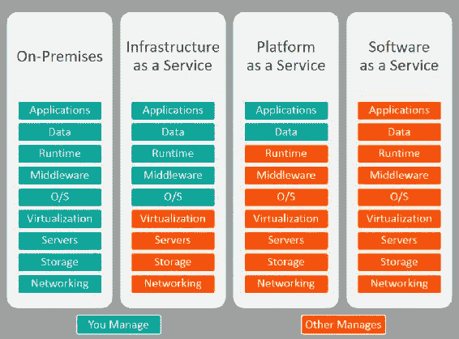
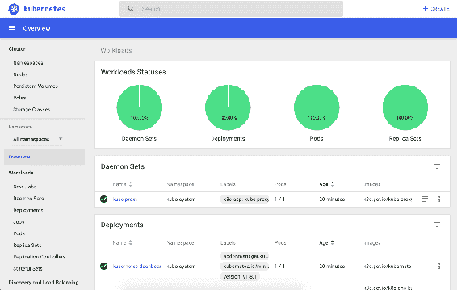
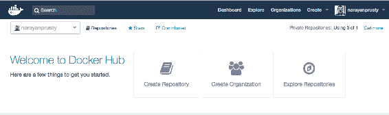
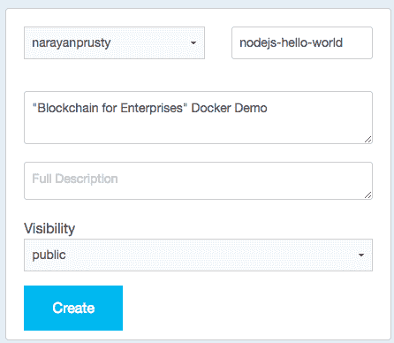
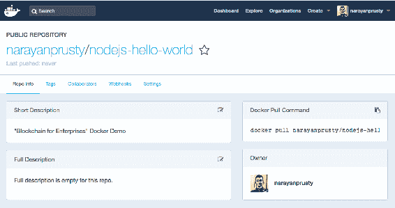
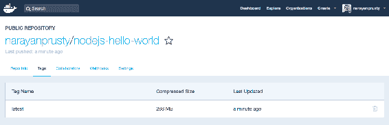
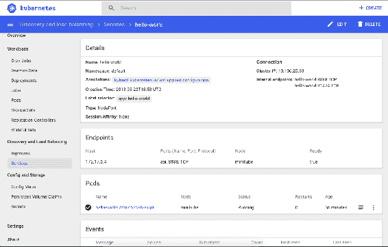

# 构建 Quorum 作为服务平台

随着使用**Kubernetes（K8s）**部署容器化应用程序的增长，现在是学习如何将 Quorum 容器化以部署到 K8s 的正确时机。 在本章中，我们将构建一个**平台即服务**（**PaaS**）以便轻松创建 Quorum 网络。 我们将从云计算、Docker 和 K8s 的基础知识开始，并最终建立一个**Quorum 即服务**（**QaaS**）平台。 在本章中，我们将构建一个极简的**区块链即服务**（**BaaS**），与 Azure、AWS 和 BlockCluster 等各种云平台提供的服务相比。

在本章中，我们将涵盖以下主题：

什么是云计算？

+   公共、私有和混合云之间的区别

+   IaaS、PaaS 和 SaaS 之间的区别

+   什么是 Docker 和应用程序的容器化？

+   微服务架构简介

+   了解 K8s 的基本原理及其优势

+   在本地计算机上安装 minikube

+   在 K8s 中部署一个简单的 Hello World Node.js 应用程序

+   将 Quorum 容器化为 K8s

+   使用 Docker 和 K8s 构建 QaaS 平台

# 云计算简介

简单来说，云计算是通过互联网提供计算服务（服务器、存储、数据库、网络、软件等）的按需交付。

云计算提供了更容易访问服务器、存储、数据库和广泛的应用服务的途径，这些服务都可以通过互联网获得。 云服务平台，如**亚马逊网络服务**和**微软 Azure**，拥有并维护这些应用服务所需的网络连接硬件，而您则通过 Web 应用程序进行配置和使用所需的资源。

以下是云计算的优势：

+   **成本**：云计算节省了很多成本，因为您不必购买硬件和软件。 它还节省了您在现场数据中心的设置和运行成本。 即使您设置了自己的数据中心，您也需要能够管理它们的 IT 专家，以及全天候的电力和冷却，这会增加额外的成本。 相比之下，云计算非常便宜。 在云计算中，您只有在使用资源时才需要付费，并且您只需要支付您使用的数量。

+   **速度**：云计算可以节省时间，因为您可以在需要时立即运行服务； 它提供按需提供计算服务。

+   **全球扩展**：您可以轻松地在多个地区部署您的应用程序。 这让您的应用程序靠近用户。

还有其他各种好处，取决于您使用的云计算提供商。

# 私有与公共与混合云

云解决方案可以是私有的、公共的或混合的，根据数据中心的所有权和位置。 云解决方案通常是公共的，也就是说，任何有互联网访问权限的人都可以使用云提供的计算服务。 我们之前看到的所有好处都是公共云提供的好处。

尽管公共云在配置计算服务时允许您选择您的区域，但可用区域的总数仍然非常有限。这是银行、军队和政府等实体的一个关注点，因为它们要么不希望数据离开他们的国家，要么不希望云提供商能够看到数据。因此，这些实体要么选择私有云，要么选择混合云。

当云托管在企业自己的数据中心时，称为私有云。在这种情况下，企业无法享受成本和多区域扩展的好处，因为它们负责配置和维护数据中心。

混合云术语用于企业根据技术和业务需求使用私有云和公共云的混合组合。企业可能选择将应用程序托管在公共云上，同时由于合规性或安全问题，将与应用程序相关的一些数据保留在私有云中。

# IaaS 与 PaaS 和 SaaS 之间的区别

**基础设施即服务**（**IaaS**）、**平台即服务**（**PaaS**）和**软件即服务**（**SaaS**）是基于您管理的内容以及云提供商为您管理的内容而划分的三种不同类别的云解决方案。

在 IaaS 中，云提供商为客户提供按需访问基本计算服务，即存储、网络和服务器。其他所有事项都由您来配置和管理。Amazon AWS、Google Cloud、Azure、Linode 和 Rackspace 是 IaaS 的示例。

在 PaaS 中，云提供商管理操作系统、编程语言的运行时、数据库和 Web 服务器——也就是为开发、测试和管理应用程序提供环境。简单来说，你只需要担心编写代码和业务方面的可扩展性。应用程序开发和部署的其余基础设施由云提供商处理。Heroku、Redhat 的 OpenShift、Apache Stratos 和 Google App Engine 是 PaaS 的示例。

**数据库即服务**（**DBaaS**或**BaaS**）属于 PaaS 类别。因此，在本章中，我们将创建一个简单的 PaaS：QaaS。任何管理应用程序依赖的服务（如数据库、区块链或消息队列）的云解决方案都是 PaaS。

在 SaaS 中，云提供商管理一切，包括数据和应用程序。您不需要编写任何代码来构建应用程序。云提供商提供一个界面，根据您的需求定制应用程序并部署它。使用 SaaS 往往会通过消除技术人员定期管理、编写代码和升级软件的需求来降低软件拥有成本。您只需担心业务逻辑。Salesforce、Google Apps 和 WordPress.com 是 SaaS 的示例。



上述图像可用于轻松确定云解决方案是 IaaS、PaaS 还是 SaaS。

一些云解决方案提供了 IaaS 和 PaaS 的功能。例如，AWS 最初是一个 IaaS，现在它还提供了各种按需服务（如区块链和弹性搜索）。

# 什么是容器？

如果你正在使用 PaaS 或 SaaS 来创建你的应用程序，那么你不会遇到容器，因为它们会负责容器化你的应用程序。PaaS 只是让你将应用程序的源代码推送到云端，并为你构建和运行应用程序。

如果你正在使用 IaaS 来构建你的应用程序，那么如果不将你的应用程序容器化，要扩展和管理你的应用程序将变得几乎不可能。让我们来看一个场景，并试着理解为什么我们需要容器。

在 IaaS 中，要部署你的应用程序，你需要执行以下步骤：

配置虚拟机（**Virtual Machines**，**VMs**）

1.  安装应用程序的所有依赖项和运行时环境

1.  运行应用程序

1.  如果应用程序开始接收的流量超过 VM 能够处理的范围，你将会开始创建新的 VM，并使用负载均衡器分发流量

1.  对于每个新的 VM，你需要在运行新的应用程序实例之前按照相同的流程安装依赖项和运行时环境

这种滚动创建新的 VM 并在其中运行应用程序实例的过程容易出错且耗时。这就是容器发挥作用的地方。

简而言之，容器是一种打包应用程序的方式。容器的特殊之处在于当你将它们移动到新的机器或环境中时不会出现意外错误。你的应用程序的所有代码、库和依赖项都被打包在容器中作为一个不可变的工件。你可以将运行容器看作运行 VM，但不会带来启动整个操作系统的开销。因此，将应用程序打包在容器而不是 VM 中，将显著提高启动时间。容器比 VM 轻量级得多，使用的资源也少得多。

因此，对于上述示例，你需要为你的应用程序创建一个容器，并在每个 VM 中运行容器。显然，根据你的应用程序架构，一个 Docker 容器可以运行多个进程，一个 VM 可以运行多个容器。

在内部，PaaS 和 SaaS 使用容器来打包和部署你的应用程序。容器还有许多其他用途。例如：一个编码测试应用实际上在执行之前会将你的代码容器化，以便在隔离的环境中执行代码。

通过容器化应用程序及其依赖项，OS 分发和底层基础设施的差异被抽象化了。容器可以在裸机系统、云实例和 Linux、Windows 和 macOS 上的 VM 上运行。

# Docker 简介

Docker 帮助您在容器内创建和部署软件。它是一套开源工具集，可帮助您构建、发布和运行任何应用程序。使用 Docker，您可以在应用程序源代码目录中创建一个特殊的文件，称为 Dockerfile。 Dockerfile 定义了一个构建过程，当输入到`docker build` 命令时，将生成一个不可变的 Docker 镜像。您可以将 Docker 镜像视为 VM 镜像。当您想要启动它时，只需使用 `docker run` 命令在 Docker 守护程序受支持并运行的任何地方运行它。Docker 容器是 Docker 镜像的运行实例。

在 Dockerfile 中，您需要提及一个应该运行的命令，然后容器启动。这就是容器内部执行实际应用程序的方式。如果命令存在，则容器也会关闭。当容器关闭时，所有写入容器卷中的数据都会丢失。

Docker 还提供了一个名为 **Docker Hub** 的基于云的仓库。您可以将其视为 Docker 镜像的 GitHub。您可以使用 Docker Hub 创建、存储和分发您构建的容器镜像。

# 构建一个 Hello World Docker 容器

让我们创建一个 Docker 镜像，该镜像打包了一个简单的 Node.js 应用程序，该应用程序公开了一个端点以打印 Hello World。在继续之前，请确保您已在本地计算机上安装了 Docker CE（社区版）。您可以在[`docs.docker.com/install/`](https://docs.docker.com/install/)找到根据不同操作系统安装和启动 Docker 的说明。

现在创建一个名为`hello-world` 的目录，并在其中创建一个名为 `app.js` 的文件。在该文件中放置以下内容：

```
const http = require('http');

const name = 'node-hello-world';
const port = '8888';

const app = new http.Server();

app.on('request', (req, res) => {
  res.writeHead(200, { 'Content-Type': 'text/plain' });
  res.write('Hello World');
  res.end('\n');
});

app.listen(port, () => {
  console.log(`${name} is listening on port ${port}`);
});
```

现在在相同的目录中创建一个名为 `Dockerfile` 的文件，并将以下内容放入其中：

```
FROM node:carbon

WORKDIR /usr/src/app

COPY . ./

EXPOSE 8888

CMD [ "node", "app.js" ]
```

我们将构建 Docker 镜像的指令放在 Docker 文件中。您可以在[`docs.docker.com/engine/reference/builder/`](https://docs.docker.com/engine/reference/builder/)找到指令列表。

以下是之前的 Dockerfile 如何工作的：

+   首先，您需要定义从哪个镜像构建。在这里，我们将使用 Docker Hub 提供的最新的 **长期支持（LTS）** 版本的 Node 的碳镜像。该镜像已经安装了`Node.js` 和 `npm`。

+   接下来，我们创建一个目录来存放图像内部的应用程序代码； 这将是您应用程序的工作目录。

+   要将您的应用程序源代码捆绑到 Docker 镜像中，我们使用`COPY` 指令。这里表示我们正在从当前主机操作系统的工作目录复制到 Docker 的工作目录。

+   您的应用程序绑定到端口`8888`，因此您将使用 `EXPOSE` 指令让 Docker 守护程序进行映射。

+   最后但同样重要的是，使用 `CMD` 定义运行应用程序的命令，该命令定义了您的运行时。

这是如何构建 Docker 镜像的：

1.  使用`docker build -t nodejs-hello-world .` 命令构建 Docker 镜像。

1.  要运行容器，请运行`docker run -p 8090:8888 -d nodejs-hello-world` 命令。

1.  `-p`选项将容器的端口`8888`绑定到主机机器的`127.0.0.1`的 TCP 端口`8090`。您也可以指定 udp 和 sctp 端口。在您的 web 浏览器中访问`http://localhost:8090/`，您将看到 Hello World 消息。

在 Dockerfile 中，使用`ENTRYPOINT`定义命令，使用`CMD`定义命令的参数。默认入口点是`["/bin/sh", "-c']`，实际运行的是`sh` shell。因此，在上述 Dockerfile 中，主命令是启动`sh` shell，并将要运行的应用程序命令作为子命令传递。`-c`选项接受要在`sh` shell 内运行的命令。

# 理解微服务架构

微服务架构是用于构建企业级应用程序的应用程序架构。要理解微服务架构，首先需要了解其相反的单体架构。在单体架构中，服务器端应用的不同功能组件（例如支付处理，账户管理，推送通知等组件）都融合在单个单元中。

例如，应用程序通常分为三个部分。部分是在用户计算机上运行的 HTML 页面或本地 UI，一种在服务器上运行的服务器端应用，以及在服务器上也运行的数据库。服务器端应用负责处理 HTTP 请求，在数据库中检索和存储数据，并执行算法。如果服务器端应用是一个单独的可执行文件（即，运行在单个进程中）来完成所有这些任务，那么我们说服务器端应用是单体的。这是构建服务器端应用的常见方式。几乎每个主要的 CMS、Web 服务器和服务器端框架都是使用单体架构构建的。这种架构可能看起来很成功，但当您的应用程序庞大复杂时，可能会出现问题。

在微服务架构中，服务器端应用被分为服务。一个服务（或微服务）是完整服务器端应用的特定功能的小型独立进程的组成部分。例如，您可以有一个用于支付处理的服务，另一个用于账户管理的服务，依此类推；服务需要通过网络相互通信。

服务可以通过 REST API 或消息队列相互通信，具体取决于您是否需要通信是同步还是异步的。

以下是使用微服务架构的一些好处：

+   因为服务通过网络通信，它们可以使用不同的编程语言和不同的框架编写

+   对服务进行更改只需要重新部署特定的服务，而不是所有服务，这是一种更快的流程。

+   由于每个服务在不同的进程中运行，因此更容易衡量每个服务消耗了多少资源。

+   它变得更容易测试和调试，因为可以分析每个服务。

+   服务可以通过网络调用与其他应用程序重复使用。

+   小团队可以并行工作，比大团队可以更快地迭代。

+   较小的组件占用的资源较少，可以按需缩放以满足该组件的需求增加

不必在不同的虚拟机中运行每个微服务，也就是说，可以在单个虚拟机中运行多个服务。服务器与服务的比例取决于不同的因素。一个常见的因素是所需的资源和技术的数量和类型。例如，如果一个服务需要大量的 RAM 和 CPU 时间，最好是在服务器上单独运行它。如果有一些不需要太多资源的服务，可以一起在单个服务器上运行它们。

# 深入 K8s

一旦创建了几个 Docker 容器，您会意识到缺少了一些东西。如果要在多台机器上运行多个容器 - 如果您使用微服务，这是必须要做的 - 那么仍然有很多工作要做。

您需要在正确的时间启动正确的容器，找出它们如何相互通信，处理存储方面的考虑，并处理失败的容器或硬件。如果手动执行所有这些工作将是一场噩梦。幸运的是，这就是 K8s 发挥作用的地方。

K8s 是一个开源的容器编排平台，可以使大量的容器在一起协同工作，从而减轻运维负担。它有助于诸如：

+   在许多不同的机器上运行容器。

+   根据需求的变化增加或删除容器以进行扩展或缩减。

+   保持多个应用程序实例的存储一致。

+   在容器之间分配负载。

+   如果有什么失败，可以在不同的机器上启动新容器，也就是自动修复。

+   与 K8s 兼容的应用程序可以在不更改应用程序源代码的情况下轻松地由一个 IaaS 移动到另一个 IaaS。应用程序部署在 K8s 集群上，K8s 集群部署在 IaaS 上。

从开发者的角度来看，在 K8s 集群中有两种类型的机器：主节点和节点（也称为**工作节点**）。我们的应用程序在节点上运行，而主节点控制节点并公开 K8s API。可以在裸机上或在虚拟机上安装 K8s。还有可用的 Kubernetes 作为服务云解决方案，可以按需为您创建集群。例如：Google Cloud 的 Kubernetes Engine，**Azure Kubernetes Service**（**AKS**）和**亚马逊弹性容器服务 for Kubernetes**（**Amazon EKS**）。

# 进入资源对象

您可以使用 K8s API 通过 K8s API 端点读取、写入和更新 K8s 资源对象。K8s 资源对象是用于表示集群状态的实体。我们需要使用清单来定义资源对象。在 API 调用中，我们传递清单文件的内容。

这是 K8s API 提供的资源的基本类别的高级概述。它们的主要功能如下：

+   **工作负载**：这些资源用于在集群上管理和运行您的容器。例如：部署、Pod、作业和副本集。

+   **发现和负载平衡**：这些资源用于将您的工作负载组合成一个外部可访问的、负载平衡的服务。例如：服务和入口。

+   **配置和存储**：这些资源用于向您的应用程序注入初始化数据，并持久保存容器外的数据。例如：配置映射、秘密和卷。

+   **集群**：这些对象定义了集群本身的配置方式；这些通常只被集群操作员使用。

+   **元数据**：这些资源用于配置集群中其他资源的行为。例如：网络策略和命名空间。

Dockerfile 允许您指定关于如何运行容器的大量信息，比如要公开的端口、环境变量以及容器启动时要运行的命令。但是 K8s 建议您将这些信息移到 K8s 清单文件中，而不是 Dockerfile 中。现在，Dockerfile 只指定了如何构建和打包应用程序。此外，K8s 清单会覆盖 Dockerfile 中的指令。

# 部署和 Pod

K8s 鼓励您将部署视为微服务的表示。例如：如果您有五个微服务，您需要创建五个部署，而一个 Pod 是一个微服务的实例。假设您想运行三个微服务实例并在它们之间分配流量，那么在部署中您将定义您需要三个副本，这将创建三个 Pod。一个 Pod 运行一个或多个代表微服务的容器。

在创建部署时，您可以指定微服务需要的计算资源量，比如内存和 CPU，而不是让它消耗所有可用资源。您还可以指定一个节点名称来运行 Pod，而不是由 K8s 决定。

在创建部署时，您可以指定要公开的 Docker 容器的哪些端口、环境变量和其他各种在 Dockerfile 中也指定的内容。

# 服务

默认情况下，部署之间无法相互通信。服务被创建用于启用微服务之间的通信，并可选地允许从集群外部访问微服务。我们需要为每个部署创建一个服务。服务具有内置的负载均衡功能：如果一个微服务有三个 pod，那么 K8s 服务会自动在它们之间分配流量。以下是各种类型的服务：

+   `ClusterIP`：这是默认的服务类型。在集群中的内部 IP 上暴露服务。此类型使得服务仅可从集群内部访问。

+   `NodePort`：使服务可以从集群外访问。它是`ClusterIP`的超集。当我们创建一个类型为`NodePort`的服务时，K8s 会在`30000-32767`范围内打开一个或多个端口（取决于 Docker 容器暴露的端口数量），并将它们映射到所有工作节点的容器端口。因此，如果一个微服务的实例没有在运行，比如说在第三台机器上，仍然可以在第三台机器上暴露端口。K8s 处理内部路由。因此，您可以使用任何工作节点的公共 IP 与分配的端口来访问微服务。如果您不希望 K8s 在外部暴露时在`30000-32767`之间选择随机端口，则可以指定同一范围内的一个端口。

+   `LoadBalancer`：也用于在集群外部暴露服务。它将在服务前面启动一个负载均衡器。这仅在支持的云平台上有效，例如 AWS、GCP 和 Azure。

# Ingress 控制器和资源

Ingress 是一个用于在集群外部负载均衡和暴露微服务的 K8s 功能。与 NodePort 和 LoadBalances 相比，它是功能丰富且推荐的负载均衡和暴露微服务的方式。Ingress 为您提供了一种根据请求主机或路径路由请求到服务的方式，从而将许多服务集中到单个入口点中，这样更容易管理大型应用程序。Ingress 还支持 SSL 卸载、URL 重写和许多其他功能，因此您不必在创建每个微服务时集成所有这些功能。

Ingress 分为两个主要部分：Ingress 控制器和资源。Ingress 控制器是暴露在集群外部的实际反向代理，Ingress 资源是控制器的配置。Ingress 控制器本身是一个微服务，也就是说，它是一个部署，并为其创建了一个类型为`NodePort`或`LoadBalancer`的服务。Ingress 控制器具有读取 Ingress 资源并重新配置自身的能力。

有各种不同的 Ingress 控制器实现可用，你应该选择最适合你目的的那个。它们根据特性和使用的负载均衡器和反向代理软件而变化。K8s 官方开发了 NGINX Ingress 控制器，它是 K8s 最常见的 Ingress 控制器。该 Ingress 控制器实现使用了 NGINX 反向代理和负载均衡器。

在部署 Ingress 控制器时，你可以有一个以上的副本以获得高可用性和 Ingress 的负载均衡。你也可以部署多个 Ingress，它们使用类别进行区分。

# 配置映射和密码

几乎每个应用程序在运行之前都需要传递某种类型的配置。例如，当启动一个 Node.js 应用程序时，你可能需要传递 MongoDB 的 URL，因为你不能硬编码它，因为它在开发和生产环境中不同。这些配置通常作为环境变量或配置文件提供。

K8s 允许你在部署清单中指定环境变量。但是，如果你想要更改它们，你必须修改部署。更糟糕的是，如果你想要在多个部署中使用变量，你必须复制数据。K8s 提供了配置映射（用于非机密数据）和密码（用于机密数据）来解决这个问题。

密码和配置映射的主要区别在于密码使用 Base64 编码进行混淆。现在，你可以将配置映射和密码作为部署清单的环境变量传递。当配置映射或密码发生更改时，环境变量也会相应更改，无需任何重启或手动操作。

如果你的应用程序使用配置文件而不是环境变量，它们也可以使用配置映射和密码进行传递。

# 绑定挂载和卷

在 K8s 和 Docker 中，绑定挂载是将主机上的文件或目录挂载到容器中的过程。文件或目录通过主机上的完整或相对路径引用。

在计算机数据存储中，卷是具有单个文件系统的持久存储区域，通常（尽管不一定）驻留在硬盘的单个分区上。IaaS 提供商允许我们创建卷并附加到 VM。K8s 提供了名为**持久卷**和持久卷声明的功能，可以自动创建特定云提供商的卷并附加到 pod。当你的应用程序需要保存（持久化）数据时，卷是必需的。这些卷通过绑定挂载在 Docker 容器内部访问。

在 K8s 中，有一个名为**StatefulSets**的资源对象，它类似于部署。如果你的部署需要持久性存储，并且你有多个副本，那么你必须创建 StatefulSets 而不是部署，因为部署不能为每个 pod 分配单独的持久性卷。

# 标签和选择器

标签是附加到资源对象（例如 pod、service 和 deployment）的键/值对。标签用于指定对象的识别属性，这些属性对用户来说是有意义且相关的。标签可用于组织和选择对象的子集。在创建时间或随后的任何时间，可以向对象添加和修改标签。每个对象可以定义一组键/值标签。例如，在创建服务时，我们使用标签和选择器指定应该暴露的 pod 列表。

# 开始使用 minikube

当您构建真实的应用程序时，正确使用 K8s 的方式是在本地或云端创建一个开发集群，具体取决于您是将应用程序托管在本地还是云上。但是，为了对 K8s 进行实验和玩耍，您可以使用 minikube。

Minikube 是一个工具，可以方便地在本地运行 K8s。Minikube 在您的笔记本电脑上的虚拟机内运行单个工作节点 K8s 集群，供用户尝试 K8s 或进行日常开发使用。在撰写本书时，minikube 的最新版本是 `0.26.1`。Minikube 可以安装在 Windows、macOS 和 Ubuntu 上。

# 在 macOS 上安装 minikube

首先，安装 minikube 支持的虚拟机监视程序。在 macOS 上，建议使用 hyperkit。使用以下命令安装 `hyperkit` 驱动程序：

```
curl -LO https://storage.googleapis.com/minikube/releases/latest/docker-machine-driver-hyperkit \
&& chmod +x docker-machine-driver-hyperkit \
&& sudo mv docker-machine-driver-hyperkit /usr/local/bin/ \
&& sudo chown root:wheel /usr/local/bin/docker-machine-driver-hyperkit \
&& sudo chmod u+s /usr/local/bin/docker-machine-driver-hyperkit
```

然后安装 `kubectl`。`kubectl` 是一个命令行工具，用于部署和管理 K8s 上的应用程序。以下是安装它的命令：

```
brew install kubectl
```

现在，使用以下命令安装 minikube：

```
curl -Lo minikube https://storage.googleapis.com/minikube/releases/v0.26.1/minikube-darwin-amd64 && chmod +x minikube && sudo mv minikube /usr/local/bin/
```

# 在 Ubuntu 上安装 minikube

在 Ubuntu 上，建议使用 hyperkit。使用以下命令安装 hyperkit：

```
curl -LO https://storage.googleapis.com/minikube/releases/latest/docker-machine-driver-hyperkit \
&& chmod +x docker-machine-driver-hyperkit \
&& sudo mv docker-machine-driver-hyperkit /usr/local/bin/ \
&& sudo chown root:wheel /usr/local/bin/docker-machine-driver-hyperkit \
&& sudo chmod u+s /usr/local/bin/docker-machine-driver-hyperkit
```

然后安装 `kubectl`。以下是安装它的命令：

```
sudo snap install kubectl --classic
```

现在，使用以下命令安装 `minikube`：

```
curl -Lo minikube https://storage.googleapis.com/minikube/releases/v0.26.1/minikube-linux-amd64 && chmod +x minikube && sudo mv minikube /usr/local/bin/
```

# 在 Windows 上安装 minikube

在 Windows 上，建议使用 VirtualBox 虚拟机监视程序。从 [`www.virtualbox.org/wiki/Downloads`](https://www.virtualbox.org/wiki/Downloads) 下载并安装 VirtualBox。

然后从 [`storage.googleapis.com/kubernetes-release/release/v1.10.0/bin/windows/amd64/kubectl.exe`](https://storage.googleapis.com/kubernetes-release/release/v1.10.0/bin/windows/amd64/kubectl.exe) 下载 `kubectl` 命令。

最后，通过下载并运行 minikube 安装程序来安装 minikube，网址为 [`github.com/kubernetes/minikube/releases/download/v0.26.1/minikube-installer.exe`](https://github.com/kubernetes/minikube/releases/download/v0.26.1/minikube-installer.exe)。

# 启动 minikube

在 Linux 和 macOS 上，使用以下命令启动 minikube：

```
minikube start --vm-driver=hyperkit
```

在 Windows 上，使用以下命令启动 minikube：

```
minikube start --vm-driver=virtualbox
```

如果您使用不同的虚拟机监视程序，请更改 `--vm-driver` 选项的值。启动 minikube 需要几分钟。

# 停止和删除 minikube

如果您想要随时停止 minikube 集群，可以使用以下命令：

```
minikube stop
```

你可以使用上述 minikube start 命令重新启动相同的集群。如果想删除整个集群，则可以使用以下命令：

```
minukube delete
```

# Minikube 状态

要检查 minikube 的状态，即集群是否正在运行，可以使用以下命令：

```
minikube status
```

如果成功运行，你将看到类似于这样的响应：

```
minikube: Running
cluster: Running
kubectl: Correctly Configured: pointing to minikube-vm at 192.168.64.7
```

注意这里你会看到一个不同的 IP 地址。这是 minikube 虚拟机的 IP 地址；也就是说，主节点和工作节点在这个虚拟机内运行。你将从这个 IP 访问你的应用。

# 访问 K8s 仪表板

K8s 仪表板是一个通用的、基于 Web 的 K8s 集群 UI。它允许用户管理运行在集群中的应用程序，并对其进行故障排除，还有集群本身。要访问仪表板，请运行此命令：

```
minikube dashboard
```

它将在新的浏览器窗口中打开仪表板。K8s 仪表板将类似于以下内容：



# 在 k8s 上部署 Hello World 应用

让我们将之前构建的 `Hello World` Docker 镜像部署到我们刚创建的 K8s 集群上。要创建一个部署和服务，你需要创建一个包含有关部署和服务的所有详细信息的清单文件，然后使用 `kubctl` 命令将其传递给 K8s。在清单文件中，你需要提供 Docker 镜像的远程 URL，以便 K8s 拉取并运行这些镜像。K8s 可以从公共 Docker 注册表（即 Docker Hub）或私有 Docker 注册表中拉取镜像。

# 将镜像推送到 Docker Hub

在我们推送镜像之前，让我们了解一些与 Docker 相关的基本术语：

+   **注册表**：存储你的 Docker 镜像的服务。

+   **仓库**：不同 Docker 镜像的集合，它们具有相同的名称但具有不同的标签（版本）。

+   **标签**：你可以使用它来区分 Docker 镜像的不同版本，以便保留旧副本。当我们之前创建 Docker 镜像时，我们没有提供标签，因此默认标签是 `latest`。可以使用 `docker tag [:HOST|:USERID]IMAGE_NAME[:TAG_NAME] [:HOST|:USERID]IMAGE_NAME[:TAG_NAME]` 命令从另一个镜像创建一个带标签的新镜像。主机前缀是可选的，用于指示 Docker 注册表的主机名，如果镜像属于私有 Docker 注册表。如果镜像用于 Docker Hub，则提及你的 Docker Hub 帐户的用户名。

要将镜像推送到 Docker Hub，你首先需要创建一个 Docker Hub 帐户。访问 [hub.docker.com](http://hub.docker.com) 并创建一个帐户。登录后，你将看到类似以下的屏幕：



现在点击“创建仓库”并填写以下表格：



可见性指示存储库是私有还是公共的。私有存储库不对所有人可见。如果您有权限访问它，则需要登录到 Docker Hub 才能拉取它。您只能在 Docker Hub 上创建一个免费私有存储库。创建存储库后，您将看到一个类似于此的屏幕：



要推送您在本地计算机上的映像，您需要首先从命令行登录到 Docker Hub。要执行此操作，请运行以下命令：

```
docker login
```

然后在提示时键入您的 Docker Hub 帐户的用户名和密码。您应该看到登录成功的消息。现在使用以下命令为您的映像打标签：

```
docker tag nodejs-hello-world:latest narayanprusty/nodejs-hello-world
```

现在运行以下命令来推送映像：

```
docker push narayanprusty/nodejs-hello-world
```

根据您的互联网带宽不同，推送可能需要几分钟时间。推送完成后，点击存储库上的 Tags 选项卡，您将看到一个类似于此的屏幕：



# 创建部署和服务

现在，让我们创建包含有关部署和服务信息的主要清单文件。我们可以为我们的部署和服务创建两个不同的或单个部署文件。主要清单文件可以用 YAML 或 JSON 格式编写。首选 YAML，因此我们也将以 YAML 格式编写。

创建一个名为 `helloWorld.yaml` 的文件，并将以下内容放入其中：

```
apiVersion: apps/v1beta1
kind: Deployment
metadata:
  name: hello-world
spec:
  replicas: 1
  template:
    metadata:
      labels:
        app: hello-world
    spec:
      containers:
      - name: nodejs-hello-world
        image: narayanprusty/nodejs-hello-world
        command: [ 'node', 'app.js']
        workingDir: /usr/src/app
        imagePullPolicy: Always
        ports:
        - containerPort: 8888
---
kind: Service
apiVersion: v1
metadata:
  name: hello-world
spec:
  ports:
    - name: api
      port: 8888
  selector:
      app: hello-world
  type: NodePort
```

在前面的主要清单文件中，大多数内容都是不言自明的。在这里，您会注意到我们有一个名为 `imagePullPolicy` 的字段。默认的映像拉取策略是 `IfNotPresent`，这会导致 K8s 如果映像已存在则跳过拉取。如果您想始终强制拉取，可以使用 `Always` 策略、`:latest` 标签或不带标签。

`command` 在 K8s 中与 Dockerfile 的 `ENTRYPOINT` 相同。K8s 中的 `arguments` 与 Dockerfile 中的 `CMD` 相同。如果未为容器提供命令或 `args`，则使用 Docker 映像中定义的默认值。如果为 `Container` 提供了命令但没有 `args`，则仅使用提供的命令。忽略 Docker 映像中定义的默认 `ENTRYPOINT` 和默认 `CMD`。如果仅为 `Container` 提供了 args，则使用 Docker 映像中定义的默认 `ENTRYPOINT` 运行您提供的 `args`。如果提供了命令和 args，则忽略 Docker 映像中定义的默认 `ENTRYPOINT` 和默认 `CMD`。将使用您的 args 运行您的命令。

现在使用以下命令将主要清单提供给 K8s：

```
kubectl apply -f helloWorld.yaml
```

`apply` 子命令用于将主要清单文件提供给 K8s。如果要更新部署或服务配置，请更改文件并重新运行命令。在成功执行上述命令后，打开 K8s 仪表板，您将看到部署和服务已成功创建。

现在，要向容器发出 HTTP 请求，我们需要服务提供的 worker 节点 IP 和端口号。使用 `minikube ip` 命令查找 IP，并在 K8s 仪表板中打开服务以查找暴露的端口号，如下面的屏幕截图所示：



在我的情况下，端口号是 `31474`。您将看到不同的端口号。使用端口号和 IP 在浏览器中发出请求，您将看到*Hello World*消息。

要删除部署，使用 `kubectl delete deployment deployment_name` 命令，并且要删除服务，请使用 `kubectl delete svc service_name` 命令。

# 构建 QaaS

现在让我们开始构建一个 QaaS 平台，这样我们就可以通过点击按钮来部署、创建和加入网络。正如您所知，启动 Quorum 节点需要许多手动步骤，如创建 `genesis.json` 文件、 `static-nodes.json` 文件和 enode。由于我们的目标是自动执行所有这些步骤，因此我们需要编写自动化脚本来执行这些步骤。因此，我们将使用**Quorum Network Manager**（**QNM**），它允许用户轻松创建和管理 Quorum 网络，无需任何手动步骤。

QNM 是 Quorum 的开源封装，旨在简化 Quorum 网络的设置。当您使用 QNM 时，您不再需要担心 enode、钱包、创世文件、static-nodes.json 文件等。您可以在[官方 QNM 仓库](https://github.com/ConsenSys/QuorumNetworkManager)找到。目前，QNM 的最新版本是 `v0.7.5-beta`。

请注意，QNM 目前仅与 Ubuntu 16.04 兼容。

在我们的 QaaS 中，我们将 Quorum 节点部署为 K8s 中的部署。每当您想要启动网络或加入现有网络时，都会创建一个新的部署。QNM 未经容器化，因此我们构建 QaaS 的第一步是对其进行容器化。

# QNM 如何工作？

在将 QNM 容器化之前，让我们了解一下它的工作原理。第一步是安装 QNM。有两种安装 QNM 的方式：通过运行提供的安装脚本（`setup.sh` 文件）或手动安装。我们将通过运行脚本来安装它。该脚本会负责安装使用 QNM 所需的所有内容。

您可以使用 `node setupFromConfig.js` 命令使用 QNM 启动 Quorum 节点。运行 QNM 节点时提供配置的两种方式：使用 `config.js` 文件或使用环境变量。您还可以使用 `node index.js` 命令启动节点，这将提供一个交互式方式来配置节点。

在 QNM 中，要创建一个网络，您必须执行以下步骤：

1.  创建一个协调节点

1.  动态地向网络添加节点

网络的第一个节点应该是协调节点；其他动态添加的节点是非协调节点。其他动态添加的节点连接到协调节点以获取与网络相关的信息和配置。

唯一需要注意的是，在启动第一个节点时，确保它是一个协调节点。在启动其他动态节点时，请确保提供协调节点的 IP 地址。

剩下的流程由 QNM 自动处理。

# 将 QNM 容器化

Dockerfile 用于将 QNM Docker 化，将涉及安装 QNM。以下是 Dockerfile 的内容：

```
FROM ubuntu:16.04

#Install Utilities
RUN apt-get update
RUN apt-get install -y --no-install-recommends vim less net-tools inetutils-ping wget curl git telnet nmap socat dnsutils netcat tree htop unzip sudo software-properties-common jq psmisc iproute python ssh rsync gettext-base

# Install QNM
RUN mkdir -p workspace && cd workspace && wget https://raw.githubusercontent.com/ConsenSys/QuorumNetworkManager/v0.7.5-beta/setup.sh && chmod +x setup.sh && ./setup.sh
ENV LANGUAGE=en_US.UTF-8 LC_ALL=en_US.UTF-8 LANG=en_US.UTF-8
RUN apt-get install -y locales && locale-gen en_US.UTF-8

WORKDIR /workspace/QuorumNetworkManager
ENTRYPOINT ["/bin/bash", "-i", "-c"]
```

以下是前述 Dockerfile 的工作方式：

+   我们使用了 Ubuntu `16.04` 基础镜像。

+   我们安装了几个基本工具。

+   我们使用给定的命令安装了 QNM，命令位于 [`github.com/ConsenSys/QuorumNetworkManager/releases/tag/v0.7.5-beta`](https://github.com/ConsenSys/QuorumNetworkManager/releases/tag/v0.7.5-beta)。

+   我们将工作目录设置为 `workspace/QuorumNetworkManager`，在其中有启动节点的 QNM 文件。

+   我们更改了入口点以使用 `bash` shell 而不是 `sh` shell，因为 QNM 在 `sh` shell 上不起作用。QNM 在交互模式下执行时将路径设置为 `~/.bashrc` 文件中的各种二进制文件，该文件由 bash shell 加载。

继续将镜像推送到 Docker Hub。我已经将镜像推送到 `narayanprusty/qnm`。

# 创建 QNM 部署和服务主清单文件

让我们编写为创建 QNM 的部署和服务的主清单文件。我们将仅创建用于创建 Raft 网络的部署，但是你可以轻松扩展以支持 IBFT。

下面是为基于 Raft 的协调节点创建部署和服务的主清单文件：

```
apiVersion: apps/v1beta1
kind: Deployment
metadata:
  name: coordinator
spec:
  replicas: 1
  template:
    metadata:
      labels:
        app: coordinator
    spec:
      containers:
      - name: qnm
        image: narayanprusty/qnm
        args: ['node setupFromConfig.js']
        workingDir: /workspace/QuorumNetworkManager
        imagePullPolicy: Always
        env: 
        - name: IP
          value: 0.0.0.0
        ports:
        - containerPort: 50000
        - containerPort: 50010
        - containerPort: 50020
        - containerPort: 20000
        - containerPort: 20010
        - containerPort: 20020
        - containerPort: 40000
        - containerPort: 30303
        - containerPort: 9000
---
kind: Service
apiVersion: v1
metadata:
  name: coordinator
spec:
  ports:
    - name: remote-communication-node
      port: 50000
    - name: communication-node-rpc
      port: 50010
    - name: communication-node-ws-rpc
      port: 50020
    - name: geth-node
      port: 20000
    - name: geth-node-rpc
      port: 20010
    - name: geth-node-ws-rpc
      port: 20020
    - name: raft-http
      port: 40000
    - name: devp2p
      port: 30303
    - name: constellation
      port: 9000
  selector:
      app: coordinator
  type: NodePort
```

在这里，环境变量 IP 用于指示节点应该侦听的 IP。`0.0.0.0` 表示任何 IP。然后，我们暴露了由 QNM 打开的端口。前面的主清单文件中的所有内容都是不言自明的。

现在让我们为一个动态节点创建主清单文件：

```
apiVersion: apps/v1beta1
kind: Deployment
metadata:
  name: non-coordinator
spec:
  replicas: 1
  template:
    metadata:
      labels:
        app: non-coordinator
    spec:
      containers:
      - name: qnm
        image: narayanprusty/qnm
        args: ['node setupFromConfig.js']
        workingDir: /workspace/QuorumNetworkManager
        imagePullPolicy: Always
        env:
        - name: COORDINATING_IP
          value: 10.97.145.237
        - name: ROLE
          value: dynamicPeer 
        - name: IP
          value: 0.0.0.0
        ports:
        - containerPort: 50000
        - containerPort: 50010
        - containerPort: 50020
        - containerPort: 20000
        - containerPort: 20010
        - containerPort: 20020
        - containerPort: 40000
        - containerPort: 30303
        - containerPort: 9000
---
kind: Service
apiVersion: v1
metadata:
  name: non-coordinator
spec:
  ports:
    - name: remote-communication-node
      port: 50000
    - name: communication-node-rpc
      port: 50010
    - name: communication-node-ws-rpc
      port: 50020
    - name: geth-node
      port: 20000
    - name: geth-node-rpc
      port: 20010
    - name: geth-node-ws-rpc
      port: 20020
    - name: raft-http
      port: 40000
    - name: devp2p
      port: 30303
    - name: constellation
      port: 9000
  selector:
      app: non-coordinator
  type: NodePort

```

这个主清单文件看起来与之前的主清单文件非常相似，只是环境变量不同。在这里，我们提供了协调节点的 IP 地址。IP 地址是由协调节点服务暴露的集群 IP。对于你来说应该是不同的。然后，我们有 `ROLE` 环境变量，以指示 QNM 是动态节点而不是协调节点。

# 使用 K8s API 创建节点

K8s 主服务器公开了可用于读取和写入 K8s 资源对象的 API。你可以在 [`kubernetes.io/docs/reference/`](https://kubernetes.io/docs/reference/) 找到 API 参考文档。对于 QaaS，你需要创建一个前端，内部调用这些 API 来创建部署和服务。

访问 K8s APIs 最简单的方式是通过 HTTP 代理。Kubectl 允许你在本地主机和 K8s API 服务器之间创建代理服务器。所有进入的数据都通过一个端口进入，并转发到远程 K8s API 服务器端口，除了与静态内容路径匹配的路径。要创建代理服务器，请使用以下命令：

```
kubectl proxy --address="0.0.0.0" -p 8000
```

让我们看一个使用`Node.js`为协调节点创建部署的示例：

```
var request = require("request");

var options = {
    method: 'POST',
    url: 'http://127.0.0.1:8000/apis/apps/v1beta1/namespaces/
      default/deployments',
    headers: {
        'Content-Type': 'application/json'
    },
    body: {
        apiVersion: 'apps/v1beta1',
        kind: 'Deployment',
        metadata: {
            name: 'coordinator'
        },
        spec: {
            replicas: 1,
            template: {
                metadata: {
                    labels: {
                        app: 'coordinator'
                    }
                },
                spec: {
                    containers: [{
                        name: 'qnm',
                        image: 'narayanprusty/qnm',
                        args: ['node setupFromConfig.js'],
                        workingDir: '/workspace/QuorumNetworkManager',
                        imagePullPolicy: 'Always',
                        env: [{
                            name: 'IP',
                            value: '0.0.0.0'
                        }],
                        ports: [{
                                containerPort: 50000
                            },
                            {
                                containerPort: 50010
                            },
                            {
                                containerPort: 50020
                            },
                            {
                                containerPort: 20000
                            },
                            {
                                containerPort: 20010
                            },
                            {
                                containerPort: 20020
                            },
                            {
                                containerPort: 40000
                            },
                            {
                                containerPort: 30303
                            },
                            {
                                containerPort: 9000
                            }
                        ]
                    }]
                }
            }
        }
    },
    json: true
};

request(options, function(error, response, body) {
    if (error) throw new Error(error);

    console.log(body);
});
```

类似地，让我们看一个使用`Node.js`为协调节点创建服务的示例：

```
var request = require("request");

var options = {
    method: 'POST',
    url: 'http://127.0.0.1:8000/api/v1/namespaces/default/services',
    headers: {
        'Content-Type': 'application/json'
    },
    body: {
        kind: 'Service',
        apiVersion: 'v1',
        metadata: {
            name: 'coordinator'
        },
        spec: {
            ports: [{
                    name: 'remote-communication-node',
                    port: 50000
                },
                {
                    name: 'communication-node-rpc',
                    port: 50010
                },
                {
                    name: 'communication-node-ws-rpc',
                    port: 50020
                },
                {
                    name: 'geth-node',
                    port: 20000
                },
                {
                    name: 'geth-node-rpc',
                    port: 20010
                },
                {
                    name: 'geth-node-ws-rpc',
                    port: 20020
                },
                {
                    name: 'raft-http',
                    port: 40000
                },
                {
                    name: 'devp2p',
                    port: 30303
                },
                {
                    name: 'constellation',
                    port: 9000
                }
            ],
            selector: {
                app: 'coordinator'
            },
            type: 'NodePort'
        }
    },
    json: true
};

request(options, function(error, response, body) {
    if (error) throw new Error(error);

    console.log(body);
});
```

# 摘要

在本章中，我们通过示例学习了云计算和容器化的基础知识。我们看到了容器化的重要性以及如何使用 Docker 对应用程序进行容器化。然后，我们看到了 K8s 的重要性，以及它如何使基于微服务架构的应用程序开发变得容易。之后，我们学习了如何安装 minikube 并在 K8s 上部署容器。

最后，我们利用学到的所有技能来开发一个基于 QNM 的 QaaS 服务。在下一章中，我们将创建一个调用 K8s API 创建和加入网络的 QaaS 的基本 UI。
