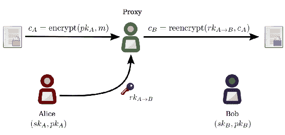
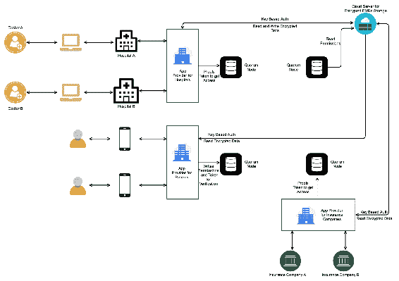

# 为数字化医疗记录构建 DApp

整个医疗行业都充斥着大量的纸质医疗记录，这导致了巨大的经济、时间和生命损失。电子医疗记录（EMRs）是纸质记录引起的许多问题的解决方案。有许多公司和研究人员正在利用区块链技术构建 EMR 数据管理和共享系统。我们将设计一种与互联网上的解决方案非常不同的解决方案，因为那些解决方案仅专注于匿名性、访问控制、安全性和隐私，而我们的解决方案还将通过实现跨应用程序通信来提供用户体验和大规模采用。在构建系统时，我们将学习如何使用 Proxy Re-Encryption（PRE）实现隐私。

在本章中，我们将学习以下主题：

+   什么是医疗数据管理系统，以及它的功能是什么？

+   纸质医疗记录引起的问题以及数字化医疗记录的好处

+   医疗数据管理系统的限制？

+   构建集中式医疗数据管理应用程序的问题

+   什么是 PRE 以及它如何帮助实现区块链中的数据隐私

+   如何设计一个去中心化的医疗数据管理系统，实现跨应用程序的数据共享

+   如何使用Python和JavaScript为医疗数据管理的 DApp 构建智能合约和测试

# 介绍 EMRs 数据管理和共享系统

电子医疗记录（EMRs）包含了医疗保健领域中的关键、高度敏感的私人信息，并且需要在同行之间频繁共享。EMR 数据管理和共享系统促进了不同参与者以安全可信的方式读取和写入 EMR 到系统中。这些系统应确保 EMR 数据的隐私、安全、可用性和细粒度的访问控制。EMRs 包括处方、实验室报告、账单以及在医院中找到的任何其他纸质记录。

一般来说，EMR 数据管理和共享系统允许医生开具数字处方，药店根据患者身份提取处方，实验室发出数字报告，患者查看所有记录并与他人共享等。

# 纸质医疗记录存在的问题

医疗记录需要在医疗过程中分发和共享给同行，如医疗服务提供者、保险公司、药店、研究人员和患者家属，这本身就是一个挑战。即使在共享后，这些记录在治疗过程中也需要不断更新。纸质记录也更容易丢失或放错位置。当有人患有严重的医疗状况，如癌症或艾滋病时，他们必须维护长时间的记录，因为这对治疗至关重要。使用纸质记录时，维护长时间的记录很麻烦。

此外，伪造的健康记录被提交给保险公司，导致保险公司巨大的财务损失。很多时候，医生和实验室也会在患者的同意下发布虚假处方和记录。例如，大学要求学生通过几项测试才能被录取，有时学生会试图获取假报告而不参加测试。

许多患者不购买自己的药物，也没有办法追踪患者是否服用了必要的药物。这导致患者生活质量受损，医疗系统成本增加。如果患者去不同的医生那里就诊，那么由于不同医生推荐不同类型的药物，患者出现有害副作用的可能性很大。如果一个人有多个医生为其治疗，那么这些医生就无法共同制定患者的药物管理计划，因此无法为所有相关方简化整个流程。由于患者未能提供他们的过去记录，当他们在不同的诊所就诊时，需要再次进行与特定化学品或物质相关的过敏测试，如果患者的医疗史得以保持，则无需进行此类测试。

处方中的潦草字迹也可能导致用药错误的风险。此外，由于远程通信时医生之间的口头交流，用药错误的可能性很大。此外，由于开具处方者对药物的期望剂量或多种药物之间的不良相互作用了解不足，也没有办法在纸质处方中实施警告和警报系统。

对于研究公司来说，收集和整理医疗记录用于研究目的是困难的。用药结束后无法续开处方，因此患者需要再次看医生，这是一个繁琐的过程。纸质处方无法实现在线购买药物，但数字化处方可以为在线药物配送打开大门，因为处方可以在线验证。

电子医疗记录（EMR）数据管理和共享系统应旨在解决之前的一些或所有问题。例如，在处方续开的情况下，第一步是数字化处方。然后，在患者的请求下，药房工作人员可以生成一个续开请求，该请求将被送达给开具处方的人员。开具处方的人员随后可以审查请求，并根据情况批准或拒绝请求。通过有限的资源利用和从开具处方者那里点击几下，他们就可以完成药物续开任务，同时增强持续的患者文档。

前述问题只是纸质记录带来的一些问题之一。但整个医疗保健行业充斥着大量由纸质记录引起的问题。解决方案应设计成能够解决这些问题，并且可以定期增强以解决额外的问题。

# 电子病历数据管理和共享系统的局限性

尽管电子病历数据管理和共享系统解决了很多问题，但它也有一些限制，影响了它的适应性和人们对其的信任。以下是一些限制：

+   **财务成本和投资回报**：购买、实施、支持和维护此类系统的成本是无法承受的，特别是对于小型医院和诊所来说。即使他们免费获得系统，也会有其他与界面管理、灵活性定制、培训、维护和升级相关的财务成本。

+   **升级员工队伍**：目前，员工沉迷于纸质记录。培训患者、医生、药店、医院等接受解决方案是一项困难且耗时的任务。有时可能需要改变员工队伍。例如，当银行开始实施计算机，从记账簿转向数字记录时，许多人无法理解和接受，因此失去了工作。

+   **数据输入的完整性**：意外的数据输入错误，比如选择了错误的患者或在剂量菜单中点击了错误的选择，可能会发生。

+   **安全与隐私**：这是最重要的关注之一。健康记录需要安全存储，因为电子健康数据库始终是黑客攻击的目标。健康记录包含非常敏感的信息，泄露可能会导致灾难。应实施严格的访问控制，并定期征求反馈意见。在没有患者同意的情况下，他们的记录不应与任何人共享。

+   **系统停机时间**：由于网络或硬件相关问题，定期发生系统停机的可能性很高。无法使用系统是一个大问题。

+   **患者丢失访问权**：在患者无法控制的情况下，比如医疗提供者办公室的软件故障，患者无法再向医疗提供者要求纸质处方以去药房购买所需的药物。这使患者完全依赖技术人员或其他不可发现的工作者。

# 集中化与去中心化的电子病历管理系统

无论EMR管理系统是集中式还是分散式，它都必须符合卫生当局的法律法规。由于这是敏感的公共数据，应该有一个监管机构来定义标准并规定数据的分享和存储规则。例如，1996年的《健康保险移植和责任法案》（HIPAA）是美国的一项立法，为保障医疗信息的数据隐私和安全提供了规定。同样，不同国家有不同的立法。

要理解集中式EMR数据管理应用程序的问题，让我们以谷歌健康集中服务为例。谷歌健康服务允许用户手动添加他们的健康记录到应用中，或者通过登录到谷歌合作的健康服务提供者来添加。应用中存储的记录可能包括健康状况、药物、过敏以及实验室结果。谷歌健康利用这些信息为用户提供关于医疗状况、药物、状况和过敏之间可能的互动的信息。

2011年，谷歌宣布将于2012年1月1日停止谷歌健康服务。数据可通过下载方式获取直至2013年1月1日。谷歌放弃该项目的原因是缺乏普遍的接受程度。

这表明我们很难相信集中式应用程序，因为它们可以随时终止服务。作为患者，这是一个大问题，因为突然间你不得不寻找其他选项来管理你的记录。即使是医院和其他卫生服务提供者也将不得不改变他们的系统。即使你想转换到另一个应用，迁移数据也不容易。许多谷歌健康（Google Health）的客户转向使用微软健康宝库（Microsoft HealthVault），这是一个竞争性的服务。微软发布了一个工具，让谷歌健康的客户将他们的个人健康信息转移到微软健康宝库账户。但是如果微软也停止他们的服务呢？因此，私人公司开发的集中式卫生应用程序是不值得信赖和采用的。

因此，许多政府都推出了他们自己的集中服务。爱沙尼亚的电子处方服务就是一个例子。政府服务是可以信赖的，采用并不是问题，因为政府可以强制卫生服务提供者使用该服务。这是他们强制的权威。但问题是一个应用无法解决所有问题，提供最佳功能集，拥有最佳用户体验等等。

政府和私人的集中式应用都存在问题，例如，在出现安全漏洞时，黑客可能危及集中服务中的所有公共记录。此外，有什么保证健康记录不会被修改，或者中央服务器不会删除某些记录呢？

前述问题意味着我们需要设计一个使用区块链的分散系统，其中区块链仅用于EMR访问控制和身份管理，而EMR位于中央化和分布式存储中。连接到该网络的所有应用程序都可以相互通信并共享数据。用户可以轻松切换应用程序，卫生管理机构将能够监管和监控网络。例如，两个不同的服务提供商可以构建具有不同功能和用户体验集合的不同应用程序，但是不同应用程序的用户可以读取/写入每个应用程序的EMR。

卫生管理机构决定谁可以加入网络并提供医疗应用程序。为了加入网络，卫生管理机构可以设定一个预先检查的标准和措施清单，应用程序必须符合这些标准和措施才能加入网络。

# 在区块链中使用PRE确保数据隐私

在进一步进行并构建我们的分布式EMR数据管理和共享系统之前，让我们先了解一下PRE是什么。在我们的解决方案中，我们将使用PRE来确保安全和隐私。

PRE是一组算法，允许您使用您的密钥对一些文本进行加密，然后更改密文，以便另一方可以解密，而不会透露您的密钥。要更改密文，您需要另一方的私钥或公钥，具体取决于您是使用交互式还是非交互式PRE算法。无论使用哪种算法，PRE都涉及生成重新加密密钥，该密钥用于重新加密数据。重新加密密钥是基于所有者的私钥和接收者的私钥或公钥生成的，具体取决于算法类型。

在实践中，PRE用于在第三方服务器上存储敏感数据，并允许您决定谁可以访问数据，而不会向第三方服务器透露实际数据。PRE允许第三方（代理）更改已为一方加密的密文，以便另一方可以解密。

与其简单地与接收方共享您的私钥（不安全）或者为每个接收方分别加密整个消息*n*次，PRE允许您仅加密数据一次，然后基于接收方的公钥委派对其进行访问。这消除了数据所有者必须在线的要求（数据可以存储在您不必管理的不同服务器上），并且还便于撤销访问权限（要阻止访问，您可以再次运行PRE来更改您的密钥，然后删除旧的密文）。

NuCypher PRE当前支持的PRE算法是BBS98。BBS98基于椭圆曲线密码学。该库默认使用secp256k1曲线。请注意，以太坊帐户也使用相同的曲线（secp256k1），因此我们可以使用以太坊帐户密钥与NuCypher。

目前，PRE 领域仍在积极研究和开发中。目前还没有多少用于 PRE 的库可用。你会发现基于 Java 或 Python 的交互式 PRE 库，但对于非交互式或基于对称密钥的，你找不到任何库。由于这个限制，我们将坚持使用微服务架构，并将所有代理重加密代码移至基于 Python 的微服务。

# NuCypher PRE 库

NuCypher 是一家构建去中心化的 PRE 服务产品的公司，称为 NuCypher **密钥管理服务**（**KMS**）。NuCypher KMS 是一种去中心化的 KMS、加密和访问控制服务。它使得在公共网络中任意数量的参与者之间进行私密数据共享成为可能，使用 PRE 来委托解密权限，这是传统的对称或公钥加密方案无法实现的。原生代币用于**激励网络**参与者执行密钥管理和访问委托/撤销操作。

我们不会深入研究 NuCypher KMS，也不会在本书中使用它。相反，我们将探索如何使用 NuCypher 构建的 PRE 库。NuCypher 提供了 Python 和 Java 的 PRE 库，但我们只会学习如何使用 Python PRE 库。

NuCypher 不是 PRE 的唯一 Python 库。还有其他一些库可用。例如，ZeroDB 也提供了一个支持 AFGH 算法的 PRE 库，这是一个非交互式 PRE 算法。你可以在[这里](https://github.com/zerodb/zerodb-afgh-pre)了解更多信息。

# 安装库

此库需要 `python3`、`libssl-dev` 和 `libgmp-dev` 作为先决条件。要在 Ubuntu 上安装这些，请运行以下命令：

```
sudo apt-get install build-essential
sudo apt-get install python3
sudo apt-get install python3-dev libssl-dev libgmp-dev
```

在 macOS 上使用以下命令：

```
brew install python3
brew install gmp
```

现在让我们安装 PRE 库。要安装它，请运行以下命令：

```
git clone https://github.com/nucypher/nucypher-pre-python.git
cd nucypher-pre-python
pip3 install -e .
```

# 使用库

让我们看一个如何使用这个库的例子。该库仅支持交互式算法；它需要发送方了解接收方的私钥。

我们将创建一个示例 Python 脚本，其中 **Alice** 将加密一些文本，**Bob** 将与 **Alice** 分享他的私钥，**Alice** 将使用 **Bob** 的私钥创建一个派生密钥，然后 **代理** 将使用派生密钥进行再加密，最后 **Bob** 将使用他的私钥解密再加密的数据：



以下是这些交互的代码：

```
# Import bbs98 from NuCypher PRE
from npre import bbs98
# Initialize the re-encryption object
pre = bbs98.PRE()

# 'sk' means "secret key", and 'pk' means "public key"

# Alice's Private key
sk_a = pre.gen_priv(dtype=bytes)
# Alice's Public Key
pk_a = pre.priv2pub(sk_a)

# Bob's Private Key
sk_b = pre.gen_priv(dtype=bytes)
# Bob's Public Key
pk_b = pre.priv2pub(sk_b)

# Print Alice's Private Key as Hex String
print(sk_a.hex()[2:])
# Print Bob's Private Key as Hex String
print(sk_b.hex()[2:])

# Encrypt Message using Alice's Public Key
emsg = pre.encrypt(pk_a, "Hello World")

# Generate Re-Encrypt Key using Private key of sender and receiver
re_ab = pre.rekey(sk_a, sk_b)
# Re-Encrypt Message using Re-Encrypt key
emsg_b = pre.reencrypt(re_ab, emsg)

# Decrypt the message using Bob's Private Key
dmsg = pre.decrypt(sk_b, emsg_b)
# Print Decrypted Message
print(dmsg.decode("utf-8"))
```

上述代码不言自明。但上述场景中的问题是，为了让 Alice 将数据访问权限授予 Bob，Alice 需要知道 Bob 的私钥。这不是理想的情况，Bob 可能不愿意分享他的密钥。例如，如果 Bob 在使用相同的密钥进行区块链交易，那么他肯定不希望与 Alice 共享密钥。

幸运的是，有一个变通方法：这个技巧涉及到 Alice 生成一个新的密钥对，给予访问该密钥对的权限，然后用 Bob 的公钥加密该密钥对并分享。我们将在本章后面实际看到这一点。

# 设计 EMR 的 DApp 架构

让我们为使医疗应用程序能够共享数据而设计 DApp 的架构。基本上，使用不同医疗应用程序的用户可以相互分享 EMR。

该应用程序的生态系统将由医疗服务提供商（如医院、实验室和保险公司）、患者、应用程序提供商（将构建与此区块链网络集成的医疗应用程序的公司）以及网络管理机构或管理员（卫生部门和/或解决方案提供商）组成。

下图显示了高级别的架构：



这就是前述架构的工作原理：

+   网络管理员决定谁可以加入网络并连接到云服务器。

+   区块链将保存服务提供商和患者的身份和权限，而集中式和分布式服务器将存储加密的 EMR。每个用户和服务提供商都将拥有自己的以太坊密钥来识别自己。我们之所以不把加密的 EMR 存储在区块链中，有两个原因：

    +   每一份数据都将被复制到区块链中的每个节点。这将损害可扩展性，因为节点的大小将大幅增加。

    +   根据合规性规定，你甚至不应该分享加密数据，因为加密算法可能在未来被破解，所有数据都将泄漏。所以，如果它被保存在一个中心位置，那么服务器可以立即被拔掉。

+   每当有人从存储中请求数据时，服务器将检查区块链以查看患者是否已授予访问权限，如果是，则将使用重新加密密钥重新加密数据，并将重新加密的数据提供给接收者。

+   在向云服务器请求读取或写入数据时，客户端应该使用服务器提供的令牌进行签名以证明其身份。基于此，云服务器将在区块链中寻找权限并决定是否重新加密。客户端将使用他们的私有以太坊密钥进行签名。这是向云服务器进行身份验证的过程。

+   用户将在区块链上注册其身份。如果患者想要授权其数据访问权限，那么他们将生成一个新的私钥和一个随机令牌。患者将使用这个私钥生成一个重加密密钥，并将其放到区块链上，供云服务器在重新加密数据时参考。用户无法直接使用服务提供商的密钥生成重加密密钥，因为在这种情况下，服务提供商必须暴露他们的私钥，因为我们正在使用交互式PRE算法。患者将会把随机令牌的哈希值添加到区块链上，而服务提供商必须发送一笔交易，证明他们知道随机令牌，作为用户分享访问权限的证明。这是一种授权数据访问的方法。例如，如果用户想要在手机上授权他们的EMR，那么用户将生成一个包含私钥和令牌的二维码。然后他们将把交易发送到区块链，声明任何能证明他们拥有令牌的人都将被授予访问他们数据的权限。在医院，前台可以简单扫描二维码，推动一笔交易证明获取随机字符串，从而获得用户的数据访问权限。二维码也将保存私钥。每次患者想要授权某人访问时，他们都必须生成新的密钥对和令牌。

+   一旦获得写入访问权限，服务提供商可以创建指定格式的EMR，将其哈希值放在区块链上，然后将使用患者的公钥加密的EMR发送至云服务器存储。

+   云服务器由卫生主管部门或解决方案提供商控制。它应该符合卫生主管部门的标准并遵守规范。即使云服务器被黑客攻击，黑客也无法读取任何内容，因为存储在其中的所有内容都是加密的，并且密钥分布在各个应用提供商之间。

+   可以通过扩展这个解决方案，让最终用户控制他们的私钥，从而不必信任应用提供商。但这将损害用户体验，因为用户不习惯存储私钥。如果他们失去了密钥，那么他们对EMR的访问权限将永远丢失。

+   尽管云服务器为访问EMR创建了集中化，但您仍然可以信任它。密钥并没有存储在云服务器中，它只是起到存储作用。即使云服务器未经您的允许将您的数据授权给他人，接收者也无法读取数据，因此可以信任云服务器。该服务器可以分布式部署以实现高可用性。

+   这个解决方案允许您从不同的应用提供商那里使用不同的医疗保健应用，并且仍然在每个应用上看到所有的EMR。要在新应用上导入所有EMR，用户必须从上一个应用中导出密钥，并将其导入新的应用中。

仍然存在一个问题：在授予某人访问权限后，如何撤销访问权限？当然，您可以在区块链上撤销访问权限，但如果云服务器仍然向服务提供商提供您的新 EMR 访问权限怎么办？云服务器这样做的可能性很小，因为云服务器没有任何激励这样做。但患者可以通过更改其密钥并在其数据上运行 PRE 来避免这种情况。这将使您分享的所有重新加密密钥无效，因此以前授予访问权限的现有服务提供商无法读取新的 EMR。

# 身份和访问控制的智能合约

让我们编写智能合约，负责注册患者和服务提供者的身份，并提供访问控制。

这是智能合约代码：

```
pragma solidity ^0.4.22;

contract Health {

    address owner;

    struct ServiceProvider {
        string publicKey;
    }

    struct Permission {
        bool read;
        bool write;
        string reEncKey; //Re-Encrypt Key
    }

    struct Token {
        int status;
        bool read;
        bool write;
        string reEncKey; //Re-Encrypt Key
    }

    struct EMR {
        string hash;
        address issuer;
    }

    struct Patient {
        string publicKey;
        mapping (address => Permission) permissions;
        mapping (bytes32 => Token) tokens;
        bool closed;
        EMR[] EMRs;
    }

    mapping (address => ServiceProvider) serviceProviders;
    mapping (address => Patient) patients;

    event tokenVerified (bytes32 hash, address patient, address
      serviceProvider);
    event reEncKeyAdded (address patient, address serviceProvider);
    event patientAccountChanged(address oldAccountAddress, string
      oldAccountPublicKey, address newAccountAddress, string 
      newAccountPublicKey, string reEncKey);
    event emrAdded(address patient, address serviceProvider, 
      string emrHash);

    constructor() {
        owner = msg.sender;
    }

    //Utilities
    function fromHexChar(uint c) public pure returns (uint) {
        if (byte(c) >= byte('0') && byte(c) <= byte('9')) {
            return c - uint(byte('0'));
        }
        if (byte(c) >= byte('a') && byte(c) <= byte('f')) {
            return 10 + c - uint(byte('a'));
        }
        if (byte(c) >= byte('A') && byte(c) <= byte('F')) {
            return 10 + c - uint(byte('A'));
        }
    }

    function fromHex(string s) public pure returns (bytes) {
        bytes memory ss = bytes(s);
        require(ss.length%2 == 0); // length must be even
        bytes memory r = new bytes(ss.length/2);
        for (uint i=0; i<ss.length/2; ++i) {
            r[i] = byte(fromHexChar(uint(ss[2*i])) * 16 +
                        fromHexChar(uint(ss[2*i+1])));
        }
        return r;
    }

    //Register Patient
    function addPatient(string publicKey) returns (int reason) {
        if(address(keccak256(fromHex(publicKey))) == msg.sender) {
            patients[msg.sender].publicKey = publicKey;
        }
    }

    //Register Service provider
    function addServiceProvider(string publicKey) {
        if(address(keccak256(fromHex(publicKey))) == msg.sender) {
            serviceProviders[msg.sender].publicKey = publicKey;
        }
    }

    //Patient:
    //In QRCode include token string, address and private key
    //Adds the hash of token and derivation key in Blockchain
    function addToken(bytes32 hash, bool read, bool write, string reEncKey) {
        if(patients[msg.sender].tokens[hash].status == 0 &&
          patients[msg.sender].closed == false) {
            patients[msg.sender].tokens[hash].status = 1;
            patients[msg.sender].tokens[hash].read = read;
            patients[msg.sender].tokens[hash].write = write;
            patients[msg.sender].tokens[hash].reEncKey = reEncKey;
        }
    }

    //Service Provider proves the token to get access
    function requestAccess(string token, address patient) {
        bytes32 hash = sha256(token);
        if(patients[patient].tokens[hash].status == 1) {
            patients[patient].tokens[hash].status = 2;
            patients[patient].permissions[msg.sender].read =
              patients[patient].tokens[hash].read;
            patients[patient].permissions[msg.sender].write =
              patients[patient].tokens[hash].write;
            patients[patient].permissions[msg.sender].reEncKey =
              patients[patient].tokens[hash].reEncKey;
            tokenVerified(hash, patient, msg.sender);
        }
    }

    //Add EMR
    function addEMR(address patient, string hash) {
        if(patients[patient].permissions[msg.sender].write == true) {
            patients[patient].EMRs.push(EMR(hash, msg.sender));
            emrAdded(patient, msg.sender, hash);
        }
    }

    function getPatientPublicKey(address patient) returns
      (string publicKey) {
        return patients[patient].publicKey;
    }

    function isPatientProfileClosed(address patient) returns 
      (bool isClosed) {
        return patients[patient].closed;
    }

    function getServiceProviderPublicKey(address serviceProvider)
      returns (string publicKey) {
        return serviceProviders[serviceProvider].publicKey;
    }

    //Revoke Access. Here you aren't changing the key.
    function revokeServiceProviderAccess(address serviceProvider) {
        patients[msg.sender].permissions[serviceProvider].read = false;
        patients[msg.sender].permissions[serviceProvider].write =
        false;
    }

    function getPermission(address patient, address serviceProvider)
      returns(bool read, bool write, string reEncKey) {
        return (patients[patient].permissions[serviceProvider].read,
          patients[patient].permissions[serviceProvider].read,
          patients[patient].permissions[serviceProvider].reEncKey);
    }

    function getToken(address patient, bytes32 hash) returns (int
      status, bool read, bool write, string reEncKey) {
        return (patients[patient].tokens[hash].status,
          patients[patient].tokens[hash].read,
          patients[patient].tokens[hash].write,
          patients[patient].tokens[hash].reEncKey);
    }

    //Change your keys to revoke old account and move EMRs to new
    // account.
    function changePatientAccount(string reEncKey, 
      address newAddress, string newPublicKey) {
        patients[msg.sender].closed = true;
        if(address(keccak256(fromHex(newPublicKey))) == newAddress) {
            patients[newAddress].publicKey = newPublicKey;
            patientAccountChanged(msg.sender,
              patients[msg.sender].publicKey, newAddress, 
              newPublicKey, reEncKey);
        }
    }
}
```

前述智能合约中的大部分代码都是不言自明的。在注册患者和服务提供者时，我们正在传递公钥，并验证公钥是否正确。`address(keccak256(fromHex(publicKey))`短语计算`publicKey`的`address`，`changePatientAccount`用于更改用户的帐户密钥，以防密钥被泄露。例如，如果您的应用提供商的服务器遭到黑客攻击并且您的私钥泄露了，应用提供商可以使用此功能来停用以前的帐户并为用户生成新帐户。云服务器将查找`patientAccountChanged`事件，并对加密的 EMR 运行重新加密，以便您可以使用新密钥访问它们。然后它将删除旧的加密 EMR。用户还可以使用此功能向所有服务提供商撤销对 EMR 的访问权限。

# 编写用于测试的 Python 和 JS 脚本

现在让我们编写一些测试脚本来测试智能合约和数据和用户流。我们将编写 Python 脚本来加密数据、解密数据、生成重新加密密钥和重新加密数据。我们将使用 Node.js 调用 Python 脚本和智能合约函数。

创建一个名为`test`的目录。在其中，创建一个名为`encrypt.py`的文件，并将以下代码放入其中：

```
from npre import bbs98
pre = bbs98.PRE()
import base64
import sys

publicKey = base64.b64decode(sys.argv[1])
encrypted_message = pre.encrypt(publicKey, sys.argv[2])

print(base64.b64encode(encrypted_message))
```

此脚本接受两个参数，`publicKey` 和原始消息。 `publicKey` 作为`base64`编码的公钥传递。此脚本将公钥转换为字节，以便`npre`库可以利用它。最后，它加密消息并将其打印为`base64`编码的密文。

创建另一个名为`decrypt.py`的文件，并将以下代码放入其中：

```
from npre import bbs98
pre = bbs98.PRE()
import base64
import sys

privateKey = base64.b64decode(sys.argv[1])
encrypted_message = base64.b64decode(sys.argv[2])

decrypted_message = pre.decrypt(privateKey, encrypted_message)

print(decrypted_message)
```

这段代码负责解密。现在，创建另一个名为`generate_reEncKey.py`的文件，并将以下代码放入其中：

```
from npre import bbs98
pre = bbs98.PRE()
import base64
import sys

base64_privateKeyA = base64.b64decode(sys.argv[1])
base64_privateKeyB = base64.b64decode(sys.argv[2])

re_ab = pre.rekey(base64_privateKeyA, base64_privateKeyB)

print(base64.b64encode(re_ab))
```

这段代码负责生成重新加密密钥。现在，创建另一个名为`re_encrypt.py`的文件，并将以下代码放入其中：

```
from npre import bbs98
pre = bbs98.PRE()
import base64
import sys

reEncryptKey = base64.b64decode(sys.argv[1])
encrypted_message = base64.b64decode(sys.argv[2])
re_encrypted_message = pre.reencrypt(reEncryptKey, encrypted_message)

print(base64.b64encode(re_encrypted_message))
```

这段代码负责重新加密密文。现在创建一个 `package.json` 文件，用于保存我们 Node.js 应用程序的依赖项。将以下内容放入文件中，并运行 `npm install` 命令来安装模块：

```
{
    "name": "health",
    "private": true,
    "dependencies": {
        "eth-crypto": "^1.2.1",
        "ethereumjs-tx": "~1.3.4",
        "ethereumjs-util": "~5.2.0",
        "ethereumjs-wallet": "~0.6.0",
        "sha256": "~0.2.0",
        "web3": "^0.20.6",
        "child_process": "~1.0.2"
    }
}
```

现在，最后，创建一个名为 `app.js` 的文件，并在其中放置以下测试代码：

```
let Web3 = require("web3");
let ethereumjsWallet = require("ethereumjs-wallet")
let ethereumjsUtil = require("ethereumjs-util");
let ethereumjsTx = require("ethereumjs-tx");
let sha256 = require("sha256");
let EthCrypto = require('eth-crypto');
let exec = require("child_process").exec;

let web3 = new Web3(new 
  Web3.providers.HttpProvider("http://localhost:8545"));

let healthContract = web3.eth.contract([]);
let health = healthContract.new({
  from: web3.eth.accounts[0],
  data: '0x608060aa31862e....',
  gas: '4700000'
}, function(e, contract) {
  if (typeof contract.address !== 'undefined') {
    let healthContractInstance = healthContract.at(contract.address);

    //Generate Patient's Keys
    let patient_wallet = ethereumjsWallet.generate();

    //Register the Patient on blockchain.
    let data = healthContractInstance.addPatient.getData
      (patient_wallet.getPublicKey().toString('hex'));
    let nonce = web3.eth.getTransactionCount
      (patient_wallet.getAddressString())

    let rawTx = {
      gasPrice: web3.toHex(web3.eth.gasPrice),
      gasLimit: web3.toHex(4700000),
      from: patient_wallet.getAddressString(),
      nonce: web3.toHex(nonce),
      data: data,
      to: contract.address
    };

    let privateKey = ethereumjsUtil.toBuffer("0x" +
      patient_wallet.getPrivateKey().toString('hex'), 'hex');
    let tx = new ethereumjsTx(rawTx);
    tx.sign(privateKey);

    web3.eth.sendRawTransaction("0x" + tx.serialize().toString('hex'),
      function(error, result) {
      if (error) {
        console.log(error)
        res.status(500).send({
          error: "An error occured"
        })
      } else {
        console.log("Patient Pub Key: " +  
          healthContractInstance.getPatientPublicKey.call
          (patient_wallet.getAddressString()))

        //Generate Service Provider's Keys
        let hospital_wallet = ethereumjsWallet.generate();

        //continue from here
      }
    })
  }
})
```

编译智能合约，并将 ABI 和字节码分别填充到 `healthContract` 和 `health` 变量中。

这是前面代码的工作原理：

+   我们使用 `ethereumjs` 库来创建离线账户，并使用这些账户进行交易签名。

+   我们使用 `child_process` 来从 Node.js 执行 Python 脚本。尽管您可以使用 RESTful API 并采用微服务架构，但出于测试目的，这样做是可以的。

+   我们使用 `EthCrypto` 来压缩和解压缩公钥。由 `ethereumjs-wallet` 生成的公钥是未压缩的，而由 `npre` 生成和使用的公钥是压缩的。私钥始终为 32 字节，公钥始终为 65 字节（或者压缩公钥为 33 字节）。公钥哈希始终为 20 字节。 `npre` 还在私钥的开头添加了 `0x00`，在公钥的开头添加了 `0x01`。

+   首先，我们生成一个患者的钱包，并将其注册到区块链上。在真实应用程序中，您还可以在云服务器上注册用户配置文件和服务提供商。用户配置文件可以包含患者的姓名、年龄和其他详细信息；同样，服务提供商配置文件可以包含许可证号码、名称等。这些配置文件可以使用所有者的公钥加密并存储在云服务器上。

现在，在我们有一个续行注释的地方插入以下代码：

```
//Generate Service Provider's Keys
let hospital_wallet = ethereumjsWallet.generate();

//Register the Service Provider on blockchain
let data = healthContractInstance.addServiceProvider.getData
  (hospital_wallet.getPublicKey().toString('hex'));
let nonce = web3.eth.getTransactionCount
  (hospital_wallet.getAddressString())

let rawTx = {
  gasPrice: web3.toHex(web3.eth.gasPrice),
  gasLimit: web3.toHex(4700000),
  from: hospital_wallet.getAddressString(),
  nonce: web3.toHex(nonce),
  data: data,
  to: contract.address
};

let privateKey = ethereumjsUtil.toBuffer("0x" +
   hospital_wallet.getPrivateKey().toString('hex'), 'hex');
let tx = new ethereumjsTx(rawTx);
tx.sign(privateKey);

web3.eth.sendRawTransaction("0x" + tx.serialize().toString('hex'),
  function(error, result) {
  if (error) {
    console.log(error)
  } else {
    console.log("Hospital Pub Key: " +
      healthContractInstance.getServiceProviderPublicKey.call
      (hospital_wallet.getAddressString()))

    let token = "yr238932";
    let tokenHash = "0x" + sha256(token);

    //Generate private key like npre. It has a extra character 0x00 
    //in beginning
    let secKeyA = Buffer.concat([new Buffer([0x00]),
      patient_wallet.getPrivateKey()]).toString('base64')
    //Generate another private key to share with service provider
    let temp_wallet = ethereumjsWallet.generate();
    let secKeyB = Buffer.concat([new Buffer([0x00]),
      temp_wallet.getPrivateKey()]).toString('base64')

    exec('python3 ./generate_reEncKey.py ' + secKeyA + " " + secKeyB,
      (error, stdout, stderr) => {
      if (error !== null) {
        console.log(error)
      } else {
        let reEncKey = stdout.substr(2).slice(0, -2)

        console.log("Re-Encryption Key: " + reEncKey)

        //Add token to blockchain
        let data = healthContractInstance.addToken.getData
          (tokenHash, true, true, reEncKey);
        let nonce = web3.eth.getTransactionCount
          (patient_wallet.getAddressString())

        let rawTx = {
          gasPrice: web3.toHex(web3.eth.gasPrice),
          gasLimit: web3.toHex(4700000),
          from: patient_wallet.getAddressString(),
          nonce: web3.toHex(nonce),
          data: data,
          to: contract.address
        };

        let privateKey = ethereumjsUtil.toBuffer("0x" + 
          patient_wallet.getPrivateKey().toString('hex'), 'hex');
        let tx = new ethereumjsTx(rawTx);
        tx.sign(privateKey);

        web3.eth.sendRawTransaction("0x" + 
          tx.serialize().toString('hex'), 
          function(error, result) {
          if (error) {
            console.log(error)
          } else {
            console.log("Token Info: " + 
              healthContractInstance.getToken.call
              (patient_wallet.getAddressString(), tokenHash, {
              from: patient_wallet.getAddressString()
            }))

            //Get access to patient's data
            let data = 
              healthContractInstance.requestAccess.getData
              (token, patient_wallet.getAddressString());
            let nonce = web3.eth.getTransactionCount
              (hospital_wallet.getAddressString())

            let rawTx = {
              gasPrice: web3.toHex(web3.eth.gasPrice),
              gasLimit: web3.toHex(4700000),
              from: hospital_wallet.getAddressString(),
              nonce: web3.toHex(nonce),
              data: data,
              to: contract.address
            };

            let privateKey = ethereumjsUtil.toBuffer("0x" +
              hospital_wallet.getPrivateKey().toString('hex'),
              'hex');
            let tx = new ethereumjsTx(rawTx);
            tx.sign(privateKey);

            web3.eth.sendRawTransaction("0x" + 
              tx.serialize().toString('hex'), 
              function(error, result) {
              if (error) {
                console.log(error)
              } else {
                console.log("Permission Info: " +
                  healthContractInstance.getPermission.call
                  (patient_wallet.getAddressString(), 
                  hospital_wallet.getAddressString(), {
                  from: hospital_wallet.getAddressString()
                }))

              }
            })
          }
        })
      }
    })
  }
})
```

在这里，我们生成了一个临时密钥对，并假设它与服务提供商共享。然后，我们使用患者的私钥和临时私钥生成了一个重新加密密钥。然后，我们从患者的钱包执行了一个 `addToken` 交易和一个从服务提供商的钱包执行了一个 `requestAccess` 交易。这两个交易为服务提供商提供了访问患者 EMR 的权限。

现在，在我们有一个续行注释的地方插入以下代码：

```
let emr = JSON.stringify({
  "Blood Group": "O+",
  "type": "Blood Report"
});
let emrHash = sha256(emr);

let data = healthContractInstance.addEMR.getData
  (patient_wallet.getAddressString(), emrHash);
let nonce = web3.eth.getTransactionCount
  (hospital_wallet.getAddressString())

let rawTx = {
  gasPrice: web3.toHex(web3.eth.gasPrice),
  gasLimit: web3.toHex(4700000),
  from: hospital_wallet.getAddressString(),
  nonce: web3.toHex(nonce),
  data: data,
  to: contract.address
};

let privateKey = ethereumjsUtil.toBuffer("0x" + hospital_wallet.getPrivateKey().toString('hex'), 'hex');
let tx = new ethereumjsTx(rawTx);
tx.sign(privateKey);

web3.eth.sendRawTransaction("0x" + tx.serialize().toString('hex'),
   function(error, result) {
  if (error) {
    console.log(error)
  } else {
    //Generate Public Key like npre. It's compressed and has a 
    //extra character 0x01 in beginning
    let compressedPublicKey = Buffer.concat
      ([new Buffer([0x01]), Buffer.from(EthCrypto.publicKey.compress
      (patient_wallet.getPublicKey().toString("hex")),
      'hex')]).toString("base64")

    exec('python3 ./encrypt.py ' + compressedPublicKey + " '" + 
      emr + "'", (error, stdout, stderr) => {
      if (error !== null) {
        console.log(error)
      } else {
        //Assume we are pushing encrypted data to proxy 
        //re-encryption server
        let encryptedEMR = stdout.substr(2).slice(0, -2);
        console.log("Encrypted Message: " + encryptedEMR)

        //Assume that proxy re-encryption server re-encrypting
        // data when requested by authorized service provider
        exec('python3 ./re_encrypt.py ' + reEncKey + " " +
          encryptedEMR, (error, stdout, stderr) => {
          if (error !== null) {
            console.log(error)
          } else {
            let reEncryptedEMR = stdout.substr(2).slice(0, -2)
            console.log("Re-Encrypted Message: " + reEncryptedEMR)

            //Assume service provider decrypting the re-encrypted 
            //data provided by the proxy re-encryption server
            exec('python3 ./decrypt.py ' + secKeyB + " " +
              reEncryptedEMR, (error, stdout, stderr) => {
              if (error) {
                console.log(error)
              } else {
                let decrypted_message = stdout.substr(2).slice(0, -2)

                console.log("Decrypted Message: " + decrypted_message)

                //Generate a new key for patient
                let new_patient_wallet = ethereumjsWallet.generate();

                let secKeyA = Buffer.concat([new Buffer([0x00]),
                  patient_wallet.getPrivateKey()]).toString('base64')
                let secKeyB = Buffer.concat
                  ([new Buffer([0x00]),
                   new_patient_wallet.getPrivateKey()]
                   ).toString('base64')

                exec('python3 ./generate_reEncKey.py ' + secKeyA + " "
                  + secKeyB, (error, stdout, stderr) => {
                  if (error !== null) {
                    console.log(error)
                  } else {
                    let reEncKey = stdout.substr(2).slice(0, -2)

                    console.log("Re-encryption Key for Patient's new
                      Wallet: " + reEncKey)

                    //Change patient's key
                    let data = healthContractInstance.
                      changePatientAccount.getData
                      (reEncKey, new_patient_wallet.getAddressString(),
                      new_patient_wallet.getPublicKey().
                      toString('hex'));
                    let nonce = web3.eth.getTransactionCount
                      (patient_wallet.getAddressString())

                    let rawTx = {
                      gasPrice: web3.toHex(web3.eth.gasPrice),
                      gasLimit: web3.toHex(4700000),
                      from: patient_wallet.getAddressString(),
                      nonce: web3.toHex(nonce),
                      data: data,
                      to: contract.address
                    };

                    let privateKey = ethereumjsUtil.toBuffer("0x" +
                      patient_wallet.getPrivateKey().toString
                      ('hex'), 'hex');
                    let tx = new ethereumjsTx(rawTx);
                    tx.sign(privateKey);

                    web3.eth.sendRawTransaction("0x" +
                      tx.serialize().toString('hex'), 
                      function(error, result) {
                      if (error) {
                        console.log(error)
                      } else {
                        let events = healthContractInstance.allEvents({
                          fromBlock: 0,
                          toBlock: 'latest'
                        });
                        events.get(function(error, logs) {
                          for (let count = 0; count < logs.length;
                            count++) {
                            console.log("Event Name: " +
                              logs[count].event + " and Args: " +
                              JSON.stringify(logs[count].args))
                          }
                        });
                      }
                    })
                  }
                })
              }
            })
          }
        })
      }
    });
  }
})
```

在这里，我们创建了一个表示血型的样本 EMR。然后我们将哈希放在区块链上，并假设将加密的 EMR 放在了云服务器上。然后，我们模拟了一个场景，云服务器重新加密了密文，服务提供商解密了密文。最后，我们生成了另一对密钥，并将患者的所有 EMR 移动到该账户，并关闭了旧账户。

所以，你看到了我们是如何模拟整个用户流程的，以及你如何使用 PRE 来确保安全性和隐私性。

# 概要

在这一章中，我们学习了如何使用PRE在区块链中实现加密数据共享。在许多情况下，PRE可以成为私有交易和ZSL的良好替代方案。我们所看到的架构可以应用于许多其他情况，其中敏感资产需要在对等方之间存储和共享。

除了PRE外，我们还了解了许多JS和Python库，比如`etherumjs-wallet`，`ethereumjs-tx`，`ethereumjs-util`和`npre`。我们还学习了如何发送原始交易，比如使用存储在geth节点外部的密钥签署交易的过程。在下一章中，我们将学习如何在Quorum中实现网络权限管理，以及如何使用手机号码构建转账解决方案。
