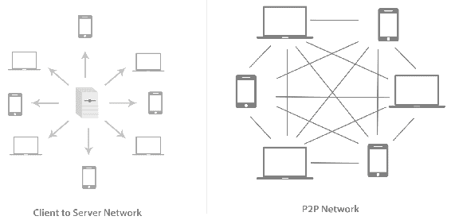
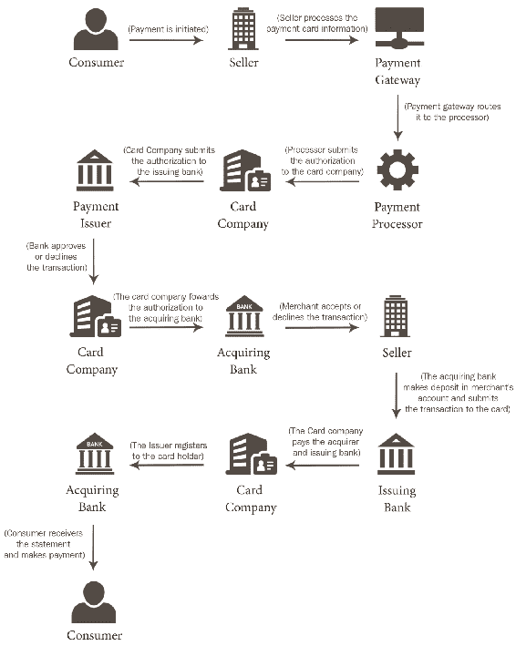
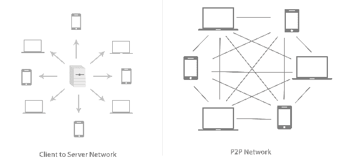
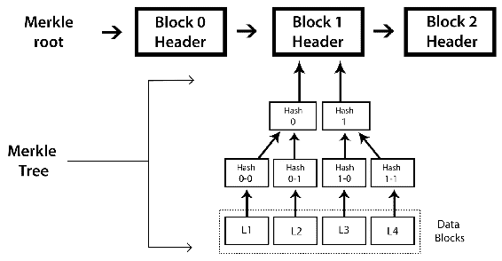
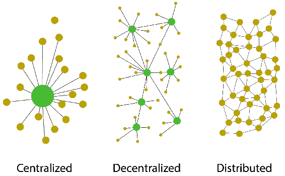
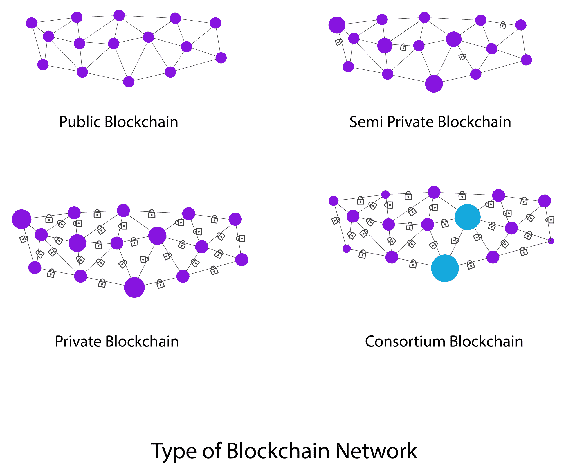

# 第一章：区块链 101

自 2008 年成立以来，区块链一直是金融、技术和其他类似产业中所有人的关注话题。除了为记录保存和共识带来新的概览外，区块链在大多数行业中都有巨大的颠覆潜力。初期采用者、爱好者，现在甚至包括政府和组织都在探索区块链技术的用途。

在本书中，我们将讨论使用法定货币进行金融交易的基础，以创建基于以太代币的加密货币，并在此过程中，尝试涵盖大多数区块链周围的主题。我们将讨论基于以太坊的区块链、超级账本项目、钱包、替代币等其他令人兴奋的主题，这些都是了解区块链的功能和潜力所必需的内容。

在本章中，我们将讨论以下内容：

+   金融交易

+   财务分类账

+   P2P 网络

+   区块链的一般要素

+   区块链的用途和好处

+   各种类型的区块链

+   引入共识系统

+   区块链网络面临的挑战

让我们先讨论前述列出的各个主题及其周围的其他重要细节。

# 处理金融交易

在我们深入探讨基于区块链的交易之前，了解金融交易的实际发生方式和法定货币的运作是很有帮助的。

法定货币完全依赖经济信用；根据定义，它是政府宣布的合法货币。没有政府的保证，法定货币是毫无价值的。

另一种货币是**商品货币**；它源自制造好货币所用的商品。例如，如果制作银币，其价值将是以银的价值来衡量，而不是币值的定义价值。与以物易物相比，商品货币是贸易的一种便利形式。然而，它容易出现巨大的价格波动。

商品货币被证明不易携带，因此政府推出了印刷货币，可以从政府银行兑换成实际商品，但即使如此，这对政府管理来说也很困难，于是推出了法定货币，或信仰为基础的货币。

法定货币在其时间内产生了许多第三方共识；这有助于从系统中消除欺诈行为。有必要有一个严格的共识过程，以确保在系统内保持进程和隐私. 下图描述了基于信用卡的支付过程：

基于信用卡的支付过程以及需要多个第三方参考点来维护信任。

# 分类账

分类账是一种记录经济交易的记录，包括现金、应收账款、存货、固定资产、应付账款、应计费用、债务、权益、收入、成本、工资、薪水、费用、折旧等等。简而言之，账目保管的书籍称为**分类账**。它是银行和其他金融机构用来调节账面余额的主要记录。会计期间的所有借方和贷方都被计算以使分类账平衡。

银行、金融机构和企业的财务报表是使用分类账户编制的。

# 无信任系统的概念

在使用法定货币进行金融交易时，我们有一个维护有关每笔交易信息的第三方分类账。其中一些第三方信任系统是 VISA、万事达卡、银行等等。

区块链通过使每个人成为分类账的一部分改变了这种无信任系统的格局。因此，它有时甚至被称为**分布式账本**；在区块链的比特币系统中，进行交易的每个人都有其他交易的记录，这些交易已经发生或正在发生。这个去中心化的分类账为每笔交易提供了多个真实性点；此外，规则是预先定义的，并且对于每个钱包用户都不同。

进一步说明，区块链实际上并没有消除信任；它所做的是最小化信任的量，并将其均匀分布在网络中。使用各种规则定义了特定的协议，这些规则自动根据遵循的规则鼓励赞助者。我们将在后面的章节中对此进行深入讨论。

# 引入区块链

2008 年，比特币的创始人或一群创始人称为中本聪的白皮书描述了比特币作为纯粹的点对点电子现金的版本。区块链是随比特币一起引入的。在最初阶段，区块链仅用于比特币的比特币金融交易。

区块链不仅限制于比特币的金融交易，而且一般来说，任何由开放、去中心化账本维护的两方之间的交易。最重要的是，这种基础技术可以被分离并且可以有其他应用程序创建，从而引发了与之相关的实验和项目数量的激增。

许多受到区块链启发的项目开始了，比如以太坊、超级账本等，以及货币，比如莱特币、名称币、迅速币等等。

区块链本质上是一个分布式和去中心化的开放分类账，由其对等体之间的密码学管理和更新各种共识协议和协议。人们可以使用交易交换价值，而不需要任何第三方参与，并且维护分类账的权力分布在区块链的所有参与者或区块链的节点之间，使其成为一个真正分布式和去中心化的系统。

使用区块链的一些行业领域如下：

+   **加密货币**：比特币是其中的最佳案例。除此之外，还有各种替代加密货币，如以太坊，莱特币，比特币等。

+   **网络安全**：有各种公司和项目利用区块链的分布式特性来创建大规模使用的特殊认证协议。

+   **医疗保健**：可扩展性是区块链的最佳催化剂之一；许多项目正在安全地存储数据，并使用分析来找到完美的解决方案。提供分散式的病人记录和认证已经在各种设施中得到应用。

+   **金融服务**：许多保险和金融机构正在利用区块链来维护广泛的银行数据，如财务记录，分类账，担保，债券等等。

+   **制造业**：供应链，样机和概念验证，以及商品的跟踪和追踪正以最佳效率利用区块链。

+   **治理**：许多政府都在争相成为世界上第一个以区块链为动力的国家。区块链正在被应用于大多数政府部门，不仅仅局限于公共安全，交通，健康和运输等领域。

+   **零售**：许多初创公司和项目旨在引入无中间人的开放生态系统；一些正在研究忠诚度系统和使用区块链衍生礼品卡系统。

+   **媒体**：唱片公司可以使用区块链来保护其所有权网络和知识产权。

+   **旅行**：有一些项目正在开展，以引入和革新车辆租赁，搭车共享等与旅行相关的问题。

+   **法律**：区块链可以带来透明性，并解决当前复杂的法律体系中的规模问题。

此外，我们将讨论区块链的各种其他要素以及区块链可以解决的其他问题。

# 区块链的一般要素

现在是讨论区块链的一般要素的时候了，从其基本结构开始，到其构成以及进一步的细节。

# 对等网络

这是一种所有对等方都可以彼此通信并且享有同等权利的网络类型，无需服务器或主机的中央协调。在传统网络中，系统连接到一个中央服务器，这个服务器作为系统间通信的中心点。另一方面，在对等网络中，所有系统均等地相互连接，没有系统拥有中央权威。看一下这个图表：

客户端到服务器网络和对等网络之间的图像差异

# 区块

**区块**是区块链的最小单元；第一个区块称为**创世区块**。每个区块包含批量的经过哈希和编码的交易。区块以 Merkle 树形式存储。每个区块都包括链中上一个区块的哈希，将所有区块链接在一起。在比特币中，一个区块平均包含 500 多个交易。一个区块的平均大小约为 1 MB。一个区块由头部和交易列表组成。

# 区块头

比特币中的一个区块的区块头包含有关区块的元数据。考虑以下内容：

+   **比特币版本**：此字段包含比特币版本号。

+   **上一个区块哈希**：创建新区块哈希所需的上一个区块的哈希。

+   **Merkle 根**：这是当前区块交易的 Merkle 树根的哈希。

+   **时间戳**：这是 UNIX 中的区块时间戳。

+   **挖矿难度**：挖矿是比特币区块链生态系统的一个关键部分。在头部中提到了挖矿的难度目标。

+   **Nonce**：区块链在每个区块中添加偏差；这些称为随机数。看一下这张图表：

区块头的形成以及 Merkle 根和 Merkle 树的组成

# 地址

地址是用于在区块链上的交易中向另一个地址发送数据的唯一标识符；在比特币的情况下，地址是用于发送或接收比特币的标识符。比特币区块链地址已经从时间到时间演变。最初，IP 地址被用作比特币地址，但是这种方法容易受到严重的安全漏洞的影响；因此，决定使用 P2PKH 作为标准格式。 P2PKH 地址由 34 个字符组成，其第一个字符是整数 1。从字面上理解，**P2PKH**表示**支付到公钥哈希**。这是基于 P2PKH 的比特币地址的一个示例：1PNjry6F8p7eaKjjUEJiLuCzabRyGeJXxg。

现在，有另一种高级的比特币协议用于创建**P2SH**地址，这意味着**支付到脚本哈希**。 P2SH 地址与 P2PKH 地址的一个主要区别是，它始终以整数 3 开头而不是 1。

# 钱包

**钱包**是用于存储公钥或私钥以及交易地址的数字钱包。有各种类型的钱包可用，每种钱包都提供一定级别的安全性和隐私性。

以下是根据其功能的各种类型的钱包列表：

+   **软件**：此钱包安装在实际计算机上；私钥访问由安装钱包软件的机器的所有者拥有。

+   **网络钱包**：这些钱包基于云，并且可以在任何地方访问。私钥与钱包服务共享。

+   **纸钱包**：该钱包的私钥被打印在纸上。

+   **硬件**：这些是物理钱包，小巧便携。每个钱包的硬件用户都拥有私钥。

了解各种钱包的功能以及每种钱包的需求是非常重要的。

# 交易

**交易**是将数据从区块链中的一个地址转移到另一个地址的过程。在比特币中，它是指将比特币从一个地址转移到另一个地址。所有在区块链中发生的交易都从链的开始到当前时间都被注册；这些信息在网络和所有 P2P 节点之间共享。交易由矿工确认，他们会因为他们的工作而得到经济补偿。

区块链中的每笔交易都需要经过一定数量的确认，因为它们是交易的共识。没有确认，就无法验证任何交易。

# 节点

**节点**是区块链网络的一部分，并执行分配给它们的功能。连接到比特币网络的任何设备都可以称为**节点**。作为网络的积极组成部分并验证区块链所有规则的节点称为**完整节点**。另一种类型的节点称为**超级节点**，它充当高度连接的重新分配点和中继站。

# 区块链解决了什么问题？

区块链执行各种功能。我们将在这里简要讨论每一个功能，并稍后详细介绍：

+   **安全性**：由于其共识结构和多个失败回退点，故障的可能性最小。其分布式性质提供了更好的安全性和可靠性。

+   **更快的结算**：传统的银行协议非常耗时，并且产生相当大的外汇费用；另一方面，基于区块链的比特币提供了几乎即时的速度，为整个金融行业节省了时间和成本。

+   **透明度**：由于其分散性质，无需第三方，因为区块链与所有拥有钱包的人共享，使其成为一个透明的、可信赖的系统。

+   **经济性**：没有第三方，账本由所有人共享，这意味着没有开销或审计费用。

以下图表显示了中心化、分散化和分布式网络之间的区别：

由于区块链具有分布式的特性，它提供了许多开箱即用的功能，如高稳定性、安全性、可伸缩性和先前讨论过的其他功能。

# 区块链的类型

考虑到区块链的发展方式，我们可以将区块链分类为多种类型；这些类型定义了区块链的进程，并使其超越了 P2P 货币的使用范围。以下图表显示了当前可用或提出的不同类型的区块链网络。

现在我们将详细讨论每种类型的区块链网络。

# 公开区块链

**公共区块链**是一种任何人都可以成为交易过程节点的区块链。加密验证的经济激励可能存在，也可能不存在。这是一个完全开放的公共分类账系统。公共区块链也可以称为**无许可分类账**。

这些区块链由加密经济学保护，即采用 PoW 或 PoS 或任何其他共识机制的经济激励和加密验证机制。这种区块链的一些流行例子包括比特币、以太坊、莱特币等。

# 半私有区块链

半私有区块链通常由单个组织或一群个人运行，他们授予任何用户访问权限，这些用户可以是直接消费者或用于内部组织目的。这种区块链有对公众开放的公共部分，任何人都可以参与。

# 私有区块链

在私有区块链中，写入权限由一个组织或一定群体的个人拥有。读取权限对公众开放或限制在大量用户中。这种区块链中的交易要由系统中很少的节点进行验证。

私有区块链的一些典型例子包括 Gem Health 网络、Corda 等。

# 联盟区块链

在这种类型的区块链中，正如其名称所示，共识权被限制在一组人或节点之内。这也被称为**许可私有区块链**。由于节点较少，在这些类型的区块链中，交易审核时间很快。挖矿的经济回报在这些区块链中是不可用的。

一些以联盟为基础的区块链的例子有德国交易所和 R3（金融机构）。

# 拜占庭将军问题

这是各种计算机网络近期才有确定解决方案的经典问题之一。这个问题被称为**拜占庭将军问题**（**BGP**）。这个问题的根源在于一种关于共识的问题，这是由于对网络节点的不信任。

让我们假设各种将军正在指挥拜占庭军队，计划进攻一座城市，每位将军都有自己的军队。他们必须同时发起进攻才能取胜。问题在于一个或多个将军可能是不忠诚的，并传递错误的信息。因此，必须找到一种有效的解决办法，以便进行无缝沟通，即使遇到欺诈性的将军。

这个问题是由卡斯特罗和利斯科夫解决的，他们提出了**实用拜占庭容错性**（**PBFT**）算法。后来，2009 年，通过发明比特币并开发 PoW 作为实现共识的系统，第一个实用的实现得以实现。

我们将在后面的章节详细讨论 BGP。

# 共识

**共识**是在区块链内的节点之间达成一般协议的过程。当它是一个分布式网络，并且需要对一个值达成一致意见时，有各种可用的算法。

**共识机制**：每个区块链都必须有一种机制，可以处理网络中存在的各种节点。一些区块链的主要共识机制如下所示：

+   **工作量证明**（**PoW**）：这是最常用的共识机制，也是第一个加密货币比特币使用的机制。这种算法已经被证明最能抵抗 Sybil 攻击。

+   **权益证明**（**PoS**）这使得那些拥有最多加密货币的人更容易挖掘新的区块。

+   **委托权益证明**（**DPOS**）与 PoS 相比的一个小变化是，每个拥有权益的节点都可以通过投票将交易的验证委托给其他节点。

+   **重要性证明**（**POI**）旨在节能，并且也可以在相对较低功率的机器上运行。它依赖于权益以及代币的使用和流动来建立信任和重要性。

+   **时间过度证明**（**PoET**）这是由英特尔创建的一种区块链算法，使用**可信执行环境**（**TEE**）来在保证等待时间的情况下实现随机性和安全性。

+   **燃烧证明**（**PoB**）这主要用于将一种加密货币引导到另一种加密货币。其基本概念是矿工必须证明他们已经销毁了硬币，也就是说，他们已经将其发送到一个可验证的不可花费的地址。

+   **活动证明**（**PoA**）：在这种算法中，从整个网络中随机选择一个节点来签署一个必须是防篡改的新区块。

所有先前的算法以及一大批已经可用或正在研究中的算法都确保实现了完美的共识状态，并且网络上不存在可能的安全威胁。

# 区块链简介

是时候讨论区块链技术所面临的益处以及挑战或限制，以及整个社区正在采取的措施了。

# 益处

如果一切都关乎信任和安全，即使一切已经高度安全和私密，我们真的需要一个可信赖的系统吗？让我们来看看现有生态系统中每个存在的限制，以及区块链完全匹配的地方所面临的主要问题。

# 银行记录

银行业的记录保留和分类账维护是一个耗时且消耗资源的过程，仍然容易出现错误。在当前系统中，州内资金的转移很容易，但是当我们需要跨境转移资金时，主要面临的问题是时间和高昂的成本。

即使大多数资金只是数据库中的一项记录，它仍然产生很高的外汇成本，并且速度非常慢。

# 医疗记录

即使有电子记录，全球范围内的记录管理、验证和传输问题在实际应用时仍然很困难。由于没有通用的第三方，很多记录都是纸质保存的，并且容易损坏或丢失。

在流行病学病例中，有必要访问和挖掘特定地理位置患者的医疗记录。在这种情况下，区块链是一大福音，因为如果医疗记录存储在区块链上，那么这些记录就可以轻松获取，并且对于需要的用户来说也是安全和私密的。

# 政府记录

任何政府机构都必须处理其所有部门的大量记录；可以在区块链上进行新的备案，确保数据在分布式系统中始终保持安全。

数据存储的透明和分布式性使得系统无腐败，因为共识确保区块链中的参与者在需要时使用所需的标准。

# 创意和版权记录

版权和创意记录可以得到安全认证，以控制版权滥用和许可。

其中一个主要例子是 KodakCoin，这是基于区块链的面向摄影师的加密货币，旨在用于支付许可摄影作品。

# 大学学位记录

验证、认证和检查很困难。极易遭到盗窃和滥用。区块链可以为记录提供半私密访问，确保数字签名使用获得所需标准的区块链。

渐进地记录学位和成绩将有助于资源的有效利用，以及适当的分配和检查流程的便利性。

除了比特币和替代加密货币之外，上述只是区块链的各种用例。在接下来的章节中，我们将更详细地讨论这些观点。

# 挑战

与任何技术一样，区块链技术都存在各种挑战和局限。有必要解决这些挑战，并提出更健壮、可靠和富有资源的解决方案。让我们简要讨论每个挑战及其解决方案。

# 复杂性

区块链具有复杂性，但易于实施。

然而，随着广泛的意识和讨论，这可能在未来变得更容易。

# 网络可扩展性

如果区块链没有稳固的节点网络，维护区块链并为持续交易提供明确的共识将变得困难。

# 速度和成本

虽然基于区块链的交易速度非常快，而且比任何其他传统方法便宜，但是随着每个区块中交易数量的减少，这变得困难，速度也会减慢。

就成本而言，需要大量硬件，这反过来导致巨大的网络成本和节点之间的间歇网络的需求。

社区已提出了各种扩展解决方案。最好的方法是增加区块大小以实现更多的交易量每个区块，或者采用动态区块大小系统。除此之外，还提出了各种其他解决方案，以保持速度降低和成本控制。

# 双重支付

这是对区块链网络的一种攻击方式，即给定一组硬币在多个交易中被花费；比特币创始人在推出时提到的一个问题是**51 攻击**。在这种情况下，如果某个矿工或矿工组控制了超过一半的区块链计算能力，由于区块链的开放性质，任何人都可以成为节点的一部分；这会触发 51 攻击，在这种情况下，由于对网络的主导控制，该人可以确认一个错误的交易，导致同一硬币被花费两次。

另一种实现这一目标的方法是在区块链网络中快速连续进行两笔相互冲突的交易，但如果获得了大量确认，那么这种情况可以避免。

还有其他各种功能将在接下来的章节中讨论，值得注意的是，所有这些功能都存在于现有系统中，但考虑到活跃的社区支持，所有这些限制正在以很高的速度得到缓解。

# 总结

本章介绍了区块链。首先，讨论了分布式网络、金融交易和 P2P 网络的概念。然后，我们讨论了区块链的历史和各种其他主题，如区块链的元素、区块链的类型和共识。

在接下来的章节中，我们将更详细地讨论区块链；我们将讨论区块链背后的机制、比特币。我们还将更详细地了解如何达成共识，以及深入探讨基于区块链的应用，如钱包、以太坊、Hyperledger，一直到创建自己的加密货币。
