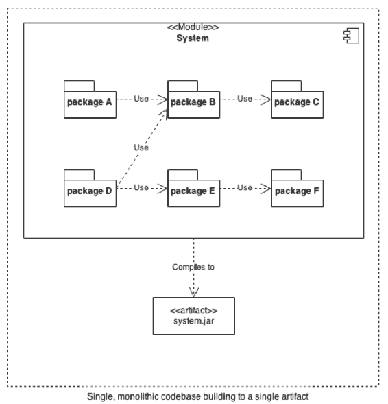
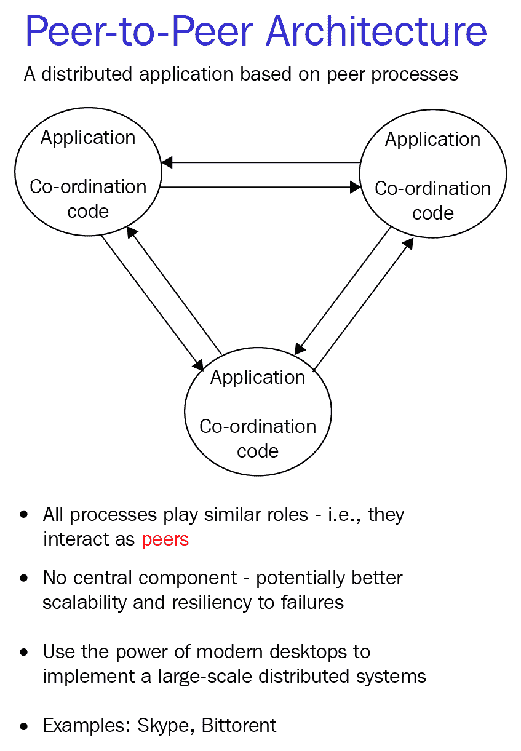

# 分散化与分布式系统

区块链领域最大的误解之一在于分布式系统与去中心化系统之间的区别。在本章中，我们将讨论这两种类型的系统，它们为什么重要，它们的相似之处，它们的不同之处，以及区块链技术如何适用于这两个类别。

通过本章结束时，你应该能够做到以下事情：

+   定义分布式系统

+   定义去中心化系统

+   了解分布式系统的优缺点

+   了解去中心化系统的优缺点

# 分布式系统

**分布式系统**是指应用程序及其架构分布在大量机器和最好是物理位置之间。更简单地说，分布式系统是指系统的目标分布在不同位置的多个子系统之间。这意味着多台计算机在多个位置上必须协调以实现整个系统或应用程序的目标。这与单片应用程序不同，单片应用程序将所有内容捆绑在一起。

让我们以一个简单的 Web 应用程序为例。基本的 Web 应用程序会在单个 Web 服务器上运行处理、存储和其他所有内容。代码往往以单体形式运行——所有内容都捆绑在一起。当用户连接到 Web 应用程序时，它会接受 HTTP 请求，使用代码处理请求，访问数据库，然后返回结果。

优点是这样很容易定义和设计。缺点是这样的系统只能扩展到一定程度。要添加更多用户，必须增加处理能力。随着负载的增加，系统所有者不能只是添加额外的机器，因为代码没有设计成可以同时在多台机器上运行。相反，所有者必须购买更强大、更昂贵的计算机来跟上。如果用户来自全球各地，还有另一个问题——一些接近服务器的用户将获得快速响应，而距离更远的用户将会有一些延迟。下图说明了单一的、单片代码构建到单一构件的情况：

如果运行此应用程序的计算机出现故障、停电或被黑客入侵会发生什么？答案是整个系统会完全崩溃。出于这些原因，企业和应用程序变得越来越分布式。分布式系统通常分为客户端-服务器、三层、多层或点对点几种基本架构。区块链系统通常是点对点的，因此我们将在这里讨论这一点。

分布式系统的优点有很多，如下所示：

+   **弹性**：如果系统的某个部分出现故障，整个系统不会失败

+   **冗余性**：系统的每个部分都可以构建备份，以便在出现故障时可以使用另一个副本，有时可以立即使用

+   **并行性**：工作可以有效地分割，这样就可以使用许多廉价的计算机而不是一个昂贵的快速计算机

# 弹性

弹性是系统适应和持续工作以应对变化和挑战的能力。弹性只能讨论在系统具有弹性的事件类型的情况下。系统可能对关闭一些计算机具有弹性，但对核战争可能没有弹性。

弹性可以分解为不同的子类别：

+   **容错**：系统处理无效状态、错误数据和其他问题的能力

+   **故障隔离**：系统的一部分出现问题不会影响到系统的其他部分。某处出现的错误数据或系统故障不会导致其他地方出现问题

+   **可伸缩性**：在高负荷下能够提供额外容量的可伸缩系统对负载具有弹性

+   **复杂性管理**：一种有办法管理复杂性的系统有助于使其对人为错误有弹性

现在我们将更详细地讨论容错。

# 容错能力和故障隔离

当某些部分出现故障或失灵时，系统仍能够运行的系统被认为是具有容错能力的。通常，容错是个依赖程度的问题：子组件的故障水平要么被系统的其他部分抵消，要么是逐渐退化而不是绝对的关闭。故障可能发生在许多不同的层次：软件、硬件或网络。具有容错能力的软件需要在这些层次的任何部分出现部分中断时继续运行。

在区块链中，个别硬件层面的容错是通过每个功能的存在多个重复计算机来处理的-比特币或工作证明系统中的矿工或 PoS 和相关系统中的验证者。如果计算机出现硬件故障，那么它要么不会有效地签署与网络一致的交易，要么它将停止充当网络节点——其他计算机会接管。

# 一致性和协调

区块链的最重要的方面之一就是共识的概念。我们将在第七章中讨论区块链实现共识的不同方法，*实现共识*。暂时来说，理解大多数区块链网络都有协议，允许它们只要网络上的计算机有三分之二到略高于一半正常运行，就能正常工作就足够了，虽然每个区块链网络都有不同的方法来保证这一点，这将在未来的章节中介绍。

# 备份

在大多数区块链中，每台计算机作为网络中的全参与者，保存了自网络启动以来发生的所有交易的完整副本。这意味着，即使在灾难压力下，只要网络中的一小部分计算机保持正常运行，就会存在一个完整的备份。

在 PoS 链中，通常会有更少的全参与者，因此备份和分布的数量要少得多。到目前为止，这种减少的冗余级别还没有成为问题。

# 一致性

正如之前的章节中所讨论的，区块链上的哈希和所有交易和行为的 Merkle 根允许轻松计算一致性。如果区块链上的一致性被打破，将会立即被注意到。区块链被设计为永远不会不一致。但只因数据一致，并不意味着它正确。这些问题将在第二十一章《可扩展性和其他挑战》中讨论。

# 对等系统

今天大多数使用的计算机系统都是客户端-服务器。一个很好的例子是你的网络浏览器和典型的 web 应用程序。你打开 Google Chrome 或其他浏览器，访问一个网站，你的计算机（客户端）连接到服务器。系统上所有的通信都是在你和服务器之间进行的。任何其他连接（比如在 Facebook 上与朋友聊天）都是由你的客户端连接到服务器，然后服务器再连接到另一个客户端，服务器起到中间人的作用。

对等系统是关于剔除服务器的。在对等系统中，你的计算机和你朋友的计算机会直接连接，中间没有服务器。

以下是说明对等架构的示意图：

# 分散式系统

所有分散系统都必须是分布式的。但分布式系统不一定是分散的。这对很多人来说是困惑的。如果一个分布式系统是分布在许多计算机、位置等等之间，那么它怎么可能是集中的呢？

这种差异涉及到位置和冗余与控制。在这种情况下，集中化涉及到控制。一个很好的例子来展示分布式和分散式系统的区别是 Facebook。Facebook 是一个高度分布式的应用程序。它在全球范围内拥有服务器，运行着数千种的软件变体进行测试。它的任何数据中心都可能出现故障，但大部分网站功能仍将继续运行。它的系统是分布式的，具有容错性、广泛协调、冗余等等。

然而，这些服务仍然是集中化的，因为在没有其他利益相关者的参与的情况下，Facebook 可以改变规则。数百万小型企业使用并依赖 Facebook 进行广告。迁移到 Facebook 的群体可能会突然发现他们的旧信息、工作和连接能力被撤销，而且没有追索权。Facebook 已经成为其他人依赖但没有相互依赖协议的平台。对于所有依赖 Facebook 平台的群体、企业和组织来说，这是一个可怕的情况，部分或全部地依赖 Facebook 平台。

过去十年间，出现了大量高度分布但高度集中的平台公司——Facebook、Alphabet、AirBnB、Uber 等，它们为同行之间提供了一个市场，但几乎完全不受其用户的约束。由于这种情况，人们越来越希望去中心化的应用和服务。在去中心化系统中，没有中央压倒性的利益相关者有能力在没有其他网络用户许可的情况下制定和执行规则。

# 原则上的去中心化系统

像分布式系统一样，去中心化更多地是一个滑动的比例，而不是绝对的状态。要评判一个系统的去中心化程度，有许多因素需要考虑。我们将要考虑对区块链和去中心化应用和组织特别相关的因素。它们如下：

+   开放式访问

+   非层次化

+   多样性

+   运作透明

# 开放式访问

按定义，任何实际上或逻辑上封闭的系统都至少在某种程度上是集中化的。一个封闭的系统自动地集中在先前的行为者身上。正如去中心化系统的所有其他方面一样，这不是二进制的是/否，而更像是可能性的滑动比例。

早期的互联网被认为是革命性的一部分，部分原因是由于它的开放式访问性质和任何人（只要有电脑、时间和接入）都可以上网并开始交换信息的能力。同样，迄今为止，区块链技术一直保持着开放式的创新和访问。

# 非层次化

层次结构系统通常在公司和组织中普遍存在。在层次结构的顶端的人拥有压倒性的权力来指导资源和事件。层次结构有不同的极端。在一个极端，你可能有一个仲裁者拥有绝对权力的系统。在另一个极端，你可能有一个每个系统成员都拥有相同直接权力的系统，因此控制是通过影响力、声誉或某种其他形式的组织货币来实现的。

在区块链领域，出现了几种非层次结构的形式。首先是在工作量证明挖矿系统中。所有矿工在区块链中基本上是平等的参与者，但他们的影响力与他们向网络提供的计算资源成比例。

在 PoS 区块链系统中，权力是基于特定协议的投资/股份水平分布的。在这种情况下，去中心化是通过大规模采用以及与其他链的竞争实现的。如果一个链变得过于集中化，没有什么可以阻止用户迁移到另一个链。

这些系统随着时间的推移将保持多么去中心化是一个开放的问题。

# 生态系统多样性

开放访问自然而然地导致去中心化系统的另一个特性：多样性。多样性系统与单一文化相对立。在技术上，单一文化是单一系统的压倒性优势，比如在美国企业界长期存在的 Windows 的主导地位。

# 透明度

在一个系统中，权力集中的一种方式是通过信息主导，即一个系统中的某一组参与者拥有比其他参与者更多或更大的信息访问权。在大多数当前的区块链技术中，链上的每个参与者获得相同数量的信息。也有一些例外。比如，Hyperledger Fabric 有能力让参与者隐藏信息。

具有完全强制性透明度的能力是人们对区块链系统感兴趣的驱动因素之一。通过创建透明且不可忘记的记录，区块链在物流和法律记录方面具有明显的实用性。在区块链上的记录，可以确保数据未被更改。透明的区块链还确保了公平性水平——参与者都可以确信，至少有一个共享的真相水平供所有人使用，而这种水平不会改变。

# 弊端

去中心化系统并非没有其缺点。以下是与区块链相关的去中心化系统的一些关键问题：

+   速度

+   抗审查性

+   混乱/非确定性

# 速度

集中化系统和去中心化系统在处理某些类型事件时往往会更快或更慢。区块链是分布式的记账系统。理解基本区块链，比如比特币，可以认为它是一个仅能追加的数据库。比特币每秒可以处理大约七笔交易。相比之下，Visa 和 MasterCard 是分布式（但不是去中心化）的交易处理系统，每秒可以处理超过 40,000 笔交易。区块链系统的速度继续增加，但通常以一定程度的中心化或对访问的限制作为交换。一些 PoS 系统，如 Tendermint 或 Waves，理论吞吐量超过 1,000 tx/秒，但仍远远低于其传统对应系统的峰值容量。

# 抗审查性

去中心化系统由于缺乏中央权威机构进行审查而往往更难以审查。对于言论自由和信息自由的纯粹主义者来说，这一点根本不被视为缺点。然而，一些信息（儿童色情、仇恨言论、制造炸弹的指令）被视为危险或不道德的公开传播，因此应该被审查。作为一种技术，一旦包含该信息的区块完成，写入区块链的任何内容都是不可变的。例如，Steemit 是一个基于区块链的社交博客平台，每篇帖子都保存在链上。一旦每个区块被最终确定，数据就无法删除。系统的客户端可以选择不显示信息，但信息仍然存在，供想要查看的人使用。

对审查的渴望延伸到自我审查。写入区块链的内容是不可变的，即使对于其作者也是如此。例如，通过比特币进行的金融交易永远无法向当局隐藏。虽然比特币是匿名的，但一旦一个人与比特币钱包相关联，就可以轻松追踪自区块链开始以来的每一笔交易。

因此，基于区块链的国家货币将允许完美的税收——由于对链的完美财务监控。因此，抗审查性质具有双重性。

# 混沌和非确定性

去中心化系统往往比集中式系统更加混乱，这是它们的天性。在去中心化系统中，每个参与者都按照自己的意愿行事，而不是按照一个全面性权威的要求。因此，去中心化系统很难预测。

# 总结

在本章中，我们讨论了分布式系统与去中心化系统之间的区别，并介绍了一些关键特性。您现在应该了解到每个去中心化系统也是一个分布式系统，以及每个概念的一些关键方面。

在下一章中，我们将开始研究这些东西在实践中的运作。
