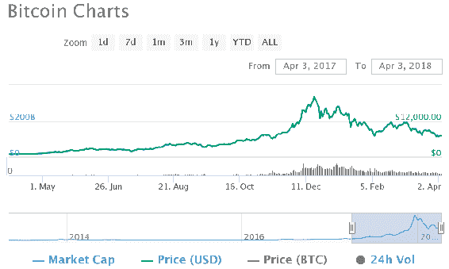
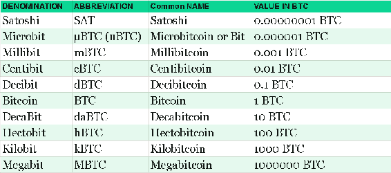
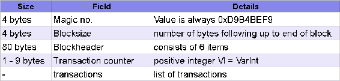
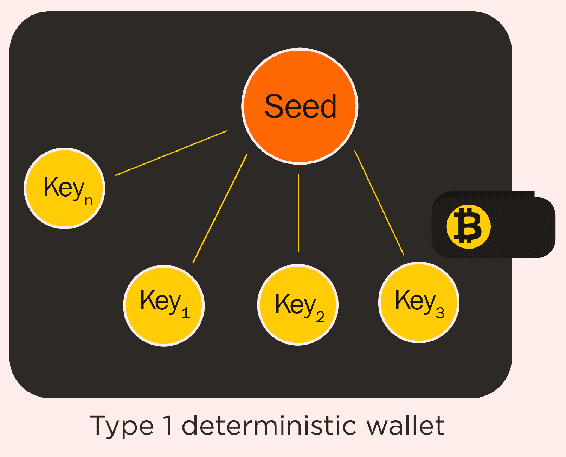
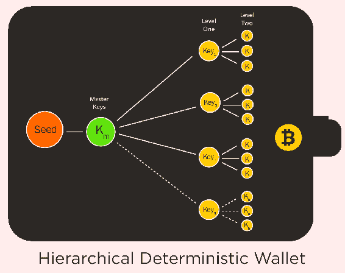

# 第五章：比特币

在早期章节中，我们详细讨论了区块链、其组成部分以及其结构。我们还讨论了加密学，区块链背后的机制，以及区块链如何改变网络世界。在本章中，我们将讨论比特币的起源。

我们将讨论比特币的介绍，它的历史以及它是如何在很短时间内成为金融历史上最大的革命之一。我们还将深入探讨比特币的其他方面，如其编码系统，交易过程，网络节点，以及我们将简要介绍比特币的挖矿过程。

本章我们将涵盖的主题包括以下内容：

+   比特币的历史

+   为什么比特币如此波动

+   密钥和地址

+   交易

+   区块

+   比特币网络

+   钱包

# 比特币的历史

比特币是区块链技术的第一个也是迄今为止最成功的应用程序。比特币是在 2008 年推出的，由中本聪编写的一篇名为《比特币：一个点对点的电子现金系统》的论文中首次提出的。（[`bitcoin.org/bitcoin.pdf`](https://bitcoin.org/bitcoin.pdf)）。

比特币是世界上第一个去中心化的加密货币；它的推出预示着一场革命，仅用了约十年的时间，它就证明了自己的实力，拥有庞大的社区支持和广泛的采用。

自 2010 年起，一些全球企业已开始接受比特币，除了法定货币之外。许多货币交易所成立，让人们可以用法定货币或其他加密货币兑换比特币。 2012 年 9 月，比特币基金会成立，以加速比特币的全球增长，通过标准化、保护和推广开源协议。

许多支付网关（如 BitPay）开始帮助商家接受比特币作为支付方式。流行服务 WordPress 于 2012 年 11 月开始接受比特币。

比特币一直以来作为全球支付中的首选支付方式不断增长，尤其是企业对企业的供应链支付。 2017 年，比特币在金融公司和政府组织中获得了更多合法性。例如，俄罗斯合法化了包括比特币在内的加密货币的使用；挪威最大的银行宣布启动了比特币账户；日本通过了一项法律，允许比特币作为合法支付方式。 全球最大的自由经济区迪拜已开始向公司颁发交易加密货币的许可证。

2017 年 8 月 1 日，比特币分裂为两种衍生数字货币；一种保留了传统的名称比特币，另一种有着 8MB 区块大小的被称为**比特币现金（BCH）**。之后，在 2017 年 10 月 24 日，又发生了另一次硬分叉，产生了一种名为**比特币黄金（BTG）**的新货币。然后，在 2018 年 2 月 28 日，又发生了另一次硬分叉，产生了一种名为**比特币私人（BTCP）**的新货币。原本还有一个硬分叉预计在 2017 年 11 月发生，但由于缺乏社区共识而取消了。

然而，比特币的推广者对价格波动和由于需要大量确认才能批准交易而导致交易放缓有一个主要关切。

# 为何比特币会波动

当我们说比特币是**波动性**时，指的是比特币的价格波动。各个交易所的比特币现货价格每时每刻都在变动，并且运行 24/7。因此，任何比特币的用户或社区成员都会受到比特币价格的不断变化而困扰。以下图表显示了过去一个财政年度比特币价格的波动情况：



比特币的波动性是最被讨论的话题，自比特币交易所出现以来，一直是投资者、矿工和比特币支持者关注的问题。造成这一现象的一些主要原因如下：

+   **安全漏洞**：一直以来，比特币价格波动的主要问题之一就是安全漏洞；每当交易所端存在安全漏洞的消息传出时，比特币价格就会受到冲击，因为这会让投资者开始对某个交易所或比特币网络产生怀疑。

+   **法律问题**：全球立法者对比特币价格提出了许多疑虑，甚至试图将比特币定性为非法实体。政府的各种声明也影响了比特币的价格。

+   **心理上的适应变化**：尽管比特币得到了迅速的采用和支持，但它依然是一种新型的货币，与之前的任何货币都非常不同；这就让人们对采用它感到谨慎。而且任何负面新闻直接影响了比特币的采用情况，有时会导致价格出现下行螺旋，直到出现关于比特币的正面新闻。

上述要点只是造成比特币市场巨大波动的一些主要因素。还有许多其他因素在不同时期对比特币价格的形成起到至关重要的作用。

# 密钥和地址

比特币作为一种纯数字货币，可以通过在文件或**比特币钱包**中保留或存储来拥有。地址用于将比特币从一个钱包转移到另一个钱包，而密钥用于保障交易的安全性。

比特币中的密钥是成对使用的。一个是公钥，另一个是私钥。私钥需安全保管，因为它控制着一个钱包。这些密钥由比特币钱包存储和控制。

地址是用于从一个钱包发送或接收比特币的字母数字字符串。地址大多以**Base58Check**的形式编码，使用 Base58 数字进行地址转录。比特币地址也编码为 QR 码，用于快速交易和共享。

# 货币单位

比特币有一个广泛使用的度量单位系统，可用作比特币的单位。比特币的最小单位称为**Satoshi**，以其创造者的名字命名。以下表显示了比特币的单位，从其最小单位**Satoshi**到**兆比特**：



# 虚荣地址

这些是包含可读地址的有效地址。例如：`1BingoAuXyuSSoYm6rH7XFZc6Hcy98zRZz` 是包含可读单词（Bingo）的有效地址。生成虚荣地址需要创建和测试数百万个私钥，直到找到所需的 Base58 字母地址。

虚荣地址用于娱乐，并提供与任何其他地址相同级别的安全性。虚荣地址的搜索时间随所需模式的长度增加而增加。

# 基于 58 的检查编码

这种编码将二进制字节数组转换成人类可读的格式。该字符串是通过使用一组 58 个字母数字字符创建的。

与 Base58 不同，也可以使用 Base64，但那可能会导致一些字符看起来相同，从而导致相似的数据。比特币中使用的 Base58 符号表是比特币特定的，仅在比特币创建时使用。以下表显示了 Base58 编码中的值和相应的字符：

| **数值** | **字符** | **数值** | **字符** | **数值** | **字符** | **数值** | **字符** |
| --- | --- | --- | --- | --- | --- | --- | --- |
| 0 | 1 | 1 | 2 | 2 | 3 | 3 | 4 |
| 4 | 5 | 5 | 6 | 6 | 7 | 7 | 8 |
| 8 | 9 | 9 | A | 10 | B | 11 | C |
| 12 | D | 13 | E | 14 | F | 15 | G |
| 16 | H | 17 | J | 18 | K | 19 | L |
| 20 | M | 21 | N | 22 | P | 23 | Q |
| 24 | R | 25 | S | 26 | T | 27 | U |
| 28 | V | 29 | W | 30 | X | 31 | Y |
| 32 | Z | 33 | a | 34 | b | 35 | c |
| 36 | d | 37 | e | 38 | f | 39 | g |
| 40 | h | 41 | i | 42 | j | 43 | k |
| 44 | m | 45 | n | 46 | o | 47 | p |
| 48 | q | 49 | r | 50 | s | 51 | t |
| 52 | u | 53 | v | 54 | w | 55 | x |
| 56 | y | 57 | z | - | - | - | - |

# 交易

这是比特币系统的主要部分。交易不加密，因为比特币是一个公开分类账。任何交易都可以在区块链上公开查看，使用任何在线区块链浏览器。由于地址是加密的并鼓励对每笔交易使用唯一的地址，跟踪用户变得困难。

比特币中的区块由区块链浏览器查看的交易组成；每个区块都包含最近发生的交易。每个新区块都位于区块链的顶部。每个区块都有一个高度编号，下一个区块的高度比前一个区块高度大一。共识过程通常称为区块链浏览器上的**确认**。

# 类型

有各种类型的脚本可用于管理从一个钱包向另一个钱包的价值转移。这里讨论了一些标准类型的交易，以清楚地理解地址以及交易之间的区别。

# 支付至公钥哈希

大多数比特币网络上的交易都是使用这种方法进行的。脚本如下所示：

```
OP_DUP OP_HASH160 [Pubkey Hash] OP_EQUALVERIFY OP_CHECKSIG
```

签名脚本如下所示：

```
[Sig][PubKey]
```

这些字符串被连接在一起以执行。

# 支付至脚本哈希

**支付至脚本哈希**（**P2SH**）过程用于向脚本哈希发送交易。使用脚本哈希支付的地址必须以 3 开头。脚本如下所示：

```
OP_HASH160 [redeemScriptHash] OP_EQUAL
```

签名看起来像这样：

```
[Sig]...[Sig][redeemScript]
```

与 P2PKH 一样，这些字符串也被连接在一起以创建脚本签名。

# 区块

交易数据记录在文件中，这些文件称为**区块**。区块叠放在彼此之上，最近的区块位于顶部。以下表格描述了区块的结构和区块中各元素的大小：



比特币网络中的每个区块几乎具有相同的结构，并且每个区块都链接到最新的区块。这些是区块的字段：

+   **幻数**：此数字是区块链网络的标识符。其值始终为**0xD9B4BEF9**。它确认区块的开始并验证数据来自生产网络。

+   **区块大小**：这表示区块的大小。

+   **区块头**：头部包含区块的元数据。它包括多个数据项，如比特币版本、上一个区块哈希、默克尔根、时间戳、挖矿难度和随机数。

+   **交易计数器**：它是区块中交易的计数。

+   **交易列表**：它存储该区块中交易的哈希。

# 创世区块

**创世块**是比特币区块链中的第一个块。 创世块的创建标志着比特币的开始。 它是区块链中所有块的共同祖先。 它在比特币客户端软件中静态编码，无法更改。 比特币区块链中的每个节点都确认创世块的哈希和结构，其创建时间以及其中包含的单个交易。 以下是比特币源代码中编写的静态代码片段，描述了使用静态参数`pszTimestamp`、`genesisOutputScript`、`nTime`、`nNonce`、`nBits`和`nVersion`创建创世块的过程。 这是比特币存储库中此代码的片段：

```
static CBlock CreateGenesisBlock(uint32_t nTime, uint32_t nNonce, uint32_t nBits, int32_t nVersion, const CAmount& genesisReward)
 {
 const char* pszTimestamp = "The Times 03/Jan/2009 Chancellor on brink of second bailout for banks";
 const CScript genesisOutputScript = CScript() << ParseHex("04678afdb0fe5548271967f1a67130b7105cd6a828e03909a67962e0ea1f61deb649f6bc3f4cef38c4f35504e51ec112de5c384df7ba0b8d578a4c702b6bf11d5f") << OP_CHECKSIG;
 return CreateGenesisBlock(pszTimestamp, genesisOutputScript, nTime, nNonce, nBits, nVersion, genesisReward);
 }
```

# 比特币网络

网络基于**点对点**（**P2P**）协议。 各种节点在此网络中交换交易和区块。 比特币网络中的每个节点都被视为平等的。 这样做的一个优点是，每个节点都有选择在比特币网络中扮演不同角色的选项，具体取决于每个人对如何参与比特币网络的偏好。

# 节点类型

在讨论节点类型之前，让我们讨论一些节点执行的主要功能：

+   钱包

+   挖掘

+   完整的区块链

+   路由

在比特币网络中，主要有两种类型的节点。 我们现在将简要介绍每种节点的一些详细信息。

# 完整节点

完整节点由钱包、矿工、完整的区块链和路由网络组成。 这些节点维护区块链的完整最新记录。 完整节点验证区块链网络上的每笔交易。

# 轻量级节点

轻量级节点在区块链上执行交易。 它们不包含整个区块链，而只是区块链的一个子集。 它们使用称为**简化支付验证**（**SPV**）的系统来验证交易。 这些节点有时也被称为**SPV 节点**。

# 其他节点

比特币网络中还有各种其他节点，每个节点执行比特币网络提供的一组特定功能中的特定功能集。 有些节点只包含区块链和路由功能。 有些节点仅作为矿工工作，不包含钱包。

还有其他非标准节点称为**池协议服务器**。 这些节点使用诸如**stratum 协议**之类的替代协议。 stratum 协议使用 TCP 套接字和 JSON-RPC 在节点之间进行通信。

# 网络发现

比特币中的**网络发现**在任何节点第一次启动时都是必需的； 节点必须发现网络中的其他节点才能参与区块链。 在节点启动时，它必须与网络中至少一个现有节点连接。

为此，节点通过 TCP 协议建立连接，在端口`8333`上进行或如果有其他端口，则在其他端口上进行。接下来，通过传输某个消息来执行握手。该消息称为 **版本消息**，其中包含基本的识别信息。

# 查找节点

**节点**主要通过两种方法在网络中找到。一种是通过查询 DNS 使用 **DNS 种子**，这基本上是提供比特币节点 IP 列表的 DNS 服务器。另一种方法是比特币核心尝试连接到的 IP 地址列表。另一种早期使用的方法是通过 IRC 向节点播种，但由于安全问题而停止使用该方法。

# DNS 种子

DNS 种子是包含 IP 地址列表的服务器。这些种子是 **Berkeley Internet Name Daemon**（**BIND**）的定制实现，并返回由比特币节点收集的随机子集。大多数比特币客户端在尝试建立第一组连接时使用 DNS 种子进行连接。最好有各种种子存在，以便客户端与网络中的节点建立更好的连接。在比特币核心客户端中，使用 DNS 种子的选项由 `-dnsseed` 参数控制，默认设置为 `1`。以下是比特币源代码的`chainparams.cpp`文件中表示 DNS 种子的方式：

```
 vSeeds.push_back(CDNSSeedData("bitcoin.sipa.be", "seed.bitcoin.sipa.be")); // Pieter Wuille
 vSeeds.push_back(CDNSSeedData("bluematt.me", "dnsseed.bluematt.me")); // Matt Corallo
 vSeeds.push_back(CDNSSeedData("dashjr.org", "dnsseed.bitcoin.dashjr.org")); // Luke Dashjr
 vSeeds.push_back(CDNSSeedData("bitcoinstats.com", "seed.bitcoinstats.com")); // Christian Decker
 vSeeds.push_back(CDNSSeedData("xf2.org", "bitseed.xf2.org")); // Jeff Garzik
 vSeeds.push_back(CDNSSeedData("bitcoin.jonasschnelli.ch", "seed.bitcoin.jonasschnelli.ch")); // Jonas Schnelli
```

上述种子目前正在比特币核心中使用，用于连接到种子客户端，以建立与第一个节点的连接。

# 静态 IP

这些是静态的 IP 地址列表。如果比特币客户端能够成功连接到一个 IP 地址，它将能够通过共享该节点的 IP 地址连接到其他节点。命令行参数`-seednode`用于连接到一个节点。连接到种子节点后，客户端将使用该种子自身发现新的种子。

# 钱包

**比特币钱包**是比特币节点的一个重要功能；它们包含私钥和/或公钥以及比特币地址。有各种类型的比特币钱包，每种都提供不同级别的安全性和功能，根据需要。

有一个常见的误解，即电子钱包可以包含比特币，但比特币钱包只能包含密钥。每个比特币都记录在比特币网络的区块链上。比特币钱包包含密钥，这些密钥授权使用与密钥相关联的比特币。用户或钱包所有者使用钱包中的密钥签署交易，证明他们拥有比特币。实际上，这些比特币以`**txout**`的形式存储在区块链上，表示为 **交易输出**。

# 类型

主要有两种类型的钱包，这取决于钱包中包含的密钥是否相互关联。

# 确定性钱包

这是一种钱包类型，其中所有的密钥都是从一个称为**种子**的单个主密钥派生出来的。这种钱包中的所有密钥都彼此关联，并且可以借助种子轻松地再次生成。在某些情况下，种子允许在不知道私钥的情况下创建公钥地址。大多数情况下，种子被序列化为人类可读的单词，称为助记词短语。

在确定性钱包中使用了多种密钥派生方法，这些方法在以下小节中描述。

# 确定性钱包

确定性钱包保存从共同种子派生的私钥。为此使用了单向哈希函数。在确定性钱包中，此种子是恢复所有派生密钥所必需的，因此在创建时进行一次备份就足够了。以下图表显示了一个单一种子如何与钱包生成的所有密钥连接/相关：  



# HD 钱包

HD 钱包是确定性钱包的最先进形式之一。它们包含从树结构派生的密钥，因此主密钥可以具有多个一级密钥，进一步可以包含多个深度无限的二级密钥。以下图表显示了种子如何生成主密钥，进而以分层形式创建多个密钥：



# 非确定性钱包

在这种类型的钱包中，每个密钥都是从一个随机数独立生成的。在这个钱包中生成的密钥之间没有关联。由于难以维护多个不相关的密钥，因此非常重要定期备份这些密钥并保护它们以防止被盗或丢失。

# 摘要

在这一章中，我们讨论了比特币的基础知识，其历史以及与法定货币相比的定价。我们还讨论了比特币地址、它们的编码、它们的交易类型和区块。最后，我们讨论了比特币网络以及网络包含的节点类型。

现在我们已经在本章中讨论了世界上第一个加密货币，下一章中，我们将讨论受比特币启发的各种其他加密货币，也被称为**替代货币**。*我们将讨论替代货币，有时也称为**替代币**。
