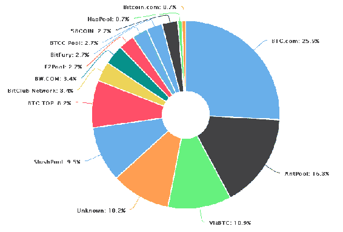
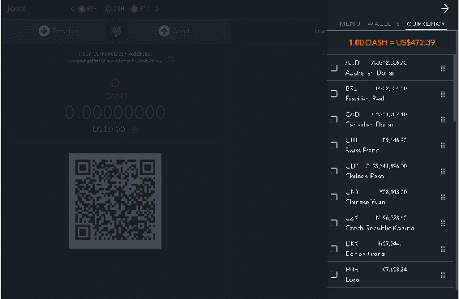

# 山寨币

在比特币发布后，一直有着庞大的支持加密货币的社区。而且，由于比特币和区块链是开源的，社区内的许多人开始创建自己的加密货币，提供类似的服务，但提供不同的共识方法等，与比特币相比。

由于比特币是第一个且迄今为止最主导的加密货币，所有其他加密货币被称为**另类币**或**山寨币**。第一个山寨币是**Namecoin**，于2011年推出。之后，许多山寨币被推出；其中一些很受欢迎，也开始被用作主流货币，而其他一些则不那么受欢迎。截至目前，已经存在超过1500种加密货币。另类加密货币领域有两个广泛的类别。如果要创建一种另类区块链平台，则通常称为**另类链**，但如果硬币的目的是引入一种新货币，则可以称为**山寨币**。

许多山寨币直接从比特币源代码中分叉，甚至有些是从零开始编写的。山寨币旨在解决比特币的一些限制，例如共识方法、挖矿限制、区块时间、分配、隐私，或者有时甚至在硬币上添加功能。

本章将涉及的主题如下：

+   介绍山寨币

+   讨论代币和各种代币平台

+   另类货币和广泛使用的另类货币简介

+   如何获取加密货币

# 介绍山寨币

现有超过1600种流通中的加密货币；它们每一种都提供比特币的改进或修改。有各种在线交易所可以在其中交换加密货币或与法定货币（如美元、欧元、英镑等）交换，类似于货币交易或股票交易门户。以下是一些热门山寨币的列表：

+   莱特币

+   以太坊

+   零币

+   达世币

+   瑞波币

+   门罗币

+   EOS

+   IOTA

+   波场

+   泰达币

+   以太坊经典

+   比特币现金

+   星际币

+   尼欧币

+   新经币

+   卡尔达诺

根据其区块链，山寨币有两个广泛的类别，因为区块链定义了硬币的特性、安全性和其他方面。

确定市场上有这么多加密货币以及货币交易所意味着，现在需要大量的关键财务和市场指标来区分这些货币。以下是讨论山寨币时需要考虑的一些关键因素：

+   硬币的总市值

+   用法币购买时的硬币单价

+   流通中的山寨币总数

+   每小时和24小时周期内交易的硬币数量

+   硬币单位价格在小时、日和周基础上的变化

+   接受山寨币的交易所和商家

+   支持硬币的总钱包数

+   任何可能影响硬币价格或声誉的最新消息

Altcoin可以有自己的区块链，也可以建立在另一个区块链之上，通常称为**代币**。

# 代币

建立在另一个区块链之上的Altcoins称为代币。代币不能独立存在，它们建立在的平台上。以下是可以创建代币的一些平台列表：

+   以太坊

+   Omni

+   NEO

+   Omni

+   Qtum

+   Counterparty

+   Waves

+   Stellar

+   Bitshares

+   Ubiq

+   Ardor

+   NXT

# 以太坊

**以太坊**是创建代币的最常用选择；基于以太坊平台的代币超过600种。作为公开和开源的，使得任何人都可以基于以太坊区块链创建代币；此外，由于得到庞大社区的支持，这使得任何基于加密货币的交易所更容易接受这些代币。

在以太坊平台上构建的一些热门代币包括EOS、TRON、VeChain等。

# Omni Layer

作为2013年的MasterCoin，**Omni Layer协议**是基于比特币区块链的最流行的元协议之一。Omni Layer提供了一个类似比特币客户端的不同钱包和一个类似比特币核心的Omni Layer。

在Omni Layer平台上构建的一些热门代币包括Tether、MaidSafeCoin、Synereo等。

# NEO

**NEO**最初是Antshares；它是由Onchain公司建立的，这是一家位于中国的公司。它于2014年初开始提供服务于银行和金融领域。Antshares于2017年6月更名为NEO。

在NEO平台上构建的一些热门代币包括Ontology、Gas、DeepBrain Chain等。

# Waves

常被描述为开放区块链平台的**waves**是一个平台，不仅可以交换加密货币，还可以交换所有类型的现实世界商品，完全去中心化地发行和转让。

Waves平台上构建的一些代币包括Wager、Mercury、Incent等。

# Counterparty

**Counterparty**是另一层协议，实现在比特币协议层之上，就像Omni Layer一样，在2014年发布，它声称除了比特币之外还提供了各种功能，这使它成为一个有价值的代币创建平台。

Counterparty上构建的一些代币包括Triggers、Pepe Cash、Data bits等。

# 替代货币

除了在现有区块链上构建的代币之外，还有各种由拥有自己的区块链和/或任何其他改进或差异化因素推动的替代货币。

以下是Altcoins相对于比特币所做的一些修改的一些因素：

+   货币替代品

+   共识替代品

我们将详细讨论这些替代方案，然后再讨论一些广泛使用的Altcoins及其相对于比特币的修改。 

# 货币替代品

比特币限制在 2100 万枚，其发行速度逐渐下降，包括 10 分钟的区块生成时间，需要很长时间来确认；在进一步的币生成过程中也需要很长时间。很多山寨币修改了一些主要参数以获得升级的结果。一些修改货币参数的主要币种有莱特币、狗狗币、以太坊、NEO 等等。

# 共识替代方案

共识机制是比特币交易的根源；比特币中使用的机制基于工作证明，使用 SHA256 算法。由于共识机制需要挖掘块，这变得非常计算密集，导致了专门用于解决比特币块的比特币挖矿硬件的创建，这就是指定的 **Application-Specific Integrated Circuit Chips**（**ASICs**）。

这导致了具有创新算法的山寨币的创建，例如以下这些：

+   **Scrypt**：这被广泛用于莱特币、狗狗币等等

+   **Scrypt - N**：这被用于 vertcoin、Execoin 等等

+   **Skein**：这被用于 DigiByte、Myraid 等等

+   **Groestl**：这被用于 Groestlcoin、securecoin 等等

+   **SHA3**：这被用于 Maxcoin、Slothcoin 等等

+   **X1****1**：这被用于 Dash、CannabisCoin 等等

+   **Blake**：这被用于 Netko、Trumpcoin 等等

+   **X13**：这被用于 Navcoin、Cloakcoin 等等

+   **CryptoNight**：这被用于门罗币、Bytecoin 等等

+   **QuBit**：这是 Geocoin、DGB-Qubit 等等

+   **Dagger Hashimoto**：这被用于以太坊、以太经典等等

+   **Lyra2RE**：这被用于 Verge、Zcoin 等等

+   **X15**：这是 EverGreenCoin、Kobocoin 等等

除了创新算法外，还有很多创新的共识类型，通常被称为证明类型，例如以下这些：

+   **Proof of Work**（**PoW**）：这是最常用的证明类型；在这种证明类型中，网络节点需要进行计算来通过挖矿形成分类帐。

+   **Proof of Stake**（**PoS**）：这最初在 Peercoin 中使用。通过股份证明，节点不挖矿，而是持有硬币并验证所有权。通过使用算法搜索与股份大小结合的最低哈希值来预测新的块创建者。节点可以预测哪个股份将创建下一个块。在这种类型的系统中不需要挖矿。

+   **Proof of Stake Anonymous**（**PoSA**）：这是 POS 算法的一种变体，最初在 Cloakcoin 中引入；通过股份证明，交易被其他节点隐藏，这些节点因帮助过程而获得奖励。节点为交易提供输入和输出，使得无法确定指定交易的目标或来源。

+   **授权权益证明** (**D****PoS**)：通过授权权益证明，用户充当代表，有权利从运行区块链的完整节点中赚取收益。比特股引入了这种证明类型；一些更多使用它的硬币包括 Steem、EOS、Lisk 等。

+   **重要性证明** (**POI**)：通过重要性证明，区块链上的每个账户都被赋予一个重要性评分；这个评分会影响每个节点如何收获区块链。区块链上的收获者的任务是为了一个小经济刺激而在区块链上添加交易。随着重要性评分的增加，获取奖励的机会也会增加。

+   **容量证明或空间证明** (**PoSpace**)：在这种类型的证明中，不使用区块链，而是使用存储。由于存储的通用性和存储所需的更便宜的能源成本，这种类型被认为是一种经济且更环保的选择。一些 PoC 的理论和实际实现包括 Burstcoin、SpaceMint 等。

+   **权益时间证明** (**PoST**)：在这种方法中，通过引入一个权益时间组件形成共识，其中权益随着时间增加。这提供了一个激励权益过程，并增加了网络的安全性。这种证明类型的目标是避免常见的权益证明方法，其中拥有更多硬币的节点会获得更多经济奖励。

+   **权益速度证明** (**PoSV**)：在这种方法中，奖励是基于节点拥有的硬币数量和节点上交易活动的活跃程度来分配的。

+   **活动证明** (**POA**)：在这种证明类型中，采用了一种混合方法，将工作证明与基于股权的系统相结合。在这个系统中，挖矿就像在 PoW 系统中一样发生。虽然挖出的块不包含任何交易，只有头部和挖矿者的奖励地址。然后，系统切换到 PoS，在这里随机选择一组验证者；只要所有验证者签署了区块，该区块就会立即成为一个完整的区块。

+   **燃烧证明** (**PoB**)：在这种证明中，我们必须证明在向一个不可依赖的地址发送交易的过程中硬币被燃烧了。尽管这只适用于从 PoW 货币中挖掘的硬币。简而言之，硬币通过销毁另一种 PoW 硬币的价值来启动。

由于另类币的数量很多，而且更多硬币定期释放，重要的是要了解每种硬币所提供的差异。现在是时候讨论各种另类币以及它们各自所提供的内容了。

# 莱特币

这是最初的另类币之一，发布于 2011 年。莱特币相对比特币的主要修改是使用脚本算法而不是比特币中使用的 SHA-256。此外，莱特币的硬币限制为 8400 万，而比特币为 2100 万。

莱特币于2011年10月由一名前谷歌工程师创建，其主要目标是将比特币的区块生成时间从10分钟缩短到2.5分钟。由于区块生成更快，与比特币相比，莱特币交易的确认速度更快。

# 以太币

**以太币（Ether）**基于以太坊平台，提供了脚本功能。代号为ETH，区块时间为14到15秒。它基于使用Ethash算法的PoW。流通限制建议约为1.2亿个币。

# 瑞波币

**瑞波币（Ripple）**是由一家名为瑞波（Ripple）的公司支持的加密货币，它是一个**实时毛额结算系统（RTGS）**。它的标志是XRP。它采用**瑞波协议共识算法（RPCA）**，该算法每隔几秒钟由网络中的所有节点应用一次，以维持网络的一致性。支持瑞波的组织计划创建不超过1000亿个瑞波。按计划，其中一半将用于流通，另一半将由公司保留。

# 比特币现金

于2017年8月1日，比特币开发者社区继续将区块链分割为两部分。这种分割称为分叉，并引入了新的区块链功能。比特币现金是首次分叉的结果，以分割比特币。与比特币相比，比特币现金具有相对较低的交易费用，以及较低的挖矿难度。

# 获得加密货币

有多种方式可以获得替代币或比特币；如果币支持挖矿，主要是基于PoW算法的币属于这一类别，这些币可以通过挖矿过程获得。比特币、莱特币、以太币、比特币现金、门罗币等币支持挖矿。正如前面讨论的，有各种交易所可以交换加密货币，以法定货币，甚至其他加密货币；这是另一种广泛使用的方法。

# 加密货币的挖矿

挖矿是将新区块添加到区块链的过程。交易通过挖矿节点的挖矿过程进行验证，并保存在区块中，然后这些区块被添加到区块链中。这是一个高度耗费资源的过程，以确保矿工花费了所需的资源才能接受该区块。

每种加密货币都有不同的挖矿难度，这由区块高度、挖掘该加密货币的矿工数量、该货币的总交易量和区块时间定义。

# 比特币挖矿

比特币的区块创建时间为10分钟。矿工在创建新区块时会获得奖励，并且还会根据包含在被挖掘的区块中的交易支付交易费用。区块时间维持在10分钟，以确保区块以固定的速率被创建。挖矿区块的奖励每产生210,000个区块就减半一次，大约每四年一次。当比特币最初引入时，区块奖励为50比特币，2012年减半至25比特币。2016年7月，每个区块的挖矿奖励再次减半至12.5个比特币。下一次减少区块奖励的日期是2020年7月，将把币的奖励减少到大约6.25个比特币。

由于减半事件，比特币存在的总数量不会超过2100万个。选择减少供应是因为它类似于黄金和白银等其他商品。最后一个比特币将在2140年挖出，并且在那之后将不会再有新的挖矿奖励，尽管交易费用仍将被分配给包含交易费用的区块的代代相传。

# 挖矿难度

这是挖矿哈希率的度量；比特币网络有一个全局的区块难度。有效区块的哈希率需要低于此目标。网络中的难度每产生2,016个区块就会改变一次。其他货币有自己的难度或实施了修改版的比特币难度算法。以下是比特币的难度调整公式：

```
difficulty = difficulty_1_target/current_target
difficulty_1_target = 0x00000000FFFF0000000000000000000000000000000000000000000000000000
```

在这里，`difficulty_1_target`是SHA256使用的最大目标，这是可能的最高目标，也是比特币创世区块挖矿的第一个难度。

比特币中难度调节的原因是，由于区块时间保持在大约10分钟，2,016个区块需要大约两周的时间。如果挖掘2,016个区块需要的时间超过两周，则需要降低难度；如果挖掘2,016个区块需要的时间少于两周，则应增加难度。

比特币创世区块的难度，以下是区块头：

```
$ Bitcoin-cli getblockhash 0
000000000019d6689c085ae165831e934ff763ae46a2a6c172b3f1b60a8ce26f

$ Bitcoin-cli getblockheader 000000000019d6689c085ae165831e934ff763ae46a2a6c172b3f1b60a8ce26f
{
 ...
 "height": 0,
 ...
 "bits": "1d00ffff",
 "difficulty": 1,
 ...
}
```

正如你所看到的，创世区块的难度为`1`，比特币的目标哈希值为`1d00ffff`。以下是比特币源代码中的此重新定位难度算法的代码：

```
 // Go back by what we want to be 14 days worth of blocks
 int nHeightFirst = pindexLast->nHeight - (params.DifficultyAdjustmentInterval()-1);
 assert(nHeightFirst >= 0);
 const CBlockIndex* pindexFirst = pindexLast->GetAncestor(nHeightFirst);
 assert(pindexFirst);
```

以下是比特币源代码中相同`pow.ccp`文件中的限制调整步骤：

```
 // Limit adjustment step
 int64_t nActualTimespan = pindexLast->GetBlockTime() - nFirstBlockTime;
 if (nActualTimespan < params.nPowTargetTimespan/4)
 nActualTimespan = params.nPowTargetTimespan/4;
 if (nActualTimespan > params.nPowTargetTimespan*4)
 nActualTimespan = params.nPowTargetTimespan*4;

   // Retarget
    const arith_uint256 bnPowLimit = UintToArith256(params.powLimit);
    arith_uint256 bnNew;
    bnNew.SetCompact(pindexLast->nBits);
    bnNew *= nActualTimespan;
    bnNew /= params.nPowTargetTimespan;

    if (bnNew > bnPowLimit)
        bnNew = bnPowLimit;
```

在两周的单个周期内，重新定位调整应小于4倍。如果难度调整超过4倍，则不会按最大因子调整。进一步的调整应在下一个周期的两周内完成。因此，非常大和突然的哈希率变化需要多个两周周期来在难度方面平衡。

由于ASIC的引入，哈希功率呈指数增长，随之挖矿难度增加。

# 挖矿池

由于巨大的挖矿算力，矿业社区的人们汇集在一起共同挖掘区块，并决定根据每个人贡献的算力来分配奖励。在矿池中，每个人都按照投入的资源成比例地获得区块奖励的份额。现在存在许多矿池。一些知名的矿池除以下几个：

+   **BTC.com**：这是最大的矿池之一，截至2018年6月，负责挖掘约25%的比特币区块。该矿池于2016年9月推出，目前由比特大陆科技有限公司拥有。

+   **Antpool**：这个矿池由拥有BTC.com的同一公司所有，是最大的矿池之一。Antpool和BTC.com在最大矿池中占据前列。总部位于中国北京的比特大陆公司。

+   **ViaBTC**：成立于2016年5月，由Viabtc Technology所有。总部位于中国。

+   **SlushPool**：这是世界上第一个矿池。它始于2010年11月27日，当时名为比特币矿池服务器。该矿池自推出以来已挖掘了超过100万个比特币。它是一个可靠稳定的矿池，具有准确支付历史。

以下图表显示了2018年6月1日至6月2日期间各个比特币矿池挖掘的比特币百分比：



除我们提到的之外，还有许多积极挖矿的矿池，不断添加更多功能，以成为最大的矿池。

# 另类币挖掘

正如我们讨论过的，各种另类币具有不同的算法；每种另类币都有修正和改进，以增加难度并避免中心化。目前，除比特币挖矿外，还定期挖掘各种其他另类币。几乎每个矿池现在都支持另类币；截至2018年6月，一些最常挖掘的另类币包括以太坊、莱特币、Zcash、达世币、比特币现金、以太经典等。

有关挖矿盈利能力的讨论很多；由于比特币挖矿的难度非常高，其他另类货币成为矿工以及矿池的流行选择。现在，ASIC矿机也开始用于莱特币、现金、以太坊等另类币的挖掘。

由于比特币和其他基于SHA-256的硬币对GPU和资源的需求很高，基于脚本创建了很多CPU友好的挖矿硬币。

# 加密货币交易所

有许多交易所用户可以购买或出售比特币和其他另类币。交易所可以交易法定货币、比特币、另类币、大宗商品或所有这些货币。这些交易所通常对其平台上进行的交易收取一小笔费用。一些知名的加密货币交易所如下：

+   **Binance**：世界顶级交易所之一，上市超过150种另类币，并日益增加。它是活跃度最高的加密货币交易所之一。

+   **火币网（Huobi）**：另一家流行的交易所，成立于2013年9月。它是中国最大的交易所之一。在火币交易所上列出了超过250种币种。

+   **Bithumb**：总部位于韩国的最大加密货币交易所之一，每日交易量巨大。Bithumb并未列出大量的币种；截至目前，只有20种币种列在了Bithumb上。

+   **Bitfinex**：总部位于香港的加密货币交易所，由iFinex，Inc.拥有。Bitfinex上列出了75多种币种。

+   **OKEx**：最大的加密货币交易所之一，在其平台上列出了500多种币种。成立于2014年，也以比特币期货交易而闻名，其每日交易量巨大。

+   **Kraken**：最早的比特币交易所之一，成立于2011年。在2017年中期经历了许多安全漏洞，但在那之后一直保持稳定。Kraken向彭博终端提供比特币定价信息。

+   **Cex.io**：成立于2013年的一家知名加密货币交易所。曾以云挖矿服务而闻名。Cex.io的挖矿池名为Ghash.io，2014年贡献了超过42%的比特币挖矿算力。

+   **Bitstamp**：成立于2011年的最古老的交易所之一。最为知名的是法币兑换加密货币。

+   **HitBTC**：一家总部位于英国的加密货币交易所，成立于2015年。它支持的货币种类繁多。

+   **Upbit**：一家位于韩国的加密货币交易所，提供韩元存款。

+   **Bittrex**：一家总部位于美国的加密货币交易所，成立于2013年。它与大量的加密货币合作。

除了这里提到的之外，还有许多其他流行的交易所，一些主要专注于法定货币兑换加密货币，而另一些则仅处理加密货币。其他一些知名的交易所包括Upbit、Bittrex、Lbank、Bit-Z、HitBTC、coinbase、BCEX、GDAX、Gate.io、Bitstamp、EXX、OEX、Poloniex、Kucoin、Cobinhood、Yobit等等。

# 加密货币钱包

**加密货币钱包**是管理这些私钥并将它们从一个钱包转移到另一个钱包的私钥集合。比特币钱包是根据安全性、匿名性、易用性、功能、可用平台和支持的币种进行比较的。通常，所有加密货币都有自己的官方钱包，但也可以根据需求选择其他第三方钱包。一些知名的加密货币钱包包括以下几种：

+   **Coinbase**：这是一个于2011年7月成立的数字钱包，除了存储货币外，还提供买卖加密货币的服务。支持的货币包括比特币、比特币现金、以太币和莱特币。

+   **Blockchain.info**：这是一个广泛使用的比特币钱包，同时也是区块浏览器服务。它于2011年8月推出。支持比特币、比特币现金和以太币。

+   **Jaxx**：一种多币种钱包，创建于2014年，支持比特币、以太币、以太经典、达世币、莱特币、Zcash、Augur等多种币种。

以下是一些提供多币种支持的加密货币钱包列表:

+   Trezor

+   区块链钱包

+   Metamask

+   开源总账

+   Exodus

+   钱包 Nano

除了我们提到的第三方钱包外，还有许多其他钱包提供不同的功能。需要注意的是，一些钱包收取更高的交易费，以覆盖他们的开发成本，而不是实际的网络费用。

以下截图显示了 Jaxx 加密货币钱包:



# 摘要

在本章中，我们讨论了替代货币以及硬币和代币之间的区别。我们详细讨论了基于哪些平台可以创建平台。此外，我们还讨论了替代币相对于比特币提供的各种选择。我们详细了解了莱特币、以太坊、瑞波币和比特币现金等货币。 

我们还讨论了获取加密货币的各种方式。我们了解了挖掘加密货币以及比特币和替代币在挖矿方面的区别。我们讨论了交易所以及如何在钱包中存储比特币以外的替代币。我们还了解了在比特币中重新定位算法的难度。
