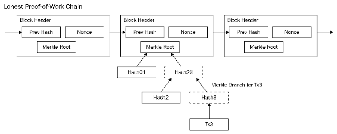
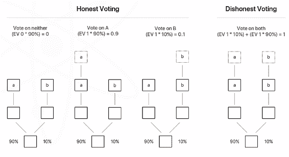
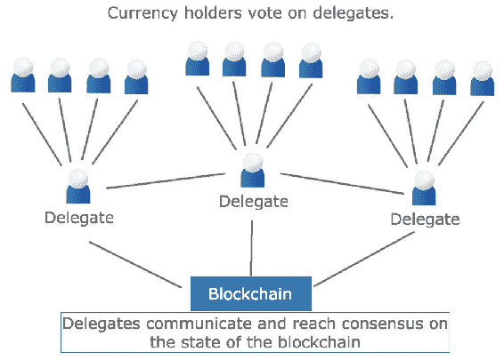
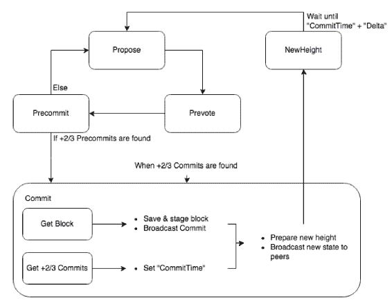

# 实现共识

共识的概念很简单：共识是当网络就网络中存储的信息的真实性达成一致意见时，应该保留什么信息，以及什么信息不真实，不应该保留。对于比特币来说，达成共识就是要就网络中要发送和接收的比特币集合达成一致意见。对于其他网络，达成共识还涉及就区块链上存储的智能合约的最终状态或任何其他网络信息达成一致意见。

共识算法已经成为研究对象数十年。分布式系统的共识算法必须对多种类型的故障和问题具有弹性，如错误的消息、网络的部分连接和断开、延迟等。在金融系统中，特别是在区块链中，系统中存在谋利的和恶意的行为者的风险。对于区块链网络中的每个算法，达成共识确保网络中的所有节点就区块链的一致全球状态达成一致意见。任何分布式共识协议都具有三个关键属性：

+   **安全性**：分布式网络上所有节点保证具有相同的状态或一致性的能力

+   **活跃性/可用性**：协议保证成功并使不同节点产生最终结果

+   **容错性**：协议处理节点生成错误或敌对结果的能力

恰巧，Fischer、Lynch 和 Paterson 的一篇著名论文指出，在同一个异步分布式系统中不可能同时满足这三个条件。因此，任何区块链设计都必须在这些属性之间做出权衡。这些权衡通常是在安全性和活跃性之间进行的，因为容错性通常被认为是全球分布式网络的必备条件。

在区块链系统中，目前有四种主要方法可以实现共识。它们如下：

+   实用拜占庭容错算法

+   工作量证明算法

+   权益证明算法

+   委托式权益证明算法（DPoS）

这些方法将在本章中依次介绍。

# 实用拜占庭容错算法

**实用拜占庭容错**（**PBFT**）算法。许多算法被称为**拜占庭容错**。这个名字来源于提出原始问题的寓言。

想象一支古代的拜占庭军队正在进攻一座城市。攻击的想法是从各个方向进攻。一旦军队的将军们到达城市，他们必须就何时以及如何进攻达成一致意见。难点在于如何达成一致。将军们只能通过信使进行通信，但信使可能会被敌人抓获，而且还有一个额外的担忧，即一个或多个将军或他们的指挥官可能是叛徒。

将军们需要一种方法来确保所有忠诚的将军都同意相同的计划，并且少数可能的叛徒不能导致任务失败。

忠诚的将军会按照方法所说的去做，但叛徒可能会做任何事情。将军们如何创建一种方法，以确保只要他们中的大多数人是忠诚的，他们的计划就会成功？

这个寓言有时也被称为**中国将军问题**，以及其他几个名字，但问题仍然相同：当通信渠道可能不安全时，不同方如何安全地进行通信并达成协议，甚至可能在他们中间有叛徒的情况下。

在区块链的情况下，故事中的将军是参与运行区块链的分布式网络上的计算机。信使代表了这些机器正在运行的数字网络以及这些机器使用的消息协议。目标是让好的计算机或将军决定网络上的哪些信息是有效的，同时根除坏行为者，并防止错误信息被记录在区块链上。

故事中的忠诚将军代表了对确保区块链及其基于其上的应用程序的完整性感兴趣的诚实节点的运营者，因此他们致力于确保仅记录正确数据。叛徒代表了世界上许多坏行为者，他们愿意为了个人利益或代表其他对抗性方的某种利益而篡改数据（尤其是财务数据）。坏行为者的动机可能各不相同，可以是花费他们并非真正拥有的比特币，摆脱合同义务，甚至试图以破坏网络的方式进行货币控制来自对抗性政府的形式。

# 拜占庭故障

要理解 PBFT 和随后出现的所有其他共识算法，首先需要定义拜占庭故障是什么。拜占庭故障是指任何可能破坏分布式系统一致性的事件或结果，例如以下情况：

+   未返回任何结果

+   返回错误或不一致的结果

+   故意返回误导性的结果

+   任何事先未定义的行为

如果发生了任何这些事件，就会说发生了拜占庭故障。因此，拜占庭容错系统能够处理一定程度的不一致输入，但仍然能够在最后提供正确的结果。关键在于这样的系统是容错的，而不是免疫的。所有容错系统只能容忍一定程度的故障，超出容忍范围后，系统就会以某种方式失败。

# PBFT 的工作原理

超级账本是主要使用 PBFT 的区块链。以下是 PBFT 在超级账本中的工作原理。每个验证节点（运行区块链软件并努力维护一致性的计算机）都保存区块链的内部状态的一个副本。当节点接收到消息时，它使用消息与其内部状态一起对新状态进行计算。然后节点决定如何处理该消息：将其视为有效、忽略它，或者采取其他行动。一旦节点对新消息做出决定，该节点就会与系统中的所有其他节点分享该决定。一致性决定基于所有节点提交的总决定：

1.  **提交**：网络上的一个或多个节点提交发送到其他节点的交易。例如，如果有十个参与节点，其中三个发送消息，看起来如下：

    +   十台计算机都看到三个交易

    +   这些交易被分发，以便每个节点都拥有所有交易的完整副本

    +   这些交易可能在不同的时间到达节点，因此顺序可能不一致

1.  **排序**：通过其他节点的投票，其中一个验证节点被选为领导者。这个验证的领导者选择交易的顺序并将其发送给其他参与节点。其他验证节点然后将它们已经拥有的交易重新排列成验证领导者设置的顺序。

1.  **执行**：验证节点然后执行新排序的交易。每个节点都独立执行所有更改，并将这些更改添加到以前区块的全局状态中。如果无法达成共识，交易将被回滚并拒绝。

对每个区块都重复这个过程。PBFT 的优势是非常快并且相对可扩展。缺点是参与者必须是已知的——不是任何人都可以加入网络。

# 工作证明

区块链中使用的第一种共识算法是比特币的**工作证明**（**PoW**）。工作证明的基本功能是利用某些密码学函数的特性：有一些很难解决的数学问题，但一旦解决了，检查起来就很容易。正如之前所讨论的，其中一个问题就是哈希：很容易从数据中计算出哈希，但从哈希中发现输入数据却非常困难。PoW 最显著地被比特币、莱特币和以太坊使用。

PoW 具有以下特点：

+   **相对可预测的解决时间**：比特币的网络协议预期每个区块解决约需要十分钟。如果网络开始太快地解决工作证明问题，网络将自动增加难度。

+   **对计算能力的大幅增加或减少具有抵抗力**：摩尔定律表明，计算机的工作量预计每两年增加一倍。此外，由于网络是开放的，任何人都可以随时向网络添加大量的计算资源。为了保持网络的稳定，算法必须自动调整自身。同样，如果网络不再盈利，那么正在使用的计算能力将会下降，因为这些资源会被重定向。这是通过算法中自动调整难度来实现的。任何网络参与者都必须能够快速检查他们是否拥有正确的链条，以及该链条是否有效。这是通过散列函数来实现的。

工作量证明算法只要没有任何一组参与者控制 50%以上的整个网络计算能力，就能维护网络的完整性。能够操控链条的坏参与者的可能性被称为**51%攻击**。如果单一组织控制了超过一半的网络计算能力，他们可以通过停止支付或甚至双花来控制网络和网络交易。攻击组织将能够阻止确认新的交易（随意停止用户的支付），甚至在他们控制网络后发生的交易。

# 比特币中的工作量证明问题的原理

工作量证明算法首先采取最长的链。在比特币中，区块可以通过多种方式最终确定（取决于包括的交易）。因此，比特币节点可以选择多个可用的“已解决”链作为基础。作为算法的一部分，比特币采取最长的链，因此接受了最多的计算能力。以下图表说明了工作量证明链：



比特币中的难题是找到一个输入，当加到先前的区块哈希和交易列表中时，会产生一个以特定数量零开始的哈希。

通常，该函数的输入是所有交易的默克尔根和先前的块哈希。为了简化说明，假设我们有一个简单的输入，例如*I love Blockchains*。同时假设系统的难度是最简单的：哈希起始位置只有一个零。*I love Blockchains*的 SHA-256 哈希如下：

```
ef34c91b820b3faf29104f9d8179bfe2c236d1e8252cb3ea6d8cb7c897bb7d96.
```

你可以看到，它不是以`0`开始的。为了解决这个输入的区块，我们需要找到一个字符串（称为**随机数**）可以加到这个字符串上，以便将这个组合（*随机数+ I love Blockchains*）的哈希结果为以`0`开始的字符串。事实证明，我们只能通过测试来完成。例如，如果我们在开头加上`1`，我们得到*1I love Blockchains*，哈希如下：

```
b2fc53e03ea88d69ebd763e4fccad88bdb1d7f2fd35588a35ec6498155c702ed
```

没有运气。 那么 2 和 3 呢？ 这些也将无法解决谜题。 恰巧，*4I love Blockchains* 的哈希以 `0` 开头：

```
0fd29b2154f84e157d9f816fa8a774121bca253779acb07b07cfbf501825415d
```

这只用了四次尝试，但这是一个非常低的难度。 每增加一个零，找到一个能计算出正确哈希的适当输入的挑战就会加倍。 截至目前，一个有效的比特币区块需要 18 个零才能有效。

尝试找到产生正确哈希的随机数的过程称为挖矿。 每台挖掘 PoW 链的计算机都在竞争看谁能最先找到正确的随机数。 获胜者有权创建链中的下一个区块，并且以代币的形式获得奖励。 更多细节，请参阅 第十八章，*挖矿*。

PoW 的优势在于任何人都可以加入 PoW 网络，并且它已经被证明是一种功能性共识机制。 PoW 网络的主要缺点是速度慢和财务成本高：运行所有计算机进行这些计算非常昂贵，并且输出没有被用于任何真正的生产性用途。 这被认为对环境不利，并且可能导致在进行大量区块链挖掘的地方能源价格上涨。 由于这个原因，一些地区已经禁止了区块链挖掘。

由于这些缺点，**权益证明**（**PoS**）被发明出来。

# 股权证明

PoS 与 PoW 具有相同的目标，即保护网络免受攻击，并允许在开放网络中达成共识。 第一个使用此方法的数字货币是 Peercoin，随后是许多其他数字货币，如 NXT，Dash，PIVX 等。 在 PoW 网络中，解决谜题决定了哪个节点可以创建链中的下一个区块。 在 PoS 网络中，区块被称为被锻造而不是被挖掘，因为它们在 PoW 区块链中。 在 PoS 链中，验证者通过获得每个区块的交易费用来获得奖励，并且有时在每次创建区块时自动创建额外的代币。 在 PoS 链中，成为下一个区块的创建者的机会取决于节点在网络中的投资金额。

看看以下示例：

PoS 网络中有五个节点。 它们具有以下余额：

1.  10,000 枚代币

1.  200 枚代币

1.  300 枚代币

1.  4,000 枚代币

1.  20,500 枚代币

代币的总数为 35,000 枚。 假设每个节点都抵押了他们代币的 100%，每个区块和其中的节点被认为是下一个区块签名者的可能性如下：

1.  28.57%

1.  0.57%

1.  0.86%

1.  11.4%

1.  58.6%

很明显，如果单个节点控制大多数代币（甚至是大部分），那么他们将对网络有很大的控制权。在这种情况下，节点 #5 将创建超过半数的区块。此外，由于节点 #5 将定期签署区块，它还将获得大多数交易费用和新创建的硬币。在某种程度上，PoS 以额外代币的形式奖励验证者对其投资的利息。对 PoS 网络的一项批评是*富者更富*，这可能导致网络的中心化和控制不断增加。

# 无所不在的利益攻击

**PoS 系统**中的一个问题是无所不在的利益攻击威胁。在无所不在的利益攻击中，验证者实际上创建多个区块，以多次消费代币。由于在 PoS 系统中创建区块的成本很低，网络没有财务激励来阻止所有交易的批准，导致共识崩溃。

举例来说，想象一下，一个名为 Cain 的不良行为者，只拥有 100 个代币。他决定尝试欺骗，向网络发送两条消息：一条是他将他的 100 个代币发送给 Sanjay，另一条是他将他的 100 个代币发送给 Eliza。网络应该接受任一交易，但不接受两者。通常，节点必须就哪个交易有效或拒绝两者达成共识。但是，如果验证者与 Cain 合作（或由 Cain 自己运行），那么批准两个区块对他们的财务利益是有利的。

在下图中，**预期价值**代表**EV**。它显示如果验证者接受两个区块，它可以有效地双重花费而不受惩罚：



为了避免这个问题，PoS 系统引入了各种各样的对策，如抵押存款。在区块链分叉或双重消费攻击的情况下，参与的验证者面临失去他们的代币的风险。通过财务处罚和抵押代币的损失，认为双重花费和验证所有区块的激励会降低或消除。

# 变种

基本 PoS 方法有许多变体。每种变体都会有不同的要求，如拥有股权的最低余额、不良行为的潜在处罚、网络的利益相关者的权利和能力，以及修饰符，例如账户需要拥有抵押余额多长时间才能计算。

# 委托型股权证明（Delegated Proof of Stake）

DPoS 与 PoS 共识有关，但存在一些关键区别。这个新系统是 Bitshares、Steemit 以及目前的 EOS 的创始人 Dan Larimer 的创造。这两个网络以及 Lisk（另一个常用的区块链）目前是唯一使用这种方法的主要区块链。在 DPoS 中，代币持有者不是进行区块验证的人。相反，他们可以使用自己的代币选举一个节点来代表他们进行验证——他们的代表（也称为**验证者**）。正是这个代表/验证者帮助操作网络。可用验证器插槽的数量往往锁定为一个特定的数量，通常是 21 个。要成为代表，节点的所有者必须说服网络的其他用户信任他们，让他们负责通过将他们在网络上的整体代币份额委托给他们来保护网络。基本上，网络上的每个代币都充当一票，而获得最高选票的人被允许操作网络。目前，只有 Bitshares、Steemit、EOS 和 Lisk 是使用这种方法的主要区块链。

在 DPoS 中，每个代表都有一个有限的指定时间来发布新的区块。如果一个代表持续错过他们的区块创建时间或发布无效交易，使用他们投票权的代币持有者可以投票将他们替换为更好的代表。以下图表显示了这个结构如下所示：



DPoS 的主要批评是它在某种程度上是中央集权的，并且对背叛网络没有真正的即时财务惩罚。违反网络规则的后果是被代币持有者投票淘汰。人们认为，违反网络规则的声誉成本以及竞选代表股份的损失将超过试图负面影响网络的财务收益。由于只有少数的代表插槽，代币持有者更容易关注个体验证节点的行为。

# Tendermint 共识

Tendermint 使用自定义共识引擎，由 Jae Kwon 的博士论文的一部分设计而成。它类似于 DPoS，参与网络的人可以将他们的投票权委托给一个验证账户。然而，为了这样做，他们必须债券化或锁定他们的代币。为此，他们必须发出一个特殊的债券交易，其中他们的硬币被锁定到一个验证节点。如果他们的代表行为不端，那么代表和借出他们硬币的账户都将放弃一部分他们债券化的代币。要释放他们的代币，必须向网络发布另一个特殊的解除债券交易，而且这样的提款会受到长时间的延迟。

让我们看看这些交易是如何发生的。以下图表摘自 Tendermint 文档：

。

让我们更详细地看一下前面的图。代表通过签署投票来信号下一个区块。有三种类型的投票：预投票、预提交和提交。每个区块都有一个特殊的验证器，称为**提案者**。提案者首先提出一个基于之前锁定区块的有效区块状态的建议。这个提议在其他验证器之间点对点共享，如果有 2/3 或更多的验证器同意锁定区块（在预投票阶段），那么它们将进入下一个阶段：预提交。在预提交阶段，同样，如果有 2/3 的人同意预投票条件，他们将表示他们准备提交。最后，区块的实际提交发生：节点必须已经收到了区块，并且必须已经收到了 2/3 的有效投票来进行预提交。

如果这个 2/3 投票序列看起来不寻常，那是因为异步网络的性质，验证器可能会在不同的时间收到区块和投票。这个序列以及在未达到 2/3 多数时处理边缘情况的方式，使得在不可靠的网络上能够有效快速地达成共识。

# 权威证明

**权威证明**（**PoA**）网络仅在所有区块链参与者都已知的情况下使用。在权威证明中，每个参与者都被区块链知道并注册。这样的区块链称为**许可链**，因为只有属于批准的权威列表的计算机才能锻造区块。因此，至关重要的是，没有一个权威计算机被破坏，每个操作者都必须努力确保其验证器的完整性。这种方法最初由 Parity Technologies 的 Gavin Wood 分享，作为运行基于以太坊的区块链的不同方式。

# 建立权威

必须满足的三个主要条件以建立验证器如下所述：

+   身份需要经过正式验证并上链。

+   获得资格应该是困难的。例如成为公证人，接受背景调查和提供保证金等事项。

+   对每个权威所需的事项集应该有良好的文件记录，一致，并值得网络的信任。

一旦建立了权威，可能会通过将该权威添加到区块链的有效验证器列表中来授予锻造新区块的权利。

虽然 PoA 主要用于私有链，但也可以用于公共链。两个公共以太坊测试网络，Rinkleby 和 Kovan，是使用 PoA 作为其共识机制的公共区块链网络。

PoA 的明显缺点在于每个验证器操作者的身份必须为人所知和信任，并且滥用信任的惩罚必须是真实的。对于全球区块链而言，这可能并不理想，因为区块链技术的吸引力之一就是能够匿名交换价值。

# 已过时的证据

Hyperledger Sawtooth 项目推出了一种名为**proof-of-elapsed-time**或**PoET**的新共识机制。Hyperledger 主要涉及许可链，只有指定数量的参与者被允许进入网络，类似于 PoA 链。

基本方法很简单：

+   每个节点必须等待一段随机的时间

+   首个停止等待的节点将创建一个区块

我们必须做两件事情才能使其工作。首先，我们必须能够验证所有参与者的等待时间实际上是随机的，否则一个简单的攻击就是假装等待一段随机的时间，然后立即创建一个新的区块。其次，必须能够验证不仅选择时间的长度是随机的，而且节点实际上在采取行动之前等待了整个时间段。

这些问题的解决方案来自英特尔（他们创造了 PoET 算法），并依赖于特殊的 CPU 指令，以确保只运行受信任的代码。强制信任的代码负责处理块时间，确保抽奖公平。

# 摘要

到此为止，您应该对区块链使用的不同机制达成共识具有坚实的基础。每种共识算法在速度、可用性、一致性和容错性之间进行了一定的权衡。最常见的共识机制仍然是 PoW 和 PoS，但区块链的发展非常迅猛，新的、改进的方法可能会被开发出来。共识算法的改进将提高区块链的可扩展性和可靠性，并扩大技术的潜在应用范围。

# 参考文献

1.  [`groups.csail.mit.edu/tds/papers/Lynch/jacm85.pdf`](https://groups.csail.mit.edu/tds/papers/Lynch/jacm85.pdf)

1.  [`www.microsoft.com/en-us/research/publication/byzantine-generals-problem/?from=http%3A%2F%2Fresearch.microsoft.com%2Fen-us%2Fum%2Fpeople%2Flamport%2Fpubs%2Fbyz.pdf`](https://www.microsoft.com/en-us/research/publication/byzantine-generals-problem/?from=http%3A%2F%2Fresearch.microsoft.com%2Fen-us%2Fum%2Fpeople%2Flamport%2Fpubs%2Fbyz.pdf)

1.  [`github.com/tendermint/tendermint.com/blob/5c111743a03d2c6ed2e0b14bd3091cac8974c8da/docs/tendermint_v02.pdf`](https://github.com/tendermint/tendermint.com/blob/5c111743a03d2c6ed2e0b14bd3091cac8974c8da/docs/tendermint_v02.pdf)

1.  [`peercoin.net/assets/paper/peercoin-paper.pdf`](https://peercoin.net/assets/paper/peercoin-paper.pdf)

1.  [`github.com/ethereum/guide/blob/master/poa.md`](https://github.com/ethereum/guide/blob/master/poa.md)

1.  [`medium.com/poa-network/proof-of-authority-consensus-model-with-identity-at-stake-d5bd15463256`](https://medium.com/poa-network/proof-of-authority-consensus-model-with-identity-at-stake-d5bd15463256)
