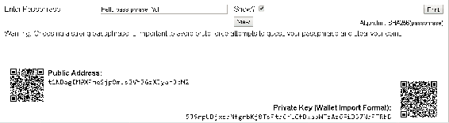
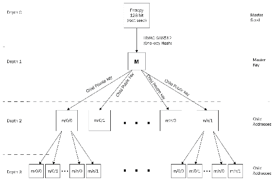
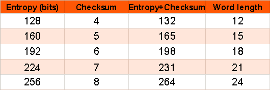
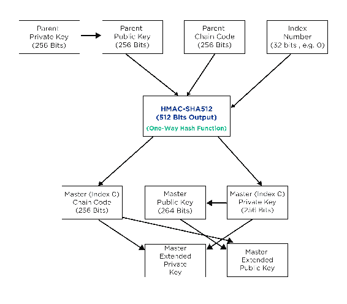

# 第九章：加密货币钱包

在本章中，我们将详细讨论加密货币钱包。在之前的章节中，我们已经介绍了钱包以及加密货币钱包的类型；在本章中，我们将进一步详细讨论钱包、它们的来源以及如何加强钱包的安全性。

钱包用于存储私钥、公钥以及比特币地址。可以使用钱包发送或接收货币。钱包可以将数据存储在数据库中或结构化文件中。例如，比特币核心客户端钱包使用 Berkeley DB 文件。

本章我们将涵盖的主题如下：

+   加密货币钱包的重要性

+   软件钱包

+   硬件钱包

+   纸质钱包

+   脑钱包

+   加密货币钱包中的密钥派生方法

+   记忆代码

# 加密货币钱包简介

任何加密货币的钱包都可以存储多个公钥和私钥。加密货币本身并不包含在钱包中；相反，加密货币是去中心化存储和维护在公共分类帐中的。每个加密货币都有一个私钥，用它可以在公共分类帐中写入，这使得在加密货币中进行消费成为可能。

了解钱包的重要性很重要，因为保护私钥安全对于保护货币安全至关重要。钱包是公钥和私钥的集合，每个都对于货币持有者的安全性和匿名性都很重要。

# 加密货币钱包中的交易

钱包之间的交易不是价值转移；相反，钱包中存储着私钥，该私钥用于签署交易。交易的签名是从私钥和公钥的组合中生成的。安全存储私钥是非常重要的。

钱包可以存储多个私钥，并生成与私钥相关联的多个公钥。

因此，保持钱包安全以保护私钥的安全非常重要；如果私钥丢失，与该私钥相关的硬币将永远丢失，没有可行的方法来恢复这些硬币。

# 加密货币钱包的类型

根据其特征，钱包可以分为各种类型。钱包可以根据支持的货币数量、可用性、软件或硬件、密钥派生方法等进行分类。我们将在下面的子章节中查看要涵盖的加密货币钱包类型。

# 货币支持

区分钱包的一个主要特征是钱包支持的货币数量；例如，可以有支持单一货币或多货币的钱包。每种货币都有一个包含钱包的核心客户端。

官方钱包通常只支持单一货币，但现在，许多第三方钱包开始支持多种货币，这些钱包执行与常规钱包相同的功能，唯一的区别在于它们支持的货币种类。

一些支持多种货币的钱包如下所示：

+   无限钱包

+   Jaxx 钱包

+   Electrum

+   Trezor

+   Coinbase 钱包

以下是支持各种货币的 EXODUS 钱包的截图：


有时，会有各种其他的钱包涌现，提供多种货币。有时，支持单一货币的现有钱包开始引入多种货币，以增加其受欢迎程度，甚至以支持另一种加密货币。

# 租约

钱包还可以根据它们是基于软件、硬件、纸质还是云的来区分。让我们详细讨论这些钱包。

# 软件钱包

这些钱包是基于本地计算机或手机的。这些可以进一步分为桌面或移动钱包。这些钱包受限于本地机器；它们通常会按顺序下载完整的区块链或记录公共分类帐的信息：

+   **桌面软件**：它们在桌面或笔记本电脑上本地存储密钥。这为加密货币提供了完全的控制权，尽管安全责任由托管钱包的人员承担，因此，即使机器的硬盘发生故障且没有备份，也有永久丢失货币的风险。没有必要在每时每刻都更新区块链，因此，在这种情况下，也可以使用未连接到计算机的机器。

+   **移动钱包**：这些钱包通过手机上的应用程序运行。这使用户可以轻松访问他们的货币。这些钱包将货币或密钥存储在手机上，就像桌面软件钱包一样，或者它们只是一个云钱包的界面；我们稍后将讨论该类型的钱包。以下截图是移动钱包的示例：


大多数加密货币的核心客户端最初提供软件钱包，并初步支持桌面钱包。

# 硬件钱包

私钥应存储在可能的最安全位置。硬件钱包将私钥存储在专为存储私钥设计的自定义硬件中。无法以纯文本形式导出私钥，这增加了另一层安全性。只有在需要时，硬件才连接到计算机，而在其他所有时候，私钥都保持安全。硬件钱包于 2012 年由 Trezor 首次推出。

目前可用的一些流行的硬件钱包包括 Trezor、Ledger 和 KeepKey 钱包。以下快照显示了一个连接到计算机的硬件钱包的示例：


# 纸钱包

纸钱包，顾名思义，只是公钥和私钥一起打印出来。密钥通常以二维码形式打印，也作为地址。任何人都可以通过打印密钥来创建纸钱包，但也要确保他们将密钥从计算机中删除，否则任何人都可以访问密钥。纸钱包应只存储在纸上，没有其他地方的备份。有各种在线服务可生成纸钱包，例如 [www.walletgenerator.net](https://walletgenerator.net/)。以下屏幕截图是纸钱包的示例，以下图片可打印，以接收支付，公钥地址是共享的，但标记为秘密的私钥必须保密：


# 大脑钱包

大脑钱包是一个简单的钱包，通过对口令进行哈希运算生成地址以生成私钥和公钥。要生成大脑钱包，我们选择一个简单的口令来生成公钥和私钥对。以下屏幕截图显示了如何生成公共地址和私钥。输入要记住的口令，如下图所示：



# 使用频率

钱包还可以根据使用情况区分；在这个基础上，主要有两种类型的钱包：冷钱包和热钱包。简单来说，冷钱包不连接到互联网，而热钱包则始终连接到互联网，可以随时用于发送相应的加密货币。即使未连接到互联网，冷钱包也可以用于接收货币，但在将其连接到互联网之前，不可能将货币发送到其他地址。

硬件钱包不连接到互联网，除非连接到设备；它们可以被视为冷钱包。

# 密钥派生

私钥由钱包生成以存在于区块链上，主要有两种方法可以生成密钥。密钥生成方法对于钱包的安全性至关重要，也对于在丢失钱包时恢复钱包至关重要。

# 非确定性钱包

这些是比特币客户端的最初迭代版本；钱包具有随机生成的私钥。这种类型的钱包因一个主要缺点而被停用，即如果丢失钱包，则无法访问随机密钥。由于建议在网络上维护匿名性时每次交易使用不同的地址，而随机密钥过多，因此难以维护，因此地址容易被重复使用。尽管在比特币核心客户端中，有一个实现为类型-0 钱包的钱包，但其使用受到普遍不鼓励。

# 确定性钱包

在这些钱包中，密钥是从单个主密钥或一个可以说是共同种子派生的。在这种类型的钱包中，所有私钥都链接到一个共同的种子。只备份种子即可恢复在这种类型的钱包中派生的所有密钥。

# 分层确定性钱包

这是确定性钱包的最高级形式。这些是在比特币改进提案系统的 BIP0032 中引入的。这些钱包遵循树结构，也就是说，种子创建主密钥，进一步创建子密钥，每个密钥都可以派生更多的孙子密钥。因此，在这些类型的钱包中，可以有多个分支的密钥，并且分支中的每个密钥都能够按需创建更多的密钥。以下图表显示了在这种钱包中创建的密钥和地址层次结构：



# 助记码

这些是用于表示确定性钱包中用于派生种子的随机数的英文单词。这些单词充当密码；这些单词可以帮助恢复种子，以及随后从种子派生的密钥。助记码对钱包用户来说是一个很好的备份系统。

创建钱包时，钱包显示一个包含 12 至 24 个单词的列表。这些单词序列用于备份钱包，并在钱包无法访问时恢复所有密钥。

这是根据 BIP0039 标准生成助记码和种子的过程：

1.  初始随机熵`ENT`比特在允许的 128-256 比特大小之间生成。

1.  校验和是通过取其 SHA256 哈希的前几位生成的。校验和长度由`ENT/32`公式定义。

1.  由`CS`标识的校验和添加在初始熵的末尾。

1.  创建的序列分割成 11 位；每个都被编码为一个在 0 和 2,047 之间的数字，该数字充当预定义单词列表中的索引。

1.  创建代表助记码的 12-24 个单词列表。

助记码长度，也称为助记句(`MS`)，由`MS = (ENT + CS) / 11`定义。以下屏幕截图显示了单词长度和与其相关联的熵：



从助记序列生成的 512 比特种子使用`PBKDF2`函数，其中助记句用作密码，*字符串助记句+密码*用作盐。密码是用户用来保护自己助记句的内容；如果未设置，则使用`""`。

从这个过程派生的密钥长度是 512 位；不同的钱包可以使用自己的过程来创建单词列表，并且拥有任何所需的单词列表。尽管建议使用 BIP 中指定的助记词生成过程，但钱包可以根据需要使用自己版本的单词列表。

# HD 钱包的密钥生成过程

我们将详细讨论密钥生成过程，从主密钥到私钥，以及钱包为交易目的创建的各种地址。

初始过程是创建根种子，它是一个 128、256 或 512 位的随机数。根种子由助记句表示，这使得在丢失钱包访问权的情况下更容易恢复完整的钱包。

根种子是使用助记句和根种子生成的，根种子的长度选择在 128 到 512 位之间，尽管建议使用 256 位。使用（P）RNG 生成。生成的哈希值用于创建主私钥和主节点。主密钥的生成是层级系统中的深度级别 0；随后的钱包或密钥由深度 1、2 等表示。

# 子密钥派生

HD 钱包广泛使用**子密钥派生**（**CKD**）函数从父密钥创建子密钥。使用以下元素使用单向哈希函数派生密钥：

+   父密钥

+   作为种子的链码，256 位

+   索引号，32 位

子密钥可以从已经存在的密钥中生成的方式有多种；以下是关键派生序列：

+   从私有父密钥生成私有子密钥

+   从公共父密钥生成公共子密钥

+   从私有父密钥生成公共子密钥

让我们详细讨论前面提到的每个序列。

# 私钥生成

父密钥、链码和索引号被组合并使用`HMAC-SHA512`算法进行哈希运算，生成一个 512 位的哈希值，使用以下公式：

```
I = HMAC-SHA512(Key = Cpar ,Data = serp (point(kpar )) || ser32 (i))
```

生成的哈希值被分成两个哈希值，`I[L] 和 I[R]`。哈希输出的右半部分成为子节点的链码，哈希的左半部分及其索引号用于生成子私钥以及推导子公钥。

通过更改索引，我们可以按顺序创建多个子密钥。

# 扩展密钥

如前所述，可以从父密钥派生出许多子密钥，考虑到已有的三个必需输入。我们还可以创建另一种类型的密钥，称为**扩展密钥**，它由父密钥和链码组成。

此外，有两种类型的扩展密钥，区别在于所使用的父密钥是私钥还是公钥。扩展密钥可以创建子项，子项可以进一步在树结构中创建子项。

扩展密钥使用`Base58Check`进行编码，这有助于在钱包之间轻松导出和导入。这些密钥基本上是父密钥的扩展，因此共享任何扩展密钥都可以访问整个分支中的所有内容。

扩展私钥在密钥的`Base58Check`中具有`xprv`前缀，而扩展公钥在密钥的`Base58Check`中具有`xpub`前缀。以下图表显示了扩展密钥是如何形成的：



# 摘要

在这一章中，我们详细讨论了加密货币钱包和各种类型的加密货币钱包，我们阅读了基于这些货币钱包可以区分的各种特征，并且我们谈论了钱包的使用、每种钱包类型的好处以及在使用特定钱包类型时可能会遇到的问题。我们讨论了关键派生方法及其在安全性、可访问性和钱包的其他方面的重要性。
