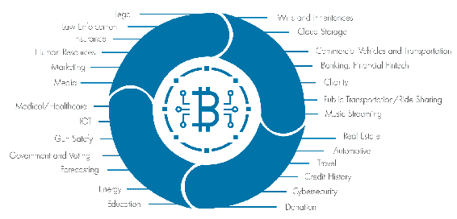
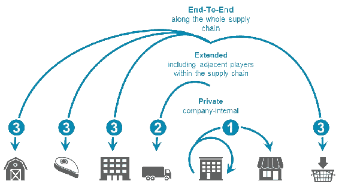
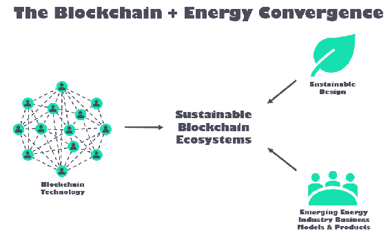
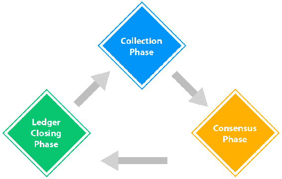
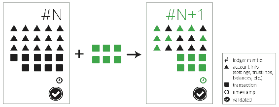
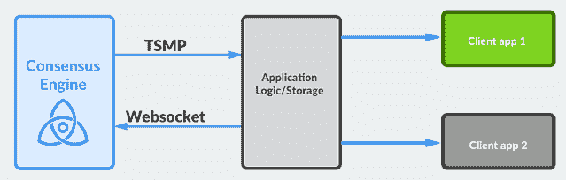

# 第十章：替代区块链

在前几章中，我们学习了区块链、其结构、组成部分、机制以及区块链的最大用例——比特币。在最后一章中，我们讨论了加密货币钱包及其在区块链中的角色和用途。我们的讨论大部分围绕比特币和其他加密货币展开。

比特币的成功吸引了很多关注，不仅是技术上的，还有底层的区块链分类账系统，社区开始创建基于区块链的替代加密货币，每次都在试图在某种程度上改进。随后，各种组织开始通过对比特币的参数进行轻微修改或变更，但保持区块链的核心定义不变，即公共分类账。一些试图创建替代区块链的项目并没有引起太多关注，但其他项目则得到了很多关注和社区支持。

在这一章中，我们将讨论以下主题：

+   区块链在政府、医疗保健、医学研究、供应链、艺术品、航运、能源、企业等各个行业的用途

+   瑞波支付系统

+   星际支付网络

+   Tendermint

+   Monax

# 区块链的各种用途

分布式分类账技术被称为互联网之后计算机领域最大的革命；区块链正在并将在未来几年影响和改变每个个体。

区块链在货币相关应用中如比特币和山寨币中使用，但除此之外，区块链在其他行业中有各种完全不同的货币使用的用例。以下图表展示了一些正在使用区块链的行业：

# 政府

全球各地的各个政府正在利用区块链存储公共记录或其他各种政府部门的信息，例如医疗保健、身份管理、税收、投票和金融服务等。

通过拥有去中心化的数据库，政府可以轻松减少欺诈，并在数据输入分布式分类账系统之前引入某些检查。

# 医疗保健

个人的医疗记录需要进行正确信息的认证，并且有权访问各方面完整的健康记录非常重要。区块链可用于促进数据共享和记录保管。敏感的医疗数据可以方便地被医生和其他医疗社区相关人员访问。

# 医学研究

医学界的研究人员一直在努力开发更好的创新和技术，以改善临床护理。由于数据存在于区块链上，研究人员可以轻松访问真实数据，并根据适当的批准周期添加理论/结果。系统的互操作性可以在多个层面上提供帮助，并提供精确性和真实性。

# 供应链

供应链管理是业务流程中最分散的瓶颈之一。一直以来，供应链管理需要更高的效率。由于使用了多个软件系统，它们之间的不兼容性是存在的，每个系统都需要各种数据点以进行更顺利的运转。区块链可以为供应链过程中的每个参与者提供访问相关信息的可能，减少沟通或数据错误，正如下图所示：

# 版权

区块链可以用于解决版权索赔，因为在基于区块链的系统中，只有在经过共识系统批准后才能引入任何条目，从而确保版权得到维护。

# 艺术品

艺术产业依赖于艺术品的鉴定；尽管区块链不能鉴定艺术品，也不能确认一幅画是否是原作还是赝品，但它可以用于鉴定所有权。

# 运输

许多项目正在利用区块链在海运物流业内带来透明度来提高国际贸易。各个全球船东正出于同样的原因使用区块链，以引入基于区块链的技术，并消除分布式分类账技术为该行业解决的任何瓶颈。

# 能源

区块链能够通过跟踪能源分配和实施高效分配来最大限度地提高能源分配部门的效率。能源生产和在新可持续资源方面的研究可以通过使用区块链来监测真实性和共识的维护，正如下面所示：

# 计算和数据存储

计算资源在全球范围内被浪费。数据中心和数据湖一直需要高效的数据维护。使用区块链可以确保安全性和改善。

# 身份和社会保障

用户识别是政府中使用区块链的一个重要用例，但也可以被其他组织用于社会保障和其他需要的身份识别过程。

# 企业

企业可以在各种情况下使用区块链，例如部门间的协调、办公室内部和办公室间的沟通、数据迁移和其他各种任务。微软、IBM、谷歌、亚马逊等公司已经开始在各种企业部门进行区块链使用的 Beta 测试。

# 涟漪

Ripple 由 Ripple 公司于 2012 年创建的实时毛额结算和汇款网络。它允许各方之间的支付在几秒钟内完成。它使用自己的货币，称为**Ripple**（**XRP**），也支持非 XRP 支付。Ripple 提出了一个新的分散式全球银行和支付提供者网络，称为 RippleNet。该网络在其核心使用 Ripple 的交易结算技术。RippleNet 拟定独立于银行和支付提供者，为实时支付结算设置了一个标准化网络。

Ripple 网络由执行各自定义任务的各种节点组成。促进系统的第一个节点称为**用户节点**。用户节点使用 Ripple 进行支付和交易，例如进行付款和接收付款。Ripple 中的第二种节点是**验证节点**。这些节点是 Ripple 网络中共识机制的一部分。**唯一节点列表**（**UNL**）中的节点是 Ripple 网络的一部分，并且受到共识机制的信任。任何人都可以成为验证节点或用户节点。以下图显示了 Ripple 网络中发生的交易流程。交易从收集阶段开始，然后通过共识阶段进行移动。最后阶段是账本关闭阶段，为下一组交易创建确定交易的区块以接收：

对于共识机制，Ripple 使用**Ripple 协议共识算法**（**RPCA**）。RPCA 既不基于**工作量证明**（**PoW**）也不基于**股权证明**（**PoS**）系统；相反，其共识机制基于基于正确性的系统运作。共识过程通过向验证节点循环地寻求接受来运作投票系统，以便获得所需数量的投票。一旦收到所需数量的投票，就会验证更改并关闭账本。一旦接受账本中的更改并关闭账本，就会向网络发送警报。

Ripple 网络由各种元素组成，这些元素共同使 Ripple 中的交易成功：

+   **验证器**：此元素是共识协议中的参与者。

+   **账本**：其中包含账本编号、账户设置、交易、时间戳和账本验证标志等元素。

+   **开放账本**：这是进行投票的账本。开放账本包含了提议的交易。

+   **唯一节点列表**：这是验证服务器用来寻求投票并推进共识的节点列表。

+   **提议者**：此元素提议要成为共识过程一部分的新交易。

# 交易

Ripple 网络节点创建交易，以更新分类账。交易需要进行数字签名和验证，以便成为共识过程的一部分。每笔交易都需要支付一小笔 XRP，就像以太坊中的 Gas。Ripple 网络有各种类型的交易：与付款相关的、与订单相关的和与账户相关的。

Ripple 网络还提供了各种开发者 API，用于处理交易和付款，以及在 RippleNet 上的集成。Interledger 与 RippleNet 合作，实现与不同网络的兼容性。下图描述了 Ripple 网络中一个区块包含的内容：

# Stellar

星际网络用于任何货币的交换，包括自定义代币。星际具有更常被称为**星际共识协议**（**SCP**）的共识系统，它基于**联邦拜占庭协议**（**FBA**）。SCP 与 PoW 和 PoS 不同，其主要焦点是为了提供低延迟的更快交易。

它有四个主要特性：

+   **去中心化属性**：它允许任何人参与，没有任何中心化的一方。

+   **低延迟**：它解决了快速交易处理的急需需求。

+   **灵活的信任**：它允许用户选择他们信任的特定目的方。

+   **渐进式安全性**：它利用数字签名和哈希函数来提供网络所需的安全级别。

星际网络维护着一个分布式分类账，保存了每一笔交易，并在连接到网络的每个星际服务器上进行复制。共识是通过服务器验证交易，并使用同一交易的更新更新分类账来实现的。星际分类账也可以作为分布式交易所订单薄，因为用户可以存储他们的购买或出售货币的报价。

# Tendermint

Tendermint 提供了一种安全且一致的状态机复制功能。它的主要任务是开发一个安全且高性能、易于复制的状态机。它是拜占庭容错的，即使其中三分之一的机器出现故障，Tendermint 也能继续工作。

Tendermint 的两个主要组成部分如下：

+   **Tendermint Core**：Tendermint Core 能够在网络中的每个节点上安全复制交易。它是一个共识引擎。

+   **Tendermint 套接字协议**（**TMSP**）：TMSP 是一种应用接口协议，允许与任何编程语言进行接口，并有助于处理交易。

Tendermint 共识算法是一种基于轮次的机制，其中验证节点在每个轮次中启动新的块。使用锁定机制来确保当两个不同的块被选定用于在区块链的同一高度关闭时不会出现问题。每个验证节点同步包含交易的块的完整本地复制分类帐。每个块包含一个标头，其中包含前一个块哈希、建议块的时间戳、当前块高度以及该块中包含的所有交易的 Merkle 根哈希。

以下图表显示了共识引擎和客户端应用程序通过 Tendermint Socket 协议之间的流程：

Tendermint 协议的参与者通常被称为**验证者**。每个验证者轮流提议交易块。他们也像之前讨论过的 Ripple 投票系统一样对其进行投票。如果一个块无法提交，协议将进入下一轮。然后新的验证者为同一高度提议一个块。投票需要两个阶段才能成功提交一个块。这两个阶段通常称为预投票和预提交阶段。只有三分之二以上的验证者为同一块在同一轮进行了预提交，块才会被提交。

由于各种原因，验证者无法提交一个块。这可能包括当前的提议者离线，或者网络质量或速度的问题。Tendermint 还允许验证者确认是否应跳过一个验证者。每个验证者等待一小段时间以从相关的提议者那里收到一个提议块。只有在这之后才能进行投票，他们才能进入下一轮。尽管协议的其余部分是异步的，并且只有听到超过三分之二的验证者集的消息后，验证者才能进展，但这种对时间段的依赖使得 Tendermint 成为一种同步协议。Tendermint 的一个简化要素是，它使用相同的机制来提交一个块，以及跳过到下一轮。

假设少于三分之一的验证节点是拜占庭节点，Tendermint 可以保证不会破坏安全性。这意味着验证节点永远不会在同一高度提交冲突的块。有一些锁定规则来调节可以遵循的路径。一旦一个验证者预提交一个块，它就会锁定在那个块上。在这种情况下，它必须为它将要锁定的块进行预投票，并且它只能解锁并为一个新块进行预提交。

# Monax

Monax 是一个成立于 2014 年的区块链和智能合约技术。它最初名为 Eris Industries，但在 2016 年 10 月更名为 Monax。

Monax 有很多可以提供的东西。其中包括各种框架、SDK 和工具，可加速区块链的开发和部署以用于企业。Monax 应用平台背后的理念是实现使用区块链作为后端的生态系统应用的开发。它还允许与多个区块链集成，并使各种第三方系统能够与其他区块链系统交互，并提供高度兼容性。该平台使用以太坊或比特币等区块链上编写的智能合约。它可以与多个区块链进行交互。所有命令对不同的区块链都是标准化的，并且可以在整个平台上使用相同的命令。

Monax 目前积极用于以下应用：

+   车队租赁

+   公司治理

+   知识产权

+   法律流程

# 摘要

在本章中，我们介绍了另类区块链。我们讨论了除加密货币以外的区块链的各种用途。其中一些包括政府、医疗保健、医学研究、供应链、版权、美术、航运、能源等。另外，我们讨论了瑞波币（Ripple），这是一种用于快速支付的新区块链，与比特币区块链相比提供了各种修改和改进。接着，我们讨论了恒星支付协议及其主要特性，这有助于加速恒星的支付。Tendermint 是另一种区块链软件，我们讨论并引起了我们的注意。

在下一章中，我们将详细讨论 Hyperledger 及一些基于 Hyperledger 协议的重要项目。我们还将讨论 Hyperledger 协议的详细信息和其他参数。
