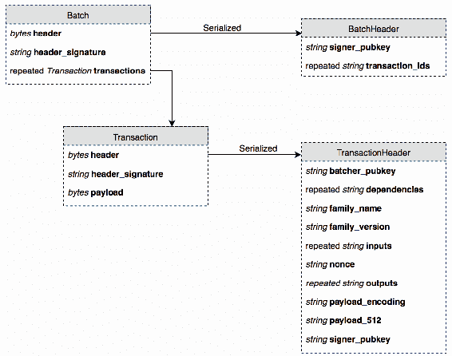
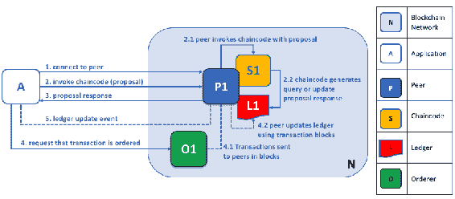
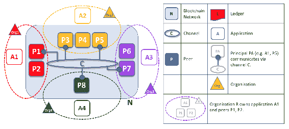
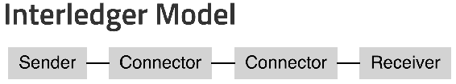

# Hyperledger 和企业区块链

与本书讨论的大多数其他区块链系统不同，Hyperledger 从未进行**首次** **代币发行**（ICO），也没有公开交易的代币。这是因为 Hyperledger 本身并不是一个区块链，而是一组用于创建新区块链的技术。此外，这些区块链技术专门设计和构建用于企业用例，而不是公共市场。

在本章中，我们将涵盖以下内容：

+   Hyperledger 的历史

+   六个当前 Hyperledger 项目的关键细节

+   支持生态系统使用的 Hyperledger 工具概述

+   如何选择项目中的 Hyperledger 技术的建议

Hyperledger 的名称不适用于单一技术，而是适用于所有捐赠给 Linux 基金会的区块链技术的集合。

Hyperledger 项目成员包括 Consensys、R3 和 Onchain 等主要区块链公司，以及百度、思科、富士通、日立、IBM、英特尔、NEC、红帽和 VMware 等许多企业技术公司。除了这些公司，许多金融服务公司也加入了，因为区块链在金融科技领域的明显应用。金融服务成员包括澳新银行、美林银行、摩根大通、SWIFT 和富国银行。为了成为下一波商业软件咨询机会的一部分，主要的整合商也加入了——例如安永、CA 科技、普华永道和 Wipro，以及其他许多公司。

最近，亚马逊、IBM 和微软都发布了基于 Hyperledger 技术的区块链即服务产品。

# Hyperledger 的历史

Hyperledger 项目成立于 2015 年，当时 Linux 基金会宣布了创建 Hyperledger 项目。它是与 IBM、英特尔、富士通和摩根大通等许多企业玩家合作成立的。其目标是改进并在技术、金融和供应链等主要适合区块链颠覆行业的领域，促进区块链技术的行业合作，使其适用于复杂的企业用例。

该项目在 2016 年获得实质性进展，当时进行了首次技术捐赠。IBM 捐赠了后来成为著名的**Hyperledger Fabric**的内容，而英特尔捐赠了成为 Hyperledger Sawtooth 的代码库。

与区块链领域的大多数项目不同，Hyperledger 从未发行自己的加密货币。事实上，Hyperledger 的执行董事公开表示永远不会发行加密货币。

# Hyperledger 项目

如前所述，超级账本并不是单一的区块链技术，而是由成员公司捐赠的技术集合。虽然有更好的集成长期目标，但目前大多数超级账本项目都是独立运行的。每个项目的核心代码库是由一个或多个超级账本成员组织捐赠的，基于他们在向 Linux 基金会开放源代码和移交所有权之前正在试图解决的问题。

# 超级账本 Burrow

超级账本 Burrow 是以太坊虚拟机（**EVM**）和区块链技术的重新实现，但有一些关键变化。首先，Burrow 不使用公共以太坊链使用的工作量证明共识算法，而是设计围绕 Tendermint 共识算法（参见第七章，*实现共识*）。这意味着在基于 Burrow 的项目中没有矿工，也没有挖矿活动。

其次，超级账本 Burrow 是许可的——允许参与超级账本 Burrow 网络的计算机是已知的并获得授权的，而签署块的计算机（称为**验证者**，如 Tendermint 中的）也都是已知的。这与以太坊非常不同，任何人都可以匿名下载以太坊软件并加入网络。

为 EVM 编写的智能合约仍然大部分能够工作。由于共识的改变，Gas 的使用方式也有所改变。在公共以太坊区块链中，每笔交易都要根据交易的复杂性付出 Gas 的代价，并且每个区块都有一个 Gas 限制。根据网络负载的不同，参与者必须支付 Ether 的可变成本来获取所需的 Gas。在 Burrow 中，这些复杂性大多被摒弃了。每笔交易都自动获得一定数量的 Gas。由于 Gas 仍然是有限的，Burrow 能够保证所有交易最终完成——要么成功，要么因为 Gas 耗尽而失败。

有关 EVM、solidity 语言以及与超级账本 Burrow 分享的以太坊的其他方面，请参见第十二章，*以太坊 101*，直至第十五章，*以太坊开发*。

# 超级账本锯齿状

超级账本锯齿状，与超级账本家族的其他成员一样，是为许可（私有）网络而建立的，而不是公共网络，例如以太坊、比特币等。作为面向企业的区块链系统，它旨在允许不同公司使用区块链和智能合约进行协调。最初由英特尔开发，Sawtooth 使用一种称为**时间逝去的证明**或**PoET**的独特共识算法。

PoET 使用基于抽奖的系统进行领导者选举。使用特殊的英特尔技术，称为 **可信执行环境**（**TEE**），以及一些英特尔芯片组上可用的 **软件保护扩展**（**SGX**），每个节点通过生成随机等待时间来选择领导者，最短等待时间优先。由于生成等待时间的代码位于 TEE 中，因此可以验证每个节点是否运行适当的代码，并且没有通过跳过由随机时间生成器生成的时间来成为领导者。因此，领导者（和区块发行者）的选举非常快速，从而使区块链能够快速运行。

# 锯齿状架构

**Sawtooth** 具有可插拔的架构，由 Sawtooth 核心、应用级别和事务族以及共识机制（通常是 PoET，但理论上可以插拔其他机制）组成。我们将在以下章节中详细研究它们。

# 事务族

因为 Sawtooth 旨在成为可插拔的企业级架构，所以应用层是高度可配置的。每个基于 Sawtooth 的区块链都允许根据所谓的**事务族**进行交易。事务族确定了在 Sawtooth 区块链上允许进行的操作类型。例如，可以使用 **Seth** 事务族允许智能合约，就像在以太坊中一样。在 Seth 下，所有可能的基于以太坊的合约和基于以太坊的合约交易都是可允许的，以及由此自由带来的所有可能的错误和问题。

基于 Sawtooth 的区块链可以同时运行多个事务族。事实上，这是常见的，因为 Sawtooth 随附的其中一个事务族是设置族，它直接将系统范围的配置设置存储到区块链上。在大多数情况下，这个事务族和其他几个由业务用例组成的事务族将同时运行。此外，由于可以同时运行多个事务族，这意味着业务逻辑可以被隔离并在多个区块链实现中作为独立的事务族被重用。

由于许多企业只有少数有效的业务规则和业务结果，因此可以通过创建自定义事务系列来定制区块链上的可用操作。例如，一个运输公司可以使用 Sawtooth 来跟踪包裹的位置，而唯一有效的事务可能是新包裹、包裹已接收、包裹已释放、包裹在运输中、更新包裹位置和包裹已交付。通过限制可用事务，可以减少错误和失误的数量。以运输公司为例，网络参与者可能是卡车公司、仓库等。为了使包裹在卡车和仓库之间移动，这两个网络参与者将分别在区块链上的一批中发行包裹已释放和包裹已接收的事务。这引出了 Sawtooth 中的下一个概念：**事务批处理**。

# 事务和批处理

在 Sawtooth 中，事务始终是批处理的一部分。*批处理*是一组一起到达并且要么全部成功要么全部失败的事务。如果某个事务需要单独处理，则它将位于仅包含该事务的单个批处理中。使用运输公司的示例，事务包裹已释放和包裹已接收可以被编程为只有在它们的对应事务也在同一批处理中时才成功，从而强制执行成功的交接或抛出错误。下图显示了事务批处理的数据结构：

Sawtooth 中的事务和批处理在高层次上进行抽象，以便可以由自定义事务系列和任意编程语言创建。由于这一点，可以使用 Java、Python、Go、C++ 和 JavaScript 编程智能合约和事务系列。对于任何语言，事务还有另一个限制：序列化，或者从计算机上的内存结构转换为可以通过网络发送的固定二进制。无论使用哪种语言，序列化方法的输出都必须相同。在 Sawtooth 中，所有事务和批处理都以一种称为**协议缓冲区**的格式进行编码，这是 Google 在内部创建的一种格式，于 2008 年发布。协议缓冲区是在计算机之间具有固定且高性能的数据交换方法，不受编程语言和计算机体系结构的限制。

# 关键要点

在 Sawtooth 中，事务系列和事务需要开发人员创建一些东西。考虑以下内容：

+   首先，您需要为将存储的每个事务的数据模型定义协议缓冲区。

+   其次，您需要一个事务处理程序来处理属于事务系列的传入事务。

+   最后，需要使用核心 SDK 将处理程序注册到事务处理器中。

Sawtooth 包括基于 Python 的示例源，用于在 GitHub 上的设置和基于身份的交易族。接下来，我们将介绍另一种面向企业的区块链技术 Hyperledger Fabric。

# Hyperledger Fabric

Hyperledger Fabric，像 Sawtooth 一样，旨在成为高度模块化和可定制的面向企业的区块链解决方案。Hyperledger Fabric 既是私有的又是许可的。这意味着，默认情况下，Hyperledger 区块链不会对公众开放，也不会在交易所上有可交易的代币。区块链的用户必须具有经过验证的身份，并通过使用**成员服务提供商**（**MSP**）加入区块链。这些 MSP 在系统上配置，并且可以有多个，但所有成员必须通过一个或多个 MSP 成功获得访问权限。Fabric 还有许多特殊工具，使其功能特别齐全，我们稍后会进行介绍。

# 架构选择和特性

Hyperledger Fabric 是围绕着几个关键特性和用例设计的，被视为企业用户至关重要。

在核心是账本本身。账本是一组区块，每个区块包含一组交易。交易是更新区块链状态的任何事物。交易是通过安装在区块链上的智能合约代码（称为 **链码**）执行的。让我们看看区块和交易是如何形成的。

每个区块按顺序排序，每个区块内部都包含一组交易。这些交易也按照特定顺序存储。与其他区块链不同，交易的创建和最终给予的顺序不一定在同一时间或在同一台计算机上执行。这是因为交易的排序和执行是分开的。在 Hyperledger Fabric 中，用于操作区块链的计算机可以运行三种不同模式的节点；它们如下：

1.  **Client**：客户端代表区块链用户提交操作和事件到网络，作为应用程序的一部分。

1.  **Peer**：对等节点处理传入的交易以进行验证，并处理由于交易和链代码执行而引起的状态更改。一旦他们执行了交易，他们就会将结果广播给网络，以便交易可以由一个排序者处理（参见下一个角色）。

1.  **Orderer**：虽然对等节点执行交易，但排序节点查看所有已执行的交易，并决定它们在区块链中被视为发生的最终顺序。排序服务节点决定事件的最终排序，从而决定将写入下一个区块的事件的最终集合。

重要的是要注意，单个计算机可以在 Fabric 区块链上扮演这三种节点类型中的任意一种，但这并非必须。在 Hyperledger 网络上，同一台计算机可以执行交易并排序它们的顺序，但 Hyperledger 可以通过提供这些作为不同服务来实现更好的扩展性。为了说明这一点，请看下面的图表（摘自 Hyperledger 文档）：

如您所见，进入的交易首先发送到对等体，对等体使用链码/智能合约执行交易，然后将成功的交易广播到排序服务。一旦被接受，排序服务决定交易的最终顺序，然后将结果交易集重新传输给对等节点，对等节点将最终区块写入链上。

# 组织重点

作为面向企业的系统，Fabric 在对等体和排序者（区块链网络上的节点）以及拥有它们的组织之间进行了区分。Fabric 旨在在组织之间创建网络，运行区块链的节点代表该组织。通过这种方式，每个节点及其权限都与其代表的组织相关联。以下是来自 Hyperledger 的另一个图表：

如您所见，每个网络节点代表贡献组织运行区块链网络。这与以太坊和比特币等网络不同，在这些网络中，网络由一组独立贡献资源的计算机创建，或者至少在网络看来是独立贡献资源的计算机创建，无论谁拥有它们。在 Hyperledger Fabric 中，是组织创建了共享账本，并通过提供对等体和排序节点的资源来为网络做出贡献。这种区别微妙但至关重要。在大多数公共网络中，想法是让计算机协调，但在 Fabric 中，想法是让公司协调。拥有组织为每个对等体提供了签名的数字证书，证明其是某个组织的成员。然后，该证书允许每个节点通过 MSP 连接到网络，从而获得对网络资源的访问权限。组织与私有计算机的区别将我们带到了 Hyperledger Fabric 的另一个面向企业的特性，这是满足许多公司要求所必需的一个特性：**私有通道**。

# 私有通道

Hyperledger Fabric 具有一个关键且独特的功能，称为*私有渠道*。私有渠道允许基于 Fabric 的区块链上的成员子集创建一个新的区块链，该区块链只对他们可见且可互操作。这意味着，虽然 Fabric 已经是私有且有权限的，但私有区块链的成员可以创建一个更小、更独特的链来交换信息，这些信息在整个成员网络上无法交换。因此，Fabric 能够支持关键的用例（例如法律通信），即使在相对独特的网络上也无法广播。

例如，如果 Hyperledger Fabric 被用于建立一个物流网络，主要的区块链可以用于跟踪包裹，但定价竞标可以在私有渠道上进行。网络的参与者将包括许多运输提供商、材料提供商和一组买家。买家可以向区块链发出通知，表示他们接受竞标进行某些物资的转移，然后他们可以在自己和所有运输商和供应商之间创建私有渠道。供应商和运输公司可以向买家提供时间和成本价格，而不将这些信息公开给竞争对手。虽然是私有的，但所有这些交易都会被编码到区块链上进行记录、法律遵从等。此外，如果公司政策是类似于接受第二低价的竞标，整个过程可以通过智能合约自动化。

# 资产

在 Hyperledger Fabric 中，资产被定义为可以赋予价值的任何东西。虽然这可以用来交换不同的法定货币，但资产也可以被设计为表示一些抽象的东西，比如知识产权，或者更具体的东西，比如一批新鲜鱼的运输。

在 Fabric 中，资产在内部被处理为简单的键值对，其状态存储在分类账上，并可通过链码进行修改。Hyperledger 中的资产可以完成以太坊中由 ERC-20 和 ERC-721 代币执行的所有职责，甚至更多。任何可以以代币格式描述的东西都可以作为资产存储在 Hyperledger Fabric 中。

# 智能合约

在 Hyperledger Fabric 中，**智能合约**被称为**链码**。与以太坊不同，链码不直接嵌入在分类账中。相反，链码安装在每个对等节点上，并与分类账交互，读取和更新链码控制的资产的状态信息。因为链码被所有对等方签名和批准，并且因为使用链码的每个对等方必须验证分类账上的任何状态变化，所以这个系统仍然允许分布式和可信的共识，使用智能合约。为了提供一致性，链码本身在隔离的 Docker 容器中运行。

由于分布式分类帐和链代码的模块化性质，可以使用多种编程语言来开发智能合约；但是，目前支持的选项有限。只有 Go 和 Node.js 有全功能的 SDK 包，但最终计划添加 Java 支持。

# Fabric 的优势

Fabric 是最受欢迎的 Hyperledger 项目之一，原因很多。它高度模块化，设计用于跨公司协调，并且私有通道功能使得在公共链上、甚至大多数私有链上都不可能实现的安全功能成为可能。此外，Hyperledger Fabric 还有**Composer**—一个用于构建区块链应用程序的可视化工具。我们将在后面的 Hyperledger 工具部分讨论 Composer。

接下来，我们将介绍**Iroha**，这是一个旨在将区块链带入移动设备的 Hyperledger 项目。

# Hyperledger Iroha

**Hyperledger Iroha**是一个由 Soramitsu 贡献的用 C++编写的项目。该项目的目标是提供一个基于可移植 C++的区块链实现，可用于移动设备。iOS 和 Android 操作系统以及诸如树莓派等小型计算机都能够高效地运行紧密编写的 C++代码。为了使事情更加简单，Iroha 为开发人员提供了 iOS、Android 和 JavaScript 库。

与以太坊相比，Hyperledger Iroha 的一个主要区别在于允许用户通过使用系统中预先构建的命令执行常见功能，例如创建和转移数字资产。这消除了编写繁琐且难以测试的智能合约以完成最常见功能的需求，使开发人员能够更快地完成简单任务并减少风险。例如，在 Iroha 上创建新的令牌类型只需一个命令—`crt_ast`。为了使事情更加简单，Iroha 还有一个命令行界面，将指导新用户在完全不编写代码的情况下创建资产。

如果 Sawtooth 和 Fabric 的目标是完整性，那么 Iroha 更倾向于易用性和设备兼容性。

# Hyperledger Indy

区块链技术的更常见的用例之一是身份验证和授权。您可能已经在网络上遇到了问题，您需要记住许多用户名和密码来向其他提供商（例如 Google 或 Facebook）确认您的身份。这里的问题是您必须信任 Google、Facebook 或其他提供商来管理您的身份并保护它。这会造成单点故障，并允许集中式机构控制哪些身份是有效的以及他们拥有什么权限。这个生态系统是显而易见的分散和去中心化的目标。

**Hyperledger Indy** 是围绕分散、自我声明的身份构建的区块链项目。Indy 的目标是提供用于创建可在区块链上管理并与其他应用程序和需要身份验证的用例互操作的数字身份的工具和库。

虽然 Fabric、Sawtooth 和 Iroha 都内置了一定程度的身份机制，但 Indy 是专门围绕身份管理而设计的，并且可供不运行在区块链上的应用程序使用。因此，Indy 可用于为 Web 应用程序、公司资源等提供身份服务。现有公司包括 Sovrin（捐赠了原始 Indy 代码库）和 Every。

# Hyperledger 中的工具

任何应用程序常被忽视的一个方面是需要有助于管理该应用程序生命周期的有用工具。诸如用于简化部署、调试和设计的软件工具可以极大地提高系统的易用性，对开发人员和用户都是如此。大多数公共区块链严重受限于缺乏高质量的工具和支持。然而，Hyperledger 生态系统继续投资于构建优秀的支持工具。

# Hyperledger Caliper

任何系统的常见需求之一是基准测试。**Hyperledger Caliper** 是一个面向区块链的基准测试工具，旨在帮助区块链架构师确保系统性能足够快，以满足托管组织的需求。使用一组预定义的常见用例，Hyperledger Caliper 将报告一系列关键性能指标，例如资源使用情况、**每秒交易数**（**TPS**）、交易延迟等。

使用 Caliper，一个致力于区块链应用程序的团队可以在构建智能合约和交易逻辑时持续进行测量，并使用这些测量结果监控性能变化。Caliper 可与 Sawtooth、Indy 和 Fabric 区块链系统兼容。

# Hyperledger Composer

**Hyperledger Composer** 是一个用于在区块链上构建智能合约和业务应用程序的设计工具。它旨在快速原型化用于 Hyperledger Fabric 的链码和资产数据模型。作为一个 Fabric 特定的工具（到目前为止），它主要设计用于帮助理解 Hyperledger Fabric 特定的概念，例如资产、身份管理、交易以及用于驱动所有这些项之间业务规则的链码。

它不是设计成一个“建立完整生态系统并投入生产”的工具，而是设计成用于快速可视化原型制作，以便快速启动可测试的应用程序，并在代码库中直接迭代细节。IBM 在 [`composer-playground.mybluemix.net/editor`](https://composer-playground.mybluemix.net/editor) 上提供在线演示。

Composer 的主要用户将是区块链开发人员（特别是新开发人员）和一些技术业务用户。它作为开发区块链应用程序的敏捷流程的一部分，可以让开发人员、网络管理员和技术业务用户可视化网络和在其上运行的代码。

# 超级账本 Cello

如果 Composer 用于辅助构建基于 Fabric 的区块链的某些方面，那么 **Cello** 就是用于将该区块链部署到各种服务器和云服务的工具。Cello 可用于管理区块链基础设施或以区块链即服务的方式启动新的区块链。常见的生命周期和部署任务包括启动、停止和删除区块链，将新节点部署到现有区块链中，并将区块链操作抽象化，以便在本地机器、云中、虚拟机中等运行。Cello 还允许监视和分析。

**Cello** 主要是用于所谓的 **DevOps**，或者说是开发团队和生产运营之间的连接工具。它主要针对 Hyperledger Fabric 项目，但是未来的发展也将支持 Sawtooth 和 Iroha。

# 超级账本资源管理器

**超级账本资源管理器**是一个区块链模块，是由 Linux 基金会托管的超级账本项目之一。设计为创建用户友好的 Web 应用程序，超级账本资源管理器可以查看、调用、部署或查询区块、交易和相关数据，网络信息（名称、状态、节点列表）、链码和交易系列，以及存储在分类帐中的任何其他相关信息。超级账本资源管理器最初由 IBM、Intel 和 DTCC 贡献。

# 超级账本 Quilt

有时候，多个区块链能够进行通信是有意义的。这就是 **超级账本 Quilt** 发挥作用的地方。Quilt 是一个通过实现 **Interledger 协议**（**ILP**）来促进跨区块链通信的工具。ILP 是一个通用规范，可供所有区块链使用，以允许跨分类帐通信，最初由 Ripple Labs 创建。借助 ILP，两个分类帐（它们不必是区块链）可以协调，从而将一个分类帐中的值交换到另一个分类帐中。

ILP 是一个协议，可以使用任何编程语言或技术来实现，只要符合标准即可。由于这个原因，它可以用于连接多个完全独立的分类帐，甚至是具有完全不同架构的分类帐。这些分类帐不需要是区块链，可以是任何会计系统。在 ILP 中，跨分类帐通信主要通过称为 *连接器* 的角色来进行。参见来自 [interledger.org](https://interledger.org/) 的下图：

ILP 通过一组连接器连接账本。连接器是提供向其目的地转发跨账本通信服务的系统，类似于互联网上的数据包是如何点对点转发的。ILP 的通信数据包从发送者发送到一系列连接器，最终到达接收者。

连接器是此序列中值得信任的参与者，发送者和所有中间连接器必须明确地互相信任。与其他面向区块链的技术不同，ILP 不涉及无需信任的交换。但是，发送者和每个连接器只需信任它们链中最近的链接才能正常工作。

Quilt 是 ILP 的实现，已经代表 Ripple Labs、Everis 和 NTT DATA 捐赠给了 Hyperledger 项目。这些组织还赞助了持续的专职人员，帮助改进 Quilt 代码库，主要使用 Java 语言。

# 工具之间的关系

Fabric、Cello、Composer、Explorer 和 Caliper 之间的区别可以描述如下：

+   Fabric 是应用程序本身，也是业务逻辑最终所在地

+   Composer 是一个帮助构建此逻辑和最终链码的工具

Fabric 和 Composer 主要参与了区块链项目的开发阶段，紧随其后的是 Caliper 用于性能测试：

+   Cello 和 Explorer 更多地涉及项目的运营方面。Cello 由 DevOps 团队用于在服务器和虚拟机上部署和扩展区块链应用程序

+   Explorer 是一个监控工具，用于检查不同账本之间的运行情况

最后，Hyperledger Quilt 可以用于连接不同的账本和区块链。例如，Quilt 可以用于从基于 Fabric 的系统通信到公共以太坊网络，或者到 ACH 银行系统，或者以上所有情况。

因此，Hyperledger 项目具有用于端到端创建、运行和区块链应用生态系统互操作性的工具。

# 你应该使用哪个 Hyperledger 项目？

在 Hyperledger 内部存在许多专注于业务用例的子项目，如果存在一些混淆使用的情况也就不足为奇了。这是可以理解的，但好消息是，对于大多数情况，选择适当的项目是清晰的。

到目前为止，最受欢迎和文档最全面的框架是 Hyperledger Fabric。Fabric 还得到了亚马逊和微软的区块链即服务的支持。此外，Composer、Cello 和 Caliper 工具都与最新版本的 Fabric 兼容。对于绝大多数项目来说，Hyperledger Fabric 将是最感兴趣的项目。

第二个最明显的选择是 Sawtooth。对于供应链解决方案，Sawtooth 已经有了一个参考实现。除此之外，Sawtooth 更好地支持用多种语言编写智能合约，而 Hyperledger 仅支持 Go 和 JavaScript。此外，Sawtooth 核心是用 Python 编写的。Python 是数据科学中非常流行的语言，而数据科学经常与区块链技术搭配使用。

最终的选择是 Burrow，它将与从以太坊迁移的技术或需要与公共以太坊网络进行接口的项目很匹配，以及 Iroha，它将与需要在移动设备或其他小型机器上运行区块链的项目更匹配。

# 使用 Hyperledger

就像许多区块链技术一样，Hyperledger 生态系统相对较新，许多项目甚至还没有达到完整的 1.0 版本。虽然有大量的开发活动和多个已经在生产中使用的工作系统，但整个系统还是分裂的。例如，Sawtooth 是用 Python 编写的，Fabric 是用 Go，Quilt 是用 Java，等等。即使在 Hyperledger 家族内部，要想使用一组同质的技术进行端到端实现也是困难的。

此外，Hyperledger 对私有网络的关注是那些希望拥有公共组件的项目的一个问题。区块链技术的吸引力之一是透明度。一个通过公共使用其技术寻求最大透明度的项目可能需要寻找其他地方或找到一种在 Hyperledger 和公共网络之间建立桥梁的方式——可能是使用 Quilt 和 ILP。

同样，通过 ICO 筹集资金的项目可能应该寻找其他方案。很少有项目尝试将 Hyperledger 作为 ICO 的一部分，据我们所知，其中没有一个项目实际上成功筹款。Hyperledger 仍然主要面向私有网络，而在这方面取得了巨大成功。

# 总结

现在你对构成 Hyperledger 的不同子项目有了一个很好的了解，并且意识到了可以用来构建基于 Hyperledger 项目的工具。Hyperledger 是一组用于构建企业私有区块链网络的技术，与以太坊和比特币等公开可交易的网络相对。Hyperledger 家族由六个项目和一套支持工具组成，它们都有略微不同的关注点和优势，以适应不同的项目。

随着时间的推移，预计不同的项目将变得更加一致和互操作。例如，Hyperledger Burrow 和 Hyperledger Sawtooth 已经与 Seth 交易族跨界交流，这使 Sawtooth 能够运行以太坊智能合约。预计像 Cello 和 Composer 这样的工具将在适当的时候被扩展以支持更多的 Hyperledger 项目，从而使生态系统变得越来越健壮。

接下来，我们将深入讨论以太坊。以太坊是一个公共区块链网络，也是第一个和最受欢迎的支持完全可编程智能合约的公共网络。
