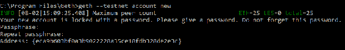
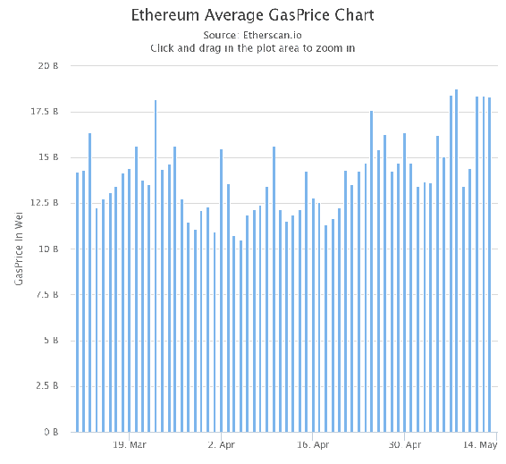
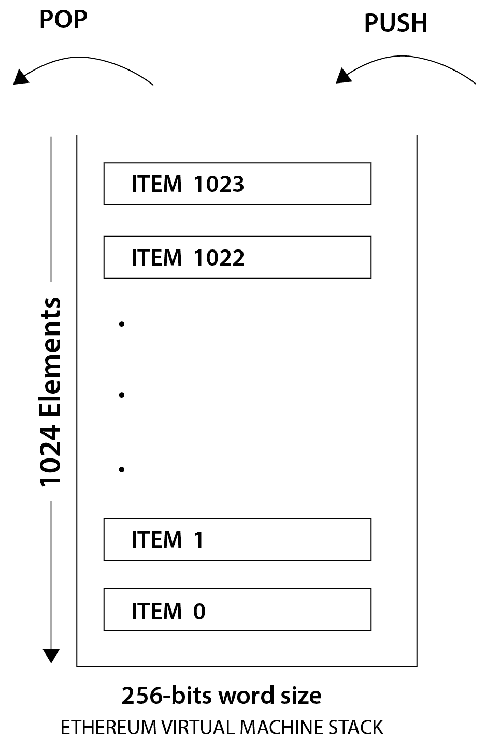
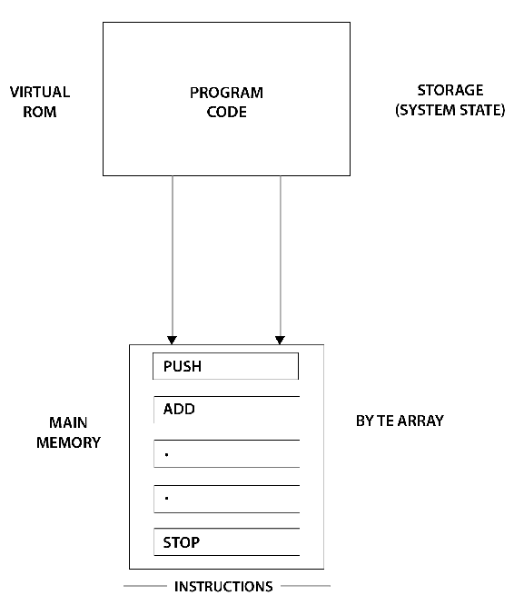
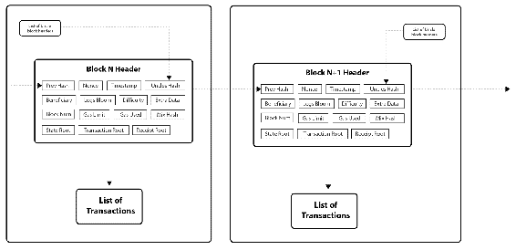
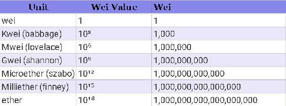
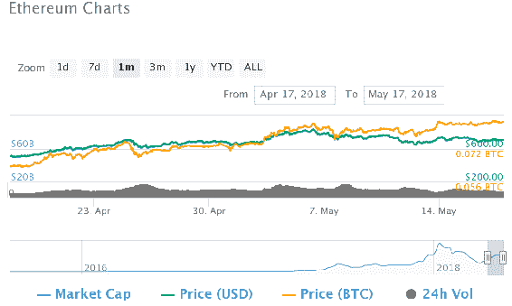

# 第十二章：以太坊 101

在前几章中，我们详细研究了区块链，比特币，替代加密货币和加密钱包。我们讨论了区块链在不仅是基于货币的应用程序中的用途和好处，而且在其他类似领域中的用途。我们还讨论了比特币如何改变了用于货币利益的区块链使用的格局以及它如何塑造了全球经济。

在本章中，我们将深入研究以太坊区块链。它当前是最大的社区支持的区块链项目，仅次于比特币，支持者和各种项目和代币在其上运行。在本章中，我们将讨论以下主题：

+   以太坊账户

+   以太坊网络

+   以太坊客户端，比如 Geth

+   以太坊区块链项目的执行环境

+   以太坊区块

+   以太坊虚拟机

+   在以太坊交易中使用燃气

+   以太和以太获取方法

# 介绍以太坊

以太坊是一个基于区块链的系统，具有特殊的脚本功能，允许其他开发者在其上构建分散和分布式应用程序。以太坊在开发者中主要以易于开发分散应用程序而闻名。以太坊和区块链之间存在差异。最重要的区别是以太坊区块链可以运行大多数分散应用程序。

以太坊概念于 2013 年底由加密货币研究员和开发者 Vitalik Buterin 构想。它是通过 2014 年 7 月至 8 月间的众筹出售获得资金。以太坊内建了 Turing 完全编程语言，即用于解决任何计算复杂性的编程语言。这个编程语言被称为 Solidity，用于创建合约，有助于在以太坊上创建分散应用程序。

以太坊于 2015 年 7 月 30 日上线，预挖了 11.9 百万枚代币进行众筹，用于资助以太坊的发展。以太坊的主要内部加密货币被称为**以太**。它被称为首字母缩写**ETH**。

# 以太坊的组件

让我们讨论一下以太坊的一些通用组件，其主要货币，网络以及其他细节。这将有助于更好地理解以太坊，也可以帮助我们看到与比特币的区别，以及为什么它拥有一个庞大的社区，目前使它成为最重要的加密货币和区块链项目，仅次于比特币区块链。

# 以太坊账户

**以太坊账户**在以太坊区块链中起着重要作用。这些账户包含钱包地址以及其他细节。有两种类型的账户：**外部拥有账户**（**EOA**），由私钥控制，和**合约账户**，由它们的合同代码控制。

EOAs 类似于比特币中由私钥控制的账户。合约账户与代码相关联，并带有私钥。外部拥有账户具有以太余额，并且可以发送交易，以消息的形式，从一个账户发送到另一个账户。另一方面，合约账户可以有以太余额和合约代码。当合约账户接收到消息时，代码会被触发以执行对内部存储的读取或写入功能，或者向另一个合约账户发送消息。

# 以太坊网络

只有两个以太坊节点具有相同的创世区块和相同的网络 ID 才能连接。根据使用情况，以太坊网络分为三种类型：

+   **MainNet**：这是以太坊当前的实时网络；目前最新版本的 MainNet 称为**homestead**。

+   **TestNet**：这用于测试目的，供开发人员在将合约部署到区块链之前测试智能合约和 DApps。最新版本的 TestNet 称为**Ropsten**。

+   **PrivateNet**：这用于通过生成新的创世区块来创建权限区块链。

所有前述类型相同，除了它们每个都有不同的创世区块和网络 ID；它们有助于区分各种合约账户和外部拥有账户，如果任何合约正在运行不同的创世区块，那么它们将使用不同的网络 ID 来区分它与其他合约账户。

以太坊正式使用一些网络 ID。其余的网络 ID 可以由合约账户使用。以下是一些已知的 ID：

+   **0**：这是以太坊公共预发布测试网，以项目名称奥林匹克（Olympic）而闻名。

+   **1**：此 ID 是以太坊公共主网络；它已经有许多版本：Frontier、Homestead 和 Metropolis。我们将在未来的部分中更多地讨论公共 MainNet。

+   **2**：这是最初的测试网所使用的 ID；在 2016 年末被弃用。

+   **3**：这是书写本书时最新的测试网。它于 2016 年末启动，因为旧的测试网出现了多个问题。

+   **4**：这是一个公共测试网，正在尝试 PoA 共识。它被称为**Rinkeby**。

# 以太坊公共 MainNet

公共 MainNet 的网络 ID 为 1，但由于以太坊拥有一个非常活跃的社区支持，因此以太坊区块链正在进行各种更新和升级；主要有四个阶段的以太坊网络；让我们详细讨论每个阶段：

+   **Frontier**：这是第一个正式的公共主网络；于 2015 年中期启动。

+   **Homestead**：这是 2016 年 3 月的一次重大升级。

+   **Metropolis**：这个升级阶段将给以太坊区块链带来许多升级。这个升级将通过硬分叉实施，分为两个阶段，**拜占庭**和**君士坦丁堡**。

+   **Serenity**：以太坊的这一版本将共识从 PoW 转移到**权益证明**（**PoS**）。这本质上是为了降低以太坊网络的功耗。

# 以太坊客户端

客户端是以太坊区块链的实现；它们具有各种功能。除了拥有常规钱包外，用户还可以观察智能合约、部署智能合约、清理多个以太币账户、存储以太币余额，并进行挖矿以参与 PoW 共识协议。

有各种各样的客户端使用不同的编程语言，一些由以太坊基金会官方开发，一些由其他开发者支持：

+   **Geth**：基于 Go 编程语言，有时也被称为**go-ethereum**

+   **Parity**：基于 Rust 编程语言，由 Ethcore 开发

+   **cpp-ethereum**：基于 C++构建，由以太坊基金会官方开发

+   **Pyethapp**：基于 Python 编程语言，由以太坊官方开发

+   **ethereumjs-lib**：基于 JavaScript 编程语言

+   **以太坊（Java）**：由 Ether camp 开发的基于 Java 的客户端

+   **ruby-ethereum**：由 Jan Xie 开发的基于 Ruby 的客户端

+   **ethereumH**：由 BlockApps 开发和维护的基于 Haskell 的客户端

上述列表包括目前在生产中使用的一些最显著的以太坊特定客户端。除了这些之外，还有许多其他客户端，它们不是由社区大力支持，或者处于开发阶段。现在让我们讨论最显著的以太坊客户端——**Geth**，或**go-ethereum**。

# Geth

这是目前在 Golang 上构建的最广泛使用的以太坊客户端之一；它是运行完整以太坊节点的命令行界面。它是 Frontier 版本的一部分，目前也支持 Homestead。Geth 可以允许其用户执行以下各种操作：

+   挖矿以太币

+   创建和管理账户

+   在两个以太坊账户之间转移以太币

+   创建、测试和部署智能合约

+   探索区块历史

# 安装 Geth

可以使用以下命令在 Ubuntu 系统上安装 Geth：

```
sudo apt-get install software-properties-common
sudo add-apt-repository -y ppa:ethereum/ethereum
sudo apt-get update
sudo apt-get install ethereum
```

安装完成后，运行`geth account new`来在你的节点上创建一个账户。可以使用`geth --help`命令来查看各种选项和命令。

在基于 Windows 的系统上，通过从[`geth.ethereum.org/downloads/`](https://geth.ethereum.org/downloads/)下载最新版本，然后下载所需的`zip`文件，解压缩`zip`文件，并打开`geth.exe`程序，可以更容易地安装 Geth。

# 管理账户

Geth 提供账户管理，使用`account`命令。有关 Geth 上与账户管理相关的最常用命令如下：

```
COMMANDS:
 list Print summary of existing accounts
 new Create a new account
 update Update an existing account
 import Import a private key into a new account
```

以下截图是执行上述代码后生成的输出：



当我们运行创建新账户的命令时，Geth 会在我们的区块链上提供一个地址：

```
$ geth account new
Your new account is locked with a password. Please give a password. Do not forget this password.
Passphrase:
Repeat Passphrase:
Address: {168bc315a2ee09042d83d7c5811b533620531f67}
```

当我们运行`list`命令时，它会提供与自定义密钥存储目录关联的帐户列表：

```
$ geth account list --keystore /tmp/mykeystore/
Account #0: {5afdd78bdacb56ab1dad28741ea2a0e47fe41331} keystore:///tmp/mykeystore/UTC--2017-04-28T08-46-27.437847599Z--5afdd78bdacb56ab1dad28741ea2a0e47fe41331
Account #1: {9acb9ff906641a434803efb474c96a837756287f} keystore:///tmp/mykeystore/UTC--2017-04-28T08-46-52.180688336Z--9acb9ff906641a434803efb474c96a837756287f
```

我们将在后续章节讨论挖矿和合约开发。

# 以太坊气体

以太坊区块链上的每个交易都需要支付计算成本；这是通过向交易发起者支付*气体*来实现的。交易执行的每个操作都与一定数量的气体相关联。

每个交易所需的气体量直接取决于要执行的操作数，基本上是为了覆盖整个计算。

简单来说，以太坊区块链上的每个交易都需要用气体付费。气体的最低价格是 1 Wei（以太币的最小单位），但这根据各种因素而增加或减少。以下是显示以太坊气体价格波动的图表：



# 以太坊虚拟机

**以太坊虚拟机**（**EVM**）是一个简单的基于堆栈的执行机器，充当智能合约的运行环境。EVM 的字长为 256 位，这也是每个堆栈项的大小限制。堆栈的最大大小为 1,024 个元素，并且采用**后进先出**（**LIFO**）队列系统。EVM 是一个图灵完备的机器，但受到运行任何指令所需的气体量的限制。气体充当一种推进剂，具有计算信用，这确保了任何错误代码或无限循环都无法运行，因为一旦气体用尽，机器将停止执行指令。以下图表显示了一个 EVM 堆栈：



EVM 在发生异常、气体不足或指令无效时支持异常处理。在这种情况下，EVM 会停止并向执行节点返回错误。气体耗尽时的异常通常称为**耗尽气体**（**OOG**）异常。

合约和 EVM 可用的存储有两种类型：一种是内存，另一种称为存储。内存就像 RAM 一样，并且在代码完全执行时清除。存储永久存储在区块链上。EVM 是完全隔离的，存储在存储或内存访问方面是独立的，如下图所示：



EVM 直接可访问的存储是**字数组**，它是非易失性的，并且是系统状态的一部分。程序代码存储在虚拟 ROM 中，可以使用**CODECOPY**访问，它基本上是将代码从当前环境复制到内存中。

# 执行环境

除了系统状态和气体外，还需要在执行环境中提供执行节点必须的各种其他元素和信息：

+   拥有执行代码的帐户的地址。

+   交易发起方地址。

+   执行的起始地址。

+   发起执行的交易的燃气价格。

+   输入数据或交易数据，取决于执行代理类型。如果执行节点是一个交易，则交易数据将被包含为输入数据。

+   发起代码执行或交易发起方的帐户地址。如果启动是通过交易，则为发送方的地址，否则为帐户的地址。

+   交易价值——此金额以 Wei（以太最小单位）表示。如果执行代理是一个交易，则它是交易的价值。

+   要执行的代码，呈现为迭代函数可以循环执行的字节数组。

+   当前区块的区块头。

+   在执行中的消息调用或合约创建交易的数量——即，在当前执行周期中正在执行的 CALL 或 CREATE 数量。

# 以太坊区块

以太坊区块链是一组类似于比特币区块链的必需参数的集合；以下是以太坊区块的主要元素：

+   区块头

+   交易列表

+   未确认叔/OMMer 的标题列表

# 区块头

区块头是各种宝贵信息的集合，定义了区块在以太坊区块链中的存在。看看以下内容：

+   **父哈希**：父区块头的 Keccak 256 位哈希。

+   **叔/OMMer 哈希**：该区块的叔/OMMer 列表的 Keccak 256 位哈希。

+   **受益人**：此区块挖矿收集所有费用的 160 位地址。

+   **状态根**：状态 trie 根节点的 Keccak 256 位哈希。它在所有交易被处理和执行后计算。

+   **交易根**：trie 结构根节点的 keccak 256 位哈希。交易 trie 表示包含在此区块中的交易列表。

+   **收据根**：这是基于 trie 结构根节点的 keccak 256 位哈希。这个 trie 由包含在区块中的所有交易的收据组成。收据是在每个交易成功执行后生成的。

+   **日志布隆**：这是由包含区块的每个交易收据的日志记录器地址和日志主题组成的布隆过滤器。

+   **难度**：每个区块的难度级别。这是通过前一个区块的难度和时间戳计算的。

+   **编号**：这是先前区块的总数；创世区块的编号为零。

+   **Gas 限制**：当前区块的燃料消耗上限。

+   **已使用 Gas**：包含在区块中的交易消耗的总燃料。

+   **时间戳**：这是区块初始化时间的时代 Unix 时间。

+   **额外数据**：此文件可用于存储与此区块相关的任意数据。它的大小必须不超过 32 个字节。

+   **Mixhash**：这包含一个 256 位哈希，与 nonce 结合使用；它用于证明已消耗足够的计算能力来挖掘块，是 PoW 机制的一部分。

+   **Nonce**：这是一个 64 位哈希，用于证明（与 mix hash 字段一起）已花费足够的计算工作来创建此块。

以下图表显示了一个块头的结构：



# 乌姆和叔叔

当挖掘出一个块时，以太坊激励矿工包含一个姑妈或叔叔列表，直到达到一定的限制。尽管在比特币中，如果在相同高度挖掘出一个块，或者如果一个块不包含交易，那么它被认为是无用的；但在以太坊中并非如此。包括叔叔并将它们作为以太坊区块链的一个重要部分的主要原因是，它们减少了发生攻击的可能性，因为它们阻止了中心化。

# 消息

消息是在两个账户之间传递的数据和价值。此数据包含数据和价值（乙醚金额）。消息可以在合同账户或外部拥有的账户之间以交易的形式发送。

# Ethash

**Ethash** 是以太坊中使用的**工作证明**（**PoW**）算法。它是 Dagger–Hashimoto 算法的最新版本。它类似于比特币，尽管有一个区别—Ethash 是一种内存密集型算法；因此，难以为其实施 ASIC。Ethash 使用 Keccak 哈希函数，该函数现在已标准化为 SHA-3。

# 乙醚

**乙醚**是与以太坊区块链相关联的主要加密货币；每个合同账户都可以创建自己的货币，但在以太坊区块链内使用乙醚支付对 EVM 上合同的执行。乙醚用于购买 gas，而乙醚的最小单位用作 gas 的单位。

由于 Wei 是最小的 Wei 单位，因此这里列出了一个表格，列出了各种面额及其常用名称，以及相关值：



# 采购乙醚

有各种方式可以获得乙醚进行交易、构建智能合约或分散应用程序：

+   通过加入挖矿池或进行独立挖矿来挖掘乙醚

+   使用加密货币交易平台进行交易，并与任何其他加密货币交换

+   从任何法定货币购买乙醚—有各种交易所允许从法定货币购买乙醚

# 交易

由于其庞大的社区支持和主要的积极发展，乙醚一直是每个人首选的投资机会。已知有超过 500 个交易所支持乙醚与其他加密货币或法定货币的交换。这里有一个价格图表，显示了从 2018 年 4 月 17 日到 2018 年 5 月 17 日的乙醚价格波动情况：



# 摘要

在本章中，我们讨论了以太坊的各种组成部分，包括其执行、网络和账户，还对以太坊的客户端进行了详细研究。我们还讨论了燃气和 EVM，包括其环境以及执行过程的工作原理。最后，我们讨论了以太坊块及其块头，以太坊算法，以及以太的获取。

在下一章中，我们将学习**Solidity**，这是以太坊区块链上合约编写的官方标准语言。学习 Solidity 将帮助我们更好地理解智能合约的开发和部署。
