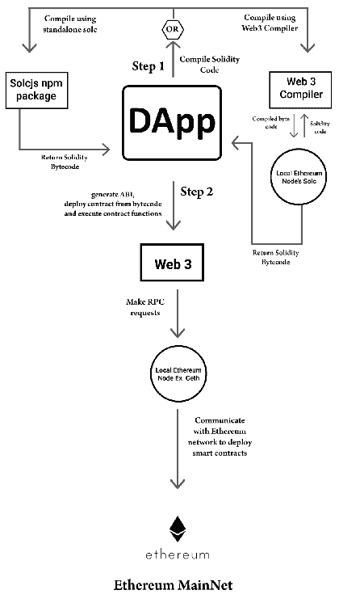

# Solidity 101

在前几章中，我们详细了解了以太坊。我们了解了以太坊网络、客户端、燃气、以太坊虚拟机和以太坊区块链的其他元素。有关以太坊的一个有趣事实是，任何人都可以使用以太坊创建自己的区块链。

以太坊在其平台上运行智能合约；这些是利用区块链技术执行所需操作的应用程序，使用户能够创建自己的区块链并发行自己的另类加密货币。这是通过使用 **Solidity** 编码实现的，它是一种用于编写将在以太坊区块链上执行并执行程序化任务的智能合约的合约导向编程语言。

Solidity 是一种静态类型的编程语言，运行在以太坊虚拟机上。它受到 C++、Python 和 JavaScript 的影响，于 2014 年 8 月提出，并由以太坊项目的 Solidity 团队开发。完整的应用部署在区块链上，包括智能合约、前端界面和其他模块；这被称为 **DApp** 或 **分散式应用**。

我们将在本章中涵盖以下主题：

+   Solidity 基础知识

+   Solidity 文件的布局

+   智能合约的结构

+   变量和函数

+   数据类型

+   引用类型

+   键值映射

# Solidity 基础知识

Solidity 并不是唯一用于以太坊智能合约的语言；在 Solidity 之前，还有其他语言，但它们并不成功。以下是当前（截至 2018 年 8 月）与以太坊兼容的语言的简要列表：

+   **Mutan**：受 Golang 启发，于 2015 年 3 月被弃用。

+   **LLL**：Lisp-like 语言的缩写。虽然它仍然受支持，但很少使用。

+   **Serpent**：虽然这种语言类似于 Python，但不再推荐使用。

+   **Solidity**：以太坊基金会引入的第四种语言，迄今为止最成功的用于开发智能合约的语言。它是最有文档记录、最稳定且拥有庞大社区支持的。

+   **Vyper**：新引入的，比 Solidity 简单易懂得多，尽管它目前没有太多社区支持。它受 Python 的影响。

Solidity 也被称为合约导向语言，因为合约类似于面向对象语言中的类。Solidity 语言 loosely 基于 ECMAScript（JavaScript）；因此，了解 ECMAScript 将有助于理解 Solidity。以下是开发、测试和部署以 Solidity 编写的智能合约所需的一些工具：

+   **测试网**：选择要工作的测试网，要使用的指定网络 ID。

+   **编译器**：选择所需的编译器，例如 `solc`，它是 Solidity 编译器；它包含在大多数节点中，并且还作为一个独立的软件包提供。

+   **Web3.js**：连接以太坊网络和我们的 DApp 的库，通过 HTTP 或 IPC 网络连接。

+   **框架**：从可用于合约编译、部署和其他任务的框架中选择一个是很重要的。一些常用的框架包括 Truffle、Embark、Dapple 等。

除了我们已经提到的关键工具之外，还有各种其他工具可用于开发在以太坊区块链上运行的智能合约，例如理解合约流程、发现安全漏洞、运行测试应用程序、编写文档等等。请看下面的图示：



# 在 Solidity 上工作的基础知识

如果你经常编程，你应该已经了解到代码编辑器或**集成开发环境**（**IDE**）。目前已经有一系列各种 IDE 的集成工具列表；除此之外，以太坊基金会还发布了一个基于浏览器的 IDE，其中包含了集成编译器和 Solidity 运行环境，无需服务器组件即可编写和测试智能合约。你可以在 [remix.ethereum.org](http://remix.ethereum.org) 找到它。

# 使用编译器

对于小型和基于学习的 DApps 项目，建议使用以太坊基金会的基于浏览器的编译器：**Remix**。另一种方法是将 Solidity 编译器安装到您的计算机上。可以使用以下命令从 `npm` 安装 `solc`：

```
npm install -g solc
```

Solidity 也可以通过克隆 GitHub 链接上的 Git 存储库来构建：[`github.com/ethereum/solidity.git`](https://github.com/ethereum/solidity.git)。

# 在 Solidity 中编程

在本节中，我们将讨论 Solidity 源文件的结构和元素；我们将讨论布局、结构、数据类型、类型、单位、控件、表达式以及 Solidity 的其他方面。Solidity 文件的格式扩展名是`.sol`。

# 设计 Solidity 文件的布局

Solidity 正在进行积极的开发，并且有大量来自庞大社区的常规更改和建议；因此，在源文件的开头指定 Solidity 文件的版本是很重要的，以避免任何冲突。这通过 Pragma 版本来实现。这在 Solidity 文件的开头定义，以便任何打算运行该文件的人都知道先前的版本。看看这段代码：

```
pragma solidity ⁰.4.24;
```

通过指定版本号，该特定源文件将与指定版本号之前或之后的版本一起编译。

# 导入文件

与 ECMAScript 类似，Solidity 文件使用`import`语句声明，如下所示：

```
import "filename.sol";
```

上述语句将把`filename.sol`文件中的所有符号导入到当前文件中作为全局语句。

在导入文件时也支持路径，因此您可以像 JavaScript 一样使用 `/` 或 `.` 或 `..`。

# 注释

单行(`//`)注释和多行(`/* ... */`)注释被使用，尽管除此之外还有另一种称为**Natspec 注释**的注释样式，这也是可能的；在这种类型的注释中，我们可以使用`///`或`/** ... */`，它们只能在函数声明或语句之前使用。

Natspec 是自然规范的简称；根据最新的 Solidity 版本（0.4.24），这些注释不适用于变量，即使变量是公开的也是如此。以下是一个小的代码片段，其中包含了这些类型的注释的示例：

```
pragma solidity ⁰.4.19;

/// @title A simulator for Batman, Gotham's Hero
/// @author DC-man
/// @notice You can use this contract for only the most basic simulation
/// @dev All function calls are currently implement without side effects
contract Batman {
 /// @author Samanyu Chopra
 /// @notice Determine if Bugs will accept `(_weapons)` to kill
 /// @dev String comparison may be inefficient
 /// @param _weapons The name weapons to save in the repo (English)
 /// @return true if Batman will keep it, false otherwise
 function doesKeep(string _weapons) external pure returns (bool) {
 return keccak256(_weapons) == keccak256("Shotgun");
 }
}
```

# 标签

它们用于 Natspec 注释；每个标签根据其用法具有自己的上下文，如下表所示：

| **标签** | **用于** |
| --- | --- |
| `@title` | 智能合约的标题 |
| `@author` | 智能合约作者 |
| `@notice` | 函数的解释 |
| `@dev` | 开发者的解释 |
| `@param` | 参数的说明 |
| `@return` | 返回类型的解释 |

# 合约的结构

Solidity 中的每个合约类似于类的概念。合约可以从其他合约继承，类似于类。一个合约可以包含以下的声明：

+   状态变量

+   函数

+   函数修饰符

+   事件

+   结构类型

+   枚举类型

# 状态变量

这些值被永久存储在合约存储中，例如：

```
pragma solidity ⁰.4.24;

contract Gotham {
 uint storedData; // State variable
 // ...
}
```

# 函数

函数可以在内部或外部调用，例如：

```
pragma solidity ⁰.4.24;

contract Gotham {
 function joker() public Bat { // Function
 // ...
 }
}
```

# 函数修饰符

函数修饰符可用于在声明中修改函数的语义。也就是说，它们被用来改变函数的行为。例如，它们被用于在执行函数之前自动检查条件，或者根据需要在给定时间段内解锁函数。它们可以被派生合约覆盖，如下所示：

```
pragma solidity ⁰.4.24;

contract Gotham {
 address public weapons;

modifier Bank() { // Modifier
 require(
     msg.sender == coins,
     "Only coins can call this."
     );
     _;
 }

    function abort() public coinsbuyer { // Modifier usage
 // ...
 }
}
```

# 事件

事件允许通过 DApp 前端方便地使用 EVM。事件可以被监测和维护。请看以下代码：

```
pragma solidity ⁰.4.24;

contract Attendance {
      event Mark_attendance(string name, uint ID); // Event

    function roll_call() public marking {
             // ...
                 emit Mark_attendance(Name, ID); //Triggering event
         }
}
```

# 类型

在 Solidity 中，每个变量的类型都需要在编译时指定。复杂类型也可以通过组合复杂类型在 Solidity 中创建。在 Solidity 中有两类数据类型：**值类型**和**引用类型**。

# 值类型

值类型被称为**值类型**，是因为这些类型的变量在自己分配的内存中保存数据。

# 布尔

这种类型的数据有两个值，要么为真，要么为假，例如：

```
bool b = false;
```

上述语句将`false`赋给布尔数据类型 `b`。

Solidity 中的运算符与 JavaScript 运算符相似，例如算术运算符、赋值运算符、字符串运算符、比较运算符、逻辑运算符、类型运算符和位运算符。这些运算符可以根据允许的用法与各种值类型一起使用。

# 整数

这个数值类型分配整数。整数有两个子类型，分别是`int`和`uint`，分别是有符号整数和无符号整数类型。内存大小在编译时分配；使用`int8`或`int256`来指定，在这里数字代表内存中分配的大小。只使用`int`或`unit`来分配内存，默认情况下分配最大的内存大小。

# 地址

这个数值类型保存了一个 20 字节的数值，这个大小等同于以太坊地址的大小（40 个十六进制字符或 160 位）。看看这个：

```
address a = 0xe2793a1b9a149253341cA268057a9EFA42965F83
```

这个类型有几个成员可以用来与合同交互。这些成员如下：

+   `balance`

+   `transfer`

+   `send`

+   `call`

+   `callcode`

+   `delegatecall`

`balance` 返回地址的 wei 单位的余额，例如：

```
address a = 0xe2793a1b9a149253341cA268057a9EFA42965F83;
uint bal = a.balance;
```

`transfer`用于从一个地址转账到另一个地址，例如：

```
address a = 0xe2793a1b9a149253341cA268057a9EFA42965F83;
address b = 0x126B3adF2556C7e8B4C3197035D0E4cbec1dBa83;
if (a.balance > b.balance) b.transfer(6);
```

当我们使用`transfer`或`send`成员时，消耗的燃气几乎相同。`transfer`是从 Solidity 0.4.13 开始引入的，因为`send`不发送任何燃气，也不传播异常。`transfer`被认为是从一个地址安全地发送以太到另一个地址的一种方式，因为它会抛出一个错误并允许某人传播该错误。

`call`、`callcode`和`delegatecall`用于与没有**应用程序二进制接口**（**ABI**）的函数交互。`call`返回一个布尔值，指示函数是否在 EVM 中成功运行或终止。

当`a`调用`b`时，代码在`b`的上下文中运行，使用的是`b`的存储。另一方面，当`a`对`b`做`callcode`时，代码在`a`的上下文中运行，并使用`a`的存储，但是`a`的代码和存储会被使用。

`delegatecall`函数用于委托一个合同使用另一个合同的存储，如有需要。

所有这些成员：`call`、`delegatecall`和`callcode`都不建议使用，除非真的有必要，因为它们倾向于破坏 Solidity 的类型安全性。有可能`callcode`将在不久的将来被弃用。

# 数组数值类型

Solidity 有固定和动态数组数值类型。关键字从`bytes1`到`bytes32`在固定大小的字节数组中。另一方面，在动态大小的字节数组中，关键字可以包含字节或字符串。`bytes`用于原始字节数据，`strings`用于用`UTF-8`编码的字符串。

`length` 是一个成员，用于返回固定大小的字节数组或动态大小的字节数组的长度。

固定大小数组初始化为`test[10]`，动态大小数组初始化为`test2[`。

# 文字

文字用于表示一个固定的值；有多种类型的文字被使用；它们如下：

+   整数字面值

+   字符串字面值

+   十六进制字面值

+   地址文字

整数字面量由从 0 到 9 的数字序列组成。八进制字面量和以 `0` 开头的字面量无效，因为以太坊中的地址以 `0` 开头。看一下这个：

```
int a = 11;
```

字符串字面量使用一对双引号(`"..."`)或单引号(`'...'`)声明，例如：

```
Test = 'Batman';
Test2 = "Batman";
```

十六进制字面量以关键字 `hex` 为前缀，并用双引号 (`hex"69ed75"`) 或单引号 (`hex'69ed75'`) 包围。

通过地址校验和测试的十六进制字面量是`address` 类型的字面量，例如：

```
0xe2793a1b9a149253341cA268057a9EFA42965F83;
0x126B3adF2556C7e8B4C3197035D0E4cbec1dBa83;
```

# 枚举

枚举允许在 Solidity 中创建用户定义类型。枚举可转换为所有整数类型。下面是 Solidity 中一个枚举的示例：

```
enum Action {jump, fly, ride, fight};
```

# 函数

有两种类型的函数：内部函数和外部函数。内部函数只能从当前合约内部调用。外部函数可通过外部函数调用方式调用。

# 函数修饰符

有各种可用的修饰符，对于基于 Solidity 的函数，你不必使用。看看这些：

+   `pure`

+   `constant`

+   `view`

+   `payable`

`pure` 函数不能从存储中读取或写入；它们只是根据其内容返回一个值。`constant` 修饰符函数不能以任何方式在存储中写入。尽管，自 Solidity 版本 0.4.17 起，`constant` 被废弃以为`pure` 和`view` 函数腾出位置。`view` 的作用就像`constant` ，它的函数不能在任何方式改变存储。`payable` 允许函数在调用时接收以太币。

函数可以通过指定每个之间用空格分隔的修饰符来使用多个修饰符；它们按照编写顺序进行评估。

# 引用类型

这些是通过引用传递的；它们非常消耗内存，由于分配了它们构成的内存。

# 结构体

结构体是在一个逻辑组下声明的复合数据类型。结构体用于定义新类型。结构体不能包含自己类型的成员，虽然一个结构体可以是映射成员的值类型。下面是结构体的一个示例：

```
struct Gotham {

address Batcave;
uint cars;
uint batcomputer;
uint enemies;
string gordon;
address twoface;

}
```

# 数据位置

这指定了特定数据类型将被存储的位置。它与数组和结构体一起使用。数据位置使用 `storage` 或 `memory` 关键字来指定。还有第三种数据位置，`calldata`，是不可修改且非持久的。外部函数的参数使用 `calldata` 存储器。默认情况下，函数的参数存储在 `memory` 中；其他局部变量使用 `storage`。

# 映射

`mapping` 用于键值映射。`mapping` 可以被视为虚拟初始化的哈希表，使得每个可能的键都存在并映射到默认值。默认值为全零。键从不存储在 `mapping` 中，只有 `keccak256` 哈希用于值查找。`mapping` 定义方式与任何其他变量类型相同。看一下这段代码：

```
contract Gotham {

    struct Batman {
        string friends;
        string foes;
        int funds;
        string fox;
    }

    mapping (address => Batman) Catwoman;
   address[] public Batman_address;
}
```

前面的代码示例显示了 `Catwoman` 被初始化为 `mapping`。

# 单位和全局变量

全局变量可以被任何 Solidity 智能合约调用。它们主要用于返回有关以太坊区块链的信息。其中一些变量还可以执行各种功能。时间和以太的单位也可以全局使用。没有后缀的以太货币数被假定为 wei。与货币类似，时间相关的单位也可以使用，并且它们之间可以进行转换。

# 摘要

在本章中，我们详细讨论了 Solidity，了解了编译器，进行了关于 Solidity 编程的详细研究，包括研究 Solidity 文件的布局、合约的结构以及值和引用类型。我们还学习了关于映射的内容。

在下一章中，我们将运用本章的新知识来开发一个实际的合约，并将其部署到测试网络上。
