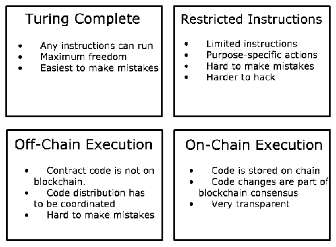

# 第十四章：智能合约

智能合约的概念最早是由研究人员尼克·萨博在 1990 年代中期构想出来的。在他的论文中，他将智能合约描述为一组承诺，以数字形式指定，其中包括各方执行这些承诺的协议。这个描述可以分为四个部分：

+   一组承诺

+   数字形式

+   通信和执行的协议

+   自动触发的行动的性能

如您所见，在此过程中并没有直接指定区块链，因为区块链技术当时尚未发明，直到另外 13 年才被发明。然而，随着区块链技术的发明，智能合约突然变得更加可行。

智能合约和区块链技术是独立的概念。区块链可以存在而没有智能合约（例如，比特币实际上没有内置真正的智能合约能力），而智能合约可以在没有区块链的情况下构建。但是，区块链是一种非常适合开发智能合约的技术，因为它允许无信任、去中心化的交换。基本上，区块链提供了智能合约所需的四项中的两项：数字形式和在不同方之间进行通信和执行操作的协议。

在本章中，我们将介绍一些不同的区块链网络及其对智能合约技术的方法。本章将涵盖以下主题：

+   为什么使用智能合约？

+   智能合约的方法

+   智能合约的局限性

通常，各种智能合约方法可以分为不同类型：**图灵完备**，**受限指令**，**链下执行** 和 **链上执行**，如下图所示：



在系统上执行的智能合约类型决定了性能，系统上可以执行和不能执行的内容，复杂性，以及当然，安全性的水平。

在我们进一步探讨之前，让我们讨论一下为什么智能合约备受追捧，甚至被认为是具有革命性的。

# 为什么要使用智能合约？

在智能合约出现之前的世界充满了不确定性。法律合同，即使是简单的合同，也不一定会被遵守，而且在大多数法律体系中寻求救济的成本非常昂贵，即使在法律体系不腐败的国家也是如此。在世界许多地方，合同几乎一文不值，通常只有具有重大政治或财务实力的各方才能强制执行。对于经济或政治体系中较弱的行动者来说，这是一种可怕而不公平的境遇。

我们之前提到的问题主要源于人为因素。只要一个人参与合同的执行，他们就可能是腐败的、懒惰的、误导的、偏见的等等。相比之下，智能合约是以代码编写的，并且旨在无论涉及哪些方都能忠实执行。这为更安全、更便宜、更快速、更公平的结果提供了机会。

让我们更深入地了解智能合约的关键优势，在以下小节中进行讨论。

# 自动化各方之间的流程和解决方案

智能合约最直接的优势是它们减少了即使是成功和忠实执行的协议所涉及的劳动和痛苦。举个例子，考虑两家公司之间的一个简单的采购订单和发票。想象一下，一个名为**FakeCar Inc.**的公司决定从他们的供应商 Wheelmaster 那里购买 1000 辆轮子。他们之间达成协议，每个轮子的价格是 $20，支付将在轮子送到 FakeCar 时进行。一开始，轮子可能会通过货运公司运送，途中经过多个人的手。一旦到达，FakeCar 需要扫描和检查每个轮子，做笔记，然后向 Wheelmaster 发出支票或电汇。根据涉及的距离，轮子可能由多家公司承运：一家货运公司，洲际航运，另一家货运公司，最后是 FakeCar 的制造设施。在每个阶段，都存在损坏、丢失或交付错误的可能性。一旦交付完成，FakeCar 就需要发出转账以支付发票。即使一切顺利，这个过程也可能需要几周。在此期间，FakeCar 和 Wheelmaster 都不得不担心他们是否能得到他们的轮子或他们的钱。

现在让我们看看这个流程如何通过智能合约来工作：

1.  FakeCar 在区块链上发布了一个采购订单，购买 1000 辆轮子，每辆轮子价格为$20，有效期为 1 个月。

1.  Wheelmaster 从他们的供应商那里发出了一个交货请求，要求一个月内交货，并接受了采购订单。

1.  FakeCar 在智能合约托管中拨款采购订单；Wheelmaster 可以确信如果轮子到货，他们将会得到支付。

1.  Wheelmaster 看到有资金可用于支付轮子费用，并与一个跟踪每个步骤的公司合作，在区块链上记录每个步骤，并接受支付任何遗失的轮子的条款。他们（或其保险公司）还向一个装运托管合同提供足够的资金，以支付可能遗失的装运事件。一旦 FakeCar 签署收据，合同将自动退还运输商的款项。

1.  轮子已发货并送达，FakeCar 的托管被释放，保险金返回给运输公司。这发生在 FakeCar 登记收据并运输公司签署变更监护权的时刻。

在这种情况下，如果所有参与方都参与到基于区块链的智能合约生态系统中，支付和保险可以得到即时验证和处理，即使跨越国界、文化和语言，结果是所有参与方的结果确定性大幅增加，效率随之增加。例如，如果 Wheelmaster 能够确信他们的发票将被支付，那么他们可以更有效地做出业务决策。

# 实例：

截至目前，使用区块链和智能合约完成的第一笔重大物流交易在 Corda 区块链上由汇丰银行和荷兰银行完成，涉及从阿根廷到马来西亚的大豆运输。据银行称，这种转移过去非常耗时，需要五到十天。通过区块链，整个金融问题在不到 24 小时内就得到解决了。

智能合约的使用仍处于起步阶段，然而这项技术已经使跨境金融服务的摩擦减少了 80-90%。随着技术和周围生态系统的改善，优势可能会变得更加极端。

# 提高透明度

如前所述，全球组织经历的负面因素之一是，对于许多交易，信任是必需的。这在金融交易中尤其如此，采购订单、发票和货物在多个方之间移动。这里的信任问题很多。不仅是是否有人会付款的问题，还有他们是否根本就付不起？他们是否有准时付款的历史，如果没有，他们的付款历史有多糟糕？在许多情况下，任何市场中的买家和卖家都拥有非常有限的信息。这在国际上尤为真实。这就是区块链和智能合约可以发挥作用的地方。

# 结束集中式数据

在美国，每个人都有一个信用评分，由三家大型信用机构计算。这些机构及其方法是不透明的。购买此信息的人以及被报告的人都不被允许深入了解评分是如何计算的，也不能直接更新此信息。信用机构的错误可能对某人融资购买房屋或汽车的能力造成毁灭性影响，给消费者带来宝贵的时间和金钱损失。尽管如此，如果消费者在其信用报告中发现错误，他们必须请求发行者更新，如果该组织拒绝，他们几乎没有选择。更糟糕的是，这些发行者已经证明他们不良地保管了他们收集的私人财务信息。例如，2017 年，Experian 遭受了一次大规模数据泄露事件，泄露了超过 1 亿人的记录。如果这些机构被区块链系统和智能合约取代，人们将能够直接看到规则并更新记录，而不必支付可能不诚实的中间人。

在当前市场上，大公司具有优势：他们既可以支付这些第三方服务的金融数据，也可以支付需要随时间跟踪信息的人员和系统。较小的公司没有获得这样的规模经济，使他们处于竞争劣势，并增加了他们的开销，甚至可能因为缺乏信息而使糟糕的决策使他们破产。然而，即使对于较大的公司来说，汇编这些数据的成本和费用也是累积的。随着越来越多关于信任的数据变得公开并由智能合约自动化，市场竞争格局将会平衡，希望能将市场上的不诚实行为排除在外。这应该会带来市场信心的增加，以及开销的降低，从而增加利润、降低价格，或者两者兼而有之。

# 增加公平性

在美国，曾经有一个被称为**红线**的过程，特定族裔的人们被拒绝贷款和获取金融服务，尤其是抵押贷款。这些不公平的做法在某种程度上仍在继续，因为贷款的标准和流程以及利率计算方式都隐藏在中心化组织中。这种现象并不局限于美国；世界上许多地区的种族、宗教和其他偏见扭曲了原本应该是客观决策的事实。通过基于智能合约的系统，规则将会是公开的和可审计的，以确保公平和准确性。

# 智能合约方法

智能合约的一种方法是允许全功能软件嵌入或与区块链并行，能够响应区块链事件。这是 Hyperledger Fabric、Ethereum、NEO 等公司采取的一种方法。这种方法提供了最大的灵活性，因为基本上没有什么是不能写入区块链系统的。这种权力的缺点是存在出错的风险。可用选项越多，就必须测试的边界情况和排列组合越多，代码中就可能存在未发现的漏洞的风险就越高。

智能合约的另一种方法是为了增加安全性和降低错误成本而大幅减少可能发生的范围。目前的权衡是灵活性与安全性。例如，在恒星生态系统中，智能合约被制作为一组操作。在恒星中，只有十一种操作：

+   创建账户

+   支付

+   路径支付

+   管理报价

+   创建被动报价

+   设置选项

+   更改信任

+   允许信任

+   账户合并

+   通货膨胀

+   管理数据

这些操作本身有多种选项和排列方式，因此能够实现相当多的行为。然而，使用这些操作来执行像 DAO 或其他链上治理组织之类的功能并不容易。相反，这种功能必须托管在链下。同样地，在 Stellar 中没有明确的方法来管理类似于 ERC-721 代币，这些代币将跟踪类似于交易卡或甚至是房地产的等价物。Stellar 的智能合约系统专注于可互换资产的转移，如货币。因此，它可以非常快速地扩展，轻松处理多重签名账户和托管，并且以非常高的吞吐量在几秒钟内处理交易。以太坊更灵活，但多重签名功能、代币本身等都需要用 Solidity 编写的软件来创建。以太坊显然更灵活，但需要更多的代码，因此存在更高的缺陷风险。

# 以太坊智能合约示例

最广泛使用智能合约的区块链是以太坊。在这里呈现的所有具备智能合约能力的网络中，它不仅是使用最广泛的，而且拥有最大的公共分布式应用生态系统。以太坊如此受欢迎的一个原因是，它对智能合约的表示相对直观且易于阅读。在本节中，我们将看一个常见的基于以太坊的智能合约，它满足前面四个条件，并且相对容易理解：一个代币销售合约。以下代码将用 Solidity 编写；有关更多详情，请参阅 Chapter 13，*Solidity 101*，以及 Chapter 15，*以太坊开发*。

# 承诺

智能合约的第一个方面是它必须做出一系列的程序性承诺。我们选择查看代币销售合约的原因是它有一个非常简单的承诺：如果你向合约发送以太坊，合约将自动向您的账户发送一个新代币。让我们看一些基本代码，这是明确不是用于生产的；这是简化的代码，以使某些概念更清晰。这段代码来自于`StandardToken`合约，这是基于 OpenZeppelin 项目的一部分（你将在 *References* 部分找到相关链接），该项目具有全功能且经过审计的代码来实现相同的效果，但更复杂一些。

首先，这里是一个`ERC20`代币的接口合约，我们将其保存为名为`ERC20.sol`的文件：

```
pragma solidity ⁰.4.23;
interface ERC20 {
 function totalSupply() public view returns (uint256);
  function balanceOf(address who) public view returns (uint256);
  function transfer(address to, uint256 value) public returns (bool);
  function allowance(address owner, address spender) public view returns (uint256);
  function transferFrom(address from, address to, uint256 value) public returns (bool);
  function approve(address spender, uint256 value) public returns (bool);
  event Transfer(address indexed from, address indexed to, uint256 value);
  event Approval(address indexed _owner, address indexed _spender, uint256 _value);
}
```

接下来，我们将在我们的众筹合约中引用该代币接口，该合约将在以太币支付后发送一个`ERC20`代币：

```
pragma solidity ⁰.4.23;
import "./ERC20.sol";

contract Crowdsale {

 // The token being sold, conforms to ERC20 standard.
 ERC20 public token;

 // 1 tokens per Eth, both have 18 decimals.
 uint256 public rate = 1; 

 constructor(ERC20 _token) public {
    token = _token;
 }

 function () external payable {
    uint256 _tokenAmount = msg.value * rate;
    token.transfer(msg.sender, _tokenAmount);
 }
}
```

这是一个非常简化的合约，但再次强调，这对于完整的真实的 `Crowdsale` 是不够的。然而，它确实说明了智能合约的关键概念。让我们看看每一部分。`constructor` 方法需要一个对 `ERC20` 代币的引用，这是将发送以太坊的购买者所得到的代币，如以下代码所示：

```
constructor(ERC20 _token) public {
    token = _token;
}
```

由于 Solidity 的工作方式，除非加载了代币，否则此合约无法运行。因此，这段代码隐含的第一个承诺是：必须有一个可供购买的`ERC20`代币。第二个承诺是转换率，这里设置为非常简单的 1。对于每一个 wei（以太坊中的最小货币单位），购买此代币的人将获得 1 单位的新代币。以太坊有 18 个小数位数，大多数代币也是如此，因此可以假定这将使以太坊与此代币的转换率现在是 1:1。这带我们来到智能合约必要方面的第 4 点：自动执行。以下代码处理此问题：

```
function () external payable {
    uint 256 _tokenAmount = msg.value * rate; //Calculate tokens purchased
    token.transfer(msg.sender, _tokenAmount); //Execute send on token contract.
}
```

由于这是代码，智能合约应该以数字形式存在的要求是显而易见的。这里的自动化方面也很简单。在以太坊中，`msg.value`保存发送命令的以太币货币的价值。当合约接收到以太币时，它会计算购买者应该收到的代币数量并发送它们：无需人类交互，也不需要或可能有可信的方。同样，没有人能够干预，因为一旦部署到网络上，以太坊中的代码是不可变的。因此，使用此智能合约的发件人可以绝对确保他们将收到他们的代币。

# 安全注意事项

重要的是要了解智能合约所在的领域：分散的、异步的网络。由于生活在这个生态系统中，存在着并不总是显而易见的安全注意事项，可能会导致问题。为了说明这一点，我们将研究 `ERC20` 标准的两个相关函数：`approve` 和 `transferFrom`。以下是来自 OpenZeppelin 的 `approve` 函数的代码：

```
function approve(address _spender, uint256 _value) public returns (bool) {
   allowed[msg.sender][_spender] = _value;
   emit Approval(msg.sender, _spender, _value);
   return true;
 }
```

`approve` 函数允许代币所有者表示他们已经批准将其代币转移到另一个帐户。然后，针对不同的事件，可以进行未来的转移。这如何发生取决于应用程序，但是例如代币销售，通过批准转移，区块链应用程序可以随后调用 `transferFrom` 并移动代币，也许是为了接受支付然后执行操作。让我们看看那段代码：

```
function transferFrom(address _from,address _to,uint256 _value) public returns (bool) {
   require(_to != address(0)); // check to make sure we aren't transfering to nowhere.

   // checks to ensure that the number of tokens being moved is valid.
   require(_value <= balances[_from]); 
   require(_value <= allowed[_from][msg.sender]);

   // execute the transfer.
   balances[_from] = balances[_from].sub(_value);
   balances[_to] = balances[_to].add(_value);
   allowed[_from][msg.sender] = allowed[_from][msg.sender].sub(_value);

   //Record the transfer to the blockchain.
   emit Transfer(_from, _to, _value); 
   // let the calling code or app know that the transfer was a success.
   return true;
 }
```

这两个函数共同工作。希望使用该应用程序的用户使用 `approve` 允许支付，应用程序调用 `transferFrom` 以接受。但由于调用的异步性质，存在缺陷是可能的。

想象一个应用，在这个应用中，用户可以支付代币来加入数字俱乐部——40 代币可以获得基本会员资格，60 代币则可以获得增强会员资格。用户也可以将代币交易给其他人，或者根据他们的意愿出售代币。这两个功能的理想情况是，用户批准了 40 代币，应用程序将此注册并调用`transferFrom`来移动这 40 代币，然后作为智能合约的一部分授予用户访问权限。到目前为止一切顺利。

需要牢记的是，这里的每个操作都需要时间，并且事件的顺序是不固定的。实际上，发生的是用户向网络发送消息，触发`approve`，应用程序发送另一条消息，触发`transferFrom`，然后一切会在区块被挖掘时解决。如果这些交易的顺序出现错误（`transferFrom`在`approve`之前执行），交易将失败。此外，如果用户改变主意，决定将批准的代币从 40 个更改为 60 个呢？用户意图如下：

1.  **User**: `approve` 40 (block 1)

1.  **User**: `approve` 60 (block 1)

1.  **App**: `transferFrom` 60 to App (block 1)

1.  **App**: Grant enhanced membership (block 2)

最终，用户支付了 60 代币，并得到了他们想要的东西。但因为这些事件都是异步的，并且订单是由矿工决定的，所以这个顺序并不是保证的。在这里，可能会发生以下情况：

1.  **User**: `approve` 40 (block 1)

1.  **App**: `transferFrom` 40 to App (block 1)

1.  **User**: `approve` 60 (block 2,因为矿工没有在块 1 中包含它)

1.  **App**: `transferFrom` 60 to App (Block 2)

现在用户意外支付了 100 代币。以下是另一个排列组合：

1.  **User**: `approve` 40 (block 1)

1.  **User**: `approve` 60 (block 1)

1.  **App**: `transferFrom` 40 to app (block 2)

1.  **App**: Grants basic membership (block 2)

1.  **App**: `transferFrom` 60 to app (block 3) | 失败

在这个顺序结束时，用户仍然批准了 20 代币，而尝试获得增强会员资格失败了。虽然可以并且应该编写应用程序来避免这些问题，比如允许用 20 代币升级会员资格，并在调用`transferFrom`之前检查最大批准数量，但这种对细节的关注并不是应用程序作者所保证或自动的。

重要的是要了解的是，在以太坊中，竞争条件和顺序问题是非常重要的。用户无法控制区块链上事件的顺序，应用程序也不行。相反，决定哪些交易发生在哪个块中以及什么顺序的是矿工。在以太坊中，燃料价格影响矿工为交易给出的优先级。其他影响可能涉及最大块燃料限制，已经在块中的交易数量，以及成功解决块的矿工是否已经在网络上看到了交易。因此，智能合约不能假设事件的顺序就是预期的那样。

# 处理智能合约中的威胁

每个去中心化网络都将不得不处理由不同排序引起的竞态条件。关键是要仔细评估智能合约是否可能存在竞态条件和其他攻击。判断竞态条件错误是否可能的方法就是判断是否涉及到多个函数调用，直接或间接都可以。在前述情况中，用户和应用程序都调用了函数；因此，竞态条件是可能的，还可能发生一种称为前端运行的攻击。单个方法内也可能存在竞态条件，因此智能合约开发者不应放松警惕。

每个网络都有不同的合约执行模型，因此每个网络都有不同的最佳实践。对于以太坊，Consensys 在 [`consensys.github.io/smart-contract-best-practices/`](https://consensys.github.io/smart-contract-best-practices/) 维护着智能合约最佳实践清单。

在发布任何智能合约之前，强烈建议组织编写广泛的单元测试和模拟测试，然后根据该网络的最佳实践审计智能合约。

# 智能合约的局限性

智能合约拥有巨大的权力，但它们确实有局限性。重要的是要注意，这些系统只有建造它们的人一样好。到目前为止，许多智能合约系统由于未预料到的错误和不属于初始设计的事件而失败。在许多情况下，这些只是技术缺陷，可以在时间内至少修复。然而，随着最近急于将区块链技术用于一切，我们可能会开始看到更多实质性的失败，因为人们未能理解技术的限制。要使区块链真正发挥最大的商业影响，必须解决其优点和局限性。

# 数据质量和错误

像所有系统一样，智能合约的效果取决于其作用的数据。智能合约从网络接收到错误或不正确的信息仍将执行。在区块链系统中，这可能是一个巨大的问题，因为大多数由人类或合约发起的交易都是不可撤销的。因此，如果在区块链上放置了错误、欺诈或其他缺陷的信息，那么智能合约仍将忠实执行。智能合约现在不是在促进网络的正常运行，而是在帮助传播错误。

以前在 FakeCar 和 Wheelmaster 之间运输轮胎的例子中，如果在运输途中装载轮胎的箱子被破坏并被替换了，那该怎么办？如果 FakeCar 的工人扫描收货的箱子而不检查每一个箱子，智能合约会看到这个更新并释放托管资金。承运人会收回他们的保险金，Wheelmaster 会收到付款，而 FakeCar 仍然没有他们订购的轮子。对于智能合约的纯粹主义者来说，这才是事情应该的样子。但在这些情况下，公司可能会拒绝使用智能合约，或者要求额外的批准层——基本上重建旧系统。

因此，在设计智能合约系统时，设计者们努力设想所有可能发生错误的方式至关重要。就像 DAO 和迄今为止使用的其他智能合约系统，在这些系统中，小错误可能带来重大后果。

许多智能合约涉及一定程度的人为干预。例如，多重签名钱包要求多人授权交易才会执行。这些接触点引入了与旧系统同样会出现错误的可能性，但会带来不可撤销的后果。

# 法律有效性

智能合约执行其程序设计的功能。如果法院判定一个智能合约无效，那么该问题将如何解决？目前的答案是没有人真正知道，但这种情况可能发生，而且很可能会发生。世界上大多数国家对合同可以达成的内容和不可达成的内容，以及合同中可以合法使用的条款有所限制。例如，在美国，对某些金融产品可以收取的利息金额有所限制。其他法规则定了特定行业中支付条件和条款。违反当地和国家法律的智能合约可能面临被取消的风险，导致参与组织进行赔偿、赔偿损害或其他后果，甚至可能是合同的作者。

# 意义的稳定性

在前面我们看到的代币出售合同中，用户可以确保他们将收到他们购买的代币。但他们无法确定这些代币将来是否有价值或仍然有用。此外，如果这些代币代表其他东西（进入系统，现实资产或其他东西），则这些代币的存在并不意味着这种进入将持续下去，人们将继续接受代币换取资产（请参阅前面提到的法律有效性问题），等等。对于国家货币，货币的使用和接受是由拥有实质权力的政府强制规定的。对于代币，代币的接受和使用没有强制要求。对一些人来说，这正是吸引人的地方——代币的价值更可信赖，因为它建立在社会批准和使用而不是政府的强制执行上。

随着时间的推移，法律框架和贸易可能会变得更加稳定，这将不再是一个问题。

# 总结

智能合约是在代码中编写的各方之间的协议。智能合约的关键方面是它们包含以数字形式表达的承诺。所有这些承诺都可以使用数字协议进行通信性能执行。合同的结果会自动触发。

此时，您应该对智能合约是什么，它们如何工作以及它们的优势和局限有了扎实的理解。您应该能够理解智能合约生态系统中固有的风险，并能够评估基于智能合约的系统开发中可能的风险。至少，您应该意识到出于安全原因需要仔细而彻底地评估智能合约。请记住，使用智能合约，代码几乎不需要人工干预就可以执行。智能合约中的错误意味着错误造成的损害将与代码运行的速度同步增加。

接下来，我们将深入探讨以太坊开发的智能合约章节。

# 参考资料

1.  [`firstmonday.org/ojs/index.php/fm/article/view/548`](http://firstmonday.org/ojs/index.php/fm/article/view/548)

1.  尼克·萨博（Nick Szabo），《智能合约：数字市场的构建模块》，1996 年

1.  [`www.cnbc.com/2018/05/14/hsbc-makes-worlds-first-trade-finance-transaction-using-blockchain.html`](https://www.cnbc.com/2018/05/14/hsbc-makes-worlds-first-trade-finance-transaction-using-blockchain.html)

1.  [`fortune.com/2017/12/22/experian-data-breach-alteryx-amazon-equifax/`](http://fortune.com/2017/12/22/experian-data-breach-alteryx-amazon-equifax/)

1.  [`github.com/OpenZeppelin/openzeppelin-solidity/blob/master/contracts/token/ERC20/StandardToken.sol`](https://github.com/OpenZeppelin/openzeppelin-solidity/blob/master/contracts/token/ERC20/StandardToken.sol)
