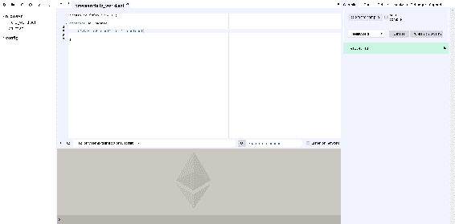
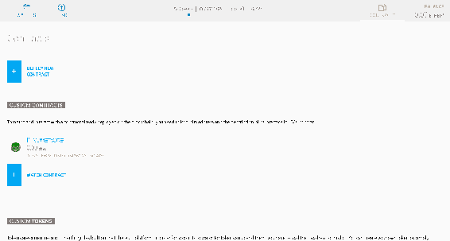
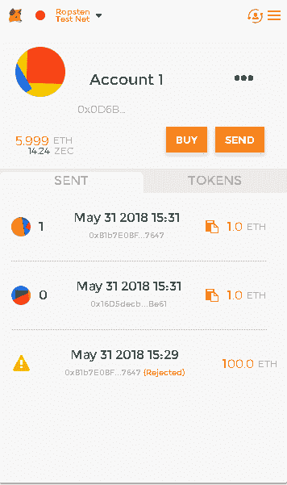
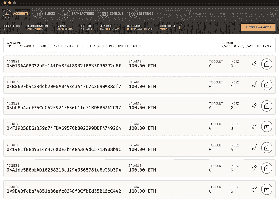
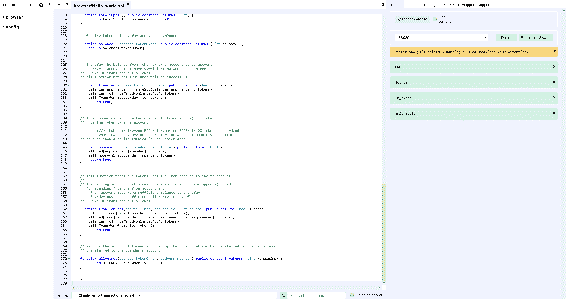

# 以太坊开发

在过去的几章中，我们一直在学习以太坊区块链及其用途以及它如何塑造了分散式技术，不仅仅是基于货币的用途，也适用于其他行业垂直领域。此外，我们还了解了在以太坊区块链上开发的内容，使用智能合约。

在上一章中，我们讨论了 Solidity —— 以太坊基金会推出的编程语言。Solidity 是一种使在以太坊区块链上创建去中心化应用成为可能的语言，无论是用于创建另一种加密货币代币还是区块链可以发挥重要作用的任何其他用例。

在这一章中，我们将专门讨论以太坊开发，其中包括创建代表智能合约的代币。我们将创建一个在以太坊区块链平台上运行的硬币或代币。我们将学习使用 Solidity 进行代币的开发、测试和部署，并讨论智能合约开发阶段的重要方面，这将有助于将智能合约应用于其他应用和行业。

简言之，我们将涵盖以下主题：

+   准备智能合约开发

+   智能合约开发

# 介绍

在这一章中，我们将前进并在以太坊区块链上创建一个代币。我们还将简要介绍 DApp 的开发，它将充分利用智能合约。以下是开发流程所需的工具列表：

+   **代码编辑器或 IDE**：与上一章一样，选择一个您喜欢使用的代码编辑器；在本章中，我们选择 Sublime 文本。虽然，也可使用官方在线 IDE Remix。

+   **以太坊钱包**：这对在 TestnNet 上部署和测试智能合约是必需的。

+   **Solc 编译器**：这用于编译智能合约，将 Solidity 语言代码转换为字节码以供 EVM 读取。

+   **Truffle 框架**：这使得测试和部署智能合约变得更容易。

+   **Web3**：这是一个 JavaScript 库，用于与以太坊节点通信；例如，如果我们的应用程序有一个前端界面供用户与区块链交互，那么 `Web3` 允许用户界面与部署在区块链上的合同进行交互。

# 准备智能合约开发

在我们深入智能合约的开发以及后续测试和部署流程之前，重要的是准备好工具和其他模块，以及准备开发过程，这将有助于创建期望的结果。

# Remix

**Remix** 是目前可在网上使用的官方 IDE；如果您更喜欢使用其他 IDE，可以检查 Solidity 是否是受支持的语言，并开始使用。以下是 Remix 的样式截图：



Remix 是一个功能齐全的在线 IDE，具有诸如代码编译、运行、连接本地主机、在 GitHub 上发布代码等必要功能。

当 Remix 第一次打开时，会加载 `Ballot` 合约。

# Geth 和 Mist

我们可以使用 Geth 运行测试节点，尽管连接和挖掘以太在 `TestNet` 或 `private net` 中的任务也可以使用官方以太坊客户端完成，该客户端是在 Geth 节点上运行的 Mist 浏览器。

Mist 客户端具有各种功能，例如能够创建以太坊帐户并连接到 `MainNet` 或 `TestNet`。我们可以使用 Mist 在区块链上部署或监视已部署的合约。以下截图说明了 Mist 的外观：



# MetaMask

**MetaMask** 是以太坊钱包和以太坊浏览器。MetaMask 使我们能够通过网络浏览器与 DApps 和智能合约进行交互，而无需下载完整的以太坊区块链。它作为 Chrome、Firefox 和其他浏览器的浏览器扩展程序提供。

它允许网站从区块链获取数据，还允许用户从扩展本身发送交易。有了 MetaMask，通过浏览器与以太坊 DApp 进行交互变得更加容易。以下是以太坊钱包的示例截图：



# 代币标准

使用以太坊，可以创建去中心化应用程序，并且我们还可以在以太坊区块链上发行代币。就像**比特币改进提案**（**BIPs**）一样，在 GitHub 上托管了一份**以太坊改进提案**（**EIPs**）的在线列表，可以在此处找到：[`github.com/ethereum/EIPs`](https://github.com/ethereum/EIPs)。在 EIP-20 中，于 2015 年底左右引入了一个新的代币标准。这个代币标准被称为 **ERC20**。*ERC* 代表 **以太坊请求评论。**ERC 是由社区开发者编写的；在社区和核心团队的批准后，该提案成为标准。除了 ERC20 外，还有其他各种标准，例如 ERC223 和 ERC721 也在使用中。

在 EIP 中定义了必须遵循的方法，以便代币可以成为 ERC20 代币合约的一部分。

# ERC20 中的方法

下面是 ERC20 合约类型中指定的方法；重要的是要遵循给定的方法/事件，以便合约可以属于 ERC20 家族。尽管其中一些规范是可选的，不一定要存在。看一下这个列表：

+   `name`: 它应该返回合约的名称，例如：`BaToken`。

+   `symbol`: 返回代币的符号，例如：`BATN`。

+   `decimals`: 返回代币使用的小数位数，例如：18。

+   `totalSupply`: 返回代币的总供应量。这是一个必需的方法。

+   `balanceOf(address _owner)`: 返回另一个地址`_owner`的帐户余额。这是一个强制性方法。

+   `transfer(address _to, unit256 _value)`: 将`_value`数量的令牌发送到地址`_to`。这是一个强制性方法。

+   `transferFrom(address _from, address _to, uint256 _value)`: 此方法将`_value`数量的令牌从地址`_from`转移到地址`_to`。智能合约中必须有此方法才能成为有效的 ERC20 合约。

+   `approve(address _spender, uint256 _value)`: 此方法允许地址`_spender`多次从给定账户提取；它可以提取的最大金额为`_value`。这也是一个强制性方法；建议首先将 allowance 设置为 0，以防止任何漏洞。

+   `allowance(address _owner, address _spender)`: 返回`_spender`仍然可以从`_owner`提取的金额。智能合约中必须有此方法。

+   `event Transfer(address indexed _from, address indexed _to, uint256 _value)`: 当令牌转移时，即使转移的令牌价值为零，也必须触发此事件。

+   `event Approval(address indexed _owner, address indexed _spender, uint256 _value)`: 每当调用`approve`方法时，也会调用此事件。

# Web3

`Web3.js`是一个 JavaScript 库；它可以通过 JSON RPC 调用与以太坊节点通信，通过连接到 HTTP 或 IPC 连接。`Web3.js`通过暴露已在 RPC 上启用的方法来工作。

可以使用以下命令通过`npm`安装`Web3`：

```
npm install web3
```

# Truffle 框架

**Truffle**是一个开发框架，可以简化测试和部署以太坊智能合约。可以使用以下命令通过`npm`安装 Truffle：

```
npm install -g truffle
```

Truffle 通过 Mocha 和 Chai 提供的自动化测试框架来帮助合约编译和链接。使用 Truffle，我们可以轻松地将合约部署到任何`TestNet`、MainNet 或私有 Network ID。Truffle 在 DApp 中完成所有工作，如编译合约、将其注入用户界面并进行测试以检查漏洞。

# Ganache

**Ganache**是由 Truffle 基金会引入的工具，用于在创建的以太坊区块链上运行测试。它具有命令行界面，但在需要时也可以使用图形界面。以下屏幕截图显示了**Ganache**工具：



# 在智能合约上工作

让我们深入了解创建智能合约的任务，以及在`TestNet`上测试智能合约的过程。运行以下讨论的代码的最简单方法是使用 Remix。只需按照以下步骤进行操作：

1.  当您在浏览器中打开 Remix 时，默认情况下会打开`ballot.sol`文件；您可以创建一个新文件并开始编辑您的第一个智能合约。看一下这个：

```
pragma solidity ⁰.4.24;

//This is a test comment, details about the contract can be added here
/*details like Total supply, contract address, Name, Symbol an decimals which will help someone knowing about the contract instead of finding these details within the source code 

*/

contract Gotham{

 string public name;    
    string public symbol;
    uint8 public decimals;
    //most suggested decimal places in 18
   uint256 public totalSupply;

}
```

1.  在前面的代码片段中，我们创建了一个使用 Solidity 版本 0.4.24 并命名为`Gotham`的合约。现在让我们创建一个构造函数，它将初始化我们定义的变量。现在我们的`contract`代码应该如下所示：

```
contract Gotham{

    string public name;    
    string public symbol;
    uint8 public decimals;
    //most suggested decimal places in 18
    uint256 public totalSupply;

//Constructor

    constructor() public {
        symbol = "GOTH";         //This is the symbol of our Token
        name = "GothCoin";       //This is the name of our Token 
        decimals = 12;           /* These are the number of decimal places it can have,  it is suggested to have 18 decimal places */
        totalSupply = 100000;    //total supply of coins allowed 
        }

}
```

1.  现在，让我们将标准的 ERC20 方法添加到一个单独的合约中；这些方法必须存在于以太坊智能合约中。看看这段代码：

```
contract ERC20 {

     function totalSupply() public constant returns (uint);
     function balanceOf(address tokenOwner) public constant returns (uint balance);
     function allowance(address tokenOwner, address spender) public constant returns (uint remaining);
     function transfer(address to, uint tokens) public returns (bool success);
     function approve(address spender, uint tokens) public returns (bool success);
     function transferFrom(address from, address to, uint tokens) public returns (bool success);

     event Transfer(address indexed from, address indexed to, uint tokens);
     event Approval(address indexed tokenOwner, address indexed spender, uint tokens);
}
```

1.  此外，为了避免任何溢出或类似问题，重要的是实现一些具有检查机制的基本数学函数，以避免任何函数溢出。以下是可以创建的合约：

```
contract Arithmetic {

   function Addition(uint a, uint b) public pure returns (uint c) {
        c = a + b;
        require(c >= a);
    }
    function Subtraction(uint a, uint b) public pure returns (uint c) {
        require(b <= a);
        c = a - b;
    }
    function Multiplication(uint a, uint b) public pure returns (uint c) {
        c = a * b;
        require(a == 0 || c / a == b);
    }
    function Division(uint a, uint b) public pure returns (uint c) {
        require(b > 0);
        c = a / b;
    }
}
```

1.  我们的合约必须有所有者的地址；当合约部署时，这将有助于转移代币。为此，我们在 Solidity 文件中创建了一个名为`Im_owner`的合约。看看下面的内容：

```
contract Im_owner {

    address public owner;
    address public newOwner;
    event OwnershipTransferred(address indexed _from, address indexed _to);

    constructor() public {
        owner = msg.sender;
    }

    modifier onlyOwner {
        require(msg.sender == owner);
        _;
    }

    function transferOwnership(address _newOwner) public onlyOwner {
        newOwner = _newOwner;
    }
    function acceptOwnership() public {
        require(msg.sender == newOwner);
        emit OwnershipTransferred(owner, newOwner);
        owner = newOwner;
        newOwner = address(0);
    }
}
```

1.  现在是时候在`contract Gotham`上工作，以添加各种将返回总供应量、获取账户中可用代币余额、转移代币和其他重要功能所需的函数。此外，由于此`contract Gotham`是主要合约，因此我们 Solidity 文件中的其他合约应该在此合约中继承。现在，`contract Gotham`应如下所示：

```
contract Gotham is ERC20, Im_owner, arithmetic {

    string public symbol;
    string public name;
    uint8 public decimals;
    uint public totalSupply;

    mapping(address => uint) balances;
    mapping(address => mapping(address => uint)) allowed;

    // Constructor

    constructor() public {
        symbol = "GOTH"; //This is the symbol of our Token
        name = "GothCoin"; //This is the name of our Token 
        decimals = 12; /* These are the number of decimal places it can have, it is suggested to have 18                             decimal places */
        totalSupply = 100000; //total supply of coins allowed 
        }

    // Total supply

    function totalSupply() public constant returns (uint) {
        return totalSupply - balances[address(0)];
    }

    // Get the token balance for account tokenOwner

    function balanceOf(address tokenOwner) public constant returns (uint balance) {
        return balances[tokenOwner];
    }

    // Transfer the balance from token owner's account to to account
    // - Owner's account must have sufficient balance to transfer
    // - 0 value transfers are allowed
    //This function returns true when this is successful

    function transfer(address to, uint tokens) public returns (bool success) {
        balances[msg.sender] = safeSub(balances[msg.sender], tokens);
        balances[to] = safeAdd(balances[to], tokens);
        emit Transfer(msg.sender, to, tokens);
        return true;
    }

    // Token owner can approve for spender to transferFrom(...) tokens
    // from the token owner's account
    //
    // https://github.com/ethereum/EIPs/blob/master/EIPS/eip-20-token-standard.md
    // recommends that there are no checks for the approval double-spend attack
    // as this should be implemented in user interfaces 

    function approve(address spender, uint tokens) public returns (bool success) {
        allowed[msg.sender][spender] = tokens;
        emit Approval(msg.sender, spender, tokens);
        return true;
    }

    // This function transfers tokens from the from account to the two account
    // 
    // The calling account must already have sufficient tokens approve(...)-d
    // for spending from the from account and
    // - From account must have sufficient balance to transfer
    // - Spender must have sufficient allowance to transfer
    // - 0 value transfers are allowed

    function transferFrom(address from, address to, uint tokens) public returns (bool success) {
        balances[from] = safeSub(balances[from], tokens);
        allowed[from][msg.sender] = safeSub(allowed[from][msg.sender], tokens);
        balances[to] = safeAdd(balances[to], tokens);
        emit Transfer(from, to, tokens);
        return true;
    }

    // Returns the amount of tokens approved by the owner that can be transferred to spender's account
    // transferred to the spender's account

    function allowance(address tokenOwner, address spender) public constant returns (uint remaining) {
        return allowed[tokenOwner][spender];
    }

    }
}
```

前面的代码具有成为有效 ERC20 标准代币的 Solidity 文件所需的最小功能。一旦代码完成，您可以通过按 Remix 右侧面板上的“开始编译”按钮来运行它。编译选项卡旁边还有一个名为“运行”的选项卡，它可以帮助在`TestNet`上部署智能合约，如下图所示：



在您的浏览器上使用 Remix 运行的 BrowserHello_World.sol 文件

# 总结

在本章中，我们学习了智能合约开发、测试和部署所需的工具。我们了解了 Remix，以太坊基金会的官方在线集成开发环境；Mist，官方以太坊钱包和浏览器；以及 MetaMask，这是一款帮助以太坊智能合约开发的工具。我们学习了 ERC20 代币标准、`Web3` 和 Truffle 框架。此外，我们还介绍了智能合约的创建，以及在 Ropsten 上部署智能合约的各种细节。

在接下来的章节中，我们将更深入地学习去中心化应用程序和以太坊账户。我们还将深入研究挖掘、ICO、通过分叉比特币存储库创建我们自己的货币，以及我们将讨论区块链技术面临的挑战。
