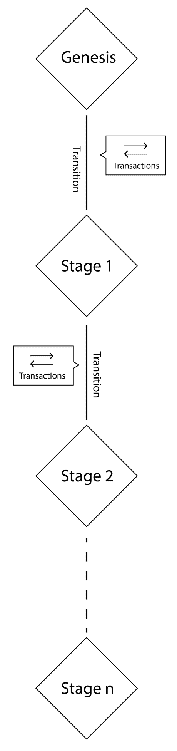
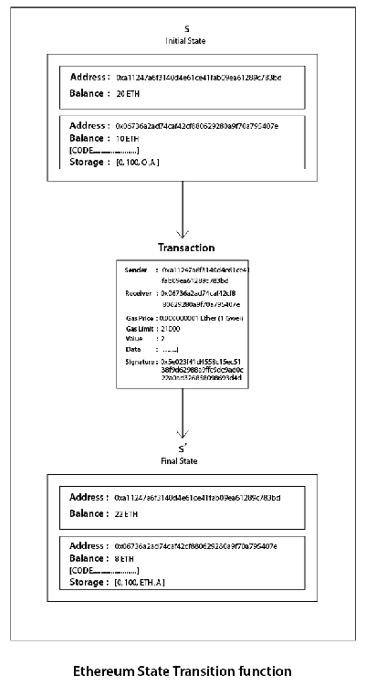
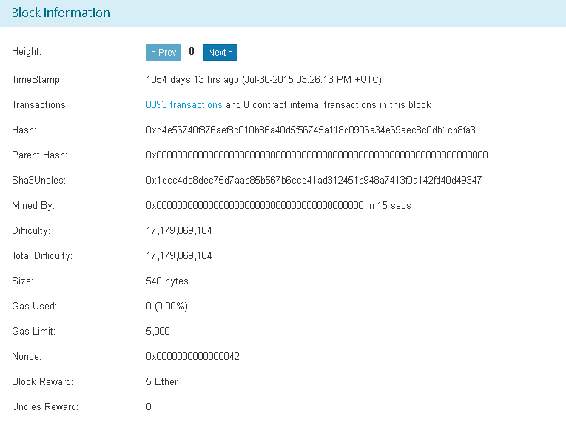

# 以太坊账户和以太代币

在之前的章节中，我们讨论了以太坊、智能合约，以及智能合约的开发过程，包括基于以太坊区块链开发 ERC20 代币。我们还讨论了以太坊的开发过程以及在以太坊区块链上部署智能合约和代币的过程。

在本章中，我们将详细讨论以太坊账户，还将研究一种以太代币；这个讨论将帮助我们更好地理解去中心化应用。我们还将简要讨论一些热门的以太坊代币和智能合约。我们还将讨论一些重要的话题，比如**交易子状态**，以太坊区块的验证以及区块最终化过程中涉及的各个步骤。随后，我们将简要讨论以太坊智能合约和货币的一些缺点。

本章涵盖了以下主题：

+   以太坊状态转换函数

+   创世区块

+   交易收据

+   交易子状态

+   区块验证

+   以太坊代币的缺点

# 介绍以太坊账户

以太坊中的状态由对象组成，每个对象称为一个账户。以太坊中的每个账户包含一个 20 字节的地址。每次状态转换都是各个账户之间的价值和信息的直接交易。在账户之间或对账户进行的每次操作被称为*状态* *转换*。以太坊中的状态转换是通过以太坊状态转换函数完成的。

以太坊区块链中的状态变化从区块链的创世区块开始，如下图所示：



每个区块包含一系列交易，每个区块都与其前一个区块链接在一起。要从一个状态转换到下一个状态，交易必须是有效的。利用共识技术进一步验证交易的有效性，这是我们在前几章已经讨论过的。

为了避免以太坊中的陈旧区块，引入了**GHOST**（**Greedy Heaviest Observed Subtree**）协议。这是为了避免任何节点的随意分叉和其他节点的不恰当验证。当两个节点同时发现一个区块时，就会产生陈旧区块。每个节点都发送区块链中的区块进行验证。这在比特币中不会发生，因为在比特币中，区块时间为 10 分钟，区块传播到大约 50%的网络大约需要 12 秒。 GHOST 协议还包括称为叔区块的陈旧区块，并将它们包含在链的计算中。

如前几章所讨论的，在以太坊区块链中有两种类型的账户。即**合约账户**（**CA**）和**外部拥有账户**（**EOA**s）。合约账户是具有与其关联的代码以及私钥的账户。EOA 具有以太币余额；它能够发送交易并且没有关联的代码，而 CA 具有以太币余额和关联的代码。合约账户和外部拥有账户各有其特点，新代币只能由合约账户发起。

# 以太坊状态转换函数

在状态转换函数中，以太坊中的每笔交易都遵循以下过程：

+   通过确保签名有效、nonce 与发件人账户中的 nonce 匹配以及语法来确认交易的有效性和结构。如果有任何问题，则返回错误。

+   交易费用的计算是使用燃气价格进行的，并使用签名确定发件人地址。然后，检查并相应减少发件人的账户余额，同时增加 nonce。如果余额不足，则会出现错误。

+   为了支付交易的费用，需要使用一定数量的燃气。根据交易的大小，按字节逐步收费。

+   在此步骤中，发生实际价值的转移。流程从发件人账户到接收者账户。如果接收账户不存在，则会创建该账户。另外，如果接收账户是合约账户，则执行合约的代码。如果有足够的燃气可用，则合约代码会完全运行，或者在燃气用尽时停止。

+   如果由于余额不足或燃气而导致交易失败，则所有状态更改都将被撤销，除了支付给矿工的费用之外。

+   如果有余额可用，则在支付矿工所需的费用后将其发送回发件人作为找零。函数在此时返回结果状态。

以下图表描述了状态转换流程：



该函数在以太坊的每个客户端中独立实现。

# 创世区块

这是以太坊区块链的第一个区块，就像比特币区块链的创世区块一样。创世区块的高度为 0。

创世区块于 2015 年 7 月 30 日被挖掘，标志着以太坊区块链的第一个区块。创世区块的难度为 17,179,869,184，如下图所示：



# 交易收据

收据用于存储事务执行后的状态。这些结构用于记录事务执行的结果。每次事务执行后都会产生收据。所有收据都存储在一个索引为眼树中。其根据置于块头中作为收据根。

# 元素

元素由四个主要元素组成；让我们在查看收据结构之前讨论以太坊事务收据的每个元素。

# 事务后状态

**事务后状态**是在事务执行后保存状态的一种 trie 结构。它被编码为一个字节数组。

# 已使用燃气

**已使用燃气**表示包含事务收据的块中使用的总燃气量。它可以为零，但不是负整数。

# 日志集合

**日志集合**显示由事务执行产生的日志条目集合。日志包含记录者的地址、日志主题和其他日志数据。

# 布隆过滤器

**布隆过滤器**是根据讨论的日志中包含的信息创建的。日志条目被减少为 256 字节的哈希，然后嵌入到块的头部作为日志布隆。日志条目由记录者的地址、日志主题和日志数据组成。日志主题被编码为一系列 32 字节的数据结构，而日志数据由一些字节的数据组成。

# 结构

以下是事务收据结构：

```
  Result: {
    "blockHash": "0xb839c4a9d166705062079903fa8f99c848b5d44e20534d42c75b40bd8667fff7",
      "blockNumber": 5810552,
      "contractAddress": null,
      "cumulativeGasUsed": 68527,
      "from": "0x52bc44d5378309EE2abF1539BF71dE1b7d7bE3b5",
      "gasUsed": 7097057,
      "logs": [
        {
          "address": "0x91067b439e1be22196a5f64ee61e803670ba5be9",
          "blockHash": "0xb839c4a9d166705062079903fa8f99c848b5d44e20534d42c75b40bd8667fff7",
          "blockNumber": 5810552,
          "data": "0x00000000000000000000000000000000000000000000000000000000576eca940000000000000000000000000fd8cd36bebcee2bcb35e24c925af5cf7ea9475d0100000000000000000000000000000000000000000000000000000000000000",
          "logIndex": 0,
          "topics": [
            "0x72d0d212148041614162a44c61fef731170dd7cccc35d1974690989386be0999"
          ],
          "transactionHash": "0x58ac2580d1495572c519d4e0959e74d70af82757f7e9469c5e3d1b65cc2b5b0b",
          "transactionIndex": 0
        }
      ],
      "root": "7583254379574ee8eb2943c3ee41582a0041156215e2c7d82e363098c89fe21b",
      "to": "0x91067b439e1be22196a5f64ee61e803670ba5be9",
      "transactionHash": "0x58ac2580d1495572c519d4e0959e74d70af82757f7e9469c5e3d1b65cc2b5b0b",
      "transactionIndex": 0
    }
    Transaction cost: 7097057 gas. 
```

还需注意，收据在待处理事务中不可用。

# 事务子状态

**事务子状态**是在事务执行期间创建的。此事务在执行完成后立即处理。事务子状态由以下三个子项组成。

# 自杀集合

**自杀集合**包含在事务执行后处置的账户列表。

# 日志系列

**日志系列**是一个索引系列的检查点，允许对以太坊环境外部实体的合约调用进行监控和通知。日志是对智能合约中事件的响应而创建的。它也可以用作更便宜的存储形式。

# 退款余额

**退款余额**是发起执行事务的事务中的燃气总价。

# 消息

**消息**是在两个账户之间传递数据的事务。这是在两个账户之间传递的数据包。消息可以通过**合约账户**（**CA**）发送。它们也可以是已由发送者数字签名的交易形式的**外部拥有账户**（**EOA**）。

消息从不存储，类似于事务。以太坊消息的关键组成部分包括：

+   发送消息调用者

+   事务发起者

+   事务接收方

+   合约账户，其代码在消息调用期间执行，如果有此目的的账户

+   最大可用燃气

+   燃气价格

消息是使用`CALL`或`DELEGATECALL`方法生成的。

# 调用

**CALL**不会在区块链中广播任何内容；相反，它是对指定的合约函数的本地调用。它在节点中本地运行，就像本地函数调用一样。它不消耗任何 gas，是一个只读操作。调用仅在节点上本地执行，不会导致任何状态更改。如果目标账户有关联的 EVM 代码，则虚拟机将在接收到消息后启动以执行所需的操作；如果消息发送者是一个独立的对象，则调用将传递从 EVM 返回的任何数据。

# 以太坊区块验证

在矿工挖掘后，以太坊区块在被视为有效之前要经过几轮检查；以下是它经过的检查：

+   所有的伯爵/叔父都必须验证其身份，考虑到叔父的 PoW 是有效的。

+   上一个区块的存在和有效性

+   区块的时间戳有效性，即当前区块的时间戳必须高于父区块的时间戳。此外，当前区块和父区块之间的时间间隔应不超过 15 分钟。所有区块时间都以 Unix 时间计算。

如果前面的任何检查失败，则区块被拒绝。

# 叔父验证

在这个过程中，伯爵或叔父会被验证。首先，一个区块最多可以包含两个叔父，其次，头部是否有效以及叔父与当前区块的关系是否满足最大深度为六个区块。

# 区块难度

以太坊中的区块难度与比特币区块链中的区块难度计算并行。如果两个区块之间的时间缩短，则区块的难度增加。这是为了保持一致的区块生成时间。以太坊 Homestead 版本中的难度调整算法如下：

```
block_diff = parent_diff + parent_diff // 2048 * max(1 - (block_timestamp - parent_timestamp) // 10, -99) + int(2**((block.number // 100000) - 2))
```

在这个算法中，区块的难度是根据区块生成时间来调整的。根据这个算法，如果父区块和当前区块的生成时间差小于 10 秒，则难度增加。如果时间差在 10 到 19 秒之间，则难度保持不变。当两个区块的生成时间差大于 20 秒时，难度降低。难度的降低与时间差成正比。

除了基于时间戳的难度增量外，根据算法，每挖掘 100,000 个区块后，难度将呈指数增长。这被称为以太坊网络中引入的*难度定时炸弹*，因为这将使在以太坊区块链网络上挖矿变得非常困难。这就是为什么 PoS 是以太坊在不久的将来提出的共识机制的原因。

# 区块最终化

以太坊区块的最终化涉及以下四个阶段的操作：

+   伯爵的验证

+   交易的验证

+   奖励的应用

+   状态和区块 nonce 的验证

# 基于以太坊的代币的缺点

我们在之前的章节中讨论了以太坊及基于以太坊区块链的货币的优点和用途；现在让我们讨论一下基于以太坊的代币的一些缺点：

+   **不稳定**：以太坊区块链仍在经历许多变化；这也包括将共识机制从 PoW 转移到 PoS 系统。

+   **可靠性**：ERC20 代币或任何其他代币都是基于以太坊构建的。这带来了威胁，因为以太坊本身大多数时候都在频繁变化。

+   **硬分叉**：依赖于另一个区块链意味着，由于硬分叉，可能会出现意想不到的问题。

+   **主权**：由于代币基于以太坊区块链，对这些代币未来发展没有发言权。选择是否使用 ERC20 应该基于应用和用例。

+   **支持**：在智能合约发布到区块链后，对其进行改进或需要支持的任何要求都只能在以太坊区块链上完成，并且对于区块链中提出的任何改变/改进都必须得到整个以太坊社区的批准。

+   **以太作为主要货币**：尽管可以创建自己的货币、符号和供应限制，但以太仍然是以太坊区块链中使用的主要货币，因此任何时候，以太都会因为你的代币所做出的努力而得到增值。

# 摘要

在本章中，我们讨论了以太坊状态转换函数、起源块和交易收据。我们还讨论了交易子状态。除了这些话题之外，我们还讨论了以太坊区块验证以及所涉及的步骤，正如以太坊黄皮书中所讨论的那样。最后，我们简要讨论了使用基于以太坊的代币的一些缺点。

在下一章中，我们将讨论**去中心化应用程序**，并学习如何创建**DApp**，以及如何发布一个。我们还将讨论 DApp 的未来以及其对用户的影响。
