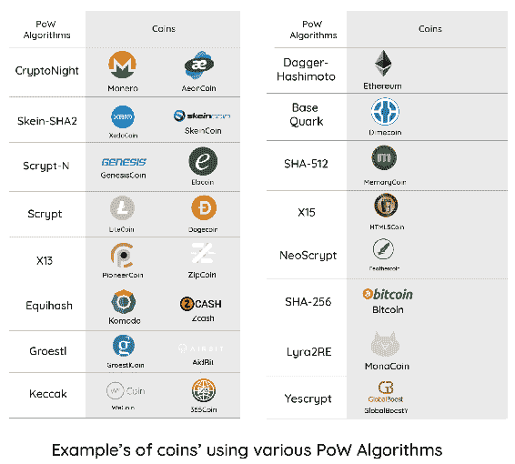
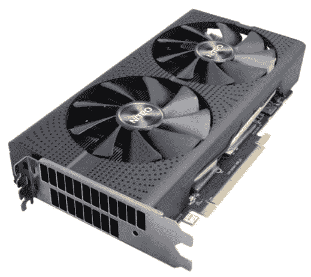
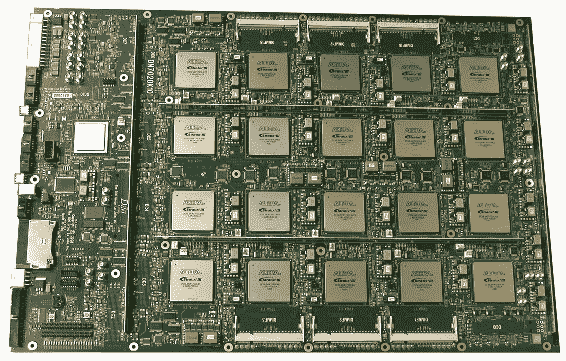
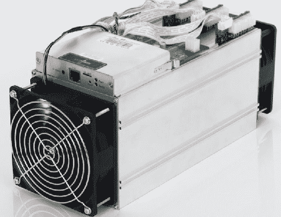
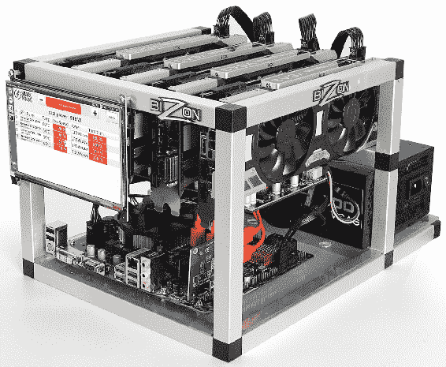
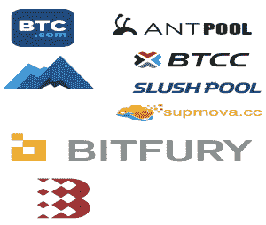
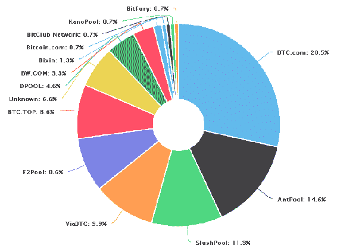
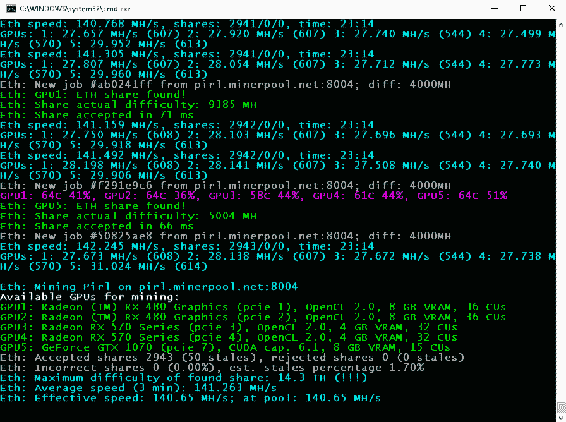

# 挖矿

在之前的章节中，我们讨论了**工作证明**（**PoW**）共识系统以及挖矿的重要性。我们还讨论了比特币和其他替代币，以及矿工在 PoW-based 硬币中发挥的重要作用。

在本章中，我们将深入讨论挖矿，以及基于 PoW 的硬币和代币中挖矿的必要性。然后，我们将讨论挖矿池以及它们如何给挖矿生态系统带来革命。此外，我们将继续学习如何使用现有的各种矿工开始挖矿。我们将深入了解 CPU 和 GPU 挖矿，以及研究搭建挖矿设备和双挖概念。最后，我们将研究每一种可用于挖矿的 PoW 算法，并讨论基于可用硬件资源而选择的最佳算法。

在本章中，我们将涵盖以下主题：

+   挖矿过程及其阶段

+   挖矿算法

+   各种类型的挖矿硬件

+   矿工类型

+   挖矿设备

+   挖矿池类型

+   挖矿软件

# 加密货币挖矿

加密货币挖矿由全节点执行，这些节点是区块链的一部分；挖矿仅由具有基于 PoW 的共识系统的区块链执行。交易由共识系统确认，并创建这些交易的区块以添加到区块链中；一旦新区块被添加到区块链中，通常被称为**找到区块**，就会有一定的奖励，这是给予矿工的，因为他们执行了将区块添加到区块链中的任务；不过，这个过程并不简单。在添加区块之前，必须执行一个资源密集型的验证过程来验证交易。资源密集型任务基本上就是与货币相关的某些算法的哈希。

由于区块生成时间保持在约 10 分钟左右，当矿工的散列功率增加时，难度必须以相同的比例增加。这是通过难度调整和重新定位算法来完成的，如前几章中所讨论的。

当矿工连接到网络时，有各种任务需要矿工执行以跟上网络。每种货币对矿工都有不同的规格；以下是比特币环境下矿工执行的一些主要任务：

+   **交易验证**：这是通过验证签名和输出来验证交易的过程。

+   **区块验证**：一旦验证了块中的每个交易，就会验证随机数，以完成区块验证过程。

+   **新区块创建**：矿工可以通过在网络上验证的交易后，将那些不属于任何其他区块的交易添加到区块链中的较高高度来创建新的区块。

+   **工作量证明算法解决方案**：在任务中，矿工通过解决所需算法找到区块的上链：比特币中使用 SHA256。区块头部包含一个 32 位的随机数字段，矿工必须使用暴力破解技术对其进行散列，直到哈希匹配。

+   **支持奖励系统**：当一个节点对算法进行散列时，结果会通过区块链网络发送。完成后，网络中的其他矿工会验证区块，以确保区块中的交易高度不与任何先前区块冲突。一旦网络接受了区块，矿工将以货币形式获得一定的奖励。

让我们详细讨论每个步骤，以及挖掘加密货币涉及的过程。

# 挖矿过程

挖矿主要在 PoW（工作量证明）基础上的区块链中进行，但正如前文讨论的那样，PoW 并不是仅有的共识系统；还有各种其他共识机制。然而，PoW 是加密货币中最广泛使用的共识系统。

PoW 的概念早在其在比特币中的使用之前就存在了。这些系统先前用于限制拒绝服务攻击，垃圾邮件以及当前系统中持续存在的其他与网络相关的问题，因为它们要求请求者在提供所需服务之前提交计算工作的证明。这使得此类与网络相关的攻击变得不可行。

为了使 PoW 系统足够具有成本效益，请求者执行的计算任务应该具有适度的难度，但对于服务提供方来说却很容易进行检查。Hashcash 是最早开始使用基于 PoW 的协议利用 SHA-256 算法的系统之一。用户必须在提供所需服务之前提交计算数千个哈希操作的证明；这反过来限制了 DoS 和垃圾邮件攻击。

比特币也使用 SHA-256 散列算法，尽管这是一个随机算法，但其性质是确定性的，这意味着对于任何给定的输入，输出都将始终相同，并且可以轻松通过使用相同算法和相同输入的任何人进行验证。

在加密货币挖矿中，矿工需要两样东西来获得 SHA-256 散列算法的输入：

+   新生成区块的头部

+   随机数（**Nonce**）

矿工使用暴力破解的方法，直到哈希输出与难度目标匹配；这是一个作为上限的 256 位数，而且 SHA-256 的输出必须低于或等于当前区块的难度目标，以便网络接受该区块。例如，这是比特币区块链上第`528499`高度的一个区块的哈希：

```
00000000000000000021524523382d300c985b91d0a895e7c73ec9d440899946
```

每个区块中的第一笔交易是挖矿奖励，因此在交易中没有要从中扣除资金的输入地址，这些是创建为区块链网络的一部分的硬币。这种独特类型的交易称为 coinbase 交易。此外，在比特币区块链中，coinbase 交易中创建的硬币在区块链中至少接收到 100 次确认之前无法花费。由于区块时间为 10 分钟，100 次交易大致需要 16 小时 40 分钟。coinbase 交易只能在矿工自己的地址上发生。

# 算法

比特币使用 SHA-256，但在 PoW 共识类型中可以使用各种算法，以下列出了一些这些算法，并在下一张截图中进行了说明：

+   **base Quark**: Dimecoin, AnimeCoin

+   **CryptoNight**: AeonCoin, Monero

+   **Dagger-Hashimoto**: Ethereum, Krypton

+   **Equihash**: Zcash, Komodo

+   **Groestl**: AidBit, GroestlCoin

+   **Keccak**: 365Coin, Wecoin

+   **Lyra2RE**: Lyrobar, MondaCoin

+   **SHA-512**: MemoryCoin, ProtoShares

+   **NeoScrypt**: Feathercoin, Ufocoin

+   **NXT**: CoinoIndex, SuperNet

+   **Scrypt**: Litecoin, Dogecoin

+   **Scrypt-jane**: QQcoin, ThorCoin

+   **Scrypt-N**: Caishen, Elacoin, GenesisCoin

+   **Skein-SHA2**: SkeinCoin, XedoCoin

+   **X11**: Dash, Chipcoin, Karmacoin

+   **X13**: Cloakcoin, Zipcoin, PioneerCoin

+   **X15**: CrystalCoin, Halcyon, HTML5coin

+   **Yescrypt**: BitZeny, GlobalBoostY



每个算法都对其他算法进行了特定的修改。

# 挖矿硬件

加密货币挖矿社区经历了许多创新和阻力并进，以照顾区块链的核心原则。挖矿可以使用家用计算机和专用硬件完成。常用于加密货币挖矿的硬件类型在以下部分中讨论。

# 基于 CPU 的挖矿

这是官方比特币客户端中提供的第一种挖矿类型。在比特币的最初阶段，家用计算机能够挖矿。随着更强大和专用硬件的出现，比特币挖矿不再是挖掘比特币的首选。其他硬币仍然支持 CPU 挖矿，但随着时间的推移，这些类型的硬币的难度增加，挖矿也变得不可行。

# 基于 GPU 的挖矿

由于区块链网络的难度随时间逐渐增加，CPU 挖矿变得不可行，有时使用 CPU 挖矿变得不可能。考虑到这一点，矿工开始使用 GPU，因为它们提供更快速和更高并行处理能力。GPU 制造公司如 AMD 和 Nvidia 定期发布新硬件，除了游戏性能外，这些硬件还能产生出色的挖矿结果：



# 基于 FPGA 的挖矿

**现场可编程门阵列**（**FPGA**）包括在制造后可以配置的集成电路。配置的编程使用**硬件描述语言**（**HDL**）指定。可编程设备可以在不拆卸设备的情况下进行修改；该设备包含一系列门阵列，用于创建真值表，以便从数据流中计算输入，如下面的截图所示：



由于 FPGA 支持核心的并行性，据称其效率是基于 GPU 挖矿的十五倍。

# 基于 ASIC 的挖矿

**特定应用集成电路**（**ASIC**）矿工比基于 CPU、GPU 和 FPGA 的矿工要好得多，因为它们设计用于执行一项特定任务，即加密货币的挖矿。下图是一台 Algorithm-specific 的 ASIC 矿机：



这些硬件专门设计用于产生高散列率。有各种知名公司生产一些性能最佳的矿工，如比特大陆、阿瓦隆、蚂蚁矿机等。

# 矿工类型

如今有两种类型的矿工——根据是自行获取硬件，还是在线购买散列功率来进行分类。

# 云挖矿

在这种类型的挖矿中，矿工不拥有硬件，而是远程从其他矿工那里购买散列功率。云挖矿相比自购硬件有各种优点，如低门槛入门和风险较小。对于想投资加密货币但不想从交易所购买或者没有足够的技术知识的人来说，这是他们最好的选择。现在有许多组织在各个地方设有大型数据中心，可供人们购买基于 GPU、ASIC 或 FPGA 的矿工。其中一些组织有 Genesis Mining、SkyCoinLabs、Nicehash、hashflare 等。

# 硬件挖矿

爱好者总是对设置自托管硬件进行挖矿感兴趣；可以通过高端家用计算机进行挖矿，或者获取 ASIC 或 FPGA 设备。如今，人们还在设置专门的挖矿设备，可以连接多个 GPU、ASIC 或 FPGA 到一台机器。人们通常通过购买扩展机箱，然后将多个硬件连接在一起来自行搭建一个矿机以达到所需的结果。矿机最好的一部分是可以添加更多硬件，并尝试新的 ASIC，以查看是否实现了预期的结果。

# 挖矿设备

由于很多 GPU 或 ASIC 器件被串联在一起，它们往往会产生大量热量，因此有必要保证有适当的空气流通。以下是一个基本矿机的要求，任何人都可以自行搭建：

+   **主板**：需要专门的主板，可以支持多个 PCI-E 插槽，用于连接多个 GPU。

+   **硬盘**：最低容量的硬盘就够了，但最好选择 SSD 以获得更好的性能。

+   **内存**：挖矿机至少需要 8 GB 或 4 GB 的内存，因为挖矿更多是计算密集型工作。

+   **GPU、ASIC 或 FPGA**：这些是挖矿机中最重要的组件，可以选择任何一种配置，如基于 GPU 的挖矿机或基于 ASIC 的挖矿机或基于 FPGA 的挖矿机。也可以尝试在挖矿机上混合使用所有这些设备，以找出哪种设备能产生最高的结果。

+   **机箱**：由于大量的计算设备连接在一起，它们往往会产生大量热量，因此需要适当的机箱将它们连接在一起；机箱内部的气流应该是足够的，因为大量的热量可能导致硬件的损失或系统资源的减少。

+   **电源供应**：台式电脑中的标准电源无法在挖矿机中使用；多个 GPU 需要大量的电力，因此需要一种能够支持如此大量电力的电源。

现在也可以购买预构建的挖矿机；这些挖矿机是即插即用的类型，无需设置。以下是一些最常用的预构建挖矿机：

+   **鲨鱼挖矿**：这是一家知名的供应商，创建支持多种加密货币挖掘的基于 GPU 的挖矿机。他们提供各种选项，从紧凑型到大型挖矿机。

+   **挖矿洞穴**：他们有适用于 Nvidia 或 AMD 基于显卡的各种挖矿机的选项：



# 挖矿矿池

随着越来越多的矿工开始挖矿，货币的难度逐渐增加。矿池是一群矿工聚集在一起挖掘一个区块，一旦成功挖掘了区块并获得了奖励，奖励将分配给在矿池中挖矿的矿工；奖励的支付方式有很多种，我们将在下一节讨论这些方法。之所以有各种奖励分配方法，是因为哈希是一种纯粹基于蛮力的机制，因此对于任何矿工来说，找到正确的随机数并成功地提交一个区块进入区块链过程，都是纯粹的运气，因此如果他们的哈希和挖矿工作没有计入，其他矿工就会感到不公平。因此，奖励是根据哈希算力来分配的，但仍然有各种方法来精确计算每个矿工的份额。

# 每份矿工支付 - PPS

PPS 是一种将风险转移到矿池的方法。对于矿工来说，这是最受欢迎的方法，因为他们根据他们挖掘的哈希份额数量得到支付；每个挖掘的份额的奖励都是有保障的，现在很少有矿池支持这种系统。矿工从矿池的现有货币余额中得到支付。

# 比例分配 - PROP

这被称为比例方法，顾名思义，在这种方法中，奖励根据每个矿工找到的区块份额的数量按比例分配给矿工。

# 每份最近 N 份分享报酬 - PPLNS

PPLNS 类似于比例方法，不过在这种方法中，不管矿工贡献的总份额有多少，最后的*N*份份额都是重要的。

# 双几何方法 - DGM

DGM 是一种混合方法，风险在矿池和矿工之间分配。在这种情况下，在进行短期回合时，矿池获得一部分挖矿奖励，而长期回合进行时将返回相同的奖励。

# 分享最大每份分享报酬 - SMPPS

SMPPS 类似于 PPS，但矿池在单个回合中不会支付超过向矿池奖励的总硬币。这消除了矿池在 PPS 方法中所承担的风险。

# 均衡共享最大每份分享 - ESMPPS

ESMPPS 类似于 SMPPS；它在参与本回合挖矿的所有矿工之间平均分配支付。

# 最近的共享最大每份分享 - RSMPPS

RSMPPS 类似于 SMPPS，但这种方法首先优先考虑最近的矿工。

# 限制的每份最大分享与最近回溯支付 - CPPSRB

CPPSRB 采用了最大每份分享的方式，以便考虑到矿池不需要备用资金时，使用区块奖励的收入支付给矿工最大奖励。

# 比特币合并挖矿 - BPM

BPM 也被称为**斯拉什系统**，因为它最初是在名为**斯拉什矿池**的矿池中使用的。在这种支付计算方法中，从区块轮开始的旧份额与最近的份额相比重要性较小。由于社区成员开始报告矿工能够在回合进行时切换矿池，因此引入了这种系统。

# 针对目标支付 - POT

POT 是一种基于高方差的 PPS 支付系统，根据矿工向矿池返回的工作难度而不是整个矿池矿工挖掘的工作难度进行支付。

# SCORE

这是一种比例奖励系统，根据提交份额的时间来计算。该流程使较晚提交的份额比较早提交的份额更有价值；这些份额按时间打分，以及将分别给予个别矿工的奖励基于得分比例而不是系统中提交的份额。

除此之外，矿池和社区仍在提出各种新的奖励系统；诸如 ELIGUIS、Triplemining 等系统仍然存在并被各种开发人员使用。

# 流行矿池

目前有各种各样的矿池存在，并且任何人都可以成为感兴趣的矿池的一部分并立即开始挖矿。矿池可以支持任何加密货币或同时支持多种货币。以下是矿池列表，以及它们支持的货币：

+   **BTC.com**：这是一个总部位于中国的矿池，是 Bitmain 组织的一部分。它支持比特币和比特币现金。

+   **Antpool**：Bitmain 组织拥有的另一个矿池。它支持比特币、莱特币、以太坊、以太坊经典、Zcash、Dash、比特币现金、Siacoin、门罗经典和 Bytom。

+   **BTC.TOP**：一个总部位于中国的支持比特币的矿池，截止目前。

+   **SlushPool**：世界上第一个矿池，也是迄今最可靠的矿池。它挖掘约占所有比特币区块的 3%。它支持比特币和 Zcash。

+   **F2Pool**：一个总部位于中国的矿池，支持比特币、莱特币、Zcash、以太坊、以太坊经典、Siacoin、Dash、门罗币、门罗经典、Decred 币、Zcoin 和 Aion 币等多种货币。

+   **ViaBTC**：一个针对中国矿工的总部位于中国的矿池。它支持比特币、比特币现金、莱特币、以太坊、以太坊经典、Zcash 和 Dash 等货币：



除了列出的矿池外，还有各种其他矿池，有些支持单一币种，有些支持多个币种。其中一些是 BTCC、Bitfury、BW Pool、Bitclub.network、Suprnova、minergate 等等。下图显示了比特币网络的算力分布，可以在 [www.Blockchain.info/pools](https://www.blockchain.com/pools?) 找到：



# 挖矿软件

挖矿硬件负责挖矿过程，但拥有高效的软件也很重要，以获得最佳结果并消除任何瓶颈。

挖矿软件的任务是在网络上分享硬件的挖矿任务。除此之外，它的任务还包括接收来自网络上其他矿工的工作。根据硬件运行的操作系统，有各种挖矿软件可供选择，如 BTCMiner、CGMiner、BFGMiner、Nheqminer 等等：



挖矿软件应基于操作系统、硬件类型和其他因素进行选择。大多数挖矿软件是开源的，并且有大量积极的社区，以帮助矿工选择适合可用硬件的正确软件并澄清任何疑问。

# 总结

在本章中，我们学习了加密货币的挖矿；从研究各种算法开始，我们讨论了挖矿硬件及其各种类型。然后，我们讨论了挖矿矿池，矿池如何将奖励分配给矿工以及目前各种流行的矿池。

在下一章中，我们将讨论**首次代币发行**（**ICO**），这是为推出的代币或货币筹集资金的过程。ICO 是区块链社区的重要组成部分，并帮助区块链项目的利益相关者从社区本身筹集资金。
