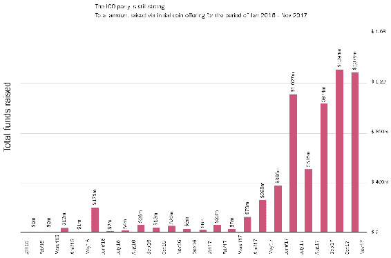

# 第十九章：ICO 101

**ICO** 代表 **首次代币发行**，也称为 **代币销售** 或 **首次代币发售**。ICO 是一个事件，新的区块链项目通过向潜在买家提供网络代币来筹集资金。与 IPO 不同，没有股权出售。买家在网络上收到代币，但不拥有底层项目的知识产权、法律所有权或其他传统的股权特征，除非作为销售的一部分明确承诺。如果有的话，获利的预期来自持有代币本身。如果新网络的使用需求增加，那么拥有代币的价值也将相应增加。

在本章中，我们将介绍 ICO，它们是如何产生的，以及作为执行的关键方面。ICO 仍在不断发展，但许多事件和可交付成果已成为预期甚至是成功所必需的。

第一个 ICO 是由 Mastercoin 在 2013 年开发的。Mastercoin 认为他们的代币，如比特币，会增值，至少有一些人同意。Mastercoin 进行了一个为期一个月的筹款活动，最终筹集了约 50 万美元，而后来 Mastercoin 的整体市值增长到了高达 5000 万美元。无需通过传统渠道就能筹集大量资金的能力开始引发一系列活动。

第二年，以太坊网络诞生并举行了其代币销售。随着这个网络的诞生，推出新代币的难度大幅降低。一旦以太坊网络稳定并建立了临界质量，ICO 就开始定期举行。在接下来的两年里，ICO 的频率越来越高。

一些值得注意的早期项目包括：

+   **Ethereu****m**：1800 万美元

+   **ICONOMI**：1006 万美元

+   **Golem 项目**：1000 万美元

+   **Digix DAO**：550 万美元

2017 年，ICO 的速度加快，筹集的资金也增加了。以下是 2017 年的一些重要项目：

1.  **Filecoin**：约 2.57 亿美元

1.  **Tezos**：约 2.36 亿美元

1.  **EOS**：约 2 亿美元

1.  **Bancor**：约 1.53 亿美元

现在已有超过 1500 种加密货币，而且还有更多新项目定期发布。每个月发布的新项目约有 100 个左右。本章我们将涵盖以下主题：

+   当前 ICO 市场的现状

+   ICO 活动的典型方面

+   ICO 和区块链项目存在的问题

# 当前 ICO 市场的现状

早期 ICO 市场和当前行业状况之间的差异显而易见。起初，只有少数几个 ICO，并且这些 ICO 是由相对在区块链社区内较为知名的团队举办的，他们在进行 ICO 前花费了相当多的时间和精力来实现一个项目。以太坊的推出后，进行 ICO 的准入门槛大幅降低，新代币的数量激增。

# ICO 数量不断增加

在以太坊网络之前，大多数 ICOs 都是针对新的区块链的。有了以太坊，代币现在可以使用智能合约来启动，而不是从头开始创建整个区块链基础设施。有关如何实现这一点的更多信息，请参阅有关 Solidity 和智能合约的章节（请参见 Chapter 13， *Solidity 101*，和 Chapter 14， *智能合约*）。

目前，2018 年有望产生超过 1,000 个新的 ICOs：

+   ICOs 的募集资金总额不断增加

+   非常大规模的资金筹集变得越来越少见

+   现有公司开始进行 ICO

# ICO 活动的典型方面

大多数 ICOs 的营销活动都有一个典型的轨迹。这些活动存在的目的是吸引对公司的兴趣和投资，并向全世界展示项目。

# 白皮书

对于大多数项目来说，最关键的部分是白皮书。项目白皮书介绍了项目的目的，它试图解决的问题，以及它如何解决这些问题。

一份好的白皮书会讨论代币和市场的实用性。大多数白皮书的关键部分包括：

+   项目介绍

+   市场和先前解决方案的历史

+   使用区块链介绍新解决方案

+   代币的实用性和代币经济学

+   未来的应用和协同效应

+   解决关切和风险

+   团队和团队背景

+   总结

大多数白皮书都会包含这些部分，以及其他部分，具体取决于项目的性质和目标市场。白皮书将被广泛用于所有未来的营销活动，因为它将成为幻灯片演示、提案等的信息来源。

# 私募

私募是将大块代币出售给私人投资者的艺术，通常是在这些代币在公开市场上可用之前。这种做法有很多原因。首先，私人投资者往往更加复杂，能够进行大额购买。一个成功的、有成功记录的、知名投资者的真正参与，尤其是那些创业风险最高的购买，将会鼓励未来的购买。

私人买家在很多情况下会提供早期资金，如果他们真的相信团队的实力，甚至可能在白皮书最终确定之前就提供资金。此外，在许多司法管辖区，包括美国，在法律不确定的环境中，认可的大型投资者也享有特殊的法律地位。这种地位使得在面对 ICOs 的不确定法律环境中向他们出售资产要安全得多。

私募可以通过多种方式进行：

1.  创始人要么已经认识，要么认识高净值个人或组织，他们进行私募购买，比如家族办公室

1.  创始人雇用能够将他们与私人买家联系起来的顾问

1.  项目在投资之前就已经产生了足够的关注和兴趣，以至于买家主动寻找它们

如果创始人没有广泛的人脉，他们需要尽可能地建立人脉。这可以通过参加会议、发表演讲、参加聚会和建立真正的人际关系来实现。这个过程可能需要很长时间，鼓励创始人立即开始这项活动。即使在公司成立之前，这样的人际关系也应该有所发展，如果你甚至考虑过区块链初创公司或 ICO。同样重要的是建立真正的关系——一旦这些人投入，他们实际上就是合作伙伴。他们的成功就是公司的成功，所以他们将非常有动力地帮助推广公司。同时，公司的失败也是他们的失败和损失，所以他们希望对创始人的能力有很强的信任。这样的关系很少是一夜之间建立起来的。

进行这个过程的下一步是找到合适的顾问。拥有投资者资源的顾问希望得到报酬，通常是提前和筹集的一部分。太多人想要接触投资者，所以没资源的人没必要打扰。此外，这些顾问必须对项目有信心。顾问把投资人引入糟糕的项目会失去对该投资人的影响力，影响他们的关系。因此，负责任的顾问会拒绝引入项目，直到这些项目真正做好了投资准备。

私募销售发生的最后一种方式是项目在公开市场得到足够的关注，投资者主动寻求该项目。因为项目的炒作与代币价格强相关，所以购买高度炒作和公关的代币被认为是更安全的投资。聪明的投资者仍然会对项目和团队进行严格的审查，但这种早期的迹象使事情变得更容易。

许多团队开始他们的筹资方法是通过私人配售轮。在少数情况下，这可能是团队所需的一切。

进行私募配售的知名基金有 Crypto Capital Group、Digital Currency Group、Blockchain Capital、Draper Associates、Novotron Capital 和 Outlier Ventures。

# 预售

代币预售通常是在公开代币销售的官方启动日期之前进行的。它处于私人配售和完全公开销售之间。代币通常以某种折扣价出售，而且可能存在比公开销售更高的最低购买金额。

与私人配售一样，预售在购买者方面通常有一定的限制。如果一个项目能够建立一些社区参与度，预售通常首先提供给该社区。

例如，如果每个代币的公开销售价格是$0.10，最低购买额为$300（或等值的以太币或比特币），私人预售价格可能是$0.08，但最低购买额为$1,000。

# 良好的预售实践

在理想的世界中，进行预售的代币项目应该具备以下条件：

+   准备好测试和使用的演示或 Alpha 版本

+   一个成熟的社区

+   一个经过充分补充的团队，拥有适当的背景

+   已采取强有力的网络安全措施，以防止盗窃

+   获得法律意见和适当的监管合规性

+   设置系统 24/7 监控所有通信，以防止欺诈和不良行为者侵入预售

+   具备强大的营销团队和营销计划

+   一个周密的资金使用计划

+   对筹款设有清晰合理的硬顶，无论是一般的还是预售的

拥有所有这些特点的项目在成功的预售中处于更有利的位置。而有著名的私人投资者或背后的基金支持的项目则具有额外的优势。

# 公开销售

公开销售是 ICO 的最终阶段。到此时，团队应该在社区建设、早期筹款、公关活动（见下文）等方面花费了大量时间。这一切的原因是，最成功的 ICO 往往非常快速，数分钟或数小时内就销售一空。有三种主要的不同销售结构方法。

# 定价销售

定价销售是最常见的 ICO 结构。在定价销售中，通常设有软顶和硬顶。软顶是团队为建设项目寻求的最低筹资额。硬顶则是作为筹资的最大接受值。一旦代币销售开始，通常会按先到先得的原则执行。代币以预设的价格出售。在某些情况下，该价格可能包括奖金。例如，前 20 名购买者（或前$20,000）购买的代币数量将获得 10%的奖金。随着销售的进行，奖金会下降。此结构旨在奖励初期行动者，并激发 FOMO（害怕错过）。

# 无上限销售

无上限销售旨在尽可能筹集资本。方法是确定销售时间和通常的代币数量。随着人们的投资，他们将获得与其投资总额相等的代币份额。每个人会收到的代币数量通常直到 ICO 结束都不能确定。例如，如果在第一天，一名投资者投入了$10,000，并且没有其他竞标，那么他们将拥有所有可用的代币。然而，第二天，另一名投资者也投入了$10,000。如果这是销售的结束，那么这两名投资者将分别拥有可用代币的一半。

就像定价销售一样，还有许多变体。EOS 代币销售可能是最知名的无上限销售的版本。EOS 代币在 341 天内销售，每天都有更多的代币可供购买。

# 荷兰式拍卖

荷兰式拍卖是 ICO 提供的最罕见形式之一，但也是最公平的形式之一。荷兰式拍卖从高价开始拍卖，价格逐渐下调，直到参与者加入或达到预留价格。反向荷兰拍卖从低价开始，然后在固定间隔时间内慢慢提高价格。无论采用哪种方式，只要有足够数量的买家，都能够找到一种适当的令牌市场价格。使用荷兰式拍卖方法进行最著名的 ICO 项目是 Gnosis 项目。

Gnosis 团队并不打算出售总代币的固定百分比。相反，释放的代币数量会随着拍卖时间的延长而增加，直到达到售出 9 百万美元 GNO 代币或筹集 1250 万美元的上限。尽管拍卖设置旨在减缓参与活动，但售卖时间不到 15 分钟就结束了。

# 影响者营销

区块链是一种新技术，初创公司本质上是相当具有风险的。由于这两个原因，投资者经常寻求已建立的领域专家的意见、建议和观点。在这个新领域，专家通常是一些知名人士，或者最近公开发表了一些准确的预测。

在社交媒体时代，出现了许多 YouTube 频道、播客和其他组织，它们充当 ICO 生态系统的守门人和评论员。这些成功的节目中，有超过 10 万名对加密货币和 ICO 项目感兴趣的订阅者。

因此，成功的 ICO 非常有动力上这些节目以提高他们项目的知名度。反过来，这些节目的运营商可以根据市场情况收取任何数量的费用来获得曝光。对于高曝光的节目和播客来说，单次露面收取 5-20,000 美元美元的费用并不罕见，费用可以用法定货币、加密货币和项目代币的组合来支付。

# 公关活动

主流媒体的关注对每个项目都有帮助。公关可能是 ICO 营销中最耗时的环节之一，因为很少有 ICO 团队拥有必要的媒体联系。公关代理可以提供帮助，但往往价格昂贵。不管是否使用公关代理，ICO 在开始之前应该先仔细安排好其他一切。主流媒体的关注将带来很多关注，这也意味着会有更多的人寻找缺陷。一个精心执行的白皮书、稳固的网站、一个良好清晰的计划和出色的团队简介都是重要的。

一般情况下，一旦项目稳固，就应该开始一些公关活动。通常来说，较小的场所和出版物会更受欢迎。一个聪明的 ICO 团队将与当地媒体、本地播客、区域性商业中心、通讯等等开始合作。一旦 ICO 有了一些媒体曝光，就会更容易吸引更大的出版物。

当然，这种公关活动需要与内容营销和社区建设活动相辅相成。

# 内容营销

ICO 通常至少有一人，通常是整个团队，至少在某种程度上进行内容营销。内容营销的目标是提供有关项目、其目标以及它将如何影响世界的信息，通常与销售无关。内容营销通常通过公司博客和平台进行，比如 Medium 或 Steemit，这些平台上会有许多可能通过不同文章介绍项目的普通用户。

内容营销的另一个方面是社交内容——Twitter、LinkedIn 帖子、Facebook 等。其目的是相同的——与可能不会得知该项目的人建立联系，并建立一种联系、信任和目的感。

内容营销通常发布来自团队成员，不管他们是否实际写下了内容。这有助于让团队显得可接触且真实——当一些 ICO 欺诈项目虚构团队成员时，这是一个严重的问题。

良好的内容营销还有助于推动社区的增长和参与度。拥有出色内容营销的 ICO 团队比没有的团队更有可能取得成功。

# ICO 评论者

随着 ICO 营销的增长和项目数量的增加，市场开始寻找更好的评估项目的方式。许多公司纷纷涌现，提供 ICO 项目的公正评价。自封的专家们会根据不同的标准评价项目，以推荐项目在技术和投资成功方面的优劣程度。然而，许多项目已经开始向评论者支付费用，或者至少提出支付费用，以获取更高的评级。

虽然有很多 ICO 评级网站，但目前最知名的是**ICOBench**和**ICORating**。许多项目都在努力获得这些网站的高分，以便将评级纳入其营销材料中。这些评级是否准确仍在讨论中，并且可能会发生变化。然而，ICO 能获得的每一个信任标志都一定会有所帮助，所以许多项目都在努力（公平或不公平地）获得良好的评级。 

# 智能合约和原型开发

在 ICO 狂热的开始阶段，项目通常只需要白皮书、一个团队和一个涉及区块链的想法就能筹集资金。很快，许多项目筹集了资金，但要么失败，要么卷入了漫长的法律纠纷。因此，市场变得更加成熟，越来越多的投资者希望在购买 ICO 之前看到一定程度的工作原型。在许多司法管辖区中，拥有一个实际运作的产品使得实用性代币与证券代币的情况更具有可能性，并减少了后期法律问题的潜在风险。

原型的需求对于资金不足或非资助项目而言构成了一个准入壁垒，使它们更接近于传统的与风险投资公司和天使投资者筹款。在许多情况下，这些项目需要在进行 ICO 之前获得天使或种子资金。

由于原型的需求，一些公司已经开始提供区块链原型设计服务，他们与没有自己的开发团队的业务利益相关者合作，建立可以推向市场的东西。

根据所使用的区块链系统的不同，还需要进行智能合约和代币开发工作。特别是在以太坊中，需要进行仔细的测试，因为一旦部署，代码就是不可变的——错误无法修复。

# 代码审计

对于许多以太坊的 ICO 项目，最后一步之一是代码审计。在代码审计中，会引入信任的第三方来检查代码是否存在可能的安全问题或违反最佳实践。通常，这种审计会公开发布，同时发布修复任何重要问题的更新代码。

# 赏金活动

赏金活动是指项目承诺以其本地代币支付服务的情况。这些服务通常在某种程度上是推广性的，例如将白皮书翻译成不同语言、在 Medium 或 Steemit 上撰写文章，或者其他有助于传播消息的任务。通过提供赏金，团队既传播了代币（从而传播了生态系统），又激励人们宣传该项目。毕竟，通过持有代币，执行赏金的人如果项目成功将受益。

对于什么可以、什么不能成为赏金没有真正的限制。对于每个团队来说，重要的是确保执行赏金的人得到奖励，否则很容易把支持者变成敌人。

# 空投

空投是一种推广方法，团队向网络上符合特定条件的所有账户发送免费代币，通常涉及最低余额和活动要求。空投旨在实现两个目标：提高对项目的认识和兴趣，并为生态系统建立用户群。

空投变得流行的原因之一是它们也被视为一种在没有被视为证券的情况下分发代币的方法，因为没有金钱交易。这种方法在法律上仍未经测试。

# 路演

路演是指一个项目的核心团队从一个会议到另一个会议，再到世界各地的其他活动中宣传他们的项目。目标是将项目展示给尽可能多的人，并与尽可能多的投资者和其他影响者见面。路演是耗费精力和金钱的，但对于项目获得强大的投资者支持通常是必要的。许多投资者，尤其是大投资者，希望了解创始人，并看看他们是什么样的人。如果投资者和影响者对项目领导层有强烈的信心，他们更有可能投资。通过面对面建立关系是一个方法，对于许多项目来说，与投资者见面的最简单方法是通过参加多个活动，有时是几个月的时间。理想情况下，这个过程应该在 ICO 之前很长时间开始，以便项目团队成员有足够的时间建立这些关系，并在不显得贫乏或索要钱财的情况下获得对想法的反馈。

# ICO 和区块链项目存在的问题

ICO 市场正在经历成长的痛苦。作为一个全球性的、大部分不受监管的市场，存在着许多传统筹资所不存在的问题和挑战。对 ICO 项目进行了许多批评。

# 产品市场适配和吸引力的证明

在更传统的由风投支持或自筹资金的项目中，项目必须通过某种形式的营销来证明其价值是必要的。通常情况下，这将涉及到拥有客户、收入和增长，如果不是盈利的话。然而，对于 ICO 项目来说，资金是在大多数项目推出或展示 MVP 之前筹集的。在许多情况下，根本没有证据证明团队的交付能力。因此，ICO 买家无法确信项目能否成功地解决市场上的真正问题。

所有这些脆弱项目的结果是高失败率。[bitcoin.com](https://www.bitcoin.com/) 的一项调查发现，仅在 2017 年，几乎一半的项目已经失败、停止运营或仅仅消失了。

# 低准入门槛

ICO 吸引人的一个原因是，传统的风投资金对世界上大多数地方来说都非常难以获得。如果一个人不住在纽约市、旧金山或其他一些主要的技术中心，那么他们接触到严肃的投资者网络的可能性就要小得多。通过 ICO，任何人、任何地方都有可能尝试吸引早期投资。然而，缺点是，进行投资的尽职调查水平和技能可疑，可靠信息的数量也很少。

一个 ICO 通常以白皮书的发布开始，这是一份相对简短的文件，概述了网络的价值、代币和未来计划。由于技术是新的，并且典型的 ICO 活动时间较短（3-4 个月），投资者几乎没有机会进行广泛的尽职调查。此外，因为基于区块链的初创企业不需要展示财务状况（因为他们没有任何财务状况）、牵引力或产品市场契合度（因为还没有产品），所以很难基于哪些数据进行评估。

随着时间的推移，对评估区块链初创企业和 ICO 的一致标准可能会逐步形成，但当前尚不存在。

# 一个项目是否真的需要区块链？

由于准入障碍低且可用资本数量巨大，公司要尽可能进行 ICO 会面临巨大的财务压力。能够筹集大量资本而不发行股权，并且没有明确定义的法律义务，这一机会被视为绝佳，不容错过。

在许多情况下，项目并不真正需要区块链或代币。事实上，除非区块链的特性对项目绝对至关重要，否则没有区块链会更便宜、更容易前进。要求区块链，项目将需要充分利用区块链功能：去中心化治理、不可变性、真实数字稀缺性等。同样，将代币发布在公共区块链上的项目必须牺牲隐私和速度。任何评估区块链项目的人务必记住这些问题。

# 误导性代币实践

尽管 ICO 和 IPO 在名称上相似，但区块链代币与公司股份之间实际上没有真正的联系。持有由公司支持的区块链代币不提供对公司利润、行为或业务的所有权、影响或权利。代币的价值完全由网络本身的价值以及网络所能实现的内容驱动。此外，如果一家公司创建了一个区块链项目然后放弃了它，代币持有者可能无法申诉。

因此，代币释放方式对公司支持区块链项目的方式有很大影响。例如，如果一个团队在 ICO 中出售了网络代币的 90%，那么在未来，他们将只获得代币价值上涨的 10%的好处。相比之下，他们可能手头有数百万美元的现金。因此，团队可能决定只对区块链项目进行有限的关注，并且在改善网络方面没有太大的紧迫感。一个拥有数千万美元的小团队可以支付自己丰厚的薪水直到他们去世并且非常安全。

另一方面，只释放 10%的代币的团队会受到强烈的激励，以增加代币的价值，但会出现不同的问题：中心化。一小群人会极大地控制网络。在大多数情况下，这将击败区块链技术的大部分目的，导致前面的问题——他们真的需要区块链吗？

代币的另一个问题是它们的流动性。高流动性的代币可能会激励投资者团队制造网络炒作，而非实质性内容。如果一个项目能够制造足够的轰动，他们的代币价值可能会增加十倍。如果代币具有流动性，团队成员和早期投资者可能会倾销代币获得巨额利润，然后离开。项目失去了利益关系，可能会被抛弃。

出于这些原因，高质量的项目通常有一些投资者和团队锁定系统，防止团队成员和大型投资者在一段时间内完全出售代币，然后进行缓慢的分配，逐步释放代币。通过阻止流动性，团队必须专注于长期价值而不是短期操纵。

# 合法性

在讨论区块链 ICO 的法律问题之前，重要的是要明确指出，本书的作者都不是律师，本书中的任何内容都不能构成或替代优质的法律建议。区块链技术的规则在各国之间差异巨大，并且正在迅速发展。对于任何区块链项目，我们建议您咨询一位在该领域有经验的熟练的当地律师。

区块链代币的创建导致了一个全新的资产类别，这一类别与现有的股票、货币或股权类别并不相符。而且，由于公共区块链是全球性的，不清楚如何将本地法律应用于区块链的使用。

# 实用性与证券

在美国，有一个区分实用代币和证券的区别。实用代币可以被描述为诸如游乐场代币、漫画书或棒球卡之类的东西。虽然该项物品的市场价值可能会上下波动，但购买它的根本原因（以及它的宣传方式）与谋求利润无直接关系。有人购买游乐场代币玩游戏，购买漫画书阅读，购买棒球卡收藏。

许多代币试图定位自己为实用性，以避免触发严重限制销售并要求与 SEC 正式注册以及向投资者进行其他披露的美国证券法。

在其他情况下，ICO 发行**SAFT**或**Simple Agreement for Future Tokens**。SAFT 绝对是一种证券，发行人接受这一点是为了在网络启动之前向认可投资者出售。一旦网络启动，这些 SAFT 协议将转换为网络上的代币。

安全与实用代币分类的复杂性受到了美国证券交易委员会（SEC）的声明的影响，该声明称代币可能随着时间的推移变得更像或更少像证券 —— 一开始作为证券或实用代币，然后逐渐演变为另一种类别。对于试图合法运作的项目来说，这种模糊的定义可能令人沮丧。

# 其他考虑因素

除了证券法外，区块链项目还可能被视为货币，因此可能会遇到另一套法律：监管银行和其他货币处理企业的法律。在美国和其他地方，从事汇款、支付和其他常见区块链用例的公司可能被视为货币传输者。在美国，这类企业必须按州进行许可。其他用例可能需要银行牌照。

对于利用区块链的全球企业来说，要完全遵守各种法律和法规的监管压力可能是巨大的 —— 包括了解您的客户法、反洗钱法、货币传输法、银行法、证券销售和营销法等等。

由于这些原因，许多区块链公司倾向于在友好的司法管辖区设立总部，希望在其主要运营地合法，并在以后（如果有必要的话）再处理其他地区的问题。

# 可持续性

ICO 空间中的项目（例如区块链本身）以独特的方式运作。根据项目的不同，它们可能按照传统企业的方式运作，但也可能像中央银行一样 —— 增加和减少流通中的货币。对于传统公司来说，盈利至关重要且简单明了，因为公司提供产品并从销售中获得回报。然而，如果你还要从无中创造一种货币，并将其出售和交易为其他产品，或者如果这种货币本身就是产品，那么情况就会更加复杂。如果项目的可持续性来自于销售货币，那么市场需求的下降可能会导致灾难性的后果，因为购买货币的人减少，网络价值可能会出现巨大波动，几乎瞬间就会发生。就像失败的国家经济一样，货币信任可能会消失，因此超级通货膨胀会随之而来，因为个别代币几乎变得毫无价值，无法作为交换媒介。

由于基于公司的区块链项目还是非常新颖的，对于这些公司而言，长期可持续模式究竟是什么样子还不太清楚。早期项目，如比特币和以太坊，并不需要成为传统项目，而只需要吸引足够的货币兴趣来支付一小部分开发人员。

# ICO 的优势

尽管存在各种问题，ICO 具有传统筹资方式所没有的优势。实际上，繁荣的 ICO 市场带来的一个启示是，对于初创科技公司来说，传统的资本途径过于严格限制了。人们对于获得早期阶段科技公司的投资机会有着明显的渴望。

# 流动性

ICO 投资者最大的优势是潜在的流动性。在传统的股权融资中，支持者需要等待一个流动性事件——要么是并购，要么是上市。其中任何一种选择可能需要很长时间，甚至可能永远不会发生。多年过去了，没有任何流动性并不罕见。而使用代币，销售可以在初始筹资完成后迅速进行。许多代币仅在初始发行后几个月就会进入市场。这使得成功的投资者可以部分退出他们的头寸，获取利润，并重新投资。退出的能力也使这些投资者能够重新进入，从而增加了总体早期阶段资金的可用池。

# 缺乏门户守卫

传统的股权投资受到严格监管。这旨在保护投资者，但也作为一个阻碍较小参与者进入市场的障碍，这些人可能有多余的资本可以投资，但由于他们的财富不足，无法投资。因此，这些投资者直到一家公司上市才能进行投资。结果，较小的投资者错过了风险高，回报高的选项，而风险投资家则可以获得这些选项。

较小投资者参与的能力意味着投资者粉丝，那些投资的原因不仅仅是纯粹的利润动机的人，可以成为一个更强大的力量。值得问的是，哪种投资更好——一个能够说服风险投资家向他们提供 1000 万美元的公司，还是一个能够说服 1000 人交出 10000 美元的公司。

# 最低投资额

许多 ICO 的最低投资额都在数百美元甚至低到数千美元。这远远低于传统股权融资中种子轮所需的数十万甚至数百万美元。因此，可能的投资者群体呈指数增长。此外，通过将投资分散到更大范围的人群中，任何一个投资者的风险都更为有限。总的来说，ICO 提供了一种更容易受到欺诈的资金模式，但也更加民主，更适合那些可能并不把利润动机作为首要考虑的项目。对于社会公益的项目，这些项目可能从不可能对风险投资家产生经济意义中得到支持，但可能会在 ICO 中得到支持，因为有人愿意支持该事业，并将获利机会视为额外奖励。

# 著名的欺诈行为

在短短几个月内仅凭一份白皮书和一些广告就能筹集大量资金的能力自然会引发一些想要捞一把的坏人。许多 ICO 开始涌现出来，有假团队、假项目，甚至是质量可疑的项目。一旦项目筹集到了资金，团队就会消失。虽然已经有一些人被逮捕，但仍然有很多骗子和欺诈者迄今为止逃脱了投资者的资金。

# Onecoin

OneCoin 是一个假扮成区块链项目的国际庞氏骗局。这个项目被印度称为骗局，而来自中国、保加利亚、意大利、越南、泰国、芬兰和挪威的官方警告投资者。在全球范围内已经发生了多起逮捕和查封事件，但 OneCoin ([`www.onecoin.eu/en/`](https://www.onecoin.eu/en/)) 网站仍在运营。

# Pincoin 和 iFan

Pincoin 和 iFan 是两个声称来自新加坡和印度的项目，但实际上由越南一家名为现代科技的公司秘密支持，总部位于胡志明市。它目前被认为是 ICO 历史上规模最大的骗局，成功骗取了 32,000 人超过 6.6 亿美元的资金。骗局的领导者举办了活动和会议，并竭尽全力说服投资者项目的可行性。实际上，这是一个庞氏骗局，早期投资者是用后来投资者的钱支付的。一旦筹集到资金，团队就会消失，资金也随之消失。

# Bitconnect

Bitconnect 长期被指责为庞氏骗局，因为他们向其 BCC 币的持有者承诺了巨额回报。Bitconnect 运营着一个交易所和借贷计划，用户可以将 BCC 币借给其他用户以获取贷款利息。在州议员发出停止信函后，该公司停止了运营。该计划崩溃了，与此同时，币值也崩溃了，导致大多数投资者蒙受巨大损失。一起集体诉讼正在进行中。

# 其他问题

除了明显的欺诈行为之外，ICO 还遭受了其他问题的困扰。由于涉及的资金数额以及大部分资金是通过无法撤销或拦截的加密货币交易筹集的，ICO 成为了黑客的完美目标。

# 重大黑客事件

致作者 请在这里添加一些内容

# DAO

早期的一个去中心化项目被称为**DAO**，或**去中心化自治组织**。DAO 旨在为区块链项目提供一种类似风投基金的功能，并建立了这样一个机制，人们可以使用以太坊购买组织的股份（及其利润）。该项目本身是使用以太坊区块链和智能合约来控制资金和管理投票的。这个项目取得了巨大成功，成功筹集了约 2.5 亿美元的资金，当时以太坊的交易价格大约为 20 美元。

不幸的是，DAO 运行所使用的智能合约代码存在漏洞，使得黑客能够利用其中的一个漏洞。由于智能合约中存在微妙的错误，攻击者能够在余额更新之前多次提取资金。黑客随后能够随心所欲地提取资金，迅速耗尽价值数千万美元的以太币。这次黑客攻击彻底改变了以太坊项目的走向，导致了一次硬分叉——大多数用户投票决定分割网络并退还被盗资金。少数人创立了以太经典，其中所有攻击行为都被允许继续存在。这两个网络仍然独立运行。

# Parity

Parity 团队是整个以太坊生态系统中最受尊敬的团队之一。由以太坊创始人之一 Gavin Wood 领导，他们是世界上经验最丰富、技能最高超的区块链开发者之一。不幸的是，每个人都是人，Parity 钱包产品存在漏洞。这个漏洞允许攻击者远程清空钱包，导致数百万美元的以太币被盗。值得庆幸的是，这次攻击没有自动化，这给了生态系统时间去发现并做出响应。

漏洞已经修复，但修复过程中产生了一个新的错误。这个错误允许新的攻击者向钱包发出 kill 命令，冻结所有资金。截至撰写时，超过 2.6 亿美元的以太币仍然被锁定。社区仍在努力寻找一种解救资金的方法。

从 Parity 钱包的黑客攻击中可以得出的教训是，即使是最好的团队也会犯错误，并且任何在以太坊上运行的代码都必须有某种升级路径至关重要。很明显，在生态系统改进之前，任何在以太坊上运行的代码都应被视为有风险。如果连创始人都不完美，这就告诉你正确做事的难度。

# 安全 ICO

如果考虑进行 ICO，那么确保尽一切努力保护资金免受攻击至关重要。在这里，我们将讨论一些常见的攻击以及如何防范它们。

# SSH 密钥锁定服务器

理想情况下，ICO 团队使用的所有服务器都应该将登录访问权限限制为已知的 SSH 密钥白名单。这意味着只有团队知道的计算机才能登录服务器。更好的情况是，这些相同的计算机在 ICO 开始前和期间保持关闭并断开与互联网的连接。因此，即使该计算机被入侵，也无法用于攻击 ICO。

# DNS 安全

ICO 被攻击的一种方式是攻击者创建 ICO 网站的克隆，然后通过黑客 DNS 将域名重定向到攻击者控制的计算机。 新网站看起来与官方网站完全相同，除了发送资金的地址被更改。由于大多数地址是十六进制的而且不容易区分，这是一个容易忽略的细节。 如果在繁忙的 ICO 期间甚至只发生几分钟，黑客就可以带走数十万甚至数百万美元。

许多 DNS 提供商有不同的方式来锁定 DNS，所有这些安全措施都应该启用。此外，应该使用 DNS 检测服务，例如 DNS Spy，定期实时检查是否有任何变化。采取这些对策有助于确保试图劫持 DNS 窃取资金的攻击者不会成功。

# 入侵检测

用于运行 ICO 网站的任何机器都应具有某种程度的入侵检测软件作为备份。如果因某种原因错过了某些细节，团队被通知在关键服务器上发现任何可疑行为是至关重要的。市场上有许多入侵检测产品。要寻找的关键功能是权限修改检测和文件修改检测（例如，更改 HTML 文件以更改以太坊地址以发送资金的地方）。

# 购买相关的域名

通过购买听起来或看起来相似的域名，黑客还可以攻击 ICO。例如，如果一个团队正在使用`myIcoDomain.io`，攻击者可能会购买`myIcoDomain.net`。 团队应该尽可能购买尽可能多的相关域名，特别是最常见的扩展名。如果攻击者拥有这些相关域名中的一个，他们可以轻松地向潜在买家发送电子邮件，在社交媒体上发布消息等等，以一种可能会混淆一些买家的方式。 就像 DNS 攻击一样，攻击者通常会建立一个外观一样的网站，除了关键的付款细节。

此外，ICO 团队应明确官方域名，并定期和主动告知用户不信任其他任何域名。

# 监控社交媒体渠道

攻击者还可以尝试通过向 Facebook 组，电报组，discord 频道和其他通讯平台注入信息来窃取资金。例如，一个用户可能会出现并宣称他们正在帮助团队，所有人都可以填写一些调查或其他。 调查收集电子邮件地址，自然地，然后这些电子邮件地址会收到看起来像来自相关域的电子邮件，以便发送资金或获得特别销售。

谁可以代表 ICO 讲话，谁不可以应该非常清楚，任何声称代表 ICO 团队但事实并非如此的人应该立即被标记和禁止。

# 多重签名钱包

ICO 募集的资金应该转移到多重签名钱包中。这是因为另一个可能的攻击是篡改持有资金的钱包，使攻击者可以将所有资金转移到自己名下。大多数主要加密生态系统都存在多重签名钱包，并且极大地增加了攻击者的难度。他们现在不再只需窃取一个人的私钥，而是必须同时窃取多台计算机上的多个密钥并将它们全部使用。在以太坊生态系统中，Gnosis 钱包在这方面被证明是健壮而可靠的，已被多个成功团队使用而未发生事故。

# 代码审计

尽管这在一般情况下是最佳实践，但对于任何众筹销售代码进行公开代码审计有助于降低被黑客攻击的可能性。通过积极主动地与技术娴熟的第三方寻找并清除漏洞，团队不仅增加了对项目的信任，还减少了漏掉黑客可能利用的东西的机会。

# 结论

到目前为止，您应该已经对 ICO 中涉及的内容有了一个很好的了解，并对其中所需的巨大工作有了一些了解。一个典型的 ICO 可能持续数分钟至数月，但为了为公众和私人投资者完成营销材料，需要做大量的准备工作。任何 ICO 项目都应该非常小心安全问题，因为一个被黑客攻击并且失去资金的 ICO 将很难激发对项目和未来项目的信心。

许多 ICO 项目失败了，要么是因为缺乏营销，要么是因为团队不合适，要么是因为无法吸引社区。轻松获得资金的早期时代已经结束。尽管如此，ICO 平均而言比传统的获得资金方法（例如接触风险投资家）成功得多。

在下一章中，我们将研究如何创建自己的代币或加密货币。

# 参考文献

+   [`www.forbes.com/sites/laurashin/2017/09/21/heres-the-man-who-created-icos-and-this-is-the-new-token-hes-backing/#1191f6431183`](https://www.forbes.com/sites/laurashin/2017/09/21/heres-the-man-who-created-icos-and-this-is-the-new-token-hes-backing/#1191f6431183)

+   [`www.forbes.com/sites/kashmirhill/2014/06/03/mastercoin-maidsafe-crowdsale/#2b8c819d207d`](https://www.forbes.com/sites/kashmirhill/2014/06/03/mastercoin-maidsafe-crowdsale/#2b8c819d207d)

+   [`blog.ethereum.org/2014/07/22/launching-the-ether-sale/`](https://blog.ethereum.org/2014/07/22/launching-the-ether-sale/)

+   [`coinmarketcap.com/all/views/all/`](https://coinmarketcap.com/all/views/all/)

+   [`news.bitcoin.com/46-last-years-icos-failed-already/`](https://news.bitcoin.com/46-last-years-icos-failed-already/)

+   [`www.bloomberg.com/graphics/2016-who-gets-vc-funding/`](https://www.bloomberg.com/graphics/2016-who-gets-vc-funding/)

+   [`www.mirror.co.uk/news/uk-news/who-wants-onecoin-millionaire-you-7346558`](https://www.mirror.co.uk/news/uk-news/who-wants-onecoin-millionaire-you-7346558)

+   [你需要区块链吗？](https://spectrum.ieee.org/computing/networks/do-you-need-a-blockchain)

+   [比特币价格：什么是 SAFT 区块链，这场加密筹资热潮正在颠覆风投？](http://www.businessinsider.com/bitcoin-price-what-is-a-saft-blockchain-the-crypto-fundraising-craze-shaking-up-venture-capital-2017-11)

+   [SEC 主席克莱顿：代币的使用可能向着或远离成为证券的方向发展](https://coincenter.org/entry/sec-s-clayton-use-of-a-token-can-evolve-toward-or-away-from-being-a-security)

+   [揭秘前五大加密货币骗局](https://cointelegraph.com/news/unpacking-the-5-biggest-cryptocurrency-scams)

+   [城市调查欺诈案件](http://vietnamnews.vn/economy/426152/city-investigates-fraud-case.html#y6cCVwoFYZDJXsJH.97)

+   [投资者对 Bitconnect 停业后提起集体诉讼](https://cointelegraph.com/news/investors-file-class-action-lawsuit-against-bitconnect-following-its-shutdown)

+   [投资者起诉加密货币初创公司 Centra Tech，指控其进行 ICO 诈骗](http://observer.com/2017/12/cryptocurrency-startup-centra-tech-sued-by-investors-over-ico-fraud/)

+   [DAO、黑客、软分叉和硬分叉](https://www.cryptocompare.com/coins/guides/the-dao-the-hack-the-soft-fork-and-the-hard-fork/)
