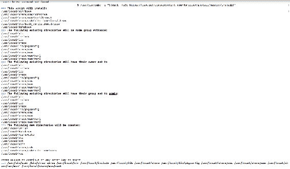
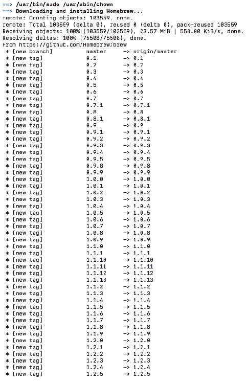
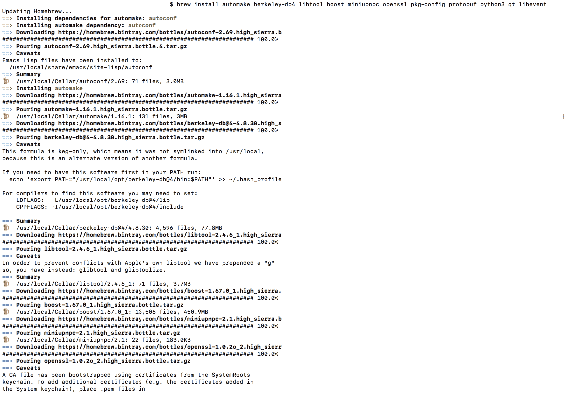
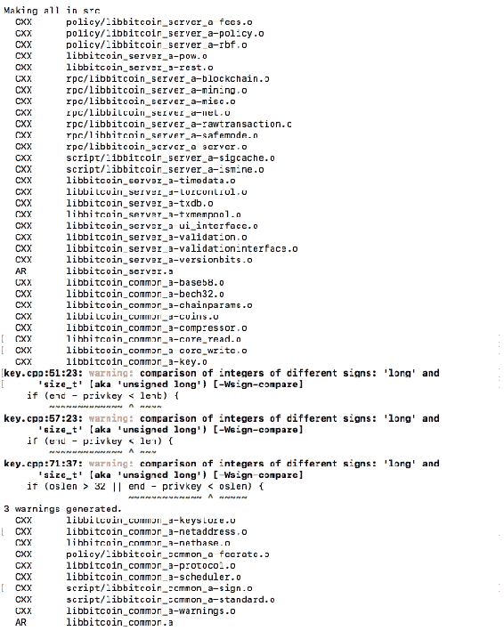
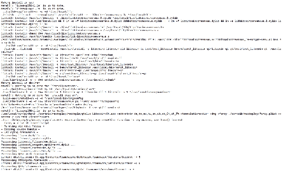
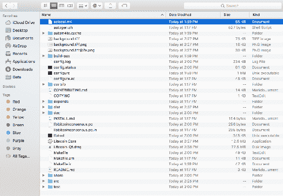
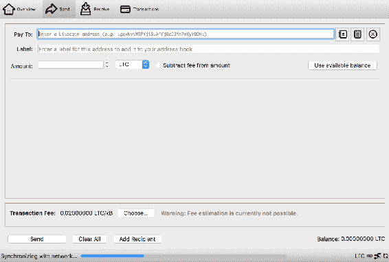

# 创建您自己的货币

到目前为止，我们已经广泛讨论了区块链、比特币和替代币。我们讨论了比特币、其区块链和组成区块链的其他元素的各种复杂性。到目前为止，以太坊一直是本书大部分内容的主要讨论对象。我们还阅读了其他基于区块链的项目，其中包括基于货币的项目。

尽管对区块链和比特币的开发知识有限，以太坊已经实现了制作去中心化应用程序的可能性。在交易所上有各种基于以太坊和其他类似项目构建的代币，得到了支持者和社区的认可。

在本章中，我们将讨论以下主题：

+   加密货币的类型

+   设置 Litecoin

+   分叉 Litecoin 存储库

+   在 Litecoin 存储库顶部创建自己的代币

# 理解加密货币的类型

有三种方式可以创建自己的加密货币。每种方式都比其他方式有其自身的优势。在创建货币之前，重要的是了解涉及其中的所有复杂性，以及您的货币与当前在交易所上可用的其他现有货币相比提供了什么。您可以在[https://coinmarketcap.com](https://coinmarketcap.com)找到流行的货币列表。

# 基于现有区块链的代币

这些代币是基于现有区块链平台的，例如以太坊、Omni、NEO等。我们已经在之前的[第 15 章](588b84f6-baef-4ea3-895e-bd66f523452b.xhtml)中讨论了代币的开发，*以太坊开发*。代币有助于更快地创建代币，并支持快速的上市策略，以便大部分时间可以投入到自托管区块链的进一步开发中。

有各种区块链项目的示例，它们开始作为代币，一旦它们启动了拥有完整支持的区块链和代币的项目，就会成功进行 ICO。由于与货币相比，开发代币更快且更容易，因此这类项目可以很容易地获得动力，并且在很短时间内启动，大部分时间可以投入到其他重要任务中，例如白皮书的创建、ICO等。

# 从头开始创建一个新的区块链

在这种方法中，可以从零开始创建自己的区块链。借鉴比特币和其他区块链平台的经验将有助于创建代币，这将允许您集成新功能，并使用不同的共识技术。

# 具有自己起源块的分叉区块链

本章的主要焦点是关于这种类型的货币开发；我们将在引入以太坊、Counterparty、NEO等平台后，创建完整的具有自己区块链的代币。通过采用比特币、Litecoin等现有货币的分叉来创建自己的区块链资源有限。

# Litecoin 的开发

莱特币是基于比特币构建的首批加密货币之一。莱特币的源代码从比特币的核心代码中分叉，包括比特币的钱包和其他资源。莱特币相对于比特币的主要变化是PoW算法是脚本而不是比特币的SHA-256。此外，莱特币的硬币供应限制为84,000,000 LTC，区块时间为2.5分钟。

# 这个过程

在这一章中，我们将从莱特币源代码中分叉并在其基础上进行工作。以下是涉及步骤的简要概述：

+   制定项目的布局和要求。

+   选择算法，有多种算法可供选择。在这一章中，我们将使用脚本算法，这是莱特币本身使用的。

+   **共识类型**：可以根据社区支持使用PoW、PoS或其他共识类型。在这一章中，我们将使用PoW共识类型，这需要矿工为硬币挖矿并确认交易。

+   **硬币名称**：必须决定硬币的名称。

+   **硬币缩写**：例如，比特币使用BTC，莱特币使用LTC；类似地，硬币需要一个缩写，所以最好让缩写与硬币名称相似。

+   **连接端口**：重要的是选择与网络连接的端口；这个端口将由连接到区块链网络的每个节点使用。

+   **区块奖励**：重要的是设置区块奖励，即在矿工挖矿成功时获得的硬币数量。

+   **区块减半时间**：这是区块奖励减半的时间，例如，在比特币中，每隔210,000个区块奖励减半，这控制了硬币的生产。

+   **硬币供应限制**：这是所有矿工总共生产的硬币数量的限制；这通常由区块减半时间控制，因为在一定数量的区块后，挖矿更多区块将不可行。

+   **Coinbase成熟度**：重要的是设置在区块挖矿奖励中获得的硬币在可以花费之前需要挖矿的区块数量。

+   **确认**：这是在确认交易之前需要挖矿的区块数量。

+   **难度重新调整时间**：例如，比特币的难度重新调整时间是两周；类似地，在开发过程中也需要设置这个时间。

+   **区块挖矿时间**：挖一个区块所需的总时间。

+   **种子节点**：这是硬币的起始节点；重要的是要有一个始终在线的节点，直到足够多的节点同步并连接到网络为止。可以接受多个种子节点地址的存在。我们还可以选择DNS种子，它们只不过是包含区块链网络种子节点地址的DNS服务器。

+   **钱包UI**：核心钱包建立在QT框架上，其GUI可以根据需求更改。

+   **图形资源**：可以在Litecoin源代码中选择并替换加密货币的图标和其他图形资源；建议保持图标的尺寸属性。

# 创建自己的加密货币

一旦定义了先前列出的参数，就是时候处理源代码并进行必要的更改了。

# 设置Litecoin

在本地机器中设置Litecoin环境是很重要的；源代码在GitHub上可用：[https://github.com/litecoin-project/litecoin](https://github.com/litecoin-project/litecoin)。

# 平台选择

选择要设置环境的构建平台是很重要的。您可以在源代码的`doc`子文件夹中找到所需的构建指令。那里为您提供了每个首选平台的所需指令文件，以便您按照这些步骤安装Litecoin核心和钱包。 

在本节中，我们将使用Max OS X构建指令，尽管还提供了其他平台的指令。

# 准备工作

编译所需依赖项需要安装`xcode`。应在终端中执行以下命令：

```
xcode-select --install
```

接下来需要安装在macOS上的软件包管理器`brew`。以下命令用于安装`brew`：

```
/usr/bin/ruby -e "$(curl -fsSL https://raw.githubusercontent.com/Homebrew/install/master/install)"
```



# 依赖项安装

安装了`brew`之后，下一步是使用以下命令安装所需的依赖项：



```
brew install automake berkeley-db4 libtool boost miniupnpc openssl pkg-config protobuf python3 qt libevent
```

上述命令将根据需要安装所有必要的依赖项：



# 构建指令

第一步是在根目录或其他目录中克隆Litecoin：

```
git clone https://github.com/litecoin-project/litecoin
cd Litecoin
```

使用以下命令执行`BerkleyDb`的安装：

```
./contrib/install_db4.sh .
```

Litecoin-core的构建使用以下make命令：

```
./autogen.sh
./configure
make
```



您可以运行单元测试，确保构建成功且没有任何错误：

```
make check
```

展示了包含`.app`包的`.dmg`的部署：



```
make deploy
```



# 设置我们自己的加密货币

现在，是时候着手处理我们自己的加密货币了；为此，重要的是检查克隆目录和Litecoin，并进行备份，以防有任何步骤出现致命错误。

根据我们在之前某个部分列出的参数，现在是在必要的位置替换参数的时候了。

`src`目录包含Litecoin核心源代码，大多数参数需在其中设置。在`chainparams.cpp`文件中，将缩写从`LTC`更改为我们选择的缩写。同样，建议更改其他文件中看起来合适的缩写。

# 端口选择

现在，需要更改端口，以便我们的区块链在网络中的所有节点的相关端口上运行。

在`init.cpp`文件中应更改连接端口。

在`bitcoinrpc.cpp`文件中应更改RPC端口。

# 区块相关参数的设置

在`validation.cpp`文件中，应编辑以下参数：

+   区块价值

+   区块奖励

+   区块时间

+   难度重新定位时间

+   难度重新定位比例

在`GetBlockSubsidy()`函数中应更改区块值：

```
CAmount GetBlockSubsidy(int nHeight, const Consensus::Params& consensusParams)
{
 int halvings = nHeight / consensusParams.nSubsidyHalvingInterval;
 // Force block reward to zero when right shift is undefined.
 if (halvings >= 64)
 return 0;

 CAmount nSubsidy = 50 * COIN;
 // Subsidy is cut in half every 210,000 blocks which will occur approximately every 4 years.
 nSubsidy >>= halvings;
 return nSubsidy;
}
```

# 金额限制

现在，是时候设置硬币限制和最小值了，可以在`amount.h`文件中完成相同的操作：

```
typedef int64_t CAmount;

static const CAmount COIN = 100000000;
static const CAmount CENT = 1000000;

static const CAmount MAX_MONEY = 84000000 * COIN;
inline bool MoneyRange(const CAmount& nValue) { return (nValue >= 0 && nValue <= MAX_MONEY); }

#endif // BITCOIN_AMOUNT_H
```

# coinbase成熟度数字

要更改coinbase的成熟度，在`qt`子文件夹中，应更改`transactionrecord.cpp`文件以设置在挖矿的硬币可花费之前要找到的所需区块数：

```
  if (nNet > 0 || wtx.IsCoinBase())
    {
        //
        // Credit
        //
        for(unsigned int i = 0; i < wtx.tx->vout.size(); i++)
        {
            const CTxOut& txout = wtx.tx->vout[i];
            isminetype mine = wallet->IsMine(txout);
            if(mine)
            {
                TransactionRecord sub(hash, nTime);
                CTxDestination address;
                sub.idx = i; // vout index
                sub.credit = txout.nValue;
                sub.involvesWatchAddress = mine & ISMINE_WATCH_ONLY;
                if (ExtractDestination(txout.scriptPubKey, address) && IsMine(*wallet, address))
                {
                    // Received by Bitcoin Address
                    sub.type = TransactionRecord::RecvWithAddress;
                    sub.address = EncodeDestination(address);
                }
                else
                {
                    // Received by IP connection (deprecated features), or a multisignature or other non-simple transaction
                    sub.type = TransactionRecord::RecvFromOther;
                    sub.address = mapValue["from"];
                }
                if (wtx.IsCoinBase())
                {
                    // Generated
                    sub.type = TransactionRecord::Generated;
                }

                parts.append(sub);
            }
        }
    }
    else
    {
        bool involvesWatchAddress = false;
        isminetype fAllFromMe = ISMINE_SPENDABLE;
        for (const CTxIn& txin : wtx.tx->vin)
        {
            isminetype mine = wallet->IsMine(txin);
            if(mine & ISMINE_WATCH_ONLY) involvesWatchAddress = true;
            if(fAllFromMe > mine) fAllFromMe = mine;
        }

        isminetype fAllToMe = ISMINE_SPENDABLE;
        for (const CTxOut& txout : wtx.tx->vout)
        {
            isminetype mine = wallet->IsMine(txout);
            if(mine & ISMINE_WATCH_ONLY) involvesWatchAddress = true;
            if(fAllToMe > mine) fAllToMe = mine;
        }

        if (fAllFromMe && fAllToMe)
        {
            // Payment to self
            CAmount nChange = wtx.GetChange();

            parts.append(TransactionRecord(hash, nTime, TransactionRecord::SendToSelf, "",
                            -(nDebit - nChange), nCredit - nChange));
            parts.last().involvesWatchAddress = involvesWatchAddress; // maybe pass to TransactionRecord as constructor argument
        }
```

我们必须将`transactionrecord.cpp`文件中的交易确认计数更改为设置此参数，根据我们的要求。

# 创世块创建

创世块是从`validation.cpp`文件中的`LoadBlockIndex()`函数创建的：

```
bool CChainState::LoadBlockIndex(const Consensus::Params& consensus_params, CBlockTreeDB& blocktree)
{
    if (!blocktree.LoadBlockIndexGuts(consensus_params, [this](const uint256& hash){ return this->InsertBlockIndex(hash); }))
        return false;

    boost::this_thread::interruption_point();

    // Calculate nChainWork
    std::vector<std::pair<int, CBlockIndex*> > vSortedByHeight;
    vSortedByHeight.reserve(mapBlockIndex.size());
    for (const std::pair<uint256, CBlockIndex*>& item : mapBlockIndex)
    {
        CBlockIndex* pindex = item.second;
        vSortedByHeight.push_back(std::make_pair(pindex->nHeight, pindex));
    }
    sort(vSortedByHeight.begin(), vSortedByHeight.end());
    for (const std::pair<int, CBlockIndex*>& item : vSortedByHeight)
    {
        CBlockIndex* pindex = item.second;
        pindex->nChainWork = (pindex->pprev ? pindex->pprev->nChainWork : 0) + GetBlockProof(*pindex);
        pindex->nTimeMax = (pindex->pprev ? std::max(pindex->pprev->nTimeMax, pindex->nTime) : pindex->nTime);
        // We can link the chain of blocks for which we've received transactions at some point.
        // Pruned nodes may have deleted the block.
        if (pindex->nTx > 0) {
            if (pindex->pprev) {
                if (pindex->pprev->nChainTx) {
                    pindex->nChainTx = pindex->pprev->nChainTx + pindex->nTx;
                } else {
                    pindex->nChainTx = 0;
                    mapBlocksUnlinked.insert(std::make_pair(pindex->pprev, pindex));
                }
            } else {
                pindex->nChainTx = pindex->nTx;
            }
        }
        if (!(pindex->nStatus & BLOCK_FAILED_MASK) && pindex->pprev && (pindex->pprev->nStatus & BLOCK_FAILED_MASK)) {
            pindex->nStatus |= BLOCK_FAILED_CHILD;
            setDirtyBlockIndex.insert(pindex);
        }
        if (pindex->IsValid(BLOCK_VALID_TRANSACTIONS) && (pindex->nChainTx || pindex->pprev == nullptr))
            setBlockIndexCandidates.insert(pindex);
        if (pindex->nStatus & BLOCK_FAILED_MASK && (!pindexBestInvalid || pindex->nChainWork > pindexBestInvalid->nChainWork))
            pindexBestInvalid = pindex;
        if (pindex->pprev)
            pindex->BuildSkip();
        if (pindex->IsValid(BLOCK_VALID_TREE) && (pindexBestHeader == nullptr || CBlockIndexWorkComparator()(pindexBestHeader, pindex)))
            pindexBestHeader = pindex;
    }

    return true;
}
```

此外，在`chainparams.cpp`中，应将释义更改为所需的参数选择。在Litecoin中，使用以下参数：

```
    const char* pszTimestamp = "NY Times 05/Oct/2011 Steve Jobs, Apple’s Visionary, Dies at 56";
```

# 钱包地址

钱包地址是区块链的重要组成部分，如果没有正确的私钥和公钥，就无法对Litecoin的源进行相关更改。起始字母可以在`base58.cpp`文件中设置。

# 检查点

检查点被硬编码到Litecoin Core客户端中。设置检查点后，所有交易都有效直到检查点条件有效。这是为了以防有人想要分叉区块链并从完全相同的区块开始；检查点将会失效，并且不会接受任何进一步的交易。`checkpoints.cpp`文件帮助管理区块链源代码中的检查点：

```
namespace Checkpoints {

    CBlockIndex* GetLastCheckpoint(const CCheckpointData& data)
    {
        const MapCheckpoints& checkpoints = data.mapCheckpoints;

        for (const MapCheckpoints::value_type& i : reverse_iterate(checkpoints))
        {
            const uint256& hash = i.second;
            BlockMap::const_iterator t = mapBlockIndex.find(hash);
            if (t != mapBlockIndex.end())
                return t->second;
        }
        return nullptr;
   }
```

# 创意和图形

可以从`src/qt/res/icons`目录设置和替换图标和其他图形，该目录包含所有图像和硬币的主标志。

文件`bitcoin.png`和`about.png`包含特定硬币的标志。

# 总结

通过遵循上述要点，可以使用Litecoin源代码创建和运行硬币；一旦硬币被创建并运行，下一步将是测试实际生产级别的使用。进一步的步骤包括编译硬币源代码并使用基于QT的钱包：



# 摘要

在这一章中，我们讨论了创建我们自己的加密货币，因为我们已经在[第 15 章](588b84f6-baef-4ea3-895e-bd66f523452b.xhtml) *以太坊开发* 中讨论了基于以太坊平台的代币的创建。在本章中，我们致力于创建我们自己的区块链，通过对 Litecoin 进行分叉，然后进行必要的更改，以创建具有相关参数的所需硬币。

在接下来的章节中，我们将就区块链未来的两个方面进行讨论，即可扩展性和区块链面临的其他挑战。此外，我们将讨论区块链的未来，以及它将如何塑造互联网和技术的未来，不仅仅是在基于货币的行业方面，还包括其他行业，在这些行业中，区块链充当了一个颠覆者。
