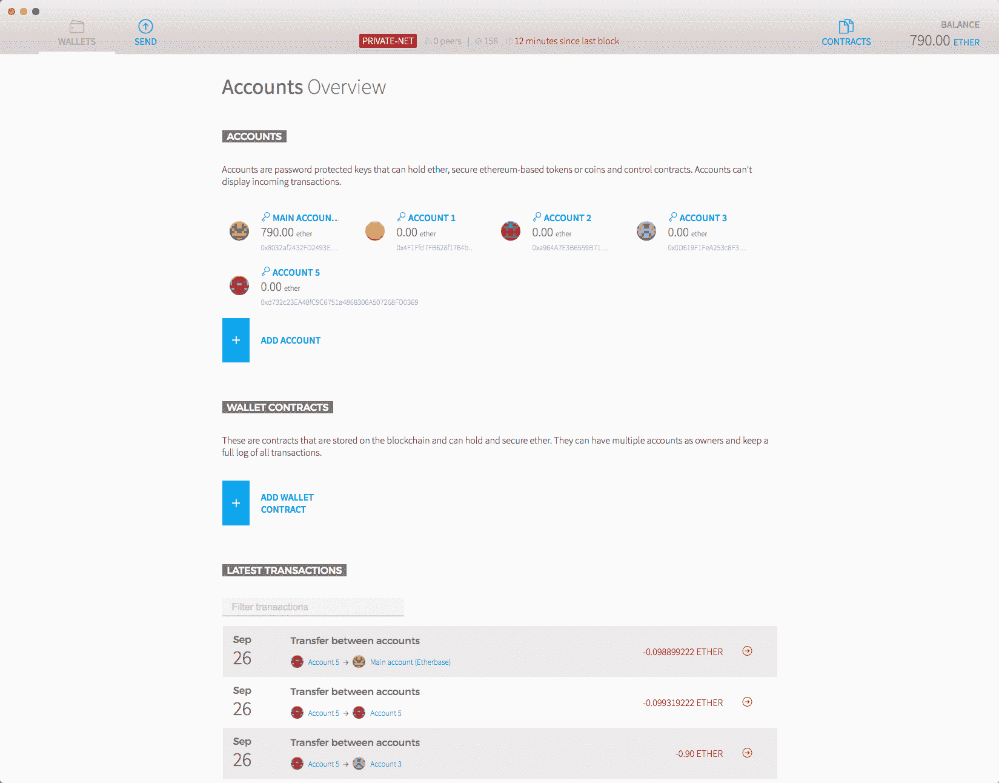

# 第二章：了解以太坊的工作原理

在上一章中，我们看到了什么是 DApps。我们还看到了一些流行 DApps 的概述。其中之一是以太坊。目前，以太坊是继比特币之后最流行的 DApp。在本章中，我们将深入学习以太坊的工作原理以及我们可以使用以太坊开发什么。我们还将看到重要的以太坊客户端和节点实现。

在本章中，我们将涵盖以下主题：

+   以太坊用户账户

+   智能合约是什么，它们是如何工作的？

+   以太坊虚拟机

+   工作量证明共识协议中的挖掘是如何工作的？

+   学习如何使用 geth 命令

+   设置以太坊钱包和 Mist

+   Whisper 和 Swarm 概述

+   以太坊的未来

# 以太坊概述

以太坊是一个分散式平台，允许我们在其上部署 DApps。智能合约使用 Solidity 编程语言编写。DApps 使用一个或多个智能合约创建。智能合约是完全按照程序运行的程序，没有任何停机、审查、欺诈或第三方接口的可能性。在以太坊中，智能合约可以用几种编程语言编写，包括 Solidity、LLL 和 Serpent。Solidity 是其中最流行的语言。以太坊有一种内部货币称为以太。部署智能合约或调用其方法需要以太。就像任何其他 DApp 一样，智能合约可以有多个实例，每个实例都由其唯一地址标识。用户账户和智能合约都可以持有以太。

以太坊使用区块链数据结构和工作量证明共识协议。智能合约的一种方法可以通过交易或另一种方法调用。网络中有两种类型的节点：常规节点和矿工。常规节点只是拥有区块链的副本，而矿工通过挖掘区块来构建区块链。

# 以太坊账户

要创建一个以太坊账户，我们只需要一个非对称密钥对。有各种算法，如 RSA、ECC 等，用于生成非对称加密密钥。以太坊使用**椭圆曲线加密**（**ECC**）。ECC 有各种参数。这些参数用于调整速度和安全性。以太坊使用`secp256k1`参数。深入了解 ECC 及其参数将需要数学知识，并且对于使用以太坊构建 DApps 而言，深入理解它并非必需。

以太坊使用 256 位加密。以太坊私钥/公钥是一个 256 位数。由于处理器无法表示如此大的数字，它被编码为长度为 64 的十六进制字符串。

每个账户由一个地址表示。一旦我们有了生成地址所需的密钥，这里是从公钥生成地址的步骤：

1.  首先，生成公钥的`keccak-256`哈希。这将给你一个 256 位的数字。

1.  放弃前 96 位，也就是 12 个字节。你现在应该有 160 个位的二进制数据，也就是 20 个字节。

1.  现在将地址编码为十六进制字符串。因此最终，你将得到一个由 40 个字符组成的字节字符串，这就是你的账户地址。

现在任何人都可以向这个地址发送以太币。

# 交易

**交易**是一个签名的数据包，用于将以太坊从一个账户转移到另一个账户或合约，调用合约的方法，或部署新的合约。交易使用**ECDSA**（**椭圆曲线数字签名算法**）进行签名，这是基于 ECC 的数字签名算法。交易包含了消息的接收者，用于识别发送者并证明其意图的签名，要转移的以太币数量，交易执行允许的最大计算步骤数（称为 gas 限制），以及发送者愿意支付每个计算步骤的费用（称为 gas 价格）。如果交易的目的是调用合约的方法，它还包含了输入数据；或者如果其目的是部署合约，那么它可以包含初始化代码。gas 使用量和 gas 价格的乘积被称为交易费用。要发送以太币或执行合约方法，你需要向网络广播一笔交易。发送者需要用私钥对交易进行签名。

如果我们确信一笔交易将永远出现在区块链中，那么这笔交易就被确认。建议在假定一笔交易已确认之前等待 15 个确认。

# 共识

以太坊网络中的每个节点都保存着区块链的副本。我们需要确保节点无法篡改区块链，还需要一种机制来检查一个区块是否有效。此外，如果我们遇到两个不同的有效区块链，我们需要一种方法来找出选择哪一个。

以太坊使用工作量证明共识协议来保持区块链的防篡改性。工作量证明系统涉及解决一个复杂的谜题以创建一个新的区块。解决这个谜题应该需要大量的计算能力，因此难以创建区块。在工作量证明系统中创建区块的过程称为挖矿。矿工是网络中挖矿的节点。使用工作量证明的所有 DApp 并不完全实现相同的一组算法。它们可能在矿工需要解决的谜题，谜题的难度，解决时间等方面有所不同。我们将学习有关以太坊工作量证明的内容。

任何人都可以成为网络中的矿工。每个矿工都独立解决谜题；第一个解决谜题的矿工是赢家，并且将获得五个以太和该区块中所有交易的交易费用。如果你拥有比网络中任何其他节点更强大的处理器，这并不意味着你总会成功，因为谜题的参数对所有矿工来说并不完全相同。但是，如果你拥有比网络中任何其他节点更强大的处理器，这会增加你成功的机会。工作证明的行为类似于彩票系统，处理能力可以被视为一个人拥有的彩票数量。网络安全性不是由矿工的总数来衡量的；相反，它是由网络的总处理能力来衡量的。

区块链可以拥有的区块数量没有限制，可以生产的总以太币数量也没有限制。一旦一个矿工成功挖掘一个区块，它就会将该区块广播到网络中的所有其他节点。一个区块有一个头和一组交易。每个区块都持有前一个区块的哈希，从而创建了一个连接的链。

让我们看看矿工需要解决的难题是什么，以及在高层次上如何解决它。要挖掘一个区块，首先，矿工收集到的新未开采的交易被广播到它，然后过滤掉无效的交易。一个有效的交易必须使用私钥正确签名，账户必须有足够的余额来进行交易等等。现在矿工创建一个区块，它有一个头和内容。内容是该区块包含的交易列表。头包含诸如前一个区块的哈希、区块号、随机数、目标、时间戳、难度、矿工地址等内容。时间戳表示区块创建时的时间。然后随机数是一个毫无意义的值，它被调整以找到谜题的解决方案。这个谜题基本上是找到这样的随机数值，当区块被散列时，散列小于或等于目标。以太坊使用 ethash 哈希算法。找到随机数的唯一方法是枚举所有可能性。目标是一个 256 位数字，它是根据各种因素计算出来的。头中的难度值是目标的不同表示，以便更容易处理。目标越低，找到随机数的时间就越长，目标越高，找到随机数的时间就越短。这是计算谜题难度的公式：

```
current_block_difficulty = previous_block_difficulty + previous_block_difficulty // 2048 * max(1 - (current_block_timestamp - previous_blocktimestamp) // 10, -99) + int(2 ** ((current_block_number // 100000) - 2)) 

```

现在网络中的任何节点都可以通过首先检查区块链中的交易是否有效、时间戳验证，然后检查所有区块的目标和随机数是否有效，矿工是否为自己分配了有效的奖励等等来检查他们所拥有的区块链是否有效。

如果网络中的一个节点接收到两个不同的有效区块链，那么所有区块的综合难度更高的区块链将被视为有效的区块链。

现在，举个例子，如果网络中的一个节点改变了某个区块中的一些交易，那么该节点需要计算所有后续区块的随机数。当它重新找到后续区块的随机数时，网络可能已经挖掘了更多的区块，因此将拒绝此区块链，因为其综合难度将较低。

# 时间戳

计算区块目标的公式需要当前时间戳，而且每个区块的头部都附有当前时间戳。没有任何东西能阻止矿工在挖掘新区块时使用其他时间戳而不是当前时间戳，但他们通常不会这样做，因为时间戳验证会失败，其他节点不会接受该区块，而且这将是矿工资源的浪费。当一个矿工广播一个新挖掘的区块时，它的时间戳会通过检查该时间戳是否大于上一个区块的时间戳来进行验证。如果一个矿工使用的时间戳大于当前时间戳，则难度将较低，因为难度与当前时间戳成反比；因此，区块时间戳为当前时间戳的矿工将被网络接受，因为它的难度将更高。如果一个矿工使用的时间戳大于上一个区块的时间戳且小于当前时间戳，则难度将更高，因此，挖掘区块将需要更多的时间；在区块被挖掘时，网络可能已经产生了更多的区块，因此，这个区块将被拒绝，因为恶意矿工的区块链的难度将低于网络的区块链。由于这些原因，矿工们总是使用准确的时间戳，否则他们将一无所获。

# 随机数

随机数是一个 64 位无符号整数。随机数是谜题的解答。矿工不断递增随机数，直到找到解答。现在你一定在想，如果有一名矿工的哈希功率超过网络中的任何其他矿工，那么该矿工是否总能第一个找到随机数？嗯，并不是。

矿工正在挖掘的区块的哈希对于每个矿工都是不同的，因为哈希依赖于时间戳、矿工地址等因素，而且不太可能对所有矿工都相同。因此，这不是一个解决难题的竞赛，而是一个抽奖系统。但当然，根据其哈希功率，一个矿工可能会有好运气，但这并不意味着矿工总能找到下一个区块。

# 区块时间

我们之前看到的区块难度公式使用了一个 10 秒的阈值，以确保父区块和子区块的挖掘时间之差在 10-20 秒之间。但为什么是 10-20 秒而不是其他值呢？为什么存在这样一个恒定的时间差限制，而不是一个恒定的难度呢？

想象一下，我们有一个恒定的难度，矿工只需要找到一个随机数（nonce），使得区块的哈希值小于或等于难度。假设难度很高；在这种情况下，用户将无法知道发送以太币给另一个用户需要多长时间。如果网络的计算能力不足以快速找到满足难度的随机数，则可能需要很长时间。有时，网络可能会很幸运地快速找到随机数。但这种系统很难吸引用户，因为用户总是想知道交易完成需要多长时间，就像我们从一个银行账户向另一个银行账户转账时，会给出一个应该在其中完成的时间段。如果恒定的难度较低，它将危害区块链的安全性，因为大型矿工可以比小型矿工更快地挖掘区块，而网络中最大的矿工将有能力控制 DApp。不可能找到一个能使网络稳定的恒定难度值，因为网络的计算能力不是恒定的。

现在我们知道为什么我们应该始终有一个网络挖掘一个区块需要多长时间的平均时间了。现在的问题是，最适合的平均时间是多长，因为它可以是从 1 秒到无限秒的任何值。通过降低难度可以实现较小的平均时间，通过增加难度可以实现较高的平均时间。但较低和较高平均时间的优缺点是什么？在讨论这个问题之前，我们需要先知道什么是陈旧区块。

如果两个矿工几乎同时挖掘出下一个区块会发生什么？这两个区块肯定都是有效的，但区块链不能容纳两个具有相同区块编号的区块，而且两个矿工也不能都获得奖励。尽管这是一个常见的问题，但解决方法很简单。最终，难度较高的区块将被网络接受。因此，最终被留下的有效区块被称为陈旧区块。

网络中产生的陈旧区块的总数量与生成新区块的平均时间成反比。更短的区块生成时间意味着新挖出的区块在整个网络中传播的时间更短，多于一个矿工找到谜题解决方案的机会更大，因此在区块通过网络传播时，其他矿工也可能已经解决了谜题并进行了广播，从而产生了陈旧区块。但是，如果平均区块生成时间更长，则多个矿工有较小机会解决谜题，即使他们解决了谜题，解决之间可能存在时间差，在此期间第一个解决的区块可以传播，其他矿工可以停止挖掘该区块，并转向挖掘下一个区块。如果网络中频繁出现陈旧区块，则会造成重大问题，但是如果很少出现陈旧区块，则不会造成危害。

那么陈旧区块有什么问题？它们延迟了交易的确认。当两个矿工几乎同时挖掘一个区块时，它们可能没有相同的交易集，因此如果我们的交易出现在其中一个区块中，我们不能说它已被确认，因为包含该交易的区块可能是陈旧的。我们需要等待更多的区块被挖掘。由于陈旧区块的存在，平均确认时间不等于平均区块生成时间。

陈旧区块会影响区块链安全吗？是的，会。我们知道，网络安全是由网络中矿工的总计算能力来衡量的。当计算能力增加时，难度也会增加，以确保区块不会比平均区块时间提前产生。因此，更高的难度意味着更安全的区块链，因为要篡改节点，现在需要更多的哈希算力，这使得篡改区块链更加困难；因此，可以说区块链更安全。当几乎同时挖掘两个区块时，我们将把网络分成两部分，分别为两个不同的区块链，但其中一个将成为最终的区块链。因此，工作在陈旧区块上的网络部分在陈旧区块上挖掘下一个区块，这导致网络的哈希算力损失，因为哈希算力被用于一些不必要的事情。网络的两个部分挖掘下一个区块的时间可能比平均区块时间长，因为它们丢失了哈希算力；因此，在挖掘下一个区块后，难度将减少，因为挖掘该区块所需的时间比平均区块时间长。难度的降低影响整体区块链安全性。如果陈旧率过高，它将对区块链安全性造成巨大影响。

以太坊利用所谓的幽灵协议来解决陈旧区块带来的安全问题。以太坊使用了实际幽灵协议的修改版本。幽灵协议通过简单地将陈旧区块添加到主区块链中来掩盖安全问题，从而增加了区块链的总难度，因为区块链的总难度也包括陈旧区块的难度之和。但是如何将陈旧区块插入主区块链而不发生交易冲突呢？嗯，任何区块都可以指定 0 个或多个陈旧区块。为了激励矿工将陈旧区块包含在内，矿工会因包含陈旧区块而获得奖励。而且，陈旧区块的挖矿者也会获得奖励。陈旧区块中的交易不用于计算确认，并且，陈旧区块的挖矿者不会收到陈旧区块中包含的交易的交易费。请注意，以太坊将陈旧区块称为叔区块。

这里是计算陈旧区块挖矿者获得多少奖励的公式。剩余的奖励归侄子区块，即包含孤立区块的区块：

```
(uncle_block_number + 8 - block_number) * 5 / 8 

```

由于不奖励陈旧区块的挖矿者不会损害任何安全性，你可能会想为什么陈旧区块的挖矿者会得到奖励？嗯，当网络中频繁出现陈旧区块时会引起另一个问题，这个问题通过奖励陈旧区块的挖矿者来解决。挖矿者应该获得与其为网络贡献的哈希算力百分比相似的奖励百分比。当两个不同的挖矿者几乎同时挖掘出一个区块时，由于挖矿者挖掘下一个区块的效率更高，更有可能将由哈希算力更大的挖矿者挖掘的区块添加到最终的区块链中；因此，小挖矿者将失去奖励。如果陈旧率低，这不是一个大问题，因为大挖矿者将获得少量奖励增加；但是如果陈旧率高，就会引起一个大问题，即网络中的大挖矿者最终将获得比应该获得的更多的奖励。幽灵协议通过奖励陈旧区块的挖矿者来平衡这一点。由于大挖矿者并不获取所有奖励，但获取比应该得到的更多，因此我们不像侄子区块一样奖励陈旧区块的挖矿者；而是奖励更少的金额来平衡。前述公式相当好地平衡了这一点。

幽灵限制了侄子可以引用的陈旧区块的总数，以防止矿工简单地挖掘陈旧区块并使区块链停滞。

不管在网络中出现多少陈旧的区块，都会在某种程度上影响网络。陈旧区块的频率越高，网络受到的影响就越大。

# 分叉

当节点之间就区块链的有效性存在冲突时，即网络中存在多个区块链，并且每个区块链都被某些矿工验证时，就会发生分叉。有三种类型的分叉：常规分叉、软分叉和硬分叉。

常规分叉是由于两个或多个矿工几乎同时找到一个区块而发生的暂时冲突。当其中一个的难度高于另一个时，冲突将得到解决。

对源代码的更改可能导致冲突。根据冲突的类型，可能需要拥有超过 50％哈希算力的矿工进行升级，或者所有矿工进行升级以解决冲突。当需要拥有超过 50％哈希算力的矿工进行升级以解决冲突时，称为软分叉；而当需要所有矿工进行升级以解决冲突时，则称为硬分叉。软分叉的一个例子是，如果对源代码的更新使一部分旧区块/交易无效，那么当超过 50％的哈希算力的矿工进行了升级后，这个问题可以解决，因为新的区块链将具有更高的难度最终被整个网络接受。硬分叉的一个例子是，如果源代码的更新是为了更改矿工的奖励，那么所有矿工都需要进行升级以解决冲突。

自发布以来，以太坊经历了各种硬分叉和软分叉。

# 创世块

创世块是区块链中的第一个块。它被分配到块编号 0。它是区块链中唯一一个不引用以前块的块，因为以前没有任何块。它不包含任何交易，因为目前还没有产生任何以太币。

两个网络中的节点只有在它们都拥有相同的创世块（genesis block）时才会配对，也就是说，只有当两个节点拥有相同的创世块时，区块同步才会发生，否则它们将互相拒绝。高难度的不同创世块不能取代低难度的创世块。每个节点都生成自己的创世块。对于各种网络，创世块是硬编码到客户端中的。

# 以太币面额

以太币和任何其他货币一样，有各种面额。以下是各种面额：

+   1 以太币 = 1000000000000000000 维（Wei）

+   1 以太币 = 1000000000000000 千维（Kwei）

+   1 以太币 = 1000000000000 英美制微（Mwei）

+   1 以太币 = 1000000000 吉（Gwei）

+   1 以太币 = 1000000 萨博（Szabo）

+   1 以太币 = 1000 芬尼（Finney）

+   1 以太币 = 0.001 开斯（Kether）

+   1 以太币 = 0.000001 兆斯（Mether）

+   1 以太币 = 0.000000001 盖撒币（Gether）

+   1 以太币 = 0.000000000001 泰达币（Tether）

# 以太坊虚拟机

EVM（或以太坊虚拟机）是以太坊智能合约字节码执行环境。网络中的每个节点都运行 EVM。所有节点都使用 EVM 执行指向智能合约的交易，因此每个节点都进行相同的计算并存储相同的值。只转移以太币的交易也需要一些计算，即找出地址是否有余额，并相应地扣除余额。

每个节点都执行交易并存储最终状态，原因有很多。例如，如果有一个存储参加派对的每个人的姓名和详情的智能合约，每当添加一个新人时，一个新的交易就会被广播到网络中。对于网络中的任何节点来说，他们只需要读取合约的最终状态就可以显示参加派对的每个人的详情。

网络中的每笔交易都需要进行一些计算和存储。因此，需要有一定的交易费用，否则整个网络将被垃圾邮件交易淹没。此外，如果没有交易成本，矿工将没有理由将交易包含在区块中，他们将开始挖掘空块。每笔交易需要不同量的计算和存储；因此，每笔交易都有不同的交易成本。

EVM 有两种实现，即字节码虚拟机和 JIT-VM。在编写本书时，JIT-VM 可以使用，但其开发尚未完成。无论哪种情况，Solidity 代码都会被编译成字节码。在 JIT-VM 的情况下，字节码会进一步被编译。JIT-VM 比其对应的更高效。

# 气体

气体是计算步骤的度量单位。每笔交易都需要包括一个气体限制和它愿意支付的每单位气体费用（即每次计算的费用）；矿工可以选择包含该交易并收取该费用。如果交易使用的气体少于或等于气体限制，交易将被处理。如果总气体超过了气体限制，那么所有的更改都将被撤销，除了交易仍然有效，矿工仍然可以收取费用（即最大可使用的气体和气体价格的乘积）。

矿工决定气体价格（即每次计算的价格）。如果一笔交易的气体价格低于矿工决定的气体价格，矿工将拒绝挖掘该交易。气体价格是以 wei 为单位的一笔金额。因此，如果气体价格低于矿工所需的价格，矿工可以拒绝在区块中包含交易。

EVM 中的每个操作都被分配了消耗的气体数量。

交易成本会影响账户可以向另一个账户转移的最大以太币数量。例如，如果一个账户有五个以太币的余额，它不能将所有五个以太币转移到另一个账户，因为如果所有以太币都转移了，那么账户中就没有余额可以从中扣除交易费用。

如果一个交易调用了一个合约方法，并且该方法发送了一些以太币或调用了其他合约方法，交易费将从调用合约方法的账户中扣除。

# 对等发现

要使节点成为网络的一部分，它需要连接到网络中的一些其他节点，以便它可以广播交易/区块并监听新的交易/区块。一个节点不需要连接到网络中的每个节点；相反，一个节点连接到一些其他节点。而这些节点连接到另一些节点。通过这种方式，整个网络相互连接。

但是节点如何在网络中找到其他节点呢？因为没有一个所有人都可以连接的中央服务器来交换信息。以太坊有自己的节点发现协议来解决这个问题，该协议基于 Kadelima 协议。在节点发现协议中，我们有一种特殊类型的节点称为引导节点。引导节点在一段时间内维护着与它们连接的所有节点的列表。它们不保存区块链本身。当节点连接到以太坊网络时，它们首先连接到引导节点，后者共享了最后一个预定义时间段内连接到它们的节点的列表。连接的节点然后连接并与节点同步。

可以有各种各样的以太坊实例，即各种网络，每个网络都有自己的网络 ID。两个主要的以太坊网络是主网和测试网。主网是在交易所交易其以太币的网络，而测试网是开发者用来测试的。到目前为止，我们已经了解了关于主网区块链的所有内容。

Bootnode 是以太坊引导节点的最流行实现。如果你想托管自己的引导节点，可以使用 bootnode。

# Whisper 和 Swarm

Whisper 和 Swarm 分别是由以太坊开发者开发的去中心化通信协议和去中心化存储平台。Whisper 是一个去中心化的通信协议，而 Swarm 是一个去中心化的文件系统。

Whisper 让网络中的节点相互通信。它支持广播、用户间加密消息等。它不是设计用来传输大量数据的。你可以在[`github.com/ethereum/wiki/wiki/Whisper`](https://github.com/ethereum/wiki/wiki/Whisper)了解更多关于 Whisper 的信息，也可以在[`github.com/ethereum/wiki/wiki/Whisper-Overview`](https://github.com/ethereum/wiki/wiki/Whisper-Overview)查看代码示例概述。

Swarm 类似于 Filecoin，主要区别在于技术和激励机制。 Filecoin 不惩罚存储，而 Swarm 惩罚存储，因此进一步增加了文件的可用性。 你可能会想了解 Swarm 中的激励机制是如何工作的。 它是否有内部货币？ 实际上，Swarm 没有内部货币，而是使用以太坊的激励机制。 以太坊中有一个智能合约，用于跟踪激励机制。显然，智能合约无法与 Swarm 通信；相反，Swarm 与智能合约通信。 因此，你通过智能合约支付存储，付款在到期日期之后释放给存储。 你还可以向智能合约举报文件丢失，这种情况下它可以惩罚相应的存储。 你可以在[`github.com/ethersphere/go-ethereum/wiki/IPFS-&-SWARM`](https://github.com/ethersphere/go-ethereum/wiki/IPFS-&-SWARM)中了解更多有关 Swarm 和 IPFS/Filecoin 之间的区别，并在[`github.com/ethersphere/go-ethereum/blob/bzz-config/bzz/bzzcontract/swarm.sol`](https://github.com/ethersphere/go-ethereum/blob/bzz-config/bzz/bzzcontract/swarm.sol)上查看智能合约代码。

在撰写本书时，Whisper 和 Swarm 仍在开发中，因此许多事情仍不清楚。

# Geth

Geth（或称为 go-ethereum）是以太坊、Whisper 和 Swarm 节点的实现。 Geth 可用于成为所有这些的一部分或仅选定的一部分。 将它们合并的原因是使它们看起来像一个单一的 DApp，以便通过一个节点，客户端可以访问所有三个 DApps。

Geth 是一个命令行应用程序。 它是用 go 编程语言编写的。 它适用于所有主要操作系统。 目前的 geth 版本尚未支持 Swarm，并且仅支持 Whisper 的一些功能。在撰写本书时，最新版本的 geth 是 1.3.5。

# 安装 geth

Geth 适用于 OS X、Linux 和 Windows。 它支持两种安装类型：二进制安装和脚本安装。 在撰写本书时，最新的稳定版本是 1.4.13\. 让我们看看如何在各种操作系统上使用二进制安装方法安装它。 当你必须修改 geth 源代码并安装它时，才使用脚本化安装。 我们不希望对源代码进行任何更改，因此我们将选择二进制安装。

# OS X

在 OS X 上安装 geth 的推荐方法是使用 brew。 在终端中运行这两个命令以安装 geth：

```
brew tap ethereum/ethereum 
brew install ethereum  

```

# Ubuntu

推荐在 Ubuntu 上安装 geth 的方法是使用`apt-get`。 在 Ubuntu 终端中运行这些命令以安装 geth：

```
sudo apt-get install software-properties-common 
sudo add-apt-repository -y ppa:ethereum/ethereum 
sudo apt-get update 
sudo apt-get install ethereum

```

# Windows

Geth 为 Windows 提供可执行文件。从 [`github.com/ethereum/go-ethereum/wiki/Installation-instructions-for-Windows`](https://github.com/ethereum/go-ethereum/wiki/Installation-instructions-for-Windows) 下载 zip 文件，并进行解压。在其中，您将找到 `geth.exe` 文件。

要了解更多关于在各种操作系统上安装 geth 的信息，请访问[`github.com/ethereum/go-ethereum/wiki/Building-Ethereum`](https://github.com/ethereum/go-ethereum/wiki/Building-Ethereum)。

# JSON-RPC 和 JavaScript 控制台

Geth 为其他应用程序提供了 JSON-RPC API 以进行通信。Geth 使用 HTTP、WebSocket 和其他协议提供 JSON-RPC API。JSON-RPC 提供的 API 分为以下类别：admin、debug、eth、miner、net、personal、shh、txpool 和 web3。您可以在此处找到更多关于它的信息[`github.com/ethereum/go-ethereum/wiki/JavaScript-Console`](https://github.com/ethereum/go-ethereum/wiki/JavaScript-Console)。

Geth 还提供了一个交互式 JavaScript 控制台，以便使用 JavaScript API 与其进行程序化交互。此交互式控制台使用 JSON-RPC 通过 IPC 与 geth 进行通信。我们将在后续章节中了解更多关于 JSON-RPC 和 JavaScript API 的内容。

# 子命令和选项

让我们通过示例来学习 geth 命令的一些重要子命令和选项。您可以使用 help 子命令找到所有子命令和选项的列表。在接下来的章节中，我们将看到更多关于 geth 及其命令的内容。

# 连接到主网网络

以太坊网络中的节点默认使用 `30303` 端口进行通信。但节点也可以选择监听其他端口号。

要连接到主网网络，只需运行 `geth` 命令。以下是明确指定网络 ID 和指定 geth 将存储下载的区块链的自定义目录的示例：

```
    geth --datadir "/users/packt/ethereum" --networkid 1

```

`--datadir` 选项用于指定区块链存储位置。如果没有提供，默认路径为 `$HOME/.ethereum`。

`--networkid` 用于指定网络 ID。1 是主网的 ID。如果未提供，默认值为 1。测试网的网络 ID 为 2。

# 创建私有网络

要创建一个私有网络，只需提供一个随机网络 ID。私有网络通常用于开发目的。Geth 还提供了与日志记录和调试相关的各种标志，在开发过程中非常有用。因此，我们可以简单地使用 `--dev` 标志，该标志会启用各种调试和日志记录标志来运行私有网络，而无需提供随机网络 ID 和各种日志记录和调试标志。

# 创建账户

Geth 还允许我们创建账号，即生成与其关联的密钥和地址。要创建账户，请使用以下命令：

```
    geth account new

```

运行此命令时，将要求您输入密码来加密您的账户。如果忘记密码，将无法访问您的账户。

要获取本地钱包中所有账户的列表，请使用以下命令：

```
    geth account list

```

上述命令将打印所有账户的地址列表。密钥默认存储在`--datadir`路径中，但您可以使用`--keystore`选项指定其他目录。

# 挖矿

默认情况下，geth 不会开始挖矿。要指示 geth 开始挖矿，只需提供 `--mine` 选项。还有一些与挖矿相关的其他选项：

```
    geth --mine --minerthreads 16 --minergpus '0,1,2' --etherbase '489b4e22aab35053ecd393b9f9c35f4f1de7b194' --unlock '489b4e22aab35053ecd393b9f9c35f4f1de7b194'

```

在此，除了`--mine`选项外，我们还提供了各种其他选项。`--minerthreads`选项指定哈希时要使用的总线程数。默认情况下，使用八个线程。Etherbase 是挖矿获得的奖励存入的地址。默认情况下，账户是加密的。因此，为了访问账户中的以太币，我们需要解锁它，即解密账户。解密用于解密与账户关联的私钥。要开始挖矿，我们不需要解锁它，因为只需要地址来存入挖矿奖励。可以使用 `-unlock` 选项解锁一个或多个账户。通过逗号分隔地址可以提供多个地址。

`--minergpus` 用于指定用于挖矿的 GPU。要获取 GPU 列表，请使用 `geth gpuinfo` 命令。每个 GPU 需要 1-2 GB 的 RAM。默认情况下，它不使用 GPU，而只使用 CPU。

# 快速同步

撰写本书时，区块链的大小约为 30GB。如果您的互联网连接速度慢，下载可能需要几个小时或几天。以太坊实现了一个快速同步算法，可以更快地下载区块链。

快速同步不会下载整个区块；相反，它只下载区块头、交易收据和最近的状态数据库。因此，我们不必下载和重放所有交易。为了检查区块链的完整性，该算法在每个定义的区块数量之后下载一个完整的区块。要了解有关快速同步算法的更多信息，请访问[`github.com/ethereum/go-ethereum/pull/1889`](https://github.com/ethereum/go-ethereum/pull/1889)。

在下载区块链时使用快速同步，您需要在运行 geth 时使用`--fast`标志。

由于安全原因，快速同步只会在初始同步期间运行（即当节点自己的区块链为空时）。当节点成功与网络同步后，快速同步将永久禁用。作为额外的安全功能，如果快速同步在随机轴点附近或之后失败，它会被禁用作为安全预防措施，节点将恢复到完全基于区块处理的同步。

# 以太坊钱包

以太坊钱包是一个以太坊 UI 客户端，允许您创建账户、发送以太币、部署合约、调用合约的方法等等。

以太坊钱包随附了 geth。当您运行以太坊时，它会尝试找到本地的 geth 实例并连接到它，如果找不到正在运行的 geth，则启动自己的 geth 节点。以太坊钱包使用 IPC 与 geth 进行通信。Geth 支持基于文件的 IPC。

如果在运行 geth 时更改数据目录，则还会更改 IPC 文件路径。因此，为了让以太坊钱包找到并连接到您的 geth 实例，您需要使用 `--ipcpath` 选项将 IPC 文件位置指定为其默认位置，以便以太坊钱包可以找到它；否则，以太坊钱包将无法找到它，并将启动自己的 geth 实例。要找到默认的 IPC 文件路径，请运行 geth 帮助，并且它将在 `--ipcpath` 选项旁边显示默认路径。

访问 [`github.com/ethereum/mist/releases`](https://github.com/ethereum/mist/releases) 下载以太坊钱包。它适用于 Linux、OS X 和 Windows。与 geth 一样，它有两种安装模式：二进制和脚本安装。

这是一个显示以太坊钱包外观的图像：



# Mist

Mist 是以太坊、Whisper 和 Swarm 的客户端。它让我们发送交易、发送 Whisper 消息、检查区块链等等。

Mist 与 geth 的关系类似于以太坊钱包与 geth 的关系。

Mist 最受欢迎的功能是它带有一个浏览器。目前，在浏览器中运行的前端 JavaScript 可以使用 `web3.js` 库（一种提供以太坊控制台 JavaScript API 以便其他应用程序与 geth 通信的库）访问 geth 节点的 web3 API。

Mist 的基本理念是构建第三代互联网（Web 3.0），通过使用以太坊、Whisper 和 Swarm 替代集中式服务器，从而消除了需要服务器的需求。

这是一张图像，展示了 Mist 的外观：


# 弱点

每个系统都有一些弱点。同样，以太坊也有一些弱点。显然，就像任何其他应用程序一样，以太坊源代码可能存在错误。而且就像任何其他基于网络的应用程序一样，以太坊也容易受到 DoS 攻击。但让我们看看以太坊的独特和最重要的弱点。

# Sybil 攻击

攻击者可以试图填充网络，控制由他控制的普通节点；然后你很可能只连接到攻击者节点。一旦你连接到攻击者节点，攻击者就可以拒绝中继所有人的区块和交易，从而使你与网络断开连接。攻击者只能中继他创建的区块，从而将您置于另一个网络中，依此类推。

# 51% 攻击

如果攻击者控制了超过一半的网络算力，那么攻击者可以比网络中其他部分更快地生成区块。攻击者可以简单地保留他的私有分支，直到它比诚实网络建立的分支更长，然后进行广播。

拥有超过 50%的算力，矿工可以撤销交易，阻止所有/一些交易被挖矿，阻止其他矿工的挖矿区块被插入到区块链中。

# 安定性

安定性是以太坊的下一个重大更新的名称。在撰写本书时，安定性仍在开发中。此更新将需要硬分叉。安定性将把共识协议改为 Casper，并将集成状态通道和分片。目前这些工作的完整细节还不清楚。让我们看一下这些是什么的高层概述。

# 支付通道和状态通道

在介绍状态通道之前，我们需要了解什么是支付通道。支付通道是一种功能，允许我们将发送以太币到另一个账户的超过两笔交易合并为两笔交易。它是如何工作的呢？假设 X 是一个视频流网站的所有者，Y 是一个用户。X 每分钟收取一以太币。现在 X 希望 Y 在观看视频的每分钟之后支付。当然，Y 可以每分钟广播一笔交易，但这里存在一些问题，比如 X 必须等待确认，所以视频将暂停一段时间，等等。这就是支付通道解决的问题。使用支付通道，Y 可以通过广播锁定交易将一些以太币（也许 100 以太币）锁定给 X 一段时间（也许 24 小时）。现在在观看 1 分钟视频后，Y 将发送一个签名记录，表明锁定可以解锁，并且一以太币将转到 X 的账户，其余将转到 Y 的账户。再过一分钟，Y 将发送一个签名记录，表明锁定可以解锁，并且两以太币将转到 X 的账户，其余将转到 Y 的账户。当 Y 在 X 的网站上观看视频时，这个过程将继续进行。现在一旦 Y 观看了 100 小时的视频或者 24 小时的时间即将到达，X 将向网络广播最终的签名记录以将资金提取到他的账户。如果 X 未能在 24 小时内提取，那么完全退款将转给 Y。因此，在区块链上，我们将只看到两笔交易：锁定和解锁。

支付通道用于与发送以太币相关的交易。类似地，状态通道允许我们合并与智能合约相关的交易。

# 股权证明和 Casper

在介绍 Casper 共识协议之前，我们需要了解股权证明共识协议是如何工作的。

股权证明是工作证明的最常见替代方案。工作证明浪费了太多计算资源。 POW 和 POS 的区别在于，在 POS 中，矿工不需要解决难题；相反，矿工需要证明拥有股份才能挖掘区块。 在 POS 系统中，帐户中的以太被视为股份，矿工挖掘区块的概率与矿工持有的股份成正比。 所以，如果矿工在网络中持有 10％的股份，它将挖掘 10％的区块。

但问题是我们怎么知道谁会挖掘下一个区块？ 我们不能简单地让持有最高股份的矿工始终挖掘下一个区块，因为这将造成中心化。 有各种算法用于下一个区块的选择，例如随机化的区块选择和基于货币年龄的选择。

Casper 是 POS 的修改版本，解决了 POS 的各种问题。

# 划分

目前，每个节点都需要下载所有交易，这是庞大的。 随着区块链大小的增长速度，在未来几年内，下载整个区块链并将其同步将非常困难。

如果您熟悉分布式数据库架构，您一定熟悉划分。 如果不熟悉，那么划分是一种将数据分布在多台计算机上的方法。 以太坊将实现分片，以在节点之间分区和分布区块链。

您可以在[`github.com/ethereum/wiki/wiki/Sharding-FAQ`](https://github.com/ethereum/wiki/wiki/Sharding-FAQ)了解更多关于对区块链进行划分的信息。

# 总结

在本章中，我们详细了解了以太坊的工作原理。 我们了解了区块时间如何影响安全性以及以太坊的弱点。 我们还了解了 Mist 和以太坊钱包是什么以及如何安装它们。 我们还看到了 geth 的一些重要命令。 最后，我们了解了以太坊 Serenity 更新中的新内容。

在下一章中，我们将学习有关存储和保护以太的各种方法。
