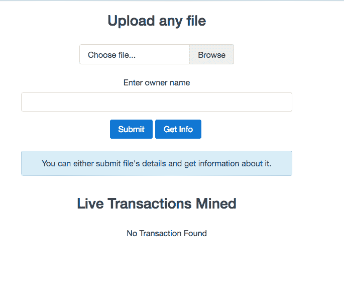
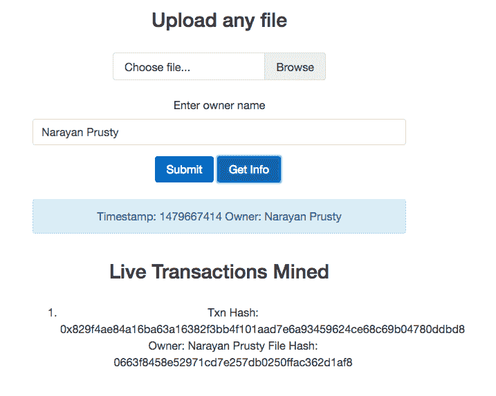

# 使用 web3.js 入门

在上一章中，我们学习了如何编写智能合同，并使用 geth 的交互式控制台来部署和广播使用 web3.js 的交易。在本章中，我们将学习 web3.js 以及如何在 Node.js 或客户端 JavaScript 中导入、连接到 geth 并使用它。我们还将学习如何使用 web3.js 为前一章中创建的智能合同构建一个 web 客户端。

在本章中，我们将涵盖以下主题：

+   在 Node.js 和客户端 JavaScript 中导入 web3.js

+   连接到 geth

+   探索使用 web3.js 可以完成的各种事情

+   探索 web3.js 的各种最常用的 API

+   构建一个用于所有权合同的 Node.js 应用程序

# [web3.js 简介](https://wiki.example.org/web3.js_introduction)

web3.js 为我们提供了 JavaScript API 与 geth 进行通信。它内部使用 JSON-RPC 与 geth 通信。web3.js 也可以与支持 JSON-RPC 的任何其他类型的以太坊节点通信。它将所有 JSON-RPC API 公开为 JavaScript API；也就是说，它不仅支持所有与以太坊相关的 API；它还支持与 Whisper 和 Swarm 相关的 API。

随着我们构建各种项目，你将越来越多地了解 web3.js，但现在，让我们先了解一些 web3.js 最常用的 API，然后我们将使用 web3.js 为我们的所有权智能合同构建一个前端。

撰写此文时，web3.js 的最新版本为 0.16.0。我们将学习与该版本相关的所有内容。

web3.js 托管在[`github.com/ethereum/web3.js`](https://github.com/ethereum/web3.js)，完整的文档托管在[`github.com/ethereum/wiki/wiki/JavaScript-API`](https://github.com/ethereum/wiki/wiki/JavaScript-API)。

# 导入 web3.js

要在 Node.js 中使用 web3.js，你只需在项目目录中运行`npm install web3`，在源代码中，你可以使用`require("web3");`进行导入。

要在客户端 JavaScript 中使用 web3.js，你可以将位于项目源代码的`dist`目录中的`web3.js`文件加入队列。现在你将在全局范围内可以使用`Web3`对象。

# 连接到节点

web3.js 可以使用 HTTP 或 IPC 与节点进行通信。我们将使用 HTTP 来建立与节点的通信。web3.js 允许我们与多个节点建立连接。`web3`的实例表示与一个节点的连接。该实例公开 API。

当应用程序在 Mist 中运行时，它会自动创建一个与 mist 节点连接的`web3`实例。实例的变量名是`web3`。

这里是连接到节点的基本代码：

```
if (typeof web3 !== 'undefined') { 
  web3 = new Web3(new Web3.providers.HttpProvider("http://localhost:8545")); 
} 

```

首先，我们在这里检查代码是否在 mist 中运行，方法是检查`web3`是否为`undefined`。如果`web3`已定义，则使用已有的实例；否则，通过连接到我们的自定义节点来创建一个实例。如果您想无论应用程序是否在 mist 中运行都连接到自定义节点，则从前面的代码中删除`if`条件。这里，我们假设我们的自定义节点在本地的端口号`8545`上运行。

`Web3.providers` 对象公开了构造函数（在此上下文中称为提供程序），用于使用各种协议建立连接和传输消息。`Web3.providers.HttpProvider` 允许我们建立 HTTP 连接，而`Web3.providers.IpcProvider` 允许我们建立 IPC 连接。

`web3.currentProvider`属性会自动分配给当前提供程序实例。创建 web3 实例后，您可以使用`web3.setProvider()`方法更改其提供程序。它接受一个参数，即新提供程序的实例。

请记住，默认情况下 geth 禁用了 HTTP-RPC。所以在运行 geth 时通过传递`--rpc`选项来启用它。默认情况下，HTTP-RPC 在端口 8545 上运行。

`web3` 公开了一个`isConnected()`方法，用于检查是否连接到节点。根据连接状态返回`true`或`false`。

# API 结构

`web3` 包含一个专门用于以太坊区块链交互的`eth`对象（`web3.eth`），以及一个用于 Whisper 交互的`shh`对象（`web3.shh`）。web3.js 的大多数 API 都在这两个对象中。

所有的 API 默认都是同步的。如果你想发起异步请求，你可以将一个可选的回调作为大多数函数的最后一个参数传递。所有的回调都使用错误优先的回调风格。

一些 API 对异步请求有一个别名。例如，`web3.eth.coinbase()`是同步的，而`web3.eth.getCoinbase()`是异步的。

以下是一个示例：

```

//sync request 
try 
{ 
  console.log(web3.eth.getBlock(48)); 
} 
catch(e) 
{ 
  console.log(e); 
} 

//async request 
web3.eth.getBlock(48, function(error, result){ 
    if(!error) 
        console.log(result) 
    else 
        console.error(error); 
}) 

```

`getBlock` 用于通过其编号或哈希获取区块的信息。或者，它可以接受字符串，如`"earliest"`（创世区块）、`"latest"`（区块链的顶部区块）或`"pending"`（正在挖掘的区块）。如果你不传递参数，则默认为`web3.eth.defaultBlock`，默认情况下分配给`"latest"`。

所有需要块标识作为输入的 API 都可以接受数字、哈希或可读字符串之一。如果未传递值，则这些 API 默认使用`web3.eth.defaultBlock`。

# BigNumber.js

JavaScript 在正确处理大数字方面是本地很差的。因此，需要处理大数字并需要完美计算的应用程序使用`BigNumber.js`库来处理大数字。

web3.js 也依赖于 BigNumber.js。它会自动添加它。web3.js 总是返回`BigNumber`对象作为数字值。它可以接受 JavaScript 数字、数字字符串和`BigNumber`实例作为输入。

这里有一个示例来演示这一点：

```
web3.eth.getBalance("0x27E829fB34d14f3384646F938165dfcD30cFfB7c").toString(); 

```

在这里，我们使用`web3.eth.getBalance()`方法来获取地址的余额。该方法返回一个`BigNumber`对象。我们需要在`BigNumber`对象上调用`toString()`将其转换为字符串。

`BigNumber.js`无法正确处理具有 20 位以上小数的数字；因此，建议您将余额存储在 wei 单位中，并在显示时将其转换为其他单位。web3.js 本身始终以 wei 单位返回和接受余额。例如，`getBalance()`方法以 wei 单位返回地址的余额。

# 单位转换

web3.js 提供了 API 来将 wei 余额转换为任何其他单位，并将任何其他单位的余额转换为 wei。

`web3.fromWei()`方法用于将 wei 数转换为任何其他单位，而`web3.toWei()`方法用于将其他单位中的数转换为 wei。这里有一个示例来演示这一点：

```
web3.fromWei("1000000000000000000", "ether"); 
web3.toWei("0.000000000000000001", "ether"); 

```

在第一行，我们将 wei 转换为以太，而在第二行，我们将以太转换为 wei。两种方法的第二个参数可以是以下字符串之一：

+   `千 wei/雅达`

+   `兆 wei/巴贝吉`

+   `gwei/夏侬`

+   `萨博`

+   `芬尼`

+   `以太币`

+   `兆以太/拜尔/爱因斯坦`

+   `以太`

+   `获得`

+   `泰尔`

# 检索气价、余额和交易详情

让我们来看一下用于检索气价、地址余额以及已挖出交易信息的 API：

```
//It's sync. For async use getGasPrice 
console.log(web3.eth.gasPrice.toString()); 

console.log(web3.eth.getBalance("0x407d73d8a49eeb85d32cf465507dd71d507100c1", 45).toString()); 

console.log(web3.eth.getTransactionReceipt("0x9fc76417374aa880d4449a1f7f31ec597f00b1f6f3dd2d66f4c9c6c445836d8b")); 

```

输出形式如下：

```
20000000000 
30000000000 
{ 
  "transactionHash": "0x9fc76417374aa880d4449a1f7f31ec597f00b1f6f3dd2d66f4c9c6c445836d8b ", 
  "transactionIndex": 0, 
  "blockHash": "0xef95f2f1ed3ca60b048b4bf67cde2195961e0bba6f70bcbea9a2c4e133e34b46", 
  "blockNumber": 3, 
  "contractAddress": "0xa94f5374fce5edbc8e2a8697c15331677e6ebf0b", 
  "cumulativeGasUsed": 314159, 
  "gasUsed": 30234 
} 

```

这里是前述方法的工作原理：

+   `web3.eth.gasPrice()`: 通过 x 个最新区块的中位数气价确定气价。

+   `web3.ethgetBalance()`: 返回任何给定地址的余额。所有哈希应作为十六进制字符串提供给 web3.js 的 API，而不是作为十六进制文本。对于 solidity 的`address`类型的输入，也应作为十六进制字符串提供。 

+   `web3.eth.getTransactionReceipt()`: 用于利用其哈希获取有关交易的详细信息。如果在区块链中找到交易，则返回交易收据对象；否则，返回 null。交易收据对象包含以下属性：

    +   `blockHash`: 交易所在块的哈希

    +   `blockNumber`: 此交易所在块的块号

    +   `transactionHash`: 交易的哈希

    +   `transactionIndex`: 指交易在块中的位置的整数

    +   `from`: 发送者的地址

    +   `to`: 接收者的地址；如果是一个合约创建交易，则为`null`

    +   `cumulativeGasUsed`: 此交易执行时在块中使用的总的燃气量

    +   `gasUsed`: 该特定交易独自使用的燃气量

    +   `contractAddress`: 如果交易是一个合约创建的话，返回创建的合约地址；否则，返回 null

    +   `日志`: 此交易生成的日志对象数组

# 发送以太币

让我们看看如何向任何地址发送以太币。要发送以太币，您需要使用`web3.eth.sendTransaction()`方法。该方法可用于发送任何类型的交易，但主要用于发送以太币，因为使用此方法部署合约或调用合约方法很麻烦，需要您生成交易数据而不是自动生成。它接受一个具有以下属性的交易对象：

+   `from`：发送账户的地址。如果未指定，则使用`web3.eth.defaultAccount`属性。

+   `to`：这是可选的。这是消息的目标地址，在合约创建交易中保持未定义。

+   `value`：这是可选的。这是以 wei 为单位的交易价值以及（如果是合约创建交易）赋予的资金。

+   `gas`：这是可选的。这是用于交易的气量（未使用的气会退还）。如果未提供，则会自动确定。

+   `gasPrice`：这是可选的。这是交易的气价，以 wei 为单位，默认为平均网络气价。

+   `data`：这是可选的。它是一个包含消息关联数据的字节字符串，或者在合约创建交易的情况下是初始化代码。

+   `nonce`：这是可选的。这是一个整数。每个交易都有一个与之关联的 nonce。nonce 是一个计数器，指示发送方发送的交易数量。如果未提供，则会自动确定。它有助于防止重放攻击。这个 nonce 不是与区块相关联的 nonce。如果我们使用的 nonce 大于交易应该具有的 nonce，则该交易将被放入队列，直到其他交易到达。例如，如果下一个交易的 nonce 应该是 4，而我们设置了 nonce 为 10，则 geth 将等待中间的六个交易，然后再广播此交易。具有 nonce 10 的交易称为排队的交易，它不是待处理的交易。

让我们看一个向地址发送以太币的示例：

```
var txnHash = web3.eth.sendTransaction({ 
  from: web3.eth.accounts[0], 
  to: web3.eth.accounts[1], 
  value: web3.toWei("1", "ether") 
}); 

```

在这里，我们从账户号为 0 的账户向账户号为 1 的账户发送 1 个以太币。在运行 geth 时确保两个账户都使用`unlock`选项解锁。在 geth 交互式控制台中，它会提示输入密码，但在交互式控制台之外使用的 web3.js API 如果账户被锁定会抛出错误。此方法返回交易的交易哈希。您随后可以使用`getTransactionReceipt()`方法检查交易是否已被挖掘。

您还可以在运行时使用`web3.personal.listAccounts()`、`web3.personal.unlockAccount(addr, pwd)`和`web3.personal.newAccount(pwd)` API 来管理账户。

# 与合约交互

让我们学习如何部署新合约，通过地址获取已部署合约的引用，向合约发送以太币，发送调用合约方法的交易，并估算方法调用的 gas。

要部署新合约或获取已部署合约的引用，你需要首先使用`web3.eth.contract()`方法创建一个合约对象。它以合约 ABI 作为参数并返回合约对象。

以下是创建合约对象的代码：

```
var proofContract = web3.eth.contract([{"constant":false,"inputs":[{"name":"fileHash","type":"string"}],"name":"get","outputs":[{"name":"timestamp","type":"uint256"},{"name":"owner","type":"string"}],"payable":false,"type":"function"},{"constant":false,"inputs":[{"name":"owner","type":"string"},{"name":"fileHash","type":"string"}],"name":"set","outputs":[],"payable":false,"type":"function"},{"anonymous":false,"inputs":[{"indexed":false,"name":"status","type":"bool"},{"indexed":false,"name":"timestamp","type":"uint256"},{"indexed":false,"name":"owner","type":"string"},{"indexed":false,"name":"fileHash","type":"string"}],"name":"logFileAddedStatus","type":"event"}]); 

```

一旦获取到合约，你可以使用合约对象的`new`方法部署它，或者使用`at`方法获取与 ABI 匹配的已部署合约的引用。

让我们看一个部署新合约的示例：

```
var proof = proofContract.new({ 
     from: web3.eth.accounts[0],  
     data: "0x606060405261068...",  
     gas: "4700000" 
    },  
    function (e, contract){ 
    if(e) 
    { 
    console.log("Error " + e);     
}     
else if(contract.address != undefined) 
  {     
    console.log("Contract Address: " + contract.address);     
   }     
else      
  {     
    console.log("Txn Hash: " + contract.transactionHash)     
  } 
}) 

```

这里，`new`方法是异步调用的，所以如果交易已成功创建和广播，回调会被触发两次。第一次是在交易广播后调用，第二次是在交易被确认后调用。如果不提供回调函数，那么`proof`变量的`address`属性将被设置为`undefined`。一旦合约被确认，`address`属性就会被设置。

在`proof`合约中，没有构造函数，但如果有构造函数，则构造函数的参数应放在`new`方法的开头。我们传递的对象包含了来源地址、合约的字节码和使用的最大 gas。这三个属性必须存在；否则交易将不会被创建。这个对象可以有与传递给`sendTransaction()`方法中存在的属性相同的属性，但在这里，`data`是合约的字节码，`to`属性会被忽略。

你可以使用`at`方法来获取一个已部署合约的引用。以下是演示的代码：

```
var proof = proofContract.at("0xd45e541ca2622386cd820d1d3be74a86531c14a1"); 

```

现在让我们看看如何发送调用合约方法的交易。以下示例演示了这一点：

```
proof.set.sendTransaction("Owner Name", "e3b0c44298fc1c149afbf4c8996fb92427ae41e4649b934ca495991b7852b855", { 

from: web3.eth.accounts[0], 
}, function(error, transactionHash){ 

if (!err) 

console.log(transactionHash); 
}) 

```

在这里，我们调用方法同名对象的`sendTransaction`方法。传递给`sendTransaction`方法的对象具有与`web3.eth.sendTransaction()`相同的属性，只是`data`和`to`属性会被忽略。

如果你想在节点本身上调用方法而不是创建并广播交易，那么可以使用`call`而不是`sendTransaction`。以下示例演示了这一点：

```
var returnValue = proof.get.call("e3b0c44298fc1c149afbf4c8996fb92427ae41e4649b934ca495991b7852b855"); 

```

有时候，我们需要找出调用一个方法所需要的 gas，以便决定是否进行调用。可以使用`web3.eth.estimateGas`来实现此目的。然而，直接使用`web3.eth.estimateGas()`需要你生成交易数据；因此，我们可以使用方法同名对象的`estimateGas()`方法。以下示例演示了这一点：

```
var estimatedGas = proof.get.estimateGas("e3b0c44298fc1c149afbf4c8996fb92427ae41e4649b934ca495991b7852b855"); 

```

如果你只想向合约发送一些以太币而不调用任何方法，则可以简单地使用`web3.eth.sendTransaction`方法。

# 检索和监听合同事件

现在让我们看看如何监听合同的事件。监听事件非常重要，因为通过事务调用的方法的结果通常通过触发事件返回。

在我们深入研究如何检索和监听事件之前，我们需要学习事件的索引参数。事件的最多三个参数可以具有`indexed`属性。此属性用于向节点发出信号，以便对其进行索引，以便应用客户端可以搜索具有匹配返回值的事件。如果不使用索引属性，则必须从节点检索所有事件并过滤所需的事件。例如，您可以以以下方式编写`logFileAddedStatus`事件：

```
event logFileAddedStatus(bool indexed status, uint indexed timestamp, string owner, string indexed fileHash); 

```

以下是一个示例，演示如何监听合同事件：

```
var event = proof.logFileAddedStatus(null, { 
fromBlock: 0, 
toBlock: "latest" 
}); 
event.get(function(error, result){ 
if(!error) 
{ 
  console.log(result); 
} 
else 
{ 
  console.log(error); 
} 
}) 
event.watch(function(error, result){ 
if(!error) 
{ 
  console.log(result.args.status); 
} 
else 
{ 
  console.log(error); 
} 
}) 
setTimeout(function(){ 
event.stopWatching(); 
}, 60000) 
 var events = proof.allEvents({ 
fromBlock: 0, 
 toBlock: "latest" 
}); 
events.get(function(error, result){ 
if(!error) 
{ 
  console.log(result); 
} 
else 
{ 
  console.log(error); 
} 
}) 
events.watch(function(error, result){ 
if(!error) 
{ 
  console.log(result.args.status); 
} 
else 
{ 
  console.log(error); 
} 
}) 
setTimeout(function(){ 
events.stopWatching(); 
}, 60000)

```

这是上述代码的工作原理：

1.  首先，我们通过在合同实例上调用同名事件的方法来获取事件对象。此方法接受两个对象作为参数，用于过滤事件：

    +   第一个对象用于通过索引返回值来过滤事件：例如，`{'valueA': 1, 'valueB': [myFirstAddress, mySecondAddress]}`。默认情况下，所有过滤器值都设置为`null`。这意味着它们将匹配来自此合同发送的给定类型的任何事件。

    +   接下来的对象可以包含三个属性：`fromBlock`（最早的块；默认为`"latest"`），`toBlock`（最新的块；默认为`"latest"`）和`address`（仅从中获取日志的地址列表；默认为合同地址）。

1.  `event`对象公开三种方法：`get`、`watch`和`stopWatching`。`get`用于获取块范围内的所有事件。`watch`类似于`get`，但它在获取事件后监视更改。`stopWatching`可用于停止监视更改。

1.  然后，我们有合同实例的`allEvents`方法。它用于检索合同的所有事件。

1.  每个事件都由一个包含以下属性的对象表示：

    +   `args`：包含事件参数的对象

    +   `event`：表示事件名称的字符串

    +   `logIndex`：表示块中日志索引位置的整数

    +   `transactionIndex`：表示创建此索引位置日志的事务的整数

    +   `transactionHash`：表示创建此日志的事务的哈希的字符串

    +   `address`：表示此日志来源地址的字符串

    +   `blockHash`：表示此日志所在块的哈希的字符串；当其处于挂起状态时为`null`。

    +   `blockNumber`：表示此日志所在块的块号；当其处于挂起状态时为`null`。

web3.js 提供了一个`web3.eth.filter`API 来检索和监听事件。您可以使用此 API，但较早方法处理事件的方式要简单得多。您可以在[`github.com/ethereum/wiki/wiki/JavaScript-API#web3ethfilter`](https://github.com/ethereum/wiki/wiki/JavaScript-API#web3ethfilter)了解更多信息。

# 为所有权合约构建客户端

在上一章中，我们编写了所有权合约的 Solidity 代码，并且在上一章和本章中，我们学习了 web3.js，并学习了如何使用 web3.js 调用合约的方法。现在，是时候为我们的智能合约构建一个客户端，以便用户可以轻松使用它。

我们将构建一个客户端，用户在其中选择一个文件并输入所有者详细信息，然后点击提交来广播一笔交易以调用合约的 `set` 方法，并传递文件哈希和所有者详细信息。一旦交易成功广播，我们将显示交易哈希。用户还可以选择一个文件，并从智能合约获取所有者详细信息。客户端还将实时显示最近的 `set` 交易。

在前端我们将使用 sha1.js 来获取文件的哈希值，使用 jQuery 进行 DOM 操作，并使用 Bootstrap 4 来创建响应式布局。在后端我们将使用 express.js 和 web3.js。我们将使用 socket.io，这样后端就可以在每个等间隔的时间后将最近挖掘的交易推送到前端，而无需前端请求数据。

web3.js 可以在前端使用。但对于这个应用程序来说，这将是一个安全风险；也就是说，我们正在使用存储在 geth 中的帐户，并将 geth 节点 URL 暴露给前端，这将使这些帐户中的以太币处于风险之中。

# 项目结构

在本章的练习文件中，你会找到两个目录：`Final` 和 `Initial`。`Final` 包含项目的最终源代码，而 `Initial` 包含空的源代码文件和库，以便快速开始构建应用程序。

要测试 `Final` 目录，你需要在其中运行 `npm install` 并将 `app.js` 中的硬编码合约地址替换为部署合约后得到的合约地址。然后，在 `Final` 目录中使用 `node app.js` 命令运行应用程序。

在 `Initial` 目录中，你会找到一个 `public` 目录和两个名为 `app.js` 和 `package.json` 的文件。`package.json` 包含我们应用程序的后端依赖项，`app.js` 是你将放置后端源代码的地方。

`public` 目录包含与前端相关的文件。在 `public/css` 目录中，你会找到 `bootstrap.min.css`，这是 Bootstrap 库；在 `public/html` 目录中，你会找到 `index.html`，在其中放置我们应用程序的 HTML 代码；在 `public/js` 目录中，你会找到 jQuery、sha1 和 socket.io 的 JS 文件。在 `public/js` 中，你还会找到一个 `main.js` 文件，在其中放置我们应用程序的前端 JS 代码。

# 构建后端

让我们首先构建应用程序的后端。首先，在`Initial`目录中运行`npm install`以安装后端所需的依赖项。在我们开始编写后端代码之前，请确保 geth 正在运行，并启用了 rpc。如果您正在私有网络上运行 geth，则确保也启用了挖矿。最后，请确保帐户 0 存在并已解锁。您可以在启用了 rpc 和挖矿的私有网络上运行 geth，并且还解锁帐户 0：

```
geth --dev --mine --rpc --unlock=0

```

在开始编码之前，您需要做的最后一件事是使用我们在上一章中看到的代码部署所有权合约，并复制合约地址。

现在让我们创建一个单一的服务器，它将向浏览器提供 HTML，并且还会接受`socket.io`连接：

```
var express = require("express");   
var app = express();   
var server = require("http").createServer(app); 
var io = require("socket.io")(server); 
server.listen(8080); 

```

在这里，我们将`express`和`socket.io`服务器集成到一个运行在端口`8080`上的服务器中。

现在让我们创建路由来提供静态文件和应用程序的主页。以下是执行此操作的代码：

```
app.use(express.static("public")); 
app.get("/", function(req, res){  
  res.sendFile(__dirname + "/public/html/index.html"); 
}) 

```

在这里，我们使用`express.static`中间件来提供静态文件。我们要求它在`public`目录中查找静态文件。

现在让我们连接到`geth`节点，并且获取部署的合约的引用，以便我们可以发送交易和监视事件。以下是执行此操作的代码：

```
var Web3 = require("web3"); 

web3 = new Web3(new Web3.providers.HttpProvider("http://localhost:8545")); 

var proofContract = web3.eth.contract([{"constant":false,"inputs":[{"name":"fileHash","type":"string"}],"name":"get","outputs":[{"name":"timestamp","type":"uint256"},{"name":"owner","type":"string"}],"payable":false,"type":"function"},{"constant":false,"inputs":[{"name":"owner","type":"string"},{"name":"fileHash","type":"string"}],"name":"set","outputs":[],"payable":false,"type":"function"},{"anonymous":false,"inputs":[{"indexed":false,"name":"status","type":"bool"},{"indexed":false,"name":"timestamp","type":"uint256"},{"indexed":false,"name":"owner","type":"string"},{"indexed":false,"name":"fileHash","type":"string"}],"name":"logFileAddedStatus","type":"event"}]); 

var proof = proofContract.at("0xf7f02f65d5cd874d180c3575cb8813a9e7736066"); 

```

代码是不言自明的。只需用您得到的合约地址替换代码中的合约地址即可。

现在让我们创建路由来广播交易并获取有关文件的信息。以下是执行此操作的代码：

```
app.get("/submit", function(req, res){ 
var fileHash = req.query.hash; 
var owner = req.query.owner; 
proof.set.sendTransaction(owner, fileHash, { 
from: web3.eth.accounts[0], 
}, function(error, transactionHash){ 
if (!error) 
{
  res.send(transactionHash); 
} 
else 
{ 
  res.send("Error"); 
} 
}) 
}) 
app.get("/getInfo", function(req, res){ 
var fileHash = req.query.hash; 
var details = proof.get.call(fileHash); 
res.send(details); 
}) 

```

在这里，`/submit`路由用于创建和广播交易。一旦我们得到了交易哈希，我们就将其发送给客户端。我们不会采取任何措施等待交易挖矿。`/getInfo`路由调用合约在节点本身上的 get 方法，而不是创建交易。它只是返回它得到的任何响应。

现在让我们监视来自合约的事件，并将其广播给所有连接的客户端。以下是执行此操作的代码：

```
proof.logFileAddedStatus().watch(function(error, result){ 
if(!error) 
{ 
  if(result.args.status == true) 
  { 
    io.send(result); 
  } 
} 
}) 

```

在这里，我们检查状态是否为 true，如果是 true，那么我们才向所有连接的`socket.io`客户端广播事件。

# 构建前端

让我们从应用程序的 HTML 开始。将此代码放入`index.html`文件中：

```
<!DOCTYPE html> 
<html lang="en"> 
    <head> 
        <meta name="viewport" content="width=device-width, initial-scale=1, shrink-to-fit=no"> 
        <link rel="stylesheet" href="/css/bootstrap.min.css"> 
    </head> 
    <body> 
        <div class="container"> 
            <div class="row"> 
                <div class="col-md-6 offset-md-3 text-xs-center"> 
                    <br> 
                    <h3>Upload any file</h3> 
                    <br> 
                    <div> 
                        <div class="form-group"> 
                            <label class="custom-file text-xs-left"> 
                                <input type="file" id="file" class="custom-file-input"> 
                                <span class="custom-file-control"></span> 
                            </label> 
                        </div> 
                        <div class="form-group"> 
                            <label for="owner">Enter owner name</label> 
                            <input type="text" class="form-control" id="owner"> 
                        </div> 
                        <button onclick="submit()" class="btn btn-primary">Submit</button> 
                        <button onclick="getInfo()" class="btn btn-primary">Get Info</button>  
                        <br><br> 
                        <div class="alert alert-info" role="alert" id="message"> 
                            You can either submit file's details or get information about it. 
                        </div> 
                    </div> 
                </div> 
            </div> 
            <div class="row"> 
                <div class="col-md-6 offset-md-3 text-xs-center"> 
                    <br> 
                    <h3>Live Transactions Mined</h3> 
                    <br> 
                    <ol id="events_list">No Transaction Found</ol> 
                </div> 
            </div> 
        </div> 
        <script type="text/javascript" src="img/sha1.min.js"></script> 
        <script type="text/javascript" src="img/jquery.min.js"></script> 
        <script type="text/javascript" src="img/socket.io.min.js"></script> 
        <script type="text/javascript" src="img/main.js"></script> 
    </body> 
</html> 

```

以下是代码的工作原理：

1.  首先，我们显示 Bootstrap 的文件输入字段，以便用户可以选择文件。

1.  接下来，我们显示一个文本字段，用户可以输入所有者的详细信息。

1.  然后，我们有两个按钮。第一个按钮用于将文件哈希和所有者的详细信息存储在合约中，第二个按钮用于从合约中获取文件的信息。单击提交按钮会触发`submit()`方法，而单击获取信息按钮会触发`getInfo()`方法。

1.  然后，我们有一个警报框来显示消息。

1.  最后，我们显示一个有序列表，显示用户在页面上的同时挖掘的合约的交易。

现在让我们为`getInfo()`和`submit()`方法编写实现代码，与服务器建立`socket.io`连接，并监听来自服务器的`socket.io`消息。以下是此代码。将此代码放入`main.js`文件中：

```
  function submit() 
  { 
    var file = document.getElementById("file").files[0]; 
    if(file) 
  { 
   var owner = document.getElementById("owner").value; 
   if(owner == "") 
  { 
   alert("Please enter owner name"); 
  } 
 else 
 { 
  var reader = new FileReader(); 
  reader.onload = function (event) { 
  var hash = sha1(event.target.result); 
  $.get("/submit?hash=" + hash + "&owner=" + owner, function(data){ 
  if(data == "Error") 
  {  
    $("#message").text("An error occured."); 
  } 
  else 
  { 
    $("#message").html("Transaction hash: " + data); 
  } 
  }); 
  }; 
  reader.readAsArrayBuffer(file); 
   } 
} 
  else 
  { 
    alert("Please select a file"); 
  } 
} 
function getInfo() 
{ 
  var file = document.getElementById("file").files[0]; 
  if(file) 
  { 
    var reader = new FileReader(); 
    reader.onload = function (event) { 
    var hash = sha1(event.target.result); 
    $.get("/getInfo?hash=" + hash, function(data){ 
    if(data[0] == 0 && data[1] == "") 
    { 
      $("#message").html("File not found"); 
    } 
    else 
    { 
      $("#message").html("Timestamp: " + data[0] + " Owner: " + data[1]); 
    }   
  }); 
}; 
reader.readAsArrayBuffer(file); 
} 
else 
  { 
    alert("Please select a file"); 
  } 
} 
var socket = io("http://localhost:8080"); 
socket.on("connect", function () { 
socket.on("message", function (msg) { 
if($("#events_list").text() == "No Transaction Found") 
{ 
    $("#events_list").html("<li>Txn Hash: " + msg.transactionHash + "nOwner: " + msg.args.owner + "nFile Hash: " + msg.args.fileHash + "</li>"); 
} 
else  
{ 
  $("#events_list").prepend("<li>Txn Hash: " + msg.transactionHash + "nOwner: " + msg.args.owner + "nFile Hash: " + msg.args.fileHash + "</li>"); 
} 
  }); 
}); 

```

这是前述代码的工作原理：

1.  首先，我们定义了`submit()`方法。在`submit`方法中，我们确保已选择文件并且文本字段不为空。然后，我们将文件内容读取为数组缓冲区，并将数组缓冲区传递给 sha1.js 公开的`sha1()`方法以获取数组缓冲区内部内容的哈希。一旦我们有了哈希，我们就使用 jQuery 发出 AJAX 请求到`/submit`路由，然后我们在警告框中显示交易哈希。

1.  我们接下来定义`getInfo()`方法。首先确保已选择文件。然后，生成像之前生成的哈希一样的哈希，并向`/getInfo`端点发出请求以获取有关该文件的信息。

1.  最后，我们使用`socket.io`库公开的`io()`方法建立了一个`socket.io`连接。然后，我们等待触发连接事件，这表明已建立连接。连接建立后，我们监听来自服务器的消息，并向用户显示有关交易的详细信息。

我们不将文件存储在以太坊区块链中，因为存储文件非常昂贵，需要大量的 gas。对于我们的情况，实际上我们不需要存储文件，因为网络中的节点将能够看到文件；因此，如果用户想要保密文件内容，那么他们将无法做到。我们应用程序的目的只是证明对文件的所有权，而不是像云服务一样存储和提供文件。

# 测试客户端

现在运行`app.js`节点以运行应用程序服务器。打开您喜欢的浏览器并访问`http://localhost:8080/`。您将在浏览器中看到以下输出：



现在选择一个文件，输入所有者的姓名，然后单击提交。屏幕将更改为以下内容：


在这里，您可以看到交易哈希已显示。现在等待交易被挖掘。一旦交易被挖掘，您将能够在实时交易列表中看到该交易。屏幕将如下所示：


现在再次选择相同的文件，然后单击获取信息按钮。您将看到以下输出：



在这里，您可以看到时间戳和所有者的详细信息。现在我们已经完成了第一个 DApp 的客户端构建。

# 摘要

在本章中，我们首先学习了使用示例的 web3.js 的基础知识。我们学习了如何连接到节点，基本的 API，发送各种类型的交易以及监听事件。最后，我们为我们的所有权合同构建了一个适当的生产用客户端。现在，您将能够舒适地编写智能合约并为其构建 UI 客户端以便简化使用。

在下一章中，我们将构建一个钱包服务，用户可以轻松创建和管理以太坊钱包，而且还可以离线进行。我们将专门使用 LightWallet 库来实现这一目标。
