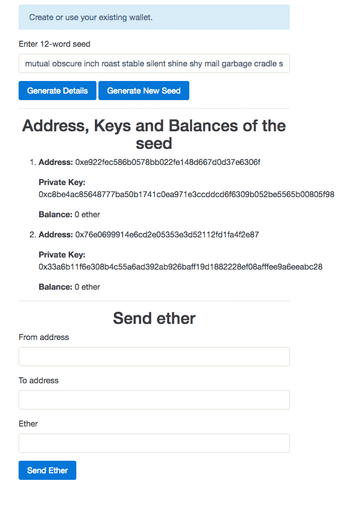

# 第五章：构建钱包服务

钱包服务用于发送和接收资金。构建钱包服务的主要挑战是安全性和信任。用户必须感到他们的资金是安全的，并且钱包服务的管理员不会窃取他们的资金。我们将在本章中构建的钱包服务将解决这两个问题。

在本章中，我们将涵盖以下主题：

+   在线和离线钱包的区别

+   使用 hooked-web3-provider 和 ethereumjs-tx 可以更轻松地创建和签署使用由以太坊节点管理的帐户以外的帐户的交易。

+   理解 HD 钱包以及其用途。

+   使用 `lightwallet.js` 创建 HD 钱包和交易签名器

+   构建钱包服务

# 在线和离线钱包的区别

钱包是帐户的集合，而帐户是地址及其关联私钥的组合。

当钱包连接到互联网时，称为在线钱包。例如，存储在 geth 中的钱包、任何网站/数据库等称为在线钱包。在线钱包也称为热钱包、网页钱包、托管钱包等。至少在存储大量以太币或长时间存储以太币时，不建议使用在线钱包，因为它们存在风险。此外，根据钱包存储的位置不同，可能需要信任第三方。

例如，大多数流行的钱包服务都会将钱包的私钥与自己存储，并允许您通过电子邮件和密码访问钱包，因此基本上您无法真正访问钱包，如果他们愿意，他们可以窃取钱包中的资金。

当钱包未连接到互联网时，称为离线钱包。例如，存储在闪存驱动器、纸张、文本文件等中的钱包。离线钱包也称为冷钱包。离线钱包比在线钱包更安全，因为要窃取资金，某人需要对存储物理接触。离线存储的挑战在于您需要找到一个您不会意外删除或忘记的位置，或者其他人无法访问。许多人将钱包存储在纸上，并将纸放在保险柜中，如果他们想要长期安全地保留一些资金。如果您想经常从您的帐户发送资金，那么您可以将其存储在受密码保护的闪存驱动器中，并且还可以放在安全柜中。仅在数字设备中存储钱包有一点风险，因为数字设备随时可能损坏，您可能无法访问您的钱包；因此，除了存储在闪存驱动器中，您还应该将其放在安全柜中。根据您的需求，您还可以找到更好的解决方案，但请确保它是安全的，并且不要意外丢失对其的访问权限。

# hooked-web3-provider 和 ethereumjs-tx 库

到目前为止，我们看到的 Web3.js 库的 `sendTransaction()` 方法的所有示例都是使用 Ethereum 节点中存在的 `from` 地址；因此，在广播之前以太坊节点能够签署交易。但是如果你有钱包的私钥存储在其他地方，那么 geth 就无法找到它。因此，在这种情况下，您需要使用 `web3.eth.sendRawTransaction()` 方法来广播交易。

`web3.eth.sendRawTransaction()` 用于广播原始交易，也就是说，您将不得不编写代码来创建和签署原始交易。以太坊节点将直接广播它，而不对交易进行其他处理。但是编写使用 `web3.eth.sendRawTransaction()` 广播交易的代码很困难，因为它需要生成数据部分、创建原始交易，还要对交易进行签名。

Hooked-Web3-Provider 库为我们提供了一个自定义的提供程序，它使用 HTTP 与 geth 进行通信；但这个提供程序的独特之处在于，它允许我们使用我们的密钥对合约实例的 `sendTransaction()` 调用进行签名。因此，我们不再需要创建交易的数据部分。这个自定义提供程序实际上覆盖了 `web3.eth.sendTransaction()` 方法的实现。所以基本上，它允许我们对合约实例的 `sendTransaction()` 调用以及 `web3.eth.sendTransaction()` 调用进行签名。合约实例的 `sendTransaction()` 方法内部生成交易的数据，并调用 `web3.eth.sendTransaction()` 来广播交易。

EthereumJS 是与以太坊相关的那些库的集合。ethereumjs-tx 是其中之一，提供了与交易相关的各种 API。例如，它允许我们创建原始交易、签署原始交易、检查交易是否使用正确的密钥签名等。

这两个库都适用于 Node.js 和客户端 JavaScript。从 [`www.npmjs.com/package/hooked-web3-provider`](https://www.npmjs.com/package/hooked-web3-provider) 下载 Hooked-Web3-Provider，从 [`www.npmjs.com/package/ethereumjs-tx`](https://www.npmjs.com/package/ethereumjs-tx) 下载 ethereumjs-tx。

在编写本书时，Hooked-Web3-Provider 的最新版本是 1.0.0，ethereumjs-tx 的最新版本是 1.1.4。

让我们看看如何将这些库一起使用，从一个不由 geth 管理的账户发送交易。

```
var provider = new HookedWeb3Provider({ 
 host: "http://localhost:8545", 
 transaction_signer: { 
  hasAddress: function(address, callback){ 
   callback(null, true); 
  }, 
  signTransaction: function(tx_params, callback){ 
   var rawTx = { 
          gasPrice: web3.toHex(tx_params.gasPrice), 
          gasLimit: web3.toHex(tx_params.gas), 
          value: web3.toHex(tx_params.value) 
          from: tx_params.from, 
          to: tx_params.to, 
          nonce: web3.toHex(tx_params.nonce) 
      }; 

   var privateKey = EthJS.Util.toBuffer('0x1a56e47492bf3df9c9563fa7f66e4e032c661de9d68c3f36f358e6bc9a9f69f2', 'hex'); 
   var tx = new EthJS.Tx(rawTx); 
   tx.sign(privateKey); 

   callback(null, tx.serialize().toString('hex')); 
  } 
 } 
}); 

var web3 = new Web3(provider); 

web3.eth.sendTransaction({ 
 from: "0xba6406ddf8817620393ab1310ab4d0c2deda714d", 
 to: "0x2bdbec0ccd70307a00c66de02789e394c2c7d549", 
 value: web3.toWei("0.1", "ether"), 
 gasPrice: "20000000000", 
 gas: "21000" 
}, function(error, result){ 
 console.log(error, result) 
})

```

以下是代码的工作原理：

1.  首先，我们创建了一个 `HookedWeb3Provider` 实例。这由 Hooked-Web3-Provider 库提供。这个构造函数接受一个对象，该对象必须提供两个属性。`host` 是节点的 HTTP URL，`transaction_signer` 是一个与自定义提供程序通信以获取交易签名的对象。

1.  `transaction_signer`对象有两个属性：`hasAddress`和`signTransaction`。`hasAddress`被调用来检查交易是否可以签名，也就是检查交易签名者是否拥有`from`地址账户的私钥。该方法接收地址和一个回调函数。回调函数应该以错误消息作为第一个参数调用，而私钥如果未找到则应为`false`作为第二个参数。如果找到了私钥，那么第一个参数应该为`null`，第二个参数应为`true`。

1.  如果找到了地址的私钥，那么自定义提供者将调用`signTransaction`方法来对交易进行签名。该方法有两个参数，即交易参数和一个回调。在方法内部，首先，我们将交易参数转换为原始交易参数，也就是将原始交易参数值编码为十六进制字符串。然后，我们创建一个缓冲区来保存私钥。该缓冲区是使用`EthJS.Util.toBuffer()`方法创建的，该方法是`ethereumjs-util`库的一部分。`ethereumjs-util`库是`ethereumjs-tx`库导入的。然后我们创建一个原始交易并对其进行签名，之后我们对其进行序列化并转换为十六进制字符串。最后，我们需要使用回调将签名的原始交易的十六进制字符串提供给自定义提供者。如果方法内部有错误，则回调的第一个参数应该是一个错误消息。

1.  现在自定义提供者获取原始交易并使用`web3.eth.sendRawTransaction()`来广播它。

1.  最后，我们调用`web3.eth.sendTransaction`函数向另一个账户发送一些以太币。在这里，我们需要提供除了`nonce`之外的所有交易参数，因为自定义提供者可以计算 nonce。之前，许多这些都是可选的，因为我们让以太坊节点来计算它们，但现在当我们自己签名时，我们需要提供所有这些。当交易没有任何与之关联的数据时，`gas`始终为 21,000。

**公钥呢？**

在上面的代码中，我们从未提及签名地址的公钥。你一定想知道矿工如何在没有公钥的情况下验证交易的真实性。矿工使用 ECDSA 的一个独特属性，该属性允许您从消息和签名中计算公钥。在交易中，消息指示了交易的意图，而签名用于确定消息是否使用了正确的私钥进行签名。这就是使 ECDSA 如此特殊的地方。ethereumjs-tx 提供了一个 API 来验证交易。

# 什么是分层确定性钱包？

分层确定性钱包是从称为种子的单个起始点派生地址和密钥的系统。 确定性意味着对于相同的种子，将生成相同的地址和密钥，并且分层意味着将以相同的顺序生成地址和密钥。 这使得更容易备份和存储多个帐户，因为您只需要存储种子，而不需要存储单独的密钥和地址。

**为什么用户需要多个帐户？**

您可能想知道为什么用户需要多个帐户。 原因是为了隐藏他们的财富。 帐户的余额是公开可见的。 因此，如果用户 A 与用户 B 共享一个地址来接收一些以太币，那么用户 B 可以查看该地址中有多少以太币。 因此，用户通常会在各种帐户之间分配他们的财富。

有各种类型的 HD 钱包，它们在种子格式和生成地址和密钥的算法方面有所不同，例如 BIP32、Armory、Coinkite、Coinb.in 等。

**什么是 BIP32、BIP44 和 BIP39？**

**比特币改进提案**（**BIP**）是一份向比特币社区提供信息的设计文件，或者描述比特币或其流程或环境的新功能。 BIP 应该提供对该功能的简明技术规范和功能的基本原理。 在撰写本书时，有 152 个 BIPS（比特币改进提案）。 BIP32 和 BIP39 分别提供了有关实现 HD 钱包和助记种子规范的算法的信息。 您可以在[`github.com/bitcoin/bips`](https://github.com/bitcoin/bips)上了解更多信息。

# 导出密钥的功能简介

非对称加密算法定义了其密钥的性质以及如何生成密钥，因为密钥需要相关联。 例如，RSA 密钥生成算法是确定性的。

对称加密算法仅定义密钥大小。 生成密钥交给我们。 有各种算法来生成这些密钥。 这样的算法之一是 KDF。

**密钥派生函数**（**KDF**）是一种确定性算法，用于从某个秘密值（例如主密钥、密码或口令）派生对称密钥。 有各种类型的 KDF，例如 bcrypt、crypt、PBKDF2、scrypt、HKDF 等。 您可以在[`en.wikipedia.org/wiki/Key_derivation_function`](https://en.wikipedia.org/wiki/Key_derivation_function)上了解更多关于 KDF 的信息。

要从单个秘密值生成多个密钥，可以连接一个数字并递增它。

基于密码的密钥派生函数接受一个密码并生成对称密钥。由于用户通常使用弱密码，基于密码的密钥派生函数被设计为更慢且占用大量内存，以使启动暴力攻击和其他类型的攻击变得困难。基于密码的密钥派生函数被广泛使用，因为很难记住秘密密钥，将它们存储在某处是有风险的，因为它可能被窃取。PBKDF2 是基于密码的密钥派生函数的一个例子。

主密钥或密码短语很难通过暴力攻击破解；因此，如果您想要从主密钥或密码短语生成对称密钥，可以使用非基于密码的密钥派生函数，例如 HKDF。与 PBKDF2 相比，HKDF 要快得多。

**为什么不直接使用散列函数而不是 KDFs？**

散列函数的输出可以用作对称密钥。那么你一定会想到为什么需要 KDFs。嗯，如果您使用的是主密钥、密码短语或强密码，您可以简单地使用散列函数。例如，HKDF 简单地使用散列函数生成密钥。但如果不能保证用户将使用强密码，最好使用基于密码的散列函数。

# LightWallet 介绍

LightWallet 是一个实现了 BIP32、BIP39 和 BIP44 的 HD 钱包。LightWallet 提供了使用其生成的地址和密钥创建和签名交易或加密和解密数据的 API。

LightWallet API 分为四个命名空间，即 `keystore`、`signing`、`encryption` 和 `txutils`。`signing`、`encryption` 和 `txutils` 分别提供签署交易、非对称加密和创建交易的 API，而 `keystore` 命名空间用于创建 `keystore`、生成的种子等。`keystore` 是一个保存种子和加密密钥的对象。如果我们使用 Hooked-Web3-Provider，`keystore` 命名空间实现了需要签署 `we3.eth.sendTransaction()` 调用的交易签名方法。因此，`keystore` 命名空间可以自动为其中找到的地址创建和签署交易。实际上，LightWallet 主要用于成为 Hooked-Web3-Provider 的签名提供者。

`keystore` 实例可以配置为创建和签名交易或加密和解密数据。对于签名交易，它使用 `secp256k1` 参数，而对于加密和解密，它使用 `curve25519` 参数。

LightWallet 的种子是一个包含 12 个单词的助记词，易于记忆但难以破解。这不是任意的 12 个单词；相反，它应该是由 LightWallet 生成的种子。由 LightWallet 生成的种子在选择单词和其他方面具有特定属性。

# HD 派生路径

HD 派生路径是一个字符串，它使得易于处理多个加密货币（假设它们都使用相同的签名算法）、多个区块链、多个账户等等。

HD 派生路径可以具有任意多个参数，并且可以使用不同值的参数，我们可以产生不同组的地址及其相关密钥。

LightWallet 默认使用`m/0'/0'/0'`派生路径。这里，`/n'`是一个参数，`n`是参数值。

每个 HD 派生路径都有一个`curve`和`purpose`。`purpose`可以是`sign`或`asymEncrypt`。`sign`表示该路径用于签署交易，而`asymEncrypt`表示该路径用于加密和解密。`curve`指示 ECC 的参数。对于签名，参数必须是`secp256k1`，对于非对称加密，曲线必须是`curve25591`，因为 LightWallet 强制我们使用这些参数，由于其在这些用途上的好处。

# 构建钱包服务

现在我们已经学习了足够多关于 LightWallet 的理论知识，是时候使用 LightWallet 和 hooked-web3-provider 构建一个钱包服务。我们的钱包服务将允许用户生成唯一的种子，显示地址及其关联余额，最后，该服务将允许用户向其他账户发送以太币。所有操作都将在客户端完成，这样用户就可以轻松地信任我们。用户要么必须记住种子，要么将其存放在某处。

# 先决条件

在开始构建钱包服务之前，请确保您正在运行开采的 geth 开发实例，已启用 HTTP-RPC 服务器，允许来自任何域的客户端请求，并最终已解锁账户 0。您可以通过运行以下命令来做到这一切：

```
    geth --dev --rpc --rpccorsdomain "*" --rpcaddr "0.0.0.0" --rpcport "8545" --mine --unlock=0

```

在这里，`--rpccorsdomain`用于允许特定域与 geth 通信。我们需要提供一个用空格分隔的域列表，例如`"http://localhost:8080 https://mySite.com *"`。它也支持`*`通配符字符。`--rpcaddr`表示 geth 服务器可到达的 IP 地址。默认值为`127.0.0.1`，因此如果它是托管服务器，您将无法使用服务器的公共 IP 地址来访问它。因此，我们将其值更改为`0.0.0.0`，表示服务器可以使用任何 IP 地址访问。

# 项目结构

在本章的练习文件中，您会找到两个目录，分别是`Final`和`Initial`。`Final`包含项目的最终源代码，而`Initial`包含了空的源代码文件和库，以便快速开始构建应用程序。

要测试`Final`目录，您需要在其中运行`npm install`，然后使用`Final`目录内的`node app.js`命令运行应用。

在`Initial`目录中，您将找到一个`public`目录和两个名为`app.js`和`package.json`的文件。`package.json`包含后端依赖项。我们的应用，`app.js`，是您将放置后端源代码的地方。

`public`目录包含与前端相关的文件。在`public/css`中，您将找到`bootstrap.min.css`，这是 bootstrap 库。在`public/html`中，您将找到`index.html`，在那里您将放置我们应用的 HTML 代码，最后，在`public/js`目录中，您将找到用于 Hooked-Web3-Provider、web3js 和 LightWallet 的`.js`文件。在`public/js`中，您还将找到一个`main.js`文件，其中您将放置我们应用的前端 JS 代码。

# 构建后端

让我们首先构建应用程序的后端。首先，在初始目录中运行`npm install`来安装我们后端所需的依赖项。

这是运行 express 服务并提供`index.html`文件和静态文件的完整后端代码：

```
var express = require("express");   
var app = express();   

app.use(express.static("public")); 

app.get("/", function(req, res){ 
 res.sendFile(__dirname + "/public/html/index.html"); 
}) 

app.listen(8080);

```

上述代码是不言自明的。

# 构建前端

现在让我们构建应用的前端。前端将包括主要功能，即生成种子、显示种子地址和发送以太。

现在让我们编写应用程序的 HTML 代码。将此代码放入`index.html`文件中：

```
<!DOCTYPE html> 
 <html lang="en"> 
     <head> 
         <meta charset="utf-8"> 
         <meta name="viewport" content="width=device-width, initial-scale=1, shrink-to-fit=no"> 
         <meta http-equiv="x-ua-compatible" content="ie=edge"> 
         <link rel="stylesheet" href="/css/bootstrap.min.css"> 
     </head> 
     <body> 
         <div class="container"> 
             <div class="row"> 
                 <div class="col-md-6 offset-md-3"> 
                     <br> 
                     <div class="alert alert-info" id="info" role="alert"> 
                           Create or use your existing wallet. 
                     </div> 
                     <form> 
                         <div class="form-group"> 
                             <label for="seed">Enter 12-word seed</label> 
                             <input type="text" class="form-control" id="seed"> 
                         </div> 
                         <button type="button" class="btn btn-primary" onclick="generate_addresses()">Generate Details</button> 
                         <button type="button" class="btn btn-primary" onclick="generate_seed()">Generate New Seed</button> 
                     </form> 
                     <hr> 
                     <h2 class="text-xs-center">Address, Keys and Balances of the seed</h2> 
                     <ol id="list"> 
                     </ol> 
                     <hr> 
                     <h2 class="text-xs-center">Send ether</h2> 
                     <form> 
                         <div class="form-group"> 
                             <label for="address1">From address</label> 
                             <input type="text" class="form-control" id="address1"> 
                         </div> 
                         <div class="form-group"> 
                             <label for="address2">To address</label> 
                             <input type="text" class="form-control" id="address2"> 
                         </div> 
                         <div class="form-group"> 
                             <label for="ether">Ether</label> 
                             <input type="text" class="form-control" id="ether"> 
                         </div> 
                         <button type="button" class="btn btn-primary" onclick="send_ether()">Send Ether</button> 
                     </form> 
                 </div> 
             </div> 
         </div> 

            <script src="img/web3.min.js"></script> 
            <script src="img/hooked-web3-provider.min.js"></script> 
         <script src="img/lightwallet.min.js"></script> 
         <script src="img/main.js"></script> 
     </body> 
 </html>

```

代码的工作原理如下：

1.  首先，我们将一个 Bootstrap 4 样式表加入队列。

1.  然后我们显示一个信息框，我们将在其中向用户显示各种消息。

1.  然后我们有一个带有输入框和两个按钮的表单。输入框用于输入种子，或者在生成新种子时，在那里显示种子。

1.  生成详细信息按钮用于显示地址，而生成新种子按钮用于生成新的唯一种子。当点击生成详细信息时，我们调用`generate_addresses()`方法，当点击生成新种子按钮时，我们调用`generate_seed()`方法。

1.  稍后，我们有一个空的有序列表。在这里，当用户单击生成详细信息按钮时，我们将动态显示种子的地址、余额和关联的私钥。

1.  最后，我们有另一种形式，需要一个发送地址和一个接收地址以及要转移的以太数量。发送地址必须是当前在无序列表中显示的地址之一。

现在让我们编写 HTML 代码调用每个函数的实现。首先，让我们编写代码以生成新种子。将此代码放入`main.js`文件中：

```
function generate_seed() 
{ 
 var new_seed = lightwallet.keystore.generateRandomSeed(); 

 document.getElementById("seed").value = new_seed; 

 generate_addresses(new_seed); 
}

```

`keystore`命名空间的`generateRandomSeed()`方法用于生成随机种子。它接受一个可选参数，该参数是一个指示额外熵的字符串。

熵是应用程序收集用于某些算法或其他需要随机数据的地方的随机性。通常，熵是从硬件源收集的，可以是现有的源，例如鼠标移动或专门提供的随机性生成器。

要生成唯一的种子，我们需要真正的高熵。LightWallet 已经内置了产生唯一种子的方法。LightWallet 用于生成熵的算法取决于环境。但是，如果您认为可以生成更好的熵，则可以将生成的熵传递给`generateRandomSeed()`方法，并且它将与内部由`generateRandomSeed()`生成的熵连接在一起。

生成随机种子后，我们调用`generate_addresses`方法。此方法接受一个种子并在其中显示地址。在生成地址之前，它会提示用户询问他们想要多少地址。

以下是`generate_addresses()`方法的实现。将此代码放入`main.js`文件中：

```
var totalAddresses = 0; 

function generate_addresses(seed) 
{ 
 if(seed == undefined) 
 { 
  seed = document.getElementById("seed").value; 
 } 

 if(!lightwallet.keystore.isSeedValid(seed)) 
 { 
  document.getElementById("info").innerHTML = "Please enter a valid seed"; 
  return; 
 } 

 totalAddresses = prompt("How many addresses do you want to generate"); 

 if(!Number.isInteger(parseInt(totalAddresses))) 
 { 
  document.getElementById("info").innerHTML = "Please enter valid number of addresses"; 
  return; 
 } 

 var password = Math.random().toString(); 

 lightwallet.keystore.createVault({ 
  password: password, 
    seedPhrase: seed 
 }, function (err, ks) { 
    ks.keyFromPassword(password, function (err, pwDerivedKey) { 
      if(err) 
      { 
       document.getElementById("info").innerHTML = err; 
      } 
      else 
      { 
       ks.generateNewAddress(pwDerivedKey, totalAddresses); 
       var addresses = ks.getAddresses();  

       var web3 = new Web3(new Web3.providers.HttpProvider("http://localhost:8545")); 

       var html = ""; 

       for(var count = 0; count < addresses.length; count++) 
       { 
     var address = addresses[count]; 
     var private_key = ks.exportPrivateKey(address, pwDerivedKey); 
     var balance = web3.eth.getBalance("0x" + address); 

     html = html + "<li>"; 
     html = html + "<p><b>Address: </b>0x" + address + "</p>"; 
     html = html + "<p><b>Private Key: </b>0x" + private_key + "</p>"; 
     html = html + "<p><b>Balance: </b>" + web3.fromWei(balance, "ether") + " ether</p>"; 
        html = html + "</li>"; 
       } 

       document.getElementById("list").innerHTML = html; 
      } 
    }); 
 }); 
}

```

以下是代码的工作原理：

1.  首先，我们有一个名为`totalAddresses`的变量，其中包含一个数字，表示用户想要生成的地址总数。

1.  然后我们检查`seed`参数是否已定义。如果未定义，则从输入字段获取种子。我们这样做是为了在生成新种子时以及用户单击生成详细信息按钮时，可以使用`generate_addresses()`方法来显示信息种子。

1.  然后我们使用`keystore`命名空间的`isSeedValid()`方法验证种子。

1.  然后我们要求用户输入有关他们想要生成和显示多少地址的输入。然后我们验证输入。

1.  `keystore`命名空间中的私钥始终以加密形式存储。在生成密钥时，我们需要对其进行加密，而在签署交易时，我们需要解密密钥。从用户处获取对称加密密钥的密码，或通过提供随机字符串作为密码来获得。为了提供更好的用户体验，我们生成一个随机字符串并将其用作密码。对称密钥不存储在`keystore`命名空间内；因此，我们需要在执行与私钥相关的操作时（如生成密钥、访问密钥等），从密码生成密钥。

1.  然后我们使用`createVault`方法创建一个`keystore`实例。`createVault`接受一个对象和一个回调函数。对象可以有四个属性：`password`、`seedPharse`、`salt`和`hdPathString`。`password`是必需的，其他全部是可选的。如果我们不提供`seedPharse`，它会生成并使用一个随机种子。`salt`被连接到密码上，以增加对称密钥的安全性，因为攻击者还必须找到盐和密码。如果未提供盐，它将被随机生成。`keystore`命名空间保存未加密的盐。`hdPathString`用于为`keystore`命名空间提供默认派生路径，即在生成地址、签署交易等中使用。如果我们不提供派生路径，将使用此派生路径。如果我们不提供`hdPathString`，则默认值为`m/0'/0'/0'`。此派生路径的默认目的是`sign`。您可以使用`keystore`实例的`addHdDerivationPath()`方法创建新的派生路径或覆盖现有派生路径的目的。您也可以使用`keystore`实例的`setDefaultHdDerivationPath()`方法更改默认派生路径。最后，一旦创建了`keystore`命名空间，实例会通过回调返回。因此，在这里，我们只使用密码和种子创建了一个`keystore`。

1.  现在我们需要生成用户需要的地址数量及其关联的密钥。因为我们可以从种子生成数百万个地址，所以`keystore`在我们需要它之前不会生成任何地址，因为它不知道我们要生成多少个地址。创建了`keystore`之后，我们使用`keyFromPassword`方法从密码生成对称密钥。然后我们调用`generateNewAddress()`方法生成地址及其关联的密钥。

1.  `generateNewAddress()`方法接受三个参数：从密码派生的密钥、要生成的地址数和派生路径。由于我们没有提供派生路径，它使用`keystore`的默认派生路径。如果多次调用`generateNewAddress()`，它将从上一次创建的地址处继续。例如，如果两次调用这个方法，每次生成两个地址，你将得到前四个地址。

1.  然后我们使用`getAddresses()`来获取`keystore`中存储的所有地址。

1.  我们使用`exportPrivateKey`方法解密并检索地址的私钥。

1.  我们使用`web3.eth.getBalance()`来获取地址的余额。

1.  最后，我们在无序列表中显示所有信息。

现在我们知道如何从种子生成地址及其私钥了。现在让我们编写`send_ether()`方法的实现，该方法用于从种子生成的地址中发送以太币。

这是用于此的代码。将此代码放入`main.js`文件中：

```
function send_ether() 
{ 
 var seed = document.getElementById("seed").value; 

 if(!lightwallet.keystore.isSeedValid(seed)) 
 { 
  document.getElementById("info").innerHTML = "Please enter a valid seed"; 
  return; 
 } 

 var password = Math.random().toString(); 

 lightwallet.keystore.createVault({ 
  password: password, 
    seedPhrase: seed 
 }, function (err, ks) { 
    ks.keyFromPassword(password, function (err, pwDerivedKey) { 
      if(err) 
      { 
       document.getElementById("info").innerHTML = err; 
      } 
      else 
      { 
       ks.generateNewAddress(pwDerivedKey, totalAddresses); 

       ks.passwordProvider = function (callback) { 
          callback(null, password); 
       }; 

       var provider = new HookedWeb3Provider({ 
       host: "http://localhost:8545", 
       transaction_signer: ks 
    }); 

       var web3 = new Web3(provider); 

       var from = document.getElementById("address1").value; 
    var to = document.getElementById("address2").value; 
       var value = web3.toWei(document.getElementById("ether").value, "ether"); 

       web3.eth.sendTransaction({ 
        from: from, 
        to: to, 
        value: value, 
        gas: 21000 
       }, function(error, result){ 
        if(error) 
        {  
         document.getElementById("info").innerHTML = error; 
        } 
        else 
        { 
         document.getElementById("info").innerHTML = "Txn hash: " + result; 
        } 
       }) 
      } 
    }); 
 }); 
}

```

到生成地址种子的代码部分为止都是自说明的。之后，我们将一个回调分配给`ks`的`passwordProvider`属性。在交易签名期间，此回调会被调用以获取解密私钥所需的密码。如果我们不提供此回调，LightWallet 会提示用户输入密码。然后，我们通过将`keystore`作为交易签名者传递来创建一个`HookedWeb3Provider`实例。现在，当自定义提供程序想要签署交易时，它会调用`ks`的`hasAddress`和`signTransactions`方法。如果要签署的地址不在生成的地址列表中，`ks`将向自定义提供程序返回错误。最后，我们使用`web3.eth.sendTransaction`方法发送一些以太币。

# 测试中

现在我们已经完成了建立钱包服务的工作，让我们来测试一下以确保它按预期运行。首先，在初始目录中运行`node app.js`，然后在喜爱的浏览器中访问`http://localhost:8080`。你会看到这个屏幕：


现在点击"Generate New Seed"按钮生成一个新种子。你将被提示输入表示要生成的地址数量的数字。你可以提供任意数字，但出于测试目的，提供一个大于 1 的数字。现在屏幕会看起来像这样：



现在要测试发送以太币，你需要从 coinbase 账户向生成的地址中的一个发送一些以太币。一旦你向其中一个生成的地址发送了一些以太币，点击"Generate Details"按钮刷新界面，尽管用钱包服务发送以太币并不需要这样做。确保再次生成相同的地址。现在屏幕会看起来如下：


现在，在"from"地址字段中输入列表中具有余额的账户地址。然后在"to"地址字段中输入另一个地址。为了测试目的，你可以输入显示的其他任何地址。然后输入小于或等于"from"地址账户的以太坊余额的一些以太币数量。现在你的屏幕会看起来如下：


现在点击"Send Ether"按钮，你会在信息框中看到交易哈希。等待一段时间让它被挖掘。同时，你可以通过在非常短的时间内点击"Generate Details"按钮来检查交易是否已被挖掘。一旦交易被挖掘，你的屏幕将看起来像这样：


如果一切按照说明的方式进行，你的钱包服务就已经准备好了。你可以将这个服务部署到自定义域名上，并让它对外提供使用。它是完全安全的，用户会信任它。

# 摘要

在本章中，你学习了三个重要的以太坊库：Hooked-Web3-Provider、ethereumjs-tx 和 LightWallet。这些库可用于在以太坊节点之外管理账户并签署交易。在开发大多数类型的 DApp 客户端时，你会发现这些库非常有用。

最后，我们创建了一个钱包服务，让用户可以管理与服务后端共享私钥或与其钱包相关的任何其他信息的账户。

在下一章中，我们将构建一个平台来构建和部署智能合约。
