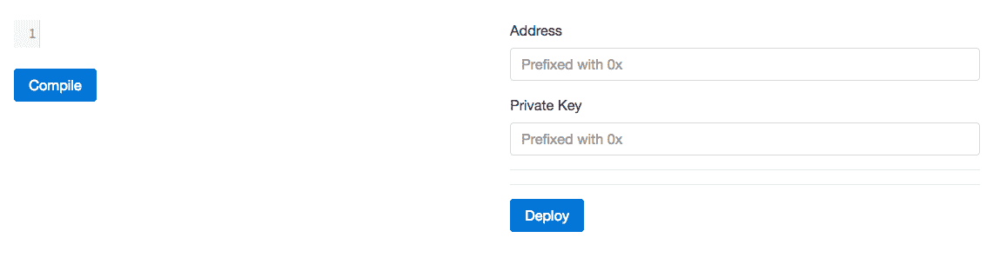
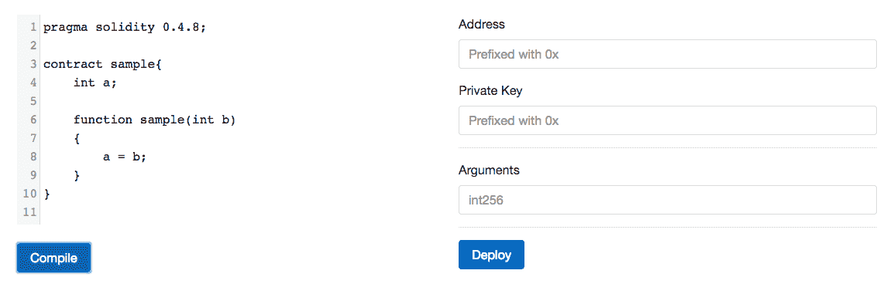
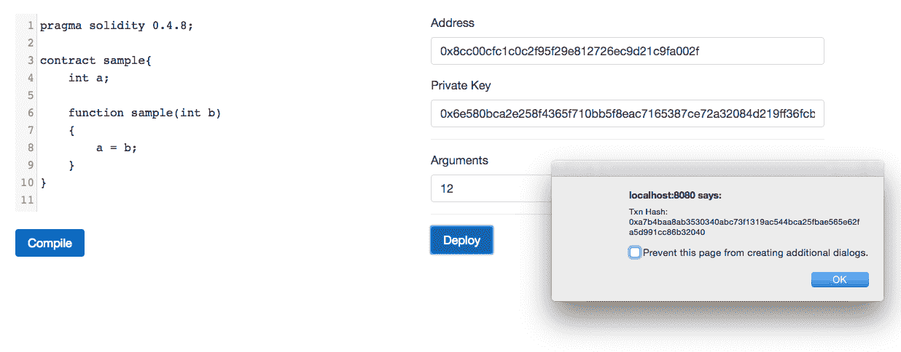

# 构建智能合约部署平台

一些客户端可能需要在运行时编译和部署合约。在我们的拥有权 DApp 中，我们手动部署了智能合约，并在客户端代码中硬编码了合约地址。但是一些客户端可能需要在运行时部署智能合约。例如，如果客户端允许学校在区块链中记录学生的出勤情况，那么每次注册新学校时都需要部署一个智能合约，以便每个学校完全控制其智能合约。在本章中，我们将学习如何使用 web3.js 编译智能合约，并使用 web3.js 和 EthereumJS 部署它。

在本章中，我们将涵盖以下主题：

+   计算交易的 nonce

+   使用交易池 JSON-RPC API

+   生成用于合约创建和方法调用的交易数据

+   估算交易所需的 gas

+   查找账户的当前可花费余额

+   使用 solcjs 编译智能合约

+   开发一个平台来编写、编译和部署智能合约

# 计算交易的 nonce

对于由 geth 维护的账户，我们不需要担心交易 nonce，因为 geth 可以为交易添加正确的 nonce 并对其进行签名。当使用 geth 不管理的账户时，我们需要自己计算 nonce。

要自己计算 nonce，我们可以使用 geth 提供的 `getTransactionCount` 方法。第一个参数应该是我们需要交易计数的地址，第二个参数是我们需要交易计数直到的区块。我们可以提供 `"pending"` 字符串作为区块，以包括当前正在挖掘的区块中的交易。正如我们在之前的章节中讨论的那样，geth 维护一个交易池，其中包含挂起和排队的交易。为了挖掘一个区块，geth 从交易池中取出挂起的交易并开始挖掘新的区块。直到区块没有被挖掘，挂起的交易仍然保留在交易池中，一旦被挖掘，已挖掘的交易就会从交易池中删除。在挖掘一个区块时接收到的新进交易被放入交易池，并在下一个区块中被挖掘。因此，当我们在调用 `getTransactionCount` 时提供 `"pending"` 作为第二个参数时，它不会查看交易池内部；相反，它只考虑挂起区块中的交易。

因此，如果您试图从 geth 不管理的账户发送交易，则需计算区块链中账户的总交易数，并将其与交易池中挂起的交易相加。如果尝试使用挂起区块中的挂起交易，则在几秒钟的间隔内发送交易到 geth，您将无法获得正确的 nonce，因为平均需要 12 秒才能将交易包含在区块链中。

在上一章中，我们依赖`hooked-web3-provider`来为交易添加 nonce。不幸的是，`hooked-web3-provider`没有以正确的方式获取 nonce。它为每个账户维护一个计数器，并在你从该账户发送交易时递增该计数器。如果交易无效（例如，如果交易尝试发送的以太币多于它拥有的），则不会递减计数器。因此，该账户的其余交易将排队，并永远不会被挖掘，直到`hooked-web3-provider`被重置，即客户端被重新启动。如果你创建多个`hooked-web3-provider`实例，那么这些实例无法将一个账户的 nonce 与彼此同步，因此你可能会得到不正确的 nonce。但在你将 nonce 添加到交易之前，`hooked-web3-provider`总是获取到 pending 区块的交易计数，并将其与其计数器进行比较，并使用较大者。因此，如果由`hooked-web3-provider`管理的账户的交易是从网络中的另一个节点发送的，并包含在 pending 区块中，则`hooked-web3-provider`可以看到它。但总的来说，不能依赖`hooked-web3-provider`来计算 nonce。它非常适用于快速原型设计客户端应用程序，并适用于在用户可以看到并重新发送交易（如果它们未广播到网络并且`hooked-web3-provider`经常被重置）的应用程序中使用。例如，在我们的钱包服务中，用户会频繁加载页面，因此会频繁创建新的`hooked-web3-provider`实例。如果交易未被广播、无效或未被挖掘，那么用户可以刷新页面并重新发送交易。

# 介绍 `solcjs`

`solcjs` 是一个用于编译 solidity 文件的 Node.js 库和命令行工具。它不使用 solc 命令行编译器；相反，它纯粹使用 JavaScript 进行编译，因此比 solc 更容易安装。

Solc 是实际的 Solidity 编译器。Solc 是用 C++ 编写的。这个 C++ 代码使用 emscripten 编译成 JavaScript。每个 solc 版本都被编译成 JavaScript。在 [https://github.com/ethereum/solc-bin/tree/gh-pages/bin](https://github.com/ethereum/solc-bin/tree/gh-pages/bin)，你可以找到每个 solidity 版本的基于 JavaScript 的编译器。`solcjs`只是使用这些基于 JavaScript 的编译器之一来编译 solidity 源代码。这些基于 JavaScript 的编译器可以在浏览器和 Node.js 环境中运行。

浏览器 Solidity 使用这些基于 JavaScript 的编译器来编译 Solidity 源代码。

# 安装 `solcjs`

`solcjs` 作为一个名为 `solc` 的 npm 包可供使用。你可以像安装其他任何 npm 包一样，本地或全局安装 `solcjs` npm 包。如果全局安装了此包，则将可用一个名为 `solcjs` 的命令行工具。因此，为了安装命令行工具，请运行此命令：

```
    npm install -g solc

```

现在，请继续运行此命令以查看如何使用命令行编译器编译Solidity文件：

```
    solcjs -help

```

我们不会探索solcjs命令行工具；而是学习如何使用solcjs API来编译Solidity文件。

默认情况下，solcjs将使用匹配其版本的编译器版本。例如，如果您安装了solcjs版本0.4.8，则默认情况下将使用0.4.8编译器版本进行编译。solcjs还可以配置为使用其他编译器版本。在撰写本文时，solcjs的最新版本是0.4.8。

# solcjs API

solcjs提供了一个`compiler`方法，用于编译Solidity代码。该方法可以根据源代码是否有任何导入来以两种不同的方式使用。如果源代码没有任何导入，则它需要两个参数；即，第一个参数是Solidity源代码作为字符串，第二个参数是一个布尔值，表示是否优化字节码。如果源字符串包含多个合约，则它会将它们全部编译。

这里有一个示例来演示这一点：

```
var solc = require("solc"); 
var input = "contract x { function g() {} }"; 
var output = solc.compile(input, 1); // 1 activates the optimiser  
for (var contractName in output.contracts) { 
    // logging code and ABI  
    console.log(contractName + ": " + output.contracts[contractName].bytecode); 
    console.log(contractName + "; " + JSON.parse(output.contracts[contractName].interface)); 
} 

```

如果您的源代码包含导入，则第一个参数将是一个对象，其键是文件名，值是文件的内容。因此，每当编译器看到一个导入语句时，它不会在文件系统中查找文件；相反，它会通过与键匹配的文件名在对象中查找文件内容。以下是一个演示示例：

```
var solc = require("solc"); 
var input = { 
    "lib.sol": "library L { function f() returns (uint) { return 7; } }", 
    "cont.sol": "import 'lib.sol'; contract x { function g() { L.f(); } }" 
}; 
var output = solc.compile({sources: input}, 1); 
for (var contractName in output.contracts) 
    console.log(contractName + ": " + output.contracts[contractName].bytecode); 

```

如果您想在编译过程中从文件系统读取导入的文件内容，或者解析编译过程中的文件内容，则编译器方法支持第三个参数，该参数是一个方法，接受文件名并应返回文件内容。以下是一个演示示例：

```
var solc = require("solc"); 
var input = { 
    "cont.sol": "import 'lib.sol'; contract x { function g() { L.f(); } }" 
}; 
function findImports(path) { 
    if (path === "lib.sol") 
        return { contents: "library L { function f() returns (uint) { return 7; } }" } 
    else 
        return { error: "File not found" } 
} 
var output = solc.compile({sources: input}, 1, findImports); 
for (var contractName in output.contracts) 
    console.log(contractName + ": " + output.contracts[contractName].bytecode); 

```

# 使用不同的编译器版本

要使用不同版本的Solidity编译合约，您需要使用`useVersion`方法获取不同编译器的引用。`useVersion`接受一个字符串，指示保存编译器的JavaScript文件名，并在`/node_modules/solc/bin`目录中查找该文件。

solcjs还提供了另一个方法称为`loadRemoteVersion`，它接受与`solc-bin`存储库的`solc-bin/bin`目录中的文件名匹配的编译器文件名，并下载并使用它。

最后，solcjs还提供了另一个方法称为`setupMethods`，它类似于`useVersion`但可以从任何目录加载编译器。

这里有一个示例来演示所有三种方法：

```
var solc = require("solc"); 

var solcV047 = solc.useVersion("v0.4.7.commit.822622cf"); 
var output = solcV011.compile("contract t { function g() {} }", 1); 

solc.loadRemoteVersion('soljson-v0.4.5.commit.b318366e', function(err, solcV045) { 
    if (err) { 
        // An error was encountered, display and quit 
    } 

    var output = solcV045.compile("contract t { function g() {} }", 1); 
}); 

var solcV048 = solc.setupMethods(require("/my/local/0.4.8.js")); 
var output = solcV048.compile("contract t { function g() {} }", 1); 

solc.loadRemoteVersion('latest', function(err, latestVersion) { 
    if (err) { 
        // An error was encountered, display and quit 
    } 
    var output = latestVersion.compile("contract t { function g() {} }", 1); 
}); 

```

要运行上述代码，您首先需要从`solc-bin`存储库下载`v0.4.7.commit.822622cf.js`文件，并将其放置在`node_modules/solc/bin`目录中。然后，您需要下载Solidity版本0.4.8的编译器文件，并将其放置在文件系统的某个位置，并将路径指向`setupMethods`调用中的该目录。

# 链接库

如果你的 Solidity 源代码引用了库，那么生成的字节码将包含引用库的真实地址的占位符。这些必须通过一个称为链接的过程来更新，然后再部署合约。

solcjs 提供了`linkByteCode`方法来将库地址链接到生成的字节码上。

这里是一个示例来演示这一点：

```
var solc = require("solc"); 

var input = { 
    "lib.sol": "library L { function f() returns (uint) { return 7; } }", 
    "cont.sol": "import 'lib.sol'; contract x { function g() { L.f(); } }" 
}; 

var output = solc.compile({sources: input}, 1); 

var finalByteCode = solc.linkBytecode(output.contracts["x"].bytecode, { 'L': '0x123456...' }); 

```

# 更新 ABI

合约的 ABI 提供了除实现以外的各种关于合约的信息。由于高版本支持更多的 Solidity 特性，因此两个不同版本的编译器生成的 ABI 可能不匹配；因此，它们会在 ABI 中包含额外的内容。例如，回退函数是在 Solidity 0.4.0 版本中引入的，因此使用版本低于 0.4.0 的编译器生成的 ABI 将不包含有关回退函数的信息，这些智能合约的行为就像它们有一个空主体和一个可支付修饰符的回退函数一样。因此，API 应该进行更新，以便依赖于较新 Solidity 版本的 ABI 的应用程序能够获得更好的合约信息。

solcjs 提供了一个 API 来更新 ABI。下面是一个示例代码来演示这一点：

```
var abi = require("solc/abi"); 

var inputABI = [{"constant":false,"inputs":[],"name":"hello","outputs":[{"name":"","type":"string"}],"payable":false,"type":"function"}]; 
var outputABI = abi.update("0.3.6", inputABI) 

```

这里，0.3.6表示 ABI 是使用 0.3.6 版本的编译器生成的。由于我们使用的是 solcjs 版本 0.4.8，因此 ABI 将被更新以匹配由 0.4.8 编译器版本生成的 ABI，而不是更新到更高版本。

上述代码的输出将如下所示：

```
[{"constant":false,"inputs":[],"name":"hello","outputs":[{"name":"","type":"string"}],"payable":true,"type":"function"},{"type":"fallback","payable":true}] 

```

# 构建合约部署平台

现在我们已经学会了如何使用 solcjs 编译 Solidity 源代码，是时候建立一个平台，让我们能够编写、编译和部署合约了。我们的平台将允许用户提供他们的账户地址和私钥，使用这些信息，我们的平台将部署合约。

在开始构建应用程序之前，请确保你正在运行 geth 开发实例，该实例正在挖矿，启用了`rpc`，并通过 HTTP-RPC 服务器公开了`eth`、`web3`和`txpool` API。你可以通过运行以下命令来完成所有这些操作： 

```
    geth --dev --rpc --rpccorsdomain "*" --rpcaddr "0.0.0.0" --rpcport "8545" --mine --rpcapi "eth,txpool,web3"

```

# 项目结构

在本章的练习文件中，你会找到两个目录，即`Final`和`Initial`。`Final`包含了项目的最终源代码，而`Initial`包含了空的源代码文件和库，可以快速开始构建应用程序。

要测试`Final`目录，你需要在其中运行`npm install`，然后在`Final`目录内使用`node app.js`命令运行应用程序。

在`Initial`目录中，你会找到一个`public`目录和两个文件，分别命名为`app.js`和`package.json`。`package.json`文件包含了我们应用程序的后端依赖关系。`app.js`是你将放置后端源代码的地方。

`public` 目录包含与前端相关的文件。在 `public/css` 中，你会找到 `bootstrap.min.css`，这是 bootstrap 库，你还会找到 `codemirror.css` 文件，这是 codemirror 库的 CSS。在 `public/html` 中，你会找到 `index.html`，你会在这里放置我们应用的 HTML 代码，在 `public/js` 目录中，你会找到 codemirror 和 web3.js 的 `.js` 文件。在 `public/js` 中，你还会找到一个 `main.js` 文件，你会在这里放置我们应用的前端 JS 代码。

# 构建后端

让我们首先构建应用的后端。首先，在 `Initial` 目录中运行 `npm install` 安装我们后端所需的依赖项。

这是运行 express 服务并提供 `index.html` 文件和静态文件的后端代码：

```
var express = require("express");   
var app = express();   

app.use(express.static("public")); 

app.get("/", function(req, res){ 
 res.sendFile(__dirname + "/public/html/index.html"); 
}) 

app.listen(8080); 

```

前述代码不言自明。现在让我们进一步进行。我们的应用将有两个按钮，即编译和部署。当用户单击编译按钮时，合约将被编译，当用户单击部署按钮时，合约将被部署。

我们将在后端进行编译和部署合约。虽然这可以在前端完成，但我们将在后端完成，因为 solcjs 仅适用于 Node.js（尽管它使用的基于 JavaScript 的编译器可以在前端工作）。

要了解如何在前端编译，请查看 solcjs 的源代码，这将让你了解 JavaScript-based 编译器暴露的 API。

当用户单击编译按钮时，前端将通过传递合约源代码向 `/compile` 路径发出 `GET` 请求。以下是路由的代码：

```
var solc = require("solc"); 

app.get("/compile", function(req, res){ 
 var output = solc.compile(req.query.code, 1); 
 res.send(output); 
}) 

```

首先，我们在这里导入 solcjs 库。然后，我们定义 `/compile` 路由，在路由回调中，我们只是编译客户端发送的源代码，并启用优化器。然后，我们只需将 `solc.compile` 方法的返回值发送到前端，让客户端检查编译是否成功。

当用户单击部署按钮时，前端将通过传递合约源代码和构造函数参数从地址和私钥向 `/deploy` 路径发出 `GET` 请求。当用户单击此按钮时，将部署合约并将事务哈希返回给用户。

这是此代码的代码：

```
var Web3 = require("web3"); 
var BigNumber = require("bignumber.js"); 
var ethereumjsUtil = require("ethereumjs-util"); 
var ethereumjsTx = require("ethereumjs-tx"); 

var web3 = new Web3(new Web3.providers.HttpProvider("http://localhost:8545")); 

function etherSpentInPendingTransactions(address, callback) 
{ 
 web3.currentProvider.sendAsync({ 
    method: "txpool_content", 
    params: [], 
    jsonrpc: "2.0", 
    id: new Date().getTime() 
 }, function (error, result) { 
  if(result.result.pending) 
  { 
   if(result.result.pending[address]) 
   { 
    var txns = result.result.pending[address]; 
    var cost = new BigNumber(0); 

    for(var txn in txns) 
    { 
     cost = cost.add((new BigNumber(parseInt(txns[txn].value))).add((new BigNumber(parseInt(txns[txn].gas))).mul(new BigNumber(parseInt(txns[txn].gasPrice))))); 
    } 

    callback(null, web3.fromWei(cost, "ether")); 
   } 
   else 
   { 
    callback(null, "0"); 
   } 
  } 
  else 
  { 
   callback(null, "0"); 
  } 
 }) 
} 

function getNonce(address, callback) 
{ 
 web3.eth.getTransactionCount(address, function(error, result){ 
  var txnsCount = result; 

  web3.currentProvider.sendAsync({ 
     method: "txpool_content", 
     params: [], 
     jsonrpc: "2.0", 
     id: new Date().getTime() 
  }, function (error, result) { 
   if(result.result.pending) 
   { 
    if(result.result.pending[address]) 
    { 
     txnsCount = txnsCount + Object.keys(result.result.pending[address]).length; 
     callback(null, txnsCount); 
    } 
    else 
    { 
     callback(null, txnsCount); 
    } 
   } 
   else 
   { 
    callback(null, txnsCount); 
   } 
  }) 
 }) 
} 

app.get("/deploy", function(req, res){ 
 var code = req.query.code; 
 var arguments = JSON.parse(req.query.arguments); 
 var address = req.query.address; 

 var output = solc.compile(code, 1); 

 var contracts = output.contracts; 

 for(var contractName in contracts) 
 { 
  var abi = JSON.parse(contracts[contractName].interface); 
  var byteCode = contracts[contractName].bytecode; 

  var contract = web3.eth.contract(abi); 

  var data = contract.new.getData.call(null, ...arguments, { 
   data: byteCode 
  }); 

  var gasRequired = web3.eth.estimateGas({ 
      data: "0x" + data 
  }); 

  web3.eth.getBalance(address, function(error, balance){ 
   var etherAvailable = web3.fromWei(balance, "ether"); 
   etherSpentInPendingTransactions(address, function(error, balance){ 
    etherAvailable = etherAvailable.sub(balance) 
    if(etherAvailable.gte(web3.fromWei(new BigNumber(web3.eth.gasPrice).mul(gasRequired), "ether"))) 
    { 
     getNonce(address, function(error, nonce){ 
      var rawTx = { 
             gasPrice: web3.toHex(web3.eth.gasPrice), 
             gasLimit: web3.toHex(gasRequired), 
             from: address, 
             nonce: web3.toHex(nonce), 
             data: "0x" + data 
         }; 

      var privateKey = ethereumjsUtil.toBuffer(req.query.key, 'hex'); 
      var tx = new ethereumjsTx(rawTx); 
      tx.sign(privateKey); 

      web3.eth.sendRawTransaction("0x" + tx.serialize().toString('hex'), function(err, hash) { 
       res.send({result: { 
        hash: hash, 
       }}); 
      }); 
     }) 
    } 
    else 
    { 
     res.send({error: "Insufficient Balance"}); 
    } 
   }) 
  }) 

     break; 
 } 
}) 

```

这是前述代码的工作方式：

1.  首先，Web 导入 `web3.js`、`BigNumber.js`、`ethereumjs-util` 和 `ethereumjs-tx` 库。然后，我们创建了 `Web3` 的实例。

1.  然后，我们定义一个名为`etherInSpentPendingTransactions`的函数，它计算地址的待处理交易中所花费的总以太币。由于`web3.js`不提供与事务池相关的JavaScript API，我们使用`web3.currentProvider.sendAsync`来做一个原始的JSON-RPC调用。`sendAsync`用于异步进行原始的JSON-RPC调用。如果你想以同步的方式进行此调用，那么请使用`send`方法而不是`sendAsync`。在计算地址的待处理事务中的总以太币时，我们寻找事务池中的待处理事务而不是待处理区块，因为前面我们讨论的问题。在计算总以太币时，我们将每个交易的值和gas添加，因为gas也会减少以太币余额。

1.  接下来，我们定义一个名为`getNonce`的函数，使用我们之前讨论的技术来检索地址的nonce。它只是将已挖掘交易的总数加上待处理交易的总数。

1.  最后，我们声明了`/deploy`端点。首先，我们编译合同。然后，我们只部署第一个合同。如果在提供的源代码中发现了多个合同，我们的平台设计为只部署第一个合同。你可以稍后增强应用程序来部署所有已编译的合同，而不仅仅是第一个合同。然后，我们使用`web3.eth.contract`创建一个合同对象。

1.  由于我们没有使用 hooked-web3-provider 或任何拦截 `sendTransactions` 并将其转换为 `sendRawTransaction` 调用的方法，在部署合同时，我们现在需要生成交易数据部分，其中将合同字节码和构造函数参数组合并编码为十六进制字符串。实际上，合同对象让我们生成交易的数据。这可以通过调用具有函数参数的 `getData` 方法来完成。如果你想要获取部署合同的数据，然后调用 `contract.new.getData`，如果你想调用合同的一个函数，那么调用 `contract.functionName.getData`。在这两种情况下，提供参数给 `getData` 方法。因此，要生成交易的数据，你只需要合同的 ABI。要了解如何组合和编码函数名称和参数以生成数据，你可以查看[https://github.com/ethereum/wiki/wiki/Ethereum-Contract-ABI＃examples](https://github.com/ethereum/wiki/wiki/Ethereum-Contract-ABI＃examples)，但如果你有合同的 ABI 或知道如何手动创建 ABI，则这将不需要。

1.  然后，我们使用`web3.eth.estimateGas`来计算部署合同所需的gas量。

1.  稍后，我们检查地址是否有足够的以太来支付部署合约所需的gas。我们通过检索地址的余额并将其减去在未决交易中花费的余额来找到这一点，然后检查剩余余额是否大于或等于所需gas的以太数量。

1.  最后，我们获取nonce，签名并广播交易。我们简单地将交易哈希返回给前端。

# 构建前端

现在让我们构建应用程序的前端。我们的前端将包含一个编辑器，用户使用该编辑器编写代码。当用户单击编译按钮时，我们将动态显示输入框，每个输入框将表示一个构造函数参数。当单击部署按钮时，将从这些输入框中获取构造函数参数值。用户将需要在这些输入框中输入JSON字符串。

我们将使用codemirror库来集成编辑器到我们的前端。要了解更多关于如何使用codemirror的信息，请参考[http://codemirror.net/](http://codemirror.net/)。

这是我们应用程序的前端HTML代码。将此代码放入`index.html`文件中：

```
<!DOCTYPE html> 
<html lang="en"> 
    <head> 
        <meta charset="utf-8"> 
        <meta name="viewport" content="width=device-width, initial-scale=1, shrink-to-fit=no"> 
        <meta http-equiv="x-ua-compatible" content="ie=edge"> 
        <link rel="stylesheet" href="/css/bootstrap.min.css"> 
        <link rel="stylesheet" href="/css/codemirror.css"> 
        <style type="text/css"> 
            .CodeMirror 
            { 
                height: auto; 
            } 
        </style> 
    </head> 
    <body> 
        <div class="container"> 
            <div class="row"> 
                <div class="col-md-6"> 
                    <br> 
                    <textarea id="editor"></textarea> 
                    <br> 
                    <span id="errors"></span> 
                    <button type="button" id="compile" class="btn btn-primary">Compile</button> 
                </div> 
                <div class="col-md-6"> 
                    <br> 
                    <form> 
                        <div class="form-group"> 
                            <label for="address">Address</label> 
                            <input type="text" class="form-control" id="address" placeholder="Prefixed with 0x"> 
                        </div> 
                        <div class="form-group"> 
                            <label for="key">Private Key</label> 
                            <input type="text" class="form-control" id="key" placeholder="Prefixed with 0x"> 
                        </div> 
                        <hr> 
                        <div id="arguments"></div> 
                        <hr> 
                        <button type="button" id="deploy" class="btn btn-primary">Deploy</button> 
                    </form> 
                </div> 
            </div> 
        </div> 
        <script src="img/codemirror.js"></script> 
        <script src="img/main.js"></script> 
    </body> 
</html> 

```

在这里，您可以看到我们有一个`textarea`。`textarea`标签将保存用户在codemirror编辑器中输入的内容。前面代码中的其他内容都是不言自明的。

这是完整的前端JavaScript代码。将此代码放入`main.js`文件中：

```
var editor = CodeMirror.fromTextArea(document.getElementById("editor"), { 
    lineNumbers: true, 
}); 

var argumentsCount = 0; 

document.getElementById("compile").addEventListener("click", function(){ 
 editor.save(); 
 var xhttp = new XMLHttpRequest(); 

 xhttp.onreadystatechange = function() { 
     if (this.readyState == 4 && this.status == 200) { 
      if(JSON.parse(xhttp.responseText).errors != undefined) 
      { 
       document.getElementById("errors").innerHTML = JSON.parse(xhttp.responseText).errors + "<br><br>"; 
      } 
      else 
      { 
       document.getElementById("errors").innerHTML = ""; 
      } 

      var contracts = JSON.parse(xhttp.responseText).contracts; 

      for(var contractName in contracts) 
      { 
       var abi = JSON.parse(contracts[contractName].interface); 

       document.getElementById("arguments").innerHTML = ""; 

       for(var count1 = 0; count1 < abi.length; count1++) 
       { 
        if(abi[count1].type == "constructor") 
        { 
         argumentsCount = abi[count1].inputs.length; 

         document.getElementById("arguments").innerHTML = '<label>Arguments</label>'; 

         for(var count2 = 0; count2 < abi[count1].inputs.length; count2++) 
         { 
          var inputElement = document.createElement("input"); 
          inputElement.setAttribute("type", "text"); 
          inputElement.setAttribute("class", "form-control"); 
          inputElement.setAttribute("placeholder", abi[count1].inputs[count2].type); 
          inputElement.setAttribute("id", "arguments-" + (count2 + 1)); 

          var br = document.createElement("br"); 

          document.getElementById("arguments").appendChild(br); 
          document.getElementById("arguments").appendChild(inputElement); 
         } 

         break; 
        } 
       } 

       break; 
      } 
     } 
 }; 

 xhttp.open("GET", "/compile?code=" + encodeURIComponent(document.getElementById("editor").value), true); 
 xhttp.send();  
}) 

document.getElementById("deploy").addEventListener("click", function(){ 
 editor.save(); 

 var arguments = []; 

 for(var count = 1; count <= argumentsCount; count++) 
 { 
  arguments[count - 1] = JSON.parse(document.getElementById("arguments-" + count).value);  
 } 

 var xhttp = new XMLHttpRequest(); 

 xhttp.onreadystatechange = function() { 
     if (this.readyState == 4 && this.status == 200)  
     { 
      var res = JSON.parse(xhttp.responseText); 

      if(res.error) 
      { 
       alert("Error: " + res.error) 
      } 
      else 
      { 
       alert("Txn Hash: " + res.result.hash); 
      }  
     } 
     else if(this.readyState == 4) 
     { 
      alert("An error occured."); 
     } 
 }; 

 xhttp.open("GET", "/deploy?code=" + encodeURIComponent(document.getElementById("editor").value) + "&arguments=" + encodeURIComponent(JSON.stringify(arguments)) + "&address=" + document.getElementById("address").value + "&key=" + document.getElementById("key").value, true); 
 xhttp.send();  
}) 

```

以下是前面代码的工作方式：

1.  首先，我们将代码编辑器添加到网页中。代码编辑器将显示在`textarea`的位置，而`textarea`将被隐藏。

1.  然后我们有编译按钮的点击事件处理程序。在其中，我们保存编辑器，将编辑器的内容复制到`textarea`中。当单击编译按钮时，我们向`/compile`路径发出请求，一旦获得结果，我们解析它并显示输入框，以便用户可以输入构造函数参数。在这里，我们只读取第一个合约的构造函数参数。但是，如果有多个合约，则可以增强UI以显示所有合约的构造函数的输入框。

1.  最后，我们有部署按钮的点击事件处理程序。在这里，我们读取构造函数参数的值，解析并将它们放入一个数组中。然后，我们通过传递地址、密钥、代码和参数值向`/deploy`端点添加一个请求。如果有错误，则我们在弹出窗口中显示错误；否则，我们在弹出窗口中显示交易哈希。

# 测试

要测试应用程序，请在`Initial`目录内运行`app.js`节点，并访问`localhost:8080`。您将看到以下截图中显示的内容：



现在输入一些Solidity合约代码并按编译按钮。然后，您将能够看到新的输入框出现在右侧。例如，看一下以下截图：



现在输入一个有效地址及其关联的私钥。然后输入构造函数参数的值并点击部署。如果一切正常，你将看到一个带有交易哈希的警报框。例如，看一下下面的屏幕截图：



# 总结

在本章中，我们学习了如何使用交易池API，如何计算正确的nonce，计算可支出的余额，生成交易的数据，编译合约等等。然后我们构建了一个完整的合同编译和部署平台。现在你可以继续增强我们构建的应用程序，部署编辑器中找到的所有合同，处理导入，添加库等等。

在下一章中，我们将通过构建一个去中心化的赌博应用程序来学习Oraclize。
