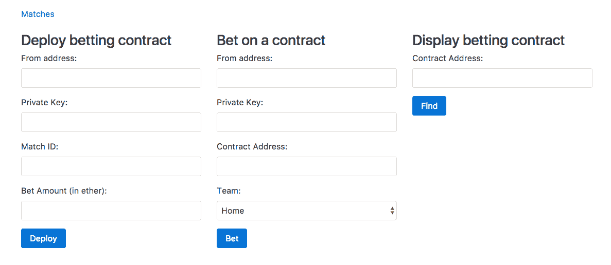
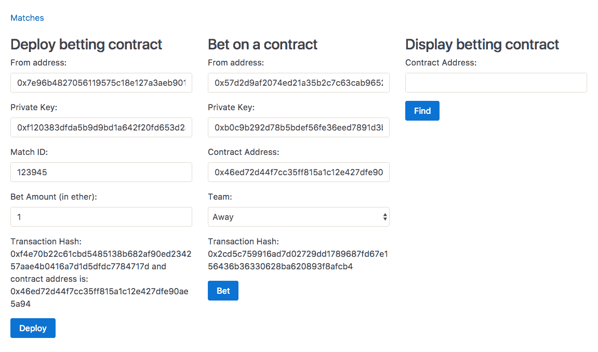
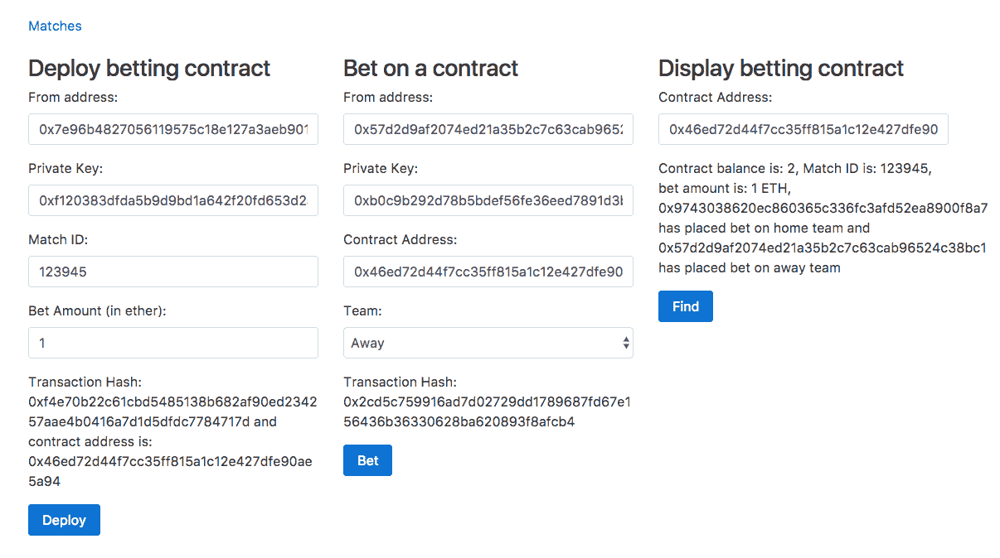

# 构建一个投注应用

有时，智能合约需要访问其他 DApp 或来自万维网的数据是必要的。但是由于技术和共识方面的挑战，让智能合约访问外部数据确实非常复杂。因此，目前，以太坊智能合约没有原生支持访问外部数据。但是有第三方解决方案供以太坊智能合约访问一些流行的 DApp 和来自万维网的数据。在本章中，我们将学习如何使用 Oraclize 从以太坊智能合约中发出 HTTP 请求，以访问来自万维网的数据。我们还将学习如何访问存储在 IPFS 中的文件，使用 strings 库来处理字符串等等。我们将通过构建一个足球投注智能合约和其客户端来学习所有这些。

在本章中，我们将涵盖以下主题：

+   Oraclize 是如何工作的？

+   Oraclize 有哪些不同的数据源，它们每一个是如何工作的？

+   Oraclize 中的共识是如何工作的？

+   将 Oraclize 集成到以太坊智能合约中

+   使用 Solidity 库中的字符串库使字符串处理变得更加简单

+   构建一个足球投注应用

# 介绍 Oraclize

Oraclize 是一个旨在使智能合约能够从其他区块链和万维网获取数据的服务。该服务目前在比特币和以太坊的测试网和主网上运行。Oraclize 的特殊之处在于，你无需信任它，因为它提供给智能合约的所有数据都有真实性证明。

在本章中，我们的目标是学习以太坊智能合约如何使用 Oraclize 服务从万维网获取数据。

# 它是如何工作的？

让我们看看以太坊智能合约如何使用 Oraclize 从其他区块链和万维网获取数据的过程。

要获取存在于以太坊区块链之外的数据，以太坊智能合约需要向 Oraclize 发送查询，提及数据源（表示从何处获取数据）和数据源的输入（表示要获取的内容）。

发送查询到 Oraclize 意味着向存在于以太坊区块链中的 Oraclize 合约发送合约调用（即，内部交易）。

Oraclize 服务器不断查找其智能合约的新进入查询。每当它看到一个新的查询时，它就会获取结果并通过调用您合约的 `_callback` 方法将其发送回您的合约。

# 数据源

以下是 Oraclize 允许智能合约获取数据的源列表：

+   URL: URL 数据源使您能够进行 HTTP GET 或 POST 请求，即从万维网获取数据。

+   `WolframAlpha`: `WolframAlpha` 数据源使您能够向 `WolframAlpha` 知识引擎提交查询并获得答案。

+   `Blockchain`：`blockchain` 数据源提供了从其他`区块链`访问数据的能力。可以提交给`blockchain`数据源的可能查询包括`bitcoin blockchain height`、`litecoin hashrate`、`bitcoin difficulty`、`1NPFRDJuEdyqEn2nmLNaWMfojNksFjbL4S balance`等。

+   `IPFS`：`IPFS` 数据源提供了获取存储在`IPFS`中文件内容的能力。

+   `Nested`：`nested` 数据源是一个元数据源；它不提供对额外服务的访问。它的设计是为了提供一种简单的聚合逻辑，使单个查询能够利用基于任何可用数据源的子查询，并产生单个字符串作为结果；例如：

`[WolframAlpha] ${[IPFS] QmP2ZkdsJG7LTw7jBbizTTgY1ZBeen64PqMgCAWz2koJBL}`中的温度。

+   `Computation`：`computation` 数据源使给定应用程序在安全的链下环境中可审计地执行；也就是说，它让我们获取应用程序链下执行的结果。这个应用程序必须在退出前在最后一行（标准输出上）打印查询结果。执行环境必须由 Dockerfile 描述，其中构建和运行应用程序应立即启动您的主应用程序。Dockerfile 初始化加上您的应用程序执行应尽快终止：在`AWS t2.micro`实例上的最大执行超时为 5 分钟。在这里，我们考虑的是`AWS t2.micro`实例，因为这是 Oraclize 将用来执行该应用程序的实例。由于数据源的输入是包含这些文件的 ZIP 存档的 IPFS 多哈希值（Dockerfile 加上任何外部文件依赖项，且 Dockerfile 必须放在存档根目录中），您应该注意准备这个存档并预先将其推送到 IPFS。

这些数据源在编写本书时可用。但未来可能会有更多的数据源可用。

# 真实性证明

虽然 Oraclize 是一个值得信赖的服务，但你可能仍然想要检查 Oraclize 返回的数据是否真实，即它是否在传输过程中被 Oraclize 或其他人篡改。

可选地，Oraclize 提供了从 URL、区块链、嵌套和计算数据源返回的 TLSNotary 结果证明。对于`WolframAlpha`和`IPFS`数据源，这种证明是不可用的。目前，Oraclize 仅支持 TLSNotary 证明，但在将来，他们可能会支持其他一些身份验证方式。目前，TLSNotary 证明需要手动验证，但 Oraclize 已经在进行链上证明验证；也就是说，你的智能合约代码可以在从 Oraclize 接收数据时自行验证 TLSNotary 证明，以便在证明无效时丢弃这些数据。

这个工具（[https://github.com/Oraclize/proof-verification-tool](https://github.com/oraclize/proof-verification-tool)）是由 Oraclize 提供的开源工具，用于验证 TLSNotary 证明，如果你想要的话。

理解 TLSNotary 如何工作并不是使用 Oraclize 或验证证明所必需的。验证 TLSNotary 证明的工具是开源的；因此，如果它包含任何恶意代码，那么它很容易被发现，因此这个工具是可信的。

让我们来看看 TLSNotary 如何工作的概述。要理解 TLSNotary 的工作原理，首先需要了解 TLS 的工作原理。TLS 协议提供了一种方法，让客户端和服务器创建一个加密会话，这样其他人就无法阅读或篡改客户端和服务器之间传输的内容。服务器首先将其证书（由受信任的 CA 颁发给域所有者）发送给客户端。证书将包含服务器的公钥。客户端使用 CA 的公钥解密证书，以便可以验证证书实际上是由 CA 颁发的，并获取服务器的公钥。然后，客户端生成一个对称加密密钥和一个 MAC 密钥，并使用服务器的公钥对它们进行加密，然后将其发送给服务器。服务器只能解密此消息，因为它有解密它的私钥。现在客户端和服务器共享相同的对称和 MAC 密钥，除了它们以外，没有其他人知道这些密钥，它们可以开始相互发送和接收数据。对称密钥用于加密和解密数据，其中 MAC 密钥和对称密钥一起用于为加密消息生成签名，以便在消息被攻击者修改时，另一方可以知道它。

TLSNotary 是 TLS 的修改版，Oraclize 使用它来提供密码学证明，证明它们提供给您的智能合约的数据确实是数据源在特定时间提供给 Oraclize 的数据。实际上，TLSNotary 协议是 PageSigner 项目开发和使用的开源技术。

TLSNotary 的工作原理是将对称密钥和 MAC 密钥分配给三个参与方，即服务器、被审计者和审计员。TLSNotary 的基本思想是被审计者可以向审计员证明特定结果是服务器在特定时间返回的。

下面是TLSNotary如何实现这一点的概述。审计员计算对称密钥和MAC密钥，然后仅将对称密钥提供给受审者。由于MAC签名检查确保了服务器传输的TLS数据未被修改，因此受审者不需要MAC密钥。有了对称加密密钥，受审者现在可以解密服务器的数据。因为所有消息都是由银行使用MAC密钥“签名”的，而且只有服务器和审计员知道MAC密钥，正确的MAC签名可以作为证明某些消息来自银行且未被受审者伪造的证据。

在Oraclize服务的情况下，Oraclize是受审者，而一个特制的、开源的Amazon机器映像的受限AWS实例充当审计员。

他们提供的证据数据是此AWS实例的签名证明，证明了一个正确的TLSnotary证明确实发生了。他们还提供了一些关于在AWS实例中运行的软件的额外证据，即它是否自初始化以来已被修改。

# 定价

任何以太坊地址发起的第一个Oraclize查询调用完全免费。在测试网络上使用Oraclize调用是免费的！这仅适用于测试环境中的适度使用。

从第二次调用开始，你必须支付以太币来进行查询。当向Oraclize发送查询（即进行内部交易调用）时，通过将以太币从调用合约转移到Oraclize合约来扣除费用。要扣除的以太币数量取决于数据源和证明类型。

下表显示了发送查询时扣除的以太币数量：

| **数据源** | **无证明** | **使用TLSNotary证明** |
| --- | --- | --- |
| URL | $0.01 | $0.05 |
| 区块链 | $0.01 | $0.05 |
| WolframAlpha | $0.03 | $0.03 |
| IPFS | $0.01 | $0.01 |

如果你正在发起一个HTTP请求，并且想要TLSNotary证明，那么调用的合约必须有价值$0.05的以太币；否则，将抛出异常。

# 使用Oraclize API入门

要使合约使用Oraclize服务，需要继承`usingOraclize`合约。你可以在[https://github.com/oraclize/ethereum-api](https://github.com/oraclize/ethereum-api)找到这个合约。

`usingOraclize`合约充当`OraclizeI`和`OraclizeAddrResolverI`合约的代理。实际上，`usingOraclize`使调用`OraclizeI`和`OraclizeAddrResolverI`合约变得容易，也就是说，它提供了更简单的API。如果你感觉自如，你也可以直接调用`OraclizeI`和`OraclizeAddrResolverI`合约。你可以查看这些合约的源代码，找到所有可用的API。我们只会学习最必要的API。

让我们看看如何设置证明类型、设置证明存储位置、进行查询、找到查询的成本等等。

# 设置证明类型和存储位置

无论你是否需要来自 Oraclize 的 TLSNotary 证明，你都必须在发出查询之前指定证明类型和证明存储位置。

如果你不需要证明，那么将这段代码放入你的合约中：

```
oraclize_setProof(proofType_NONE)

```

如果你需要证明，那么将这段代码放入你的合约中：

```
oraclize_setProof(proofType_TLSNotary | proofStorage_IPFS)

```

目前，`proofStorage_IPFS`是唯一可用的证明存储位置；也就是说，TLSNotary 证明只存储在`IPFS`中。

你可以仅执行这些方法之一，例如，在构造函数中或在其他任何时候，例如，如果你只需要某些查询的证明。

# 发送查询

要向 Oraclize 发送查询，你需要调用`oraclize_query`函数。该函数至少需要两个参数，即数据源和给定数据源的输入。数据源参数不区分大小写。

下面是`oraclize_query`函数的一些基本示例：

```
oraclize_query("WolframAlpha", "random number between 0 and 100"); 

oraclize_query("URL", "https://api.kraken.com/0/public/Ticker?pair=ETHXBT"); 

oraclize_query("IPFS", "QmdEJwJG1T9rzHvBD8i69HHuJaRgXRKEQCP7Bh1BVttZbU"); 

oraclize_query("URL", "https://xyz.io/makePayment", '{"currency": "USD", "amount": "1"}');

```

以下是上述代码的工作原理：

+   如果第一个参数是一个字符串，则假定它是数据源，第二个参数则假定是数据源的输入。在第一次调用中，数据源是`WolframAlpha`，我们发送给它的搜索查询是`random number between 0 and 100`。

+   在第二次调用中，我们向第二个参数中的`URL`发出一个`HTTP GET`请求。

+   在第三次调用中，我们从`IPFS`中获取`QmdEJwJG1T9rzHvBD8i69HHuJaRgXRKEQCP7Bh1BVttZbU`文件的内容。

+   如果数据源之后的两个连续参数都是字符串，则假定它是一个 POST 请求。在最后一次调用中，我们向`https://xyz.io/makePayment`发出一个`HTTP POST`请求，而`POST`请求主体内容是第三个参数中的字符串。Oraclize 能够根据字符串格式检测到内容类型头部。

# 定时查询

如果你希望 Oraclize 在将来的某个预定时间执行你的查询，只需将延迟时间（以秒为单位）从当前时间作为第一个参数指定。

这是一个例子：

```
oraclize_query(60, "WolframAlpha", "random number between 0 and 100");

```

上述查询将在被看到后的 60 秒内由 Oraclize 执行。因此，如果第一个参数是一个数字，则假定我们正在安排一个查询。

# 自定义燃气

从 Oraclize 到你的`__callback`函数的交易需要燃气，就像任何其他交易一样。你需要支付给 Oraclize 燃气成本。oraclize_query 收取用于发出查询的以太币，同时也用于在调用`__callback`函数时提供燃气。默认情况下，Oraclize 在调用`__callback`函数时提供 200,000 gas。

返回的燃气成本实际上是由你控制的，因为你在`__callback`方法中编写代码，因此可以估算出来。因此，当向 Oraclize 发出查询时，你还可以指定`__callback`交易的`gasLimit`应该是多少。然而，请注意，由于 Oraclize 发送交易，任何未使用的 gas 都会退还给 Oraclize，而不是你。

如果默认值和最小值的 200,000 gas 不够用，你可以通过以下方式增加它：

```
oraclize_query("WolframAlpha", "random number between 0 and 100", 500000);

```

在这里，你可以看到如果最后一个参数是一个数字，那么就假设它是自定义 gas。在前面的代码中，Oraclize 将为回调交易使用 500k 的 `gasLimit` 而不是 200k。因为我们要求 Oraclize 提供更多的 gas，所以在调用 `oraclize_query` 时，Oraclize 将扣除更多的以太币（取决于需要多少 gas）。

请注意，如果你提供的 `gasLimit` 太低，并且你的 `__callback` 方法很长，你可能永远不会看到回调。另请注意，自定义 gas 必须大于 200k。

# 回调函数

一旦你的结果准备好了，Oraclize 将会发送一个交易回到你的合约地址并调用以下三种方法之一：

+   或者 `__callback(bytes32 myid, string result)`。`Myid` 是每个查询的唯一 ID。这个 ID 是由 `oraclize_query` 方法返回的。如果你的合约中有多个 `oraclize_query` 调用，那么这个 ID 就用于匹配此结果所属的查询。

+   如果你请求了 TLS Notary 证明，这就是结果：`__callback(bytes32 myid, string result, bytes proof)`

+   作为最后的手段，如果其他方法都不存在，回退函数是 `function()`

这是 `__callback` 函数的一个例子：

```
function __callback(bytes32 myid, string result) { 
    if (msg.sender != oraclize_cbAddress()) throw; // just to be sure the calling address is the Oraclize authorized one 

    //now doing something with the result.. 
}

```

# 解析辅助函数

从 HTTP 请求返回的结果可以是 HTML、JSON、XML、二进制等。在 Solidity 中，解析结果是困难且昂贵的。因此，Oraclize 提供了解析辅助函数，让它在其服务器上处理解析，并且你只获取你需要的结果的一部分。

要求 Oraclize 解析结果，你需要使用以下解析辅助函数包装 URL：

+   `xml(..)` 和 `json(..)` 辅助函数让你可以要求 Oraclize 只返回 JSON 或 XML 解析后的响应的一部分；例如，看一下以下示例：

    +   为了获取整个响应，你可以使用 `URL` 数据源和 `api.kraken.com/0/public/Ticker?pair=ETHUSD` URL 参数

    +   如果你只想获取最后价格字段，你需要使用 JSON 解析调用，如 `json(api.kraken.com/0/public/Ticker?pair=ETHUSD).result.XETHZUSD.c.0`

+   `html(..).xpath(..)` 辅助函数对于 HTML 抓取非常有用。只需将你想要的 XPATH 指定为 `xpath(..)` 参数；例如，看一下以下示例：

    +   要获取特定推文的文本，使用 `html(https://twitter.com/oraclizeit/status/671316655893561344).xpath(//*[contains(@class, 'tweet-text')]/text())`。

+   `binary(..)` 辅助函数对于获取二进制文件（例如证书文件）非常有用：

    +   要仅获取二进制文件的一部分，你可以使用 `slice(offset,length)`；第一个参数是偏移量，而第二个参数是你希望返回的切片的长度（都以字节为单位）。

    +   示例：仅从二进制 CRL 中获取前 300 个字节，`binary(https://www.sk.ee/crls/esteid/esteid2015.crl).slice(0,300)`。二进制辅助程序必须与切片选项一起使用，只接受二进制文件（未编码）。

如果服务器无响应或无法访问，我们将发送空响应。您可以使用[http://app.Oraclize.it/home/test_query](http://app.oraclize.it/home/test_query)测试查询。

# 获取查询价格

如果您想在实际查询之前知道查询的费用，那么您可以使用`Oraclize.getPrice()`函数来获取所需的wei数量。它接受的第一个参数是数据源，第二个参数是可选的，即自定义的gas。

这个的一个流行用例是通知客户如果合同中没有足够的以太币来进行查询，则添加以太币。

# 加密查询

有时，您可能不希望揭示数据源和/或数据源的输入。例如：如果有的话，您可能不希望在URL中揭示API密钥。因此，Oraclize提供了一种将查询加密存储在智能合约中，并且只有Oraclize的服务器有解密密钥的方法。

Oraclize提供了一个Python工具（[https://github.com/Oraclize/encrypted-queries](https://github.com/oraclize/encrypted-queries)），可用于加密数据源和/或数据输入。它生成一个非确定性的加密字符串。

加密任意文本字符串的CLI命令如下：

```
    python encrypted_queries_tools.py -e -p 044992e9473b7d90ca54d2886c7addd14a61109af202f1c95e218b0c99eb060c7134c4ae46345d0383ac996185762f04997d6fd6c393c86e4325c469741e64eca9 "YOUR DATASOURCE or INPUT"

```

您看到的长十六进制字符串是Oraclize服务器的公钥。现在您可以使用前述命令的输出来替代数据源和/或数据源的输入。

为了防止加密查询的滥用（即重放攻击），使用特定加密查询的第一个与Oraclize查询的合同将成为其合法所有者。任何其他重用完全相同字符串的合同将不被允许使用它，并将收到空结果。因此，请记住在重新部署使用加密查询的合同时始终生成新的加密字符串。

# 解密数据源

还有另一个名为解密的数据源。它用于解密加密的字符串。但是这个数据源不返回任何结果；否则，任何人都将有能力解密数据源和数据源的输入。

它专门设计用于在嵌套数据源内部使用，以实现部分查询加密。这是它唯一的用例。

# Oraclize Web IDE

Oraclize提供了一个Web IDE，您可以在其中编写、编译和测试基于Oraclize的应用程序。您可以在[http://dapps.Oraclize.it/browser-Solidity/](http://dapps.oraclize.it/browser-solidity/)找到它。

如果您访问链接，那么您会注意到它看起来与浏览器Solidity完全相同。实际上，它就是带有一个额外功能的浏览器Solidity。要理解这个功能是什么，我们需要更深入地了解浏览器Solidity。

浏览器 Solidity 不仅让我们编写、编译和为我们的合约生成 web3.js 代码，还可以在那里测试这些合约。直到现在，为了测试我们的合约，我们都是设置了以太坊节点并向其发送交易。但是浏览器 Solidity 可以在不连接到任何节点的情况下执行合约，所有操作都在内存中进行。它使用 ethereumjs-vm 实现了这一点，这是 EVM 的 JavaScript 实现。使用 ethereumjs-vm，你可以创建自己的 EVM 并运行字节码。如果需要，我们可以通过提供连接的 URL 来配置浏览器 Solidity 使用以太坊节点。用户界面非常信息丰富；因此，你可以自己尝试所有这些。

Oraclize Web IDE 的特殊之处在于它在内存执行环境中部署了 Oraclize 合约，因此您不必连接到测试网或主网节点，但如果您使用浏览器 Solidity，则必须连接到测试网或主网节点以测试 Oraclize API。

你可以在 [https://dev.Oraclize.it/](https://dev.oraclize.it/) 找到更多与集成 Oraclize 相关的资源。

# 处理字符串

在 Solidity 中处理字符串不像在其他高级编程语言（如 JavaScript、Python 等）中那样容易。因此，许多 Solidity 程序员提出了各种库和合约，以便轻松处理字符串。

`strings` 库是最流行的字符串实用程序库。它允许我们通过将字符串转换为称为切片的东西来连接、连接、拆分、比较等等。切片是一个结构，它保存了字符串的长度和字符串的地址。由于切片只需指定一个偏移量和一个长度，复制和操作切片要比复制和操作它们引用的字符串便宜得多。

为了进一步减少 gas 成本，大多数需要返回切片的切片函数会修改原始切片，而不是分配一个新的切片；例如，`s.split(".")` 将返回直到第一个 `"."` 的文本，并修改 s 以仅包含该 `"."` 后的字符串。在你不想修改原始切片的情况下，可以使用 `.copy()` 进行复制，例如，`s.copy().split(".")`。尽量避免在循环中使用这种习惯用法；由于 Solidity 没有内存管理，这将导致分配许多短暂的切片，稍后会被丢弃。

必须复制字符串数据的函数将返回字符串而不是切片；如果需要，可以将其强制转换回切片以进行进一步处理。

让我们看看使用 `strings` 库处理字符串的几个示例：

```
pragma Solidity ^0.4.0; 

import "github.com/Arachnid/Solidity-stringutils/strings.sol"; 

contract Contract 
{ 
    using strings for *; 

    function Contract() 
    { 
        //convert string to slice 
        var slice = "xyz abc".toSlice(); 

        //length of string 
        var length = slice.len(); 

        //split a string 
        //subslice = xyz 
        //slice = abc 
        var subslice = slice.split(" ".toSlice()); 

        //split a string into an array 
        var s = "www.google.com".toSlice(); 
        var delim = ".".toSlice(); 
        var parts = new string[](s.count(delim)); 
        for(uint i = 0; i < parts.length; i++) { 
            parts[i] = s.split(delim).toString(); 
        } 

        //Converting a slice back to a string 
        var myString = slice.toString(); 

        //Concatenating strings 
        var finalSlice = subslice.concat(slice); 

        //check if two strings are equal 
        if(slice.equals(subslice)) 
        { 

        } 
    } 
}

```

前述代码是不言自明的。

返回两个切片的函数有两个版本：一个是不分配的版本，它将第二个切片作为参数，直接在原地修改它；另一个是分配并返回第二个切片的版本。例如，让我们来看看以下内容：

```
var slice1 = "abc".toSlice(); 

//moves the string pointer of slice1 to point to the next rune (letter) 
//and returns a slice containing only the first rune 
var slice2 = slice1.nextRune(); 

var slice3 = "abc".toSlice(); 
var slice4 = "".toSlice(); 

//Extracts the first rune from slice3 into slice4, advancing the slice to point to the next rune and returns slice4\. 
var slice5 = slice3.nextRune(slice4);

```

您可以在[https://github.com/Arachnid/Solidity-stringutils](https://github.com/Arachnid/solidity-stringutils)了解更多关于 strings 库的信息。

# 构建投注合同

在我们的投注应用程序中，两个人可以选择在一场足球比赛上进行投注，一个人支持主队，另一个人支持客队。他们都应该以相同的金额进行投注，赢家将拿走所有的钱。如果比赛是平局，那么他们两人都将拿回他们的钱。

我们将使用 FastestLiveScores API 来了解比赛的结果。它提供了一个免费的 API，让我们每小时可以免费进行 100 次请求。首先，去创建一个账户，然后生成一个 API 密钥。要创建一个账户，请访问 [https://customer.fastestlivescores.com/register](https://customer.fastestlivescores.com/register)，一旦账户创建完成，您将在 [https://customer.fastestlivescores.com/](https://customer.fastestlivescores.com/) 看到 API 密钥。您可以在 [https://docs.crowdscores.com/](https://docs.crowdscores.com/) 找到 API 文档。

对于我们应用程序中两个人之间的每次投注，都会部署一个投注合同。合同将包含从 `FastestLiveScores` API 检索到的比赛 ID，双方需要投资的 wei 金额以及双方的地址。一旦双方都在合同中投资了，他们将得知比赛的结果。如果比赛尚未结束，则他们将在每隔 24 小时后尝试检查结果。

这是合同的代码：

```
pragma Solidity ^0.4.0; 

import "github.com/Oraclize/Ethereum-api/oraclizeAPI.sol"; 
import "github.com/Arachnid/Solidity-stringutils/strings.sol"; 

contract Betting is usingOraclize 
{ 
    using strings for *; 

    string public matchId; 
    uint public amount; 
    string public url; 

    address public homeBet; 
    address public awayBet; 

    function Betting(string _matchId, uint _amount, string _url)  
    { 
        matchId = _matchId; 
        amount = _amount; 
        url = _url; 

        oraclize_setProof(proofType_TLSNotary | proofStorage_IPFS); 
    } 

    //1 indicates home team 
    //2 indicates away team 
    function betOnTeam(uint team) payable 
    { 

        if(team == 1) 
        { 
            if(homeBet == 0) 
            { 
                if(msg.value == amount) 
                { 
                    homeBet = msg.sender;    
                    if(homeBet != 0 && awayBet != 0) 
                    { 
                        oraclize_query("URL", url); 
                    } 
                } 
                else 
                { 
                    throw; 
                } 
            } 
            else 
            { 
                throw; 
            } 
        } 
        else if(team == 2) 
        { 
            if(awayBet == 0) 
            { 
                if(msg.value == amount) 
                { 
                    awayBet = msg.sender;           

                    if(homeBet != 0 && awayBet != 0) 
                    { 
                        oraclize_query("URL", url); 
                    } 
                } 
                else 
                { 
                    throw; 
                } 
            } 
            else 
            { 
                throw; 
            } 
        } 
        else 
        { 
            throw; 
        } 
    } 

    function __callback(bytes32 myid, string result, bytes proof) { 
        if (msg.sender != oraclize_cbAddress()) 
        { 
            throw;     
        } 
        else 
        { 
            if(result.toSlice().equals("home".toSlice())) 
            { 
                homeBet.send(this.balance); 
            } 
            else if(result.toSlice().equals("away".toSlice())) 
            { 
                awayBet.send(this.balance); 
            } 
            else if(result.toSlice().equals("draw".toSlice())) 
            { 
                homeBet.send(this.balance / 2); 
                awayBet.send(this.balance / 2); 
            } 
            else 
            { 
                if (Oraclize.getPrice("URL") < this.balance)  
                { 
                    oraclize_query(86400, "URL", url); 
                } 
            } 
        } 
    } 
}

```

合同代码是自说明的。现在使用 `solc.js` 或浏览器 Solidity 编译上述代码，具体取决于您自己的喜好。您不需要链接 `strings` 库，因为其中的所有函数都设置为`internal`可见性。

在浏览器 Solidity 中，当指定从 HTTP URL 导入库或合同时，请确保它是托管在 GitHub 上；否则，它将无法获取。在 GitHub 文件 URL 中，请确保删除协议以及 `blob/{branch-name}`。

# 为投注合同构建客户端

为了方便查找匹配的 ID、部署和投资于合同，我们需要构建一个 UI 客户端。所以让我们开始构建一个客户端，它将有两条路径，即主页路径用于部署合同和投注比赛，另一条路径用于查找比赛列表。我们将允许用户使用他们自己的离线账户进行部署和投注，以便整个投注过程以分散的方式进行，没有人能作弊。

在我们开始构建客户端之前，请确保您已经同步了测试网络，因为 Oraclize 仅在以太坊的测试网络/主网络上运行，而不在私有网络上运行。您可以切换到测试网络，并通过将`--dev`选项替换为`--testnet`选项来开始下载测试网络区块链。例如，看一下以下内容：

```
geth --testnet --rpc --rpccorsdomain "*" --rpcaddr "0.0.0.0" --rpcport "8545"

```

# 规划结构

在本章的练习文件中，您将找到两个目录，即Final和Initial。Final包含项目的最终源代码，而Initial包含空的源代码文件和库，以快速开始构建应用程序。

要测试`Final`目录，您需要在其中运行`npm install`，然后使用`Final`目录内的`node app.js`命令运行应用程序。

在`Initial`目录中，您将找到一个`public`目录和两个名为`app.js`和`package.json`的文件。`package.json`文件包含我们应用程序的后端依赖关系，`app.js`是您将放置后端源代码的地方。

`public`目录包含与前端相关的文件。在`public/css`内，您将找到`bootstrap.min.css`，这是bootstrap库。在`public/html`内，您将找到`index.html`和`matches.ejs`文件，您将在其中放置我们应用程序的HTML代码，并且在`public/js`目录内，您将找到web3.js和ethereumjs-tx的js文件。在`public/js`内，您还会找到一个`main.js`文件，您将在其中放置我们应用程序的前端JS代码。您还将在Oraclize Python工具中找到加密查询的内容。

# 构建后端

首先构建应用程序的后端。首先，在Initial目录内运行`npm install`以安装后端所需的依赖。

这是运行express服务并提供`index.html`文件和静态文件并设置视图引擎的后端代码：

```
var express = require("express"); 
var app = express(); 

app.set("view engine", "ejs"); 

app.use(express.static("public")); 

app.listen(8080); 

app.get("/", function(req, res) { 
    res.sendFile(__dirname + "/public/html/index.html"); 
})

```

上述代码是不言自明的。现在让我们继续进行。我们的应用程序将有另一个页面，其中将显示最近的比赛列表，包括比赛的ID和结果（如果比赛已结束）。以下是端点的代码：

```
var request = require("request"); 
var moment = require("moment"); 

app.get("/matches", function(req, res) { 
    request("https://api.crowdscores.com/v1/matches?api_key=7b7a988932de4eaab4ed1b4dcdc1a82a", function(error, response, body) { 
        if (!error && response.statusCode == 200) { 
            body = JSON.parse(body); 

            for (var i = 0; i < body.length; i++) { 
             body[i].start = moment.unix(body[i].start / 
               1000).format("YYYY MMM DD hh:mm:ss"); 
            } 

            res.render(__dirname + "/public/html/matches.ejs", { 
                matches: body 
            }); 
        } else { 
            res.send("An error occured"); 
        } 
    }) 
})

```

在这里，我们正在进行API请求以获取最近比赛的列表，然后将结果传递给`matches.ejs`文件，以便它可以在用户友好的UI中渲染结果。API结果以时间戳形式给出比赛开始时间；因此，我们正在使用moment将其转换为可读的人类格式。我们从后端而不是从前端发出此请求，以便我们不会向用户公开API密钥。

我们的后端将向前端提供API，通过该API前端可以在部署合约之前加密查询。我们的应用程序不会提示用户创建API密钥，因为这将是不良的UX实践。应用程序的开发人员控制API密钥不会造成任何伤害，因为开发人员无法修改API服务器的结果；因此，即使应用程序的开发人员知道API密钥，用户仍将信任该应用程序。

下面是加密端点的代码：

```
var PythonShell = require("python-shell"); 

app.get("/getURL", function(req, res) { 
    var matchId = req.query.matchId; 

    var options = { 
        args: ["-e", "-p", "044992e9473b7d90ca54d2886c7addd14a61109af202f1c95e218b0c99eb060c7134c4ae46345d0383ac996185762f04997d6fd6c393c86e4325c469741e64eca9", "json(https://api.crowdscores.com/v1/matches/" + matchId + "?api_key=7b7a988932de4eaab4ed1b4dcdc1a82a).outcome.winner"], 
        scriptPath: __dirname 
    }; 

    PythonShell.run("encrypted_queries_tools.py", options, function 
      (err, results) { 
        if(err) 
        { 
            res.send("An error occured"); 
        } 
        else 
        { 
            res.send(results[0]); 
        } 
    }); 
})

```

我们已经看到如何使用此工具。为了成功运行此端点，请确保在您的系统上安装了 Python。即使安装了 Python，此端点也可能显示错误，指示未安装 Python 的密码学和 base58 模块。因此，如果工具提示您安装这些模块，请确保您安装了这些模块。

# 构建前端

现在让我们构建应用程序的前端。我们的前端将让用户看到最近比赛的列表，部署投注合约，对游戏进行投注，并让他们看到有关投注合约的信息。

让我们首先实现`matches.ejs`文件，该文件将显示最近比赛的列表。这是这个文件的代码：

```
<!DOCTYPE html>
<html lang="en">
    <head> 
         <meta charset="utf-8"> 
         <meta name="viewport" content="width=device-width, initial-scale=1, shrink-to-fit=no"> 
         <meta http-equiv="x-ua-compatible" content="ie=edge"> 
         <link rel="stylesheet" href="/css/bootstrap.min.css"> 
     </head> 
     <body> 
         <div class="container"> 
             <br> 
             <div class="row m-t-1"> 
                 <div class="col-md-12"> 
                     <a href="/">Home</a> 
                 </div> 
             </div> 
             <br> 
             <div class="row"> 
                 <div class="col-md-12"> 
                     <table class="table table-inverse"> 
                           <thead> 
                             <tr> 
                                 <th>Match ID</th> 
                                 <th>Start Time</th> 
                                 <th>Home Team</th> 
                                 <th>Away Team</th> 
                                 <th>Winner</th> 
                             </tr> 
                           </thead> 
                           <tbody> 
                               <% for(var i=0; i < matches.length; i++) { %> 
                                   <tr> 
                                       <td><%= matches[i].dbid %></td> 
                                       <% if (matches[i].start) { %> 
                                        <td><%= matches[i].start %></td> 
                                     <% } else { %> 
                                         <td>Time not finalized</td> 
                                     <% } %> 
                                       <td><%= matches[i].homeTeam.name %></td> 
                                       <td><%= matches[i].awayTeam.name %></td> 
                                       <% if (matches[i].outcome) { %> 
                                        <td><%= matches[i].outcome.winner %></td> 
                                     <% } else { %> 
                                         <td>Match not finished</td> 
                                     <% } %> 
                                 </tr> 
                             <% } %> 
                           </tbody> 
                     </table> 
                 </div> 
             </div> 
         </div> 
     </body> 
 </html>

```

上述代码是不言自明的。现在让我们为我们的首页编写 HTML 代码。我们的首页将显示三个表单。第一个表单用于部署一个投注合约，第二个表单用于投资一个投注合约，第三个表单用于显示已部署投注合约的信息。

这是首页的 HTML 代码。将此代码放在`index.html`页面中：

```
<!DOCTYPE html> 
 <html lang="en"> 
     <head> 
         <meta charset="utf-8"> 
         <meta name="viewport" content="width=device-width, initial-scale=1, shrink-to-fit=no"> 
         <meta http-equiv="x-ua-compatible" content="ie=edge"> 
         <link rel="stylesheet" href="/css/bootstrap.min.css"> 
     </head> 
     <body> 
         <div class="container"> 
             <br> 
             <div class="row m-t-1"> 
                 <div class="col-md-12"> 
                     <a href="/matches">Matches</a> 
                 </div> 
             </div> 
             <br> 
             <div class="row"> 
                 <div class="col-md-4"> 
                     <h3>Deploy betting contract</h3> 
                     <form id="deploy"> 
                         <div class="form-group"> 
                             <label>From address: </label> 
                             <input type="text" class="form-control" id="fromAddress"> 
                         </div> 
                         <div class="form-group"> 
                             <label>Private Key: </label> 
                             <input type="text" class="form-control" id="privateKey"> 
                         </div> 
                         <div class="form-group"> 
                             <label>Match ID: </label> 
                             <input type="text" class="form-control" id="matchId"> 
                         </div> 
                         <div class="form-group"> 
                             <label>Bet Amount (in ether): </label> 
                             <input type="text" class="form-control" id="betAmount"> 
                         </div> 
                         <p id="message" style="word-wrap: break-word"></p> 
                         <input type="submit" value="Deploy" class="btn btn-primary" /> 
                     </form> 
                 </div> 
                 <div class="col-md-4"> 
                     <h3>Bet on a contract</h3> 
                     <form id="bet"> 
                         <div class="form-group"> 
                             <label>From address: </label> 
                             <input type="text" class="form-control" id="fromAddress"> 
                         </div> 
                         <div class="form-group"> 
                             <label>Private Key: </label> 
                             <input type="text" class="form-control" id="privateKey"> 
                         </div> 
                         <div class="form-group"> 
                             <label>Contract Address: </label> 
                             <input type="text" class="form-control"
id="contractAddress"> 
                         </div> 
                         <div class="form-group"> 
                             <label>Team: </label> 
                             <select class="form-control" id="team"> 
                                 <option>Home</option> 
                                 <option>Away</option> 
                             </select> 
                         </div> 
                         <p id="message" style="word-wrap: break-word"></p> 
                         <input type="submit" value="Bet" class="btn btn-primary" /> 
                     </form> 
                 </div> 
                 <div class="col-md-4"> 
                     <h3>Display betting contract</h3> 
                     <form id="find"> 
                         <div class="form-group"> 
                             <label>Contract Address: </label> 
                             <input type="text" class="form-control"  
 d="contractAddress"> 
                         </div> 
                         <p id="message"></p> 
                         <input type="submit" value="Find" class="btn btn-primary" /> 
                     </form> 
                 </div> 
             </div> 
         </div> 

         <script type="text/javascript" src="img/web3.min.js"></script> 
         <script type="text/javascript" src="img/ethereumjs-tx.js"></script> 
         <script type="text/javascript" src="img/main.js"></script> 
     </body> 
</html>

```

上述代码是不言自明的。现在让我们编写 JavaScript 代码来实际部署合约，在合约上投资，并显示有关合约的信息。以下是所有这些的代码。将此代码放在`main.js`文件中：

```
var bettingContractByteCode = "6060604..."; 
var bettingContractABI = [{"constant":false,"inputs":[{"name":"team","type":"uint256"}],"name":"betOnTeam","outputs":[],"payable":true,"type":"function"},{"constant":false,"inputs":[{"name":"myid","type":"bytes32"},{"name":"result","type":"string"}],"name":"__callback","outputs":[],"payable":false,"type":"function"},{"constant":false,"inputs":[{"name":"myid","type":"bytes32"},{"name":"result","type":"string"},{"name":"proof","type":"bytes"}],"name":"__callback","outputs":[],"payable":false,"type":"function"},{"constant":true,"inputs":[],"name":"url","outputs":[{"name":"","type":"string"}],"payable":false,"type":"function"},{"constant":true,"inputs":[],"name":"matchId","outputs":[{"name":"","type":"string"}],"payable":false,"type":"function"},{"constant":true,"inputs":[],"name":"amount","outputs":[{"name":"","type":"uint256"}],"payable":false,"type":"function"},{"constant":true,"inputs":[],"name":"homeBet","outputs":[{"name":"","type":"address"}],"payable":false,"type":"function"},{"constant":true,"inputs":[],"name":"awayBet","outputs":[{"name":"","type":"address"}],"payable":false,"type":"function"},{"inputs":[{"name":"_matchId","type":"string"},{"name":"_amount","type":"uint256"},{"name":"_url","type":"string"}],"payable":false,"type":"constructor"}]; 

var web3 = new Web3(new Web3.providers.HttpProvider("http://localhost:8545")); 

function getAJAXObject() 
{ 
   var request; 
   if (window.XMLHttpRequest) { 
       request = new XMLHttpRequest(); 
   } else if (window.ActiveXObject) { 
       try { 
           request = new ActiveXObject("Msxml2.XMLHTTP"); 
       } catch (e) { 
           try { 
               request = new ActiveXObject("Microsoft.XMLHTTP"); 
           } catch (e) {} 
       } 
   } 

   return request; 
} 

document.getElementById("deploy").addEventListener("submit", function(e){ 
   e.preventDefault(); 

   var fromAddress = document.querySelector("#deploy #fromAddress").value; 
   var privateKey = document.querySelector("#deploy #privateKey").value; 
   var matchId = document.querySelector("#deploy #matchId").value; 
   var betAmount = document.querySelector("#deploy #betAmount").value; 

   var url = "/getURL?matchId=" + matchId; 

   var request = getAJAXObject(); 

   request.open("GET", url); 

   request.onreadystatechange = function() { 
       if (request.readyState == 4) { 
           if (request.status == 200) { 
               if(request.responseText != "An error occured") 
               { 
           var queryURL = request.responseText; 

           var contract = web3.eth.contract(bettingContractABI); 
           var data = contract.new.getData(matchId, 
             web3.toWei(betAmount, "ether"), queryURL, { 
               data: bettingContractByteCode 
                }); 

           var gasRequired = web3.eth.estimateGas({ data: "0x" + data
             }); 

      web3.eth.getTransactionCount(fromAddress, function(error, nonce){ 

       var rawTx = { 
            gasPrice: web3.toHex(web3.eth.gasPrice), 
             gasLimit: web3.toHex(gasRequired), 
              from: fromAddress, 
               nonce: web3.toHex(nonce), 
                data: "0x" + data, 
                 }; 

      privateKey = EthJS.Util.toBuffer(privateKey, "hex"); 

       var tx = new EthJS.Tx(rawTx); 
       tx.sign(privateKey); 

      web3.eth.sendRawTransaction("0x" + 
       tx.serialize().toString("hex"), function(err, hash) { 
            if(!err) 
                {document.querySelector("#deploy #message").
                   innerHTML = "Transaction Hash: " + hash + ". 
                     Transaction is mining..."; 

            var timer = window.setInterval(function(){ 
            web3.eth.getTransactionReceipt(hash, function(err, result){ 
            if(result) 
             {window.clearInterval(timer); 
       document.querySelector("#deploy #message").innerHTML = 
         "Transaction Hash: " + hash + " and contract address is: " + 
             result.contractAddress;} 
               }) 
                }, 10000) 
                 } 
             else 
           {document.querySelector("#deploy #message").innerHTML = err; 
             } 
           }); 
          }) 

          } 
           } 
       } 
   }; 

   request.send(null); 

}, false) 

document.getElementById("bet").addEventListener("submit", function(e){ 
   e.preventDefault(); 

   var fromAddress = document.querySelector("#bet #fromAddress").value; 
   var privateKey = document.querySelector("#bet #privateKey").value; 
   var contractAddress = document.querySelector("#bet #contractAddress").value; 
   var team = document.querySelector("#bet #team").value; 

   if(team == "Home") 
   { 
         team = 1; 
   } 
   else 
   { 
         team = 2; 
   }  

   var contract = web3.eth.contract(bettingContractABI).at(contractAddress); 
   var amount = contract.amount(); 

   var data = contract.betOnTeam.getData(team); 

   var gasRequired = contract.betOnTeam.estimateGas(team, { 
         from: fromAddress, 
         value: amount, 
         to: contractAddress 
   }) 

   web3.eth.getTransactionCount(fromAddress, function(error, nonce){ 

         var rawTx = { 
           gasPrice: web3.toHex(web3.eth.gasPrice), 
           gasLimit: web3.toHex(gasRequired), 
           from: fromAddress, 
           nonce: web3.toHex(nonce), 
           data: data, 
           to: contractAddress, 
           value: web3.toHex(amount) 
       }; 

       privateKey = EthJS.Util.toBuffer(privateKey, "hex"); 

       var tx = new EthJS.Tx(rawTx); 
         tx.sign(privateKey); 

         web3.eth.sendRawTransaction("0x" + tx.serialize().toString("hex"), function(err, hash) { 
               if(!err) 
               { 
    document.querySelector("#bet #message").innerHTML = "Transaction 
      Hash: " + hash; 
        } 
      else 
       { 
       document.querySelector("#bet #message").innerHTML = err; 
      } 
     }) 
   }) 
    }, false) 

document.getElementById("find").addEventListener("submit", function(e){ 
   e.preventDefault(); 

   var contractAddress = document.querySelector("#find 
     #contractAddress").value; 
   var contract =  
      web3.eth.contract(bettingContractABI).at(contractAddress); 

   var matchId = contract.matchId(); 
   var amount = contract.amount(); 
   var homeAddress = contract.homeBet(); 
   var awayAddress = contract.awayBet(); 

   document.querySelector("#find #message").innerHTML = "Contract balance is: " + web3.fromWei(web3.eth.getBalance(contractAddress), "ether") + ", Match ID is: " + matchId + ", bet amount is: " + web3.fromWei(amount, "ether") + " ETH, " + homeAddress + " has placed bet on home team and " + awayAddress + " has placed bet on away team"; 
}, false)

```

这是先前代码的工作原理：

1.  首先，我们将合约的字节码和 ABI 存储在`bettingContractByteCode`和`bettingContractABI`变量中。

1.  然后，我们创建一个连接到我们的测试网节点的`Web3`实例。

1.  然后，我们有`getAJAXObject`函数（一个跨浏览器兼容的函数），它返回一个 AJAX 对象。

1.  然后，我们将`submit`事件侦听器附加到第一个表单上，该表单用于部署合约。在事件侦听器的回调中，我们通过传递`matchId`来向`getURL`端点发出请求，以获取加密的查询字符串。然后，我们生成用于部署合约的数据。然后，我们找出`gasRequired`。我们使用函数对象的`estimateGas`方法来计算所需的 gas，但您也可以使用`web3.eth.estimateGas`方法。它们在参数方面有所不同；即，在前面的情况下，您不需要传递交易数据。请记住，如果函数调用引发异常，`estimateGas`将返回块 gas 限制。然后，我们计算 nonce。在这里，我们只是使用`getTransactionCount`方法而不是我们之前学到的实际过程。我们之所以这样做，只是为了简化代码。然后，我们创建原始交易，对其进行签名并广播。一旦交易被挖掘，我们将显示合约地址。

1.  然后，我们为第二个表单附加了一个`submit`事件监听器，用于投资合约。在这里，我们生成交易的`data`部分，计算所需的 gas，创建原始交易，签名并广播。在计算交易所需的 gas 时，我们传递了从账户地址和值对象属性到合约地址，因为它是一个函数调用，而 gas 取决于值、来自地址和合约地址。请记住，在找到调用合约函数所需的 gas 时，您可以传递`to`、`from`和`value`属性，因为 gas 取决于这些值。

1.  最后，我们为第三个表单添加了一个`submit`事件监听器，即显示部署的押注合约的信息。

# 测试客户端

现在我们已经完成了建立我们的押注平台，是时候测试它了。在测试之前，请确保测试网络区块链已完全下载并正在寻找新的入块。

现在使用我们之前构建的钱包服务，生成三个账户。使用 [http://faucet.ropsten.be:3001/](http://faucet.ropsten.be:3001/) 为每个账户添加一以太币。

然后，在`Initial`目录中运行`node app.js`，然后访问`http://localhost:8080/matches`，您将看到以下截图中显示的内容：


在这里，您可以复制任何比赛 ID。假设您想使用第一场比赛进行测试，即 123945。现在访问 [`http://localhost:8080`](http://localhost:8080) 您将看到以下截图中显示的内容：



现在通过填写第一个表单中的输入字段并单击“部署”按钮来部署合约，如下所示。使用您的第一个账户来部署合约。


现在从第二个账户对合约的主队和从第三个账户对`客队`进行押注，如下所示：



现在在第三个表单中输入合约地址并单击“查找”按钮以查看合约的详细信息。您将看到类似于以下截图的内容：



一旦两笔交易都被挖掘，再次检查合约的详细信息，您将看到类似于以下截图的内容：


在这里，您可以看到合约没有任何以太币，所有以太币都被转移到押注主队的账户。

# 总结

在本章中，我们深入学习了 Oraclize 和 `strings` 库。我们将它们一起使用，构建了一个去中心化的押注平台。现在您可以根据您的需求进一步定制合约和客户端。为了增强应用程序，您可以向合约添加事件并在客户端显示通知。我们的目标是了解去中心化押注应用程序的基本架构。

在下一章中，我们将学习如何使用 truffle 构建企业级以太坊智能合约，通过构建我们自己的加密货币。
