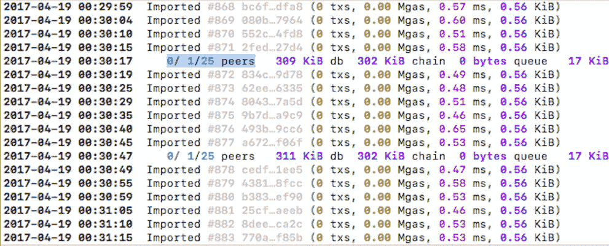

# 构建联盟区块链

联盟（通常由多个参与者组成，如银行、电子商务网站、政府实体、医院等）可以利用区块链技术解决许多问题，并使事情变得更快更便宜。尽管他们找出了区块链如何帮助他们，以太坊的区块链实现并不完全适合他们的所有情况。虽然有其他区块链实现（例如 Hyperledger）专门为联盟而构建，但正如我们在整本书中学到的以太坊一样，我们将看到如何使用以太坊构建联盟区块链。基本上，我们将使用 Parity 来构建联盟区块链。虽然 Parity 还有其他替代方案，例如 J.P. Morgan 的 quorum，但在撰写本书时，Parity 已经存在一段时间，许多企业已经在使用它，而其他替代方案尚未被任何企业使用。但根据您的需求，Parity 可能不是最佳解决方案；因此，在决定使用哪种解决方案之前，请先调查所有其他解决方案。

在本章中，我们将涵盖以下主题：

+   为什么以太坊不适合联盟区块链？

+   什么是 Parity 节点以及其特点？

+   什么是权威证明共识协议，以及 Parity 支持哪些类型的 PoA？

+   Aura 共识协议是如何工作的？

+   下载并安装 Parity

+   使用 Parity 构建联盟区块链

# 什么是联盟区块链？

要理解什么是联盟区块链，或者换句话说，联盟需要什么样的区块链实现，让我们来看一个例子。银行希望建立一个区块链来使资金转账更加简单、快速和便宜。在这种情况下，以下是他们需要的东西：

1.  **速度**：他们需要一个能够在几乎实时确认交易的区块链网络。目前，以太坊区块链网络的出块时间为 12 秒，客户通常需要等待几分钟才能确认一笔交易。

1.  **有权限**：他们希望区块链是有权限的。权限本身意味着各种不同的事情。例如：权限可能包括获得加入网络的许可，可能包括获得创建区块的许可，也可能包括获得发送特定交易的许可等等。

1.  **安全性**：对于私有网络来说，PoW 并不足够安全，因为参与者数量有限；因此，没有足够的算力来保证其安全性。因此，需要一种能够保持区块链安全和不可变的共识协议。

1.  **隐私性**：尽管网络是私有的，但网络本身仍然需要隐私。有两种隐私形式：

1.  **身份隐私：** 身份隐私是使身份无法追踪的行为。我们先前看到的获得身份隐私的解决方案是使用多个以太坊账户地址。但是，如果使用多个以太坊账户，则智能合约将无法通过所有这些账户是否实际属于同一用户的所有权验证而失败。

1.  **数据隐私：** 有时，我们不希望数据对网络中的所有节点可见，而是只对特定节点可见。

总的来说，在本章中，我们将学习如何解决以太坊中的这些问题。

# 什么是权威证明共识？

PoA 是区块链的一种共识机制，其共识是通过参考验证者列表（当它们与实体联系在一起时称为权威）来实现的。验证者是允许参与共识的一组账户/节点；它们验证交易和区块。

与 PoW 或 PoS 不同，它不涉及挖矿机制。有各种类型的 PoA 协议，它们根据它们的实际工作方式而有所不同。Hyperledger 和 Ripple 基于 PoA。Hyperledger 基于 PBFT，而 Ripple 使用迭代过程。

# Parity 简介

Parity 是一款专为正确性/可验证性、模块化、低占用空间和高性能而编写的以太坊节点。它是用 Rust 编程语言编写的，这是一种以效率为重点的混合命令式/OO/函数式语言。它是由 Parity Technologies 专业开发的。在撰写本书时，Parity 的最新版本是 1.7.0，我们将使用此版本。我们将学习构建联盟区块链所需的所有内容。要深入学习 Parity，您可以参考官方文档。

它比 go-ethereum 有更多的功能，例如 web3 dapp 浏览器，更先进的账户管理等等。但它之所以特别之处在于，它支持**权威证明**（**PoA**）以及 PoW。Parity 目前支持 Aura 和 Tendermint PoA 协议。未来，它可能支持更多的 PoA 协议。当前，Parity 推荐使用 Aura 而不是 Tendermint，因为 Tendermint 仍在开发中。

Aura 对于权限区块链比 PoW 是一个更好的解决方案，因为它具有更好的区块时间，并在私有网络中提供了更好的安全性。

# 理解 Aura 工作原理

让我们高层次地看一下 Aura 是如何工作的。Aura 要求在每个节点中指定相同的验证者列表。这是参与共识的账户地址列表。一个节点可能是一个验证节点，也可能不是。即使是验证节点也需要拥有此列表，以便它自己能够达成共识。

如果验证者列表永远不会改变，此列表可以在创世文件中提供为静态列表；或者可以在智能合约中提供，以便可以动态更新，并且每个节点都知道它。在智能合约中，你可以配置各种关于谁可以添加新验证者的策略。

区块时间在创世文件中是可配置的。由你决定区块时间。在私有网络中，低至三秒的区块时间效果良好。在 Aura 中，每隔三秒钟选择一个验证者，该验证者负责创建、验证、签名和广播区块。我们不需要太多了解实际的选择算法，因为这不会影响我们的 dapp 开发。但这是计算下一个验证者的公式，`(UNIX_TIMESTAMP / BLOCK_TIME % NUMBER_OF_TOTAL_VALIDATORS)`。选择算法足够智能，给每个人平等的机会。当其他节点接收到一个区块时，它们会检查它是否来自下一个有效的验证者；如果不是，它们会拒绝它。与 PoW 不同，当一个验证者创建一个区块时，它不会获得以太币奖励。在 Aura 中，当没有交易时，是否生成空区块由我们决定。

你一定在想，如果由于某种原因，下一个验证节点无法创建和广播下一个区块会发生什么。为了理解这一点，让我们举个例子：假设 A 是下一个区块（即第五个区块）的验证者，B 是第六个区块的验证者。假设区块时间为五秒。如果 A 未能广播一个区块，那么五秒后当 B 轮到时，它将广播一个区块。所以实际上并没有发生什么严重的事情。区块时间戳将显示这些细节。

你可能也想知道是否有可能出现网络以多个不同的区块链结束的情况，就像在 PoW 中两个矿工同时挖矿的情况一样。是的，这种情况可能有很多种。让我们举一个例子，了解一种可能发生的情况以及网络如何自动解决它。假设有五个验证者：A、B、C、D 和 E。区块时间为五秒。假设首先选择 A，并且它广播了一个区块，但由于某种原因，该区块未到达 D 和 E；因此他们会认为 A 没有广播该区块。现在假设选择算法选择 B 来生成下一个区块；那么 B 将在 A 的区块之上生成下一个区块并广播给所有节点。D 和 E 将拒绝它，因为前一个区块的哈希值不匹配。因此，D 和 E 将形成不同的链，而 A、B 和 C 将形成不同的链。A、B 和 C 将拒绝来自 D 和 E 的区块，而 D 和 E 将拒绝来自 A、B 和 C 的区块。这个问题在节点之间解决，因为 A、B 和 C 持有的区块链比 D 和 E 持有的区块链更准确；因此 D 和 E 将用 A、B 和 C 持有的区块链替换他们的区块链版本。这两个版本的区块链将具有不同的准确度分数，第一个区块链的分数将比第二个区块链的分数更高。当 B 广播它的区块时，它还将提供其区块链的分数，由于其分数更高，D 和 E 将用 B 的区块链替换他们的区块链。这就是冲突是如何解决的。区块链的链分数是使用`(U128_max * BLOCK_NUMBER_OF_LATEST_BLOCK - (UNIX_TIMESTAMP_OF_LATEST_BLOCK / BLOCK_TIME))`来计算的。首先按长度对链进行评分（区块越多，越好）。对于长度相等的链，选择最后一个区块更老的链。

你可以深入了解 Aura 在[`github.com/paritytech/parity/wiki/Aura`](https://github.com/paritytech/parity/wiki/Aura)。

# 让 parity 运行起来

Parity 需要 Rust 版本 1.16.0 来构建。推荐通过 rustup 安装 Rust。

# 安装 rust

如果你还没有安装 rustup，你可以像这样安装它。

# Linux

在基于 Linux 的操作系统上，运行此命令：

```
curl https://sh.rustup.rs -sSf | sh

```

Parity 还需要安装`gcc`、`g++`、`libssl-dev`/`openssl`、`libudev-dev`和`pkg-config`软件包。

# OS X

在 OS X 上，运行此命令：

```
curl https://sh.rustup.rs -sSf | sh

```

Parity 还需要 clang。Clang 随 Xcode 命令行工具一起提供，或者可以使用 Homebrew 安装。

# Windows

确保你安装了带有 C++支持的 Visual Studio 2015。接下来，从[`static.rust-lang.org/rustup/dist/x86_64-pc-windows-msvc/rustup-init.exe`](https://static.rust-lang.org/rustup/dist/x86_64-pc-windows-msvc/rustup-init.exe)下载并运行 rustup 安装程序，启动"VS2015 x64 Native Tools Command Prompt"，并使用以下命令安装和设置`msvc`工具链：

```
rustup default stable-x86_64-pc-windows-msvc

```

# 下载、安装和运行 parity

现在，在您的操作系统上安装了 rust 之后，您可以运行以下简单的单行命令来安装 parity：

```
cargo install --git https://github.com/paritytech/parity.git parity

```

要检查是否安装了 parity，运行以下命令：

```
parity --help

```

如果成功安装了 parity，则会看到一个子命令和选项的列表。

# 创建私人网络

现在是时候设置我们的联合区块链了。我们将使用 Aura 来创建两个互相连接的验证节点进行共识。我们会在同一台计算机上设置它们。

# 创建账户

首先，打开两个 shell 窗口。其中一个是给第一个验证者，另一个是给第二个验证者。第一个节点将包含两个账户，第二个节点将包含一个账户。第一个节点的第二个账户将被分配一些初始 ether，这样网络就会有一些 ether。

在第一个 shell 中，运行以下命令两次：

```
parity account new -d ./validator0 

```

两次都会要求您输入密码。现在只需为两个账户设置相同的密码。

在第二个 shell 中，只运行一次以下命令：

```
parity account new  -d ./validator1 

```

就像以前一样，输入密码。

# 创建一个规范文件

每个网络的节点共享一个通用的规范文件。该文件告诉节点关于创世块，谁是验证者等信息。我们将创建一个智能合约，其中将包含验证者列表。有两种类型的验证器合约：非报告合约和报告合约。我们只需要提供一个。

区别在于非报告合同只返回验证器列表，而报告合同可以对良性（良性的不端行为可能只是未从指定验证者那里接收到一个块）和恶意不端行为（恶意的不端行为是发布了两个不同的块来同一个步骤）采取行动。

非报告合同至少应该具有以下接口：

```
{"constant":true,"inputs":[],"name":"getValidators","outputs":[{"name":"","type":"address[]"}],"payable":false,"type":"function"}

```

`getValidators` 函数将在每个块上被调用以确定当前列表。然后，切换规则由实施该方法的合同确定。

报告合同至少应该具有以下接口：

```
[ 
    {"constant":true,"inputs":[],"name":"getValidators","outputs":[{"name":"","type":"address[]"}],"payable":false,"type":"function"}, 
    {"constant":false,"inputs":[{"name":"validator","type":"address"}],"name":"reportMalicious","outputs":[],"payable":false,"type":"function"}, 
    {"constant":false,"inputs":[{"name":"validator","type":"address"}],"name":"reportBenign","outputs":[],"payable":false,"type":"function"} 
]

```

当存在良性或恶意行为时，共识引擎分别调用 `reportBenign` 和 `reportMalicious` 函数。

让我们创建一个报告合同。下面是一个基本示例：

```
contract ReportingContract { 
   address[] public validators = [0x831647ec69be4ca44ea4bd1b9909debfbaaef55c, 0x12a6bda0d5f58538167b2efce5519e316863f9fd]; 
   mapping(address => uint) indices; 
   address public disliked; 

   function ReportingContract() { 
       for (uint i = 0; i < validators.length; i++) { 
           indices[validators[i]] = i; 
       } 
   } 

   // Called on every block to update node validator list. 
    function getValidators() constant returns (address[]) { 
      return validators; 
   } 

   // Expand the list of validators. 
   function addValidator(address validator) { 
      validators.push(validator); 
   } 

   // Remove a validator from the list. 
   function reportMalicious(address validator) { 
      validators[indices[validator]] = validators[validators.length-1]; 
      delete indices[validator]; 
      delete validators[validators.length-1]; 
      validators.length--; 
   } 

   function reportBenign(address validator) { 
       disliked = validator; 
   } 
}

```

这段代码是不言而喻的。确保在验证器数组中用第一个验证者 1 和验证者 2 节点的第一个地址替换地址，因为我们将使用这些地址进行验证。现在使用您感到舒适的任何方法编译前述合同。

现在我们来创建规范文件。创建一个名为 `spec.json` 的文件，并将以下代码放入其中：

```
{ 
    "name": "ethereum", 
    "engine": { 
        "authorityRound": { 
            "params": { 
               "gasLimitBoundDivisor": "0x400", 
               "stepDuration": "5", 
               "validators" : { 
               "contract": "0x0000000000000000000000000000000000000005" 
                } 
            } 
        } 
    }, 
    "params": { 
        "maximumExtraDataSize": "0x20", 
        "minGasLimit": "0x1388", 
        "networkID" : "0x2323" 
    }, 
    "genesis": { 
      "seal": { 
       "authorityRound": { 
         "step": "0x0", 
          "signature": "0x00000000000000000000000000000000000000000
             000000000000000000000000000000000000000000000000000000
                00000000000000000000000000000000000" 
            } 
        }, 
        "difficulty": "0x20000", 
        "gasLimit": "0x5B8D80" 
    }, 
    "accounts": { 
        "0x0000000000000000000000000000000000000001": { "balance": "1", "builtin": { "name": "ecrecover", "pricing": { "linear": { "base": 3000, "word": 0 } } } }, 
        "0x0000000000000000000000000000000000000002": { "balance": "1", "builtin": { "name": "sha256", "pricing": { "linear": { "base": 60, "word": 12 } } } }, 
        "0x0000000000000000000000000000000000000003": { "balance": "1", "builtin": { "name": "ripemd160", "pricing": { "linear": { "base": 600, "word": 120 } } } }, 
        "0x0000000000000000000000000000000000000004": { "balance": "1", "builtin": { "name": "identity", "pricing": { "linear": { "base": 15, "word": 3 } } } }, 
        "0x0000000000000000000000000000000000000005": { "balance": "1", "constructor" : "0x606060405260406040519081016040528073831647" }, 
        "0x004ec07d2329997267Ec62b4166639513386F32E": { "balance": "10000000000000000000000" } 
    } 
}

```

下面是之前文件的工作原理：

+   `engine` 属性用于设置共识协议和协议特定参数。在这里，引擎是 `authorityRound`，即 aura。`gasLimitBoundDivisor` 确定了 gas 限制调整，具有通常的 `ethereum` 值。在 `validators` 属性中，我们有一个 `contract` 属性，这是报告合约的地址。`stepDuration` 是以秒为单位的区块时间。

+   在 `params` 属性中，只有网络 ID 是重要的；其他的对所有链都是标准的。

+   `genesis` 对于 `authorityRound` 共识有一些标准值。

+   `accounts` 用于列出网络中存在的初始帐户和合约。前四个是标准的以太坊内置合约；这些应该包括以使用 Solidity 合约编写语言。第五个是报告合约。确保将字节码替换为您的字节码，在 `constructor` 参数中使用。最后一个帐户是验证器 1 shell 中生成的第二个帐户。它用于向网络提供以太。将此地址替换为您自己的地址。

在我们继续之前，创建另一个名为 `node.pwds` 的文件。在该文件中，放置您创建的帐户的密码。这个文件将被验证者用来解锁帐户以签署区块。

# 启动节点

现在我们已经准备好启动我们的验证节点所需的所有基本要求。在第一个 shell 中，运行以下命令来启动第一个验证节点：

```
parity  --chain spec.json -d ./validator0 --force-sealing --engine-signer "0x831647ec69be4ca44ea4bd1b9909debfbaaef55c" --port 30300 --jsonrpc-port 8540 --ui-port 8180 --dapps-port 8080 --ws-port 8546 --jsonrpc-apis web3,eth,net,personal,parity,parity_set,traces,rpc,parity_accounts --password "node.pwds"

```

以下是前述命令的工作原理：

+   `--chain` 用于指定规范文件的路径。

+   `-d` 用于指定数据目录。

+   `--force-sealing` 确保即使没有交易，也会产生区块。

+   `--engine-signer` 用于指定节点将用于签名区块的地址，即验证者的地址。如果存在恶意权限，则建议使用 `--force-sealing`；这将确保正确的链是最长的。确保将地址更改为您生成的地址，即在此 shell 中生成的第一个地址。

+   `--password` 用于指定密码文件。

在第二个 shell 中，运行以下命令来启动第二个验证节点：

```
parity  --chain spec.json -d ./validator1 --force-sealing --engine-signer "0x12a6bda0d5f58538167b2efce5519e316863f9fd" --port 30301 --jsonrpc-port 8541 --ui-port 8181 --dapps-port 8081 --ws-port 8547 --jsonrpc-apis web3,eth,net,personal,parity,parity_set,traces,rpc,parity_accounts --password "/Users/narayanprusty/Desktop/node.pwds" 

```

在这里，请确保将地址更改为您在此 shell 中生成的地址。

# 连接节点

最后，我们需要连接这两个节点。打开一个新的 shell 窗口，并运行以下命令来查找连接到第二个节点的 URL：

```
curl --data '{"jsonrpc":"2.0","method":"parity_enode","params":[],"id":0}' -H "Content-Type: application/json" -X POST localhost:8541

```

您将会得到这样的输出：

```
{"jsonrpc":"2.0","result":"enode://7bac3c8cf914903904a408ecd71635966331990c5c9f7c7a291b531d5912ac3b52e8b174994b93cab1bf14118c2f24a16f75c49e83b93e0864eb099996ec1af9@[::0.0.1.0]:30301","id":0}

```

现在运行以下命令，将 `enode` URL 和 IP 地址中的编码 URL 替换为 127.0.0.1：

```
curl --data '{"jsonrpc":"2.0","method":"parity_addReservedPeer","params":["enode://7ba..."],"id":0}' -H "Content-Type: application/json" -X POST localhost:8540

```

您应该得到这个输出：

```
{"jsonrpc":"2.0","result":true,"id":0}

```

节点应该在控制台中指示 0/1/25 对等节点，这意味着它们彼此连接。这是一个参考图像：



# 许可和隐私

我们看到了 parity 如何解决速度和安全性的问题。Parity 目前没有提供任何特定于许可和隐私的内容。让我们看看如何在 parity 中实现这一点：

1.  **权限管理**：Parity 网络可以通过配置每个节点的服务器，仅允许特定 IP 地址的连接，来实现权限管理，决定谁可以加入，谁不可以加入。即使 IP 地址没有被阻止，要连接网络中的一个节点，新节点也需要一个我们之前看到的 enode 地址，而这个地址是无法猜测的。因此，默认情况下存在基本的保护。但是没有强制执行这一点。网络中的每个节点都必须自行处理此问题。类似的权限管理，可以通过智能合约来确定谁可以创建区块，谁不可以创建。最后，节点可以发送什么样的交易目前是不可配置的。

1.  **身份隐私**：通过仍然启用所有权检查的技术，可以实现身份隐私。在设置所有权时，所有者需要指定一个不确定的非对称加密的公钥。每当它想要通过所有权检查时，它将提供常见文本的加密形式，合约将解密它并查看账户是否为所有者。合约应确保相同的加密数据不会被检查两次。

1.  **数据隐私**：如果您只是使用区块链来存储数据，可以使用对称加密来加密数据，并与您想要查看数据的人共享密钥。但无法对加密数据进行操作。如果需要对输入数据进行操作并仍然保护隐私，则各方必须完全建立一个不同的区块链网络。

# 概要

总的来说，在本章中，我们学习了如何使用 Parity 以及 aura 的工作原理，以及在 Parity 中实现权限管理和隐私的一些技巧。现在，您至少应该有足够的信心为使用区块链的联盟构建一个概念验证。现在，您可以继续探索其他解决方案，例如 Hyperledger 1.0 和 Quorum，用于构建联盟区块链。目前，以太坊正式致力于使其更适合联盟；因此，请密切关注各种区块链信息来源，了解市场上的新动态。
