# 工作流程设置和区块链思考

区块链是加密货币世界中的新潮流；我们见证了比特币的显著增长的流行。以太坊使用与比特币类似的技术，它交易的货币被称为**以太币**。除了智能合约外，两者之间几乎没有什么区别。智能合约实际上就是使用**以太坊虚拟机**（**EVM**）编写的代码，它会在不可篡改的账本上自动执行协议。我们稍后会更多地了解这一点。要深入了解，首先我们将研究一些用例-它们非常有趣。接下来我们将介绍以太坊区块链和区块链的概述。我们将了解一些区块链的益处和局限性。然后，我们将着手建立一个高效的工作流程，以便我们可以进入后续章节而没有任何阻碍。

这一章我们将涉及的主题如下：

+   基于以太坊的项目

+   区块链和以太坊的概述

+   益处和局限性

+   建立高效的工作流程

# 基于以太坊的项目

以太坊就像比特币，但它是为代码而存在！它是用于智能合约的区块链，并且它在区块链中存储不可变的代码和逻辑。这里不可变是一个非常重要的词。这基本上就是你需要了解的全部关于以太坊的信息。那么，现在可能有什么可能性？让我们在接下来的章节中深入了解。

# Gnosis

Gnosis 是基于市场驱动的预测技术。它基于经过验证的科学研究。它有自己的平台，称为 Gnosis 平台，你可以在其上构建自己的平台。它基本上预测交易。而正确的预测将获得押注的代币。访问[`gnosis.pm/`](https://gnosis.pm/)以访问 Gnosis。

它的工作原理是你交易预测或者你对预测进行赌注。以下是 Gnosis 的主页：

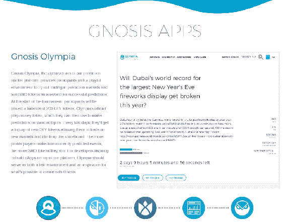

Gnosis 首页

在上面的截图中，请注意主页上提出的问题。**杜拜的世界纪录最大跨年烟花表演**会被打破吗？你可以选择是或否进行投票，投票会使用你的代币，并且一个预言机随后会告诉你活动是否发生。区块链会对这个预言机进行验证。预言机实际上就是与外部元素进行交互的智能合约。它们能存储和检索数据，这正是以太坊交易所需要做出决定的东西。预言机是一个可信的来源，在与这个可信来源进行核实后，你就可以在区块链中确定这个活动是否真的发生了，并且你可以对此绝对确定。

以下的图表解释了这一点的实际发生：

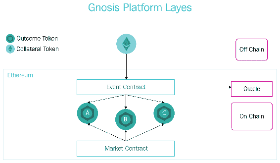

Gnosis 平台层级

# FirstBlood

FirstBlood 类似于 Gnosis；它是为电子竞技而设计的。在你是一名玩家的情况下，你可以使用代币注册比赛。你可以把代币拿来押注以赢取更多代币，你可以把自己放入一个由其他团队或人组成的队列中，并与他们进行比赛。你甚至可以参加比赛。游戏的获胜者获得代币。Oracle 用于决定比赛的结果。访问 [`firstblood.io`](http://firstblood.io) 以访问 FirstBlood。

# Dynamis

这是一家点对点保险公司，意味着不再有中间商。目前，他们正在开展失业保险业务，你可以因失业而获得报酬！你只需向人们展示你正在积极寻找工作。他们验证此方式是通过使用类似于 Gnosis 和 FirstBlood 的 Oracle，但他们用它来检查 LinkedIn 并验证你是否一直在申请工作。

要了解更多关于 Dynamis 的信息，请访问 [www.dynamisapp.com](http://www.dynamisapp.com)。

[你也可以访问](http://www.dynamisapp.com) [`blog.dynamisapp.com/p2p-insurance-solutions/`](http://blog.dynamisapp.com/p2p-insurance-solutions/) [以获得更深入的见解。](http://www.dynamisapp.com)

# Ujo Music

这基本上是一个为艺术家打造的去中心化音乐商店！我们都知道 iTunes、Spotify 等等。这些是坐在艺术家和他们的粉丝之间的公司，但是粉丝无法立即知道艺术家每次销售可以赚多少钱。Ujo Music 通过去中心化音乐商店来解决这个问题。没有了中间商，这意味着它们是艺术家和粉丝之间的桥梁。这当然意味着它为艺术家提供了更多的权力和金钱。不必担心许可，它只向已验证的身份提供音乐服务。要访问 Ujo Music，请访问 [`ujomusic.com/`](https://ujomusic.com/)。

它的工作方式如截图所述；它们有多个层次，其许可和支付基于以太坊。它们在 uPort 上有一个持久的身份，uPort 也是基于以太坊构建的：

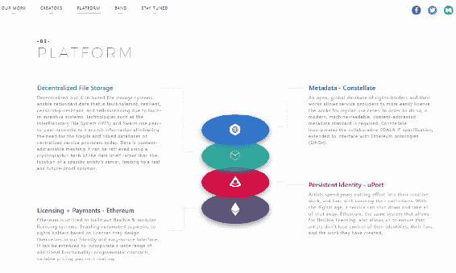

Ujo Music

文件本身存储在去中心化文件存储 **星际文件系统（IPFS）** 中，元数据使用的是也建立在以太坊上的 constellation。

下一个项目是我最喜欢的之一。

# Golem

它是一个去中心化的超级计算机！它执行离线计算。离线计算是不在区块链上进行的计算；计算是在区块链外进行的。然后在链上，它将验证这些计算。这意味着你可以出租你多余的计算能力，或者在需要时租用额外的计算能力。你可以用于 3D 渲染、计算化学、人工智能机器学习——任何你喜欢的事情。要访问 Golem，请转到 [`golem.network/`](https://golem.network/)。

在下面的截图中，您可以看到 Golem 的 GUI。 在左侧，您可以看到一个基本的钱包； 您还可以看到正在使用多少 CPU、RAM 和磁盘空间。 在右侧，您可以看到三个任务的一个小概念，这是三个 Blender 任务，在这种情况下，是 3D 渲染任务：

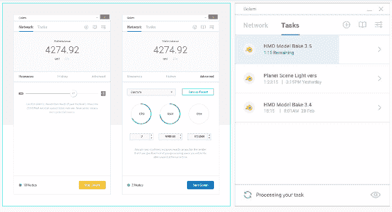

Golem GUI

# 区块链和以太坊概述

在这里，我们将简要概述以太坊和区块链。 我们将稍微深入了解一下，以便您更好地了解以太坊和区块链是如何制造出这些伟大的产品—我们已经看到的这些伟大的用例是可能的。

# 从比特币到以太坊

比特币是第一个区块链，但比特币只是用于支付。 人们开始发现比特币可以用于其他场景； 我们称之为**有色硬币**。 比特币具有惊人的开放设计，一个人，Vitalik Buterin，决定在比特币区块链上开始开发以太坊。 但是，由于比特币的限制，以太坊现在有了自己的区块链。

以下表格显示了比特币和以太坊之间的区别：

| **比特币** | **以太坊** |
| --- | --- |
| 用于支付 | 用于代码和逻辑 |
| 它是数字货币 | 它是智能合约平台 |
| 平均块时间/交易处理时间为 10 分钟 | 平均块时间/交易处理时间仅为 17.5 秒 |
| 它不是图灵完备的 | 它是图灵完备的 |

比特币和以太坊都是区块链。 它们都严重依赖于私钥/公钥加密，尽管比特币主要是一种支付形式，但两者都可以用于转移价值，尽管使用以太坊区块链时，价值将通过逻辑处理。 两者都是完全不可变的。

关于区块链需要记住的事项：

+   当某事在区块链上时，它是最终的。 这意味着您所做的任何事情都不会被回滚，因此即使是您的代码，您也必须找到特殊的方式来更新它。

+   你的私钥是你的数字身份，所以不要丢失它！

+   区块链不是独立存在的；它通常与其他技术一起使用，主要是前端技术或后端技术。

# 好处和限制

现在我们已经对区块链进行了概述，我们将看一下区块链的一些好处。 当您开发区块链应用程序时，我们还将看一些限制，并且我们将看一下如何克服这些限制或如何解决这些限制。

# 区块链和以太坊的好处

以下是区块链的一些好处：

+   去中心化

+   无信任性——您无需信任或将所有资金放在单一的失败点上

+   它可能非常具有成本效益

+   它也可以表现为物联网和电动汽车的支柱，电力网格或智能手机中的分散式身份，或电子身份证

# 区块链和以太坊的局限性

在使用区块链时，以下是一些可能遇到的困难：

+   如果尝试在不需要的地方使用区块链，可能会非常昂贵。

+   区块链对私有数据的处理能力并不理想，因为区块链本来就应该是公开的。

+   有时，需要集中化，而区块链总是去中心化的；这并不匹配。

+   大多数区块链在高使用量下的扩展能力并不理想。

+   不建议存储大文件，因为更多的计算意味着更多的功耗和更多的钱在公共区块链上；在私有区块链上，这只意味着更多的功耗——你需要投资更多的基础设施，所以这也是更多的钱。

# 克服限制

有时，您只是无法克服限制，因为您必须在需要时使用区块链。有些事情是可以克服的，比如在公共链上存储私有数据。这可以通过对数据添加额外的加密来完成。您可以将大文件存储在 IPFS 上，这也是去中心化的——它不是区块链，但它是去中心化的文件存储，它与以太坊非常配合。可伸缩性问题通过以太坊的分片得到解决：分片意味着将账户空间（如合同）分割为更小的子空间。如果需要的话，还可以使用私有链，比如 J.P. 摩根的 Quorum、Monax 和 Bletchley。它们都是基于以太坊的。

# 设置工作流程

在这里，我们将进行一些工作流程设置，以便开始开发。

# 要求

设置工作流程所需的以下内容：

+   Google Chrome。

+   MetaMask，这是一个 Chrome 扩展程序。我们将使用它来连接和测试区块链。

+   **Node Package Manager**（**NPM**）。

+   Truffle，这是我们的第一个框架。我们将使用它来开发我们的第一个去中心化应用程序。

+   Ethereum-JS ganache-cli，这是一个测试区块链。

# 入门

按照以下步骤设置工作流程：

1.  获取 NPM。它是 Node.js 的一部分。您可以在 [www.npmjs.com/get-npm](http://www.npmjs.com/get-npm) 上获取它，如下图所示：

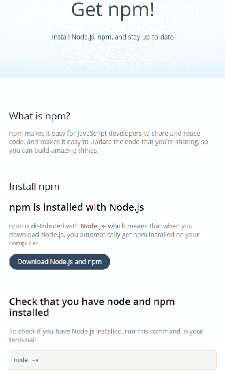

获取 NPM。

1.  选择显示在网页上的最新版本：

    +   安装 MetaMask。要下载 MetaMask，请访问 [`metamask.io/`](https://metamask.io/)。

1.  点击“获取 Chrome 扩展程序”。

    +   然后点击“添加到 Chrome”。

1.  我们将使用上述工具来测试我们的区块链应用程序。安装完成后，将打开一个新标签页，其中有一个视频详细解释了如何使用它以及它是什么。

1.  在本书期间，请务必记住，您可以连接到主网络以及三个测试网络，但您也可以设置自己的网络、自己的区块链，并在其中运行。以下截图显示了这一点：

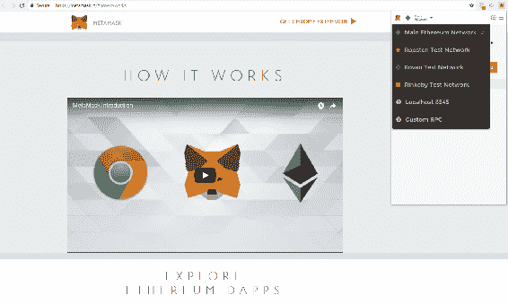

MetaMask 主网络

1.  安装名为`ganache-cli`的以太坊区块链模拟器。

1.  这可以按照以下截图中的说明完成：

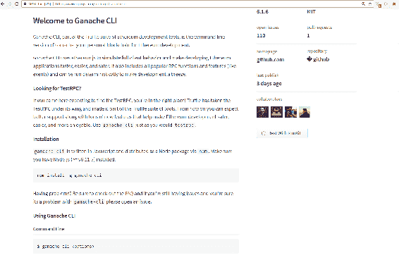

安装以太坊区块链模拟器的命令

1.  你可以将此作为节点包安装，只需复制此命令并粘贴到你的终端中。一旦你在终端中粘贴了它，它将开始安装，如下所示：

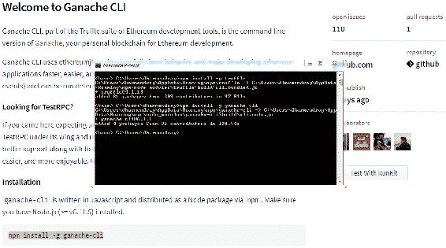

安装以太坊模拟器

安装完成后，它将告诉你安装成功了；现在先退出，因为我已经重新安装了这个。你可以继续通过在命令提示符中键入`ganache-cli`来验证它是否运行。如果你已正确安装了模拟器，你将获得以下输出：

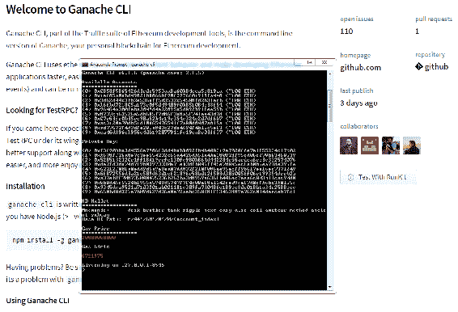

以太坊模拟器

1.  安装和下载 Truffle。

1.  Truffle 也是一个简单的节点包，来自[truffleframework.com](https://truffleframework.com/)，你可以通过复制并粘贴命令到你的终端来安装，如下所示：

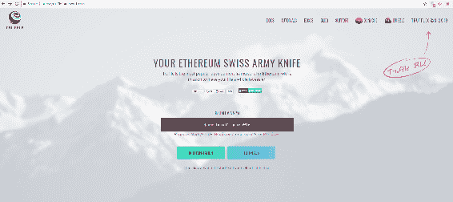

安装 Truffle 的命令

1.  安装完成后，你可以通过在终端中键入`truffle`来验证，如下截图所示，现在你可以使用其中任何命令：

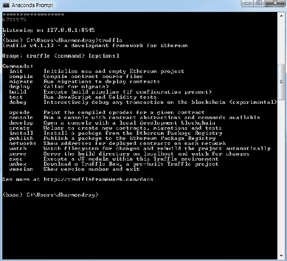

Truffle

1.  你可以使用`init`初始化一个新项目，在下一章中我们将这样做。因此，我们已成功完成了安装。

# 总结

我们已经讨论了运行在以太坊上的不同项目，并对区块链有了概述；之后，我们转向其优点和限制，以及如何克服这些限制。最后，我们为我们自己的以太坊工作流创建了一个设置。

在下一章中，我们将使用以太坊开发我们的第一个简单的去中心化支付应用程序。
