# 第二章：使用以太坊开发您的第一个去中心化应用程序

**DApps** 或 **去中心化应用程序** 是在区块链上运行的应用程序。以太坊为其用户提供了一些灵活性，使他们能够创建此类应用程序。在本章中，我们将专注于创建一个 DApp 并学习如何在我们生活的各个方面实施它。

在本章中，我们将学习如何进行以下操作：

+   创建一个项目

+   部署和测试项目

+   探索 Solidity 语法和 JavaScript 代码

+   修复智能合约中的错误并进行调试

+   用更好的支付方式改变我们的应用程序

要构建一个应用程序，我们需要理解用于开发它的代码和语法。因此，我们将查看 Solidity 语法，并了解 JavaScript 代码的工作方式。

# 创建一个项目

本节将教我们如何创建一个新项目。我们需要探索代码和 Solidity 语法。部署项目将帮助我们了解将该项目转变为更好的支付应用程序有多容易。为了更好地理解这个概念，我们将详细了解一些关于 bug 修复的具体内容，还将学习调试智能合约和一些功能应用程序。

要开始，我们需要创建一个新文件夹。为了符合约定，让我们将其命名为 `my_first_project`。

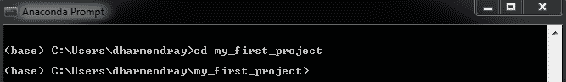

接下来的即时步骤是运行 Truffle。使用以下命令进行此操作：

```
C:\WINDOWS\system32>truffle
```

命令的输出应该如下所示：

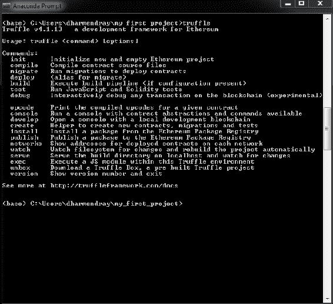

这显示了可以用于 Truffle 的各种过程的命令列表。Truffle `init` 命令允许我们初始化一个新的 Truffle 项目。

在整本书中，我们将使用一个方便的 Truffle unbox 命令来下载和设置一个样板项目。为此，我们将使用 `webpack` 盒子，通过运行 `truffle unbox webpack` 命令来完成，如下面的截图所示：

```
C:\Windows\System32\my_project>truffle unbox webpack
```

所有的盒子都在他们的网站上列出来，这是一个不断增长的列表，其中包括一些 React 盒子和许多其他盒子。解包需要一段时间，之后您将在屏幕上看到以下消息：

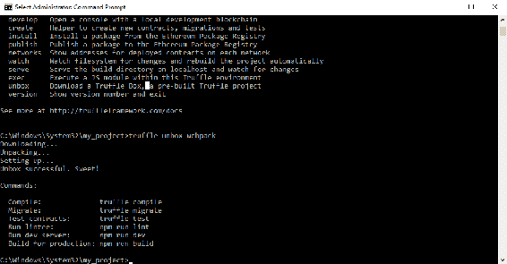

完成此操作后，我们可以在所选编辑器中开始创建我们的项目。我们可以通过查看项目结构开始。解包将为我们创建几个文件和文件夹。您的屏幕应该看起来类似于以下内容：

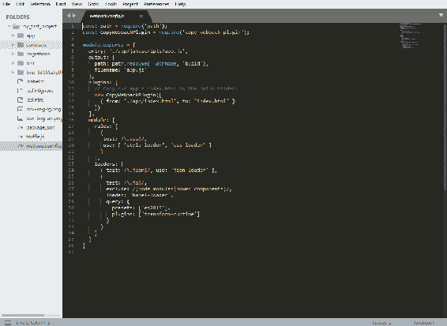

它还将安装一个 webpack，可以通过 `webpack.config.js` 文件进行配置。此文件允许您配置如何将 JSON、CSS 和 JavaScript 进行最小化，以及介于其中的所有内容。您还将拥有一个 `truffle.js` 文件，用于定义您的网络。点击此按钮后，您的屏幕将如下所示：

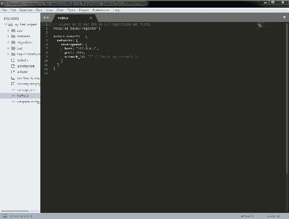

`truffle.js`文件预先定义了一个默认为`localhost:7545`的开发网络。它还将创建一个包含我们主要项目的 app 文件夹。此文件夹包含一个 HTML 索引以及一些 CSS 和 JavaScript，用于导入我们的智能合约。`contracts`文件夹包含一个`ConvertLib`，这是一个简单的库，用于演示目的，在`main`文件`MetaCoin.sol`中导入。文件扩展名清楚地表明此处使用的语言是 Solidity，有人可能称其为为 Ethereum 开发的 JavaScript 方言。您还可以看到迁移和`test`文件夹。每个都有自己的目的，我们将在本书的课程中学习。下一节将向我们展示如何部署和测试项目。

# 部署和测试项目

我们现在将部署在前一节中创建的应用程序。我们将通过启动开发区块链，配置我们的部署，部署我们的智能合约以及构建应用程序来完成此操作。

# 启动开发区块链

首先，我们要运行我们的开发区块链。这可以通过在终端窗口中输入`ganache-cli`来完成。您的屏幕将如下所示：

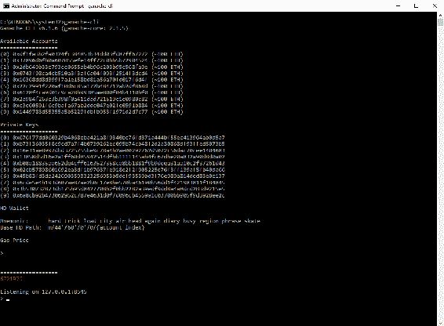

确保记下或记住本地主机端口号。这很重要，因为您将在项目的后期阶段连接到它。Ganache-cli 生成 10 个可用账户，然后生成相应的私钥。这些私钥用于加密从每个个人账户发送的交易。在底部，您将看到一个助记词。这十二个单词非常重要。请务必记住这些单词，因为您将需要它们来导入您的私钥以及相同的账户到 MetaMask 中。

# 配置您的部署

继续前进，我们需要确保项目设置与我们的区块链创建时的主机名和端口对应。为此，您需要回到编辑器，找到位于`root`文件夹中的`truffle.js`文件，并在此处将端口号从`7545`更改为`8545`，以匹配托管我们的开发区块链的端口号。不需要对主机进行任何更改，因为它只是本地主机。然后，在终端窗口中继续在`my_first_project`文件夹中部署您的项目。使用以下命令：

```
C:\Windows\System32\my_project>truffle-cli compile
```

如果您使用的是 Windows 系统，我们需要在位于`C:/users/[YOUR USERNAME]/appdata/roaming/npm`的 npm 包文件夹中进行一些更改。路径可能因每个用户在不同机器上安装`npm`包的位置而异。我们需要将`npm`包中的`truffle.cmd`文件重命名为`truffle-cli.cmd`。

这样可以确保智能合约在没有任何错误的情况下被编译。一旦发生这种情况，您的屏幕应如下所示：

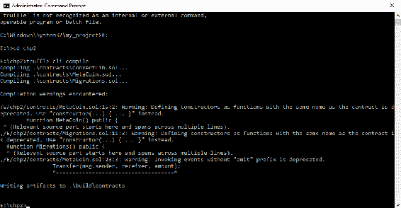

构建输出文件现在已写入合同文件夹（也称为 `build` 文件夹）。

# 部署智能合约

立即执行的下一步是将这些智能合约迁移并部署到您的开发区块链。为此，我们使用以下命令：

```
C:\Windows\System32\my_project>truffle-cli migrate
```

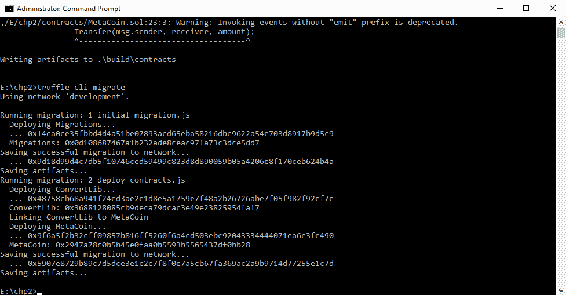

上述命令有助于创建您的合同并为每个合同进行交易。以下截图应该帮助您清楚地确定您需要在屏幕上注意的因素：

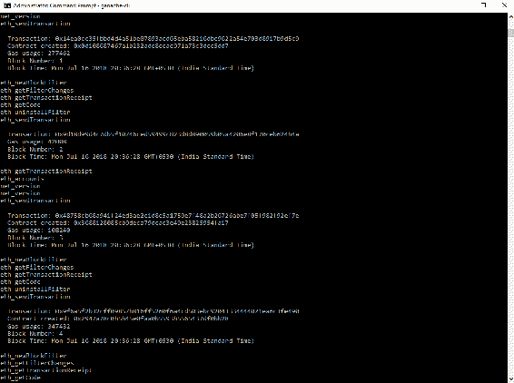

在这里，您可以观察到第一个合同后的创建 - 某些变量已更新，某些交易已发生。同样的过程重复创建多个合同，每个合同都有自己的变量和交易。

返回您选择的编辑器，您将在您的 `migration` 文件夹中找到这些合约。部署的过程从 `migration` 智能合约开始，然后转移到 `ConverLib` 智能合约。`MetaCoin` 是最后一个要部署的智能合约。如果我们查看位于编辑器的 `migration` 文件夹中的 `deploy_contracts.js` 文件，就可以更清楚地理解。

以下截图还可帮助您了解已部署的智能合约的顺序：

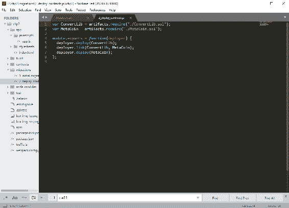

# 探索 Solidity 语法和 JavaScript 代码

本节将帮助我们理解 Solidity 语法。我们将探索 Solidity 和 JavaScript 代码，以深入了解我们的项目。这也将赋予我们修改代码以根据需要自定义它的能力。

# 理解 Solidity 语法

为了理解语法，让我们看一下 Solidity 文件 `MetaCoin.sol`。以下截图将作为指南，以便我们理解每一行代码：

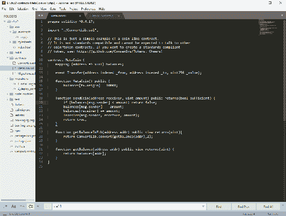

如您所见，每个 Solidity 文件都以您当前使用的 Solidity 版本的定义开始。在本例中，那将是 0.4.17。接下来立即导入转换库（通常称为 `ConvertLib.sol`）。如下所示的代码块显示了这一点：

```
pragma solidity ⁰.4.17;

library ConvertLib{
    function convert(uint amount,uint conversionRate) public pure returns (uint convertedAmount)
    {
        return amount * conversionRate;
    }
}
```

我们现在将继续创建一个合约。我们将使用 contract 关键字，后跟您的合约名称。例如，contract xyz。合约运行类似于其他任何编程语言中的类的概念：

```
contract MetaCoin {
```

`MetaCoin` 智能合约首先添加的是第一个变量，即映射，一个名为 **balances** 的映射。映射本质上是一种键值存储，允许您将地址映射到无符号整数。这个地址可以是一个独特的人或一个独特的账户。这个 `mapping` 函数是您应用程序的核心变量：

```
mapping (address => uint) balances;
```

下一个变量被定义为一个事件，并且它被分配了三个参数。这些参数是`FROM`，`TO`和`VALUE`。事件可以用于触发 JavaScript 事件，甚至记录一些数据：

```
event Transfer(address indexed _from, address indexed _to, uint256 _value);
```

`MetaCoin` 构造函数用于向部署智能合约的人提供 10,000 个`MetaCoin`。这个人通常是管理员。也可以是另一个部署了这个智能合约的智能合约：

```
function MetaCoin() public {
    balances[tx.origin] = 10000;
  }
```

下一个函数是`sendCoin`。它接受两个参数：接收者和金额。它也可以返回一个值。在函数中定义返回值有两种方法。第一种方法是直接实现返回函数，写作`returns(uint)`，第二种是给它任何名字，比如`returns(bool sufficient)`。这个函数使用`if`循环来检查消息或交易的发送者是否有足够的余额。然后代码继续检查如果发送者的余额小于他/她想要发送的金额，如果是，返回的值是`false`或者是不足额的余额。如果不是，我们继续前进并检查它是否从发送者扣除了金额，并将相同金额添加到接收者。

```
function sendCoin(address receiver, uint amount) public returns(bool sufficient) {
    if (balances[msg.sender] < amount) return false;
    balances[msg.sender] -= amount;
    balances[receiver] += amount;
    Transfer(msg.sender, receiver, amount);
    return true;
  }
```

结束后，将触发转账事件，随后是日志或 JavaScript 事件，也会返回`true`来指示发送者实际上有足够的余额：

```
function getBalanceInEth(address addr) public view returns(uint){
    return ConvertLib.convert(getBalance(addr),2);
  }

  function getBalance(address addr) public view returns(uint) {
    return balances[addr];
  }
```

`getBalanceInEth` 和 `getBalance` 函数被定义为视图，返回一个整数。视图是一种返回展示数据的功能。`getBalanceInEth` 函数利用了 Convert 库，它传递的第一个参数来源于 `getBalance` 函数。`getBalance` 函数返回被传递的参数的余额。你可以观察到 `address.addr` 被外部调用，因此它将被传递到 JavaScript 端。数字 2 被传递作为第二个参数。这是一个转换率，而第一个参数是金额。这是一个简单的乘法，模拟代币和以太币之间的转换。

现在我们将使用`ConvertLib`，它不仅被定义为一个库，而且还被单独部署。以下代码帮助我们更好地理解其运作方式：

```
library ConvertLib{
    function convert(uint amount,uint conversionRate) public pure returns (uint convertedAmount)
    {
        return amount * conversionRate;
    }
}
```

这样做的主要好处是你可以维护一个包含你的业务逻辑的智能合约，也可以维护一个包含一堆辅助函数甚至变量的智能合约。

# 使用 JavaScript

Truffle 为我们提供了易于导入并与智能合约交互的工具。以下是一个名为`app.js`的 JavaScript 代码文件的截图，你可以在`app`目录下的`javascript`文件夹中找到它：

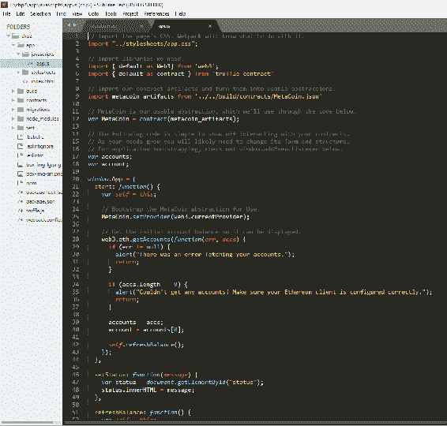

这里首先导入的是`Web3`库，它是由以太坊提供的。它与以太坊区块链进行接口。它可以根据当前需求请求信息或发送交易。

下一个导入是`truffle-contract`。它作为 Truffle 提供的合约接口的包装器。

然后，我们从`build`目录中的`MetaCoin.JSON`文件导入`metacoin_artifacts`。使用此合约初始化一个`MetaCoin`变量，并将`metacoin_artifacts`作为参数传递给此合约构造函数。这使我们可以使用`MetaCoin`智能合约的可用抽象。`MetaCoin`合约用于设置提供者，这个提供者是我们将与区块链进行接口的方式。

`currentProvider`通常由提供`Web3`库的任何东西填充，这在这种情况下是`MetaMask`。

然后，我们使用`Web3`库获取我们测试区块链设置中处于活动状态的所有账户。`getAccounts`函数将获取您拥有的实际上属于您的安装中所有可用的账户。为了理解，让我们假设每个账户代表多个人或多个账户。

如果你正在运行一个真实的、在线的区块链节点，`getAccounts`函数实际上不会获取到所关注的区块链中的所有账户。

一旦账户被获取，`refreshBalance`函数就会使用我们之前定义的`MetaCoin`抽象来获取所关注合约的已部署实例。然后，该实例用于获取余额。请记住，这不是一个交易；这是一个用于获取一些数据的调用。因此，使用关键字调用。调用实际上不会花费我们任何东西。

如果这真的是一笔交易，你会改变什么？不多。你只会消除关键字`call`。简单，对吧？

让我们继续定义`getBalance`函数的第一个参数；这里的账户参数与我们为我们的 Solidity 文件`MetaCoin.sol`定义的`getBalance`或`getBalanceinEth`函数的第一个参数相一致。

这里的第二个参数是一些额外的数据，你可以添加到一个调用或一个交易中。在这种情况下，我们可以确定它来自于与调用相同的账户。完成后，我们可以返回一个值，或者使用它来更新`balance_element`。如果发生错误，它将被记录在控制台上。

发送一枚硬币也是使用类似的过程——我们再次获取已部署的实例，然后使用`sendCoin`函数。仔细观察会让我们意识到这里没有`call`关键字，因为这是一笔实际的交易。从一个人发送一枚硬币到另一个人是区块链的变化，因此这是一笔交易。

进一步的步骤将保持不变；这些包括语法、参数顺序等。

# 修复和调试智能合约

本节告诉您如何进行故障修复和调试代码。通常，代码将在开发者控制台中调试，这类似于开发常规 JavaScript 代码。如果 JavaScript 代码中存在错误，则可以在开发者控制台上轻松更正。但是，如果错误出现在您的智能合约中，您需要深入了解。一旦智能合约上线，您将如何调试它？好吧，您不能在本地调试。如果有人发现了错误，您需要找出它来自哪里。因为这些原因，我们可以使用[remix.ethereum.org](http://remix.ethereum.org/#optimize=false&version=soljson-v0.4.24+commit.e67f0147.js)和`etherscan.io`。

在[remix.ethereum.org](http://remix.ethereum.org/#optimize=false&version=soljson-v0.4.24+commit.e67f0147.js)找到的`MetaCoin Solidity`文件的修改版本如下所示：

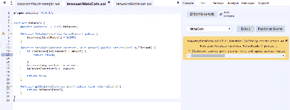

您可以通过单击左上角的加号图标并给它一个您选择的名称来创建此文件。编译此代码后，您将注意到一个绿色的条形图，表示代码已成功编译。让我们尝试通过省略一个分号引入错误；条形图现在将变为红色，表示存在需要纠正的错误。

以下截图将帮助您了解屏幕上的各个选项卡：

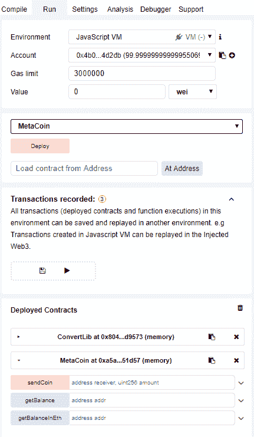

运行选项卡包含环境部分，我们应确保选择 JavaScript VM 作为我们希望使用的环境。这样可以在我们的浏览器中模拟以太坊区块链，类似于 TestRPC 的功能。

您可能会注意到`MetaCoin Solidity`文件的构造函数现在包含一个`firstHolder`参数。`firstHolder`将是首个获得 10,000 个 MetaCoins 的人。您可以选择任意账户。然后需要确保您复制并将其作为构造函数的参数给出。对于地址，通常最好将它们放在引号之间。

创建`MetaCoin`后，屏幕下半部分将显示一个包含您的交易的窗口。它看起来像下面的截图所示：

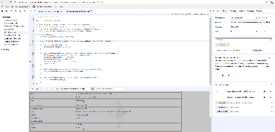

货币交易

此窗口包含交易的详细信息。我们还可以调试文件。但首先让我们通过将地址复制到 GetBalance 选项卡来获取此人的余额。

完成此操作后，我们可以继续调试。我们可以逐步进行以更好地理解过程。这将仅有三个步骤，因为这是一个小函数。

现在让我们试着在任意两个帐户之间发送一些硬币。这将要求我们复制第二个帐户的地址并将其用作“SendCoin”选项卡中的第一个参数。当然，第二个参数将是您希望转移的硬币数量。请参考以下屏幕截图以获得清晰的理解：

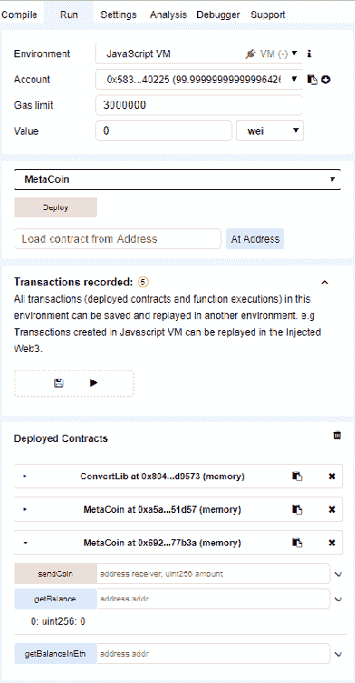

您可以在“详细信息”下的灰色区域或调试中检查交易的详细信息，如下面的屏幕截图所示。您还可以检查交易的状态。要了解清楚，请单击调试以查看逐步过程。由于 remix 是以太坊开发者的开源项目，几乎任何人都可以使用它。您可以通过从 Git 上拉取它，也可以在线使用它。由您决定：

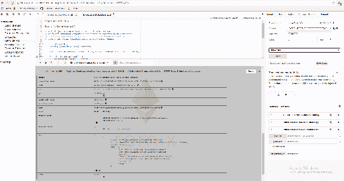

获取余额并将硬币发送到不同的账户

一旦您的智能合同启动，您可以在`etherscan.io`上监视交易。只需选择任意交易。您可以查看源代码或找出它是否是智能合同。交易信息显示所有已发生的交易。您可以查看事件日志，其中显示了你在 Solidity 代码中创建的事件写入的文本。如果您已执行其中任何交易，您可以使用`Geth DebugTrace`来追踪它们。如果您试图追踪不属于您的任何交易，您会遇到错误，因为没有可用的追踪。这可以在交易的工具和实用程序部分中看到。

Parity 跟踪只是另一个可以使用的以太坊客户端。您将在这里看到跟踪，尽管这可能没有太多意义。当您的智能合同上线时，您将不会对其进行修复，而是进行更新。您总是可以在本地进行调试。

# 更改我们的应用程序，使用更好的支付应用程序

本节将集中于我们改进我们的代码。这将包括添加诸如存入以太币、获得代币和以以太币换取代币以及一个创建者费用等功能。

我们将使用上一节中使用的相同代码并继续构建它。

由于我们不希望以太币的存款交换免费代币，我们将彻底删除以下代码行：

```
function MetaCoin() public {
    balances[tx.origin] = 10000;
  }
```

我们首先设置一个创建者。为此，我们需要定义一个地址创建者和一个`creatorFee`如下：

```
contract MetaCoin {
  mapping (address => uint) balances;
  address creator;
  uint creatorFee = 1;
  uint collectedFees = 0;

  uint conversionRate = 5;

  uint CURRENCY_MULTIPLIER = 10**18;
```

`collectedFees`可以说是一个资金池。这用于收集`creatorFees`。转换率是用来乘以代币数量的率。例如，如果您有一单位以太币，您将获得五个代币作为交换。假设有 0.1 单位以太币的情况下，转换仍然在后端使用整数。`currency_multiplier`用于等价您的代币和以太币的价值。最小面额是 wei。

当智能合约被创建时，我们还需要将`message.sender`初始化为创建者:

```
  function MetaCoin() public {
      creator = msg.sender;
  }
```

创建者需要一些自己的特殊功能，比如用于提取费用的功能。这要求我们创建一个名为`onlyCreator`的修饰符。在这里，代码应该如下所示:

```
modifier onlyCreator() {
        if (msg.sender == creator || tx.origin ==creator) {
            _;
         } 
}
```

这增加了一个条件，即如果`message.sender`是创建者，或者如果`transaction.origin`来自创建者，那么才会执行代码。这是通过添加下划线来实现的。

接下来的步骤将是创建一个名为`collectFees`的函数。出于代码的考虑，我们将它设为 public，但仅有创建者才能调用这个函数。您的代码应该如下所示:

```
function collectFees() public onlyCreator {
        creator.transfer(collectedFees);
        collectedFees = 0;
}
```

现在，我们将资金转移到创建者，并将收取的费用设置为 0。现在，我们要添加的是一些功能，以便每当有人发送硬币时，我们希望这些硬币的一部分能够流向创建者，为此我们将创建存款和提款功能。

存款功能将是一个可支付的功能。可支付功能在您想要接收以太币时使用。如果您忘记使用它，它只会显示一个错误:

```
function depsoit() public payable {
        balances[msg.sender] += msg.value * conversionRate *  
             CURRENCY_MULTIPLIER;
}
```

已经在合同函数中设置了使用的转化率。记住，我们的代币将与以太币的工作方式相同;这意味着一个代币将被乘以 10 的 18 次方。因此，当您存款任何代币时，它将被乘以`CURRENCY_MULTIPLIER`。

然后，我们将进入提款功能。在实现此功能时需要格外小心，因为我们首先需要使用合同函数中设置的货币乘数进行乘法。然后我们将通过执行交易者的余额来扣除需要提取的金额。该金额将被除以转换率。此功能的代码如下:

```
function withdraw(uint amount) public {
        amount = amount * CURRENCY_MULTIPLIER;

        balances[msg.sender] -= amount;
        msg.sender.transfer(amount / conversionRate);
    }
```

# 总结

在本章中，我们看了一下如何创建基于以太坊的应用程序。我们还部署并测试了相同的项目。然后，我们深入了解了 Solidity 语法，这不仅是庞大的，而且还非常广泛。我们还学习了如何使用我们自己的系统以及外部系统来修复错误。最后，我们将我们的项目转换为一个支付应用程序。

下一章重点介绍了创建我们自己的代币的概念。我们将更仔细地研究 ICO 和处理我们自己的代币交易。
