# 在以太坊区块链上创建你自己的加密货币

在本章中，我们将看看如何创建我们自己的 ERC20 代币项目。ERC20 代币是建立在以太坊区块链之上的加密货币。我们将查看其规范，以及如何进行首次代币发行。我们还将学习如何处理代币交易和转移价值。

我们将在本章中涵盖的主题如下：

+   创建一个加密货币/ERC20 代币项目

+   ERC20 标准/规范

+   首次代币发行

+   处理代币交易

# 创建一个 ERC20 代币

在本节中，你将学习如何创建一个 ERC20 代币。我们将从设置一个新项目开始 —— 我们将使用 OpenZeppelin Solidity 框架来创建我们的项目。

# 安装 OpenZepplin Solidity

OpenZeppelin 基本上只是一组智能合约，你可以导入到自己的智能合约中，以加快开发速度。它们还可以从一开始就使您的智能合约更加安全。

你可以访问 OpenZeppelin 的 GitHub 页面，网址为 [OpenZeppelin Github](http://www.github.com/OpenZeppelin/zeppelin-solidity)：

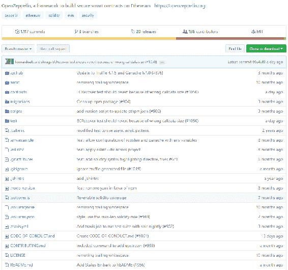

如果你一直在浏览 Truffle 网站 —— [truffleframework.com](http://truffleframework.com) —— 那么你可能已经见过 **Ganache**。我们将在本节中一直使用它。**Ganache** 是一个 GUI，比 TestRPC 更容易导航，但做的事情和 TestRPC 一样多。你可以在 Ganache 的 GitHub 页面上下载它，网址为 [Ganache GitHub](http://github.com/trufflesuite/ganache/releases)。

`ethereumjs-testrpc` 已被弃用，并更名为 `ganache-cli`。详细信息请访问以下链接：[`www.npmjs.com/package/ethereumjs-testrpc`](https://www.npmjs.com/package/ethereumjs-testrpc)。

下载后，您可以运行它。打开应用程序后，您将看到类似以下屏幕截图的界面：

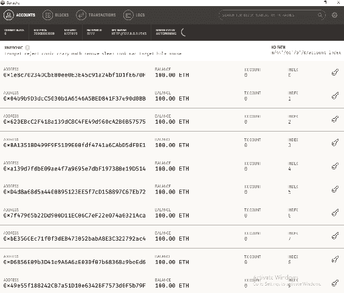

Ganache

这应该很熟悉：这些是由 TestRPC 生成的 10 个帐户。你可以看到你的区块、你的交易和你的日志。

# 设置新项目

要设置一个新项目，请按以下步骤操作：

1.  为项目创建一个新文件夹。

1.  在控制台上，运行 truffle 命令，`truffle –cli unbox webpack`。

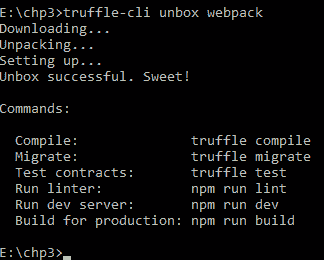

1.  运行 `npm install –E` 命令。因为 OpenZeppelin 建议指定 `–E`，并将拉取一个特定版本的 OpenZeppelin，它永远不会更新它，并将保持相同的版本。这是因为它还没有语义化版本控制。

1.  运行 `npm install –E zeppelin-solidity`。OpenZeppelin 更加安全，因为它从一开始就考虑了安全性。

1.  现在让我们切换到编辑器。在这里，我们将找到我们的起始项目。

1.  让我们开始删除我们不需要的东西。在迁移中，点击 `deploy contracts` 并删除 `ConvertLib` 的部署，即删除 `ConvertLib` 变量和 `deployer.deploy()` 变量；但是让 `deployer.link()` 保留 `MetaCoin` 变量：

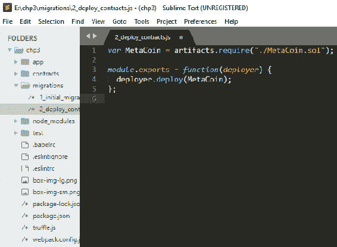

1.  进入 `contracts` 文件夹，并通过右键单击删除 `ConvertLib.sol` 来删除它。

1.  在 `MetaCoin Solidity` 文件中，删除 `ConvertLib`。删除所有的函数代码。

1.  从 OpenZeppelin 中导入标准代币。OpenZeppelin 是一个基本的 ERC20 接口，我们可以通过运行命令 `import ‘zeppelin-solidity/contracts/tokens/ERC20/StandardToken.sol'` 来使用它。这导入了 OpenZeppelin 框架中的 `StandardToken` Solidity 文件，并且它知道要在您的 `node modules` 文件夹中查找：

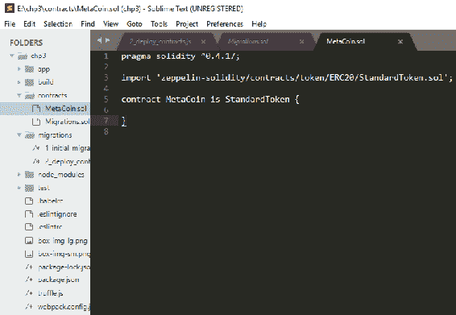

1.  现在我们可以为此定义 MetaCoin。在 `contract MetaCoin` 之前添加 `is StandardToken`。

1.  现在让我们迁移 MetaCoin。确保 Ganache 正在运行。在 RPC 服务器下，你应该看到 Ganache 运行在本地主机或端口号为 `7545`。Truffle 默认运行在 `7545`；您应该能够在编辑器中看到这一点：

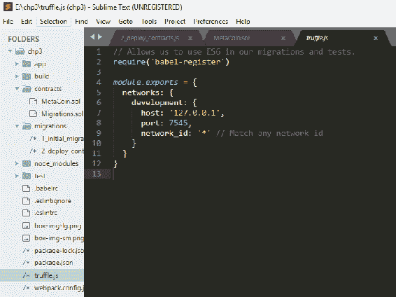

1.  现在，要迁移 `MetaCoin`，我们可以运行命令 `truffle -cli migrate`：

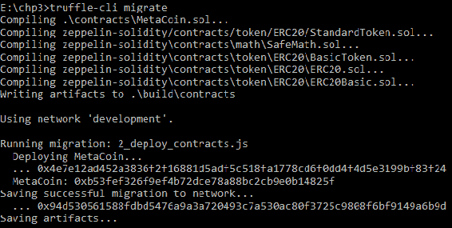

1.  现在你应该看到它正在编译您的 MetaCoin、迁移以及一堆来自 OpenZeppelin 框架的文件。

执行完所有这些步骤后，我们的 Ganache 应该看起来类似于以下内容：

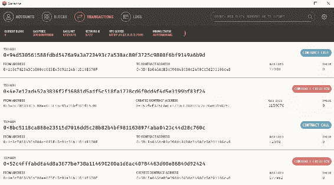

在进行合同调用后的 Ganache

现在你应该看到您的交易已经完成。Ganache 已经进行了合同调用，创建了合同。我们已经准备好继续进行了。

# 部署和测试 ERC20 代币

在这个部分，我们将看一下如何部署和测试我们的 ERC20 代币，或者加密货币。我们将看一下在转移代币时可能会遇到的一些潜在问题和安全问题，我们将查看所需的 Solidity 和 JavaScript 来进行转移代币。我们也将使用 Ganache 和 MetaMask 进行测试。

# 部署 ERC20 代币

首先，我们需要一些数据输入到编辑器中。在 `MetaCoin.sol` 中，我们需要定义一个名称、一个符号、小数点的数量和 `INITIAL_SUPPLY`。我们也将我们的 `INITIAL_SUPPLY` 赋给构造函数中的 `totalSupply`。我们还将给予代币的创建者 `INITIAL_SUPPLY`。

我们知道我们需要`totalSupply`，因为如果你去到 `StandardToken`，位于 `node modules` | `zeppelin-solidity` | `contracts` | `token` | `ERC20` | `StandardToken` 下，你会发现它导入了 `ERC20` 和 `BasicToken`。现在，如果我们去到 `ERC20` 文件夹，我们会发现这是一个接口，但是 `BasicToken.sol` 实现了这个接口。所以让我们去到 `BasicToken.sol` 文件夹。它将拥有`totalSupply`，`balances`。我希望你还记得上一章的内容。它有一个 `Transfer` 函数，使用了来自 `SafeMath.Solidity` 文件的 `SafeMath`。这是一个小的 Solidity 文件，它将确保每当你执行数学运算时，你的输入和输出数据都是正确的，并且不会损坏任何东西，因为一旦数据在区块链中，它就会保留在区块链中。所以，在定义了这一点之后，我们可以继续部署它。按照以下步骤部署 ERC20 代币，你的第一个加密货币：

1.  让我们确保 Ganache 正在运行。

1.  一旦 Ganache 运行起来了，复制助记词，粘贴到 [metamask.io](http://metamask.io) 的“恢复保险库”中。我们之前已经做过这个，你可能还记得。

你甚至可以重新安装 MetaMask 来重置所有内容。这会使事情变得更简单，因为 MetaMask 目前还没有这个功能。

1.  点击确定。一开始你应该什么也看不到。检查网络。如果你在主网络上，你将不得不连接到 `http://localhost:7545` —— 这是 Ganache 正在监听的端口。你可以通过点击主网络旁边的下拉箭头，并选择 `自定义 RPC` 来做到这一点。在上述本地主机 URL 中键入并保存。你应该看到 MetaMask 已经立即连接上了。你可以查看你的账户；你应该有一些以太币：

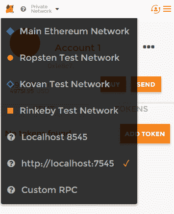

1.  转到`migrations`文件夹，确保其中有`var MetaCoin`。

1.  让我们去`MetaCoin.sol`。请注意，`INITIAL_SUPPLY` 将被指定的小数位数除以。

1.  切换到终端窗口。输入`truffle-cli migrate`命令。你应该能够看到成功出现的交易。复制合同代币：

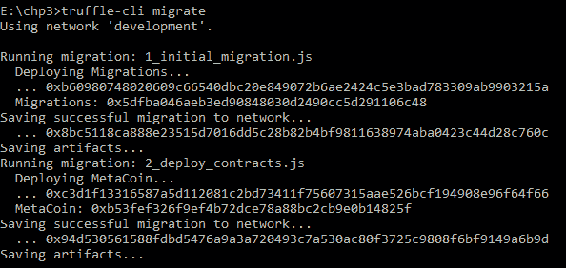

合同代币

1.  复制完这些内容后，你可以转到 MetaMask。访问左上角的图标，点击`添加代币`，并粘贴代币地址到代币地址部分。它将自动检索代币符号和指定的小数位数。点击添加。你将看到你的第一个代币，前面跟着你的符号：

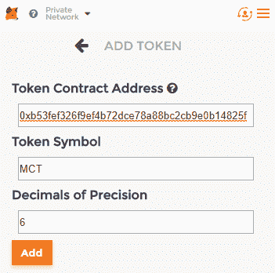

1.  现在你可以点击上方的用户图标创建一个账户。你现在会有一个第二个账户。退出代币标签页，你会发现你的第二个账户上有 0 个代币：

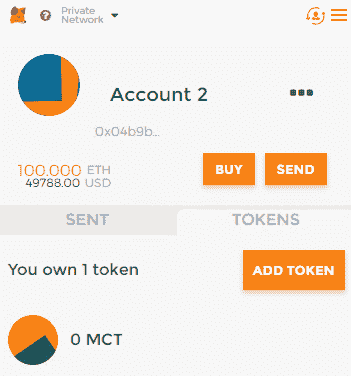

1.  现在，这里有一个小惊喜。你可以直接使用你已经有的代码来发送这些代币。与上一个示例中的 MetaCoin 的不同之处在于，现在这些代币实际上遵循了一个真正的标准，即 ERC20 标准。它规定你需要一个名称、一个代币符号、小数位数和一个`INITIAL_SUPPLY`。

1.  要转移代币，请运行`npm run dev`命令。

1.  打开网络浏览器并导航到`localhost:8080`：

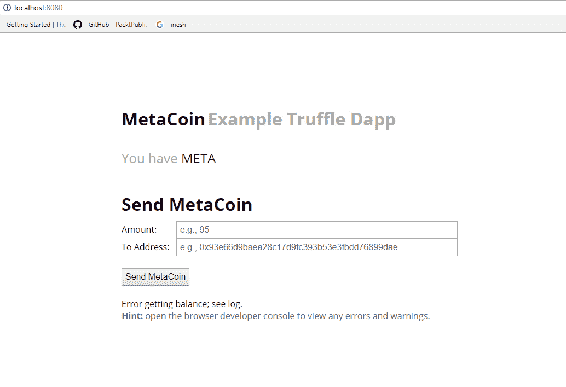

1.  转到编辑器。JavaScript 函数仍将尝试调用`getBalance`函数，但这已经改变了。如果你转到`BasicToken Solidity`文件，你会看到你有`balanceOf`。所以让我们去`app` | `JavaScripts` | `app.js`，然后到`refreshBalance`函数。在这里，我们将`meta.getBalance`改为`meta.balanceOf`。还要转到`sendCoin`函数并将`meta.sendCoin`更改为`meta.transfer`。确保你在`ERC20`文件夹下的`BasicToken.sol`中有相同类型的方法签名：

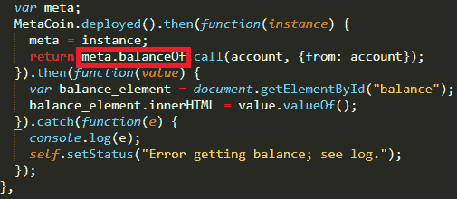

1.  现在转到`localhost:8080`页面的浏览器。切换到第一个账户。就是这样。你看不到小数点，但那只是一个前端的东西；我们以后会再看一下：

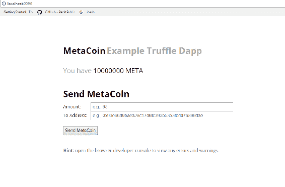

# 测试 ERC20 代币

我们现在将在你的第二个账户上进行测试。

1.  复制你的第二个账户的地址，如下截图所示：

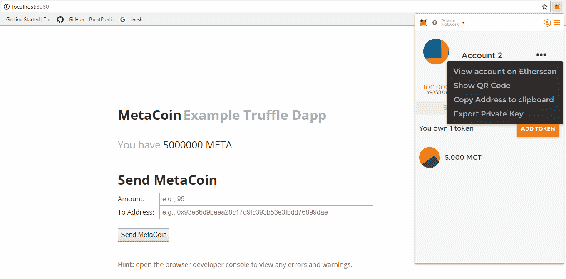

复制第二个账户的地址

1.  你需要在项目的`app`目录下的`javascript`文件夹中的`app.js`文件中进行更改：

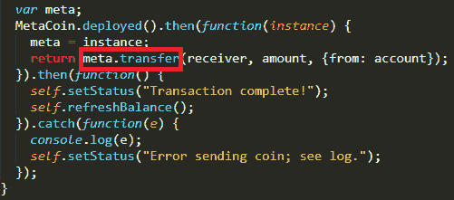

1.  切换到第一个账户并发送你的 MetaCoin。输入一个值，比如 5,000,000 单位（等于 5 个代币）。这个值应该小于`INITIAL_SUPPLY`中指定的值。请记住，`INITIAL_SUPPLY`除以小数点将给出 5 个代币，因此是 5,000,000。粘贴地址并点击发送 MetaCoin:

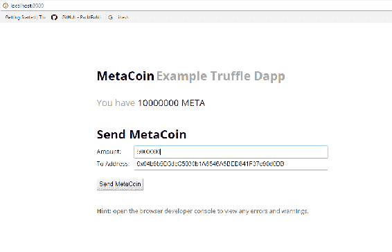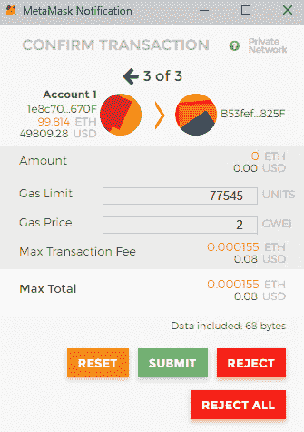

1.  刷新页面后，你会看到你的两个账户都有代币：

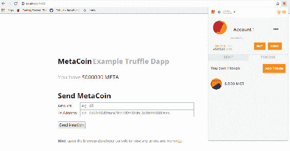

你现在已经创建了你的第一个 ERC20 标准加密货币并部署了它。

# 理解代币标准

在本节中，我们将更深入地研究 ERC20 代币以及为什么需要其他代币标准，如 ERC721 和 ERC827。

# ERC20

如果你去 [以太坊维基](https://theethereum.wiki/w/index.php/ERC20_Token_Standard) 查看 ERC20 代币标准，你可以看到所有你可以实现的函数和事件。此外，大多数代币都符合 ERC20 标准。你可以看到 **Golem 网络代币** (**GNT**) 只是部分符合 ERC20 标准，但它仍然是一个标准代币；你不一定要完全遵循所有规定，但如果你这样做总是更好。在这些函数中，我们以前没有见过的是 `allowance` 和 `approve`。在某些情况下，这些函数可能很有用。例如，如果你有 20 个 MetaCoin 代币，你可以说*我希望我的朋友或另一个账户以我的名义花费代币*。嗯，你可以用 `approve` 函数做到这一点。使用 `allowance` 函数，你可以指定一个花费者和你希望他们能够花费的代币数量。

# ERC721

让我们去 [EIP GitHub](https://github.com/ethereum/EIPs/issues)。EIP 指的是以太坊改进协议。在这里，在问题标签页，我们可以看到许多关于改进的讨论。如果你觉得你可以提出一个改进，你可以写成一份草案。正是通过这些讨论，有人提出了 [ERC: 不可互换代币标准](https://github.com/ethereum/EIPs/issues/721)。

首先，让我们定义一下什么是可互换的代币。根据定义，可互换的代币可以用于购买一定数量的商品或服务或其他可交易物品。同样地，美元可以花费，或者美元可以用来交换欧元。在这方面，不可互换的代币更像是棒球卡片，你可以有两个同一张卡片的任意引号或非引号选项，但一个可能比另一个更有价值，因为人们给它的价值不同。这就是 ERC721 代币的情况。如果你去 [ERC-721 定义](https://gist.github.com/aunyks/2d148a77150247f6f9745286ff46fc53#file-erc721-definitions-sol)，你可以看到一个简要定义。你可以看到 `name()`，`symbol()` 和 `totalsupply()`。

在这个定义中，你可以拥有一个代币，而且代币有一个所有者；你不必把代币交给所有者，你可以只是交易它。代币还有元数据，这个元数据指定了一个代币拥有哪些属性，这意味着它有一个价值。因此，这使得这些代币非常像棒球卡片，或者，如果你熟悉的话，以太坊 CryptoKitties：

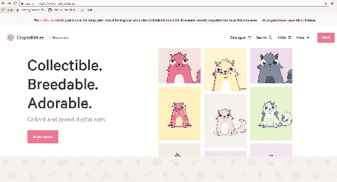

CryptoKitties 是这种类型代币的一个例子。它是一种可收集、可繁殖、可爱的代币。访问 [cryptokitties.co](http://cryptokitties.co) 获取更多信息。在他们的市场上，你可以看到出售的 CryptoKitties。一些是由像你和我这样的人出售的，以太币，如下图所示：

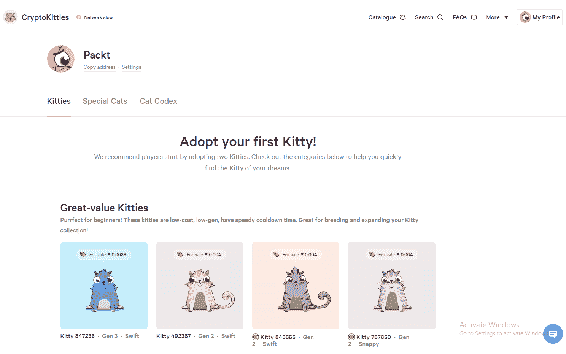

CryptoKitties 市场

其中一些甚至是独家的 CryptoKitties。它们是以高数量的以太币出售的非常特殊的代币。

你可以用这些 CryptoKitties 交易以太币，价格将会根据你所设置的内容而变化。这些是我的一些小猫：

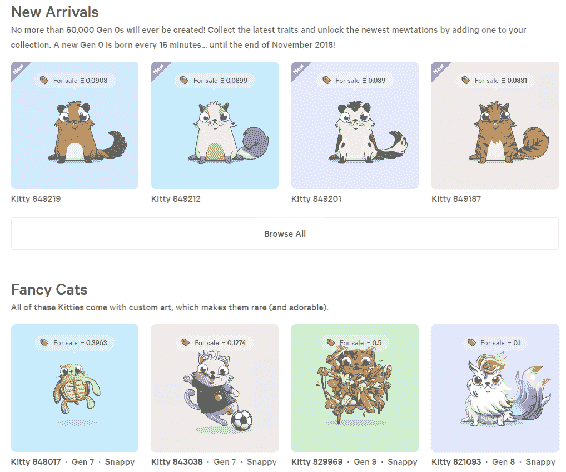

我的小猫

# ERC827

再次，如果你访问[EIP GitHub](http://github.com/ethereum/EIPs/issues/827)，你将得到一个摘要，以及为什么我们需要 ERC827 代币标准的解释。你实际上可以指定一些数据或一个函数，在转账发生后执行。这可以通过以下函数完成：

```
function transferAndCall(address _to, uint256 _value, bytes _data) public payable returns (bool) {
    require(_to != address(this));
    require(super.transfer(_to, _value));
    require(_to.call(_data));
    return true;
  }
```

你可以在以下链接找到这个函数：[`github.com/ethereum/EIPs/issues/827`](https://github.com/ethereum/EIPs/issues/827)。

你可以对接收方的地址调用上述函数。

这一切都关于代币标准。这还不是结束——将来肯定会出现很多新的代币标准。肯定会有很多提案。并非所有提案都会被接受，但一旦被接受，那是因为它们确实为整个体系带来了一些新东西。你甚至可以提出改进；谁知道，它可能会变成一个新的代币标准！现在我们可以学习如何使用我们的代币为智能合约的一些逻辑支付。

# 使用代币和执行逻辑

你可能会想知道第三方是如何在收到代币后执行调用的。实际上，这非常容易。在 JavaScript 中，可以使用以太坊提供的 Web3 库来完成。以下是在 remix 上显示的智能合约。我们之前已经探索了 remix：

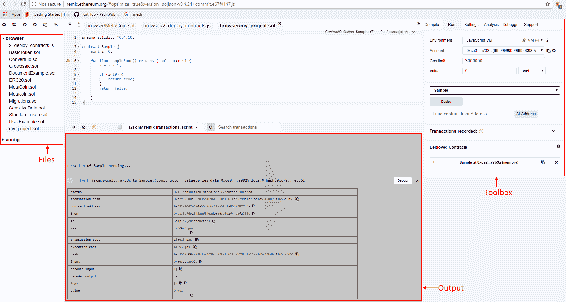

一个智能合约

这只是递增一个整数，检查它是否小于 10，并且如果是，则返回 true；否则返回 false。你可以使用 JavaScript VM 解决这个问题。编译和运行后，如果点击`SampleFunc`，灰色区域会增加一个新的条目。如果点击详情，你会看到一个输入条目——你可以复制这个。这将是你为这个函数的第三个参数。你可以像执行其他函数一样执行它。

现在，如果你使用 ERC827 智能合约发送代币，这个函数将被执行。

但是这有什么用呢？总的来说，安全性。接收方可以提取代币，引用或取消引用，并收到它们。原因在于智能合约中，你不希望仅仅发送代币并假设操作成功。像这样假设成功过去曾导致一些相当大的黑客攻击。你可以采用某种提取方案，在其中发送代币，然后使其可供接收方提取。

# 总结

在这一章中，我们学习了如何创建 ERC20 代币，然后部署和测试它们。我们还研究了不同的代币标准，看到了一些代币的示例，比如 CryptoKitties，并了解了可能在未来出现的新标准的范围。我们还学习了如何使用这些代币，并在有人收到这些代币时执行逻辑。在下一章中，我们将学习如何签署文件和处理更大的文件，然后利用这些知识构建一个应用程序！
