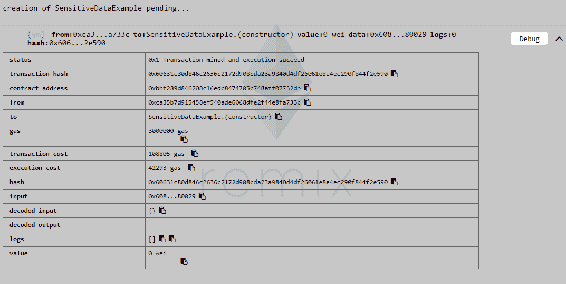
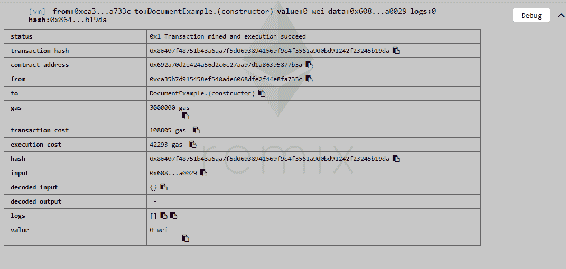
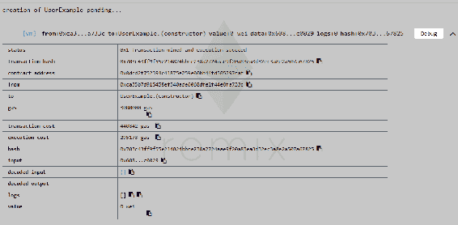

# 在区块链上签署法律文件和身份验证

区块链的广泛使用使得有必要专门讨论这个主题。区块链的多功能性诱使用户尝试在我们生活的各个领域实施它们。虽然有时可能看起来很繁琐，但在网络上访问这些分类账以执行诸如交易或签署文件之类的活动，使其成为一种可以在没有实际付出太多努力的情况下传达数据的可行方法。然而，在一定程度上使用去中心化分类账来存储和处理数据是非常方便和安全的。

本章将专注于以下主题：

+   在区块链上存储用户身份和敏感数据

+   在区块链上处理大文件

+   区块链上的用户身份验证

+   在区块链上签署文件

与其他章节相比，本章更多的是理论性的，因为它很大程度上取决于我们选择工作的后端技术。

# 用户身份和区块链上的敏感数据

让我们从讨论用户身份的主要方面开始——用于验证的参数。我们可以通过使用人的电子邮件地址、电话号码，甚至物理地址来实现这一点。也许有人会想知道我们如何做到这一点。实际上，在区块链上非常容易验证上述任何参数。为此，我们可以使用确认代码。用户可以将此确认代码与他/她的以太坊账户相连，进而将其与他/她的私钥相连。作为管理员，您必须确保不是您生成此代码。这将赋予您随意制造用户的权力。您希望您的用户是真实和经过验证的人，以消除您的区块链中的不可信元素。我们可以使用Twilio或任何外部服务提供商来生成这些代码。Twilio广泛用于短信验证，包括电话验证。

现在让我们考虑如何处理无法存储在公共区块链上的敏感数据的情况。您可能会自言自语：*有私有区块链*。我知道，我知道。但是现在，假设所有的区块链都是公共区块链。您不能在该特定区块链上存储诸如您的姓名、电话号码或电子邮件地址之类的敏感数据。这将是一个严重的隐私问题。成功的区块链需要真实的证据来证明存储在其中的数据是无法篡改的。这涉及不将整个区块链存储在中央服务器上。为了解决这个问题，我们将求助于散列和使用我们的后端存储，包括MySQL或Oracle。

# 哈希

哈希是一种将大字符串值转换为小的固定长度值的方法。它用于索引的目的。搜索字符串与搜索值相比是困难的。哈希不仅使索引变得更容易，还会影响到任何字符串的搜索时间。它减少了搜索时间，因为找到一个短值比原始字符串值要容易得多，也更有效率。

要学习如何执行哈希操作，你将首先对一些用户信息进行哈希处理，并将其存储在你的智能合约中，从而允许你将一个匿名的区块链身份与现实生活中的身份关联起来。

为了使这个工作正常，你需要鼓励用户为你的应用程序创建一个新的以太坊账户。这将在他们在应用程序外部使用此账户时为他们提供匿名性。

使用私有区块链也是一个解决方案。这种方法的缺点超过了它的优点。其中两个缺点涉及数据篡改和数据审查。然而，只有当区块链由你控制的实体托管时，这些问题才会成为问题。找到解决这些问题的方法是目前银行感兴趣的内容。假设我们有银行A、B和C。这三家银行已经联合起来使用一个单一的私有区块链，而不管它们之间是否竞争。这导致它们制定了内部安全措施，使任何人都无法操纵数据。

要更好地理解这一点，让我们看一个例子，涉及到我们验证用户身份。这始于用户访问你的应用程序并生成一个新的地址和一个新的私钥。他也可以使用MetaMask、Geth或任何其他提供者来执行此操作。后端系统将通知智能合约有一个新的未经验证的用户，并且第三方应用程序，比如Twilio，将发送一个验证代码。在这一点上，即使你是管理员，你也无法看到代码。这样做可以防止任何管理团队成员凭空捏造用户的可能性。一旦代码被输入，它将传递给智能合约。

```
pragma solidity ^0.4.17;

contract SensitiveDataExample {

  bytes32[] userHashes;

  // The backend would take a user-object. For example a simple JSON
  // {name: "Kenny", familyName: "Vaneetvelde", address: "Some Address 123"}
  // After hashing this entire object, you can pass it to the function below.
  // Later, you can re-hash it, to verify the user and data if/when needed.
  function addUser(bytes32 userHash) {
    userHashes.push(userHash);
  }

}
```

上述代码是一个JSON文件，它将向我们展示如何使用哈希来保护敏感数据：



在remix.org上的SensitiveData.sol文件及其输出

这里的数据被哈希处理，然后传递给`addUser`函数。这将允许数据保留在你自己的数据库中。

如果你试图以邪恶的管理员身份操纵数据，那么你的哈希值就不会正确。一旦哈希值传递给`addUser`函数，`addUser`函数将把`userHash`推送到`userHashes`字节数组的顶部。

# 处理区块链上的文件和大型数据

在本节中，我们将学习如何处理任何区块链上的大文件和文档。如之前多次提到的，区块链通常是公开的，因此隐私和安全应处于首要位置。区块链包含填入其中的所有数据，这在以太坊的情况下会导致成本增加，即每次交易都需要支付更多的gas。由于这不是我们想要的，我们将使用一些变通方法。

这些变通方法之一是**Swarm**。还有IPFS，即星际文件系统，在[第1章](464e368c-3ee6-4f15-bc1c-629d705acd1c.xhtml)，*工作流设置和区块链思考*中我们简要介绍了。您还可以使用自己的服务器来存储数据和更大的文件。

Swarm和IPFS并不是区块链，但它们遵循去中心化的共同原则，使它们成为不易篡改的分布式文件存储系统。

一开始文件并不是去中心化的。当通过IPFS上传文件时，您成为该文件的第一个独立主机。当其他人下载或请求相同的文件时，他们也成为主机，其余网络也会有主机的参考。对点之间的连接关系允许一个人通过重定向到正确的位置/人来下载或查询文件。

由于Swarm和IPFS还没有完全开发，您可以选择使用自己的系统和一些哈希。您可以从后端开始制作SHA哈希文件，并将此文件存储在区块链中。在不更改哈希的情况下，将无法编辑此文件，从而使哈希失效。

无论何种情况，如果用户想要验证其合同，他们只需重新对文件进行哈希处理以与原始哈希进行比较。这可以作为确保其合同未被篡改的保证。

让我们看一下以下代码示例，以帮助我们更深入地理解哈希的概念：

```
pragma solidity ^0.4.17;

contract DocumentExample {

  bytes32[] documentHashes;

  function addDocument(bytes32 documentHash) {
    documentHashes.push(documentHash);
  }

}
```

remix中前述代码的输出：



在上图中，我们已经对整个文档进行了哈希处理，并且我们还将通过调用`addDocument`函数将该哈希添加到智能合约或区块链中，该函数将传递哈希并将其推送到数组。

# 使用区块链进行用户身份验证

本节着重介绍用户验证过程和背后的Solidity代码。让我们考虑以下Solidity代码：

```
pragma solidity ^0.4.17;
contract UserExample {

 mapping(address => bool) user_verified;
 mapping(address => bytes32) user_codes;

 mapping(bytes32 => address) to_sign;
 mapping(bytes32 => bool) signed;

 address owner;

 modifier onlyOwner() {
 require(msg.sender == owner);
 _;
 }

 function UserExample() public {
 owner = msg.sender;
 }

function addUser(address user, bytes32 hashed_verification) public onlyOwner {
 user_verified[user] = false;
 user_codes[user] = hashed_verification;
 }

 function verify(bytes32 verification_code) public {
 if (user_verified[msg.sender] == false && 
 sha256(verification_code) == user_codes[msg.sender]) {
 user_verified[msg.sender] = true;
 }
 }
}
```

正如您所看到的，所有者是您自己的服务器。构造函数将所有者的值定义为`message.sender`，其中包含部署智能合约的人的地址。

代码经历以下步骤：

1.  用户访问您的应用程序。

1.  相同的用户输入了一些私人详细信息。

1.  详细信息以哈希的形式存储在所选智能合约中。

1.  Twilio或第三方服务提供商将向用户发送短信，同时系统调用名为`add.User`的Solidity函数。

1.  `add.User`函数传递两个参数，即`address user`和`hashed_verification`，后者是一个32字节的数组，其中包含您发送给用户的代码的哈希值。该函数只能由所有者或修改者调用，在本例中是您或您的服务器。

1.  合同构造函数包括一个布尔值，该布尔值存储了由`add.User`函数中的`user_verified`映射的地址。这个布尔值默认为`false`值。

1.  `user_codes`将`hashed_verification`映射到一个32字节的数组。

1.  用户在前端输入代码。

1.  `verify`函数然后通过比较用户提供的验证代码的哈希与管理员在`add.User`函数中发送的哈希来检查用户是否经过验证。

您不要在JavaScript中对验证代码进行哈希处理，以备将来进行验证，因为第三方可以直接拿取该代码，对其进行哈希处理并进行检查。

1.  一旦用户通过验证，布尔值的默认值就会从`false`更改为`true`。

1.  用户经过验证后，验证代码将存储在区块链上的明文中。

# 在区块链上签署文件

本节将教您如何在区块链上签署文件，比如合同。让我们考虑以下代码以了解如何完成这项工作：

```
pragma solidity ^0.4.17;
contract UserExample {

 mapping(address => bool) user_verified;
 mapping(address => bytes32) user_codes;

 mapping(bytes32 => address) to_sign;
 mapping(bytes32 => bool) signed;

 address owner;

 modifier onlyOwner() {
 require(msg.sender == owner);
 _;
 }

 function UserExample() public {
 owner = msg.sender;
 }

 function inviteUser(bytes32 documentHash, address user) public onlyOwner {
 to_sign[documentHash] = user;
 }

 function signDocument(bytes32 documentHash) public {
 if (msg.sender != to_sign[documentHash]) {
 revert();
 }
 signed[documentHash] = true;
 }
function addUser(address user, bytes32 hashed_verification) public onlyOwner {
 user_verified[user] = false;
 user_codes[user] = hashed_verification;
 }

 function verify(bytes32 verification_code) public {
 if (user_verified[msg.sender] == false && 
 sha256(verification_code) == user_codes[msg.sender]) {
 user_verified[msg.sender] = true;
 }
 }
}
```

以下截图是remix-Solidity框架中前述代码的结果：



remix中UserExample.sol文件的输出

这段代码允许您将用户添加到您的区块链中。它还允许您邀请用户签署文件。由于该代码类似于我们在上一节中使用的代码，标题为*使用区块链进行用户身份验证*，因此我们只会关注我们对代码做出的修改，以适应额外的功能——即允许用户签署合同。

如果我们仔细查看代码，我们会注意到有两个新的参数映射。其中一个将32字节的数组(`bytes32`)映射到一个用户的地址，而另一个将32字节的数组(`bytes32`)映射到一个名为`signed`的布尔值。

`Structs`也可以用来映射变量。

合同部署后，您可以上传文件，对其进行哈希处理，然后将其添加到区块链中。完成这些步骤后，您可以邀请用户。邀请用户会导致用户被添加到`to_sign`映射中的`documentHash`。让我们假设我们有如下代码：

```
//to_sign[0x121212121212] = 0x121212133293928
```

在这里，`0x121212121212`是哈希值，`0x121212133293928`是你的用户。然后你可以通过包含一个指向该文件的链接的电子邮件通知用户关于他的邀请。用户可以使用这个链接来查看和验证这份文件。用户端的验证过程需要他们对文件进行哈希，并将其与提供给他们的哈希进行比较。如果用户想要深入进行验证，他们可以在区块链上查找这个哈希。之后，用户可以调用`signDocument`函数。

要理解`signDocument`函数是如何工作的，让我们假设你想要签署`0x1212`哈希的文件。你应该首先调用该函数，第一个参数是用户。首先，它将检查你的地址是否与受邀用户的地址不同。如果是的话，你的交易将被取消，并使用`revert`函数，在这段代码中是`null`。如果这两个地址匹配，我们可以简单地继续签署文件。

这是我喜欢区块链的原因之一。人们可以通过将变量设置为`true`来简单地签署一份文件。一旦这个变量被设置为`true`，你就可以将这份文件视为已签署。如果这在法庭上作为证据，文件应该有效，因为它已经用私钥签署了。这使得这个人签署了合同是毋庸置疑的。

# 总结

这一章带我们学习了如何在区块链上处理大型数据文件的旅程。考虑到数据敏感性是当前世界发展中必不可少的概念，我们学习了一些简单的方法来实现区块链的安全性。然后，我们了解了在区块链上通过第三方验证真实世界用户身份的过程，并学习了如何借助区块链签署文件。

下一章将教我们在浏览器之外使用以太坊所需的基本概念和方法，以及它如何作为物联网的支撑。我们还将快速浏览组成区块链的物理组件。
