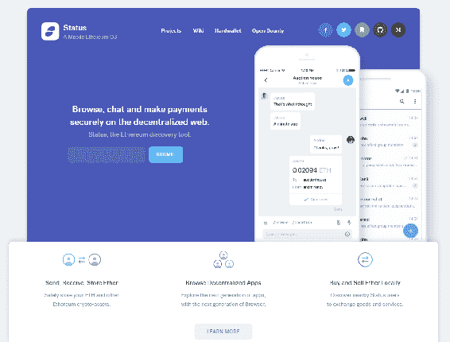
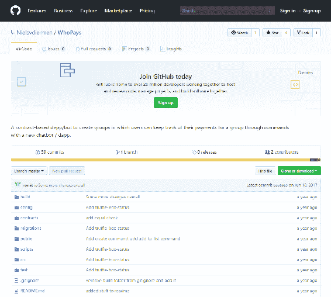
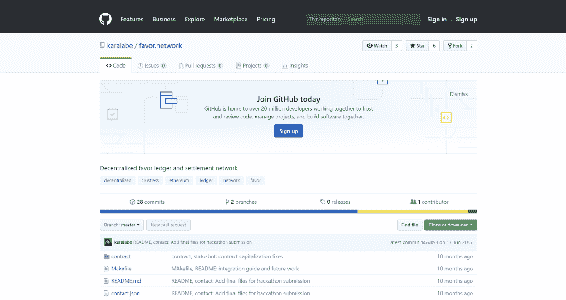
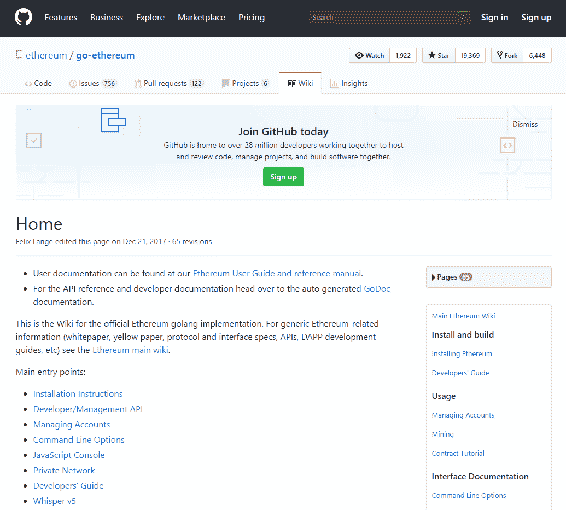

# 第五章：以太坊在 PC/Web 环境之外

到目前为止，我们已经了解了如何在个人电脑上使用以太坊。本章将介绍以太坊在各种其他应用程序中的用途：智能手机是其中最常用的电子设备之一。当前技术的增长要求我们实现需要自动系统的物联网。本章重点讨论以下主题：

+   以太坊在浏览器之外

+   以太坊和物联网

+   以太坊和智能手机应用程序

+   进一步的步骤和资源

我们将看一下人们如何在浏览器之外使用以太坊，人们如何将以太坊作为物联网的支柱，以及你如何在区块链中使用物理组件。此外，我们还将看一下你如何在智能手机应用程序中使用以太坊。我们还将讨论一些进一步的步骤和资源，供你使用。所以让我们开始看一下如何在浏览器之外使用以太坊。

# 以太坊在浏览器之外

本节将教我们如何在浏览器之外使用以太坊。以太坊团队已经开发了可以在 Java、Python、Go 或.NET 上使用的标准库。这些库可以直接从 GitHub（[`github.com/ethereum`](https://github.com/ethereum)）访问。

要在浏览器之外使用以太坊，你需要的一个必要功能是与以太坊网络建立连接。这种连接可以是直接的——即直接连接到你的应用程序——或者你可以使用一个中继服务器。虽然使用中继服务器并不是最佳选择，但完全可行。要使用中继服务器，你首先需要拥有一个自己的服务器，它是集中式的，并且只接受预签名的交易。

在浏览器之外使用以太坊所必需的另一个要求是你将用于开发它的语言的以太坊库。这是可选的，因为我们始终从原始数据开始任何交易。要让以太坊网络上的交易进行下去，我们需要对原始数据进行编码并分配一个私钥。交易受私钥签名保护，因此受到修改的限制。之后，你可以将其发送到网络上。这可以通过中继服务器完成。这涉及到一些选择性的静音，因此，确保你自己发送交易到网络上是更可靠的选择。根据你使用的软件，可以使用以下链接来完成这一操作：

+   如果你是 Python 用户，可以使用`Web3.py`库。它可以在[`github.com/ethereum/web3.py`](https://github.com/ethereum/web3.py)免费获取。

+   如果你是 Java 的忠实用户，Java 库可以在 Web3J 的 GitHub 账户上找到，网址为 [`github.com/web3j/web3j`](https://github.com/web3j/web3j)。

对于任何其他实施，您可以在以太坊 GitHub 帐户下找到库，网址为[`github.com/ethereum/`](https://github.com/ethereum/)。Golem 是一个很好的例子，它在浏览器之外使用以太坊。我们在第一章已经看过这个了。Golem 在链下计算，但在链上验证完成的所有计算。这使得大量分布式计算能力成为可能。要获取更多信息，您可以参考 Golem Github 页面，并查看存储库中的代码，网址为[`github.com/golemfactory/golem`](https://github.com/golemfactory/golem)。

# 以太坊和物联网

在本部分，我们将看一下以太坊以及它如何帮助传播物联网。在我个人看来，以太坊是物联网的完美支撑系统。这是因为两个因素：数据流和安全。数据分布在整个网络中，这是物联网最基本的概念；这种畅通无阻的数据流是使用以太坊来帮助建立物联网的关键因素。此外，每个设备都有自己的私钥，这增强了安全因素。这两个元素的结合带来了许多新的可能性。

让我们看一个涉及电动车充电的案例研究。目前，电动车或充电站并不多。未来很有可能所有车辆都将使用电力。这意味着会在更多地点设置更多的充电站。让我们考虑一个在超市设置充电站的情况。为了提供这项设施是不可行的。为了使这个过程更容易，车辆可以直接支付服务费。该如何做到这点呢？

必须要有两个智能电表，每个都有自己的私钥。一个在充电站，另一个在车上。车辆的所有者/用户需要将一些以太币添加到与车辆私钥相关联的地址上。当车辆在充电站请求电力时，这将被添加到负责此交易的智能合约中。充电站的智能电表将跟踪车辆消耗的电量，并相应地扣费。这里的金额将直接支付。充电站的所有者随后会根据需要撤回以太币。

尽管目前整个场景都是假设的，但有一些特殊的考虑。由于每辆汽车和每个充电站都需要一台计算机，因为它们各自都需要有私钥。同时还需要一个工作中的互联网连接和一些防篡改的智能电表。一旦数据进入区块链，任何人都无法篡改它，因为这些数据都是公开记录的一部分。即使防篡改的智能电表存在漏洞，它也会公开展示出来。避免欺诈的另一种方式是向相关机构注册车辆的私钥。

# 以太坊和智能手机应用程序

您可以通过三种方式制作支持以太坊的智能手机应用程序：

+   使用 DApp 浏览器。

+   使用 Android 或 iOS 库。

+   从密钥生成到密钥安全以及其中的所有操作，都使用 JavaScript 完成。但是，不建议这样做，因为这会使您非常脆弱。

# 使用 DApp 浏览器

一种类型的 DApp 浏览器是 Toshi。它将允许您使用集中式应用程序，并且您可以以几乎与您在移动设备上使用 MetaMask 相同的方式使用它。另一个更受欢迎的选项是 [Status.IM](https://status.im/)。它实际上是一个安全聊天，但也是一个聊天机器人。您可以给它命令，例如检索浏览器位置，如以下屏幕截图所示，如果您给它这样的命令，那么您可以触发智能合约内部的函数：

Status.IM 主页

使用此方法开发了一些应用程序。其中一款应用程序是 WhoPays。这是一个基于合同的机器人，可以创建用户可以通过新的聊天机器人使用命令跟踪他们向群组支付的款项。这意味着您可以使用聊天命令设置组。假设您为三个人购买了杂货，并且您支付了所有费用。其他人必须向您支付。您可以设置此安排，他们可以同意一笔金额，并使用应用程序向您支付。以下屏幕截图显示了 WhoPays GitHub 页面，网址为 [`github.com/Nielsvdiermen/WhoPays`](https://github.com/Nielsvdiermen/WhoPays)：

WhoPays

另一个例子是 [favor.network](https://github.com/karalabe/favor.network)。在这里，您可以向人们请求帮助，并支付他们来完成这些帮助：

Favor.network

这些应用程序要么赢得了[Status.IM](https://status.im/)黑客马拉松的奖项，要么排名非常靠前。我强烈建议您查看这些应用程序并使用它们来学习如何与 [Status.IM](https://status.im/) 一起工作。

# 使用 Android 或 iOS 库

在 2016 年 12 月，以太坊发布了一个也可以在移动平台上运行的桌面客户端版本，因此您只需将这些库导入到您的 Android 应用程序或 iOS 应用程序中，并以与在桌面上使用它相同的方式使用以太坊。

以下屏幕截图显示了 [go-ethereum GitHub 仓库](https://github.com/ethereum/go-ethereum/wiki/Building-Ethereum)：

Go-Ethereum GitHub 仓库

# 进一步的步骤和资源

我想提一下 Infura。Infura 基本上是以太坊和 IPFS 网络的中继服务器，你不必自己管理，这使得它再次变得不可信任。只要还有人没有运行自己的以太坊节点，它就会存在。访问 [www.infura.io](http://www.infura.io) 了解更多信息。当然，强烈建议你运行自己的节点，但如果你不能的话，可以看看 Infura。你可以远程发送交易到这个服务器，它们将把它们传播到网络中。

另一个你可以查看的资源是以太坊的 GitHub 页面，我们之前已经提到过。在这里，你可以找到所有的项目，比如以太坊改进协议、remix 和黄皮书，其中包含了以太坊的所有技术规范。你可以了解关于 Solidity 编程语言和已构建的不同客户端的一切。你可以调整这些客户端，然后在你自己的项目中使用它们来连接以太坊网络。所以只要去看一看吧！

另一个信息来源是以太坊 Subreddit，你可以在 [www.reddit.com/r/ethereum/](http://www.reddit.com/r/ethereum/) 找到它。你可以在这里找到很多信息和很多新闻；如果你想要保持更新，这是一个值得你关注的地方。

另一个资源是 CoinDesk，你可以在 [www.coindesk.com](http://www.coindesk.com) 找到它。你可能已经知道这个，但这里有很多关于以太坊和区块链的新闻。

Consensys 是一家公司，你可以在 [`new.consensys.net/`](https://new.consensys.net/) 找到它。他们几乎从以太坊创立之初就一直在利用以太坊，他们有很多正在进行中的项目。他们与许多非常大的公司合作，例如微软。他们几乎致力于使以太坊适用于企业。

最后但并非最不重要的是，请务必查看 State Of The DApps，你可以在 [www.stateofthedapps.com](http://www.stateofthedapps.com) 找到它。在这里，你可以找到很多已经制作的应用程序。你可以对它们进行分类，并查看它们是否有任何原型，或者可能有一些正在运行的应用程序。几乎所有这些应用程序都是开源的。这绝对是你最大的资源，因为有什么比从现有的应用程序中学习更好的方式呢？所以，如果你查看这些，我相信你很快就会完全掌握以太坊。

# 摘要

在本章中，我们了解了以太坊是如何在浏览器之外运行的。我们学习了以太坊如何用于各种物联网应用。然后，我们继续看到以太坊如何在安卓和 iOS 智能手机设备上使用各种方法实现。接着，您将获得一些链接到各种资源，这些资源可以帮助您掌握以太坊。在本书中，我们几乎涵盖了您构建、使用和部署自己的以太坊代币所需的一切，并为您提供了有关利用这些以太坊知识构建哪些应用的额外见解。
