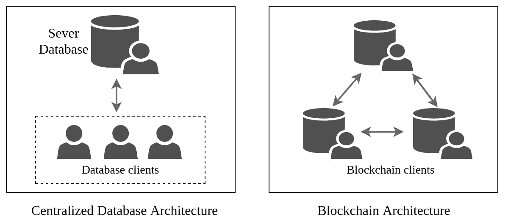
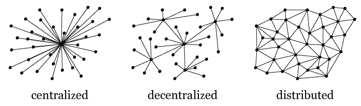
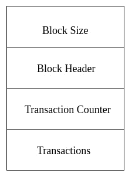
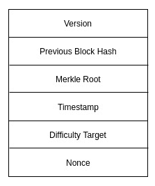
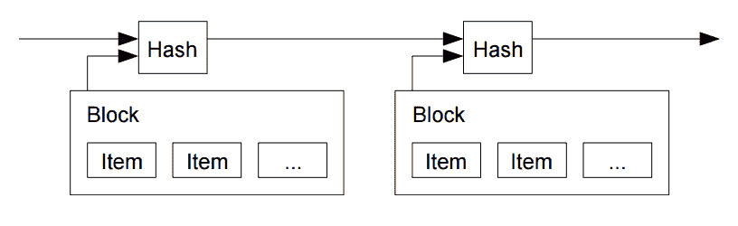
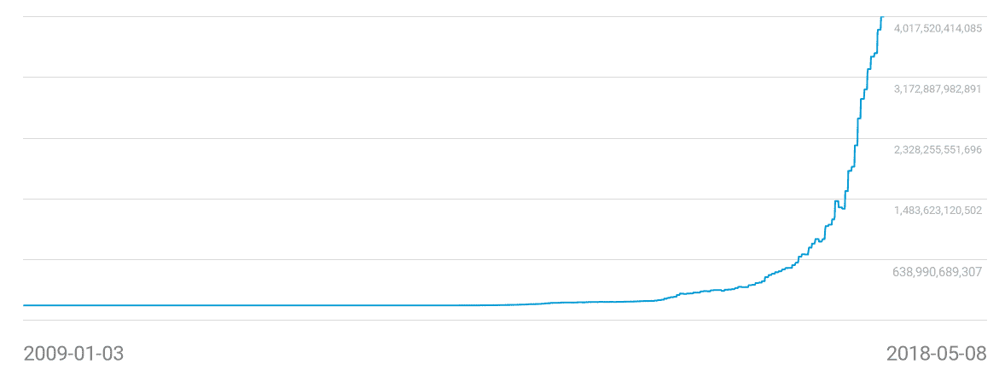

# 介绍

本书旨在帮助您探索令人兴奋的区块链技术，在本书的第一章中，我们将深入探讨其基本概念。 我们的目的是提供对区块链的相当广泛的概述，使您能够充分准备好我们将在后面章节更深入讨论的主题。 由于我们的意图是介绍区块链，因此以下主题将贯穿本章：

+   区块链的是与否

+   区块链与数据库的不同之处

+   区块链的历史、动机和特点

+   不同类型的区块链

+   区块及其工作原理概述

+   [摩尔定律对区块链技术的影响](https://wiki.example.org/moores_law_and_blockchain_technology)

我们将从区块链的基础知识开始，包括其神话和历史。 我们将探讨一些关键区块链概念背后的思想，最后，我们将概述区块链技术的工作原理。 本章的主题旨在为您提供足够的动力和信心，以便您对我们将在本书后面讨论的主题感到自信和舒适。

# 区块链是什么

尽管区块链有各种定义，但最好将区块链描述为一个由区块链结构组成的数据结构，这些结构链接在一起形成一个称为分类帐的记录集，其中密码学是该过程的关键因素。 区块链没有存储机制；相反，它有一组规定信息生成方式的协议。 因此，区块链可以存储在平面文件中或数据库中。

区块链技术之所以受到欢迎，是因为其完整性不容易被破坏。 一个被破坏的区块链可以被识别出来，而且很容易被网络中的任何人拒绝。 这种完整性是通过密码学实现的，这就是将区块绑在一起的东西； 我们将在第二章中研究这个密码学的概念，*密码学简介*。

区块链承诺提供如此强大的完整性，最终为在不受信任的**点对点**（**P2P**）网络中共享数据链的想法铺平了道路。对区块链中的块进行验证是确保区块链具有全局有效状态并可被所有人接受的关键。由于区块链能够在没有任何中央机构管理的开放 P2P 网络中共享信息，因此该技术可以有许多不同的应用；然而，该技术不能立即在这些应用中部署而不经任何故障排除。尽管区块链技术从一开始就在应用去中心化应用方面发挥了重要作用，但它在应用于无信任环境时仍面临着几个挑战。其中最大的挑战之一是保持区块链在 P2P 网络的所有参与者之间的一致性。这个问题通过创建共识算法来解决，该算法同意如何在不受信任的环境中添加块以扩展链。

*区块链*这个术语实际上涵盖了许多概念，包括 P2P 网络管理、共识机制等等，所有这些都有助于创建去中心化应用。

# 区块链不是什么

正如我们刚刚讨论的那样，尽管区块链因其基于密码学的安全性、去中心化性质和几乎不可变的数据存储机制而引人入胜，但了解其局限性也非常重要。

区块链的理想实现是在原子事件或交易中，事件的最少信息被存储为一个交易；这些交易可以被组合在一个单一的块中并添加到区块链中。尽管区块链网络在处理全局状态方面表现良好，但在批量存储数据时，它不会增加太多价值，因为会存在可伸缩性问题。了解何时最好应用区块链技术来开发应用程序非常重要。我们将在第十一章中探讨何时不应该使用区块链。

# 区块链定义

你可能还记得我们在本章一开始就指出了对于*区块链*一词有几种不同的定义。在我们继续之前，让我们看看这个词的几种定义：

"区块链是由共识锻造的点对点分布式分类帐，结合了“智能合约”和其他辅助技术的系统。"

- hyperledger.org

"区块链是分布式分类帐技术的一种特定形式或子集，它构建了一个块的时间顺序链，因此被称为“块链”。"

- 安东尼·刘易斯，R3 研究总监

"区块链数据结构是一种有序的、反向链接的块列表。"

- 安德烈亚斯·安东诺普洛斯，一位知名的比特币传道者

# 区块链与数据库有何不同？

区块链是一种只读和追加的存储方法。这意味着区块链分类账中的块只能被创建和读取。区块链中的块不能被更新或删除；块只能追加到区块链的末尾。公共区块链没有访问控制，因为它对读写操作都是开放的。

另一方面，关系型数据库遵循**创建，读取，更新和删除**（**CRUD**）操作模型。与区块链不同，每个数据库在创建时都有一个管理员，他们将为其他用户分配访问控制。关系型数据库大多由一个实体维护，该实体控制所有应用程序数据，而区块链技术是为了去中心化应用而设计的。

*图 1.1*应该能帮助你形象地展示集中式数据库架构和区块链架构之间的区别：

图 1.1：显示集中式数据库与区块链架构的图示。

注意：区块链本身提供**不可变性**、**安全性**和**冗余性**（**ISR**），而传统数据库需要额外的投资来为它们保存的数据提供 ISR。基于区块链的解决方案相对于数据库的主要优势之一是几乎不需要投资于基础设施管理。

# 区块链的历史

我们知道，区块链技术现在主要应用于去中心化网络中的交易或事件追踪；当前，这种用例的最大范围是在金融领域。然而，事实上，区块链技术直到最近才以我们今天知道和使用的形式出现。最早的构建数字文档的防篡改时间戳的链条概念是在 1991 年提出的。但这个概念直到 2008 年，一个使用**Satoshi Nakamoto**假名的作者发表了一篇名为*比特币：点对点电子现金系统*的论文（[`bitcoin.org/bitcoin.pdf`](https://bitcoin.org/bitcoin.pdf)），展示了区块链及其在去中心化网络中的真正用途时，才为人熟知。

后来，在 2009 年，Satoshi Nakamoto 创建了区块链技术的一个参考实现，称为比特币。这是第一个也是目前最流行的基于区块链的电子现金系统实现。Satoshi 从之前的一些发明中获得了灵感，如 b-money 和 Hashcash，以创建一个去中心化的数字货币。

注意：尽管比特币是加密货币革命的始作俑者，但在它之前，有几次尝试使用密码协议普及电子现金。DigiCash 是美国科学家戴维·朝早期的一次尝试。还有一种分布式数字货币叫做 Bit Gold，由尼克·萨博提出，其架构与比特币类似。

比特币于 2009 年发布，当时中本聪进行了第一笔交易，该交易被插入到比特币区块链的第一个区块中。这个区块被称为创世区块，是整个区块链的合法性证明。中本聪于 2011 年停止了对比特币项目的贡献，现在允许开放社区为该项目做贡献。自那时起，它已经从一个相当简单的数字货币发展成为一个具有韧性的协议，已经成为每个区块链应用程序的参考实现。尽管比特币的市值波动很大，但截至 2018 年底，它已接近 2000 亿美元的市值，几乎占据了整个加密货币市场的一半。

比特币是第一个去中心化数字货币，解决了双花攻击的问题。保持一个开放的分布式区块链，并通过共识验证区块的有效性，是使比特币成为实际可实施的去中心化货币的主要因素。比特币利用一种称为**工作证明**（**PoW**）算法的共识算法来证明节点确实在创建区块链的新区块时进行了工作。这个概念也被应用在一个叫做 Hashcash 的实现中，它旨在通过强制垃圾邮件发送者在发送每封电子邮件之前做一些工作来限制电子邮件垃圾邮件。这个系统防止了垃圾邮件发送者批量发送电子邮件，因为在发送每封电子邮件之前需要进行计算任务。接收者所需要做的就是验证发送者所做的工作。同样，比特币中实现的 PoW 共识算法防止了任何节点用自己创建的区块淹没区块链，从而防止任何单一实体主导区块链。

# 区块链 2.0

比特币真正催生了区块链技术，此后，出现了几种新的分布式区块链数据库的应用，最显著的是在 2014 年初。这个时代被广泛称为区块链 2.0 时代。Namecoin 是最早出现的概念之一。它扩展了比特币的区块链范围，并被引入为基于比特币的分布式命名系统。然而，与比特币不同的是，它能够在公共区块链中将数据存储为键值对。这个概念影响了许多后来获得流行的区块链 2.0 应用程序。

区块链 2.0 带来的最受欢迎的增强功能之一是智能合约的引入。 开发了几个区块链平台，允许用户编写更高级别的脚本，并不必担心实际的区块链实现。 其中一个在这方面最成功的平台是以太坊，由 Vitalik Buterin 于 2013 年底提出。 以太坊的初衷是充分利用比特币使用的技术。 比特币的初始实现旨在用于数字货币的流动。 现在，虽然已经为其他应用程序（如资产转移）实现了一种脚本语言，但它非常原始，并且只有少数用例。 以太坊的联合创始人 Vitalik Buterin 建议，比特币需要一种用于去中心化应用程序开发的脚本语言，以扩大其范围。 未能达成协议，Vitalik 提议开发一种具有更通用脚本语言的新平台。 由于在其环境中实现了智能合约，该平台以太坊变得受欢迎。 智能合约是在**以太坊虚拟机**（**EVM**）上运行的高级脚本。 已经使用以太坊平台开发了许多去中心化应用程序。

以太坊平台激发了开发人员提出一个框架，该框架将使用比特币的核心协议并构建一个开发去中心化应用程序的平台。 这是一种革命性的方法，因为该技术将被用于修改任何需要第三方的应用程序，这既费钱又多余。

实际上，有很多动机促使开发人员在现有应用程序中集成区块链技术。 在下一节中，我们将更深入地解释这一点。

创建了几个区块链平台，用于构建可扩展的去中心化应用程序；以下是一些最受欢迎的平台：

+   **Corda**：这是一个旨在记录、管理和自动化商业合作伙伴之间法律协议的分布式账本平台。 它由 R3 与全球最大的金融机构合作设计，这使 Corda 适用于转向分布式账本技术的金融企业。

+   **Hyperledger**：这是一个推动跨行业区块链技术进步的开源努力。 它由 Linux 基金会托管，并实现了各种行业和组织之间的合作。 例如，IBM 和英特尔是 Hyperledger 项目的积极贡献者。 有许多 Hyperledger 项目，旨在使用区块链解决不同的企业级问题。

+   **Multichain**：这是一个简单而强大的与比特币兼容的私有区块链框架。 它支持完整的资产周期管理。 由于支持访问控制，它是开发权限区块链应用程序的理想框架。

+   **NEO**：以前被称为 Antshares，这个应用程序经常被称为“中国的以太坊”。它使用区块链技术和数字身份来数字化资产。

# 区块链背后的动机

每一次新的创新都是试图解决问题的结果。区块链技术也不例外。通过了解区块链技术的演变，很明显它的出现是因为需要解决现有经济中不确定性的必然性。

不确定性永远无法被消除，但只能降低：总会有机构充当第三方立法者，以降低不确定性或缺乏信任，每当需要协议达成时。一个典型的例子就是在 eBay 上购买物品。你总是需要尽可能多的确定性关于这笔交易。一方期望公平的商品，另一方期望约定的款项。现在，尽管买方和卖方没有理由相互信任，他们仍然完成交易，因为他们信任 eBay 这第三方，eBay 向他们保证交易合法。再次，有必要信任这些“中介”机构。信任一个机构需要大量的研究和知识。区块链承诺通过以分散和安全的方式实现应用程序，确保一定程度的确定性来克服这些问题。这是区块链在无需信任的社会中被广泛采用的主要原因之一。

我们知道区块链是在无需信任环境中实施的理想技术。但单单区块链并不是完整实施成功的唯一原因。它还受到其他几个协议的帮助，使得它成为强大和有韧性的技术。区块链之所以能够在无需信任的网络中实施，主要是由于在密集的 P2P 网络中计算的分散化以及对整个区块链的安全和公开分布式账本的维护，这使得整个区块链具有完全的透明性。P2P 协议确保每个节点均持有区块链的最新状态。

区块链技术背后的关键动机是去中心化的需求，而去中心化是通过将计算任务分配给区块链网络的所有节点来实现的。去中心化解决了传统系统的几个问题；单点故障就是其中之一。例如，在银行这样的集中式系统中，用户总是与同一个第三方银行通信以获取其账户详细信息。尽管这种交易几乎每次都可能成功，但不能保证 100%的正常运行时间，因为该服务器是集中式的，并且只有几个备份服务器用于负载平衡。可能会出现所有服务器都被请求淹没，导致崩溃和服务器关闭的情况。即使在设计完美的服务器中，这种停机也是不可避免的。如果在去中心化网络中面临同样的情况，这不会是一个问题，因为所有交易数据都分布在所有节点之间，这意味着每个节点在故障时都可以充当备份节点，保持数据的完整性（基于区块链解决方案的另一个关键优势）。这是通过维护分布式账本的区块链数据来实现的。区块链的不可变性是信任区块链完整性的关键因素，它确保了账本的完整性，并且对所有节点公开可访问。

# 区块链的特性

简单来说，区块链是一系列通过加密相互保护的块。密码哈希指针被用作公共账本中区块链中每个块的引用。虽然这听起来非常安全，因为没有入侵者能够破解区块链并插入他们自己的块版本，但它并不是完全安全的。由于账本是完全透明和公开的，任何节点都可以插入自己的块以复制整个区块链并创建自己的版本。最终，他们可以将块传播到网络中的每个节点，并证明他们的区块链是合法的。这表明，仅通过连接所有块并形成安全账本是无法实现不可变性的。实现不可变性需要通过某种去中心化的经济机制来辅助，使每个网络节点都有公平的机会对块创建进行投票，并且一旦附加后，重新构建块也变得更加困难。

中本聪对这个问题提出的解决方案是比特币在去中心化环境中可以实现的唯一原因。比特币使用的 PoW 共识算法是第一个 – 也是迄今为止最为人所知的 – 解决方案。它向公共分类账承诺了很高程度的不可变性，并在一个无信任的网络中保护它。在加密货币方面，执行 PoW 的节点被称为**挖矿节点**。顾名思义，挖矿是指锻造新区块以追加到区块链中。挖矿所需的工作量确保了区块链的不可变性，并且几乎不可能篡改任何过去的交易。

这是因为任何想要篡改过去数据的节点都应该能够通过提供 PoW 并与所有其他挖矿节点竞争来重建所有区块。这几乎是不可能的，除非问题节点拥有网络中大多数计算能力，这种情况下，攻击者有机会击败所有节点。这就是为什么比特币的共识算法被广泛用于公共区块链应用以实现更高的记录不可变性。

然而，不可变性并不是区块链技术展现的唯一特征。由于区块链的去中心化性质，区块链中的每一笔交易都会在网络的所有节点上复制。信息的复制为区块链提供了更大的**韧性**。复制的交易必须由每个节点验证才能达成共识。这确保了交易是公开可见的，并且所有的区块链数据对网络是**透明**的。区块链提供的透明性对某些用例可能是一种福音，但对其他用例可能是一种诅咒。这就是为什么区块链的变体被创建的原因，正如本章后面描述的那样。

区块链的所有这些特征使其成为完美的公共分类账，或者说是有效的**分布式分类账技术**（**DLT**）的一个典型实例。到目前为止，比特币的区块链以及其共识机制是最具韧性的 DLT。

# DLT 背景

自网络发明以来，人们一直在讨论计算机架构的集中化和去中心化问题。我们看到这两种计算机架构模型之间的兴趣随时间波动。企业使用大型机架构来容纳大量的计算能力、内存和存储。它们在很大程度上是集中化的，终端没有太多的计算能力，用于连接到这些机器以执行所需的操作。然后，个人计算机被引入到家庭中使用，具有足够的计算能力、内存和存储来执行基本操作。这催生了客户端-服务器架构，其中客户端与服务器通信以执行计算。服务器通常在分布式系统中执行大量计算，并将结果与客户端同步。

云计算架构提供了从任何计算设备轻松访问服务器的方式，因为架构本身是全球可访问的。然而，云计算架构是集中化的，其硬件资源是分布式的，对客户端不透明。云供应商和最终用户之间仍然存在信任缺乏。这就是我们目睹从其他计算模型向去中心化过渡的原因。DLT 是实现这一里程碑、开启去中心化时代的关键。

分布式分类账在其核心是一个复制和共享的数字数据库，分布在地理区域之间。为确保有效的分布式分类账，需要一个 P2P 网络和共识算法。区块链技术是实现分布式分类账的技术之一，但并非 DLT 的唯一数据结构：

图 1.2：计算机架构的演变，直至分布式分类账的诞生（来源：https://en.wikipedia.org）

背景：可以与 DLT 相比较的最早的事物可以追溯到公元 500 年，当时太平洋岛屿雅浦岛依赖一种称为莱的货币，这些石头的重量可能超过 200 公斤。由于这些石头非常沉重，因此每个岛上的成年人都会记住莱的所有权。口头所有权记录确保无需单一方维护谁拥有莱的记录。

# 不同类型的区块链

区块链的应用案例不断增加，人们对其局限性的认识也在增加，这导致了多种成功的区块链实现的出现。在本节中，我们将尝试掌握每一个实现的精髓。

# 公共区块链（无需许可）

由于其透明性以及每个节点参与促进区块链增长的方式，区块链概念已被广泛应用和改编。早期的区块链模型，即比特币的产物，完全是开放和无许可的，通常被称为公共区块链。公共区块链因其节点被公平对待的方式而受欢迎。

由于记录的不可变性，公共区块链在无信任网络中运行良好。比特币、以太坊以及一些继承了类似 PoW 的共识算法的其他项目确保记录的交易不可编辑。

公共区块链非常适合加密货币项目，记录的交易不应被修改。然而，如果不实施必要的改变，公共区块链往往会在某个时候面临可扩展性问题。比特币最明显的问题之一是其挖矿方法（PoW），挖矿所需的电费非常昂贵。区块的创建平均时间为 10 分钟。因此，挖矿的难度水平已经调整以维持这个时间。由于矿工之间的竞争，这导致了一个非常昂贵的 PoW 环境。由于这些复杂的属性，我们无法预测比特币或任何其他公共区块链的未来，只有技术的自然演进才能决定其命运。

鉴于这些利弊，无许可或公共区块链非常适用于透明的应用程序，其中区块链应从本质上保护系统，因为网络是不受信任的。

# 私有区块链（许可）

私有区块链主要是为了拓宽区块链技术的应用范围而引入的。许可区块链，顾名思义，采用了与公共区块链相反的方法。私有区块链主要出现是为了解决公共区块链中出现的一些问题，并使区块链技术可扩展。

许可区块链引入了访问控制，为网络中的参与者提供特定的访问权限。每个许可区块链都将有一个管理员，他为网络中的参与者分配角色。许可区块链确保恶意行为者不参与验证或区块创建过程，从而消除了对区块链的任何潜在攻击。涉及许可区块链的网络主要是一个值得信赖的网络。

私有区块链适用于只需要在内部共享账本的组织。许可区块链通常是可变的或者不严格不可变的，它们的交易可以通过一些努力进行修改；这与公共区块链形成了鲜明对比，公共区块链几乎不可能被修改。许可区块链仍然是去中心化的账本，但是在组织内部会有一些功能有限的节点，而公共区块链中的节点是公平对待的。

注：私有区块链不使用比特币的 PoW 共识算法作为它们的共识算法。事实上，私有区块链是为了消除公共区块链的昂贵共识方法而创建的，以使区块链技术适用于受信任的环境。

# 联盟区块链

联盟区块链是一种半中心化的混合区块链。它结合了无许可和有许可区块链的最佳特征。与将大多数任务分配给单个组织不同，联盟区块链将相同的任务分配给由多个组织维护的节点。与单个验证节点不同，可以有多个节点。尽管联盟区块链是有许可的，但比私有区块链更为去中心化。

# 区块概述

现在我们对区块链有了一个相当了解，我们将概述区块，它负责构建区块链。

# 区块属性

如果我们将区块链视为一种数据结构，那么区块就是用于形成区块链的聚合数据集。区块链的形成类似于链表的形成，其中每个节点都有对序列中下一个节点的引用。在区块链的情况下，每个区块都有对上一个节点的引用，从而形成一条链直到链的初始块（称为**创世块**）。正如我们之前提到的，区块链可以存储在平面文件或数据库格式中。比特币使用`LevelDB`存储所有下载到磁盘上的区块的元数据。

就像链表节点一样，每个区块都有一个指针，这个指针是区块的标识符。这些只是区块头数据的哈希值。有关哈希的更多细节将在第二章，*一点点密码学*中讨论。我们可以将哈希视为表示每个区块的固定大小的唯一标识符；没有两个区块会有相同的标识符。由于所有区块都通过这个哈希值链接在一起，每个区块都将具有前一个区块的标识符。前一个区块被称为父区块，每个区块只能有一个父区块。

每个区块也可以通过区块链的高度引用。这个高度只是区块与创世块的距离，或者区块计数。高度是区块链的重要属性，因为用一个简单的数字而不是一个冗长的哈希值来引用一个区块更容易。区块哈希不是整个区块的哈希值，而是仅包含元数据的区块头的哈希值。在比特币中，SHA256 哈希算法用于对区块头进行哈希，并为区块创建一个唯一标识符。

# 区块结构

尽管所有区块链都由链接区块组成以形成不可变的账本，但根据应用程序可以采用不同的区块结构。例如，许可和无许可区块链的区块结构略有不同。我们

我们将使用比特币的无许可区块结构作为参考，尝试识别其特征：

图 1.3：区块的结构

区块由*图 1.3*中提到的组件组成。**区块头**和**交易**是区块的最重要部分，因为它们负责哈希值，即区块的标识。**区块大小**是整个区块的大小。**区块头**包含区块的所有元数据，**交易计数器**记录交易数量。最后，所有的**交易**都存储在区块中。

如前所述，区块链始于一个称为创世区块的初始区块。如果从任何给定的区块向后遍历链条，最终会回到创世区块，证明整个链条是合法和有效的。创世区块通常在公共或无许可区块链中静态编码，但在许可区块链的情况下，它是由第一个参与者创建的。

# 区块头

如前所述，区块头由区块的元数据组成。这包含了链接区块所需的信息：

图 1.4：区块头的结构

每个区块头都有*图 1.4*中概述的组件。这些是无许可区块链（如比特币）中所需的最小字段，以便有效地创建一个可附加到不可变区块链的区块。**前一个区块哈希**字段是对上一个创建的区块的引用。**Merkle 根**是 Merkle 哈希树的值；它总结了区块中的所有交易。**时间戳**、**难度目标**和**随机数**是 PoW 共识算法用来解决哈希难题的。我们将在本书中更深入地讨论这些概念。

注：与无许可区块链不同，在其中共识算法用于生成区块，许可区块链使用区块创建者的签名来表示区块标识。然而，与无许可区块链一样，许可区块链中的区块保留了先前的区块标识符。

# 链接区块

我们知道，区块链中的区块使用引用链接，就像在链表中一样，但这里的区块是通过引用前一个区块的哈希值（标识符）来链接的。区块链网络中的每个完整节点都将维护一个完整的区块链，并在有一个要附加的区块时附加一个新区块。由于区块链的分散特性，每个节点在将区块链接到本地区块链记录之前都会验证该区块。

每个区块的计算哈希值是前一个区块的哈希和自身区块数据的组合。这导致相邻区块之间存在依赖关系，并且几乎不可破解的链接：

图 1.5：使用哈希链接区块，摘自《比特币：一个点对点的电子现金系统》，S. Nakamoto

Satoshi 解释了时间戳概念的使用方法。所有项目都被散列，然后区块被时间戳标记，意味着后续的区块将包含此时间戳，从而创建一个有序的区块链。

区块链网络中的每个节点都遵循一种简单的过程，将新区块附加到其现有的本地区块链中。每当节点从网络中接收到一个区块时，它都会检查前一个区块的哈希值。如果哈希值与节点本地区块链上的最后一个区块的哈希值匹配，则节点接受此区块并将其附加到当前区块链中。只要这是已知的最长区块链，基于 PoW 的区块链中的所有对等方都将认为这些区块是有效的。

# 摩尔定律对区块链技术的影响

戈登·摩尔是 Fairchild Semiconductor 和英特尔的联合创始人，他观察到每个电子集成电路的组件数量每年至少增长一倍。早在 1965 年，他还预测这种增长率至少会持续另一个十年。多年来，他将预测修订为每两年翻倍一次。这一观察是针对密集集成电路中的晶体管数量，并已被用于半导体行业设定研究和开发目标。但它不仅限于芯片制造领域；它还被用于观察技术和社会变革、生产率和经济增长。

摩尔定律已被应用于近似网络容量的变化率、图像中的像素、存储设备大小等。区块链是未来的技术，可能必须克服多种限制才能实现健康的长期发展。摩尔定律将有助于决定任何区块链应用程序所需的复杂性，以便应用程序不必为未来的可伸缩性问题而苦苦挣扎。

由于网络中的每个节点都维护完整的区块链账本，随着时间的推移，区块链数据的大小不断增加。这引发了一些关于可伸缩性的担忧，因为每个节点都需要在本地维护区块链（这是分布式网络的性质）。中本聪曾提到，区块头大小的增长率每年约为 4.2 MB，而摩尔定律将保证每年至少增长 1.2 GB RAM（在 2008 年），即使这些数据存储在节点内存中也不会造成任何问题。

公共区块链，比如比特币，需要应对硬件的哈希率用于它们的共识算法。比特币挖矿硬件已经能够按照摩尔定律保持步伐，根据不断增长的难度率提供所需的哈希率。然而，比特币挖矿的未来依赖于摩尔定律和硬件能够跟上困难而不会给矿工造成太大损失：

图 1.6：比特币难度目标的指数增长（来源：blockchain.info）

# 摘要

本章介绍了我们在接下来的章节中研究区块链所需的一切。在了解了区块链技术的背景，包括其目的和工作原理之后，我们现在应该充分理解这项技术的潜力以及它如何解决当前某些系统中的问题。

现在我们对这项技术有了一定的了解，在下一章，第二章，*密码学小点*，我们将详细讲解围绕区块链技术的基本概念。在那一章中，我们将探索区块链理解的基本构建模块。
