# 一点点密码学

本章将涵盖你理解它在区块链技术中发挥的重要作用所需的所有密码学基础知识。我们将深入探讨区块链依赖的密码学的所有方面。我们将用实际术语解释一些概念，以便我们可以在后面的章节中轻松地实施它们。这些包括以下内容：

+   区块链中的密码学

+   古典密码学

+   密码学原语

+   Merkle 树

+   编码方案

现代密码学是研究私人或安全通信的学科。密码学的基本目标是使两个人能够在不安全的媒介上进行通信。这是通过对发送者的明文进行加密以形成只能由接收者解密的密文来实现的，发送者与接收者共享一个秘密。然而，第三方可以访问传输密文的通道，但文本对它没有任何意义，因此通道是安全的与否都无所谓。密码学已经发展，并且现在可以应用于各种领域，包括区块链。我们将从一个基础和基本的密码实现开始概述密码学，然后我们将进入高级和现代密码学主题。

密码学对于身份验证、保密性和完整性等信息安全服务至关重要。在19世纪，**奥古斯特·凯克霍夫** 概述了后来被称为凯克霍夫原则的原则：一个加密系统应该是安全的，即使系统的一切都是公开的，除了密钥。密钥是密码学中唯一需要保密和保护免受入侵攻击的资产。

# 区块链中的密码学

虽然我们已经提到密码学对区块链技术的成功至关重要，但我们并没有探讨任何特定的主题。大多数密码学原语在创建去中心化区块链应用程序中都扮演着某种角色。我们将在本章中研究所有有助于区块链的原语。

哈希算法被大多数区块链应用程序用于创建区块之间的链接。它还用于诸如工作量证明之类的共识算法，基本上利用了形成区块链网络的计算系统的哈希能力。数字签名用于签署和验证诸如交易之类的事件。非对称密钥密码学是区块链应用程序中的核心概念，它为网络参与者赋予身份或证明资产的所有权。

因此，密码学是实现取代可信第三方和在分散网络中创建无信任环境所需任务的绝佳工具。

# 古典密码学

在本节中，我们将研究一些在历史密码中使用过的加密技术。这些临时密码不够安全，不能用于现代应用，但因其简单性，可以鼓励我们更多地了解密码学。探索古典密码学的弱点还有助于我们更多地了解一些密码学原理。看一下下面的图表：

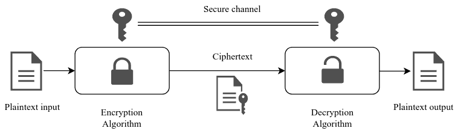

*图 2.1*：传统加密模型

*图 2.1*显示了使用与其他用户共享的秘密密钥通过安全通道加密明文的传统加密模型。想要阅读文本的用户将使用秘密密钥解密密文，将返回原始明文。密钥是私密的，加密和解密算法是公开的，因为没有密钥就无法解密密文。

有两种操作用于将明文转换为密文：替换和换位。这两种技术都可以确保操作是可逆的，因此它们可以用于加密算法。

替换密码是一种加密方法，其中明文中的字符以固定的方式被其他字符所替换。替换密码的最简单示例是凯撒密码，其中明文字母通过将字母表向后移动三个位置来进行替换：A 替换为 D，B 替换为 E，依此类推。这种密码的明显问题在于方法是固定的，并且没有涉及到密钥。引入了凯撒密码的变种，称为移位密码，其中从明文到密文的移位量变化，并且这个移位量可以作为密钥。尽管这解决了当前的问题，但它并不够实用，因为密钥可以通过暴力破解或穷举搜索攻击来猜测。多表密码是密文进化的下一个阶段。这种密码在消息的不同位置引入了多个替换。

一种换位密码是一种加密方法，其中明文字母的位置根据已知系统进行了移位。只有明文的顺序发生了改变。明文的所有字母都保持不变。栅栏密码和转位密码是两种著名的换位密码。这种密码技术可以通过使用变位分析法找到换位模式来进行解密。

# 密码基元

密码基元是低级密码算法，用于构建应用程序使用的加密协议。这些是设计密码系统的构建模块。计划在系统中实施加密协议的设计人员无需担心基元的低级抽象，可以完全集中精力构建应用程序：

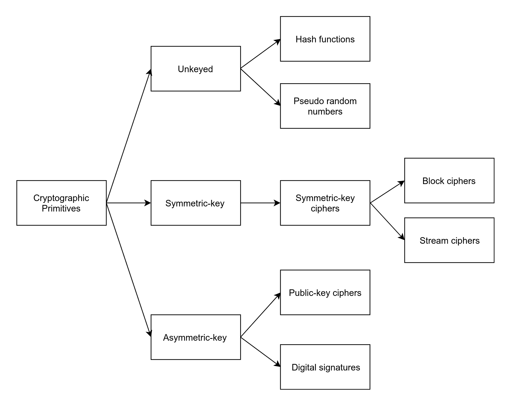

图2.2：密码学原语的分类

*图2.2*显示了密码学原语的详细分类。区块链技术利用这些密码学原语中的大多数来实现基本的区块链功能并在分散式网络上保护数据：非对称加密用于管理密钥；数字签名用于交易；而最重要的是哈希，它是区块链的支柱，是最常用的密码学原语之一。我们将涵盖所有这些原语以及其他一些内容，以便更清晰地了解它们。

# 对称密钥加密

对称密钥是一种基于密钥的加密，其算法使用相同的密钥来执行明文的加密和密文的解密。这些密钥在两个参与方之间通过安全信道共享。拥有共享密钥的任何参与者都可以对数据执行加密和解密操作。对称密钥密码可以是流加密或块加密。

对于基于区块链的应用程序来说，对称密钥加密并不起到重要作用。然而，在我们研究非对称加密之前，它会更好地理解基于密钥的加密。

# 流密码

流密码使用对称密钥加密。每个明文字符都是一个接一个地加密，就像流一样，以创建密文。一个密钥流，或字符流，用于加密明文字符。使用伪随机字符串，其作为密钥流。这个伪随机字符串是使用数字移位寄存器（生成器）从一个随机种子值生成的，如*图2.3*所示。使用的种子是秘密密钥，它也用于解密创建的密文。

为了使流密码安全，其伪随机生成器应该是不可预测的，并且用于生成密钥流的种子值不应该被重复使用以减少可能的攻击。流密码通常比块密码更快，并且硬件要求低，如下图所示：

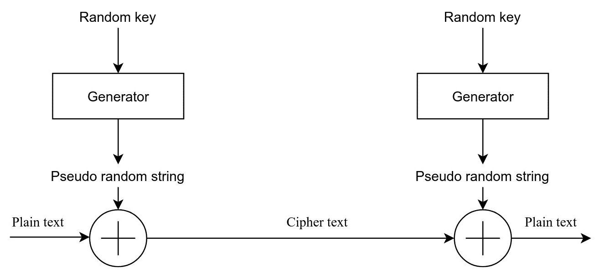

图2.3：流密码的流程图

# 块密码

块密码是一种对明文中的固定长度字符块进行加密的密码。这种密码技术被广泛用于对大量数据进行加密。通常的块大小为64位、128位和256位。例如，64位块密码将接收64位明文作为输入并输出64位密文。在某些明文长度不足填满一个块的情况下，明文将填充一些块。由于块密码中使用的密钥相当长，它们能够抵御穷举攻击。这些密码也是其他加密协议的基本构件，如哈希函数和随机数生成器。**数据加密标准**（**DES**）、**高级加密标准**（**AES**）、**国际数据加密算法**（**IDEA**）和**Blowfish**都是一些常见的块密码算法。

# 数据加密标准

DES曾经是最广泛使用的块密码，并且也是工业标准。尽管仍然很受欢迎，但在许多应用中已被其他先进的块密码所替代。DES使用64位块和64位密钥。在密钥中的8位被用作奇偶校验位以用于错误检测，因此密钥实际上为56位。已经证明它容易受到穷举攻击和一些密码分析攻击的影响，这是由于其有限的密钥长度所致。为了克服这个问题，3DES通过使用不同的56位密钥三次运行DES来进行加密。但是3DES被证明比其他块密码（如AES）更慢。

DES在传输或存储密钥时使用8位密钥作为奇偶校验位，用于错误检测。第8、16、24、…、64位的位用于计算奇校验，即密钥每个字节中的1的个数是奇数。

# 高级加密标准

AES是现代应用中最广泛使用的块密码之一。Rijndael算法被选定为AES，在经过5年的公开竞赛后成为DES的替代品。其固定的块大小为128位，密钥大小为128、192或256位。AES是迭代密码：迭代轮数取决于密钥长度。

AES对所有已知的攻击都是安全的。看起来没有比穷尽搜索更快的攻击AES的方法。攻击AES的最佳方法只适用于迭代轮数最少的密码变体。

# AES的一个示例实现

让我们使用名为`PyCryptodome`的Python加密库来实现AES密码技术。在本章节中，我们将使用这个库来实现其他密码和哈希算法。

PyCryptodome是一个自包含的低级密码原语Python包。PyCryptodome是`PyCrypto`库的分支项目，是一个具有扩展原语支持的活跃项目。因此，它几乎可以替代旧的`PyCrypto`库。

我们将从`Crypto.Cipher`包中使用AES模块，还将从`Crypto.Random`包中导入一个模块来为AES生成一个随机密钥，如下所示：

```
from Crypto.Cipher import AES 
from Crypto.Random import get_random_bytes 
```

加密端将使用随机选择的对称密钥创建密文。一旦导入所需模块，使用`Crypto.Random`包生成一个16字节的密钥。这个密钥被写入一个需要保密的文件中：

```
with open("aes.key", "wb") as file_out: 
    key = get_random_bytes(16) 
    file_out.write(key) 
```

通过传递密钥创建AES密码对象。代码中使用了Cipher模式EAX。此对象用于加密数据。Nonce、标签和密文被存储并传输到解密端：

```
data = "plaintext for AES" 
cipher = AES.new(key, AES.MODE_EAX) 
cipher_text, tag = cipher.encrypt_and_digest(data.encode()) 
with open("encrypted.bin", "wb") as file_out: 
    [file_out.write(x) for x in (cipher.nonce, tag, cipher_text)] 
print("Data is encrypted and stored in a file") 
```

AES的解密部分使用在加密过程中生成的相同的16字节对称密钥。理想情况下，这个密钥必须通过安全渠道传输给接收方。读取接收到的加密二进制文件以获取Nonce、标签和密文本身。使用相同的密钥和Nonce值创建AES密码对象。最后，通过提供`cipher_text`和`tag`执行解密的`decrypt_and_verify`方法。标签用于执行验证；它检查密文中是否有任何修改：

```
with open("aes.key", "rb") as file_in: 
    key = file_in.read(16) 
with open("encrypted.bin", "rb") as file_in: 
    nonce, tag, cipher_text = [file_in.read(x) for x in (16, 16, -1)] 

cipher = AES.new(key, AES.MODE_EAX, nonce) 
data = cipher.decrypt_and_verify(cipher_text, tag) 
print("Decrypted data is : \"{}\"".format(data.decode())) 
```

成功执行加密和解密操作将产生以下输出：

```
Data is encrypted and stored in a file
Decrypted data is : "plaintext for AES"  
```

当运行AES程序的加密和解密部分时，我们在解密后获得原始数据。对密文进行任何修改都会导致MAC检查错误，并且Python会抛出`ValueError: MAC check failed`。

本章中包含的详细的Jupyter Notebook和脚本可以在本书的GitHub存储库中找到。

# 非对称密钥密码学

非对称密钥密码学是现代密码学中广泛使用的加密技术。除了加密之外，它还有许多其他应用。它也经常在区块链的几个元素中使用，因此我们将深入介绍这种密码学技术及其原语。

对称密钥密码学使用共享密钥进行加密和解密。这样做的最大问题是共享密钥需要在参与者之间通过安全渠道交换，这可能非常难以实现。如果我们首先就有一个安全的通信渠道，这也会破坏加密的目的。这就是非对称密码学的用武之地。它使用称为公钥/私钥对的一对密钥。公钥是从私钥构造的，可以自由广播给其他用户。

1978年，Ronald Rivest、Adi Shamir和Leonard Adleman创建了第一个公钥算法，称为RSA算法。

公钥算法使得可以从随机生成的私钥创建公钥。创建的公钥不能用于推断私钥。换句话说，从私钥创建公钥是一个单向过程。这是公钥加密安全性依赖的概念。公钥算法不仅执行加密，还提供认证功能。

持有私钥的用户可以使用该密钥对已知用户公钥的系统进行身份验证，如下图所示：

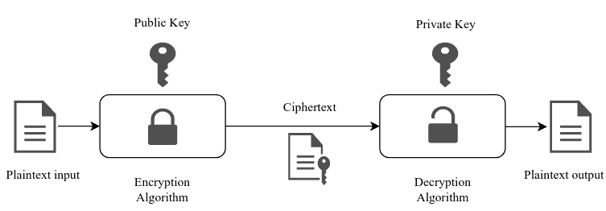

图 2.4：非对称密钥加密

正如我们在图中看到的，与对称加密不同，不需要安全通道来共享密钥。加密和解密算法是相同的，构造的密钥对在加密/解密过程中起着至关重要的作用。正如前面讨论的，非对称密钥算法也可以用于提供认证。这种机制的一个应用是数字签名：只有具有私钥的用户才能签署消息，任何拥有公钥的人都可以验证消息的真实性。数字签名也可以用于不可否认。区块链应用，特别是加密货币，利用数字签名用私钥签署交易以证明所有权。因此，区块链技术主要依赖于非对称加密算法。Diffie-Hellman 密钥交换，DSA，ElGamal，RSA 和**椭圆曲线密码**（**ECC**）是一些非对称密钥密码学的方法。

公钥密码系统的强度取决于从公开可用的有关密钥的信息中推断出私钥的可行性。虽然这是不可行的，但并非不可能，安全性完全依赖于密钥大小和密钥生成机制。由于其复杂性和加密/解密大型文件所需的时间，非对称密钥并不广泛使用。它们通常用于数字签名或密钥交换机制，而不是加密协议。

所有非对称密钥算法都基于确保密钥生成和加密解密过程所需特性的数论问题。根据在数论中解决数学问题的不同方式，非对称密钥生成在三个方面广泛特征化：素数分解，离散对数和椭圆曲线。所有公钥私钥算法都基于这些数学问题。所有这些问题在功能上类似于陷门函数。

陷阱门函数是一个函数，其中计算一方面的值很容易，但是从结果中找到逆是不可行的。这意味着很难从结果中找到供给函数的原始输入值。这个功能在非对称加密中广泛使用。

# 素数分解

素数分解是关于将数字分解为两个素数乘积的数论概念。素数分解是整数分解的一个子集，其中复合数被分解为任意两个整数的乘积。

要找出半素数（由两个素数相乘得到的数字）的因数是具有挑战性的，因为它们只有一对因数，并且随着用于乘积的素数的大小增加，找到因数的复杂性增加。当数字达到一定大小时，没有已知的高效分解算法用于找到因数。RSA使用素数分解，假定从素数乘积中暴露的私钥是非常困难的。这种假设的困难性是密码学中使用素数分解的原因。

# 离散对数

离散对数是基于离散对数的模算术设置的，在这里找到解决方案是不可行的。对数*log[b]a*是一个离散对数，具有整数解*x*，使得*b^x = a*。对于找到离散对数的解决方案，没有通用的高效方法。当离散对数与模算术一起使用时，它被称为模指数，这个问题变得非常困难。这个问题通常与Diffie-Hellman密钥交换算法一起使用。

让我们考虑一个模指数的例子：

```
33 mod 5 = 2
```

很容易找到前述函数的结果，即2，但是从结果中找到指数值3是困难的。前述的模操作也可以表示为*同余，即3³* *≅ 2 (mod 5)*。

假设*a*和*b*是两个整数，*m*是一个正整数。那么短语*a ≅ b (mod m)*被称为**同余**，并读作"a模m同余b"，这表明*m*除以*a-b*。

# 椭圆曲线

椭圆曲线是具有方程*y² = x³ + ax + b*形式的平面实代数曲线。椭圆曲线应该是一个非奇异曲线，意味着没有尖点、自交点或孤立点。在密码系统中使用了有限域上的椭圆曲线。ECC在比特币中用于生成私钥-公钥对，因此我们将在本章的后面部分深入讨论此问题：

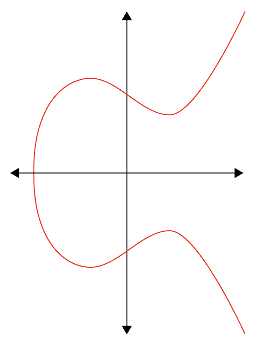

图2.5：一个椭圆曲线（类似于比特币中使用的曲线）

在比特币等加密货币中，非对称加密中的公私钥概念用于识别资产的所有者。私钥用于代表加密货币的所有权。

# RSA加密系统

RSA是公私密钥密码学的最初实现之一。它使用素数因子分解原理生成公私密钥对，这充当了一个陷阱函数。加密使用公钥进行，而解密使用秘密保存的私钥进行。

对称公私密钥密码系统的概念归功于惠特菲尔德·迪菲和马丁·赫尔曼，他们在1976年发表了这个概念。

利用两个大质数计算公私钥对。公钥发布给用户，私钥保密。大质数也要保密。只要使用的大质数足够大，就不可能从公钥计算出私钥。整个RSA密码系统基于整数因子分解的数论问题，确保了素数分解的困难程度与使用的素数大小成正比。

# RSA参数生成

在讨论RSA加密和解密之前，我们需要考虑RSA参数生成过程。以下是此过程涉及的步骤：

1.  选择两个不同的大质数*p*和*q*。

1.  计算*n = p***q*和*φ(n) = (p − 1)***(q − 1).*

1.  选择一个随机整数* e*，使得*1 < e < φ(n)*，且*gcd (e, φ(n)) = 1* ，即整数* e* 和* φ(n)* 为互质数。

1.  找到*d ≡ e^(-1) (mod φ(n))*,其中e^(-1)是*e*的模乘逆元。

整数*a*的模乘逆元是整数*x*，使得乘积*ax*对于模数*m*是同余于*1*。

更具体地说，找到*d*，使得*d***e* *≡ 1 (mod* *φ(n))*，即找到一个值*d*，使得当*d***e*被*φ(n)*除时余数为*1*。

1.  公钥用*(e, n)*表示，私钥用*(d, p, q)*表示。这里，*e*称为公钥指数，*d*称为私钥指数。

# 使用RSA进行加密和解密

RSA中使用分发的公钥进行加密。消息*M*被转换为整数*m*，使得*0 ≤ m < n*。密文*c*使用公开的公钥指数计算如下：

*c ≡ m^e mod (n)*

拥有公钥指数的任何人都可以对消息进行加密并将其传输给拥有私钥指数的人。拥有密文字和私钥指数的任何人可以按以下方式进行解密：

*m ≡ c^d mod (n)*

从解密的整数*m*中可以重新生成消息*M*。这就是RSA如何利用素数分解技术来进行加密和解密的方式。对于小消息，这个过程可以相对快速地完成，但它不是大消息首选的加密方式。这就是为什么RSA广泛用于加密原语，如数字签名，而不是加密的原因。

# RSA的一个示例实现

示例中使用了 Python `PyCryptodome` 库中的 RSA 包。以下包被导入以进行 RSA 密钥生成和加密解密操作：

```
from Crypto.PublicKey import RSA 
from Crypto.Cipher import PKCS1_OAEP 
```

使用 `RSA` 包中的 `generate` 方法创建了一个 2048 位的 RSA 密钥。从这个生成的密钥中导出了公钥，并公开了。应该保密 `key` 对象。使用公钥创建了一个密码对象，并使用该对象对消息进行加密：

```
message = "plaintext for RSA" 
key = RSA.generate(2048) 
public = key.publickey() 

cipher = PKCS1_OAEP.new(public) 
cipher_text = cipher.encrypt(message.encode()) 
print("Data is encrypted")
```

解密操作的执行方式与加密操作类似，但使用的是密钥对的私有部分而不是公共部分。密文被作为输入传递给 `decrypt` 方法，该方法对其进行解密并返回解密后的消息：

```
cipher = PKCS1_OAEP.new(key) 
message = cipher.decrypt(cipher_text) 
print("Decrypted data is : \"{}\"".format(message.decode())) 
```

前述脚本的成功执行将输出以下内容：

```
Data is encrypted
Decrypted data is : "plaintext for RSA"
```

# 椭圆曲线密码学

ECC 是基于前述椭圆曲线的公私密钥加密。它在椭圆曲线上执行点的加法以计算公私钥对。ECC 需要比其他非对称密钥密码系统（如 RSA）更小的密钥尺寸。ECC 在密钥交换机制和数字签名中被广泛使用，并且在加密系统中很少使用。

ECC 提供了与 RSA 相同的安全级别，但密钥尺寸更小。256 位 ECC 密钥相当于 3,072 位 RSA 密钥。同样，384 位 ECC 密钥提供了与 7,680 位 RSA 密钥相同的安全级别，依此类推。我们可以清楚地看到由于密钥尺寸较小而导致的较少计算时间的优势。

由于与 RSA 相比的密钥尺寸优势，ECC 在 *比特币* 的地址系统中被使用，以及在交易签名操作中被使用。它还在其他区块链应用中很受欢迎。ECC 的其他应用包括 Tor、iMessages、SSH 和 SSL/TLS。

在深入研究 ECC 的密码应用之前，让我们看看它的一些特性：

+   椭圆曲线由一个三次方程式表示：

*y^(2 )= x³ + ax + b*

+   椭圆曲线具有水平对称性

+   非垂直线将在曲线上最多相交三个点

RSA 加密使用素数分解。半素数的分解是非常困难的。在这个领域使用时，它形成一个陷阱门（单向）函数。同样，基于椭圆曲线的算法可以使用离散对数。找到与同一曲线上的点相关的椭圆曲线上的随机元素的离散对数是一个严重的问题。我们将逐步介绍如何从私钥构建公钥，并研究 ECC 密钥生成过程的单向性质。

# 椭圆曲线上的运算

在密码学中使用的椭圆曲线是在有限域中构造的曲线。它们的形式如下：

*y^(2 )= x³ + ax + b mod (p)*

对*p*的模运算表示曲线在阶为*p*的素数的有限域上。在进入密码应用程序之前，我们需要了解一些椭圆曲线的术语和操作。

有限域是由参数*p*定义的具有有限元素数量的域，其中*p*是素数。因此，有限域为*F[p] = {0, . . ., p-1}*。它在方程中由模*p*表示。

在ECC中使用的所有元素必须由密码学参与者达成一致。这些元素称为椭圆曲线域参数。{*p*, *a*, *b*, *G*, *n*, *h*}是ECC中使用的参数。这些参数的定义如下：

+   *p*：有限域由这个素数定义。

+   *a*和*b*：这些是方程中使用的常数。

+   *G*：这个生成器定义了曲线上所有点的集合，也称为基点。

+   *n*：这代表基点或生成器*G*的阶数，一个最小的正数*n*，使得*nG = ∞*。

+   *h*：这是余因子，是组和子组（*n*）的阶数的比值，必须很小（*h <= 4*），通常*h=1*。

比特币的**椭圆曲线数字签名算法**

(**ECDSA**)曲线使用在secp256k1中定义的一组唯一的域参数。您可以在本章的后续部分找到secp256k1中使用的曲线的技术规格。

在椭圆曲线上执行的操作称为点运算，它们是点加法和点加倍。我们将使用几何方法来解释这两种操作，以便清晰理解。与这些操作相关的Python脚本和笔记本可以在本书的GitHub仓库中找到：

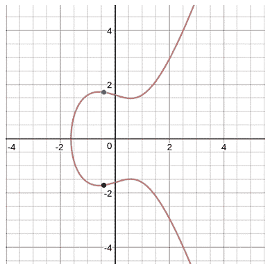

图2.6：具有坐标和网格的椭圆图（使用www.desmos.com创建）

我们将使用*图2.6*中的椭圆曲线来执行所有操作。

# 点加法

假设*P*和*Q*是椭圆曲线上的两个点。*P*不等于*Q*；它们是曲线上的两个不同的点。点加法的几何解释如下：

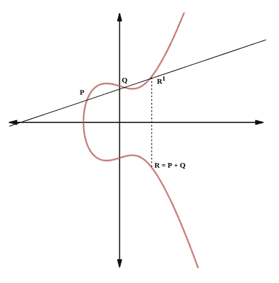

图2.7：点*P*和*Q*的加法

在椭圆曲线上执行如下步骤来添加两个点，如*图2.7*所示。

1.  在点*P（x1, y1）*和*Q（x2, y2）*之间画一条直线

1.  这条线将在椭圆曲线上的点*R¹*处相交

1.  关于*x*轴的点*R¹*的反射给出了点*R（x3, y3）*，这是*P*和**Q**的加法结果

# 点加倍

点加倍是与点加法类似的操作，唯一的区别在于点*Q*移动到与点*P（P = Q）*相同的位置：

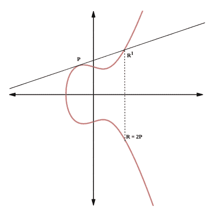

图2.8：点*P*的加倍

在椭圆曲线上执行如下步骤来计算点加倍，如*图2.8*所示：

1.  在*P*点处作一条切线（因为只有一个点）。

1.  这条线将在点*R¹*处与曲线交汇。

1.  *R¹*关于*x*轴的镜像得到点*R*，这就是点加倍或*R*的倍数（*2R*）

点加倍是ECC中用于从私钥构造公钥的概念。下一节将深入解释点加倍如何用于生成公钥。

# 计算公钥

既然我们已经定义了点加倍，我们可以计算曲线上一点是给定点发生器的倍数的点，点G（例如，*4G = G + G + G + G*），这可以使用点加倍计算。

让我们使用这个概念在不对称加密系统中计算公钥-私钥对。

给定规格的每个曲线域参数都是相同的。请参阅本章后面用于Bitcoin和其他区块链应用数字签名算法的secp256k1标准的技术规格。假设*k*是随机选择的私钥，*K*是要生成的公钥。曲线的生成器*G*具有标准值。可以通过在曲线上执行以下操作来计算公钥：

*K = k*G*

我们可以使用这个方程在椭圆曲线上使用点加倍来生成公钥。在椭圆曲线上的点加倍是一个单向操作。因此，在找到所需点*K*后计算乘值*k*是一项具有挑战性的任务：

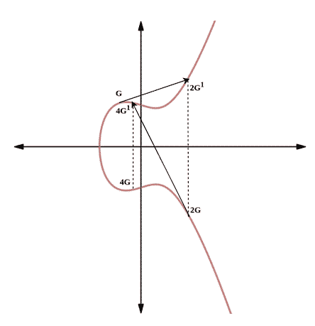

图2.9：使用点加倍将生成器乘以整数

*图2.9*显示了在给定曲线上使用点加倍从基点*G*派生出点*2G*和*4G*的过程。这种几何方法可以通过将生成器*G*乘以私钥*k*次数来生成公钥*K*。

# secp256k1的技术细节

Bitcoin使用特定的椭圆曲线，曲线中使用的域参数在secp256k1标准中得到定义。这条曲线在素数次序*p*的有限域内由以下立方方程表示：

*y² mod (p) = x³ + 7 mod (p)*

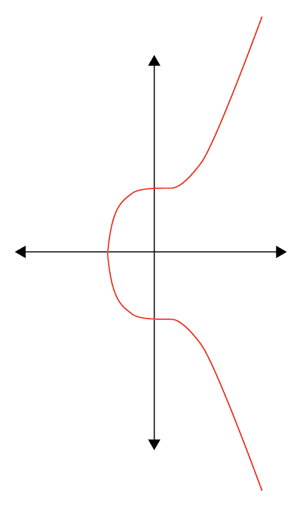

图2.10：secp256k1的椭圆曲线对实数

如名称所示，secp256k1的密钥大小可达256位。secp256k1使用的域参数的细节用十六进制字符串表示，如下所示：

+   大素数被用在有限域中。

    +   *p = FFFFFFFF FFFFFFFF FFFFFFFF FFFFFFFF FFFFFFFF FFFFFFFF FFFFFFFE **FFFFFC2F*

*p*的前面十六进制表示将具有以下十进制值：

*p = 2^(256) - 2^(32) - 2⁹ - 2⁸ - 2⁷ - 2⁶ - 2⁴ - 1*

+   *y² = x³ + 7*曲线的常数如下：

    +   *a = 00000000 00000000 00000000 00000000 00000000 00000000 00000000 00000000*

    +   *b = 00000000 00000000 00000000 00000000 00000000 00000000 00000000 00000007*

+   基点*G*的原始表示形式有一个较长的十六进制字符串，但可以压缩表示形式如下：

    +   *G = 02 79BE667E F9DCBBAC 55A06295 CE870B07 029BFCDB 2DCE28D9 59F2815B **16F81798*

+   *G*的顺序*n*和余因子如下：

    +   *n = FFFFFFFF FFFFFFFF FFFFFFFF FFFFFFFE BAAEDCE6 AF48A03B **BFD25E8C D0364141*

    +   *h = 01*

所有这些值对于secp256k1中的任何计算都保持不变。而且这个规范足够强大，能够抵御通过公钥计算私钥的穷举尝试。

# 数字签名

到目前为止，我们已经涵盖了对称和非对称密码学的各种不同加密方法。我们还研究了对称加密技术与非对称技术相比的一些优点。因此，非对称密码学是一种很少使用的加密方法。但不对称密钥的独特设计使其成为非加密应用的合适技术之一，数字签名就是其中之一。

数字签名是提供数字文档所有权证明的方法。由于其不对称密钥属性，公私密钥加密术在数字签名领域被广泛使用。所有者可以使用私钥对消息或文档进行签名，验证者可以使用公钥验证他们的所有权，这个公钥被分发给所有人。

这个过程类似于在现实世界中使用的手写签名，在那里，资产所有者可以使用他们的签名对该资产执行任何操作，任何人都可以通过将其与以前使用过的签名进行比较来验证签名。数字签名比手写签名更安全，因为在不拥有私钥的情况下，伪造签名是不可能的：

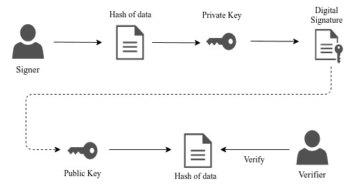

图2.11：数字签名的设计图示

数字签名可以用作确保行动的真实性、不可否认性和完整性的机制。我们可以以软件公司向其客户分发更新为例。这些客户如何确保他们可以信任这些软件更新？这就是数字签名在通过允许客户使用分发的公钥验证更新来提供真实性和完整性方面发挥作用的地方。只有软件所有者才能签署软件更新，因为他们拥有私钥。

# 它是如何工作的？

如*图2.11*所示，数字签名过程包括两部分：签署和验证。与加密不同，数字签名先执行第一个操作，即使用私钥进行签署。验证使用由签署者分发的公钥。

哈希算法生成一个唯一的固定长度值，用于数字签名的构建和验证。详细的密码哈希解释请参考下一节。

# 签名过程。

拥有消息所有者使用私钥执行签名操作以证明其真实性。假设 Alice 是拥有具有消息 *m* 的文档的所有者，并希望将其分发给网络中的其他人。现在，Alice 最初将对消息进行哈希处理，并使用她的私钥对文档进行签名。签名如下创建，其中 F[s] 是签名函数，F[h] 是哈希函数，*m* 是消息，*dA* 是 Alice 的私钥：

*S = F[s] (F[h] (m), dA)*

Alice 现在将与消息一起分发她的签名给网络中的每个人。

# 验证过程。

验证是由任何拥有业主公开信息的人执行的过程。公开信息通常包括公钥、消息和消息的签名。假设 Bob 拥有所有公开信息并希望验证消息以检查其真实性。Bob 使用签名验证算法，该算法需要消息的哈希值、公钥和签名。该算法将验证消息是否被任何人篡改。在本章后面可以找到签名和验证过程的实现示例。

# 椭圆曲线数字签名算法（ECDSA）。

ECDSA 是一种数字签名算法，利用 ECC 创建用于数字签名的密钥对。由于 ECC 相对于其他公钥算法的优势，它通常在区块链应用中用于签署交易或事件。

ECDSA 利用临时密钥对计算签名对 *R* 和 *S*。在椭圆曲线上随机选择一个临时私钥 *k*，并计算对应的公钥为 *P = k*G*。签名计算如下：

*S = k^(-1) (Hash(m) + dA * R) mod (p)*

用于签名操作的变量定义如下：

+   *k* 是临时私钥。

+   *R* 是临时公钥的 *x* 坐标。

+   *dA* 是私钥。

+   *m* 是消息。

+   *p* 是椭圆曲线的素数阶。

在 ECDSA 中，使用 *R*、*S* 对和公钥进行验证。点 *P* 的导出如下：

*P = S^(-1)*Hash(m)*G + S^(-1)*R*Qa*

用于验证操作的变量定义如下：

+   *Qa* 是签名者的公钥。

+   *m* 是消息。

+   *G* 是椭圆曲线的生成点。

Bitcoin 中使用 ECDSA 数字签名算法为交易签名，该交易由所有者使用其自己的私钥创建。

# ECDSA 创建和验证数字签名的示例。

以下包用于执行哈希、ECC 密钥创建和签名创建和验证：

```
from Crypto.Hash import SHA256 
from Crypto.PublicKey import ECC 
from Crypto.Signature import DSS 
```

密钥是使用 `ECC.generate` 方法在 secp256k1 椭圆曲线上生成的，并且公钥和私钥都被导出：

```
key = ECC.generate(curve='P-256') 
with open('ecc.pub', 'wt') as f: 
    f.write(key.public_key().export_key(format='PEM')) 
with open('ecc.pem', 'wt') as f: 
    f.write(key.export_key(format='PEM')) 
```

需要签名的消息使用 `SHA256` 算法进行哈希处理，然后通过提供私钥使用 `DSS` 包创建签名者对象。 然后，所有者签署了哈希消息：

```
message = b'ECDSA message for signature' 
key = ECC.import_key(open('ecc.pem').read()) 
h = SHA256.new(message) 
signer = DSS.new(key, 'fips-186-3') 
signature = signer.sign(h) 
```

下面代码中的签名验证类似于签名。 收到的消息最初被哈希化，因为发送方也进行了哈希化。 分布式公钥被导入并用于创建新的 DSS 对象进行验证。 使用哈希消息和接收到的签名进行验证。 如果消息或签名被篡改，`verify` 函数会抛出 `ValueError`：

```
h = SHA256.new(message) 
key = ECC.import_key(open('ecc.pub').read()) 
verifier = DSS.new(key, 'fips-186-3') 
try: 
    verifier.verify(h, signature) 
    print("The message is authentic.") 
except ValueError: 
    print("The message is not authentic.") 
```

# 密码哈希

密码哈希函数是一种将任意大小的数据映射到称为哈希的固定大小字符串的函数类型。 哈希函数具有使它们非常适合在密码学中使用的某些属性。

哈希函数广泛用于哈希表数据结构中。 哈希表将数据存储在键值对中。 当需要使用哈希函数将大键转换为小键时，将值映射到这些小键。 这使得键到值的映射非常容易，并且可以在 O(1) 的时间复杂度内实现。 这是因为哈希函数具有恒定的时间复杂度。

我们已经多次提到，哈希是区块链架构的支柱，它具有几个属性，使其非常有价值并且非常适合于区块链实现。

每个哈希函数都具有以下属性：

+   预像阻力：给定计算的哈希 *h = hash (m)*，其中 *m* 是消息，应该无法从给定的哈希值中找到消息。

+   第二个预像阻力：给定消息 *m1*，应该很难找到另一条消息 *m2* 使得 *hash (m1) = hash (m2)*。

+   碰撞阻力：当至少有两条消息产生相同的哈希值时，哈希被认为发生了碰撞。 应该无法找到两个消息 *m1* 和 *m2* 其中 *hash (m1) = hash (m2)*，也就是说，应该很难找到具有相同哈希值的两个消息。 这类似于第二个预像阻力，但是这里可以选择任意两个消息。 因此，此属性意味着第二个预像阻力。

尽管每个哈希函数都具有这些属性，但是一个良好的哈希函数应该具有额外的属性以提供强大的安全性：

+   哈希函数对于任何输入应该需要恒定的时间。

+   消息中的任何位的更改应该导致与先前消息的哈希值相比产生全新的哈希值。 分析由哈希函数创建的哈希值应该非常困难。

在区块链中，散列用于为每个区块创建一个唯一的身份字符串，方法是计算其散列值。每个区块都将维护前一个区块的散列值，从而形成区块链。散列为区块链分类帐的块提供了完整性。

# 散列算法

散列算法根据其实现、生成的摘要大小等进行分类。一些分类包括消息摘要、**安全散列算法**（**SHA**）和 **RACE Integrity Primitives Evaluation Message Digest**（**RIPEMD**）。

# 消息摘要

这是 1990 年代早期使用的流行哈希算法组之一。它们是 128 位哈希函数，其中 `md4` 和 `md5` 是它的变体。自采用以来，已经检测到许多漏洞。尽管如此，这些函数被用来创建文件摘要以确保其完整性。

# 安全散列算法（SHA）

SHA-0 是 SHA 算法的第一个版本。在 2004 年，该算法暴露出了几个弱点，导致了 SHA-0 的更强版本 SHA-1 的创建。在 2005 年，对 SHA-1 的攻击报告称，它将在更少的散列操作中找到碰撞。

SHA-2 被创建来克服 SHA-1 的弱点，它可以以 224、256、384 和 512 位的摘要大小实现。SHA-2 是现代密码应用中广泛使用的标准。比特币使用 SHA-256 变体作为散列算法来解决工作量证明难题。

SHA-3 是具有 224、256、384 和 512 位变体的最新函数族。

# 使用 SHA-256 算法的散列示例

以下示例脚本使用 SHA-256 散列算法计算消息的摘要：

```
from Crypto.Hash import SHA256 

hash_object = SHA256.new(data=b'First') 
print(hash_object.hexdigest()) 

hash_object.update(b'd') 
print(hash_object.hexdigest()) 
```

让我们考虑上述脚本的输出并做出一些观察：

```
a151ceb1711aad529a7704248f03333990022ebbfa07a7f04c004d70c167919f
18902d9ed3b47effdb6faf90ea69b2ef08ef3d25c60a13454ccaef7e60d1cfe1  
```

正如我们所见，输出中的两个散列值都有 64 个十六进制数字（256 位），而消息的大小则无关紧要。第一个散列值有一个消息“First”，第二个散列值有一个消息“Firstd”（更新函数将新消息附加到上一个消息）。尽管末尾有一个字符的差异，但整个 SHA-256 散列值看起来完全不同。SHA-256 的这种属性确保它是预像抗性的，因此很难被破解。

# Merkle 哈希树

Merkle 树是一种二叉树，其中所有叶节点代表数据块的哈希值。每个父节点具有其子节点的哈希值的哈希值。哈希继续直到树的根节点。Merkle 树用于总结大量数据并为每组数据创建指纹。

树是计算机科学中的一种数据结构，由根节点和一组父节点和子节点的子树组成，并通过将根节点放置在顶部来表示。二叉树是每个父节点最多有两个节点的树。 Merkle 树用于比特币、以太坊和其他区块链应用程序中，用于总结每个区块中包含的所有交易。SHA-256 在比特币的 Merkle 树中用作哈希函数，如下图所示：

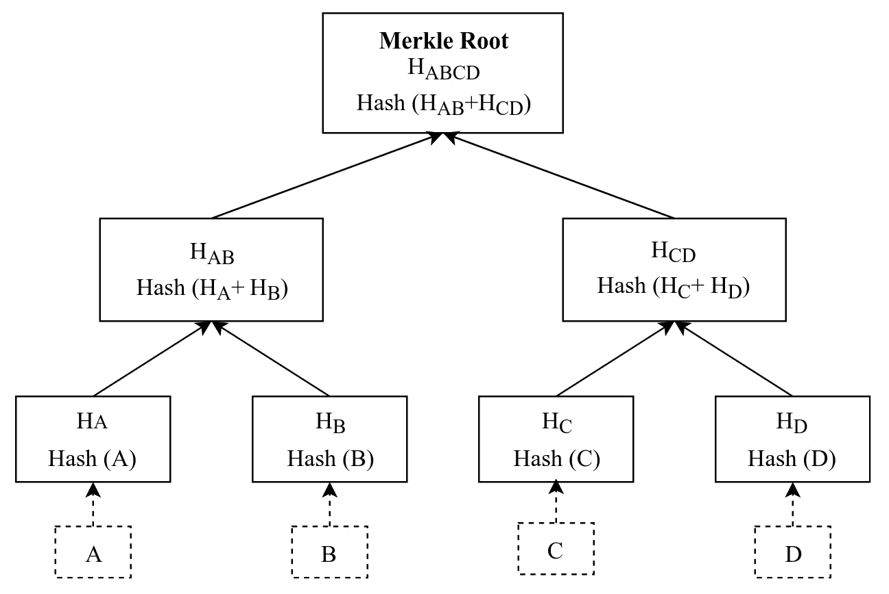

图 2.12：总结所有叶子节点的 Merkle 树

Merkle 树是从叶节点向上构建的。在 *图 2.12* 中，叶节点将只包含数据块 A、B、C 和 D 的哈希值，分别由 H[A]、H[B]、H[C] 和 H[D] 表示。每个父节点将通过连接子节点的哈希值并再次哈希来构造其哈希：

*H[AB] = Hash (H[A] + H[B])*

此过程一直持续到计算出根节点哈希值 *H[ABCD]* 为止。

由于每个 Merkle 树节点（除了叶节点）都根据其子节点计算其哈希，因此它必须保持平衡的树形结构，即每个节点（除了叶节点）应该有两个子节点。这可以通过复制现有的单个子节点来实现。

Merkle 树不仅提供了总结整个数据块的方式，而且还可以有效地验证数据块是否存在。验证可以在 *log[2](n)* 复杂度内完成。

# 编码方案

编码方案通常用于数据存储或通过媒介传输文本数据。你经常可以观察到二进制到文本编码方案的转换在原始加密实现中。

编码方案提供了一种紧凑的方式来使用基数表示长字符序列。例如，十进制系统使用基数10，使用0-9的字符，十六进制系统使用十进制系统中的数字以及A-F的附加字符。系统的基数越大，编码字符串的大小就越小。

Base64 是一种广泛用于存储和传输大文件（例如图像）的编码方案。它使用 26 个小写字母、26 个大写字母、10 个数字字符和 2 个特殊字符（“+”和“/”）。

Base58 是为比特币开发的一种编码方案，用于几种区块链应用程序中。Base58 实际上是 Base64 的子集，旨在提供更好的可读性。在 Base58 中省略的 Base64 字符是 0（零）、O（大写 o）、l（小写 L）、I（大写 i）以及特殊字符“+”和“/”。

比特币的 34 位 Base58 编码钱包地址如下：

*16RhN7MhhTRMDdrS3szys5pEpmS2YGTMsk*

# 总结

本章涵盖了所有基本的密码学主题，从经典的密码技术到高级的密码原语。我们在章节开始时讨论了经典的密码技术。我们探讨了对称加密和非对称加密，以及一些示例。诸如哈希和数字签名之类的密码原语将会被更详细地讨论，因为它们将作为本书中涵盖的区块链概念的基础。

由于我们已经涵盖了密码学中一些基本概念，并查看了它们各自的应用，在下一章中，我们将通过查看一个简单的区块链示例来尝试实现一些适用于区块链协议的密码学概念。
