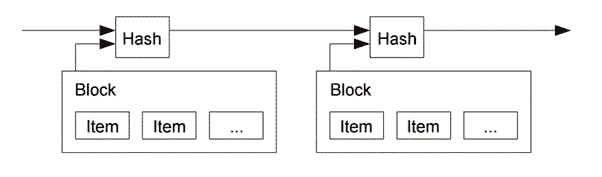
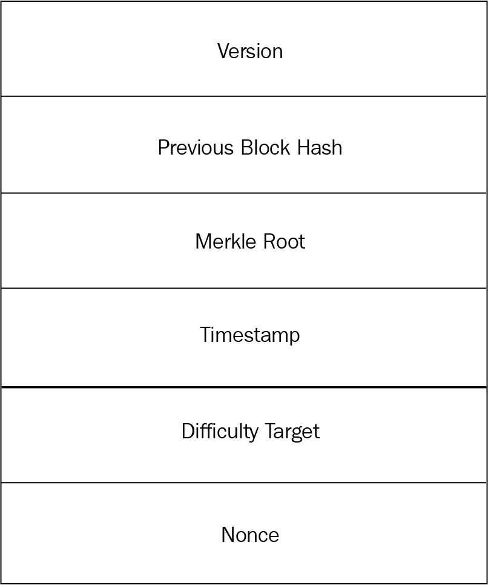
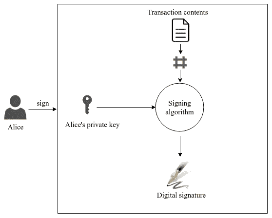
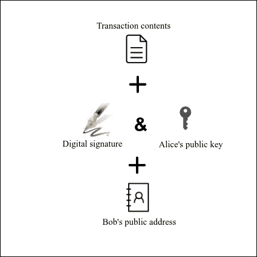
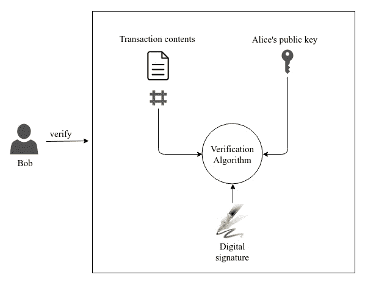

# 第三章：区块链中的密码学

在前几章中，我们介绍了与区块链相关的密码学。虽然我们对其中一些密码原语有清晰的理解，但我们尚未探讨它们在实际区块链应用中的应用。在本章中，我们将涵盖一些密码原语的应用，其中将包括哈希函数和数字签名。我们将通过在基本区块链应用中实际实现它们来深入研究它们。

在本章中，我们将涵盖以下主题：

+   区块链中的哈希

+   区块链中的数字签名

需要注意的一点是，每个与区块链技术一起使用的加密原语都有不同的作用。哈希函数和数字签名是与区块链广泛使用的两个加密概念。

我们主要可以观察到区块链技术中的三个层次。这些是*点对点网络层*，负责块创建和验证机制的*共识层*，以及利用底层区块链构建应用程序的*应用层*。密码学主要用于区块链的共识和应用层。哈希算法主要用于创建块标识，确保区块链的完整性，并且还作为共识算法的关键组成部分，例如比特币的工作证明。另一方面，数字签名处理应用层，在这里它用于通过将其嵌入到交易中来验证事件。

由于哈希和数字签名在不同层次上为区块链做出了贡献，我们将在本章的不同部分中涵盖这些概念的重要性。

# 区块链中的哈希

哈希在区块链中是一个重要的概念，在区块链应用程序的功能中起着巨大作用。哈希函数的应用范围从较小的区块链实现，例如为大量数据创建摘要，到主要实现，例如维护链中块的完整性。哈希函数还用于工作证明共识算法中解决拜占庭失败问题，我们将在本章稍后深入探讨。首先，我们将探索一些利用哈希函数的区块链概念。

# 在区块链中链接块

正如在前言中定义的那样，区块链是一个持续增长的区块集合，通过使用加密技术作为关键要素来链接在一起形成一个开放账本。区块链中的每个区块都被赋予一个标识以标记该区块的唯一性，这是通过使用哈希函数生成该区块的摘要来实现的。正如在前一章节中提到的密码哈希函数的碰撞抵抗性属性，第二章， *加密的一点**,* 保证了找到两个结果相同的哈希值的区块是不可行的。因此，哈希函数保证了为区块创建的标识的唯一性。

当创建新区块时，它将使用上一个区块的摘要作为后向引用，从而将该区块链接到区块链上。修改任何区块都会由于新的哈希值而改变该区块的身份。因此，这将破坏链，因为一个区块引用将因为新生成的哈希值而无效。因此，修改区块以生成与以前相同的哈希值是不可行的。这是由于密码哈希函数的前像抗性属性，即使我们拥有哈希值，也无法预测区块的数据。这就是为什么一旦创建了一系列区块，就会确保链的完整性，因为每个区块都引用了前一个区块。修改区块数据的唯一方法是通过修改所有后续区块，并更新其对前一个区块的引用：



图 3.1：使用哈希链接块，来自 *点对点的电子现金系统*，S. 中本聪

前文 *图 3.1* 展示了来自原始论文 *比特币：一个点对点的电子现金系统* 的区块链设计，该论文的作者是比特币原始参考实现者 **中本聪**。它显示每个区块的哈希值受到前一个区块哈希值的影响，从而链接了区块链中的每个区块。持有区块链账本副本的任何人都可以通过验证每个区块的哈希与下一个区块的哈希来验证区块链中的所有区块是否有效。

# 使用 SHA256 哈希算法链接区块

区块链中的区块通过引用前一个区块的哈希值链接在一起。SHA256 是区块链平台中最流行的哈希算法，因为它在比特币实现中使用过。首先，我们将定义区块的结构和功能，最后利用哈希算法构建区块链。

# 区块结构

让我们考虑一个简单的区块，其头部和数据合并以创建一个称为**Block**的数据结构。每个区块将包含以下内容：索引、前一个哈希、时间戳、数据及其自身的哈希值：

```
class Block(object): 
    """A class representing the block for the blockchain""" 

    def __init__(self, index, previous_hash, timestamp, data, hash): 
        self.index = index 
        self.previous_hash = previous_hash 
        self.timestamp = timestamp 
        self.data = data 
        self.hash = hash 
```

前面的代码片段定义了一个名为`Block`的 Python 类，它具有区块链区块的所有基本属性。通常，一个区块将包含一个头部和一个主体，头部包含有关区块的元数据。然而，前面的示例并未区分头部和主体。像比特币这样的典型区块链应用程序将拥有大量可能以交易形式出现的数据，但在示例中，我们将考虑数据为`string`类型。

一个典型的区块还将在头部包含一个随机数和一个难度目标。这些信息在共识算法中使用，如工作证明。由于我们的目的仅是描述一个区块链，这些字段不在本节的讨论范围内。

# 区块链功能

区块链接过程包括几个要素，如从信息中创建结构、计算区块的哈希值，并将其添加到区块链中。

让我们将这些功能逐一细分为区块链方法：

```
class Blockchain(object): 
    """A class representing list of blocks""" 

    def __init__(self): 

        self._chain = [self.get_genesis_block()] 
        self.timestamp = int(datetime.now().timestamp()
```

前面的类是一个类方法的集合，这些方法使用哈希函数创建一个有效的区块链。`Blockchain`的构造函数将通过添加一个创世区块来初始化链条，这是区块链的第一个区块，且不引用任何前一个区块：

```
def get_genesis_block(self): 
    """creates first block of the chain""" 

    return Block(0, "0", 1465154705, "my genesis block!!", "816534932c2b7154836da6afc367695e6337db8a921823784c14378abed4f7d7"
 ) 
```

创世区块是一个硬编码的区块，被添加到区块链的开头。它是用静态内容创建的。前面的创世区块有一个使用 SHA-256 创建的硬编码哈希值，如下所示：

```
SHA256.new(data=(str(0) + "0"+ str(1465154705) +"my genesis 
 block!!").encode()).hexdigest() 

def calculate_hash(self, index, previous_hash, timestamp, data): 
    """calculates SHA256 hash value""" 

    hash_object = SHA256.new(data=(str(index) + previous_hash + 
 str(timestamp) + data).encode()) 
    return hash_object.hexdigest()
```

`calculate_hash`是区块链中的一个关键方法，因为这个方法创建了将所有区块绑定在一起的哈希值。使用 PyCryptodome 包创建 SHA-256 哈希值，如上一章所示。这个方法将区块索引、前一个区块的哈希值、时间戳和创建所需的数据串联起来，生成需要被哈希处理的字符串。SHA256 哈希函数生成的摘要就是该区块的哈希值。

在创建下一个区块时，我们需要找到前一个区块的哈希值。下面的函数用于识别添加到链上的最后一个区块：

```
def get_latest_block(self): 
    """gets the last block from the blockchain""" 

    try: 
        return self._chain[-1] 
    except IndexError as e: 
        return None 
```

下面的函数将通过构建创建`Block`对象所需的所有属性来构建一个区块。它还会计算当前区块的哈希值。最终将创建一个由区块结构组成的新的`Block`对象：

```
def create_block(self, block_data): 
    """creates a new block with the given block data""" 

    previous_block = self.get_latest_block() 
    next_index = previous_block.index + 1 
    next_timestamp = self.timestamp 
    next_hash = self.calculate_hash(next_index, 
 previous_block.hash, next_timestamp, block_data) 
    return Block(next_index, previous_block.hash, next_timestamp, 
 block_data, next_hash)
```

注意：我们根据在创建区块链对象时创建的静态时间戳值创建了`next_timestamp`。尽管在实际的区块链中这不是真实的，但我们故意这样做是为了在代码执行期间解释一个特定的情况。

以下函数用于添加、重置和读取区块链的块。`add_block`方法和`chain`属性是唯一需要向用户公开的类成员：

```
def add_block(self, data): 
    """appends a new block to the blockchain""" 

    self._chain.append(self.create_block(data)) 

@property 
def chain(self): 
    """created a dict containing list of block objects to view""" 

    return self.dict(self._chain) 

def dict(self, chain): 
    """converts list of block objects to dictionary""" 

    return json.loads(json.dumps(chain, default=lambda o: 
 o.__dict__)) 

def reset(self): 
    """resets the blockchain blocks except genesis block""" 

    self._chain = [self._chain[0]] 
```

# 创建一个区块链

现在我们已经定义了简单区块链链接器的所有必需功能，我们将通过创建一些块和一个区块链来模拟它：

```
new_chain = Blockchain() 
new_chain.add_block(data="first block data") 
new_chain.add_block(data="second block data") 
new_chain.add_block(data="third block data") 

print(json.dumps(new_chain.chain))

new_chain.reset() 

new_chain.add_block(data="first block data") 
new_chain.add_block(data="second block data") 
new_chain.add_block(data="third block data") 

print(json.dumps(new_chain.chain))
```

前面的代码片段创建了一个`Blockchain`对象，并向其添加了三个块，以及一个现有的创世块。在重置区块链后再次执行此操作。这里的一个重要观察是，`new_chain.chain`的两个输出都将产生包含以下输出中显示的块哈希的块列表。这是因为在执行期间贡献到哈希值创建的所有属性都相同。如果输入相同，哈希函数总是产生相同的哈希值。

时间戳在创世块中是硬编码的，故意保持所有块的时间戳恒定，以显示使用相似数据计算的哈希值每次都将生成相同的值：

```
[ 
  { 
    "index": 0, 
    "data": "my genesis block!!", 
    "hash": "816534932c2b7154836da6afc367695e6337db8a921823784c14378abed4f7d7", 
    "previous_hash": "0", 
    "timestamp": 1465154705 
  }, 
  { 
    "index": 1, 
    "data": "first block data", 
    "hash": "c8028a8a867a639fec693243f88a4e04f0ab5872f6913da53210316bd97d6ebb", 
    "previous_hash": "816534932c2b7154836da6afc367695e6337db8a921823784c14378abed4f7d7", 
    "timestamp": "1521059029" 
  }, 
  { 
    "index": 2, 
    "data": "second block data", 
    "hash": "aba71ef94fdc7d70bd39e5aa3eeef6fd53ac8e7fc102c2f638126c8a74d5cefe", 
    "previous_hash": "c8028a8a867a639fec693243f88a4e04f0ab5872f6913da53210316bd97d6ebb", 
    "timestamp": "1521059029" 
  }, 
  { 
    "index": 3, 
    "data": "third block data", 
    "hash": "f208c8375036ad785c9226d09585bd50a2b3993300f75e041dc3f2f0b6cfdd2b", 
    "previous_hash": "aba71ef94fdc7d70bd39e5aa3eeef6fd53ac8e7fc102c2f638126c8a74d5cefe", 
    "timestamp": "1521059029" 
  } 
] 
```

在实际执行期间，前面的输出将生成两次。输出显示了我们区块链中的块如何使用加密哈希链接在一起。区块链中的每个块都有一个`previous_hash`值，该值与前一个块的哈希值匹配。索引`0`是硬编码的创世块，没有`previous_hash`，索引`1`的`previous_hash`值与创世块的哈希匹配。所有其他块都以相同的方式链接。

让我们尝试修改一个块中的数据，并将其余块插入到链中：

```
new_chain.reset() 
new_chain.add_block(data="modified first block data") 
new_chain.add_block(data="second block data") 
new_chain.add_block(data="third block data") 

print(json.dumps(new_chain.chain)) 
```

这将产生以下区块链中的块列表：

```
[ 
  { 
    "hash": "816534932c2b7154836da6afc367695e6337db8a921823784c14378abed4f7d7", 
    "data": "my genesis block!!", 
    "index": 0, 
    "timestamp": 1465154705, 
    "previous_hash": "0" 
  }, 
  { 
    "hash": "06045fb547175c5cd32b3ba326ce9768c22771c3e128f801bbec19ea1eb20052", 
    "data": "modified first block data", 
    "index": 1, 
    "timestamp": "1521086845", 
    "previous_hash": "816534932c2b7154836da6afc367695e6337db8a921823784c14378abed4f7d7" 
  }, 
  { 
    "hash": "40c54c31afda040d037dae637ab1ec6e5eb9b132c761b9eadda21e68c0897a65", 
    "data": "second block data", 
    "index": 2, 
    "timestamp": "1521086845", 
    "previous_hash": "06045fb547175c5cd32b3ba326ce9768c22771c3e128f801bbec19ea1eb20052" 
  }, 
  { 
    "hash": "466083f34143e7f99196de01cd7777c52b0763624acd2895f0d28047c670eb41", 
    "data": "third block data", 
    "index": 3, 
    "timestamp": "1521086845", 
    "previous_hash": "40c54c31afda040d037dae637ab1ec6e5eb9b132c761b9eadda21e68c0897a65" 
  } 
] 
```

前面的块列表显示了与之前区块链相似的块链接属性，但有一个有趣的观察是，尽管只修改了索引`1`的块数据，但所有其他块的哈希值与前一个块的输出不同。这是由于链式效应或涟漪效应造成的。因为每个块都存储着前一个块的哈希值，所以每个块都受到此修改的影响。这导致了新的区块链的创建。这就是为什么区块链是安全的原因：不能修改单个块而不影响分类账中的其他块。

在书籍的 GitHub 存储库中可以找到前述示例区块链应用程序的完整脚本（[`github.com/PacktPublishing/Foundations-of-Blockchain`](https://github.com/PacktPublishing/Foundations-of-Blockchain)），以及 Python 打包。

# 区块链中的拜占庭失效问题

在前面的部分中，我们看到了如何将区块追加在一起形成区块链。我们还看到了加密哈希函数如何在确保区块链完整性方面发挥关键作用。尽管区块链保持了完整性，但并不能保证在分散网络中可以维护单个版本的区块链。由于区块创建并不是一项困难的任务，网络中的每个节点都能够维护自己的区块链版本。这是一个众所周知的分布式系统问题，称为拜占庭将军问题，或拜占庭失败。

拜占庭失败是一种对不同观察者呈现不同症状的故障。当系统需要达成共识时，会出现服务丢失。这种类型的故障在分布式系统中常见，由于很难收集关于组件状态的信息，并且恶意行为者的存在使得达成共识更加困难。

拜占庭失败这个术语源自拜占庭将军问题，这是一个协议问题，一组代表拜占庭军队的将军正在计划攻击一座城市。一些将军可能决定进攻，而另一些则撤退。他们应该就是攻击还是撤退达成一致，以便任务能够成功完成。将将军的投票结果传达给彼此是一项困难的任务，因为他们相距甚远，没有方便的沟通方式。由于这个原因，将军之间可能会出现延迟或误解。存在不可靠将军的问题进一步加剧了这个问题，因为他们可能会在投票时试图欺骗，以使任务失败。如果这样的系统无法获得大多数投票的一致意见，那么就会导致任务失败，因为决定进攻的军队可能没有足够的支持来自其他将军。这是一个经典的协议问题，没有一个单一的解决方案。解决拜占庭将军问题的方法是找到诚实将军中的多数票。

一个展示**拜占庭容错**（**BFT**）的系统可以克服拜占庭失败问题。在数字系统中，诸如数字签名之类的加密基元可以通过创建无法伪造的消息签名来为安全关键系统提供容错性。实现数据完整性可以在一定程度上抵御拜占庭失败问题，但这并不是一个完整的解决方案。

现在我们了解了拜占庭问题，我们可以注意到这个问题适用于任何分布式系统。该问题也存在于区块链网络中，其中参与者分布在去中心化的点对点网络中。在去中心化网络中保持一个真理是一项艰巨的任务，而网络中的不良行为者的参与使任务变得更加困难。区块链的去中心化网络必须就如何实现全局一致的区块链状态达成一致。在区块链网络中发生拜占庭问题是不可避免的，因为区块链网络存在于去中心化的不可信环境中。网络的节点应该就如何实现一个通用的区块链状态达成共识。矿工特别应该达成共识，因为他们是促进区块链增长的人。

区块链矿工是不仅验证区块链数据，而且还为区块链分类帐创建新块的节点。

比特币是第一个解决拜占庭问题的去中心化应用程序。它通过使用一种名为工作证明的共识算法来实现这一点，这种算法受到了 1997 年由英国密码学家亚当·贝克提出的 Hashcash 系统的启发。Hashcash 的开发目的是验证合法用户并通过创建需要一定计算量的邮票来减少电子邮件垃圾邮件。Hashcash 邮票是使用哈希算法创建的。尽管创建邮票很耗时，但验证可以立即执行。同样，比特币的工作证明也使用了密码哈希函数来在网络中达成共识。

有几种共识算法可以在区块链中实现一个共同的全局视图。Proof of Stack、Proof of Activity、Proof of Capacity 和 Proof of Elapsed Time 只是其中的几个例子。即使是流行的以太坊区块链框架目前也使用工作证明共识，但已经有积极的开发工作在未来的以太坊发布中包括了 Proof of Stake。

# 工作证明如何确保拜占庭容错性？

工作证明是一种共识算法，旨在确保网络中创建块的每个参与节点都必须证明它在插入公共区块链分类帐之前对该块进行了一定量的工作。

比特币的工作量证明共识算法旨在确保区块链数据不可变，并且不容易被不良行为者改变。区块链网络中的多数决策由最长链代表；这是因为它证明了做了最多的工作。尽管这种系统会在去中心化网络中实现共识，但是如果不良行为者尝试创建带有一些欺诈性交易的备用区块链会怎样呢？当使用工作量证明时，这并不容易。每当不良行为者修改了早期创建的区块时，所有后续区块都将被重新创建，其中的所有区块都将重新进行工作。重新创建所有区块将需要很长时间，因为这个过程需要大量的计算能力。然而，你会发现，通常情况下，大多数网络会拒绝不良行为者的工作，因为它无法跟上诚实节点的工作。

因此，工作量证明有助于在不诚实节点存在的情况下实现 BFT 系统。

虽然工作量证明为拜占庭失效问题提供了实际解决方案，但一种名为 51%的攻击理论上可能导致拜占庭失败。在 51%攻击中，区块链网络中的大多数计算能力被不诚实的实体控制。这意味着比特币可以拥有 50%的错误节点，但仍能正常运行。这就是比特币共识机制的容错性。51%攻击在第十章的《区块链安全》中有更详细的介绍。

# 工作量证明如何使用密码学？

工作量证明是一种共识算法，它使用密码哈希谜题确保在创建区块之前完成了一定数量的工作。比特币的工作量证明使用 SHA-256 哈希函数创建哈希谜题。

区块链网络中的区块是由一种特殊类型的验证者节点——矿工节点创建的。这些矿工节点互相竞争解决哈希谜题，以便产生要追加到分类账中的区块。

区块链矿工将在有数据（通常是一组交易）需要包含在一个区块中时开始解决哈希谜题。下图*图 3.2*显示了工作量证明区块链应用中使用的区块头的基本结构。谜题求解器通常会使用 SHA256 哈希函数创建头的哈希值。这里的谜题是找到一个头的哈希值，使得哈希以已知数量的零位开始：



图 3.2：一个区块头的基本结构

我们之前提到过哈希函数的特性；也就是哈希值是不可预测的，因为哈希值的生成是一个单向过程。因此，很难预测标题的内容，这会导致哈希值以一定数量的零位开始。实现这个唯一的方法是不断尝试不同的标题值，并使用哈希函数计算哈希值。通过改变标题中的名为**nonce**的变量字段来创建不同的标题。随机 nonce 被分配给哈希函数以创建一个不同的标题。一旦矿工找到一个 nonce，将会生成一个具有所需数量零位的哈希值，那么难题就解决了，并且 nonce 记录在块标题中。

使用哈希函数进行工作量证明证明是一个很好的方法，因为由于其加密特性，欺诈性计算哈希值是困难的。哈希函数确保已经使用了一定数量的计算机 CPU 功耗来计算哈希值，并且在这个过程中计算机的哈希率是工作证明。

# 工作量证明的示例实现

在前一部分中，我们介绍了工作量证明如何使用哈希算法。我们还看了如何计算目标哈希值来解决哈希难题。现在，我们将使用 SHA-256 算法来实现工作量证明算法，以分析哈希和概率如何对这个共识算法产生影响。

由于工作量证明算法的主要目的是找到一个 nonce，当附加到区块链标题时，会产生所需的目标哈希值，因此这里的任务是随机猜测 nonce 值，并建立区块的摘要值。由于哈希函数的特性，使得猜测 nonce 值非常困难和非确定性，找到 nonce 的唯一方法就是使用哈希函数实际尝试每一个 nonce，并找到能满足目标哈希值的 nonce。虽然解决方案是非确定性的，但由于哈希函数的特性，工作量证明受概率的影响。虽然找到解决方案取决于运气，但通常情况下，完成最多工作量的矿工节点会解决难题。这是因为找到 nonce 的概率随着所做工作量的增加而增加。

在工作量证明中解决的每个难题都有一个确定目标哈希值的难度级别。难度级别是由所需数量的零位在结果哈希值开始处决定的。增加所需零位数量将增加难题的难度级别。这是因为由于较小的样本空间，找到一个小哈希值的概率比找到任何哈希值的概率都小。

这个工作量证明的例子实现将阐明概率在这个共识算法中的作用：

```
from Crypto.Hash import SHA256 

text = "I am Satoshi Nakamoto" 

for nonce in range(20): 

    input_data = text + str(nonce) 

    hash_data = SHA256.new(input_data.encode()).hexdigest() 

    print(input_data, '=>', hash_data) 
```

示范 nonce 的代码灵感源自*《精通比特币-第一版》*中*Andreas M. Antonopoulos*的代码片段。

上面的代码片段是一个简单的例子，用于生成哈希值以解决工作证明哈希难题。Nonce 以增量的方式创建并附加到输入数据中。使用 SHA-256 算法计算哈希值，并对所有 nonce 值重复此操作。

该程序将为附加 nonce 的数据生成以下哈希值：

```
I am Satoshi 
 Nakamoto0=>a80a81401765c8eddee25df36728d732acb6d135... 
I am Satoshi 
 Nakamoto1=>f7bc9a6304a4647bb41241a677b5345fe3cd30db... 
I am Satoshi 
 Nakamoto2=>ea758a8134b115298a1583ffb80ae62939a2d086... 
I am Satoshi 
 Nakamoto3=>bfa9779618ff072c903d773de30c99bd6e2fd70b... 
I am Satoshi 
 Nakamoto4=>bce8564de9a83c18c31944a66bde992ff1a77513... 
I am Satoshi 
 Nakamoto5=>eb362c3cf3479be0a97a20163589038e4dbead49... 
I am Satoshi 
 Nakamoto6=>4a2fd48e3be420d0d28e202360cfbaba410bedde... 
I am Satoshi 
 Nakamoto7=>790b5a1349a5f2b909bf74d0d166b17a333c7fd8... 
I am Satoshi 
 Nakamoto8=>702c45e5b15aa54b625d68dd947f1597b1fa571d... 
I am Satoshi 
 Nakamoto9=>7007cf7dd40f5e933cd89fff5b791ff0614d9c60... 
I am Satoshi 
 Nakamoto10=>c2f38c81992f4614206a21537bd634af7178964... 
I am Satoshi 
 Nakamoto11=>7045da6ed8a914690f087690e1e8d662cf9e56f... 
I am Satoshi 
 Nakamoto12=>60f01db30c1a0d4cbce2b4b22e88b9b93f58f10... 
I am Satoshi 
 Nakamoto13=>0ebc56d59a34f5082aaef3d66b37a661696c2b6... 
I am Satoshi 
 Nakamoto14=>27ead1ca85da66981fd9da01a8c6816f54cfa0d... 
I am Satoshi 
 Nakamoto15=>394809fb809c5f83ce97ab554a2812cd901d3b1... 
I am Satoshi 
 Nakamoto16=>8fa4992219df33f50834465d30474298a7d5ec7... 
I am Satoshi 
 Nakamoto17=>dca9b8b4f8d8e1521fa4eaa46f4f0cdf9ae0e69... 
I am Satoshi 
 Nakamoto18=>9989a401b2a3a318b01e9ca9a22b0f39d82e48b... 
I am Satoshi 
 Nakamoto19=>cda56022ecb5b67b2bc93a2d764e75fc6ec6e6e... 
```

尽管前面哈希值的每个输入仅差最后两位数，但由于哈希函数的性质，哈希输出值完全不同。这就是为什么无法检测出一个可以产生目标哈希值并因此解决难题的 nonce 的原因。

# 解决工作量证明的寻找 nonce 的例子

以下示例将演示如何通过暴力破解，使用 SHA-256 算法，来找到满足目标哈希值的哈希值的 nonce。目标哈希值是通过设置工作量证明算法中的难度比特位来确定的。我们将修改之前创建的区块链链接器，以在创建新区块时包括工作量证明算法。首先，让我们修改区块链示例的一些函数，以包括共识算法。

用于创建要添加到区块链中的新区块的`Block`类被修改以接受两个额外成员，称为`difficulty_bits`和`nonce`。我们还将在任何基于工作量证明的区块链应用的头部中包括`difficulty_bits`：

```
from Crypto.Hash import SHA256 
from datetime import datetime 

class Block(object): 
    """A class representing the block for the blockchain""" 

    def __init__(self, index, previous_hash, timestamp, data, 
 difficulty_bits, nonce, hash): 
        self.index = index 
        self.previous_hash = previous_hash 
        self.timestamp = timestamp 
        self.data = data 
        self.difficulty_bits = difficulty_bits 
        self.nonce = nonce 
        self.hash = hash 
```

`self.difficulty_bits`也被包含在`Blockchain`类中作为矿工执行工作证明算法时的一个参数：

```
class Blockchain(object): 
    """A class representing list of blocks""" 

    def __init__(self): 

        self._chain = [self.get_genesis_block()] 
        self.timestamp = int(datetime.now().timestamp())
        self.difficulty_bits = 0 
```

`create_block`函数将添加`nonce`和`difficulty_bits`，用户在挖掘新区块时会同时设置它们。此信息包含在区块中，以便稍后广播到网络中的每个节点进行验证：

```
def create_block(self, block_data): 
    """creates a new block with the given block data""" 

    previous_block = self.get_latest_block() 
    next_index = previous_block.index + 1 
    next_timestamp = self.timestamp 
    next_hash, next_nonce = self.calculate_hash(next_index, 
 previous_block.hash, next_timestamp, block_data) 
    return Block(next_index, previous_block.hash, next_timestamp, 
 block_data, self.difficulty_bits, next_nonce, next_hash) 
```

然后修改`calculate_hash`方法以计算一个标头，并调用函数执行工作量证明来计算 nonce：

```
def calculate_hash(self, index, previous_hash, timestamp, data): 
    """calculates SHA256 hash value by solving hash puzzle""" 

    header = str(index) + previous_hash + str(timestamp) + data + 
 str(self.difficulty_bits) 

    hash_value, nonce = self.proof_of_work(header) 
    return hash_value, nonce 
```

`proof_of_work`方法通过递增其值进行搜索每个 nonce，以找到小于目标值的哈希值。目标值是通过使用提供的`difficulty_bits`值进行计算的。

每次使用 SHA256 哈希函数计算哈希值时，得到的十六进制摘要将被转换为一个十进制值，并与目标十进制值进行比较。如果计算得到的哈希值小于目标值，则表示该哈希值以大于或等于`difficulty_bits`的值开头，因此返回 nonce 和哈希值：

```
def proof_of_work(self, header): 

    target = 2 ** (256 - difficulty_bits) 

    for nonce in range(max_nonce): 
        hash_result = SHA256.new(data=(str(header) + 
 str(nonce)).encode()).hexdigest() 

        if int(hash_result, 16) < target: 
            print("Success with nonce %d" % nonce) 
            print("Hash is %s" % hash_result) 
            return (hash_result, nonce) 

    print("Failed after %d (max_nonce) tries" % nonce) 
    return nonce 
```

以下 Python 主方法将创建一个新的 Blockchain 对象类，该类将创建一个带有起源块的新链。`for` 循环将创建一个新的块，每次将 `difficulty_bits` 增加 1。每次创建一个块时将调用 `proof_of_work` 函数：

```
max_nonce = 2 ** 32  # 4 billion 

if __name__ == '__main__': 

    new_chain = Blockchain() 

    for difficulty_bits in range(32): 
        difficulty = 2 ** difficulty_bits 
        new_chain.difficulty_bits = difficulty_bits 
        print("Difficulty: %ld (%d bits)" % (difficulty, 
 difficulty_bits)) 
        print("Starting search...") 

        start_time = datetime.now() 

        new_block_data = 'test block with transactions' 
        new_chain.add_block(data=new_block_data) 

        end_time = datetime.now() 

        elapsed_time = (end_time - start_time).total_seconds() 
        print("Elapsed Time: %.4f seconds" % elapsed_time) 

        if elapsed_time > 0: 

            hash_power = float(int(new_chain.chain[-
 1].get("nonce")) / elapsed_time) 
            print("Hashing Power: %ld hashes per second" % 
 hash_power) 
```

我们将找到工作证明示例的输出如下所示。它打印出所使用系统的哈希功率、随机数以及在创建块期间经过的时间：

```
Difficulty: 1 (0 bits) 
Starting search... 
Success with nonce 0 
Hash is 
 365190b63a9ae8443e9dfb7463bcac6c207c29cdd0e8a5f251285d4d5ddbacb3 
Elapsed Time: 0.0029 seconds 
Hashing Power: 0 hashes per second 
Difficulty: 2 (1 bits) 
Starting search... 
Success with nonce 0 
Hash is 
 67aad7ed255c1f7f3b6427cb75c60b6a9520c1ed19747d4f62b701691958f3b7 
Elapsed Time: 0.0001 seconds 
Hashing Power: 0 hashes per second 

[...] 

Difficulty: 64 (6 bits) 
Starting search... 
Success with nonce 4 
Hash is 
 0061db8a0100345e7a1675d39f8c5dae34c89712365d9761e30546c0dbb17e6d 
Elapsed Time: 0.0002 seconds 
Hashing Power: 17316 hashes per second 
Difficulty: 128 (7 bits) 
Starting search... 
Success with nonce 22 
Hash is 
 0129f5f8dfae6063b09da9b6655848e4797c0ac22e1dba97dca6d9e6bfdbf6cb 
Elapsed Time: 0.0009 seconds 
Hashing Power: 23732 hashes per second 

[...] 

Difficulty: 33554432 (25 bits) 
Starting search... 
Success with nonce 3819559 
Hash is 
 0000001085152816d24bf7f32625295a0617a719b72f4f868e06003329975a9d 
Elapsed Time: 122.2431 seconds 
Hashing Power: 31245 hashes per second 
Difficulty: 67108864 (26 bits) 
Starting search... 
Success with nonce 12980169 
Hash is 
 0000003435ba522e2c2d52fc7ad31b144103a99694299621a2a0573fb6f6be9c 
Elapsed Time: 410.8903 seconds 
Hashing Power: 31590 hashes per second 
Difficulty: 134217728 (27 bits) 
Starting search... 
```

很明显，从这个例子输出中可以看出，计算解决方案所用的时间与使用的难度位数直接成正比。确切地说，对于难度级别的每增加一位，找到随机数的概率就减半，因为目标空间减半。尽管偶尔运气可能帮助我们解决一些难题，但在工作证明共识算法的大多数情况下，概率论成立。

# 区块链中的数字签名

数字签名是非对称密钥密码学的产物，它是在一个无信任环境中建立信任的好方法。正如本章开头提到的那样，数字签名被用在区块链的应用层。它们主要用于验证插入块中的交易中的事件。它们被用于验证交易，因为任何拥有生成的公私钥对的公钥的人都可以进行验证。

非对称密钥密码学提供了一种识别实体的方法。任何人都可以通过拥有私钥来证明身份。为参与者创建身份允许他们执行资产管理等操作。我们将在本节中深入探讨数字身份和资产管理，以了解数字签名在区块链中的作用。

# 创建身份

正如我们在前一章中介绍的数字签名和公私钥一样，我们已经了解了数字签名的属性和安全性。简而言之，它们为拥有私钥的节点提供了一种签署消息以证明其身份的方法。这可以由任何拥有分布式公钥的人验证。

通过生成一个公私钥对来创建身份。这类似于在区块链网络中创建一个帐户。以下代码展示了如何使用椭圆曲线通过 `ecdsa` Python 包生成一个公私钥对：

```
import binascii 
from ecdsa import SigningKey, VerifyingKey, SECP256k1, keys 

class Wallet: 
    def __init__(self): 

        self.private_key = None 
        self.public_key = None 

    def generate_key_pair(self): 

        sk = SigningKey.generate(curve=SECP256k1) 
        self.private_key = binascii.b2a_hex(sk.to_string()).decode() 
        self.public_key = 
 binascii.b2a_hex(sk.get_verifying_key().to_string()).decode() 
```

使用特殊的椭圆曲线 secp256k1 生成密钥对，该曲线也用于比特币的数字签名生成。以下代码将创建一个公私钥对：

```
account = Wallet() 
account.generate_key_pair() 
print("Generated public key: %s" % account.public_key)
print("Generated private key: %s" % account.private_key)
```

以十六进制格式生成一个 64 字符（256 位）的私钥和一个 128 字符的公钥如下所示：

```
Generated public key: 
 b7f5edffe6d3532ed743e07c4de5551c2d7476a4053221999ce40edec2607bb4ef
 7ecb9fc6ecf735fd3802fada56c42e18474f8bad269a965f95863f9fc38158 
Generated private key: 
 6eb9035be1dabd01fadcb6a9f92946decc868046184c7810a43806eb6cc46237 
```

私钥始终保密，而公钥用于生成用户的公共地址，然后嵌入到交易中。

# 交易中的签名

数字签名在交易中被使用，因为它们具有确保交易内容完整性和对交易中任何事件不可否认的属性。嵌入到区块中的交易将包含由拥有私钥的某人签名的某个动作。拥有私钥因此证明了签名者的身份。

以下代码展示了一个简单的交易，包含交易 ID、签名和公钥。该交易只能由拥有相应私钥的公钥的所有者签名。比特币和其他区块链平台的交易在交易中有几个字段用于进行价值转移，而加密货币的交易在第五章 *加密货币* 中有更详细的介绍：

```
class Transaction: 

    def __init__(self, public_key): 
        self.id = randint(1, 10**5) 
        self.signature = None 
        self.public_key = public_key 
```

签名是通过使用相应公钥的私钥对交易的散列内容进行签名而创建的：

```
def sign(self, private_key): 

        data_to_sign = SHA256.new(str(self.id).encode()).digest() 

        sk = SigningKey.from_string(bytes.fromhex(private_key),  
 curve=SECP256k1) 
        self.signature =  
 binascii.b2a_hex(sk.sign(data_to_sign)).decode() 
```

该交易随后将在只使用交易内容、创建的签名和公钥的帮助下进行验证。只有当签名或交易内容被修改时，验证才会失败。这个操作还验证了交易的完整性：

```
def verify(self): 

        vk = VerifyingKey.from_string(bytes.fromhex(self.public_key), 
 curve=SECP256k1) 

        try: 
            vk.verify(bytes.fromhex(self.signature), 
 SHA256.new(str(self.id).encode()).digest()) 

        except keys.BadSignatureError: 
            print('invalid transaction signature') 
            return False 

        return True
```

只要签名或数据未被更改，每次交易都可以成功验证。以下代码生成了一个签名并成功验证了它：

```
tx = Transaction(account.public_key) 
tx.sign(account.private_key) 
print("Generated signature: %s" % tx.signature) 
tx.verify() 

Generated signature: 
 943ed91d7ceb2a57d4e972845acda7ea818b994a840d3101d192ebe33a7c1f4d68
 55e50ed7b882cd4d372d540187f52f2d5b3a6144a58fc20098095f1726849f 
```

当交易内容被修改或者在这种情况下，交易 ID 被修改时，验证失败：

```
tx.id = '1234' 
tx.verify() 
```

本节构建的交易演示了基本的签名和验证过程。实际交易可以用于将价值从一个用户转移到另一个用户。在下一节中，我们将介绍可以使用交易执行的基本资产管理。

# 区块链中的资产所有权

区块链网络是一个分散的对等网络，其中节点相互通信以创建、交换和验证块。区块链网络中的大多数用户都对区块链的应用层感兴趣，可以通过创建交易来执行操作。可以在网络中轻松创建身份，就像我们在本章的前一节中所看到的。节点可以执行诸如资产创建或资产转移等操作。每个涉及资产的操作如果得到资产所有者的批准，则是有效的。资产所有者通过使用他们的私钥对交易进行签名来证明他们的身份。

资产管理操作，如资产转移，只能由所有者执行，但可以由网络中的任何人验证。所有操作细节都嵌入在交易中，资产所有者使用数字签名对这些交易进行签名。然后，他们将这些交易广播到区块链中的每个节点，以便它们被包含在下一个要附加到区块链分类帐的块中。

# 资产转移

一项资产的所有权可以通过拥有该资产所属地址（公钥）的私钥来证明。每当需要转移资产的所有权时，用户使用他们的私钥签署交易，首先证明他们的所有权，然后将所有权转移到所需用户。

现在，我们将看一个详细的例子来更好地解释资产所有权。Alice 是一个在区块链网络中声称拥有资产的用户。她希望将此资产转移给她的朋友 Bob。她可以访问自己的私钥，并使用它来创建一个包含数字签名的交易，证明她拥有该资产。签名过程是使用数字签名执行的，类似于本章早期使用 ECDSA 作为签名算法时使用的数字签名，该签名还使用了 ECC 密钥对。下面的*图 3.3*显示了 Alice 如何通过签署包含资产转移信息的交易内容来创建签名：



图 3.3：Alice 签署一个用于转移资产的交易

此处提供的创建交易示例中的所有信息都是从高层次得出的，不是实际区块链应用中交易的准确代表。交易的详细解释超出了本章的范围，但将在第五章，*加密货币*中进行介绍。

# 传输交易

用户签署资产转移信息后，提供其他信息，例如用于验证的用户的公钥，目标公共地址以及其他验证所需的信息。此信息被广播到所有节点，以便包含在区块链中：



图 3.4：交易中的信息

如前述*图 3.4*所示，Alice 将在交易中包含诸如她的公钥和 Bob 的地址等信息。交易中提供的信息应足以使 Bob 在交易被包含在区块链的任何一个区块中后主张该资产属于他。

节点的公共地址充当节点的标识符，并通过执行哈希和编码从公钥构造而成。第五章，*加密货币*，将详细介绍此过程。

# 认领资产

当资产通过交易所需的信息进行转移和传输时，区块链网络将验证交易和包含交易的区块后，将其包含在区块链中。当交易包含在区块链中时，每个人都将能够看到这笔交易，但只有被寄往的所有者能够认领资产：



图 3.5：Bob 通过公共信息验证交易

数字签名中使用的非对称密钥加密提供的安全级别将确保只有拥有与公共地址对应的私钥的节点才能索要转移至该地址的资产。

前述的*图 3.5*显示了当 Bob 的节点识别到一笔交易发生时，资产已被转移到他的地址时，他会尝试通过交易中提供的公共信息验证交易。一旦他验证了 Alice 创建了有效的交易，他就可以通过提供他的私钥执行任何关于资产的操作，从而证明资产属于他。这就是数字签名确保资产可以通过创建交易轻松转移，并且区块链确保交易在分散的网络中得到分发的方式。

# 区块链钱包

区块链钱包是一款保存特定用户拥有的所有私钥的软件。而物理钱包保存实体现金，区块链钱包则保存用户拥有的所有私钥，这将帮助用户索要属于自己的资产。

钱包是加密货币中一个著名的概念。持有私钥的用户在交易记录在区块链中时将能查看他们的账户余额。比特币中使用的钱包节点称为**简化支付验证（SPV）**节点。

一个单独的钱包可以存储任意数量的密钥，这意味着一个节点可以有多个目标地址。这些密钥有两种不同的创建方式：确定性和非确定性。

一个**非确定性钱包**是一个由随机创建的私钥组成的集合，这些私钥彼此之间没有关系。使用这些钱包创建的私钥难以维护，因为一旦丢失很难重建。因此，钱包中的每个密钥都必须备份，以防在钱包故障时发生任何损失。

一个**确定性钱包**也称为种子钱包，因为该钱包中的所有密钥都由一个单一的种子衍生而来。通过访问种子，所有密钥可以轻松地重新生成。一个简单的确定性钱包中的所有密钥都是通过对一个字符串和一个增量 nonce 进行哈希而创建的。在钱包发生故障的情况下，仅凭种子信息就足以恢复私钥，因此无需备份钱包中的所有密钥。

# 摘要

在本章中，我们通过识别加密货币在基本区块链架构中的应用，介绍了加密学在区块链中的基础知识。这将为我们在后续章节中讨论的更高级的区块链主题奠定基础。

现在我们已经介绍了基本的区块链架构，以加密学作为其支柱，是时候转向区块链技术的对应部分 - 去中心化网络。这将在下一章中介绍，并将帮助我们了解区块链在无需信任的网络中的应用。
