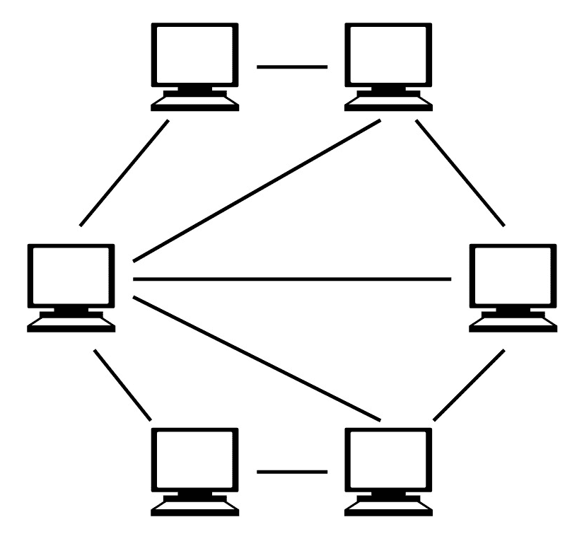
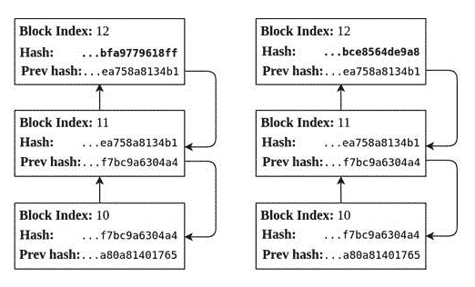
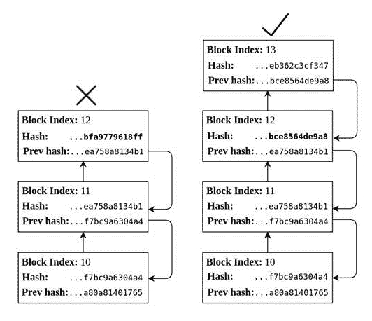
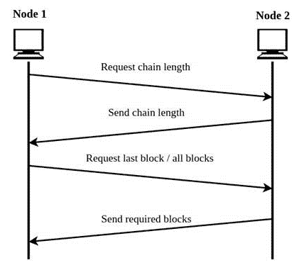
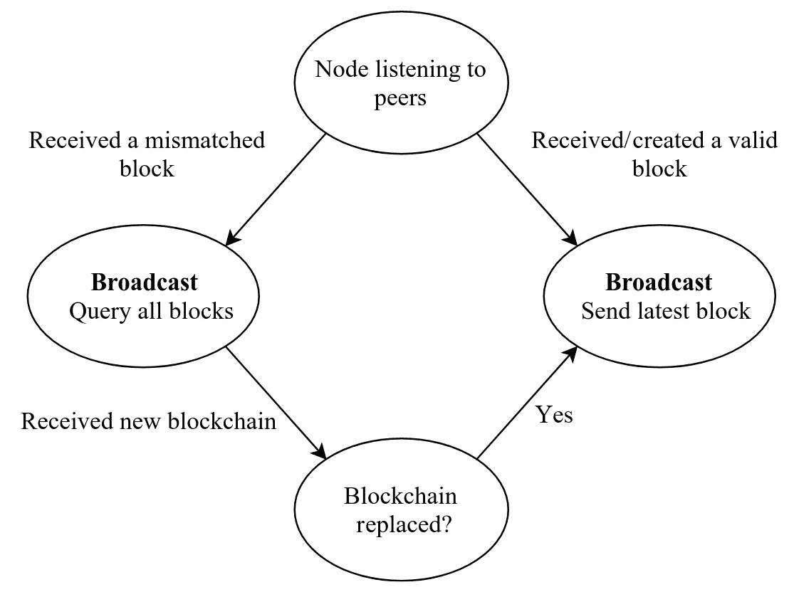
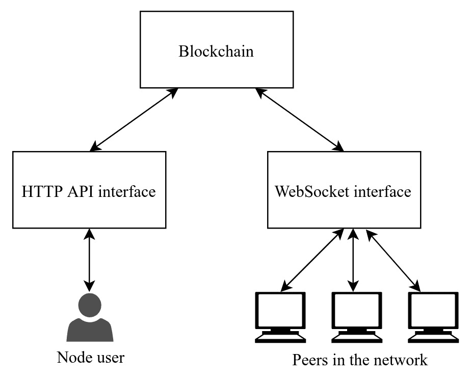

# 区块链中的网络

在前几章中，我们讨论了区块链在无信任网络中运行所必需的加密概念。但是我们还没有讨论无信任网络是什么。去中心化网络促进了无信任环境的形成。在本章中，我们将探讨区块链如何通过**点对点**（**P2P**）网络实现去中心化。

在本章中，我们将涵盖以下主题：

+   P2P网络

+   网络发现

+   区块同步

+   在P2P网络中构建简单的区块链

我们知道区块链是为了消除对单一中央机构的信任而创建的，它通过构建一个去中心化的网络来分散所有在其他情况下集中在单一实体中的任务。P2P网络是一种用于在区块链应用中实现这种去中心化的架构风格。我们将从探讨P2P网络的定义、历史和架构开始这一章节。

# 点对点（P2P）网络

P2P网络的基本定义是一种网络，其中称为节点的独立计算机组成的群体相互连接，共享数据而无需任何集中式服务器的帮助。它是建立在互联网之上的架构。在这种类型的网络中，参与者或节点被称为对等方，因为它们都是平等的，在网络中具有平等的责任。由于在P2P网络中没有特殊节点，因此每个对等方既是服务提供者又是消费者。

# P2P网络的历史

早期的万维网愿景与P2P网络的概念一致，其中每个用户都将成为网络的积极编辑和贡献者。USENET于1979年首次开发，强制执行了一种分散式模型，其中USENET服务器彼此通信以共享新闻文章。

尽管P2P模型在互联网的早期阶段被使用，但它最常见的用途是在文件共享服务中实现。P2P在文件共享中的应用由音乐共享应用Napster推广开来。然而，许多音乐服务都采用了类似的P2P文件共享模型。尽管Napster是先驱，但P2P中的文件共享由于BitTorrent协议而受到了很多关注，该协议允许任何数字媒体的文件共享。

# P2P网络架构

P2P网络是一种架构，其中每个对等方同时充当服务器和客户端。由于区块链网络通常在公共网络上实现，因此很难创建适合P2P网络的物理拓扑结构。为了创建这种架构，必须在实际物理网络拓扑结构上构建虚拟或逻辑网络覆盖。创建逻辑网络以在公共网络中实现资源索引和对等方发现的便利。虽然形成了覆盖网络，但数据将在TCP/IP网络上交换。

尽管底层物理网络可以遵循任何网络拓扑，但P2P架构中的逻辑网络将形成网状拓扑，以实现对等方之间更好的通信：



图4.1：部分物理网状拓扑

在物理网状拓扑中，每个节点都可以与任何其他对等方建立通信，无论是直接还是通过一些中间节点。如果拓扑是全网状拓扑，那么每个节点都将能够直接通信，其中每个节点都连接到网络中的所有对等方。偏好部分网状配置，因为构建全网状拓扑是昂贵的。

有两种主要的P2P网络分类，基于节点如何连接：**非结构化**和**结构化P2P网络**。

在非结构化网络中，对等方之间没有以有组织的方式相连。每个节点是随机连接到对等方，形成一个逻辑网状。建立非结构化网络很容易，由于节点的冗余分布，它们非常健壮。然而，这些网络也有缺点，例如可能导致请求泛滥，这是由于对资源分布的缺乏知识引起的。

结构化P2P网络叠加是按照特定的网络拓扑形式形成的，以确保节点能够高效地在网络上执行活动。创建结构化网络可以确保资源可以在网络的某个地方在一定时间内被获取。**分布式哈希表**（**DHT**）是一个广泛使用的结构化网络实现，提供分散式查找服务。DHT中的资源信息可以使用哈希表从表中存储的键/值对的键来检索。与键相关联的值提供了拥有资源的节点的信息。DHT也被用于BitTorrent文件共享协议，作为对中心化查找服务（如跟踪器）的替代。

DHT是在分布式系统中维护的查找服务。分布式系统中的节点负责维护从键到值的映射，提供资源信息。

现在我们已经了解了P2P网络架构的概述，让我们深入了解一些在P2P网络中用于构建分散式区块链网络的区块链技术概念。

# 网络发现

P2P网络中的网络发现至关重要。当新节点启动时，没有定义网络。新节点必须检测到至少一个区块链节点才能成为网络的一部分。节点可以通过多种方式确定对等方，从而发现网络。

不同的区块链框架使用自己的协议进行对等发现和高效路由。我们将从探索比特币的原始实现开始，以了解基本的P2P网络发现。

寻找要连接的节点列表的最简单方式是在几个众所周知的节点中硬编码。使用维护节点列表的中央服务器是另一种方法。比特币保存了关于DNS种子的信息，这提供了节点在最初设置时的高可靠性，并且会以比特币节点的IP地址列表作为响应。一旦检测到种子节点，节点将建立TCP连接以与该节点握手。握手通过发送版本、地址、本地区块链信息和其他相关信息来验证节点。

一旦节点与被其发现的节点建立连接，节点就可以查询关于连接到其对等节点的其他节点的信息。同样地，节点可以将自己的地址信息广播给连接的对等节点，以提高其可达性。每个节点还确保保持一定数量的活动连接的阈值，以避免不必要的带宽使用。

一些区块链平台，比如以太坊，使用了一个名为RLPx的密码P2P网络协议套件，它提供了一个通用的传输和接口，用于通过P2P网络进行应用程序通信。RLPx利用类似Kademlia的路由来确保网络的均衡形成。在初始节点握手后，数据包被封装为帧，然后进行加密。

# 区块同步

加入区块链网络的每个节点都需要更新其区块链的本地副本，以将其状态与网络其他部分的全局状态同步。这是通过区块同步实现的。需要更新其区块链的节点会发送一个包含区块高度信息的消息。任何拥有更长区块链的节点都会发送一个包含关于需要添加到主机节点的固定数量区块的元数据清单。现在节点通过引用收到的清单向所有对等节点发起请求，以获取单独的区块。节点应该确保在发送区块请求时不要让网络被大量区块请求所淹没。

区块同步是对于新加入节点来说一个漫长的过程。然而，一旦所有的区块都更新到最新状态，它就能验证区块中的信息，比如资产上的交易。只要节点重新连接网络后变得活跃，区块同步过程就可以重新初始化。

# 在P2P网络中构建简单的区块链

在[第三章](6d775eaf-4ee6-4463-b5e9-623f49c80aca.xhtml)中，《区块链中的加密》，我们探讨了如何利用诸如工作证明等算法在去中心化网络中实现共识。由于共识算法确保了拜占庭失败问题可以得到解决，因此可以在对等方之间没有信任的去中心化网络中保持全局真相。尽管共识算法提供了一种方便的方法来维护公共分类帐，但每个节点都必须执行一组操作来在分布式网络中维护分类帐。

我们已经创建了一个简单的区块链应用程序，可以在有新数据需要插入时连续扩展其记录。因为我们的区块链应用程序是部署在单个系统中的，并且区块是在其中创建的，所以我们还没有添加任何验证区块的机制。但是当我们将区块链部署为公共分类帐时，每个节点在接收到来自节点对等方的区块时都需要对其进行验证。

每个节点必须执行以下过程以在网络中达成共识：

+   验证每个传入的区块以确保其完整性，以便将其附加到本地区块链中。

+   选择去中心化网络中一个对等方发布的最长有效链。

+   每当有一些数据需要插入公共分类帐时，就创建一个有效的区块。

我们将构建一个简单的区块链应用程序，将区块链部署在P2P网络中。该应用程序是一个参考实现，将帮助我们理解区块链网络的去中心化。尽管此应用程序执行网络发现、区块同步和区块验证，但为简单起见，它并未遵循所有必需的协议。

现在让我们在深入实施之前探讨一下构建应用程序时需要考虑的一些设计考虑因素。以下各节涵盖了在此应用程序中使用的验证、区块同步和基本接口设计。

# 验证新区块。

尽管区块是由矿工节点在验证链中的所有先前区块后创建的，但每个网络中的节点都有责任执行区块验证，以确保该区块可以附加到本地区块链的副本中。区块验证是一个简单的过程，检查最新的区块是否具有指向上一个区块的指针或哈希引用。当一个区块包含复杂数据，例如一组交易时，必须验证独立的交易以验证该区块。由于我们将不处理区块内的任何复杂数据，因此验证交易超出了本章的范围。

# 选择最长的链。

在分散网络中找到全局真相是一项艰巨的任务，各种共识算法有助于实现这一目标。在上一章中讨论的工作量证明算法是第一个也是最好的解决方案。它确保由网络中合法节点贡献的工作量最多的链被创建为最长链。出于简单起见，本应用将不包含任何共识算法。

# 冲突解决

尽管选择一个区块可能看起来是一个明显的任务，但会出现两个或更多节点同时创建一个由于其区块中包含的不同内容而具有不同标识的区块的情况。当一个节点接收到相同高度的不同版本的区块时，它将根据到达的顺序将其中一个添加到区块链中，然后拒绝另一个或将其保留在内存池中。由于这个原因，网络中的节点可能会拥有不同版本的区块链。这称为临时分叉或软分叉。

软分叉是区块链中创建两个或更多不同版本的区块链的一种类型，原因是由于同时创建区块或某些故障。这种分叉是暂时的，并在较长的区块链通过网络传播后立即纠正。



图 4.2：由同时创建区块引起的区块冲突

*图 4.2* 展示了由于同时创建相同高度的区块而创建了两个区块链的情况。这两个区块链具有相同的高度和相同的区块，直到索引**11**。但是有两个不同版本的区块**12**。正如我们在图中所见，其中一个区块的哈希以**...bfa9779618ff**结尾，另一个哈希以**...bce8564de9a8**结尾。这两个区块都是有效的，因为它们的上一个哈希值与上一个区块的哈希值**...ea758a8134b1**相匹配。在这个阶段，其中一个区块将被插入到主链中，另一个将被拒绝。

尽管一个节点上的冲突已经解决，但是在整个网络中不会有区块链的全局真相，因为其他节点可能已经决定接受不同的区块。这将在区块链中创建一个临时分叉，因为一些节点拥有一个版本的区块链，而另一些节点拥有另一个版本。



图 4.3：通过接受更长链解决冲突

这种临时分叉不会长时间存在。一旦创建了一个更长的区块链，并且当一个新的区块被附加到其中一个链上时，每个节点都将拒绝较小的区块链，并用更长的区块链替换自己的区块链。*图 4.3*展示了在索引**12**处具有哈希值为**...bce8564de9a8**的区块链将被接受，因为它通过添加额外的区块增加了自己的区块链，从而形成了更长的链。

# 节点之间的区块交换

在本应用程序中，区块交换使用广播查询消息和区块来执行。新加入的节点经历一个初始块同步过程来更新其本地区块链的副本。

# 初始块同步

当一个新节点加入网络时，它会连接到网络中的一个可用对等节点；然后尝试与对等节点交换其区块信息，并在需要时更新本地区块链。



图4.4：初始块同步

节点在连接到对等节点后发送链长度或最后一个块查询消息。请求链长度等同于请求最后一个区块以确定其索引。如果接收的区块由于哈希不匹配而无法附加到本地区块链中，则节点会向其对等节点发送消息，要求其发送所有区块。节点也可以广播一条消息，请求所有区块，以确保其接收到最长的链。

# 广播情景

节点通过建立多个一对一连接在P2P网络中相互通信，因为没有一个单一的对等节点是完全可信的。保持多个连接强制每个节点向其连接的对等节点广播任何信息，以便将数据分发到整个网络并保持全局真相。

在我们的应用程序中，我们将在图4.5中所示的状态转换图中展示的几种情况下广播信息：



图4.5：广播的状态转换图

网络中的节点在以下情况下执行广播：

+   当一个节点创建一个新区块时，它必须将其广播到其所有连接的对等节点，以传播区块的信息

+   当节点从其对等节点接收到一个新区块时，它必须广播该区块，以便在P2P网络中传播该区块

+   当节点接收到一个与当前区块链不匹配的区块时，它会向其所有对等节点发送查询消息，以找到最长的链

# 应用程序接口

该应用程序提供两个用户接口：一个HTTP API接口用于访问和操作区块链信息，以及在所有节点上使用WebSocket接口以创建一个长期的双向通信通道：



图4.6：应用程序的接口

# 深入代码

这个应用程序由三个不同的类组成，分别是`Server`，它将处理区块链网络上的P2P通信。另外两个类是`Blockchain`和`Block`，它们在上一章节中有所涉及，并执行基本的区块链操作。`Blockchain`类还执行增强功能以验证从对等节点接收的区块，如应用程序架构中所讨论的。

# 服务器接口

服务器接口是使用名为`Sanic`的Python Web服务器框架创建的，该框架有助于以异步方式编写Web服务器逻辑：

背景：Sanic是一个轻量级的Web服务器框架，可用于构建高速Web服务器。它支持通过支持Shiny异步请求处理程序来进行异步编程。它利用名为`uvloop`的事件循环来实现更好的性能。

```
class Server(object): 

    def __init__(self): 

        self.app = Sanic() 
        self.blockchain = Blockchain() 
        self.sockets = [] 
        self.app.add_route(self.blocks, '/blocks', methods=['GET']) 
        self.app.add_route(self.mine_block, '/mineBlock', methods=['POST']) 
        self.app.add_route(self.peers, '/peers', methods=['GET']) 
        self.app.add_route(self.add_peer, '/addPeer', methods=['POST']) 
        self.app.add_websocket_route(self.p2p_handler, '/') 
```

`Server`类的上述代码片段创建了四个用于显示区块、挖掘（创建）新区块、显示节点当前对等体以及添加新对等体的REST API接口。我们将使用使用`add_route`方法创建的端点与我们的节点交互。

我们将使用WebSocket协议在节点之间执行P2P通信，因为它允许连接节点之间的双向通信，同时保持活动连接而不会对Web服务器造成过大的负载。

WebSocket是建立在TCP之上的通信协议，提供了双向通信通道，不同于HTTP。因为双方都可以同时发送和接收消息，所以可以用于P2P通信。

前面片段中定义的所有API接口都会调用以下方法：

```
    async def mine_block(self, request): 
        try: 
            newBlock = self.blockchain.generate_next_block(request.json["data"]) 
        except KeyError as e: 
            return json({"status": False, "message": "pass value in data key"}) 
        self.blockchain.add_block(newBlock) 
        await self.broadcast(self.response_latest_msg()) 
        return json(newBlock) 
```

前面的方法实现了生成用于追加新块所需的功能。由于它是一个HTTP POST方法，它接受一个称为`data`的参数，该参数在HTTP请求正文中发送。这些数据用于创建新块。如前所述，在应用程序设计部分，该方法将广播新创建的块。

本地区块链中存在的区块将通过此方法格式化并返回：

```
     async def blocks(self, request): 
         return json(self.blockchain.blocks) 
```

每当用户想要显式添加一个对等体时，他们将使用以下接口：

```
    async def add_peer(self, request): 

        asyncio.ensure_future(self.connect_to_peers
([request.json["peer"]]),        
        loop=asyncio.get_event_loop()) 
        return json({"status": True}) 
```

这个方法将一个异步的`connect_to_peers`任务添加到Web服务器的事件循环中。所有连接对等体的套接字信息都会被维护以供未来广播使用。

以下的实现从节点在初始连接后维护的所有对等体的套接字对象中提取地址和端口信息：

```
    async def peers(self, request): 
        peers = map(lambda x: "{}:{}".format(x.remote_address[0], x.remote_address[1]), self.sockets) 
        return json(peers)] 

    async def connect_to_peers(self, newPeers): 
        for peer in newPeers: 
            logger.info(peer) 
            try: 
                ws = await websockets.connect(peer) 

                await self.init_connection(ws) 
            except Exception as e: 
                logger.info(str(e)) 
```

`connect_to_peers` 方法初始化与所有已知对等体的WebSocket连接。这个方法也在使用HTTP接口添加新对等体时被调用。使用`init_connection`函数执行初始块同步。`p2p-handler`是一个WebSocket处理程序，负责侦听连接。它创建一个套接字并使用`init_connection`执行块同步：

```
    async def p2p_handler(self, request, ws): 
        logger.info('listening websocket p2p port on: %d' % port) 
        try: 
            await self.init_connection(ws) 
        except (ConnectionClosed): 
            await self.connection_closed(ws) 
```

当对等体断开连接时，套接字信息将被移除：

```
    async def connection_closed(self, ws): 

        logger.critical("connection failed to peer") 
        self.sockets.remove(ws) 
```

使用`init_connection`方法执行块同步，通过发送请求对等体的区块链最后一个块的查询消息。它还添加了一个消息处理程序，不断侦听来自对等体的消息：

```
    async def init_connection(self, ws): 

        self.sockets.append(ws) 
        await ws.send(JSON.dumps(self.query_chain_length_msg())) 

        while True: 
            await self.init_message_handler(ws) 
```

每个节点上的消息处理程序监听三种类型的消息。其中两种是查询消息，节点会通过查询本地区块链来响应。`RESPONSE_BLOCKCHAIN` 消息是本地节点发出的查询的响应。 这条消息将由 `handle_blockchain_response` 进一步处理：

```
    async def init_message_handler(self, ws): 
        data = await ws.recv() 
        message = JSON.loads(data) 
        logger.info('Received message: {}'.format(data)) 

        await { 
            QUERY_LATEST: self.send_latest_msg, 
            QUERY_ALL: self.send_chain_msg, 
            RESPONSE_BLOCKCHAIN: self.handle_blockchain_response 
        }[message["type"]](ws, message) 
```

以下方法将响应数据序列化为要发送给对等节点的查询消息请求：

```
    async def send_latest_msg(self, ws, *args): 
        await ws.send(JSON.dumps(self.response_latest_msg())) 

    async def send_chain_msg(self, ws, *args): 

        await ws.send(JSON.dumps(self.response_chain_msg())) 
```

当对等节点查询区块链时，整个区块链将被发送给连接的对等节点：

```
    def response_chain_msg(self): 
        return { 
            'type': RESPONSE_BLOCKCHAIN, 
            'data': JSON.dumps([block.dict() for block in self.blockchain.blocks])} 
```

以下代码片段从区块链中获取最后一个区块，并将其格式化为 JSON，以便通过套接字通道发送：

```
    def response_latest_msg(self): 

        return { 
            'type': RESPONSE_BLOCKCHAIN, 
            'data': JSON.dumps([self.blockchain.get_latest_block().dict()]) 
        } 
```

以下代码片段是用于查询连接的对等节点以获取区块链的查询请求消息：

```
    def query_chain_length_msg(self): 

        return {'type': QUERY_LATEST} 

    def query_all_msg(self): 

        return {'type': QUERY_ALL} 
```

以下方法在持续监听对等节点的请求和响应的消息处理程序中被调用。此方法被调用以处理对等节点发送的区块链信息：

```
    async def handle_blockchain_response(self, ws, message): 
        received_blocks = sorted(JSON.loads(message["data"]), key=lambda k: k['index']) 
        latest_block_received = received_blocks[-1] 
        latest_block_held = self.blockchain.get_latest_block() 

        if latest_block_received["index"] > latest_block_held.index: 
            logger.info('blockchain possibly behind. We got: ' + str(latest_block_held.index) 
                  + ' Peer got: ' + str(latest_block_received["index"])) 
```

如果区块的最后索引不大于本地区块链的最后索引，则会被拒绝，因为节点只对最长的链感兴趣：

```
            if latest_block_held.hash == latest_block_received["previous_hash"]: 
                logger.info("We can append the received block to our chain") 

                self.blockchain.blocks.append
(Block(**latest_block_received)) 
                await self.broadcast(self.response_latest_msg()) 
```

如果最后接收的区块满足哈希条件，则将其附加到本地区块链。如果满足条件，则将其广播到所有节点：

```
            elif len(received_blocks) == 1: 
                logger.info("We have to query the chain from our peer") 
                await self.broadcast(self.query_all_msg()) 
            else: 
                logger.info("Received blockchain is longer than current blockchain") 
                await self.replace_chain(received_blocks) 
```

如果最后一个区块不满足哈希条件，那么本地区块链可能落后一个以上区块。如果是完整的链，则本地副本将被接收的区块链替换。否则，将广播一条消息来查询整个区块链。

当一个节点接收到比当前本地副本更长的区块链时，它将验证整个区块链，然后替换整个本地区块链：

```
    async def replace_chain(self, newBlocks): 

        try: 
            if self.blockchain.is_valid_chain(newBlocks) and len(newBlocks) > len(self.blockchain.blocks): 
                logger.info('Received blockchain is valid. Replacing current blockchain with ' 'received blockchain') 
                self.blockchain.blocks = [Block(**block) for block in newBlocks] 
                await self.broadcast(self.response_latest_msg()) 
            else: 
                logger.info('Received blockchain invalid') 
        except Exception as e: 
            logger.info("Error in replace chain" + str(e)) 
```

`broadcast` 方法将所有请求和响应通过建立的套接字连接发送给与节点连接的所有对等节点：

```
    async def broadcast(self, message): 

        for socket in self.sockets: 
            await socket.send(JSON.dumps(message)) 
```

# 区块和区块链接口

`Block` 和 `Blockchain` 类方法与上一章中用于构建简单区块链的方法类似，唯一的增强功能是用于验证接收的区块的验证方法。

以下方法被调用以验证每个区块是否链接到其前一个区块：

```
    def is_valid_new_block(self, new_block, previous_block): 
```

以下条件验证了新区块的索引：

```
        if previous_block.index + 1 != new_block.index: 
            logger.warning('invalid index') 
            return False 
```

此条件通过比较区块的哈希值来执行哈希验证：

```
        if previous_block.hash != new_block.previous_hash: 
            logger.warning('invalid previous hash') 
            return False 
```

此条件检查了新添加区块的完整性，通过计算其摘要：

```
        if self.calculate_hash_for_block(new_block) != new_block.hash: 
            logger.info(type(new_block.hash) + ' ' + type(self.calculate_hash_for_block(new_block))) 
            logger.warning('invalid hash: ' + self.calculate_hash_for_block(new_block) + ' ' + new_block.hash) 
            return False 
        return True 
```

当节点希望使用从对等节点检索的区块链替换本地区块链时，将使用以下方法来验证整个区块链：

```
    def is_valid_chain(self, blockchain_to_validate): 
        if self.calculate_hash_for_block(Block(**blockchain_to_validate[0])) != self.get_genesis_block().hash: 
            return False 
```

此条件验证了硬编码的起源块：

```
        temp_blocks = [Block(**blockchain_to_validate[0])] 
        for currentBlock in blockchain_to_validate[1:]: 
            if self.is_valid_new_block(Block(**currentBlock), temp_blocks[-1]): 
                temp_blocks.append(Block(**currentBlock)) 
            else: 
                return False 
        return True 
```

通过调用 `is_valid_new_block` 迭代验证收到的每个区块：

# 运行区块链节点

尽管每个节点都有两个处理程序，一个用于HTTP接口，一个用于WebSocket接口。一个Web服务器应用程序实例足以为它们提供服务。*Sanic*使用`uvloop`作为调度程序。它异步处理请求：

```
if __name__ == '__main__': 

    server = Server() 
    server.app.add_task(server.connect_to_peers(initialPeers)) 
    server.app.run(host='0.0.0.0', port=port, debug=True) 
```

服务器应用程序被实例化，并创建了一个任务来连接节点到`initialPeers`，这是每个节点硬编码的。应用程序将使用默认端口创建一个Web服务器。

每个节点都将运行服务器应用程序以加入网络。一旦节点连接到其中一个对等方，其区块链就会与网络的更新后的区块链同步。

现在，我们将通过创建三个节点实例来运行该应用程序：node1、node2和node3。Node2将node1作为其初始对等方，而node3将node2作为其初始对等方。当我们运行所有三个节点实例时，它们将形成一个类似环形的网络。

通过调用每个节点的HTTP API端点`/peers`，让我们检查每个节点的对等信息：

+   **节点1**：["127.0.0.1:51160"]

+   **节点2**：["127.0.0.1:3001","127.0.0.1:35982"]

+   **节点3**：["127.0.0.1:3002"]

`3001`是分配给node1的端口号。Node2的端口号是`3002`，node3的端口号是`3003`。随机端口号是试图与node2通信的对等方的端口号。前述信息清楚地显示，node2已将node1添加为其对等方，而node3已将node2添加为其对等方。

当我们调用`/blocks` HTTP API端点时，所有节点都返回以下结果：

```
[ 
  { 
    "data": "my genesis block!!", 
    "hash": 
 "816534932c2b7154836da6afc367695e6337db8a921823784c14378abed4f7d7", 
    "index": 0, 
    "previous_hash": "0", 
    "timestamp": 1465154705 
  } 
] 
```

通过使用`/mineBlock` HTTP API端点，通过发送带有载荷`{"data": "created at node2"}`的POST请求，在node2处挖掘一个新的区块。由于所有节点都相互连接，形成一个网格，每个节点都将接收到新广播的区块，并更新其本地区块链账本。现在，每个节点反映以下区块链：

```
[ 
  { 
    "data": "my genesis block!!", 
    "hash": 
 "816534932c2b7154836da6afc367695e6337db8a921823784c14378abed4f7d7", 
    "index": 0, 
    "previous_hash": "0", 
    "timestamp": 1465154705 
  }, 
  { 
    "data": "created at node2", 
    "hash": 
 "29630fab36aa1e3abf85b62aee8f84b08438b90e9e19f39d18766cc9208b585c", 
    "index": 1, 
    "previous_hash": 
 "816534932c2b7154836da6afc367695e6337db8a921823784c14378abed4f7d7", 
    "timestamp": "1522069707" 
  } 
] 
```

根据这个示例：可以在该书的GitHub存储库中找到整个P2P区块链应用程序。它具有可用于使用Docker Compose设置Docker集群的配置。这将帮助您在单台机器上设置任意数量的区块链节点。

# 摘要

本章涵盖了在区块链应用中使用的P2P网络方面，通过构建具有基本功能的简单P2P应用程序。本章获得的基本架构知识将帮助您理解一些区块链平台中使用的高级网络概念。

现在，我们在涵盖了几个密码学和网络概念之后对区块链技术有了扎实的背景，我们将介绍区块链技术的原始和最强大的用例之一 - 加密货币。在下一章中，我们将应用到目前为止介绍的大部分概念，以理解和实现加密货币的用例。
