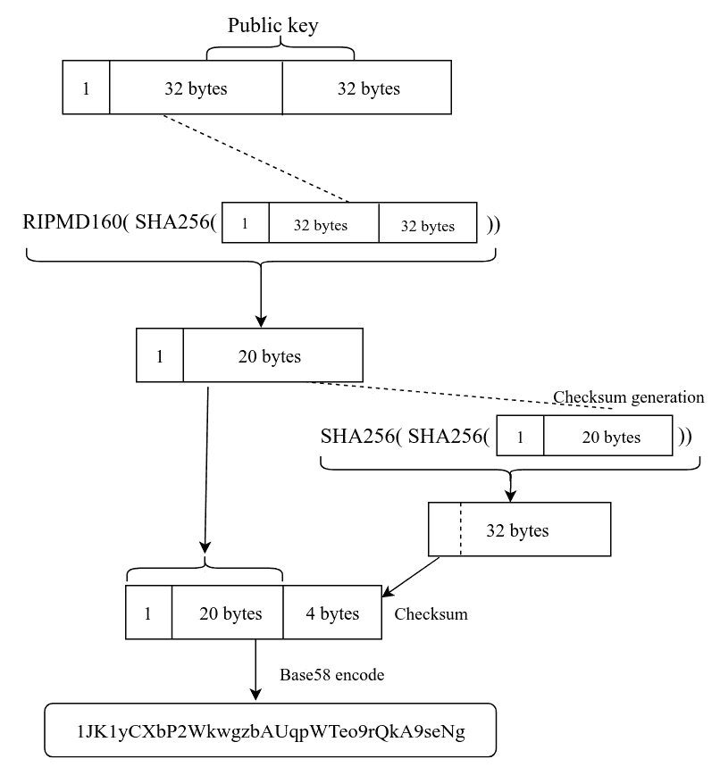
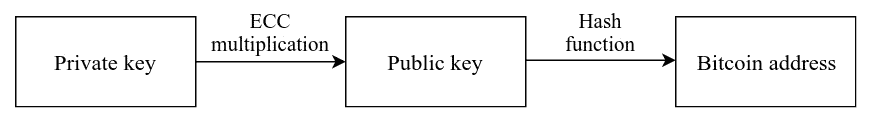
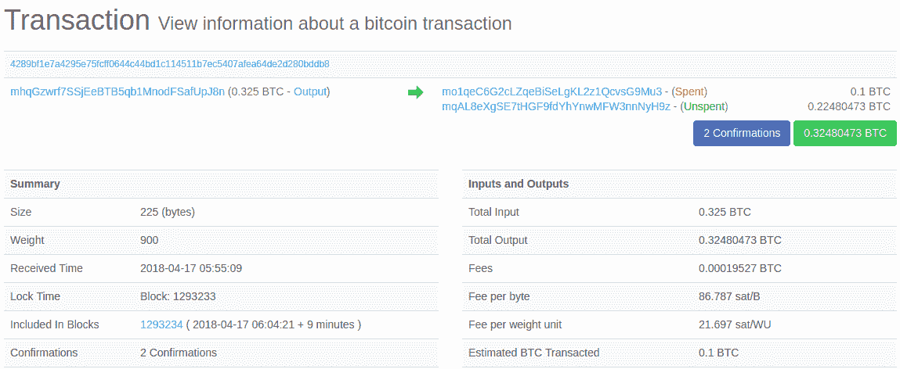
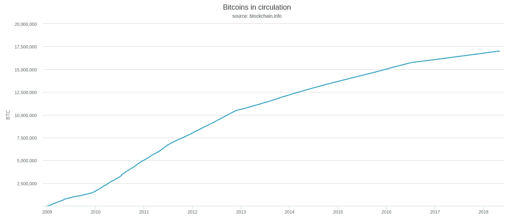
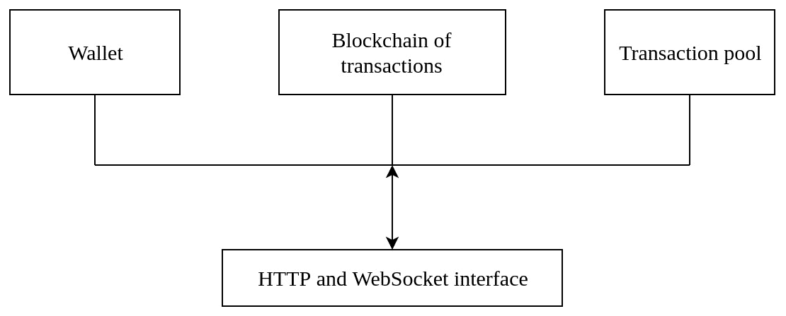
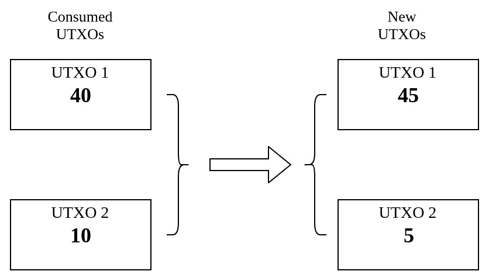

# 加密货币

在本章中，我们将探索区块链技术的原始和最佳实现——加密货币。加密货币不仅仅是一个区块链应用程序；它利用了诸如数字签名之类的加密基元来实现通过称为交易的原子事件来管理资产。在整个本章中，我们将熟悉理解加密货币与传统数字货币有何不同所需的所有概念。

在本章中，我们将涵盖以下主题：

+   比特币的基础知识

+   密钥和地址

+   交易

+   挖矿和共识

+   区块链

+   区块链网络

+   创建一个简单的加密货币应用程序

比特币是第一个成功部署在去中心化网络中的加密货币。由于其具有韧性的软件和基础设施、在各个领域的广泛采用以及高市值，比特币是迄今为止最知名的加密货币。截至2017年底，比特币的市值达到了3000亿美元，这是迄今为止所有加密货币中最高的。市场上的大多数加密货币都受到比特币的启发，并采用类似的设计。我们将使用比特币来了解加密货币中大多数相关概念，并在本章的后面部分，我们还将实现一个类似比特币的加密货币。

加密货币是一种使用密码学来确保、花费和验证交易价值的数字资产。加密货币可以从所有者转移到任何接收者，而无需中介来完成交易。尽管早期采用的加密货币提供了许多功能，如伪匿名性、更低的交易费用和消除中介的需求，但它从未实现真正的去中心化。已知存在问题，例如双花。这是因为单一资产转移到多个接收者，因为没有集中的来源来验证这些交易。当一个完全去中心化的加密货币——比特币在2009年创建时，所有这些问题都得到了解决。这是通过使用不可变的区块链在节点之间实现共识来首次解决了在去中心化网络中的双花问题。

# 比特币基础

比特币是加密学和去中心化共识算法的集合，它使得创造一个完全去中心化的数字货币生态系统成为可能。

比特币可以像传统货币一样使用。可以用来购买和出售商品和服务，或者只是向他人转账。比特币相对于传统货币有一些优势，比如较低的交易成本以及能够将货币转账到世界上的任何地方，因为它不受任何国家当局控制。比特币也是完全虚拟的，意味着没有实体形式的货币。比特币的价值是通过比特币的交易产生的。任何人都可以通过交易将比特币转账到特定的比特币地址。合法接收比特币的地址将通过与地址对应的秘钥进行标识。然后用户可以使用秘钥构建一个新的交易将比特币转账给其他人。一般来说，比特币地址是使用公钥创建的，而秘钥是私钥的对应。这些秘钥通常存储在一个称为钱包的软件应用程序中，但如果我们需要更好的安全性，它们也可以被备份和存储在任何地方。

我们知道，比特币是铺就了区块链发明之路的系统。它利用了我们迄今为止讨论过的所有概念，构建了一个在完全去中心化的**点对点**（**P2P**）系统中运作的加密货币。由于比特币的完全去中心化网络，没有必要有一个像银行这样的中心信任机构充当调解者和验证交易。相反，比特币生态系统中的每个人都参与确保有效交易的进行。

比特币软件是开源的，任何人都可以通过在智能手机或计算机等设备上运行该软件来加入比特币网络。在计算和存储能力有限的设备上可以使用比特币软件的轻量级版本。有一种特殊类型的节点称为矿工，它使用处理能力来验证交易并通过解决一个难解的加密难题为区块的创建做出贡献。这是一个哈希难题，更具体地称为工作证明共识算法，在[第三章](6d775eaf-4ee6-4463-b5e9-623f49c80aca.xhtml)中讨论过，*区块链中的加密技术*。每 10 分钟，一个矿工可以发布一个有效的区块，然后比特币网络中的每个人都会验证它。矿工以比特币作为奖励来补偿用于创建该区块的计算能力。由于挖矿竞争的加剧，难题的难度已经调整，以使平均区块创建时间保持在 10 分钟左右。

因此，每当矿工创建一个新区块时，新的比特币就会产生，并在比特币网络中流通。对比特币网络的流通总量设置了一个上限，它被硬性限制在 2100 万枚硬币。

总之，以下创新帮助比特币在完全无需信任的网络中生存下来：

+   一个去中心化的点对点（**P2P**）网络

+   区块链（公共分类账）

+   分散式共识算法（工作量证明）

+   交易验证规则

在本章中，我们将试图解释比特币如何利用这些概念，从而实现了它的创造。

# 开始使用比特币核心

比特币是由一个开源社区维护的实验性数字货币。比特币核心是一种开源软件，可实现该货币的使用。它是比特币系统的原始实现，最初由中本聪创建。

开源软件是指其源代码向公众开放，具有阅读、修改和重新分发的权利。虽然开源代码可以由不同的许可证覆盖，但大部分都可以免费用于任何目的。比特币是在MIT许可下发布的。

# 设置比特币全节点

比特币全节点可以用于开发目的，或者只是为了使用户成为比特币网络的一部分，以验证或探索交易。如果用户想要建立完整的开发环境，他们必须设置可能需要的所有工具、库和依赖应用程序，而安装软件只需不费吹灰之力。

# 安装比特币全节点

正如前面提到的，安装比特币全节点比设置开发环境简单得多。比特币全节点非常适合想要成为比特币网络一部分但不想担心任何实现细节的用户。

运行比特币全节点有一定的硬件要求。它需要专用存储空间，因为它必须存储公共分类账的所有区块。在撰写本文时，比特币区块链区块占用约180 GB的存储空间。比特币全节点还需要相当数量的内存和处理能力，以验证每个区块的交易。比特币可以相当轻松地安装在 Linux、macOS 和 Windows 平台上。

我们不会在这里提供安装细节，因为它因平台而异。您可以在该书的 GitHub 存储库 ([https://github.com/PacktPublishing/Foundations-of-Blockchain](https://github.com/PacktPublishing/Foundations-of-Blockchain)) 中找到不同平台的安装详情。此外，您可以在[https://bitcoin.org/en/full-node](https://bitcoin.org/en/full-node)上找到所有平台的安装说明。

# 从源代码编译

比特币开发环境是通过编译从比特币存储库获得的源代码来设置的。比特币核心的源代码托管在 GitHub 存储库中，使用 MIT 许可证。您可以克隆并获取所有分支，也可以下载特定版本的 ZIP 文件。

您可以使用 Git 工具从 [https://github.com/bitcoin/bitcoin.git](https://github.com/bitcoin/bitcoin.git) 仓库克隆比特币核心项目。项目克隆后，您可以使用最新的主代码或使用 Git 标签检出任何发布版本。

编译过程可能需要长达一个小时，具体时间取决于系统的硬件配置。编译源代码只涉及几个步骤，但它们耗时：

1.  作为第一步，比特币核心需要您运行一个名为`autogen.sh`的脚本，该脚本创建一组自动配置脚本，检查系统并确保系统具有编译代码所需的所有库。脚本的执行如下：

```
 $ ./autogen.sh
```

1.  下一步是使用配置脚本通过启用或禁用某些功能来自定义构建过程。因为大多数比特币核心功能都需要设置节点，所以我们可以使用默认功能构建比特币核心。配置脚本的执行如下：

```
 $ ./configure

```

1.  最后，源代码将被编译以创建可执行文件，并安装创建的可执行文件。使用以下命令实现：

```
      $ make
      $ make install
```

安装将创建一个名为`bitcoind`的二进制文件，它创建比特币守护进程，并创建一个名为`bitcoin-cli`的命令行工具，用于调用比特币 API 与本地比特币节点进行通信。

# 运行比特币节点

当执行`bitcoind`时，通过创建配置文件创建比特币守护进程。基本配置文件包括 JSON-RPC 接口的用户名和密码。在运行比特币节点时，可以指定几个选项来修改其行为。这些选项也可以在配置文件中指定。执行`bitcoind --help`以列出可用选项。创建配置文件后，可以执行`bitcoind`：

```
$ bitcoind -daemon
```

这将作为后台进程启动比特币核心。加载区块索引并验证区块可能需要几分钟时间。一旦创建了`bitcoind`进程，就可以使用`bitcoin-cli`工具检查状态。

以下命令显示有关比特币核心的一些基本信息以及一些本地区块链信息。在调用 API 时，`mainnet`链在那时已经挖掘了 519,993 个区块：

```
$ bitcoin-cli getblockchaininfo 
{ 
  "chain": "main", 
  "blocks": 519993, 
  "headers": 519993, 
  "bestblockhash": "0000000000000000000d4715ff499c5ce23c4b355634d4b59a2fe3823387dd12", 
  "difficulty": 3839316899029.672, 
  "mediantime": 1524733692, 
  "verificationprogress": 0.999994783377989, 
  "chainwork": "0000000000000000000000000000000000000000019897317fc702c4837762b2", 
  "pruned": false, 
... 
} 
```

比特币由比特币节点形成了几个区块链网络。每个网络维护不同的区块链。比特币的主网络称为`mainnet`，并且有一个称为`testnet`的测试网络。关于这个主题的更多信息在本章的*区块链和网络*部分有涉及。

# 与比特币节点通信

比特币核心通过 JSON-RPC 接口提供 API，以便与比特币节点进行通信。可以使用此接口在节点上执行大多数共识、钱包和 P2P 比特币操作。比特币使用 `8332` 作为主网的默认 JSON-RPC 服务器端口。用户应确保不允许任意机器访问 JSON-RPC 端口。暴露此接口将允许外部机器访问私人信息，这可能导致盗窃。

比特币有一个命令行界面工具，名为 `bitcoin-cli`，可用于访问所有 JSON-RPC API。

通过指定交易 ID，可以使用 `getrawtransaction` RPC 命令获取任何交易的详细信息：

```
$ bitcoin-cli getrawtransaction 
4289bf1e7a4295e75fcff0644c44bd1c114511b7ec5407afea64de2d280bddb802000000010e1bd74a37fa90e5e8de8e4c20ec42a26c70ef40330b5361c560d03f3c8ba7e9000000006a47304402201a62b24dcbeba9ec65478be8a12ccd31c3c984
9813782d1ca0bcab657a88762402204897f9c9e5e99de969fd5d076d80aebbaef19493f5e273663d4727864a67295b012102b21f43b03f57e029ea43f2cec448d4ff43740af4a68607507f34fd93be97bc30feffffff028096980000000000197
6a914523f63d0e9f8cb9519482fc6a8476689e57555e688ac59065701000000001976a91469cac07f09af880832eedbcbc7e0dea94fb68e2688acb1bb1300
```

输出是十六进制格式的序列化交易。然后可以使用 `decoderawtransaction` API 对此数据进行解码：

```
$ bitcoin-cli decoderawtransaction 
02000000010e1bd74a37fa90e5e8de8e4c20ec42a26c70ef40330b5361c560d03f3c8ba7e9000000006a47304402201a62b24dcbeba9ec65478be8a12ccd31c3c9849813782d1ca0bcab657a88762402204897f9c9e5e99de969fd5d076d80aebbaef19493f5e273663d4727864a67295b012102b21f43b03f57e029ea43f2cec448d4ff43740af4a68607507f34fd93be97bc30feffffff0280969800000000001976a914523f63d0e9f8cb9519482fc6a8476689e57555e688ac59065701000000001976a91469cac07f09af880832eedbcbc7e0dea94fb68e2688acb1bb1300
```

这会生成一个以人类可读的 JSON 格式解码的交易。我们将在本章的 *交易* 部分讨论解码后的交易。

# 通过 JSON-RPC 实现使用脚本语言进行通信

任何编程语言的 JSON-RPC 实现都可以用于与比特币节点进行通信。让我们使用 Python 的 JSON-RPC 实现执行一个 API，它将自动生成所有用于 RPC 调用的 Python 方法。Python 有几个支持 JSON-RPC 的库，但我们将使用 `python-bitcoinlib`，它不仅提供了 JSON-RPC 实现，还可以与比特币数据结构和协议进行接口交互。以下 Python 脚本接受十六进制格式的交易 ID，并使用 `lx()` 函数将其转换为原始字节。创建了一个 RPC 对象 `proxy_connection`，它可以用来调用任何 API。`gettransaction` API 将获取所提供交易 ID 的解码交易：

```
import bitcoin.rpc 
from bitcoin.core import lx 

bitcoin.SelectParams('testnet') 

proxy_connection = bitcoin.rpc.Proxy() 
tx_id = lx(input()) 
print(proxy_connection.gettransaction(tx_id)) 
```

# 密钥和地址

我们已经介绍了在理解加密货币中使用的密钥、地址和钱包所需的所有加密学概念。在本节中，我们将深入了解密钥和地址如何通过密码原语来控制资金所有权。

我们已经介绍了非对称加密是如何用于创建区块链网络中的公钥/私钥，这些密钥标识用户帐户。比特币生成用于标识用户并帮助他们通过数字签名声称资金所有权的公钥/私钥对。私钥在加密货币中也称为密钥，因为它对公众保密。数字签名是密码学中常见的概念，它允许密钥所有者为交易创建签名，并允许任何人验证交易。密钥所有者使用称为钱包的轻量级软件管理其所有密钥。密钥独立于区块链协议，由钱包创建和管理。

比特币使用地址来识别比特币用户。这些地址是从用户的秘密密钥派生的公共密钥的编码版本。让我们考虑一个银行业务的例子：爱丽丝通过签署一张支票并寄给鲍勃来向鲍勃转账。比特币使用类似的方法，通过使用秘密密钥签署交易并提供接收方的账户号码（比特币公共地址）来完成交易。唯一的公共信息是账户号码，这与将比特币地址公开的概念类似。

# 公共和私有密钥

使用非对称加密生成公共和私有密钥。私有密钥保密存放在用户的钱包中，而公共密钥以比特币地址的形式公开。比特币使用椭圆曲线加密生成公共/私有密钥对。私有密钥是随机选择的，并执行椭圆曲线乘法以生成公共密钥。椭圆曲线乘法是一种单向加密函数，使得从公开的公共密钥推导出私有密钥变得不可能。你可以在[第 2 章](bbe822af-c535-4a33-9783-168d174c48c1.xhtml)，*一点点密码学*中探索椭圆曲线加密的数学解释和分析。

比特币的私有密钥是随机选择的 256 位字符串或 64 位十六进制字符串。这意味着私有密钥可以是介于 1 和 2^(256) 之间的任意数字。因此，通过暴力破解 2^(256) 组合来找到公共密钥的对应私有密钥是不可能的。随机生成的私有密钥与比特币网络隔离，并在比特币钱包中保密存放。

比特币的命令行界面可用于生成秘密密钥。比特币有一套处理密钥和地址的 API。以下命令在本地钱包上执行。`dumprivkey` 获取已存在的从公共密钥生成的私有密钥：

```
$ bitcoin-cli getnewaddress
1JK1yCXbP2WkwgzbAUqpWTeo9rQkA9seNg
$ bitcoin-cli dumpprivkey 1JK1yCXbP2WkwgzbAUqpWTeo9rQkA9seNg
L2NAKvQsbkeQZyhfPRWw1juQ19ohxGCFbdr8izQSHEmKWYFtVjXK  
```

# 比特币公共地址

比特币中的公共地址由以数字 1 或 3 开头的公共密钥生成。大多数比特币地址有 33 或 34 个字符长，并使用 Base58 编码。比特币公共密钥地址始终代表秘密密钥的所有者，并用于交易的接收者字段。然而，地址也可以有不同的用途，例如表示在本章的*交易*部分中将要介绍的**支付到脚本哈希**（**P2SH**）交易中使用的付款脚本。

比特币地址是通过构建一个名为Base58Check的编码字符串从公钥派生出来的。Base58Check是一个Base58编码的字符串，附带固定字符作为错误检查码。代表比特币地址的Base58Check编码字符串有三部分——一个前缀版本字节，一个从公钥派生出来的有效载荷，和一个校验和。版本字节代表比特币地址的类型。*表5.1*展示了在比特币地址中找到的各种前缀：

| **前缀（Base58）** | **用途** |
| --- | --- |
| 1 | 比特币公钥哈希（P2PKH地址） |
| 3 | 比特币脚本哈希（P2SH地址） |
| 5 | 私钥（WIF） |
| m 或 n | 比特币测试网公钥哈希 |
| 2 | 比特币测试网脚本哈希 |

表5.1：用作版本字节的前缀（来源：https://en.bitcoin.it）

比特币公共地址的第二部分是通过使用`SHA256`和`RIPEMD160`哈希算法对公钥进行哈希计算得到的。正如我们已经知道的，哈希函数是单向函数，这使得无法从计算出的比特币地址派生出公钥。

在下面的函数中，`K`是从私钥派生出的公钥，`H`是比特币公钥哈希：

```
H = RIPEMD160(SHA256(K)) 
```

使用哈希函数构建哈希值`H`后，地址的第三部分——校验和，是从结果值计算出来的。最后，三个部分被连接并使用Base58编码进行编码，Base58编码使用58个字符（请参阅[第2章](bbe822af-c535-4a33-9783-168d174c48c1.xhtml)， *密码学知识点*，了解Base58编码的更多详情）来创建比特币公钥地址，如前面提到的Base58Check格式：



图5.1：从公钥生成比特币公共地址

*图5.1*显示了如何从64字节的公钥以及1字节的版本开始进行哈希计算，最初产生20字节的摘要。这就是有效载荷，然后对其进行编码以生成比特币地址。但最终地址还包括校验和位，用于防止错误。这4字节的校验和是通过使用SHA256哈希函数反复对有效载荷进行两次哈希计算并从结果的32字节摘要中提取初始4字节来计算出来的。

这个校验和与有效载荷和版本字节连接起来。最后，得到的字符串使用Base58编码系统进行编码以生成比特币地址，这将标识持有相应密钥的用户。

众所周知，从公开的比特币地址中生成私钥是不可能的。这是由于用于派生公钥的函数。公钥是使用椭圆曲线乘法来创建的，这是一个单向函数。同样，比特币地址是通过应用哈希函数来自公钥派生出来的，这些函数本质上也是单向函数。这也防止了任何人从比特币公共地址中生成公钥：



图5.2: 比特币地址生成的单向功能

*图5.2*描述了比特币地址生成中使用的单向功能。虽然代表持有私钥实体的身份的比特币地址为公众所知，但由于这些功能的单向性质，无法检索私钥。

# 交易

我们已经涵盖了比特币中用于在分布式网络中创建加密货币的许多概念。尽管比特币中的每个概念都在其中发挥着重要作用，但交易扮演着中心角色。比特币中的其他一切都旨在确保有效的交易安全地包含在区块链中并传播到整个节点网络中。

与使用基于账户的分类账的传统簿记不同，比特币维护基于交易的分类账。在将每笔交易输入比特币之前，必须对其进行验证。比特币节点引用这些交易。

包含在其他块或交易内存池中，以验证每个交易。在本节中，我们将深入探讨交易创建、验证和交易各部分的概念。

交易内存池是每个比特币节点维护的未确认交易的集合。内存池中的交易最终将被包含在区块链中。可以在[https://www.blockchain.com/btc/unconfirmed-transactions](https://www.blockchain.com/btc/unconfirmed-transactions)上实时查看比特币内存池。

# 交易的高级概览

在深入了解交易及其各部分的低级细节之前，让我们看一个例子，从用户角度说明了一个简单的比特币交易。假设Alice从她的比特币钱包向Bob的钱包发送了0.1比特币。由于她的钱包中已经拥有超过0.1比特币，将会创建一个有效的交易并传播到网络中。*图5.3*显示了在区块浏览器应用程序中的交易详情：



图5.3: 从Alice到Bob的比特币交易

本节中展示的交易详细信息均使用比特币的`testnet`区块链创建。您可以通过将比特币节点切换到testnet区块链来检查交易细节。区块浏览器应用程序也在testnet区块链中运行。您可以在[https://testnet.blockexplorer.com](https://testnet.blockexplorer.com)上验证这些交易。

交易对所有访问区块链的人都是可见的。需要使用十六进制编辑器读取交易，因为它们不是以人类可读的形式存储的。比特币核心的命令行界面可以读取原始交易并对其进行解码：

```
{ "txid": "4289bf1e7a4295e75fcff0644c44bd1c114511b7ec5407afea64de2d280bddb8", "hash": "4289bf1e7a4295e75fcff0644c44bd1c114511b7ec5407afea64de2d280bddb8", "version": 2, "size": 225, "vsize": 225, 
  "locktime": 1293233, 
  "vin": [ 
    { 
      "txid": "e9a78b3c3fd060c561530b3340ef706ca242ec204c8edee8e590fa374ad71b0e", 
      "vout": 0, 
      "scriptSig": { 
        "asm": "304402201a62b24dcbeba9ec65478be8a12ccd31c3c9849813782d1ca0bcab657a88762402204897f9c9e5e99de969fd5d076d80aebbaef19493f5e273663d4727864a67295b[ALL] 02b21f43b03f57e029ea43f2cec448d4ff43740af4a68607507f34fd93be97bc30", 
        "hex": "47304402201a62b24dcbeba9ec65478be8a12ccd31c3c
9849813782d1ca0bcab657a88762402204897f9c9e5e99de969fd5d076d80aebbaef19493f5e273663d4727864a67295b012102b21f43b03f57e029ea43f2cec448d4ff43740af4a68607507f34fd93be97bc30" 
  }, 
      "sequence": 4294967294 
    } 
  ], 
  "vout": [ 
    { 
      "value": 0.10000000, 
      "n": 0, 
      "scriptPubKey": { 
        "asm": "OP_DUP OP_HASH160 523f63d0e9f8cb9519482fc6a8476689e57555e6 OP_EQUALVERIFY OP_CHECKSIG", 
        "hex": "76a914523f63d0e9f8cb9519482fc6a8476689e57555e688ac", 
        "reqSigs": 1, 
        "type": "pubkeyhash", 
        "addresses": [ 
          "mo1qeC6G2cLZqeBiSeLgKL2z1QcvsG9Mu3" 
        ] 
      } 
    },  
    { 
      "value": 0.22480473, 
      "n": 1, 
      "scriptPubKey": { 
        "asm": "OP_DUP OP_HASH160 69cac07f09af880832eedbcbc7e0dea94fb68e26 OP_EQUALVERIFY OP_CHECKSIG", 
        "hex": "76a91469cac07f09af880832eedbcbc7e0dea94fb68e2688ac", 
        "reqSigs": 1, 
        "type": "pubkeyhash", 
        "addresses": [ 
          "mqAL8eXgSE7tHGF9fdYhYnwMFW3nnNyH9z" 
        ] 
      } 
    } 
  ] 
} 
```

`getrawtransaction` API 用于检索编码的交易。可以使用`decoderawtransaction`对其进行解码。可以使用比特币的命令行界面或任何RPC客户端调用这些命令。

原始交易的可读版本具有许多字段，在第一眼看起来可能会很压倒性。我们将在接下来的部分中介绍交易的一些组成部分，以便理解原始交易。

# 交易输入和输出

交易主要由输入和输出构成。每个交易可以有多个输入和输出。与基于账户的簿记不同，比特币需要跟踪每笔交易的输出。节点需要拥有所有交易输出信息才能知道账户的可消费余额。当用户想要花费他们的加密货币时，输出可以在交易的输入中被引用。这个输出由不可分割的货币块组成，在交易中消耗后才能分割。在任何交易输入中都没有被引用的输出被称为**未消费交易输出**或**UTXO**。

每当用户想要花费UTXO时，它必须完全花费。在花费UTXO后，任何多余的金额都将作为另一个UTXO返回给用户。这类似于现实世界中的货币，其中硬币无法分解为更小的值，并且会因支付超额金额而收到找零。让我们考虑之前的例子，阿丽斯向鲍勃发送了0.1比特币。正如我们在*图5.3*中所看到的，阿丽斯没有价值为0.1的UTXO。因此，阿丽斯消耗了价值为0.325的交易输出，这大于0.1。在向鲍勃发送0.1比特币后，剩余的金额将退回给阿丽斯，创建一个新的UTXO。从交易中我们可以看到，阿丽斯的账户得到了略少于0.225比特币的退款。

这是由于在将交易插入区块链时收取的交易费。此费用将被支付给执行工作量证明的矿工。此交易创建了两个输出值，0.1 和 ~0.225。这两个输出值必须完全被其他输入消耗。

# 交易输出

如前一节所述，每笔交易都会创建输出，后续交易输入可以消耗。每个完整节点客户端都会跟踪所有UTXO，以便通过检查UTXO池轻松验证每个交易输入。

让我们调查一下之前阿丽斯和鲍勃之间交易的输出。交易输出使用`vout`键来引用：

```
 "vout": [ 
    { 
      "value": 0.1, 
      "n": 0, 
      "scriptPubKey": { 
        "asm": "OP_DUP OP_HASH160 523f63d0e9f8cb9519482fc6a8476689e57555e6 OP_EQUALVERIFY OP_CHECKSIG", 
        "hex": "76a914523f63d0e9f8cb9519482fc6a8476689e57555e688ac", 
        "reqSigs": 1, 
        "type": "pubkeyhash", 
        "addresses": [ 
          "mo1qeC6G2cLZqeBiSeLgKL2z1QcvsG9Mu3" 
        ] 
      } 
    } 
  ] 
```

先前的`vout`是交易的输出之一。每个输出都有两个主要组成部分，**价值**和**密码条件**，它们解释了谁拥有这笔交易。在前述交易中，输出值表示转账给鲍勃的比特币数量，`scriptPubKey`是密码条件（或锁定脚本），它确保输出金额只能被鲍勃花费。 `scriptPubKey`具有几个包含序列化（`hex`）和反序列化（`asm`）格式的锁定脚本的字段。它还提供了一些额外信息，例如所需签名（`reqSigs`）、类型以及接收方的公共地址。虽然交易输出有几个字段，但对于一笔交易来说，只有锁定脚本是感兴趣的，其他字段可以由它派生。大部分锁定脚本是用户公共地址的简单表示。我们将在本章的后面更深入地研究锁定脚本。

# 交易输入

当用户希望进行比特币交易时，交易输入会引用UTXO。交易输入使用解锁脚本来声明UTXO。有效的交易输入通过这个解锁脚本证明对UTXO的所有权。

一个交易输入可以有多个输入指向多个UTXO。交易输入确保有足够的UTXO使交易得以进行。在前面的示例中，交易输入有一个指向UTXO的单个输入：

```
"vin": [ 
    { 
      "txid": "e9a78b3c3fd060c561530b3340ef706ca242ec204c8edee8e590fa374ad71b0e", 
      "vout": 0, 
      "scriptSig": { 
        "asm": "304402201a62b24dcbeba9ec65478be8a12ccd31c3c9849813782d1ca0bcab657a88762402204897f9c9e5e99de969fd5d076d80aebbaef19493f5e273663d4727864a67295b[ALL] 02b21f43b03f57e029ea43f2cec448d4ff43740af4a68607507f34fd93be97bc30", 
        "hex": "47304402201a62b24dcbeba9ec65478be8a12
ccd31c3c9849813782d1ca0bcab657a88762402204897f9c9e5e99de969fd5d076d80aebbaef19493f5e273663d4727864a67295b012102b21f43b03f57e029ea43f2cec448d4ff43740af4a68607507f34fd93be97bc30" 
      }, 
      "sequence": 4294967294 
    } 
  ], 
```

单个UTXO足以完成交易。*图5.3*显示，这个单个UTXO的价值为0.325，足以向鲍勃发送0.1的价值。交易输入通过使用交易ID（`txid`）和创建此UTXO的交易的序列号来指向UTXO。与交易输出一样，交易输入包含一个解锁脚本，用于证明用户对UTXO的索赔并确保交易有效。花费者最初检索UTXO并使用交易ID引用它。解锁脚本使用解锁资金所需的秘密信息。一个简单的解锁脚本将带有使用私钥签名的数字签名和相应的公钥。但是，表示可能是复杂的，但这是我们将在下一节更详细地介绍的内容。

在这个例子中，爱丽丝使用`txid`指向交易中可花费的UTXO。然后爱丽丝创建一个解锁脚本并将其放置在交易的`scriptSig`字段中。每个得到交易的人都将通过检查UTXO中的锁定脚本来验证它。

如前所述，除了 Alice 打算转账给 Bob 的 0.1 比特币之外，她还需要支付交易费用。但是，在原始交易结构中没有交易费用字段。通过检查所有引用的 UTXO 的值然后从交易输入值中减去此值来计算。这不被跟踪在交易输出中的附加值形成交易费用。每个矿工将为每个交易计算费用，并将合并的值作为特殊的 coinbase 交易奖励给自己。我们将在本章的*挖矿和共识*部分更多地涵盖 coinbase 交易。

# 交易验证

交易验证是通过解锁脚本和锁定脚本来执行的。比特币使用一种简单的自定义脚本语言称为 Script，它类似于基于堆栈的执行语言 Forth。为了验证交易，执行输入中的解锁脚本与其相应的锁定脚本。基于堆栈的执行应返回一个真值并成功执行解锁脚本。

在示例中，按顺序评估了输入的 `scriptSig` 和引用的输出的 `scriptPubKey`，其中 `scriptPubKey` 使用 `scriptSig` 留在堆栈上的值。如果 `scriptPubKey` 返回真，则授权输入。

# Script

在尝试理解锁定和解锁脚本之前，我们需要了解 Script 语言的基本执行方式。Script 是一个简单的基于堆栈的语言，从左到右进行处理。它有意地不是图灵完备的。它没有复杂的控制流程，如循环，除了条件。这确保了程序在可预测的时间内执行。这是有意为之，以避免拒绝服务攻击，这些攻击会创建无限执行循环。Script 语言的简单性确保了比特币不会受到这种攻击的任何影响。

Script 也是无状态的，这意味着在执行之前或之后没有存储任何信息。这确保了执行不受系统的任何其他方面的影响，并且脚本可以在任何系统上执行。

Script 是一种基于堆栈的语言，因为它在执行过程中使用堆栈数据结构。堆栈数据结构对数据项执行推送和弹出操作。推送操作将项添加到堆栈顶部，弹出操作删除最后插入的项。Script 通过从左到右处理项来执行程序。每当遇到数据项时，就将其推送到堆栈上。

操作员从堆栈中弹出一个项目并对它们执行操作，然后将结果推回到堆栈中。脚本具有一个庞大的操作员集合，这些操作员由操作码表示，可以用于项目上。诸如`OP_ADD`之类的算术操作码对堆栈顶部的两个项目执行加法，而条件`OP_EQUAL`操作码评估条件，产生布尔结果。比特币交易脚本主要由一个条件运算符组成，其最终结果必须在交易被视为有效时评估为真值。

# 脚本示例

让我们通过一个简单的例子来执行该脚本：

```
2 4 OP_ADD 6 OP_EQUAL 
```

脚本的执行从左边开始。当执行开始时，数据常量`2`和`4`被插入到堆栈中。接下来，脚本执行一个加法操作，由`OP_ADD`操作员表示。加法操作在弹出堆栈顶部的两个项目后执行，因此 *2 + 4 = 6*。结果被推回到堆栈中。当遇到它时，数据常量`6`被推到堆栈中。最后，在堆栈项目上执行条件`OP_EQUAL`操作员。最后两个项目从堆栈中弹出并进行比较，以查看它们是否相等。由于我们堆栈中的最后两个数据项是`6`，所以相等条件将返回一个`TRUE`值。

# 锁定和解锁脚本

比特币使用类似的脚本执行方法，但具有不同的操作码集。比特币交易使用锁定和解锁脚本，这些脚本一起执行以验证交易。如前所述，锁定脚本是在交易输出中指定的支出条件，而解锁脚本在执行两个脚本时满足这个条件。

我们可以通过分解前面的脚本示例来创建一个简单的锁定和解锁脚本。脚本的一部分可以形成一个锁定脚本，如下所示：

```
4 OP_ADD 6 OP_EQUAL 
```

这只能通过解锁脚本来满足：

```
2 
```

任何节点都将通过按顺序组合和执行锁定和解锁脚本来验证这些脚本，就像前面的示例中所示：

```
2 4 OP_ADD 6 OP_EQUAL 
```

但这些只是基本脚本，任何具有基本算术技能的人都可以创建一个解锁脚本以花费交易输出。这就是为什么比特币使用一个具有密码难题的复杂条件作为锁定脚本。只有具有私钥的合法所有者才能通过创建具有解锁脚本的证明来花费资金。

在比特币中，锁定脚本被称为`scriptPubKey`，就像在*交易*部分的早期交易示例中看到的那样。这是因为在锁定脚本中使用了公钥哈希（比特币地址）来将资金转移到相应私钥的所有者。类似地，解锁脚本可以在交易输入的`scriptSig`字段中找到。解锁脚本通常通过创建数字签名来证明与公钥对应的私钥的所有权。这就是为什么解锁脚本通常被称为`scriptSig`的原因。

类似于示例，比特币交易验证者通过执行合并的锁定和解锁脚本来验证交易。验证者检索交易输入引用的UTXO，并将锁定和解锁脚本并排放置以进行顺序执行。

# 交易脚本类型

比特币目前创建两种不同的基本`scriptSig`/`scriptPubKey`对。在比特币交易中很少使用复杂的交易脚本。**付款至公钥哈希**（**P2PKH**）和**付款至脚本哈希**（**P2SH**）是最受欢迎的脚本。比特币网络中执行的大多数脚本使用P2PKH作为它们的交易脚本。

**P2PKH**

比特币交易创建一个带有名为P2PKH的公钥哈希的输出交易。公钥哈希表示用户持有的相应私钥的比特币公共地址。用户使用接收者的公共地址创建一个锁定脚本。除了相应私钥的持有者外，没有人能够索取交易输出。

在我们之前的示例中，Alice创建了一个包含`scriptSig`的交易输入，并使用`scriptPubKey`创建了交易输出。

以下脚本显示了`scriptPubKey`和`scriptSig`的语法：

```
scriptPubKey: OP_DUP OP_HASH160 <pubKeyHash> OP_EQUALVERIFY 
OP_CHECKSIG 
scriptSig: <sig> <pubKey> 
```

验证者将合并脚本并按顺序执行它们：

```
<sig> <pubKey> OP_DUP OP_HASH160 <pubKeyHash> OP_EQUALVERIFY 
OP_CHECKSIG 
```

花费者记录的签名（`sig`）和公钥（`pubKey`）被推送到堆栈中。`OP_DUP`运算符在堆栈中复制`pubKey`。下一个运算符，`OP_HASH160`，使用`SHA256`和`RIPEMD160`算法计算公钥的160位哈希值：

```
RIPEMD160(SHA256(pubKey)) 
```

锁定脚本中的`pubKeyHash`值被推入堆栈。`OP_EQUALVERIFY`运算符验证解锁脚本中创建的公钥哈希与之前推送到堆栈的`pubKeyHash`值是否相等。如果锁定和解锁脚本的公钥哈希匹配，则返回`TRUE`值。最后，`OP_CHECKSIG`从堆栈中弹出`sig`和`pubKey`，执行数字签名验证，并验证签名是否有效。一旦验证成功，脚本返回`TRUE`值，表示解锁脚本有效。

**P2SH**

P2SH是早期比特币开发者之一**加文·安德森**引入的。根据加文·安德森的说法，P2SH是有目的地创建的：

"将供应赎回交易的条件的责任从资金发送方移交给赎回方。"

– 安德森

在P2SH中，资金寻址到脚本的哈希而不是公共地址。这个脚本被称为赎回脚本，其中包含了花费资金所需的所有条件。正如Gavin Andresen所说，交易的创建者无需担心花费资金的条件，只需提及包含条件的脚本的哈希。当需要花费资金时，赎回者应提供与提及的脚本哈希匹配的脚本，并确保脚本求值为true。

P2SH提供了一种进行复杂交易的方式，不像P2PKH对`scriptPubKey`和`scriptSig`有特定的定义。该规范对脚本没有任何限制，因此任何脚本都可以使用这些地址进行资金支付。脚本的概念类似于智能合约的概念，这将在[第7章](6bcd989e-2411-4096-91e1-943698f1702e.xhtml)，*深入区块链-所有权的证明*中进行讨论。

# 挖矿和共识

比特币中的挖矿是在去中心化的比特币网络中实现区块链状态共识的一个至关重要的概念。比特币网络中的任何节点都可以执行挖矿操作，并且这些节点会因为它们对挖矿的贡献而获得激励。这导致了对挖矿和奖励之间的混淆。尽管奖励是挖矿的一部分，但挖矿并不只是为了奖励。挖矿是比特币网络去中心化的机制，通过构建一个被所有人接受的区块链，在不可信任的网络中实现节点之间的共识。

与任何其他比特币节点一样，矿工也会验证新的交易并将它们存储在本地内存池中。除了执行验证，矿工还会创建一个交易块并解决哈希难题，以将创建的区块包括在全球比特币总账中。一旦创建的区块被纳入区块链，矿工将获得两种激励：每笔交易的交易费和每个区块中新创建的比特币。交易费是每笔交易处理所收取的费用，并且由交易的创建者附加。每个区块都有一个特殊的交易，创建新的比特币并将其授予负责创建区块的矿工。这种特殊的交易被称为coinbase交易，负责创建新的比特币。

由于比特币总量存在硬性上限（2100万枚），在未来的某个时间点，矿工只会从交易费用中获得激励。每挖掘出210,000个区块，矿工获得的新铸比特币最大数量就减半一次。由于每个区块的创建时间保持在约10分钟左右，每四年就会创建出210,000个区块。激励从2009年比特币启动时的每个区块50个比特币开始，之后在2012年和2016年分别减半。

目前，每个区块的矿工奖励为12.5个新铸币的比特币：



图5.4：截至2018年的比特币货币供应量（来源：www.blockchain.info）

*图5.4*显示了比特币随时间的供应量。由于每个区块的比特币奖励减半，曲线呈几何减少趋势。比特币网络可能在2140年之前供应2100万枚硬币。当年份接近2040年时，图中的线将几乎平行于x轴。

# 挖掘一个区块

比特币网络中的任何节点都可以创建一个区块并自称为矿工。矿工必须运行维护完整区块链的比特币节点。虽然挖矿操作可以使用最小的硬件要求执行，但由于比特币节点之间的激烈竞争，使用最小硬件配置的独立计算硬件进行挖矿已经不再具有盈利性。这就是为什么比特币矿工经常运行具有更高处理能力的专用计算机硬件，如GPU。

由于矿工之间的竞争加剧，比特币的挖矿难度增加了。矿工开始构建专门用于挖矿的专用集成电路。这些专用集成电路被称为**专用集成电路**（**ASICs**），它们不能用于通用计算。有几家比特币ASIC制造商生产不同规格的ASIC。Bitmain的Antminer设备是最广泛使用的ASIC。

每个矿工节点还将监听比特币网络以获取新的交易和区块。在得出他们已成功挖掘新区块之前，他们会执行几项任务：

+   交易验证

+   将交易汇总到区块中

+   使用工作量证明算法挖掘区块

# 交易验证

正如我们所看到的，每个有效的交易是通过收集UTXO并使用适当的脚本来解锁它们，然后使用锁定脚本创建的，该脚本将资金锁定给下一个所有者。交易被广播到比特币网络，以便每个人都知道区块链的更新状态。广播交易还确保交易到达矿工节点并包含在任何创建的区块中。

尽管交易在广播到网络之前会被验证，但矿工节点在将其包含在区块之前总是验证每一笔交易。一个无效的交易可能会导致整个区块被比特币网络拒绝。为防止不必要的损失，矿工总是确保只有有效的交易被包含在区块中。

# 将交易聚合到一个区块中

就像比特币网络中的任何完整节点一样，矿工会累积它收到的所有交易，并将它们添加到本地内存池中。矿工将开始构建一个候选区块，该区块可以通过包含区块中的一组交易来插入区块链。节点会确保在区块构建过程中每次有新区块到来时，候选区块中的所有交易都应该被忽略，因为这将创建重复的交易。

一旦为区块和交易创建了所有的元数据，矿工通过执行工作证明（Proof of Work）来解决哈希难题。一旦成功为区块创建了工作证明，该区块就会立即被广播到比特币网络中。

# Coinbase 交易

比特币区块链中创建的每个区块都有一种特殊类型的交易，即区块的第一笔交易。这笔交易是由矿工创建的，用于奖励自己通过交易费和新创建的比特币，就像前面提到的那样。

这是比特币主网区块 520,956 的 coinbase 交易。解码该区块的第一笔交易将给出以下细节：

```
$ bitcoin-cli getrawtransaction fc72760e6339eb43111034d76e67ffce69f9f3a4a5aa53f29dfe7299623bbba8 
{ 
  "txid": 
"fc72760e6339eb43111034d76e67ffce69f9f3a4a5aa53f29dfe7299623bbba8", 
  "hash": 
"d06aecb12c942dfd059b0d6ef7fbb76f8310fb2cfd4159984c8dce32d3f94b8f", 
  "version": 2, 
  "size": 243, 
  "vsize": 216, 
  "locktime": 0, 
  "vin": [ 
    { 
      "coinbase": 
"03fcf20704ff5bea5a622f4254432e434f4d2ffabe6d6dcc95de16874f4618351fc3946c8590509f1c5b0ac2ce802d71786eaef2f0da4301000000000000006e9694143ddc55d500000000",
 "sequence": 4294967295 
    } 
  ], 
  "vout": [ 
    { 
      "value": 12.59334356, 
      "n": 0, 
      "scriptPubKey": { 
        "asm": "OP_DUP OP_HASH160 
 78ce48f88c94df3762da89dc8498205373a8ce6f OP_EQUALVERIFY 
 OP_CHECKSIG", 
        "hex": 
 "76a91478ce48f88c94df3762da89dc8498205373a8ce6f88ac", 
        "reqSigs": 1, 
        "type": "pubkeyhash", 
        "addresses": [ 
          "1C1mCxRukix1KfegAY5zQQJV7samAciZpv" 
        ] 
      } 
    },  
    { 
     "value": 0.00000000, 
      "n": 1, 
      "scriptPubKey": { 
        "asm": "OP_RETURN 
 aa21a9edcde65b6fb3a180d2d81bdaab66592c9c2deb778ca3b3464e31d5209737
 e67f1b", 
        "hex": 
 "6a24aa21a9edcde65b6fb3a180d2d81bdaab66592c9c2deb778ca3b3464e31d52
 09737e67f1b", 
        "type": "nulldata" 
      } 
    } 
  ] 
} 
```

Coinbase 交易在交易输入中没有任何指向未使用交易输出 (UTXO) 的引用，因为该金额是来自新币和交易费。交易输出中提到的地址是矿工自己的比特币地址，因此 coinbase 交易的所有资金都被完全转移到了矿工名下。

# 使用工作证明算法挖掘区块

工作证明算法在比特币中用于在比特币网络中达成关于属于区块链的区块的共识。它有助于在网络中的节点之间实现分类帐数据的一致性。工作证明算法可以创建证明一定量的工作已经被完成以创建区块。

比特币的工作证明是一个使用 SHA256 哈希函数寻找所需哈希值并解决难题的哈希难题。比特币中使用的工作证明算法类似于 [第 3 章](6d775eaf-4ee6-4463-b5e9-623f49c80aca.xhtml)《区块链中的密码学》 中解释的算法。您可以参考 [第 3 章](6d775eaf-4ee6-4463-b5e9-623f49c80aca.xhtml)《区块链中的密码学》来获取有关工作证明算法的实现和分析的更多细节。

# 挖矿池

我们知道，比特币中的挖矿难度会调整以保持平均区块创建时间为10分钟。但由于矿工之间的激烈竞争，解决哈希难题的难度随着时间的推移而增加。

这迫使矿工升级其硬件以实现更高的哈希率。拥有有限资源的矿工无法与拥有大量计算资源的矿工竞争。这就是引入矿池的时候，用于汇集个人有限资源矿工资源的时候。

一个矿池是矿工计算资源的集合，用于共享计算能力并获得更高的哈希率以解决哈希难题。如果矿池的组合哈希能力解决了一个区块的哈希难题，那么每个加入矿池的矿工都将根据其贡献的哈希能力获得奖励。在不同语言中实现了许多矿池。矿工可以加入任何一个矿池服务器并开始贡献哈希能力。Slush Pool是最古老的矿池，曾被称为**Bitcoin.cz Mining**。

矿池使用不同的协议在矿工和矿池服务器之间进行通信。getblocktemplate、getwork和stratum协议是矿池中使用的一些挖矿协议。stratum挖矿协议是一种广泛使用的协议，旨在取代getwork协议。

连接到矿池服务器的每个矿工都必须遵循一些步骤才能成功贡献到矿池挖矿中：

+   矿工必须在开始工作之前使用正确的凭据进行授权。

+   然后他们需要获取一个工作的交易集。

+   最后，矿工需要将工作提交给服务器，并附上用户名和工作细节。

有几种方式可以分配矿工的份额。大多数矿池根据矿池创建的区块的矿工份额对矿工进行奖励。

哈希率是区块链挖矿中用于确定矿工的计算能力或哈希能力的单位。它只是每秒钟产生的哈希数量。

# 区块链

比特币中的区块链是一系列有序的区块列表，将上一个区块与哈希指针连接起来。比特币使用Google的`LevelDB`数据库存储区块链元数据。每个区块的身份是通过使用区块头的SHA256哈希值创建的，并且该区块哈希值存储在区块链中下一个区块的区块头中，以形成链接。

# 区块结构

比特币区块的数据结构包含一系列交易和关于该区块的元数据信息。一个区块由头部和体部组成，其中包含所有交易。一个区块平均包含500多个交易。

*表5.2* 展示了区块中包括的所有字段。区块的主要部分是头和交易，占用的大小会有所不同。每个字段展示了区块中的大小或者交易所占用的大小：

| **字段** | **描述** | **大小** |
| --- | --- | --- |
| 魔数 | 值始终为0xD9B4BEF9 | 4字节 |
| 区块大小 | 截至区块末尾的字节数 | 4字节 |
| 区块头 | 包括六个项目 | 80字节 |
| 交易计数器 | 整数计数 | 1 - 9字节 |
| 交易 | 交易列表 | 可变 |

表5.2：区块结构

# 区块头

区块头存储了区块的元数据，其大小为80字节，如前表所示。它存储了版本信息，可以用来识别区块。`hashPrevBlock`存储了前一个区块的256位哈希值，将区块链接起来，并确保区块链的完整性。`hashMerkleRoot`是交易的哈希摘要，并确保了交易的完整性。

时间、难度位和随机数字段与工作量证明共识算法有关：

| **字段** | **用途** | **大小** |
| --- | --- | --- |
| `Version` | 区块版本 | 4字节 |
| `hashPrevBlock` | 上一个区块头的256位哈希 | 32字节 |
| `hashMerkleRoot` | 基于区块中所有交易的256位哈希 | 32字节 |
| `时间` | 从1970-01-01T00:00 UTC以来的当前时间戳（秒） | 4字节 |
| `Difficulty Bits` | 以紧凑格式表示的当前目标（[https://en.bitcoin.it/wiki/Target](https://en.bitcoin.it/wiki/Target)） | 4字节 |
| `Nonce` | 32位数字（从0开始） | 4字节 |

表5.3：区块头

# 创世区块

创世区块是比特币区块链中的第一个区块，由中本聪创建。它是静态编码的，以便每个运行比特币核心节点的人只会相信一个区块链状态。

可以通过获取第0个索引的区块哈希来获取创世区块的哈希：

```
$ bitcoin-cli getblockhash 0 000000000019d6689c085ae165831e934ff763ae46a2a6c172b3f1b60a8ce26f 
```

以下是比特币创世区块的详细信息。该区块中有一个coinbase交易，没有其他交易：

```
$ bitcoin-cli getblock 000000000019d6689c085ae165831e934ff763ae46a2a6c172b3f1b60a8ce26f 
{ 
  "hash": "000000000019d6689c085ae165831e934ff763ae46a2a6c172b3f1b60a8ce26f", 
  "confirmations": 521239, 
  "strippedsize": 285, 
  "size": 285, 
  "weight": 1140, 
  "height": 0, 
  "version": 1, 
  "versionHex": "00000001", 
  "merkleroot": "4a5e1e4baab89f3a32518a88c31bc87f618f76673e2cc77ab2127b7afdeda33b", 
  "tx": [ 
    "4a5e1e4baab89f3a32518a88c31bc87f618f76673e2cc77ab2127b7afdeda33b" 
  ], 
  "time": 1231006505, 
  "mediantime": 1231006505, 
  "nonce": 2083236893, 
  "bits": "1d00ffff", 
  "difficulty": 1, 
  "chainwork": "0000000000000000000000000000000000000000000000000000000100010001", 
  "nextblockhash": "00000000839a8e6886ab5951d76f411475428afc90947ee320161bbf18eb6048" 
} 
```

区块的coinbase交易除了有其交易输入中的正常数据外，还有以下文本：

```
The Times 03/Jan/2009 Chancellor on brink of second bailout for banks
```

这证明第一个区块是在2009年1月3日或之后挖掘出来的。coinbase交易也有一个输出交易，价值50比特币，就像任何其他coinbase交易一样。

# 默克尔树

比特币的区块头包含了总结区块中所有交易的元数据。这是通过使用一种称为默克尔哈希树的特殊类型树来创建摘要而实现的。正如在[第2章](bbe822af-c535-4a33-9783-168d174c48c1.xhtml) *密码学概要* 中所提到的，默克尔哈希树是一种用于总结大型数据集的二进制哈希树。默克尔树用于总结比特币中的所有交易，并确保交易的完整性。它们提供了一种高效的方法来验证交易是否包含在区块中。

默克尔树从叶子开始递归地对节点进行哈希，叶子是交易的哈希，直到只剩下一个哈希。这个哈希值总结了区块中的所有交易，称为默克尔根。比特币对交易的哈希应用了两次SHA256哈希函数。

当一个区块中有*N*个交易时，默克尔树确保只需*2*log2(N)*次计算就可以检查交易是否包含在区块中。这使得默克尔树实现成为一种非常高效的验证交易是否包含以及检查完整性的方式。在交易数量大的情况下，默克尔树非常高效。即使区块中的交易数量呈指数增长，由于默克尔树的二叉树性质，验证交易所需的路径始终是对数的。

# 区块链网络

比特币区块链网络由分散的节点组成，每个节点使用P2P网络协议与其他节点通信。每个运行比特币客户端的节点都有助于区块链和网络的增长。令人惊讶的是，比特币网络由处理多个公共区块链的节点组成。用于保存具有实际价值交易的主要区块链被称为**主网**。这是最长的区块链，参与节点数量最多。除了主网之外，比特币还有几个用于测试的其他区块链。目前，比特币有**测试网**、**segnet**和**regtest**区块链网络。

# 测试网

测试网是专为测试目的而创建的比特币区块链版本。测试网区块链与主网相同的网络上运行，具有钱包、交易和挖矿等功能。唯一的区别是，在测试网中流通的硬币没有任何货币价值。测试网被创建为一个测试网络，开发人员可以在将功能和修复部署到主网之前检查它们。在测试网上进行测试是至关重要的，因为由于分散化，不可能回滚主网区块链。测试网应该通过保持挖矿难度最低来使用轻量级配置，以便甚至可以使用简单的硬件进行测试。但人们倾向于在测试网络中使用高配置的硬件，这会增加挖矿难度。不时地，通过传播一个新的创世区块并重置难度来重新创建测试网。当前版本的测试网被称为测试网3。

可以通过创建单独的守护进程使用比特币核心来创建一个测试网区块链：

```
$ bitcoind -testnet &
```

这将创建一个新的进程，它创建一个新的测试网区块链副本。测试网区块链比主网小得多。测试网区块链比主网区块链更快地同步所有区块。比特币的命令行界面通过类似的参数调用：

```
$ bitcoin-cli -testnet getinfo
```

2016年，一个名为segnet的专用测试网络被创建，用于测试比特币的隔离见证功能。然而，由于segnet功能已经添加到测试网络3中，不再需要运行一个单独的网络。

# 回归测试

回归测试是用于回归目的的测试区块链。与测试网络不同，回归测试不是一个公共区块链。回归测试是一个可以由用户为本地测试目的创建的区块链。这对于测试不需要与网络进行大量交互的功能非常理想。您可以使用本地创世区块创建您自己的区块链版本。与测试网络类似，命令中添加了一个回归测试标志来启动进程：

```
$ bitcoind -regtest
```

由于区块链是一个本地副本，用户可以在不担心共识的情况下挖掘区块。以下命令在几秒钟内挖掘了500个区块，并且用户将在每个coinbase交易中获得硬币作为奖励：

```
$ bitcoin-cli -regtest generate 500  
```

# 比特币硬分叉和另类币

比特币的硬分叉是协议的更新，不会支持旧协议，因此需要所有人升级。硬分叉升级通常包括重大更改，如改变区块链结构、交易或共识规则。软分叉和硬分叉之间的主要区别在于后者不向后兼容，这意味着旧系统在更新的协议中将无法运行。

区块链硬分叉后将会有两个不同版本的区块链。区块链节点之间对遵循单一协议的分歧导致了多个版本的区块链。区块链硬分叉通常会导致协议升级。比特币曾经有过几次硬分叉，这导致了比特币分叉加密货币的诞生。比特币现金是第一个成功的硬分叉加密货币，于2017年8月1日在比特币的第478,558^(th)个区块上分叉。比特币现金主要是为了增加区块大小到8 MB而创建的。比特币黄金和比特币私人是随后跟随比特币现金的另外两个成功的硬分叉。

替代币，或者另类币是在比特币成功之后推出的加密货币。另类币是在单独的区块链上创建的，不像比特币的硬分叉加密货币。大多数另类币使用比特币提供的基本框架，并尝试解决其现有的限制。其中一些币尝试通过使用替代的工作证明算法来增加交易速度，而另一些币尝试通过增加交易的匿名性来增强安全性。

Namecoin是最初基于比特币的知名替代币之一。莱特币、Zcash、狗狗币和以太坊是跟随Namecoin的一些货币。莱特币是对比特币最接近的实现，并且被认为是比特币的银子。莱特币的总供应量为8400万枚，是比特币的四倍。它还通过减少块创建时间来提高交易速度。莱特币使用一种内存密集型的工作证明算法，称为Scrypt。

自比特币发明以来已经创建了数千种替代币，并且这个数量每天都在增长。然而，到目前为止，比特币是最广泛使用的加密货币。

# 一个简单的加密货币应用程序

创建一个加密货币应用程序将使我们能够实现我们到目前为止所学的所有区块链概念，以及比特币中使用的交易结构，然后我们可以将其部署在完全的P2P网络中。我们在[第4章](af1f1baa-57d2-4521-aca7-0df57908dc1c.xhtml)，*区块链中的网络*中创建了一个在去中心化的P2P网络中的区块链应用程序。我们将使用相同的应用程序来创建和传播网络中的区块，但还将通过交易和钱包的概念扩展该应用程序，以创建一个完全去中心化的加密货币：



图5.5：连接应用程序所有组件的流程图

*图5.5*显示了如何通过添加钱包和交易功能来扩展加密货币应用程序。我们将逐步了解每个组件的实现以理解其功能。

# 交易

我们创建了一个应用程序，在该应用程序中，块是用数据创建的，而没有验证数据的内容。我们将通过限制块仅接受交易数据来扩展此功能。交易数据类似于本章中所涵盖的内容。它由输入和输出组件组成。输出指定了交易的接收方，而输入确保用户拥有足够的资金以便交易成功进行。输入引用了现有的未花费输出。

# 交易输出

交易输出具有只接受接收方地址和交易金额的结构。该地址是**椭圆曲线密码学**（**ECC**）密钥对的公钥对应物：

```
class TxOut: 
    def __init__(self, address, amount): 
        self.address = address 
        self.amount = amount 
```

# 交易输入

交易输入提供有关将通过引用可消费交易输出而花费的资金的信息：

```
class TxIn: 
    def __init__(self, tx_out_id, tx_out_index, signature): 
        self.tx_out_id = tx_out_id 
        self.tx_out_index = tx_out_index 
        self.signature = signature 
```

`tx_out_id`和`tx_out_index`用于引用交易输出，而签名提供了支出者是资金的合法所有者的证明。与比特币不同，我们没有使用类似于脚本的语言来锁定和解锁交易。交易验证将通过使用**椭圆曲线数字签名算法**（**ECDSA**）简单地验证签名来执行。

# 交易结构

交易是有效交易输入和输出的集合，如下所示：

```
class Transaction: 
    def __init__(self, tx_ins, tx_outs, tx_id=None): 

        self.tx_ins = tx_ins 
        self.tx_outs = tx_outs 
        self.id = tx_id if tx_id else get_transaction_id(self) 
```

交易ID是从整个交易的摘要派生的。使用`SHA256`哈希函数来计算连接的交易输入和输出内容的摘要，如下所示：

```
def get_transaction_id(transaction): 

    tx_in_content = reduce(lambda a, b : a + b, map( 
        (lambda tx_in: str(tx_in.tx_out_id) + str(tx_in.tx_out_index)), transaction.tx_ins), '') 

    tx_out_content = reduce(lambda a, b : a + b, map( 
        (lambda tx_out: str(tx_out.address) + str(tx_out.amount)), transaction.tx_outs), '') 

    return SHA256.new((tx_in_content + tx_out_content).encode()).hexdigest() 
```

# UTXO

交易输入将始终引用UTXO。本地维护着一个UTXO列表。在处理交易时更新此列表，并在交易验证期间引用该列表。尽管可以通过遍历整个区块链随时生成此列表，但为了方便快速交易验证，它被维护在内存中：

```
class UnspentTxOut: 
    def __init__(self, tx_out_id, tx_out_index, address, amount): 
        self.tx_out_id = tx_out_id 
        self.tx_out_index = tx_out_index 
        self.address = address 
        self.amount = amount 
```

UTXO列表是一个简单的列表，最初是通过处理创世交易来创建的。

```
self.unspent_tx_outs = process_transactions([self.genesis_transaction], [], 0)
```

每当节点创建或接收交易时，它会在处理过程中更新未花费的交易输出。从新添加的交易中计算一组新的UTXO如下：

```
def update_unspent_tx_outs(a_transactions, a_unspent_tx_outs): 

    def find_utxos(t): 
        utxos = [] 
        for index, tx_out in enumerate(t.tx_outs): 
            utxos.append(UnspentTxOut(t.id, index, tx_out.address, tx_out.amount)) 
        return utxos 

    new_utxos = reduce((lambda a, b: a + b), map(lambda t: find_utxos(t), a_transactions), []) 
```

所有在交易输入中引用的UTXO都被收集为已消耗的UTXO：

```
    consumed_utxos = list(map(lambda txin: UnspentTxOut(txin.tx_out_id, txin.tx_out_index, '', 0), 
        reduce((lambda a, b : a + b), map(lambda t: t.tx_ins, a_transactions), []))) 
```

更新后的UTXO列表是通过添加新创建的UTXO并删除所有已消耗的UTXO来创建的：

```
    resulting_utxos = list(filter(lambda utxo : not find_unspent_tx_out(utxo.tx_out_id, utxo.tx_out_index, consumed_utxos), a_unspent_tx_outs)) + new_utxos 
    return resulting_utxos 
```

# 交易验证

每当节点接收到交易池或新的区块时，在将交易数据存储到本地区块链之前，所有交易都会经过验证。通过检查每个字段的数据结构来测试每个交易的结构。还会验证交易的输入和输出，以确保不包含任何无效的输入或输出：

```
def validate_transaction(transaction, a_unspent_tx_outs): 

    if not is_valid_transaction_structure(transaction): 
        return False 
```

如果交易结构无效，则交易被拒绝：

```
    if get_transaction_id(transaction) != transaction.id: 
        print('invalid tx id: ' + transaction.id) 
        return False 
```

本应用中的交易ID是使用SHA256哈希函数计算的，这证明了交易的完整性。如果ID被篡改且未通过完整性检查，则交易被视为无效：

```
    has_valid_tx_ins = reduce((lambda a, b: a and b), map(lambda tx_in: validate_tx_in(tx_in, transaction, a_unspent_tx_outs), transaction.tx_ins), True) 

    if not has_valid_tx_ins: 
        print('some of the tx_ins are invalid in tx: ' + transaction.id) 
        return False 
```

通过检查交易是否引用了有效的UTXO以及是否具有用UTXO中提到的公钥的有效签名来验证交易输入：

```
    total_tx_in_values = reduce((lambda a, b : a + b), 
        map(lambda tx_in : get_tx_in_amount(tx_in, a_unspent_tx_outs), transaction.tx_ins), 0) 

    total_tx_out_values = reduce((lambda a, b : a + b), 
        map(lambda tx_out : tx_out.amount, transaction.tx_outs), 0) 

    if total_tx_out_values != total_tx_in_values: 
        print('total_tx_out_values !== total_tx_in_values in tx: ' + transaction.id) 
        return False 
    return True 
```

通过对输出和输入金额求和来将总交易输出金额与总交易输入金额进行比较。如果输入金额与输出金额不匹配，则交易被视为无效。在比特币中，由于交易费用，交易输出始终低于交易输入。此金额包含在coinbase交易中。由于本应用中没有交易费用，输入和输出金额应始终匹配。

# 交易签名

交易签名是一个至关重要的过程，用于解锁资金，使其可以转移到新的所有者手中。每个交易输入都包括一个签名字段，其中包含由引用交易输出资金的所有者签名的签名。每个交易输入都对交易ID进行签名，这确保了不能篡改任何交易输入的交易ID，因为交易ID是整个交易的摘要。修改任何输入都将使所有签名无效。

我们将使用软件包来执行事务信息的序列化、签名和验证：

```
import binascii 
from ecdsa import SigningKey, VerifyingKey, SECP256k1 
```

尽管在整本书中我们一直将`pycryptodome`作为密码学的核心库，但由于其对数字签名的独家支持，我们将在本应用程序中使用`ecdsa`软件包进行数字签名。

为了查找公钥以验证签名者是否是资金的所有者，必须获取引用的UTXO：

```
def sign_tx_in(transaction, tx_in_index, private_key, a_unspent_tx_outs): 

    tx_in = transaction.tx_ins[tx_in_index] 
    data_to_sign = str(transaction.id) 
    referenced_utxo = find_unspent_tx_out(tx_in.tx_out_id, tx_in.tx_out_index, a_unspent_tx_outs) 
    if referenced_utxo is None: 
        print('could not find referenced txOut') 
        return False 
```

签名者的公钥将与引用的UTXO公钥进行比较，以检查签名者是否被授权对交易输入进行签名：

```
    referenced_address = referenced_utxo.address 
    if get_public_key(private_key) != referenced_address: 
        print('trying to sign an input with private' + ' key that does not match the address that is referenced in tx_in') 
        return False 
```

最后，使用用户的私钥对交易ID进行签名。签名使用`secp256k1`曲线的ECDSA创建。有关使用secp256k1曲线进行ECDSA签名和验证的更多细节，请参阅[第2章](bbe822af-c535-4a33-9783-168d174c48c1.xhtml)《密码学的一点知识》：

```
    sk = SigningKey.from_string(private_key, curve=SECP256k1) 
    signature = binascii.b2a_hex(sk.sign(data_to_sign.encode())).decode() 
    return signature 
```

# 钱包

就我们所知，钱包通过存储用户的私钥来保管资金的所有权。

钱包的实现只能为我们提供抽象操作，例如查看用户账户余额并向其他用户发送资金。钱包通常被认为是终端用户应用程序，适用于那些不愿或不需要了解交易内部实现的人。

# 密钥管理

我们将实现密钥对的生成，并将密钥以明文形式存储，即不应用任何加密。虽然钱包可以存储多个密钥，也可以由种子短语生成，但在本应用中，我们将每个钱包使用单个密钥，以使钱包的实现尽可能简单。以下方法将读取私钥并将十六进制转换为字节表示：

```
PRIV_KEY_LOC = 'private_key' 
from ecdsa import SigningKey 

def generate_private_key(): 
    sk = SigningKey.generate(curve=SECP256k1) 
    with open(PRIV_KEY_LOC, 'wt') as file_obj: 
        file_obj.write(binascii.b2a_hex(sk.to_string()).decode()) 
```

通过使用ecdsa软件包创建私钥来初始化钱包。SigningKey类具有generate方法，用于在ecdsa中创建签名密钥。然后将此密钥转换为十六进制格式，然后存储在文件中。

```
def get_private_from_wallet(): 
    return binascii.a2b_hex(open(PRIV_KEY_LOC).read()) 
```

公钥可以随时通过私钥生成。以下方法通过读取原始私钥创建一个`SigningKey`对象。该对象可以生成一个验证密钥，即公钥：

```
def get_public_from_wallet(): 
    sk = SigningKey.from_string(get_private_from_wallet(), 
curve=SECP256k1) 
    vk = sk.get_verifying_key() 
    return binascii.b2a_hex(vk.to_string()).decode() 
```

# 钱包余额

在加密货币中拥有资金归结为声明寄送给用户的交易输出。钱包的余额通过收集所有地址与用户私钥的公钥对应的UTXO来计算。

由于我们的应用程序每个钱包维护一个单独的私钥，用户的所有 UTXO 将被引用到一个单独的公共地址上，这在用户拥有的 UTXO 将被寻址到多个地址的实现中并非如此。下面的方法找到与用户公钥匹配的地址中指定的所有资金金额的总和：

```
def get_balance(address, unspent_tx_outs): 
    return sum(map(lambda utxo : utxo.amount, find_unspent_tx_outs(address, unspent_tx_outs))) 
```

在我们的应用程序中，公共地址是一个公钥。这在其他加密货币应用程序中并非如此，它们可能使用锁定和解锁脚本，并且公共地址是通过使用哈希函数从公钥生成的。

# 创建交易

创建交易的过程只是构造一个具有有效的交易输入和输出的交易对象，以满足用户的交易请求。

# 消耗 UTXO

要创建用于转移资金的交易，您需要组合一个或多个 UTXO，就像收集硬币或现金支付给某人一样。*图 5.6* 显示了如何将两个值为 40 和 10 的 UTXO 组合以创建一个输出值为 45 的交易输出以支付给其他用户。剩余的输出值为 5，称为找零金额，这将以类似于在商店支付时收到找零的方式返回给交易的创建者：



图 5.6：从可用 UTXO 创建新的输出交易输出

用户钱包选择一组可以用于花费特定金额的 UTXO。所选 UTXO 的总值将始终等于或大于所需金额。下面的方法串行遍历并选择所有足以满足请求金额的交易输出。计算剩余金额，这是创建新交易输出所需的金额，并将其发送给交易创建者：

```
def find_tx_outs_for_amount(amount, my_unspent_tx_outs): 
    current_amount = 0 
    incl_unspent_tx_outs = [] 
    for my_unspent_tx_out in my_unspent_tx_outs: 
        incl_unspent_tx_outs.append(my_unspent_tx_out) 
        current_amount = current_amount + my_unspent_tx_out.amount 
        if current_amount >= amount: 
            left_over_amount = current_amount - amount 
            return incl_unspent_tx_outs, left_over_amount 
    e_msg = 'Cannot create transaction from the available unspent transaction outputs.' \
            ' Required amount:' + str(amount) + '. Available unspent_tx_outs:' +          
            json.dumps(my_unspent_tx_outs)
    print(e_msg)
    return None, None 
```

# 构造交易

通过构造有效的交易输入和输出来创建交易。可消耗的 UTXO 将通过 `find_tx_outs_for_amount` 方法获取，如前一节所述。将为这些 UTXO 创建交易输入。剩余金额用于创建一个找零交易：

```
def create_transaction(receiver_address, amount, private_key,
                                      unspent_tx_outs, tx_pool): 

    my_address = get_public_key(private_key) 

    my_unspent_tx_outs_a = list(filter(lambda utxo: utxo.address == my_address, unspent_tx_outs)) 

    my_unspent_tx_outs = filter_tx_pool_txs(my_unspent_tx_outs_a, tx_pool) 
```

用户的未花费交易将被过滤，并将在交易输入中引用：

```
    incl_unspent_tx_outs, left_over_amount = find_tx_outs_for_amount(amount, my_unspent_tx_outs) 
    if not incl_unspent_tx_outs: 
        return None 
```

交易输入是通过最初保持签名字段为空的 `TxIn` 类创建的：

```
        def to_unsigned_tx_in(unspent_tx_out): 
            tx_in = TxIn(unspent_tx_out.tx_out_id, unspent_tx_out.tx_out_index, '') 
            return tx_in 

        unsigned_tx_ins = list(map(to_unsigned_tx_in, incl_unspent_tx_outs)) 
```

交易是使用 `create_tx_outs` 方法创建的未签名交易输入和输出值。此方法创建了接收方和找零交易输出：

```
        tx = Transaction(unsigned_tx_ins,
            create_tx_outs(receiver_address, my_address, amount, left_over_amount))
```

最后，未签名的交易输入由钱包所有者使用私钥签名：

```
        def sign_transaction(tx, index): 
            tx.tx_ins[index].signature = sign_tx_in(tx, index, private_key, unspent_tx_outs) 

        for index, txIn in enumerate(tx.tx_ins): 
            sign_transaction(tx, index) 
        return tx 
```

# 交易管理

一旦交易创建完成，它们应当被包含在区块链中，以更新全局交易状态。尚未被包含在区块链中的交易被称为**未确认交易**。未确认交易总是被本地存储在一个名为交易池的池中。这与比特币的内存池相同。

# 交易池

用户和其他节点创建的所有未确认交易都包含在交易池中。交易池可以是一个本地文件或一个内存池。我们将在内存中维护一个存储所有交易的列表：

```
transaction_pool = [] 
```

当节点创建一个交易时，它会在广播之前将交易添加到本地交易池中。以下`send_transaction`方法在创建交易后将交易添加到池中：

```
def send_transaction(self, address, amount): 
    tx = create_transaction(address, amount, get_private_from_wallet(),
     self.get_unspent_tx_outs(), get_transaction_pool()) 
    add_to_transaction_pool(tx, self.get_unspent_tx_outs()) 
    return tx 
```

这些交易在未被包含在区块链中时会保留在交易池中。一旦交易被包含在一个区块中，交易池就需要更新。每当节点接收到一个新区块时，节点都会更新其交易池。当未能找到交易输入引用的UTXO时，以下方法会从池中移除该交易：

```
def update_transaction_pool(unspent_tx_outs): 
    global transaction_pool 
    for tx in transaction_pool[:]: 
        for tx_in in tx.tx_ins: 
            if not has_tx_in(tx_in, unspent_tx_outs): 
                transaction_pool.remove(tx) 
                print('removing the following transactions from txPool: %s' % json.dumps(tx)) 
                break 
```

缺失的UTXO表示该交易已被包含在区块链中，因此该交易可以从池中删除。

# 广播

用户节点可以为交易挖掘一个区块，也可以将交易传播到区块链网络，以便其他节点可以挖掘这些交易。到目前为止，我们的区块链应用程序只通信了区块信息。由于并非所有交易创建者都想亲自挖掘区块，交易需要与节点进行通信。我们将向应用程序添加另外两种消息类型。更多细节请参考[第4章](af1f1baa-57d2-4521-aca7-0df57908dc1c.xhtml)中描述的消息类型，*区块链中的网络*。

这些是节点之间将要交换的查询和响应消息的格式。与区块的广播类似，当节点创建新的交易或从其他节点接收到未确认交易时，交易将被广播。节点首次连接到另一个节点时，将广播一个交易池查询消息：

```
QUERY_TRANSACTION_POOL = 3 
RESPONSE_TRANSACTION_POOL = 4 
def query_transaction_pool_msg(self): 
    return { 
                'type': QUERY_TRANSACTION_POOL, 
                'data': None 
    } 

def response_transaction_pool_msg(self): 
    return { 
                'data': JSON.dumps(get_transaction_pool()) 
    } 
```

# 区块链

虽然应用程序的区块链部分与[第4章](af1f1baa-57d2-4521-aca7-0df57908dc1c.xhtml)中创建的应用程序非常相似，但我们由于交易数据结构的引入添加了一些功能。

挖掘没有交易的区块链是直截了当的；它只涉及构建一个带有头部和数据的区块。但是当任意数据被替换为交易数据时，节点需要从本地交易池中获取交易：

```
def construct_next_block(self): 
    coinbase_tx = get_coinbase_transaction(get_public_from_wallet(), self.blocks[-1].index + 1) 
    block_data = [coinbase_tx] + get_transaction_pool() 
    return self.generate_next_block(block_data) 
```

此方法构建和挖掘一个区块的数据，其中包含一个 coinbase 交易和来自池的交易。 一旦验证了块头和交易，该块将被添加到区块链中。

# 应用程序端点

如前所述，应用程序具有用于管理节点的 HTTP 接口以及用于节点之间的 P2P 通信的 WebSocket 接口。 以下是管理节点所需的一些端点：

+   `/blocks`

+   `/block/<hash>`

+   `/mineBlock`

+   `/transaction/<id>`

+   `/sendTransaction`

`sendTransaction` 端点基本上会创建交易并将其添加到池中，如*事务管理*部分所述。 未确认的交易通过使用 `/mineBlock` 端点被包括在区块链中。

以下输出显示了在执行任何其他交易之前区块链的状态，因为它包含了一个创世区块：

```
[ 
  { 
    "data": { 
      "id": "baeece2d8e57aef79ef4e693df0485ca8938ad1f27fa9a0426c8788a3802f02f", 
      "tx_ins": [ 
        { 
          "signature": "", 
          "tx_out_id": "", 
          "tx_out_index": 0 
        } 
      ], 
      "tx_outs": [ 
        { 
          "address": "0ae66e6adc350ec5c7961cc59cb53372dd421447d4d1b6d11ef8637ac21972068
 8f8019485ac751414049162f1a71c1cc86c4e58bffb836a0d2eea3f324708df", 
          "amount": 50 
        } 
      ] 
    }, 
    "difficulty_bits": 0, 
    "hash": "816534932c2b7154836da6afc367695e6337db8a921823784c14378abed4f7d7", 
    "index": 0, 
    "nonce": 0, 
    "previous_hash": "0", 
    "timestamp": 1465154705 
  } 
] 
```

一旦通过将其插入到区块链中确认了交易，就可以通过向 `blocks` 或 `transaction` 端点发送 HTTP GET 请求来查看它。 下面是当使用交易 ID 请求交易端点时抛出的交易结果：

```
{ 
  "data": { 
    "id": "ac3d108ebbde3b657a5875ff4237682decf530e6dd6c4b7a77711b89e23a8618", 
    "tx_ins": [ 
      { 
        "signature": "901ea472a28294280fb7468fbc61efa0ddc5a98e375d022b4b7724a4184325c4c
 2182c1091b493aec69f7ef81d912648a9e29b7941651c5fd660f72764698383", 
        "tx_out_id": "baeece2d8e57aef79ef4e693df0485ca8938ad1f27fa9a0426c8788a3802f02f", 
        "tx_out_index": 0 
      } 
    ], 
    "tx_outs": [ 
      { 
        "address": "0ae66e6adc350ec5c7961cc59cb53372dd421447d4d1b6d11ef8637ac21972068
 8f8019485ac751414049162f1a71c1cc86c4e58bffb836a0d2eea3f324708d2", 
        "amount": 20 
      }, 
      { 
        "address": "0ae66e6adc350ec5c7961cc59cb53372dd421447d4d1b6d11ef8637ac21972068
 8f8019485ac751414049162f1a71c1cc86c4e58bffb836a0d2eea3f324708df", 
        "amount": 30 
      } 
    ] 
  } 
} 
```

这笔交易使用了创世区块的交易输出，其价值为50。由于创建了总价值为20个币的交易，剩余的30个币被发送回了所有者。

可以在 GitHub 仓库中找到整个应用程序的代码。 由于这里没有描述应用程序的所有组件，请参阅仓库中的代码以了解和执行实现。 您还将在该应用程序中找到一个区块浏览器和钱包 UI。

# 摘要

由于区块链的概念源自加密货币，理解区块链技术的真正实现方式最好通过加密货币应用程序。 在本章中，我们通过比特币来帮助理解加密货币在分散网络中的功能，覆盖了加密货币的所有概念。

我们从比特币的基础知识开始，了解了它们是如何组成一个分散网络的。 然后，我们深入探讨了比特币中使用的密钥、地址和钱包等概念。 比特币交易也被深入探讨了，因为这些是为比特币网络带来价值的事件。 我们还深入探讨了区块链的本质，包括比特币的挖矿和共识。 最后，我们通过创建一个简单的加密货币应用程序来总结了本章。

本章作为参考，因为它详细阐述了部署基本加密货币所使用的大多数概念。 现在我们已经熟悉了分散应用程序的关键概念，我们将在下一章中通过使用现有平台创建应用程序来深入探讨区块链。
