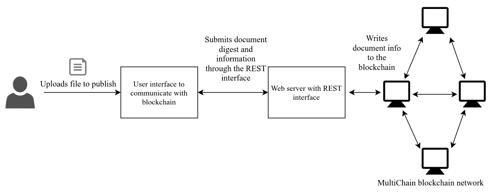
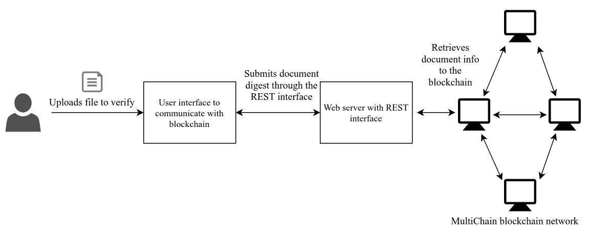
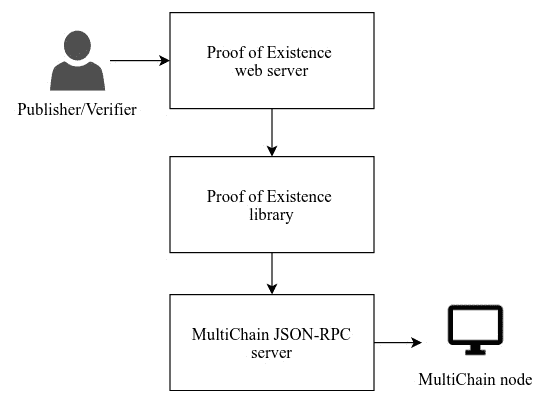

# 深入区块链 - 存证

到目前为止，在本书中，我们已经了解了区块链技术的基本概念，探讨了诸如加密和去中心化网络等主题。我们还创建了一个简单的区块链应用程序，并使自己熟悉了在去中心化加密货币应用程序中使用的交易。虽然我们创建的区块链应用程序使我们对区块链技术有了概览，但我们还没有探讨除加密货币之外需要去中心化网络的任何用例。通过深入了解区块链，我们将介绍并熟悉区块链框架，最终将通过构建所展示的用例而结束。

在这一章中，我们将涵盖以下主题：

+   具体来说，区块链平台：

    +   为什么我们选择使用 MultiChain？

    +   MultiChain 基础介绍

    +   MultiChain 中包含的功能

+   如何设置区块链环境

+   存证的体系结构

+   如何构建一个存证应用

在我们探索 MultiChain 区块链平台的各个方面之前，了解核心区块链平台是很重要的。任何想要构建去中心化应用程序的用户都不需要从零开始构建所有组件。

相反，你会发现使用现有框架总是更好。为什么呢？因为它会帮助你以较少的努力构建应用程序。现有的区块链平台为应用程序开发提供了一个框架，你不必担心使用的基础区块链概念，而是可以更多地专注于实现区块链用例。用户不必过多担心以这种方式构建的区块链网络的扩展性，因为该平台已经通过成千上万的开发人员和用户进行了测试。因此，这个系统应该是具有弹性的。

每个区块链平台都有其独特的特点和功能，超越了使用区块链技术构建去中心化网络的基础知识。一些区块链平台提供了从比特币项目派生的基本功能，而其他平台则提供了高级的脚本能力，以便在区块链网络内部部署智能应用。你会发现有大量的平台供你选择，从而开发和部署应用程序，但总是最好根据你正在创建的应用程序的用例选择一个框架。一些提供开发应用程序平台的著名区块链项目有*以太坊*、*超级账本*、*Neo*、*MultiChain*、*Corda*和*BigchainDB*。清单很长，我们将在[第8章](02eed23a-0a39-4a19-8d88-a72a810ddb0d.xhtml) *区块链项目*中查看其中的一些平台。

由于我们有大量选择，很难找到最佳平台，因为大多数平台都可以成功地用于我们要使用的相同用例。然而，每个平台都是为特定目的而设计的。我们将在[第12章](55ed2989-ecca-46ca-8546-74a12da98715.xhtml)，*区块链用例*中指出区块链平台的选择标准，在那里我们将讨论几个区块链用例。在整个本章中，我们将讨论使用MultiChain构建“存在性证明”应用的用例。我们将在接下来的几节中讨论选择这个平台的理由。

# MultiChain区块链平台

MultiChain是许多平台之一，帮助企业轻松构建和部署区块链应用程序。众所周知，比特币拥有一个坚韧的公开区块链，可以扩展其网络和处理交易，非常适合公开区块链。这是通过从比特币获得灵感并创建一个私人区块链平台实现的MultiChain项目。

在比特币的公开区块链中，存在一些限制，比如资产分发有限、交易成本高、交易速率较低和透明交易。虽然很难在公开区块链中摆脱这些限制，但并非所有用例都需要承担这些限制。

在私人网络中可以实现的一个用例不应当为每笔交易付费，达到更高的交易速度，甚至为操作设置访问控制。MultiChain可以在私人网络内实现所有这些。

下面是MultiChain的一些特点，帮助它克服比特币中的问题，使其无法在企业作为私人区块链实现一般用例：

+   区块链资产创建没有限制。这是因为它将由组织来设定上限。

+   你不必支付交易成本。这是因为内部节点无需奖励。

+   交易确认延迟减少是由工作量证明共识算法导致的。

+   在区块链交易中，隐私性不足得到缓解。这是通过为区块链节点提供访问控制来实现的。

# 为什么选择MultiChain？

正如我们已经提到的，当我们实施区块链应用程序时，有几个区块链平台可供选择。框架的选择大部分取决于我们将要实施的应用程序的用例。

选择MultiChain平台而非其他平台有几个原因。其中一个最重要的因素是在平台内实现我们的存证用例的简单性。MultiChain帮助我们构建我们的用例，而无需为部署和执行编写任何复杂逻辑，使其更易访问。MultiChain还有一个称为数据流的功能，将用于将信息存储在区块链中，而无需改变数据结构。我们将通过查看本章的后续章节，*开始使用MultiChain*，来实现这一点。选择MultiChain的另一个因素是它与比特币非常相似，这使我们更容易理解所有其扩展功能。

所有这些因素影响我们选择MultiChain作为构建我们第一个区块链应用的合适平台。接下来我们将介绍一些MultiChain的特点。

# MultiChain的基础知识

MultiChain是从比特币分叉出来的项目；因此这使其与比特币生态系统兼容。这是基于权限的区块链，意味着在区块链上执行的任何操作都是受权限控制的。网络上的节点并不一定对区块链具有相同的权限。一些节点可能被分配基本权限以读取区块链，其他节点则可被赋予写权限甚至管理员权限。MultiChain也可以配置为无权限，使网络中的每个节点平等。MultiChain的灵活性使得实现区块链用例变得容易，无需投入过多开发资源。

MultiChain为我们提供完整的资产管理周期，类似于比特币交易。资产为我们提供了一种灵活的方式来处理其元数据。由于我们的存证用例不涉及身份，我们不会使用资产管理概念来创建我们的应用程序。MultiChain还提供了数据存储与检索机制，借助数据流的帮助。在我们的示例中，我们将使用数据流功能进行Proof of Existence应用程序的数据存储。

# MultiChain功能

正如我们之前解释过的，MultiChain继承了大部分功能来自比特币项目，并帮助开发人员创建应用程序而无需学习全新的生态系统。MultiChain具有一系列额外功能，使开发者轻松构建和部署区块链应用程序。在本节中，我们将谈论其中一些功能。

# 权限管理

当 MultiChain 区块链在企业中作为私人网络部署时，可以进行配置，使每个节点具有不同级别的访问控制权限。当区块链网络中启用权限模式时，每个节点都必须使用其公共地址明确授权。权限级别包括连接、发送、接收、发行、挖矿、激活和管理员等。权限还可以针对特定资产分配，从而使权限管理更加细粒化。节点可以随时撤销访问权限。权限管理确保没有陌生节点被允许进入私人区块链，或者通过为不同节点设置不同级别的访问控制来建立组织中的等级结构。权限管理是私人区块链中的一个重要功能。

# 资产管理

资产管理是从比特币交易中衍生出来的概念。比特币有一个由交易验证的单一资产。尽管比特币可以在交易元数据中存储额外资产，但这些资产不会由区块链节点验证。MultiChain 通过提供一种功能来解决这个问题，使您能够创建多种类型的资产，并仍然验证所有资产的交易。MultiChain 具有完整的资产管理生命周期。

# 数据流管理

数据流是 MultiChain 区块链中用于提供数据存储的一种机制。它作为一种方便的方式来以键值对的形式存储和检索数据。多个项目可以发布到单个数据流中。在对数据流进行操作之前，节点必须订阅该数据流。数据流项目可以按键、签名和区块号等进行索引。

# 设置区块链环境

区块链网络是一个去中心化的网络，每个节点都应该拥有关于区块链账本的类似信息。去中心化网络可以通过允许每个人连接并在区块链上执行操作来在开放网络中设置，或者同样也可以在私人网络中维护。通过在每个节点上启用连接权限，可以实现公共区块链网络。企业通常更愿意建立私人网络，因为这有助于阻止不良行为者。这个网络配置可以在每个 MultiChain 节点中轻松配置。

# 运行 MultiChain 节点

MultiChain 可以安装在 Linux、Windows 和 Mac 平台上，这些平台的 64 位处理器至少需要 512 MB 内存和 1 GB 存储空间。安装过程包括从 MultiChain 网站下载压缩的编译文件并进行解压缩。MultiChain 是用 C++ 开发的开源项目。每个节点都可以使用开源代码并进行编译，以便对程序的逻辑有更多控制。

可以在书籍的GitHub存储库或MultiChain的官方网站找到直接在机器上安装MultiChain以及从源代码构建的安装说明：[https://www.multichain.com/download-install](https://www.multichain.com/download-install)。我们将在本书中演示使用Linux发行版Ubuntu 16.04。

每个MultiChain节点都带有三个主要的二进制文件，称为`multichaind`、`multichain-cli`和`multichain-util`。

+   `multichaind`：这是每个节点上作为守护程序运行的进程。该进程是节点的支柱，并启动保持本地区块链最新的所有必需任务。

+   `multichain-cli`：这提供了一个命令行接口，您可以使用它执行API来对区块链执行操作。

+   `multichain-util`：这是一个工具，您可以使用它执行操作，比如创建一个新的区块链。

# 开始使用MultiChain

现在我们已经熟悉了MultiChain平台，同样熟悉了在私有网络中设置节点的流程，我们需要创建一个区块链，以便在网络中的节点之间发布和共享数据。第一步是在实施我们的用例之前介绍所有功能。

# 创建一个链

设置了一个节点后，它可以通过连接到链来加入现有网络，或者创建自己的链。使用`multichain-util`创建新链，如下所示：

```
$ multichain-util create chain1  
```

这将创建一个新的本地区块链。然后，节点必须使用`multichaind`启动一个进程来连接到创建的链。可以通过启动多个`multichaind`守护进程在单台机器上初始化多个链。创建`multichaind`进程如下：

```
$ multichaind chain1 -daemon 
```

上面的行实例化一个进程并启动服务器。然后，节点为创建的链挖掘创世区块。此代码将产生一个地址，其他节点可以使用该地址连接到刚刚创建的链。

# 连接到现有链

如果在私有网络中创建了一个链，其他节点可以连接到创建的节点并在同一区块链上执行操作。任何节点都可以使用以下命令连接到链：

```
$ multichaind chain1@[ip-address]:[port] 
```

网络中的任何远程节点都可以使用IP地址和MultiChain端口连接到链。每个MultiChain守护进程为其服务器分配一个不同的端口号。如果链配置的连接权限未设置为公开，则必须对网络中的每个节点进行明确授予权限，如下所示：

```
$ multichain-cli chain1 grant [node-address] connect 
```

节点地址是节点的公共地址或钱包地址，可从钱包的公私钥对的公钥中提取。节点可以尝试通过重新启动`multichaind`连接到链，但只有获得授权后才能这样做：

```
$ multichaind chain1 -daemon 
```

# 检查区块链

在成功连接到区块链后，节点将完全设置在私有区块链网络中。本地区块链将通过接受来自网络中节点的区块来进行更新。可以通过命令行界面发出以下命令来验证区块链的状态：

```
$ multichain-cli chain1 getinfo 
```

此命令提供有关节点、MultiChain 和几个区块链参数的常规信息，如下所示：

```
    {"method":"getinfo","params":[],"id":1,"chain_name":"chain1"}

    {
      "version": "1.0.2",
      "nodeversion": 10002901,
      "protocolversion": 10009,
      "chainname": "chain1",
      "description": "MultiChain chain1",
      "protocol": "multichain",
      "port": 4273,
      "setupblocks": 60,
      "nodeaddress": "chain1@192.168.0.107:4273",
      "burnaddress": "1XXXXXXXQrXXXXXXEeXXXXXXXBXXXXXXaDTujx",
      "incomingpaused": false,
      "miningpaused": false,
      "walletversion": 60000,
      "balance": 0,
      "walletdbversion": 2,
      "reindex": false,
      "blocks": 59,
      "timeoffset": 0,
      "connections": 0,
      "proxy": "",
      "difficulty": 6e-8,
      "testnet": false,
      "keypoololdest": 1523352447,
      "keypoolsize": 2,
      "paytxfee": 0,
      "relayfee": 0,
      "errors": ""
    }
```

注意：所有的 MultiChain 命令都可以通过最初使用`multichain-cli chain1`命令启动 shell 以交互模式运行。这将打开一个界面，在此界面上可以使用关键字和所需的参数执行所有命令。可以通过输入`help`来获取所有命令的完整列表。

# 使用流进行工作

如前所述，流用于将数据项存储为区块链中的键值对。流是一种方便的数据存储方式。可以通过命令行界面轻松创建和管理它们。这里使用的所有命令都是在执行以下命令进入交互模式后执行的：

```
multichain-cli chain1
```

用户可以通过发出`liststreams`命令来检查链中的所有流，该命令返回所有流的详细信息以及一个名为`root`的默认流。然后可以通过执行以下命令来创建新流：

```
    create stream stream1 false 
```

`stream1`是新创建的流的名称。如果将`create`命令最初设置为 false，则只有管理员和具有显式权限的节点才能为`stream1`创建流项目。如果初始时将`create`命令设置为 false，则可以使用`grant`命令将发布流项目的权限授予特定节点。

也可以使用以下`publish`命令将键值对数据项发布到创建的流中。流项的值应始终指定为十六进制字符串：

```
    publish stream1 key1 73747265616d2064617461
```

每当节点想要监听发布的流项目时，它都必须通过订阅来监听该流；可以通过以下命令实现：

```
    subscribe stream1
    liststreamitems stream1
```

执行该命令将导致所有发布到流中的项目都被显示出来，同时还会显示发布者地址、区块创建时间、交易ID以及一定数量的区块确认信息。发布的十六进制值存储在`data`键中：

```
[ 
  { 
    "publishers": [ 
      "1MpkvCWj1Z9ZYfzBQzk4QvR1qih4ZiaHfh9Dd3" 
    ], 
    "key": "key1", 
    "data": "73747265616d2064617461", 
    "confirmations": 11, 
    "blocktime": 1523373741, 
    "txid": "23ad75620539f9995eef990856090e4c016e4da46bee82905483021b68da616e" 
  } 
] 
```

现在，我们已经介绍了 MultiChain 平台提供的基本功能，我们拥有了构建我们自己应用程序所需的所有关键因素。

# 存在性证明架构

存在性证明是一种证明数字文档是否在特定时间存在的机制。区块链作为公证的良好替代品，因为它可以证明文档的存在而无需第三方。每个文档通过使用哈希算法（如 SHA-256）创建其摘要来进行标识，然后通过为交易戳记时间来将文档的身份存储在区块链中。

证明文档存在的区块链实现是由开发人员 Manuel Araoz 和 Esteban Ordano 在 2013 年初创建的。它被发布为一个开源项目。此服务使用比特币的公共网络来存储有关文档的信息。有关文档的信息存储在称为 `OP_RETURN` 的交易元数据中，这允许在交易中存储任意信息。

在其生命周期中，存在性证明架构有两个用例。任何想要证明文件存在的用户都可以进行发布操作，并且任何人都可以通过进行验证来检查此证明。该应用程序的架构将包括用户界面、与区块链节点的后端界面以及区块链本身。

# 发布文档

想要证明文档在特定时间存在的所有者可以将文档上传到存在性证明应用程序中。所有者可以添加需要与文档一起保留的附加信息，例如文档描述、大小和用户详细信息。该应用程序的用户界面将随后接受此数据以及文档。然后，使用哈希算法创建文档的摘要，以唯一标识文档并以固定大小的标识表示它。文档信息与摘要一起将被发送到区块链应用程序的 Web 界面。

区块链应用程序的 Web 界面在需要时将在 MultiChain 区块链上执行特定操作。当发布操作使用所有必需的数据调用时，应用程序将创建一个项目，并请求 MultiChain 节点将其发布到区块链流中。一旦交易到达网络中的一个节点，它将被交换并包含在一个区块中，最后，它将被嵌入到区块链总账中。



图 6.1：发布文档存在性证明的架构图

# 验证文档

想要验证文档存在性的用户将会遵循类似于发布文档的过程，如前所示。但是，他们需要访问该文档以获取其存在信息。当验证功能被触发时，想要验证文档的用户将会与 Web 界面进行类似的交互。MultiChain 区块链中的验证操作将验证操作是否被调用。Web 界面将接受文档的摘要，并使用此摘要查询 MultiChain 区块链以获取文档信息。

存储在 MultiChain 流中的文档信息可以通过提交文档的摘要来检索，如下图所示：



图 6.2: 验证文档存在证明的架构图

如果项目包含在其中一个块中，则区块链节点将能够在流中找到该项目。 如果在区块链流中找到该项目并确认用户，提供有关文档的更多信息，则声称存在证明的验证将成功。

# 构建存在证明应用程序

正如我们在存在证明应用程序的架构中讨论的那样，每个区块链节点都有一个 Web 接口，通过该接口，其用户将发布和验证文档的存在。

我们将创建一个与部署的 MultiChain 节点通信的 Web 接口。 然后，用户将通过使用 REST API 与 Web 接口进行通信。 在我们的示例中，我们将使用第 4 章 *区块链中的网络* 中使用的 Python Sanic Web 服务器创建简单的 REST API。 然后，此 Web 接口将与 MultiChain 节点的 JSON-RPC 服务器通信，该服务器将允许节点在 MultiChain 区块链上执行任何操作。 所有由 `multichain-cli` 提供的功能都将在 JSON-RPC 调用中可用。 我们将使用一个名为 `Savoir` 的 Python 驱动程序与 MultiChain 节点的 JSON-RPC 服务器通信。

在本节中，我们将将服务器端应用程序分解为三个部分，以适应架构。 这些部分如下：

+   MultiChain JSON-RPC 驱动程序

+   存在证明库

+   存在证明 Web 服务器



图 6.3: 服务器端应用程序的分层架构

上述 *图 6.3* 描绘了分层架构，通过该架构，用户通过高级 Web 服务器接口进行通信，应用程序通过低级 JSON-RPC 驱动程序与 MultiChain 节点进行交互。

# MultiChain JSON-RPC 驱动程序

我们将使用驱动程序与 MultiChain 节点通信。 MultiChain 提供了一个 JSON-RPC 服务器，可用于执行任何所需的区块链操作。

在我们的用例中，我们将使用一个名为 `Savoir` 的 Python 驱动程序，该驱动程序将连接到 MultiChain 节点的 JSON-RPC 服务器并调用必要的函数：

```
from Savoir import Savoir 

class MultichainClient(object): 

    def __init__(self, **kwargs): 

        self.rpcuser = kwargs.get('rpcuser', 'multichainrpc') 
        self.rpcpasswd = kwargs.get('rpcpasswd', 'HFzmag67bJg2f4YuExgVDqQK5VfnvXRS5SKrByuCgiXm') 
        self.rpchost = kwargs.get('rpchost', 'localhost') 
        self.rpcport = kwargs.get('rpcport', '4416') 
        self.chainname = kwargs.get('chainname', 'chain1') 
```

我们还将使用 `Savoir` 创建一个 MultiChain JSON-RPC 客户端。 该客户端将需要 RPC 连接信息，例如用户名、密码、主机、端口和链名称，以便与 RPC 服务器建立连接。 在这里，命令行 `multichainrpc` 是默认的 RPC 用户名，`4416` 是默认的 RPC 端口。 我们将在先前的部分中使用相同的链，作为 `chain1` 创建。

注意：RPC用户名和密码可以在创建的链的配置文件中进行配置。它位于Linux机器上的`/home/user/.multichain/chainname/multichain.conf`，或其他平台的等效安装目录中。其他区块链参数，如端口号，可以在以下位置的参数文件中配置：`/home/user/.multichain/chainname/params.dat`

```
    def connect(self):
        """connects to rpc interface"""

        try: 
            api = Savoir(self.rpcuser, self.rpcpasswd, self.rpchost, self.rpcport, self.chainname) 
            return api 

        except Exception as e: 
            return False 
```

然后，使用提供的连接信息创建RPC连接对象。此对象返回到库层以调用所需的MultiChain API。

# 存在证明库

存在证明库是在区块链上执行高级任务的方法集合。该库包含用户提交的文档上可以执行的所有操作。根据架构的设计，有两种执行用户文档操作的主要方式：发布和验证。

发布操作发布文档摘要以及用户传递的任何其他信息。由于我们使用MultiChain流进行发布，因此数据必须以十六进制字符串格式化，如前所述。

下面的`Document`类展示了`publish`和`verify`方法，以及一些用于获取流项目的方法：

```
class Document(object): 

    def __init__(self): 
        self.client = MultichainClient().connect() 
        self.stream = 'poe' 
```

上述构造函数使用RPC服务器初始化与MultiChain节点的连接。此连接对象可用于调用任何MultiChain API。

以下两种方法分别用于根据其流密钥和交易ID获取流项目。第一个使用MultiChain API `liststreamkeyitems`，传递流名称和密钥作为参数。在第二种方法中，使用其交易ID获取流项目，使用`getwallettransaction` API，该API接受已发布流项目的交易ID作为参数：

```
    def fetch_by_key(self, key): 
        """fetches the existence info of a document in blockchain""" 

        return self.client.liststreamkeyitems(self.stream, key) 

    def fetch_by_txid(self, tx_id): 

        return self.client.getwallettransaction(tx_id) 
```

文档信息使用流项目发布API存储在键值对中。流项目以键值对的形式发布，其中键是文档的唯一摘要，值是编码的十六进制字符串。然后，发布API将创建一个交易并将其插入区块链：

```
    def publish(self, key, value): 
        """publishes the existence of a document in blockchain""" 

        return self.client.publish(self.stream, key, value) 
```

当用户想要在验证其存在时检索已发布文档的信息时，将调用`verify`方法。验证是通过之前描述的`fetch_by_key`方法来执行的，该方法接受流密钥作为参数。如果密钥存在，则此方法将返回流项目列表，否则将返回一个空列表：

```
    def verify(self, digest): 
        """verifies the existence of a document in blockchain""" 

        return self.fetch_by_key(digest) 
```

接下来的方法返回最新发布的文档信息。用户还可以通过指定计数来查询所需数量的文档。使用`liststreamitems` API来检索流中的所有项目。然后将返回的列表反转，并检索指定数量的项目。只从流项目中筛选出必要的信息并返回：

```
    def fetch_latest(self, count): 

        latest_docs = [] 
        for doc in self.client.liststreamitems(self.stream)[::-1][:count]: 
             latest_docs.append({"digest": doc.get('key'), 
            "blocktime": doc.get('blocktime'), 
            "confirmations": doc.get('confirmations')}) 
        return latest_docs 
```

# 存在证明 Web 服务器

存在证明 Web 服务器是与 MultiChain 区块链通信的接口。我们将创建一个 REST API 来与区块链应用程序通信。每个用户将能够通过此 Web 界面发送请求执行 `publish` 和 `verify` 操作。

首先，需要导入编码数据和创建 Web 服务器所需的软件包。Web 服务器的默认端口号设置为`8000`：

```
import binascii 
import json as JSON 

from base64 import b64encode, b64decode 
from datetime import datetime 
from sanic import Sanic 
from sanic.response import json 
from sanic_cors import CORS, cross_origin 
from poe_libs import Document
port = 8000 
```

下一步是创建文档对象。这将用于执行存在证明操作。为验证、发布和获取文档信息定义了三个 REST API 端点。我们将为所有定义的 API 端点创建一个实现：

```
class Server(object): 

    def __init__(self): 

        self.app = Sanic() 
        CORS(self.app) 
        self.document = Document() 

        self.app.add_route(self.publish, '/publish', methods=['POST']) 
        self.app.add_route(self.verify, '/verify', methods=['GET']) 
        self.app.add_route(self.details, '/details', methods=['GET']) 
```

# 发布文档

当用户想要证明文档存在时，将调用 `publish` 端点实现。`publish` 实现是一个 HTTP POST 端点，因为它将通过 Web 服务器界面在区块链中创建一个新记录。用户通过传递文档摘要（整个文档的哈希值）来调用此端点。用户还将传递诸如名称、电子邮件和消息之类的信息，这些信息将作为元数据存储在流项中。必需信息通过 POST 表单传递。必需的值从 `request` 对象中提取以创建字典：

```
async def publish(self, request): 

    try: 
        json_data = {'name': request.form.get('name'), 
            'email': request.form.get('email'), 
            'message': request.form.get('message'), 
            'digest': request.form.get('digest')} 
```

由于流项将值存储为十六进制字符串，因此字典将被转换为字符串，然后进行 base64 编码，最后编码为十六进制字符串：

```
        json_string = JSON.dumps(json_data) 
        encoded = b64encode(json_string.encode('utf-8')) 
        hex_encoded = binascii.b2a_hex(encoded).decode() 
```

调用存在证明库的 `publish` 方法，以及摘要和计算的编码值，以便将其存储在区块链中：

```
        tx_id = self.document.publish(json_data['digest'], hex_encoded) 
        tx_info = self.document.fetch_by_txid(tx_id) 
```

然后构造响应数据以确认用户的请求。向用户提供有关已发布项目的信息，例如交易 ID、区块哈希、时间戳和确认数。时间戳信息在存在证明用例中至关重要，因为它用于证明文档在特定时间点存在：

```
        response_data = { 
            'digest': json_data['digest'], 
            'transaction_id': tx_id, 
            'confirmations': tx_info.get('confirmations'), 
            'blockhash': tx_info.get('blockhash'), 
            'blocktime': tx_info.get('blocktime'), 
            'name': json_data['name'], 
            'email': json_data['email'], 
            'message': json_data['message'], 
            'timestamp': datetime.now().timestamp(), 
            'status': True} 

    except Exception as e: 

        response_data = {'status': False} 

    return json(response_data) 
```

# 核实文档

需要验证文档存在的用户将调用 `verify` 实现端点。`verify` 是一个 HTTP GET 方法，它接受文档摘要作为查询字符串，然后响应有关文档的详细信息（如果已经发布）。通过这种方式，用户可以确信文档的存在，前提是它已经在区块链上发布。

`digest` 查询字符串键的值作为参数传递给存在证明库的 `verify` 方法。如果可以在区块链分类帐中找到文档摘要，则会返回项目列表：

```
    async def verify(self, request):
        """returns details about verified document"""    
        digest = request.args.get('digest') 
        verified_docs = self.document.verify(digest) 
```

存储的十六进制编码值被解码回二进制字符串。结果的 base64 编码字符串被解码回以获取提交文档的元数据：

```
        response_data = [] 
        for doc in verified_docs: 
            meta_data = JSON.loads(b64decode(binascii.a2b_hex(doc.get('data'))).decode()) 
```

交易和区块信息以及文档的元数据将返回给文档的验证者：

```
            doc = {"digest": digest, 
                   "transaction_id": doc.get('txid'), 
                   "confirmations": doc.get('confirmations'), 
                   "blocktime": doc.get('blocktime'), 
                   "name": meta_data.get('name'), 
                   "email": meta_data.get('email'), 
                   "message": meta_data.get('message'), 
                   "recorded_timestamp_UTC": doc.get('blocktime'), 
                   "readable_time_UTC": datetime.fromtimestamp(int(doc.get('blocktime'))).strftime("%c")} 
            response_data.append(doc) 
        return json(response_data) 
```

此端点实现获取最近发布文档的详细信息。它是一个接受文档计数作为参数的HTTP `GET`方法：

```
    async def details(self, request): 
        """returns details of latest inserted documents""" 

        latest_docs = self.document.fetch_latest(int(request.args.get('count'))) 
        return json(latest_docs) 
```

# 执行和部署应用程序

应用程序的服务器端由运行Python Web服务器应用程序来执行。服务器应用程序可以在任何区块链节点上执行，也可以在任何具有对区块链JSON-RPC服务器访问权限的机器上执行。应用程序的主要函数在指定的端口实例化Web服务器应用程序，如下所示：

```
if __name__ == '__main__':
    """main function to serve the api"""
    server = Server() 
    server.app.run(host='0.0.0.0', port=port, debug=True) 
```

一旦服务器成功实例化，用户就可以访问REST接口。让我们使用REST端点发布并验证文档的存在。

使用`curl`工具调用本地机器上运行的`/publish` POST方法。我们可以使用任何哈希函数生成摘要。你可以使用Linux中的`sha256sum`工具生成哈希值：

```
$ sha256sum index.php 
86abfbd5f1a9e928935cdee9b2fd1bc2d43254b40d996e262026e9d668555613  index.php 

$ curl -X POST -F 'name=user' -F 'email=test@test.com1' -F 
 'message=some message' -F 
 'digest=86abfbd5f1a9e928935cdee9b2fd1bc2d43254b40d996e262026e9d668555613' 
 http://localhost:8000/publish 
```

`POST`请求通过MultiChain节点发布文档。如果发布操作成功，服务器将以以下数据响应：

```
{ 
  "transaction_id": "62eca6e6c20a4af350bd70fa3745c16de5d9a8ad70bc79cbf4c5450283424010", 
  "message": "some message", 
  "confirmations": 0, 
  "digest": "86abfbd5f1a9e928935cdee9b2fd1bc2d43254b40d996e262026e9d668555613", 
  "name": "user", 
  "email": "test@test.com1", 
  "blocktime": null, 
  "timestamp": 1523467920.313183, 
  "status": true, 
  "blockhash": null 
} 
```

如果服务器响应具有交易ID，则文档的存在已成功发布，如前述输出所示。`blockhash`和`blocktime`设置为null，因为交易尚未包含在区块链中。

用户可以调用`/verify` GET方法端点，并使用文档的摘要来验证其存在，如下所示：

```
$ curl http://localhost:8000/verify?digest=86abfbd5f1a9e928935cdee9b2fd1bc2d43254b40d996e262026e9d668555613 

[ 
  { 
    "transaction_id": "62eca6e6c20a4af350bd70fa3745c16de5d9a8ad70bc79cbf4c5450283424010", 
    "email": "test@test.com1", 
    "recorded_timestamp_UTC": 1523467857, 
    "blocktime": 1523467857, 
    "confirmations": 22, 
    "message": "some message", 
    "digest": "86abfbd5f1a9e928935cdee9b2fd1bc2d43254b40d996e262026e9d668555613", 
    "name": "user", 
    "readable_time_UTC": "Wed Apr 11 23:00:57 2018" 
  } 
] 
```

前述响应证明了文档在指定时间戳存在。它还给出了文档的发布详细信息。

还可以通过调用`/details`端点获取所有最新发布的文档信息：

```
$ curl http://localhost:8000/details?count=3 
[ 
  { 
    "digest": "d9d7e36d0059dfab8d7ca2ddaf9e27956e96721209d3b41cd9da46942d48f77b", 
    "blocktime": "2018-04-12 00:42:38 UTC", 
    "confirmations": 1 
  }, 
  { 
    "digest": "e459c629bfdf54c5849f7718dae9db2b0035f6cb21a04cf2f8e17ffe63b60710", 
    "blocktime": "2018-04-12 00:42:10 UTC", 
    "confirmations": 6 
  }, 
  { 
    "digest": "86abfbd5f1a9e928935cdee9b2fd1bc2d43254b40d996e262026e9d668555613", 
    "blocktime": "2018-04-12 00:13:16 UTC", 
    "confirmations": 17 
  } 
] 
```

文档的详细信息显示了文档的最新发布证据。正如我们所看到的，最新的文档信息比较旧的信息具有较少的确认。这是因为较早的发布交易被深深地插入到区块链中。与公共区块链不同，其中交易插入取决于交易的优先级，MultiChain节点将所有交易视为具有高优先级，并按照交易到达的顺序插入，这是由于其相对简单的共识算法。

如架构中所述，Web 服务器应用程序与连接到 MultiChain 网络的区块链节点进行通信。Web 服务器应用程序可以部署在一个可被 MultiChain 节点访问的单独机器上，或者可以部署在同一个区块链节点上。虽然将应用程序部署在另一台服务器上会产生相同的结果，但由于只有一个中央 Web 服务器应用程序，这会引入集中化的问题。最佳做法是在有人希望发布或验证文档的存在性证明时，在区块链节点上本地运行应用程序。

每个应用程序都需要用户界面来提供良好的用户体验。我们的区块链应用程序可以与用户界面集成，在这个界面中，发布用例接受一个文档以及与文档相关的必要信息作为参数，而验证用例只需要文档以检查其存在性。前端应用程序在这两种情况下都会计算文档的摘要。

注：整个“证明存在性”项目以及与前端应用程序的集成可以在本书的 GitHub 仓库中找到（[https://github.com/PacktPublishing/Foundations-of-Blockchain](https://github.com/PacktPublishing/Foundations-of-Blockchain)）。它可以用于在私有网络中部署区块链应用程序。

# 摘要

在本书前几章介绍区块链的核心概念后，在本章中，我们通过创建一个区块链应用程序来深入研究区块链。在本章中，我们仔细分析了一个区块链用例，并提出了使用 MultiChain 平台构建简单区块链应用程序的架构。MultiChain 平台的简单性以及我们讨论的其他功能使我们能够以最小的工作量创建和部署应用程序。熟悉 MultiChain 平台为我们提供了足够的洞察力，使我们能够构建和部署任何其他区块链平台上的区块链应用程序的基础，并激励我们这样做。

现在，通过实现一个相当简单的区块链用例，我们对区块链技术有了扎实的背景，这将为区块链应用程序的开发奠定基础。现在，我们将进一步深入区块链开发，通过实现另一个区块链用例来熟悉分布式智能合约。
