# 第八章：区块链项目

虽然**去中心化应用**（**DApps**）可以取代一些集中式应用，但它们的架构、基础设施和实现与传统的集中式应用大不相同。并非每个区块链实现都能证明其相比现有实现的优势。本章的目的将是探索一些能够革新去中心化网络的项目。

在本章中，我们将研究金融和非金融区块链项目。自比特币发明以来，已经出现了两千多种加密货币（称为山寨币），并引起了广泛关注。该技术的广泛使用引起了风险资本家的注意，促使他们投资于主要专注于集中式交易所、钱包或创建自己的加密货币解决方案的项目。2015 年之前，区块链技术的应用主要偏向于加密货币，但借助区块链平台，去中心化应用的采用创造了金融以及非金融领域巨大的创新机会。

在任何集中式应用中，总是需要一个中介。但去中心化应用不再需要这些中介。从现有应用中消除中介或中央权威的概念对许多开发者和投资者具有吸引力，因为这可以减少因这些实体而产生的成本。

许多社区成立是为了提升现有区块链功能，并改善去中心化应用中的终端用户体验。这导致了一个对吸引人的区块链应用的市场需求以及广泛的消费者群体。

对于初学者来说，探索日益增长的区块链市场是一项艰巨的任务。此外，寻找能满足用户需求的应用程序很困难。这主要是因为你正在寻找的实现很可能会在众多应用中迷失。分类并识别一个好的实现需要大量的探索。首先，我们将在接下来的部分对广泛的应用进行分类，然后深入一些令人兴奋的区块链项目。

# 对区块链项目进行分类

不同的机构利用区块链技术创建了去中心化应用或概念验证，以最大限度地利用区块链可以提供给他们的东西。正在探索区块链的机构可能有金融或非金融用例。基于此，我们将广泛地将区块链应用分为金融和非金融项目。

# 金融项目

任何具有经济价值的现实资产都可以直接映射到数字资产。任何利用这些可交易数字资产的项目都可以被归类为金融项目。虽然所有涉及可交易资产的应用程序都可以被归类为金融项目，但它们也可能有非金融用例。

大多数早期与区块链相关的项目都是金融项目。这主要是因为实施受到了比特币的影响，而比特币本身正试图在互联网上分散货币的控制。这影响了许多开发者社区致力于与加密货币密切相关的项目。创建了许多交易所、代币分发平台和支付网络，这迫使银行服务直接参与，以便现有银行客户能够利用加密货币应用程序。

尽管区块链技术在非金融应用方面也很有用，但只有轻量级金融应用程序才能获得广泛的受众，并且由于广泛的曝光，才能创建一个弹性系统。尽管许多金融应用程序并不一定局限于加密货币，但许多最初的金融应用程序都是加密货币，特别是**Peercoin**和**Litecoin**，它们试图模仿比特币通过修改协议来实现更好的性能。

# 非金融项目

在比特币的早期，人们担心底层技术的可扩展性以及其未来的范围。尽管加密货币通过其基于 P2P 的系统使互联网货币的去中心化成为可能，但其真正的技术尚未完全开发。几个开发者社区开始在比特币区块链上构建应用程序，以利用比特币区块链所实现的去中心化。由于比特币区块链的可扩展性限制和隐私问题，许多项目通过定制比特币实现并分叉比特币区块链而创建。

随着技术潜力变得明显，很快就将其实现在数字身份、供应链、资产管理等许多其他用例中，以替代一些过时的技术。由于区块链技术的限制，并不是所有的实施都成功了，但开发人员能够找到与加密货币直接无关的用例。这为组织探索非金融领域的区块链技术铺平了道路。许多需要替换其现有技术的非金融组织开始将区块链作为解决方案实施。因此，出现了几种替代比特币的实现以服务非金融用例。

我们将通过研究一些应用程序来探索一些金融和非金融项目的子类别。

# 金融区块链项目

在本节中，我们的目标是通过对早期金融领域中区块链的几个实现进行分类来探索区块链在金融领域的应用。

# 加密货币

区块链的概念自比特币首次引入以来已经发展。尽管比特币的基础技术已经应用于多个不同领域，但加密货币被认为是区块链技术的真正应用。此后已经创建了许多项目，有些项目效仿了比特币的实现，而其他项目解决了现有实现中的问题。

尽管可以找到许多具有与比特币相似属性的加密货币，但它们不一定解决相同的问题。事实上，许多这些货币的创建只是为了激励网络中的参与者。

我们将在 *加密代币* 部分讨论这些货币。探索所有加密货币是相当困难的，因为几乎每天都会创建一个新的实现。我们将试图通过将加密货币分类为**可追踪**和**不可追踪**来简化这个问题。

# 可追踪的加密货币

正如我们所知，比特币的区块由可以被网络上任何参与者检索和解析的交易集合组成。比特币的创建目的是分散对货币的控制。这带来了隐私成本，因为每笔交易都是公开的，因为它需要被网络上的节点验证。这意味着任何网络中的人都可以追溯到每笔交易的起源。

比特币提供了伪匿名性，因为账户持有者的公共地址不需要与其真实身份关联。这样一来，即使所有交易都是公开的，也可以防止账户所有者的身份被披露。然而，如果用户的身份被披露，他们的整个交易历史可能会被泄露。尽管存在这些风险，透明的、公开可见的交易并不会造成太多麻烦，因为存在伪匿名性。

许多加密货币都效仿比特币创建了完全透明的交易账本。Litecoin、Namecoin 和 Peercoin 是一些加密货币，它们不仅模仿了比特币项目，而且在某种程度上增强了其功能。

# 不可追踪的加密货币

后来又开发了许多加密货币来掩盖私人交易信息并使交易无法追踪，从而解决了比特币和其他类似加密货币面临的隐私问题。**Zcash**、**Monero** 和 **Bitcoin Private** 是一些试图通过掩盖交易中的私人信息来保护用户隐私的加密货币。我们将探讨 Zcash 如何通过创建无法追踪的交易来实现隐私保护。

# Zcash

Zcash 通过隐藏发送方、接收方和价值信息来创建隐私交易。Zcash 是第一个在区块链技术中使用零知识证明密码原语的加密货币，该技术于 2016 年 10 月发布。

零知识证明是一种系统，其中用户可以证明他们拥有某种知识，而不向验证者披露该知识。零知识证明确保向验证者提供的信息不会危及证明者的隐私。在常规交易中，用户通过使用秘密密钥签署交易来证明他们拥有资产。Zcash 为交易创建了一种零知识证明，即使用户没有提供太多信息，也可以验证：

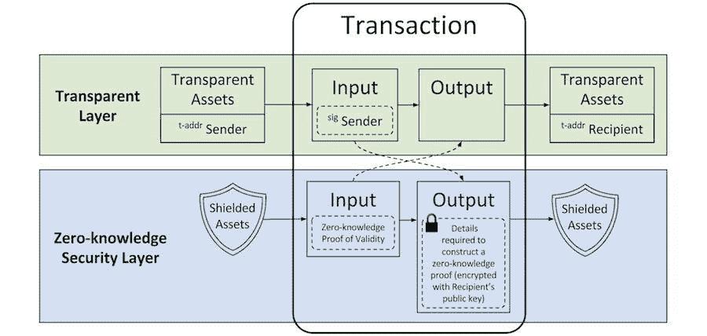

图 8.1：遮盖了 zk-SNARK 协议的 Zcash 交易输入和输出（来源：[`z.cash`](https://z.cash)）

Zcash 使用一种新型的零知识证明形式，称为**zk-SNARK**，它代表**零知识简洁非交互知识论证**。 zk-SNARK 证明了信息的所有权，例如私钥，而无需共享或与验证者通信。这样，即使是完全加密的隐私交易，也可以通过使用 zk-SNARK 证明来验证。

深入讨论 zk-SNARK 协议超出了本章的范围。我们将在第九章中进行深入讨论，*区块链优化和增强*。

# 加密代币

任何不是主要用于交换价值的加密货币都被视为一种特殊类型的代币。这些代币具有与任何其他加密货币相同的功能，因为它们被创建来在分散网络中运行。 这些代币可以分为两种类型：

+   **安全代币**：安全代币代表真实的物理资产，例如公司股份或任何形式的财务收入。这些类型的代币还具有预定义的经济价值，类似于代币的价格。

+   **实用代币**：实用代币是为了推动项目并在启动后为其持有者提供对项目提供的服务的访问权限而创建的。这些代币没有固定的经济价值，其价格将由其创建者决定。

# 代币发行

**首次代币发行**（**ICO**）是为前述代币筹集项目的初始资本而创建的。ICO 是一种众筹过程，任何愿意为项目做出贡献的人都可以成为其一部分，并拥有一定数量的代币。ICO 可以提供任何类型的代币，但安全代币由于其可见的经济价值而是最安全的代币。但这使 ICO 变得更加复杂，因为它需要您使用**了解您的客户**（**KYC**）程序来识别用户的身份。与安全代币相比，实用代币在 ICO 中最常用，因为它们相对于安全代币来说定义代币功能的简单性。

大多数 ICO 期间提供的代币是在现有的区块链网络上使用像以太坊这样的区块链平台创建的。以太坊有一个称为 ERC-20 的标准用于智能合约的创建，该标准用于在以太坊区块链上发行代币。其他区块链平台提供商，如 NEO，也有标准化的（NEP-5）代币创建以支持其区块链上的 ICO。我们将通过在第十二章中实现一个众筹用例来更多地探讨 ICO，*区块链用例*。

# Ripple 支付网络

Ripple 是一个支付网络，为 SWIFT 等现有全球支付系统提供解决方案。它帮助现有支付系统解决了延迟、不可靠和昂贵的交易问题。它通过使用涟漪共识算法的计算机网络在称为涟漪共识账本（RCL）的分布式分类账上结算和记录交易来实现这一点。

# Ripple 使用案例

Ripple 提供了广泛的用例，尤其是针对全球支付。我们现在将看几个例子。

# 跨境支付

Ripple 提供了一个全球支付解决方案，这意味着可以在不同国家建立支付渠道。这使得银行能够实时结算跨境支付，实现端到端的透明度，并以低成本完成。随着 Ripple 采用的增长，货币和交易对的数量将增加，流动性提供商需要为每种货币的每个交易对维护账户：

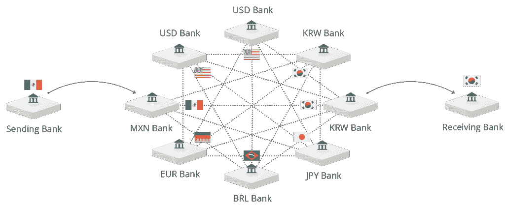

图 8.2：跨境支付渠道（来源：https://ripple.com）

# Ripple 代币作为货币桥梁

Ripple 可以在任何银行之间创建一个货币对，借助 Ripple 自己的代币 XRP。与任何其他传统中介货币转换不同，XRP 不需要银行账户：

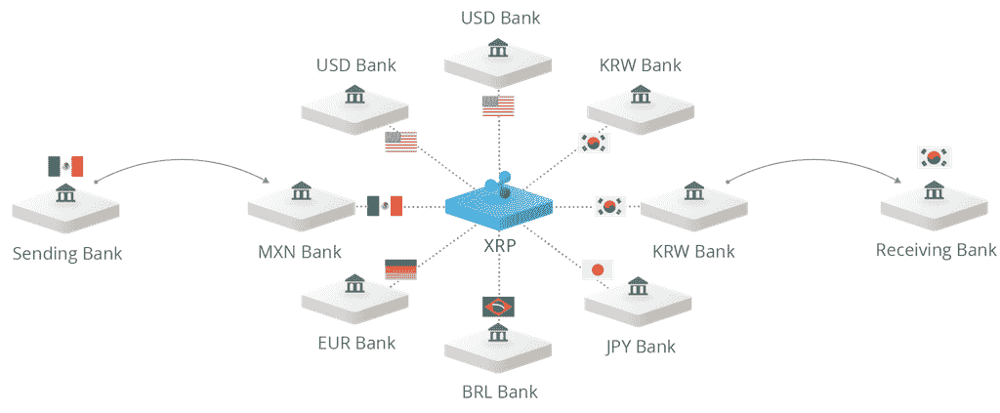

图 8.3：XRP 作为货币桥梁（来源：[`ripple.com`](https://ripple.com)）

# Ripple 网络

瑞波网络由一组类似比特币全节点的服务器组成。它们合作达成对网络状态的共识。瑞波维护一个公共账本，该账本不断更新着所有交易的全球真实状态。

瑞波的去中心化账本有两种状态：**最近已关闭账本**和**开放账本**。最近已关闭账本状态是瑞波网络达成一致的最近账本状态。开放账本接受新交易追加以便其状态可以改变。

每个瑞波节点维护一组称为**唯一节点列表**（**UNL**）的节点列表，该列表将直接为账本状态做出贡献。 UNL 是瑞波网络中受任何服务器信任以达成共识的节点的子集。 UNL 成员将为应插入账本的有效交易投票。

# 瑞波共识算法

**瑞波协议共识算法**（**RPCA**）是网络中的节点每隔几秒执行一次的过程，以达成网络共识。在网络节点成功达成一致后，账本将保持关闭状态。在成功将交易添加到账本之前，RPCA 必须经过几个强制步骤：

1.  每个服务器收集所有已知的有效交易，这些交易尚未成为账本的一部分，并将其公开。这些未确认的交易称为交易候选列表。

1.  每个服务器收集来自 UNL 服务器的所有候选列表。收到所需数量的正面投票的交易将被选中进入下一步。

1.  最后，确保每笔交易至少获得 80% 的服务器 UNL 投票。满足此规则的所有交易都将附加到账本上。

# 瑞波币（XRP）

瑞波发行了总共 1000 亿个 XRP 代币，其中大部分由瑞波社区持有。瑞波可以在 3.5 秒内结算一个代币交易，并且可以立即使用。虽然 XRP 代币是瑞波网络的一部分，但瑞波并不一定需要 XRP 代币来执行跨境支付。

# 加密货币交易所

加密货币交易所是一个第三方平台，允许用户将一种加密货币转换为另一种资产或不同的加密货币。这些交易所主要用于将法定货币，如美元，转换为加密货币或反之。加密货币交易所通常是中心化服务器，并且他们维护一个可扩展的服务器以匹配用户的买入和卖出请求。他们维护一个订单匹配引擎，记录所有买入和卖出请求，并在匹配买入请求和卖出请求时发起交易。交易所会为每个执行的交易收取一小笔费用。

加密货币交易所的一个缺点是它们是去中心化的加密货币网络中的一个集中化模式。许多去中心化的加密货币交易所已经被创建，以便将货币直接从一个用户的钱包转移到另一个用户的钱包而不必将其转移到交易所。Kyber Network、0x 和 OmiseGO 是一些知名的去中心化交易所。

# 去中心化交易所

由于区块链技术的潜在应用，越来越多的人参与其中。特别是，加密货币市场正在增长。新的货币定期推出，市场上已经有超过 2,000 种加密货币。这意味着人们需要同时涉足多种货币，并且需要将一种货币兑换成另一种货币。加密货币交易所帮助用户通过在市场上下订单来交换他们的代币。尽管交易所允许用户交换资产，但他们需要用户将资产转移到这些交易所维护的账户上。这在去中心化生态系统中造成了加密资产的集中化。这使得大多数在中心化交易所上发生的交易容易受到内部欺诈和外部黑客攻击。一些关于这些中心化交易所的黑客事件已经有报道。日本交易所 Mt. Gox 的一次黑客攻击是加密货币历史上最大的一次黑客攻击。

去中心化交易所消除了货币转换过程中所需的中间人，并且它们不维护订单簿。与中心化交易所不同，它们不会针对每笔交易收取费用。

# Kyber Network

Kyber Network 是一个链上的去中心化交易所，允许用户轻松地转换代币，而无需任何信任。Kyber Network 在以太坊区块链上运行，目前支持所有以太坊代币。它将来会支持跨链交易。

**设计**

Kyber Network 运作所需的一些重要组成部分如下：

+   **用户**：网络的用户是去中心化交易所的支柱。每个用户的钱包充当与网络通信的接口。它支持与现有应用程序（如 Status 和 MetaMask）的集成，以管理用户账户。通过与这些应用程序集成，有助于将用户账户与 Kyber Network 无缝集成。

    MetaMask 是一个桥梁，帮助开发者将用户界面与区块链网络集成。MetaMask 提供了一个浏览器扩展，使得 Web 应用可以与区块链进行通信。

+   **智能合约**：交易所的功能逻辑被编码在智能合约中，并部署到区块链上。每个主要功能都有不同类型的合约。

+   **储备**：这些是交易所中的资产容器。储备可以由 Kyber Network 或第三方维护。

+   **储备贡献者**：这些是为储备提供资金的实体。

+   **储备经理**：负责维护储备并确定货币的交易汇率的实体。

+   **Kyber Network 运营商**：该实体负责向网络添加和删除储备实体，以及列出和注销网络中的代币对。

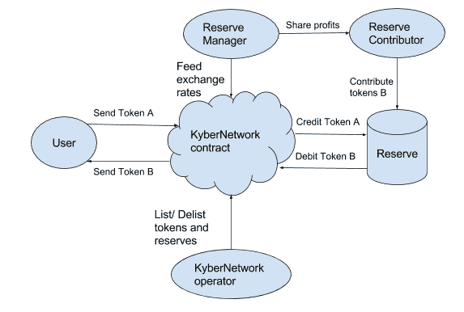

图 8.4：Kyber Network 的组件（来源：[`kyber.network/`](https://kyber.network/)）

*图 8.4*连接了 Kyber Network 的所有组件，形成了分散交易生态系统的概述。用户通过用户钱包提供的用户界面与 Kyber Network 合约进行通信，发起交易操作。智能合约与储备进行通信，执行信用或借记操作。储备经理获取交易汇率，智能合约确保选择最佳的交易汇率进行交易。

Kyber Network 与现有交易所的一些属性有所不同，包括：

+   不像中心化交易所，Kyber Network 不持有用户的任何资产。这意味着它不是攻击的目标。

+   由于交易在区块链网络上运行，因此可以访问任何类型的帐户，包括合同。智能合约可以与交易所进行通信，而无需任何中介。这为**分散自治组织**（**DAO**）开辟了全新的机会，组织的管理规则可以由网络成员而非中央机构决定。

+   所有交易请求几乎立即执行，用户将能够立即在其钱包中访问已转换的货币。

总结一下，由于其分散化模型，Kyber 在区块链生态系统中具有很大的潜力，这使其可以完全融入到任何分散系统中。

# 非金融区块链项目

在金融领域成功实施区块链技术后不久，区块链技术也在非金融领域得到了应用。我们将进一步对其进行分类，探索一些这样的实施。

# 资产管理

在现实世界中管理资产是一项充满挑战的任务，因为它需要中介来维护包含资产完整历史的记录。中介需要在为用户提供资产信息之前证明其合法性。在无信任的网络中建立信任是一项昂贵的任务。区块链技术帮助实现通过管理的分散化建立信任。

数字化物理资产的现有数字化表示是区块链应用的关键特征之一。物理资产的数字表示可以在分散网络中进行管理。

# Factom

**Factom**提供了精确、可验证和不可变的审计跟踪资产管理，并消除了信任的需要。记录管理带来了保护、同步和验证记录信息的困难问题。许多传统方法仍然需要一些手动操作，这使得扩展和准确性变得更加困难。

Factom 为解决个人或组织数据安全管理问题提出了一种解决方案，通过发布加密数据或数据指纹到分布式账本上。Factom 还允许用户审核和验证在区块链上发布的数据。Factom 通过在比特币区块链之上运行的分布式协议来实现这一点。

# 设计

Factom 提出了一种快速、廉价和无杂糅的开发基于区块链的应用程序的方法。Factom 体系结构的主要工作流程涉及以下步骤：

1.  服务器创建将记录在 Factom 自己的链中的块

1.  Factom 将一个锚（目录块的哈希）安全地放在比特币区块链上

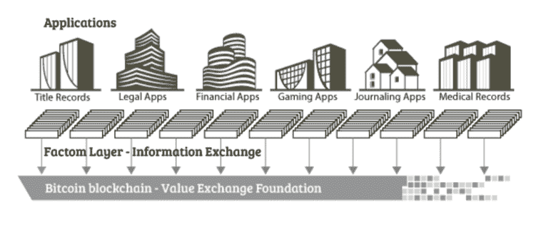

图 8.5：Factom 生态系统（来源：[`www.factom.com`](https://www.factom.com)）

如*图 8.5*所示，比特币区块链是 Factom 设计的最后一层，它只存储关于资产的最小信息。Factom 通过仅在不可变的比特币区块链上存储实际信息的摘要来创建锚到比特币区块链。

Factom 是通过形成一组块的层次结构而创建的，其中目录块与比特币区块链建立连接。层次结构本身构成了一系列引用，如*图 8.6*所示。目录块中的每个引用只是一个条目块及其链 ID 的哈希。这些条目块有引用，指向在某个时间段内到达的特定链 ID 的所有条目。链 ID 的条目块也是微链的一部分。Factom 中的大部分数据都在末端，即条目本身。由于比特币的不可变性，这些层次数据结构被认为是不可修改的。

Factom 系统中的层和概念如下：

+   **目录层**：这组织了条目块的默克尔根

+   **条目块层**：这组织了对条目的引用

+   **条目**：这包含应用程序的原始数据或其私人数据的哈希值

+   **链**：这是特定于应用程序的一组条目

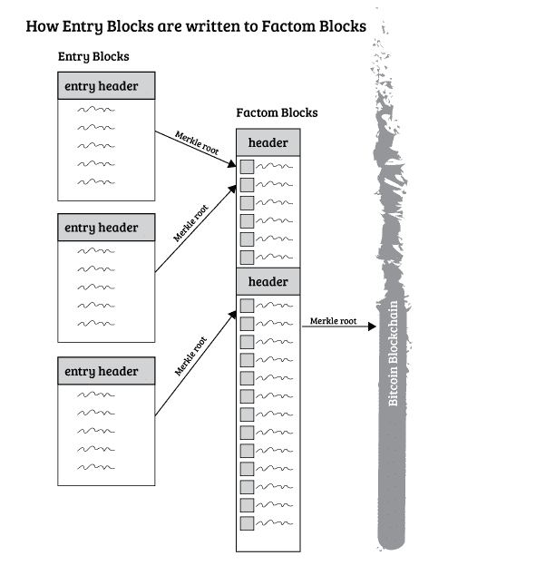

图 8.6：Factom 的分层架构（来源：[`www.factom.com`](https://www.factom.com)）

# Factom 产品

Factom 为私营企业和公众提供了几种解决方案。以下是 Factom 的一些产品：

+   **Factom Harmony**：这是为解决抵押行业的问题而创建的。通过使用 Factom 的透明度，它减少了使用文件、法律和合规费用。

+   **dLoc**：这是一个文件认证验证系统。Factom 与 Smartrac 合作，Smartrac 是一家领先的**射频识别**（**RFID**）产品制造商，使用该技术标记了可以被 RFID 标记的任何资产。

# 社交媒体平台

社交媒体是一个任何人都可以发布内容的地方，分享他们的观点、技能或知识，以帮助那些需要这些资源的人。尽管有多个不同目的的社交媒体平台，但并没有定义内容创作者如何为他们的贡献获得报酬的标准。基于区块链的网络有助于通过奖励社交媒体平台上的工作来对网络内容进行代币化。这是通过创建基于奖励的去中心化社交网络平台来实现的，如 Steemit、Sapient Network、Indorse 和 Sola。

Steemit 是一个博客平台，内容创作者和评论者根据他们的贡献得到公平的奖励。Steemit 使用 Steem 区块链来管理其平台上创建的每篇帖子或评论的奖励过程。我们将探索 Steem 区块链，以了解其对社交媒体平台的奖励系统。

# Steem

用户生成的内容一直为社交媒体平台巨头的创始人和股东赚取了数十亿美元。另一方面，内容创作者几乎没有得到任何认可，并且对他们的贡献获得的报酬非常少。Steem 通过将大部分股息返还给内容的贡献者来支持在线社区，这些贡献者首先为平台带来了价值。

Steem 是一个基于区块链的奖励系统，社区建设和社交互动可获得加密货币奖励。Steem 通过公平的会计系统鼓励用户参与社区，准确地奖励他们的贡献。它是一种基于工作证明的货币，其计划的区块生成时间为 3 秒。

# Steem 中的投票模型

Steem 平台有一种加密货币代币，称为 STEEM。Steem 以“一 STEEM，一票”的方式运作。在这种模式下，根据其账户余额衡量的对平台做出最大贡献的个人对贡献的评分具有最大影响力。

与 Steem 类似的现有系统允许消费者通过小费来向贡献者支付报酬，通常是通过微支付渠道。这些平台的缺点在于激励模型，并不总是激励良好的内容。Steem 的设计是为所有类型的贡献实现有效的微支付。内容消费者不必决定如何以及多少小费给内容创作者；相反，他们对内容进行投票，Steem 平台将使用他们的投票来确定个人奖励。

在 Steem 中投票可以准确地确定内容的质量，并相应地奖励内容创作者，而其他平台不一定会向内容创作者提供公平的奖励。Steem 奖励那些对内容的总价值做出最大贡献的人，并按照最终支付给内容创作者的奖励比例奖励投票者。

# Steem 代币

Steem 中有三种主要的代币：Steem（STEEM）、Steem Power（SP）和 Steem Backed Dollars（SBD）。

**STEEM**

STEEM 是 Steem 区块链上的加密货币代币。STEEM 可以在交易所轻松购买和出售。

**SP**

SP 基本上是锁定在一个为期 13 周的投票基金中的 STEEM，为平台提供额外的利益。Steem 用户对奖励分配的影响与他们拥有的 SP 数量成正比。SP 持有者还可以从他们的持有中获得利息。最早的投票获得最大的奖励份额，因为奖励是根据时间分配的。

**SBD**

任何货币的用户都希望其价值稳定。SBD 的设计旨在通过将其价值与 1 美元挂钩，为加密货币世界带来稳定。这种代币确保最大程度地使代币持有人受益，并使区块链网络能够增长。由于代币的稳定性，它可以在交易所与其他加密货币进行交换。

# Steem 中的共识

与其他区块链应用程序一样，在 Steem 中使用共识机制来将任何区块的交易包含在公共分类账中。负责包含一个区块的个人由 Steem 网络中的人民选出。区块创建是在轮次中进行的，每轮选择 21 名见证人创建区块。任何错过一个区块且在过去 24 小时内未生成区块的见证人将被禁用，直到他们更新其区块签名密钥。

共识机制确保每个人都有可能参与区块生产，无论他或她是否足够强大以至于最终处于顶部。拥有更多的 SP 可提高用户的投票权。

# 数字身份

数字身份是比特币原始区块链实现的固有特征之一。它标识了资产的所有者。它还可以存储重要的用户信息，该信息可以在用户同意的情况下与任何第三方共享。存储在区块链上的用户数字身份可以与不同的应用程序共享，从而减少用户的 KYC 操作的不必要重复以验证身份。此外，区块链提供的数字身份确保了用户的身份可以在全球范围内验证。

许多组织正在致力于区块链的数字身份功能，以便他们可以摆脱使用服务器来维护用户的机密数据的依赖性。像 IBM 和微软这样的科技巨头正在不断探索在区块链领域标准化数字身份的方法。

# ShoCard 身份管理

**ShoCard** 是一个身份管理服务，采用区块链技术构建，用户可以拥有和保护他们的数字身份。用户可以向任何人证明他们的身份，他们还可以决定与谁分享他们的详细信息。第三方可以使用区块链验证信息的真实性，而无需集中式验证器。

ShoCard 架构旨在提供非常高的交易吞吐量。它使用工作证明在短时间内认证大量用户。ShoCard 目前提供两种产品：

+   **软件即服务**（**SaaS**）的嵌入式模型

+   **ShoBadge**，一个完整的企业级 **身份提供者**（**IdP**）解决方案

# ShoCard 架构

ShoCard IM 平台提供了 **软件开发工具包**（**SDK**） 用于与应用程序集成。ShoCard IM 平台由以下模块组成：

+   ShoCard SDK

+   ShoCard 服务层

+   ShoCard 侧链

+   区块链缓存

+   ShoCard 区块链适配器

ShoCard 有一个服务层，位于应用程序和服务器之间。由于所有消息都是加密的，在通信过程中服务层无法读取数据：

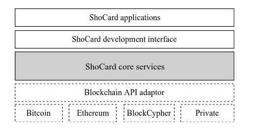

图 8.7：ShoCard 架构

以下是 ShoCard 服务的一些职责：

+   ShoCard 服务器充当安全通信管道，并简单地将信息写入区块链。

+   ShoCard 服务层负责管理所有客户端 SDK 和区块链之间的接口。

+   ShoCard 侧链用于提高吞吐量。认证数据存储在侧链中，只有散列数据存储在公共区块链中。

+   区块链还会缓存区块链的本地副本，以实现更快的读取访问，从而验证可以独立于公共区块链的情况下进行管理。

+   ShoCard 区块链适配器抽象出维护工作证明的区块链接口，因此 ShoCard 服务层可以保持高效。

ShoCard 使用不可变的公共区块链来验证用户的身份，但不是为了存储用户的详细信息。由于公共区块链数据提供了高度的透明度，因此存储在区块链中的数据应仅用于验证用户证书。区块链充当证书的存储库。

ShoCard 的一些用例包括：

+   无密码登录

+   通过为整个旅程或逗留创建一个具有数字身份的单一旅行令牌，改善客户在机场和酒店的旅行体验

+   自动注册

+   身份验证

+   年龄验证

在 [`shocard.com/identity-management-use-cases`](https://shocard.com/identity-management-use-cases) 查看 ShoCard 身份管理用例的详细列表。

# 物联网（IoT）中的区块链

IoT 领域中的许多公司，例如 Filament、Xage 甚至 IBM 的 Watson 平台，都在寻求实现更好的连接和存储的替代技术。区块链的引入促使这些公司将物联网和区块链融合，许多公司已经成功地整合了它们，获得了超出现有实施的好处。

由于区块链承诺为自主产品提供基础，它保证产生**可信物联网**（**IoTT**）。将区块链与物联网合并的原因之一是在设备之间建立信任、降低成本和增加交易速度。从定义上讲，物联网是分布式的，这使得更容易在分布式区块链分类账中采用用例。

# IOTA

**IOTA**是一个开源的分布式分类账，旨在通过无费微交易来推动物联网的未来。由于将有数十亿台连接到互联网上需要高效交换信息的设备，需要一种可扩展的解决方案，其中每秒需要处理数百万次交易。 IOTA 提议使用修改后的交易模型为物联网世界中的机器对机器通信提供可扩展的解决方案。

IOTA 维护其分布式分类账的方式与现有的去中心化应用程序完全不同。 IOTA 不能被归类为区块链项目，因为它不使用区块链作为其基础技术。 IOTA 使用**有向无环图**（**DAG**）技术而不是区块链中的区块来创建和维护交易。 交易确认时间非常快，由于不受区块创建时间的限制，交易吞吐量没有限制。

IOTA 基于一种称为**Tangle**的新型分布式分类账，尝试解决区块链设计中的一些问题，试图通过引入一种新的达成去中心化 P2P 系统共识的方式来创建一个高效和可扩展的系统。

Tangle 是一种保存区块链安全交易特性的分布式分类账，它消除了双花问题，但不会将交易存储在区块中。

# 设计

对于每个新交易，在 Tangle 中验证两个随机的未确认交易。每次验证交易增加了交易是真实的可能性。每个交易都应该接收一定数量的验证才能被接受为确认交易。在 IOTA Tangle 中，一些交易将具有较少的验证，而其他交易将具有足够数量的验证。

用户必须验证其他两个随机选择的交易才能发送创建的交易。随后其他用户应验证该交易。由于每个节点都贡献于分布式分类账，其架构本质上是去中心化的。IOTA 与最初将确认所有交易的协调员一起工作。

一旦网络变大，协调员就可以移除。目前，IOTA 使用**Kerl**，即 SHA-3 的一种版本，作为哈希函数，可以与三元（而不是二元）操作配合使用。

IOTA 在每笔交易中使用工作量证明来防止垃圾邮件，与 Hashcash 中使用的工作量证明精神类似。

# IoT 中的 IOTA

尽管我们已经听说了相当长时间的 IoT，但它实际上并没有为一般观众做出多少贡献。市场上的物联网产品倾向于增加用户的奢侈品，但它们不一定能解决现实问题。IoT 设备必须替换大多数孤立设备，并且它们应该能够以相当高效的方式相互通信。IOTA 的架构确保了随着设备数量的增长，通信可以很容易地扩展。

# 数据存储

P2P 网络协议的一个重要应用是数据存储的分散化。**BitTorrent**是第一个通过 P2P 网络实现数据存储分散化的协议。随后实施的**星际文件系统**（**IPFS**）协议用于创建分布式文件系统，并在其后期实现中还利用了比特币区块链技术。

已经创建了几个使用了分布式文件系统的区块链项目，节点通过代币获得激励来贡献存储在网络上。已经引入了不同的共识算法，这些算法对存储、数据检索和激励过程至关重要。

一些基于区块链的分布式数据存储项目如下：

+   Storj

+   MaidSafe

+   Filecoin

+   Siacoin

# Filecoin

Filecoin 是一个分布式存储网络，将其存储网络转化为一个算法市场。加密货币证明了像数字货币这样的重要资产可以在不需要中介的情况下交易。但这些货币只在网络上具有分散的交易信息。在区块链网络中分散大量数据是昂贵且缓慢的，并且数据不需要像交易那样被验证，因为每个数据块与其他数据块无关。已经创建了许多协议来实现分布式数据存储，以便数据可以在不需要第三方的情况下被有效地获取。IPFS 就是这样的协议之一，通过使网络本身分散化，证明了内容寻址的实用性，在全球 P2P 网络中使用数十亿个文件。

Filecoin 通过区块链的帮助提供了一个激励模型，建立在 IPFS 存储协议之上。Filecoin 为去中心化存储创建了一个市场。提供分布式存储网络空间的节点被称为矿工，它们类似于比特币中的矿工，尽管它们提供的是计算能力。消费者向矿工支付 Filecoin 作为他们的存储贡献的报酬。Filecoin 网络通过在存储网络中复制和分散内容来实现稳健性。

Filecoin 区块链中的共识是通过证明空间时间实现的，借出存储空间的矿工有资格创建区块。Filecoin 协议为消费者提供数据存储和检索服务。

# IPFS

IPFS 是一个旨在创建可寻址内容和 P2P 存储媒体的协议的分布式文件系统。2014 年，IPFS 采用了比特币区块链以存储需要不可变性的数据。

IPFS 中的文件通过它们的哈希标识，因此它们以友好的方式缓存。IPFS 使用一个单一的庞大群集，任何人都可以向任何其他人提供数据块；块共享不仅限于文件的对等方，与 BitTorrent 协议不同。IPFS 文件可以通过多种协议访问，如 HTTP。IPFS 有一个名为**星际命名系统**（**IPNS**）的命名服务，与其他命名服务（如 DNS 和.onion）兼容。

# Filecoin 共识

比特币中的共识算法实际上除了达成全局区块链状态的共识之外，没有为任何其他方面做出贡献。

比特币挖矿的困难使得一个节点参与挖矿过程非常昂贵。Filecoin 提出了一个有用的工作共识机制，确保矿工为达成共识所做的工作是有用的。

Filecoin 的有用共识协议选择一个矿工来创建一个区块，被选中的矿工的概率与其当前使用的存储相对于网络的其余部分成正比。因此，这个共识协议确保提供的存储量也被用作计算的证明。

# Filecoin 的去中心化存储网络（DSN）

Filecoin 的 DSN 是基于激励审计和验证交易。网络中的客户向矿工支付费用来存储和检索数据。只有在网络审核提供的服务时，矿工才会得到支付。

网络中的不同参与者是**客户**、**存储矿工**和**检索矿工**：

+   客户通过 PUT 和 GET 请求支付费用来存储数据和检索数据在 DSN 中。

+   存储矿工向网络提供数据存储。存储矿工通过提供磁盘空间并为客户提供 PUT 请求参与 Filecoin。要成为存储矿工，用户必须通过存款抵押他们的存储。存储矿工通过承诺在指定时间内存储客户的数据来响应 PUT 请求。存储矿工生成时空证明并将其提交到区块链以证明他们通过时间存储数据。如果存在无效或丢失的证明，存储矿工将受到惩罚并失去部分抵押。存储矿工也有资格挖掘新区块，这样做可以获得创建区块的挖掘奖励以及包含在区块中的交易费。

+   检索矿工向网络提供数据检索。检索矿工通过提供用户通过 GET 请求的数据来参与 Filecoin。与存储矿工不同，他们不需要承诺、承诺存储数据或提供存储证明。存储矿工也可以自然地参与为检索矿工。检索矿工可以直接从客户获取数据片段，也可以从检索市场获取。

所有 Filecoin 节点的集合被称为 Filecoin 网络。Filecoin 网络负责存储网络的管理协议。管理涉及审计存储证明、修复可能的故障、管理可用存储和验证承诺。

# Filecoin 市场

为满足 Filecoin 网络中的需求和供应请求，有两个市场：存储市场和检索市场。这两个市场具有相同的结构但不同的设计：

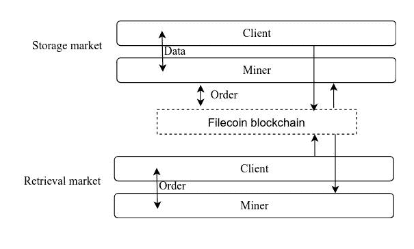

图 8.8：Filecoin 市场

客户和矿工通过将其提交给市场来提出所需或提供的服务的价格。当交易匹配订单时，它将启动并执行交易。

Filecoin 通过可验证市场以分散的方式交换服务。矿工和全节点是可验证市场的参与者。可验证市场是一个具有两个阶段的协议：订单匹配和结算。

存储市场是一个可验证的市场，允许客户向矿工支付以存储数据。就像任何交易所一样，它维护着一个链上订单簿。订单簿是公开的，因此客户始终可以监视价格并相应地进行竞标。

检索市场是一个可验证的市场，允许客户向矿工支付以检索存储的数据。客户请求特定的信息片段，市场分配一个矿工来提供此数据。与存储矿工不同，检索矿工不需要生成存储证明。网络中的任何用户都可以成为检索矿工，通过为 Filecoin 中的奖励提供数据来交换服务。

# BigchainDB

**BigchainDB**是继承了许多区块链系统属性的数据库软件。它汇集了结构化数据库（高交易速率和低延迟）和区块链系统（不可变性、去中心化和身份）的最佳特性。最初的 BigchainDB 实现并未实现纯净的去中心化，因为易受单点故障的影响。最近发布的 BigchainDB 通过确保节点的**拜占庭容错**（**BFT**）来实现去中心化。这是通过集成用于网络和共识功能的**Tendermint**协议来实现的。

# BigchainDB 的特性

BigchainDB 涵盖了分布式数据库和典型基于区块链系统的所有必要特性。虽然它并没有区块链数据库的理想特性，但它是一个出色的数据存储解决方案，是一个有用的去中心化数据库系统。

**继承的区块链特性**

BigchainDB 继承自区块链的特性包括：

+   **去中心化**

网络中的每个节点都包含自己的 MongoDB 实例，用于维护所有交易。BigchainDB 是去中心化的，以确保没有单一所有者、控制点或故障点。即使第三方节点的三分之一出现故障，网络也会对此故障具有弹性。BigchainDB 通过使用称为 Tendermint 的中间件来确保 BFT。

Tendermint 不使用比特币的工作量证明算法来实现每个块的共识，因为这会消耗大量能源。它通过在验证节点之间达成共识来提供 BFT。验证节点通过广播投票参与共识协议，以决定追加下一个块。如果协议获得大多数选票（3 分之 2 的验证者），则将块提交到区块链。Tendermint 协议需要在每次将块插入区块链时运行此共识过程，以确定下一个块，因此它被称为基于轮次的协议。

+   **不可变性：**与传统数据库不同，BigchainDB 不对插入数据执行更新或删除操作。由于区块链的性质，交易只能追加。每个节点上的所有交易以不可变的方式在 MongoDB 实例中维护，类似于其他区块链系统。

+   **资产所有权：**与大多数基于资产的区块链应用程序一样，BigchainDB 提供资产管理操作，如资产创建和转移。用户可以通过拥有资产转移的账户的私钥来声明资产。一般情况下，诸如加密货币之类的区块链应用只有一种类型的资产，但 BigchainDB 可以创建用户所需的任意多种资产。所有资产管理操作都通过创建交易来执行，并验证每个交易，以确保免受双重花费等交易攻击的影响。

**数据库继承特性**

BigchainDB 的数据库继承特性包括以下内容：

+   **高交易吞吐量：**BigchainDB 是作为现有分布式数据库的替代品而创建的，同时还提供了区块链技术所提供的附加功能。虽然该数据库是按照区块链原则设计的，但它保留了数据库的特征。即使在分散网络中，它也能实现高交易速率。最新版本的 BigchainDB 每秒处理一千笔交易，这在其他基于区块链的存储应用中是高速的。

+   **低延迟：**BigchainDB 仅需几秒钟即可将交易包含在已提交的区块中。Tendermint 协议负责在分散网络中保持低延迟。

+   **数据库查询：**我们都知道，任何结构化或非结构化数据库都使用查询语言请求和检索其中的数据。BigchainDB 节点还允许用户索引和查询存储的数据。网络中的每个节点都维护自己的 MongoDB 实例。节点运营商可以决定如何将数据库暴露给区块链网络。节点可以暴露任何接口，可以是 REST API 或 GraphQL API。

# BigchainDB 交易的生命周期

BigchainDB 交易的生命周期包括以下步骤：

**创建交易**

只要创建的交易符合 BigchainDB 交易规范，即定义了交易的预期键和值，任何用户都可以创建并将 BigchainDB 交易广播到网络。

通常情况下，交易是通过 BigchainDB 提供的驱动程序创建的。有各种编程语言的驱动程序列表，包括 Python 和 JavaScript。

以下 JSON 结构显示了交易的所有字段。BigchainDB 交易包括输入和输出，类似于比特币交易。此外，每个交易都有一个`operation`字段，指定了在资产上执行的操作：

```
{ 
  "id": "3667c0e5cbf1fd3398e375dc24f47206cc52d53d771ac68ce14ddf0
 fde806a1c", 
  "version": "2.0", 
  "inputs": [ 
    { 
      "fulfillment": "pGSAIEGwaKW1LibaZXx7_NZ5-V0alDLvrguGLyLRkgm
 KWG73gUBJ2Wpnab0Y-4i-kSGFa_VxxYCcctpT8D6s4uTGOO c\nF-hVR2VbbxS35
 NiDrwUJXYCHSH2IALYUoUZ6529Qbe2g4G", 
      "fulfills": null, 
      "owners_before": [ 
        "5RRWzmZBKPM84o63dppAttCpXG3wqYqL5niwNS1XBFyY" 
      ] 
    } 
  ], 
  "outputs": [ 
    { 
      "amount": "1", 
      "condition": { 
        "details": { 
          "public_key": "5RRWzmZBKPM84o63dppAttCpXG3wqYqL5niwNS1XB
 FyY", 
          "type": "ed25519-sha-256" 
        }, 
        "uri": "ni:///sha-256;d-_huQ-eG-QQD-GAJpvrSsy7lLJqyNhtUAs_own7aTY?fpt=ed25519-sha-256&cost=131072" 
      }, 
      "public_keys": [ 
        "5RRWzmZBKPM84o63dppAttCpXG3wqYqL5niwNS1XBFyY" 
      ] 
    } 
  ], 
  "operation": "CREATE", 
  "asset": { 
    "data": { 
      "message": "Greetings from Berlin!" 
    } 
  }, 
  "metadata": null 
} 
```

**传输交易**

一旦交易创建，就可以通过调用节点暴露的 HTTP API 将其传输到网络。交易抵达节点时，会进行验证以确保符合交易规范和交易合法性。然后使用 Tendermint 实例将其广播到网络。以下图显示了 BigchainDB 的服务器、一个 MongoDB 实例和 Tendermint 实例在网络中的互联情况：

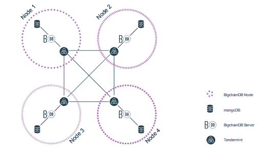

图 8.9：BigchainDB 网络及其组件（来源：[`www.bigchaindb.com`](https://www.bigchaindb.com)）

# 使用案例

由于 BigchainDB 的区块链和数据库特性，它的应用可以在集中式和分散式生态系统中见到。在集中式系统中，比如云上的服务器，它可以取代现有的数据库。然而，它最适合的应用是与以太坊等分散式平台一起使用。在以太坊中创建的 DApp 通常使用 IPFS 等分布式存储机制。在这样的应用中，可以使用 BigchainDB 来存储交易数据。

# 分布式计算

在过去的十年中，我们见证了计算行业的巨大增长。计算行业的增长表现在处理能力、内存、存储、网络、设计等方面。随着计算能力的增加，开发人员开始着手开发同样令人兴奋的项目来利用这些能力。尽管高性能计算设备对一般公众是可用的，但它们并不十分经济实惠。这就是分布式计算被引入的地方，它允许多台计算设备一起解决复杂问题，通过将问题分解成任务进行处理。

分布式计算是一种在不使用单一高性能计算机的情况下解决复杂任务的高效方式。就像分布式数据存储一样，分布式计算已经与区块链平台集成。**Golem**是一个基于区块链的平台，提供了一个计算能力的市场。

# [Golem](https://golem.network)

Golem 是一个 P2P 网络中的全球分布式计算能力市场。它允许任何拥有多余计算能力的人成为生产者，并通过将其贡献给分散网络来从计算能力获利。Golem 可用于为分散的微服务或任何异步任务提供计算能力。Golem 市场的主要优势在于降低复杂任务（如 CGI 渲染、科学计算和机器学习）的计算价格。

Golem 在一个 P2P 网络中运作，允许拥有计算能力的提供者向客户租赁他们的资源，或者用 Golem 专业术语来说，是请求者。与现有的云平台不同，那里的付款是通过第三方服务定期进行的，Golem 使用了一个基于以太坊的微支付服务来实现直接支付，从而使网络参与者之间能够直接进行支付。

# Golem 生态系统

Golem 生态系统由三个主要组件组成 - 资源提供者、资源请求者和软件开发人员。下图描绘了由这些组件构成的 Golem 生态系统：

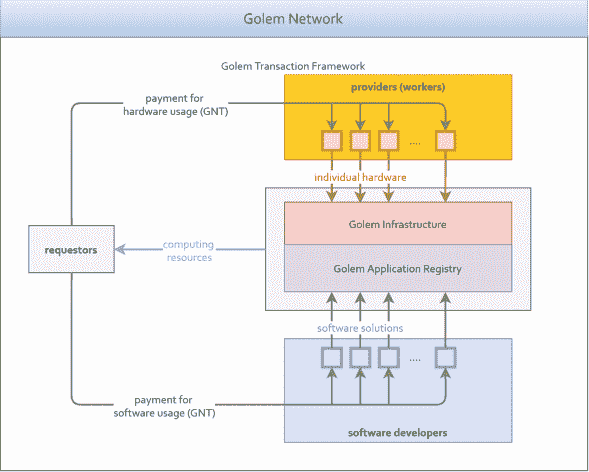

图 8.10：Golem 生态系统（来源：[`golem.network`](https://golem.network)）

**应用注册表**

应用注册表是以太坊区块链上的智能合约，任何人都可以发布在 Golem 网络上运行的应用程序，比如集成工具。这个注册表可以用作请求者寻找工具的市场。

由于在分散系统中信任未经测试的软件是不安全的，Golem 在特殊用户——验证者的帮助下通过白名单或黑名单应用程序。当软件作者发布一些软件时，验证者会审查并认证该应用程序是安全还是不安全的。所有安全应用程序都被添加到白名单中，其他应用程序则被添加到黑名单中。提供者在使用应用程序时使用此白名单。Golem 维护一个安全应用程序的白名单，可以由初次用户参考。

**提供者**

计算能力由 Golem 生态系统中的提供者提供。去中心化网络的基础设施可以由任何人提供。提供者甚至可以提供单个 CPU 的周期。每个提供者都会因为为请求者的计算任务做出贡献而获得报酬。

**请求者**

请求者是提供者共享的计算资源的消费者。由于提供者和请求者的参与，Golem 是一个竞争市场。这个竞争市场导致了计算资源的合理价格，不像现有云平台的定价。

Golem 允许用户同时充当提供者和请求者，以便请求者在空闲时间共享其资源。

**Golem 网络代币（GNT）**

GNT 通过促进参与者之间的微支付服务来为整个去中心化网络提供动力。GNT 是在项目的众筹期间创建的，但主要用于 Golem 网络的请求者和提供者：

+   GNT 用于提供者和请求者提供的服务之间的结算

+   软件开发人员通过为应用程序注册表做出贡献而获得 GNT 的报酬

+   参与软件验证过程需要 GNT

Golem 代币无法挖掘，数量限制为在众筹期间创建的代币数量。

# 区块链平台

随着分散的区块链应用在几个技术领域获得了大量曝光，个人开发人员和组织开始创建区块链平台，其中应用程序可以在不担心 P2P 网络、共识或交易的基础实现的情况下创建。这些项目为通用程序员提供了一个平台，通过创建业务逻辑就可以实现有效用例。

每个区块链平台都有自己的区块链和节点网络。这使得在一个区块链平台中创建的区块链应用在区块链上的交易和其他数据方面被隔离开来。有多个区块链平台，它们各自尝试解决现有平台实现中的问题或为特定应用程序开发附加功能。

我们已经研究了 NEO 和 MultiChain 平台，并创建了分散的应用程序。以太坊、Eris、NXT、EOS 和 Hyperledger 是一些知名的平台，用于实现各种用例。

# 以太坊

以太坊是通过提供一个使用修改版比特币共识算法的不可变账本来创建去中心化应用程序的广泛使用的平台。以太坊通过一种名为 Solidity 的面向对象编程语言提供先进的脚本功能。以太坊拥有自己的分布式虚拟机，称为 EVM，可以执行编译后的 Solidity 脚本。

以太坊是由维塔利克·布特林于 2013 年末提出的，当时他是与比特币有关的程序员。布特林此前曾提出比特币需要一个先进的脚本语言来开发应用程序。在未能说服比特币开发社区之后，他提出了以太坊。

# 以太坊代币

以太坊包含一个名为以太的代币，它支持区块链的功能。以太坊中的所有交易都需要一个小额以太费用才能被包含在区块链中。这个小的计算单位称为**气体**。与 NEO 的 GAS 代币不同，后者在第七章中讨论过，*深入区块链-拥有权的证明*，气体不是一个独立的代币，而是以太的一个小单位。

**以太**

以太是以太坊生态系统中使用的加密货币。以太可以像比特币一样用作虚拟货币。用户可以使用由用户拥有的公钥和私钥进行交易。以太代币在加密货币交易所以 ETH 符号交易。

**气体**

Gas 是当交易被包含在区块链中时需要附加的一笔小额以太费用。Gas 主要是为了减轻区块链中的垃圾交易而创建的。任何智能合约作者在将其部署到公共分类账时都会附加一小笔 Gas。这将确保作者将一个合法的合约部署到区块链上。

用户在部署合约时可以指定以太的少量作为气体价格，这称为气体价格。任何交易中需要花费的气体量称为气体限制。气体价格以 gwei 单位度量（1 以太=10⁹ gwei）。

# EVM

与比特币使用的基于堆栈的语言不同，Solidity 是一种图灵完备的语言，因此它需要一个运行时环境来执行程序。EVM 为以太坊节点执行智能合约提供了运行时环境。EVM 在与以太坊网络和主机机器的其他进程隔离的节点上运行。只有智能合约的输出可以被广播并附加到区块链作为交易。EVM 执行已编译为以太坊字节码的 Solidity 脚本。这确保了执行与平台无关，以便网络上的每个节点执行并产生相同的输出。EVM 已被实现在几种不同的语言中，包括 Go、JavaScript 和 Python。

# 区块链共识

Ethereum 节点通过使用基于工作证明的算法类似于比特币为区块链挖掘区块。附加区块的节点确保对区块使用哈希函数进行了足够的计算。平均区块创建时间限制在约 12 秒左右。

Ethereum 使用一种名为**Ethash**的工作证明算法，这是一种抗 ASIC 算法，旨在克服挖矿过程的集中化。挖矿需要在计算哈希之前从伪随机缓存生成大型数据集。由于在此过程中使用了内存，因此它抵抗基于 ASIC 的挖矿设备。验证过程可以使用较低的内存进行，因为它只需要重新生成数据集的一部分。

ASIC 是**应用特定集成电路**的缩写。该电路将执行特定的操作。比特币 ASIC 是专门为运行 SHA256 散列函数而开发的，以充分利用硬件的功能。

Ethereum 已计划在不久的将来用股权证明取代基于工作证明的共识。矿工将不再能够通过他们的计算能力做出贡献。而是代币持有者将为共识做出贡献。

# DApp 开发

目前，由于其出色的社区支持，Ethereum 是最广泛使用的 DApp 开发平台。在以太坊平台上有超过 2,000 个活跃的 DApps。完整的统计数据可以在[`www.stateofthedapps.com/stats`](https://www.stateofthedapps.com/stats)找到。它提供了一套优秀的工具来启动 DApp 的开发。在本节中，我们将列出一些在以太坊生态系统中开发 DApp 所需的基本组件和工具。

**Geth**

Ethereum 提供多种语言的客户端软件，包括 C++、Python 和 Rust。客户端软件的 Go 编程语言实现，称为**Geth**，很受欢迎。每个客户端软件都捆绑了几个组件：

+   **客户端守护程序**：就像比特币核心的客户端守护程序一样，Geth 守护程序是一个进程，它与其他以太坊节点建立 P2P 连接以交换区块链数据。Geth 守护程序需要一直运行以确保客户端的本地区块链副本是最新的。Geth 客户端守护程序还可以验证和挖矿交易。客户端公开了一个 RPC 接口，以便 DApps 与区块链网络通信。

+   **客户端命令行界面**（**CLI**）：客户端软件提供了一个命令行界面，可以用来在以太坊客户端节点上执行操作。CLI 可用于管理账户、创建交易以及查询本地区块链数据，等等。

+   **客户端用户界面**：Mist 是最广泛使用的图形用户界面软件。它捆绑了以太坊节点的 Go 和 C++ 实现。

**Web3.js**

与其他 web 应用程序一样，即使 DApps 也需要一个前端应用，提供用户与后端应用通信的界面。由于大多数前端应用程序在 web 浏览器中执行，以太坊提供了一个名为 web3.js 的 JavaScript 库，可用于前端应用程序与去中心化区块链网络通信。如果客户端界面是用 Python 构建的，还可以使用其他语言的库，如 Web3.py 用于 Python，可以执行类似的操作。

**Truffle 框架**

**Truffle** 是一个框架，通过创建所需的项目结构、基本脚本和配置来帮助引导以太坊 DApp 项目的启动。这类似于 Django、Angular 和 React 等框架。Truffle 简化了开发人员编译和部署合约到区块链的任务。

**MetaMask**

MetaMask 是一个应用程序，充当运行在 web 浏览器上的用户界面应用程序与以太坊区块链节点之间的桥梁。在 *图 8.11* 中，MetaMask 构成 DApp 用户界面与区块链节点之间的桥梁。MetaMask 为 web 浏览器提供插件或扩展，可以让用户管理他们的账户。所有对以太坊区块链的交易查询都通过 MetaMask 桥梁转发到以太网络。

MetaMask 通过调用节点提供的 RPC 接口方法与区块链节点通信：

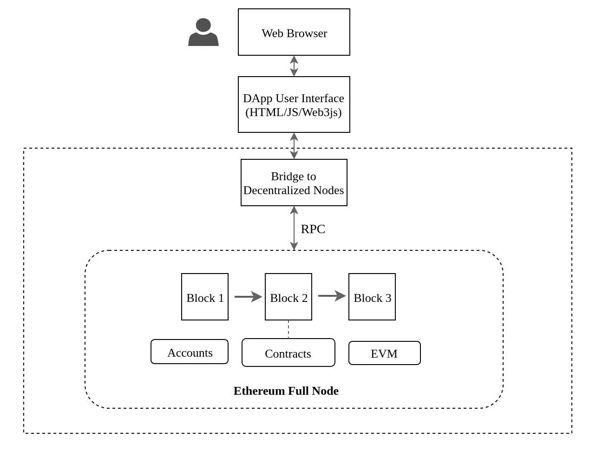

图 8.11：以太坊 DApp 架构

# 以太坊网络

像比特币一样，以太坊可以在主网或测试网区块链上运行。主网和测试网区块链都是公共区块链。此外，以太坊节点可以建立私有或本地区块链实例。由于拥有多种选择和社区支持，设置以太坊开发环境非常容易。

**本地区块链**

可以在瞬间设置以太坊本地区块链实例。来自 Truffle 框架的一个名为 **Ganache** 的 JavaScript 包可以设置以太坊的本地实例。该包附带以太坊区块链的 JavaScript 实现，因此本地测试不需要以太坊客户端。本地以太坊区块链实例配有挖矿、账户管理、区块链浏览器和许多其他更新功能。Ganache 运行一个本地以太坊客户端实例，还监听以太坊的 JSON-RPC 端口（8545）。

**测试网区块链**

以太坊的测试网与比特币的测试网类似。它模拟了主网区块链，唯一不同的是它包含一个备用区块链，其交易没有实际价值。测试网也需要 gas 来部署智能合约或简单交易。

与比特币的测试网不同，以太坊社区中有三个测试网区块链，每一个都由不同的团队维护：

+   **Rinkeby 测试网络**：这是由 Geth 团队维护的权威证明区块链网络。在该网络中无法挖掘以太币。

+   **Ropsten 测试网络**：这是一个工作量证明区块链网络，可以在其中挖掘以太币。

+   **科文测试网络**：这是由 Parity 团队维护的权威证明区块链网络。在该网络中无法挖掘以太币。

由于在任何测试网络中创建任何交易都需要燃气，甚至在测试网络中，可以通过向测试网络水龙头请求获得。在 Rinkeby 测试网络中，用户可以通过指定目标帐户地址从 [`faucet.rinkeby.io`](https://faucet.rinkeby.io) 请求以太币。

# 项目链接

我们列出了一些在本章中提到的项目的链接。

+   **Zcash 实现**：[`github.com/zcash/zcash`](https://github.com/zcash/zcash)

+   **瑞波实现**：[`github.com/ripple/rippled`](https://github.com/ripple/rippled)

+   **Kyber Network 项目**：[`github.com/kybernetwork`](https://github.com/kybernetwork)

+   **Factom 项目**：[`github.com/FactomProject`](https://github.com/FactomProject)

+   **Steem 区块链**：[`github.com/steemit/steem`](https://github.com/steemit/steem)

+   **IOTA 项目**：[`github.com/iotaledger`](https://github.com/iotaledger)

+   **IPFS 协议**：[`github.com/ipfs/ipfs`](https://github.com/ipfs/ipfs)

+   **BigchainDB 服务器**：[`github.com/bigchaindb/bigchaindb`](https://github.com/bigchaindb/bigchaindb)

+   **Golem 项目**：[`github.com/golemfactory`](https://github.com/golemfactory)

+   **以太坊项目**：[`github.com/ethereum`](https://github.com/ethereum)

# 总结

我们尝试覆盖了金融和非金融领域中大多数区块链应用。本章深入剖析了不断增长的区块链行业以及区块链生态系统中应用的可能未来轨迹。

在本章中，我们最初将几个项目分类为金融和非金融领域的区块链技术，并列出了这些项目。然后，我们通过深入研究其架构、实现、用例等来介绍每个项目。我们确保了解了每个实现中区块链的作用。

现在我们了解了一些区块链的应用案例，以及它们的优缺点，我们可以考虑优化现有的区块链架构。在下一章中，我们将介绍一些在设计使用区块链的 DApps 时可以实现的优化。
