# 区块链优化和增强

可伸缩性是一个在创建应用程序之前甚至被谈论的关键因素。然而，即使应用程序部署后，应用程序也需要根据应用程序负载频繁更新以实现扩展。虽然可伸缩性一直是区块链领域的关注点之一，但在技术首次提出时并不是第一优先级。然而，随着时间的推移，由于对技术的增加兴趣，人们现在正在努力改进区块链技术的每个方面。

在本章中，我们将探讨可以实施的各种优化，以帮助您实现更好的性能或规划可扩展性。我们还将涵盖一些对现有区块链应用程序进行增强的功能。本章中讨论的大多数优化和增强已经在一些区块链项目中实施，或者正处于实施的初期阶段。

在本章中，我们将涵盖以下主题：

+   区块链优化：

    +   交易交换

    +   离线交易

    +   区块大小改进

+   区块链增强：

    +   分片

    +   共识算法- PoS、PoA、BFT 和 PoET

    +   跨链网络

    +   隐私增强

自 2009 年比特币的原始实施以来，它已经通过提出特性的标准程序进行了巨大改进，这些特性通过名为**比特币改进提案**（**BIP**）的设计文档提出，这是在比特币社区中于 2011 年首次提出的。比特币有近 200 个改进提案（[`github.com/bitcoin/bips`](https://github.com/bitcoin/bips)），这些提案是其在网络中的韧性的原因。

我们已经看到了几个基于比特币概念发展而来的基于区块链的项目。许多其他项目必须经历巨大的实施变化，以满足其要求。大多数项目改进和增强了现有的实施，以解决一些挑战，如可伸缩性、安全性和适应性。企业都热衷于利用这项技术来去中心化其现有架构。他们一直在创建概念验证来克服采用该技术之前所面临的所有现有挑战。在本章中，我们将研究技术中一些提出的优化和增强，这将消除技术所面临的挑战。

# 区块链优化

由于区块链应用程序的去中心化性质，对运行中的应用程序的区块链协议进行重大变更是困难的。现有协议需要经过精心优化才能实现改进。在接下来的部分中，我们将讨论一些可能的优化方式。

# 交易交换

通信和数据交换是去中心化 P2P 网络的本质。在区块链网络中，交易是节点之间交换的主要数据。通过利用适合交易数据的协议，可以优化交易的交换。一些优化技术在以下部分有描述。

# 区块链中继网络

虽然区块链网络中的节点是平等的，但节点可以选择执行各种角色。一些节点可能作为全节点，维护整个区块链，而另一些节点可能作为轻量级节点，只维护所需的交易。此外，愿意创建新区块的节点将执行挖矿操作。当所有这些节点以 P2P 方式相互通信时，将涉及网络延迟。

挖矿节点需要尽量将延迟降到最低，因为它们涉及时间敏感的操作。即使在关键的金融交易过程中，去中心化系统也需要尽量保持延迟最小化，以便客户和商家能够快速收到通知。比特币网络使用中继网络来在节点之间交换区块时尽量减少延迟，尤其是在竞争构建下一个区块的挖矿节点之间。

中继节点在将区块/交易传递到网络之前并不完全验证数据。虽然中继节点很快地中继了大部分交易，但它们可能无法准确地交付系统中的每一笔交易。比特币核心开发者 Matt Corallo 创建了一个基于 UDP 的中继网络，名为**快速互联网比特币中继引擎**（**FIBRE**）。它使用由比特币核心开发的紧凑区块提供的压缩技术。由于 FIBRE 代码库是比特币核心的一个扩展，FIBRE 节点可以像比特币核心节点一样设置。

关于协议和节点设置的更多信息可以在[`bitcoinfibre.org`](http://bitcoinfibre.org)找到。

另一个名为**Falcon**的中继网络使用应用级切换路由来实现更快的区块传播。优化后的拓扑结构声称它比基于压缩的中继网络更快。这些中继网络不仅保证网络节点将实现更高的吞吐量，还承诺为去中心化 P2P 网络的未来扩展性提供支持。

有关 Falcon 中继节点的更多详细信息可以在[`www.falcon-net.org`](https://www.falcon-net.org)找到。

# 可逆布隆查找表

可逆布隆查找表可用于有效地找到两个数据集之间的差异。这个概念已经在比特币中实现，以实现节点之间较低的事务交换延迟。如果没有找到两个集合之间的差异的任何机制，每个比特币节点都必须不断地将自己的交易集转移到网络上，并期望其他节点用不存在于交易集中的交易来回复。由于每个节点中存在大量的交易，这种机制消耗了大量的比特币网络带宽和时间。

一个解决方案是传输可用于有效找到数据集之间差异的信息。可逆布隆查找表通过创建可以找到两个集合之间的交易差异的较小查找表来解决这个问题。

可逆布隆查找表是布隆过滤器的一种变体。它们以高概率提供键-值对的成功查找。与布隆过滤器不同，它们不仅允许您查找特定键，而且可以列出插入的键/值对。查找表是一种概率性数据结构，成功查找的概率随查找表的大小而增加。

布隆过滤器是一种用于检查集合中元素存在性的概率性数据结构。虽然元素不存在永远不会被错误地预测（假阴性），但有时可能会错误地预测存在性（假阳性）。布隆过滤器被用于比特币的一种特殊节点，称为轻量级或**简单支付验证**（**SPV**）节点，该节点用于在不下载整个块的情况下验证块中特定交易的存在性。

网络上的每个节点将广播一个用于交易池的查找表，该表将被网络中的其他节点识别。网络中的节点将仅交换所需的交易，从而减少冗余通信。借助这些查找表，可以快速且安全地同步池中的交易。

# 链下交易

可在区块链之外执行的一组交易称为链下交易。链下交易依赖于与主要区块链中使用的验证方法不同的几种验证方法。尽管链下交易的主要动机是实现增加的交易速度，但它也应通过确保交易不能被任何参与者撤销来提供基本安全性。

**链下状态通道**和**侧链**是流行的链下解决方案。我们将研究这两种链下交易解决方案。

# 链下状态通道

状态通道是系统成员之间的双向通信，使成员能够执行一系列交易，而不将其提交到区块链。离链交易通过避免每笔交易都进行区块链确认来极大地增加吞吐量。

离链通道非常适合微支付，双方通过建立一个独立于区块链状态的支付通道来通信他们的交易。一旦双方的交易结束，状态通道可以关闭。通道的最终状态然后发送到区块链。

*图 9.1*显示了一个在 Alice 和 Bob 之间创建的支付通道。然后，Alice 和 Bob 将执行一系列交易，其状态仅在状态通道关闭后写入区块链：

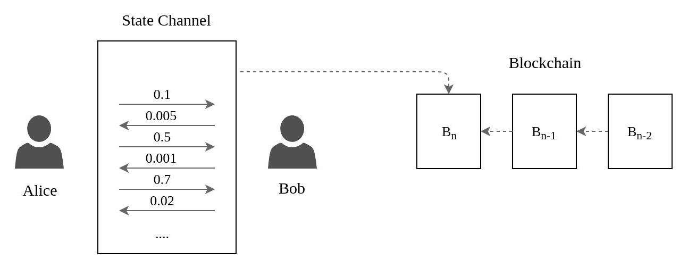

图 9.1：两个用户之间的状态通道交易

# 闪电网络

闪电网络是一个第二层支付协议，运行在比特币区块链之上。在撰写本文时，该协议的实现正在比特币的主网上以测试模式运行。这是一个双向路由网络，旨在解决比特币交易可扩展性问题。

**设计**

闪电网络创建了一个路由的支付通道网络，其中节点之间的通信是双向的。该设计已经由几个开源社区实施，遵循一套标准。

闪电网络的简单设计包括以下步骤：

1.  通过使用双方的初始资金来承诺通道创建一个支付通道

1.  执行微支付交易并更新通道创建的资金

1.  关闭支付通道并广播通道资金的最终状态

**闪电网络的一个例子**

让我们考虑一个例子，Alice 想要与 Bob 执行几个比特币支付交易。Alice 和 Bob 决定使用闪电网络开放一个支付通道。

Alice 和 Bob 都创建了一个通道，最初各自投入了 2 比特币的资金。资金可以存放在一个多重签名地址账户中，这将确保双方需要同意最终资金分配。将维护一个资产负债表，该表将在每笔交易后更新 Alice 和 Bob 的余额。该资产负债表类似于在餐厅或酒吧中记账的概念；而不是为每个订单付款，而是维护一个可以用来一起支付所有订单的标签。

Alice 想要向 Bob 发送 0.5 比特币，所以她将创建一个支付 0.5 比特币给 Bob 的交易。而不是将此交易附加到区块链上，支付通道将更新资金余额表。现在通道基金将反映 1.5 比特币作为 Alice 的余额和 2.5 比特币作为 Bob 的余额：

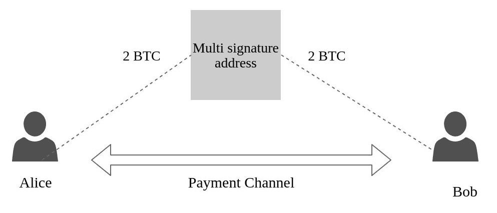

图 9.2：Alice 和 Bob 之间的闪电网络支付通道

Alice 和 Bob 可以执行任意数量的交易，而无需等待交易状态，因为支付通道独立于区块链状态。当在创建的通道上没有更多的交易需要执行时，可以关闭支付通道。然后，该通道的最终状态将被广播到区块链网络中，以便在单个交易中包含在区块链中。安全执行链下交易的闪电网络实现增加了区块链网络的总交易吞吐量。

# 路由支付网络

在闪电网络中，用户不需要与每个用户建立直接支付通道来执行交易。用户可以找到几个连接的支付通道，以连接到其他用户，从而建立路由支付网络。考虑这样一个例子，Alice 想要与 Carol 建立微支付通道。Alice 之前已经与 Bob 建立了一个通道。她还发现 Bob 与 Carol 有一个活跃的通道。因此，Alice 决定通过 Bob 创建一个路由支付通道与 Carol 进行支付，如*图 9.3*所示：

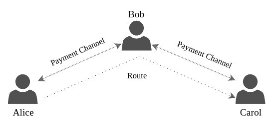

图 9.3：Alice 通过 Bob 与 Carol 之间的路由支付网络

路由支付通道是在许多不信任的节点之间建立的，并且节点将不会知道路由中的下一个跳跃的信息。网络中的任何支付通道都可能因故障行为而随时无效。为了容忍网络中的故障，必须为网络中的每个通道设置一个托管。时间为基础的脚本扩展（智能合约），例如**哈希时间锁合约**（**HTLC**）可用于在支付通道中设置托管。

**哈希时间锁合约**

HTLC 是一种特殊类型的智能合约，可以使用比特币的基本编程语言（脚本）创建。网络中的参与者在设置托管后，会在交易中锁定他们的资金并共享一个密钥。

HTLC 类似于交易创建期间创建的锁定脚本，其中使用用于解锁资金的使用非对称加密生成的秘密密钥。 HTLC 使用的是每次交易中销毁的随机生成的秘密，而不是使用永久性秘密密钥。资金的接收方最初将创建一个随机秘密，*R*，该秘密将使用诸如 SHA256 之类的单向函数进行散列。计算出的秘密哈希，*H*，然后可以与参与交易的所有参与者共享，以创建 HTLC 脚本。

尽管通过提供秘密 R 可以赎回 HTLC 脚本中承诺的资金，但它也有一个时间锁定，需要秘密所有者在指定时间内索取资金。时间因素也可以用区块数指定。比特币使用`CheckLockTimeVerify`扩展来对合同进行时间锁定。

最终的 HTLC 脚本是通过组合哈希和时间锁定条件准备的。网络中拥有秘密的任何节点都可以索赔 HTLC 中承诺的资金。

**路由支付示例**

让我们考虑通过构建前面示例的情景，Alice 想将 1 比特币发送给 Carol 而不是 Bob。由于 Alice 和 Carol 之间没有活动通道，Alice 和 Bob 通过 Bob 创建了一个支付通道，如前所述。现在，Carol 为会话创建一个随机秘密*S*。她为秘密*S*创建了一个哈希并与 Alice 分享，但秘密受到保护，没有向任何人透露。

Alice 和 Bob 之间的支付通道以 4 比特币资助。同样，Bob 和 Carol 之间的通道也以 4 比特币资助。 Bob 在每个支付通道上都有 2 比特币的份额。 Alice 通过创建价值为 1.1 比特币的 HTLC 承诺来开始交易，可支付给 Bob。额外的 0.1 比特币是支付给 Bob 的经纪人作为交易费用。由于他不拥有秘密，Bob 将无法索赔承诺。现在，Bob 被指示在另一个通道上创建一个新交易。他创建了一个价值为 1 比特币的 HTLC 承诺，可支付给 Carol。由于 Carol 拥有秘密密钥，她索取了比特币并将密钥传递给了 Bob。现在，Bob 将能够索赔 HTLC 中的比特币。

所有参与者都可以在不信任支付网络中的其他节点的情况下声称其资产。当任何一个通道关闭时，支付通道的最终余额可以写入区块链：

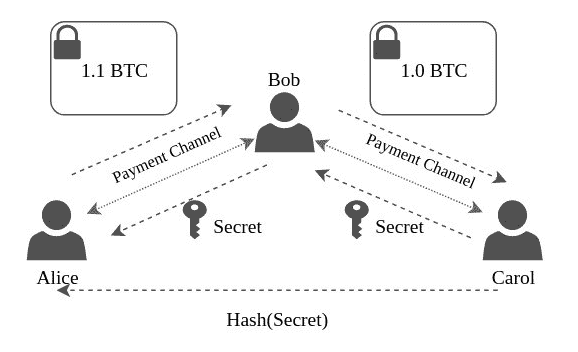

图 9.4：通过 Bob 在 Alice 和 Carol 之间的路由支付网络

每个节点在需要创建交易时都将执行路由发现。路由发现的信息通过 P2P 网络模型从网络中的所有节点收集。一旦节点收集到所有信息，发送节点将构建最佳路径。在发送方发现路由之后，涉及到的每个节点都不会意识到所有节点。每个节点只会被告知与其建立支付通道的节点。这是通过实施基于洋葱路由协议的系统来保护交易的隐私实现的。

# 侧链

侧链是与主区块链并行运行并通过双向钉住与主区块链（也称为主链）连接的区块链。与状态通道类似，侧链是用于扩展现有区块链网络的第 2 层解决方案。

在提交状态到主链之前，可以在侧链上执行一组资产上的任意数量的交易。与状态通道不同，侧链是与主链并行运行的永久链。每当需要将资产发送到侧链时，同一资产就需要在主链上锁定，方法是将其转移到一个特殊地址。一旦在主链上锁定了资产，就可以将相同的资产释放到侧链。只要资产在主链上被锁定，侧链就可以对该资产执行交易。一个称为**联邦**的特殊群体充当主链和侧链之间的中介。

目前已经有几种现有的侧链实现。Rootstock 已经创建了一个与比特币区块链双向锚定的侧链。Loom ([`loomx.io/`](https://loomx.io/)) 已经为以太坊网络创建了一个基于权益证明的侧链。Matic 网络 ([`matic.network/`](https://matic.network/)) 是另一个服务，使用 Plasma 框架的改进版本创建了一个基于权益证明的侧链。

# 区块大小改进

区块链的基本组件是一组交易，它是任何去中心化的基于区块链的应用程序的基本组成部分。每个基于区块链的实现都将定义其自己的区块结构。比特币区块由头部和主体部分组成，并具有一组定义的字段。其中一些字段有固定限制，区块大小也是如此。比特币的区块大小为 1 MB，这是在 2010 年引入的。这限制了可以包含在一个区块中的交易数量。

随着比特币网络中活动量的增加，由于其受欢迎程度，每个区块中创建的交易也越来越多。*图 9.5*展示了每个区块平均交易数量随年份增长的情况。从去年开始，大多数比特币区块达到了每个区块中交易数量的阈值。我们可以从图表中得出结论，近年来每个区块的平均交易数量约为 2,500。由于比特币的区块间隔固定为 10 分钟，比特币可以实现的平均交易吞吐量约为每秒 4-5 笔，远低于 PayPal 或 Visa 的交易吞吐量，它们的交易吞吐量分别约为每秒 200 和 1,600 笔：

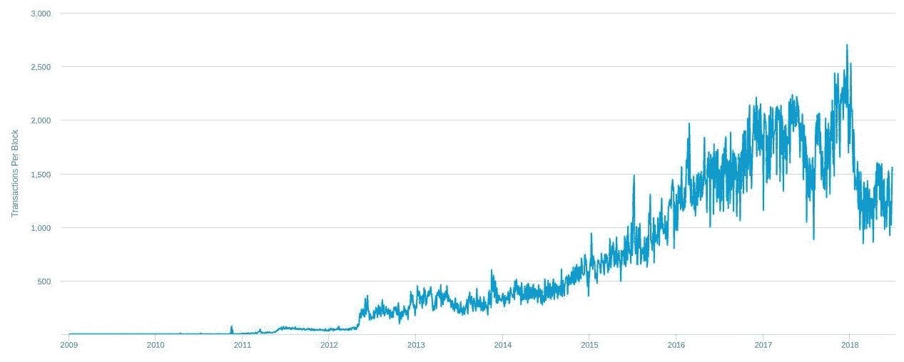

图 9.5：每个比特币区块的平均交易量（来源：www.blockchain.info）

增加交易吞吐量的直接解决方案是充分利用区块大小。但是，根据*图 9.6*中的图表显示，比特币区块最近已经利用其整个 1 MB 的空间进行交易。由于最近挖出的区块数量增加，有关增加区块大小的讨论和提案也有所增加。尽管社区表现出了很大的兴趣，但未能获得实施更新区块协议所需的大多数支持：

近年来有些区块超出了 1 MB 的限制，这是由于所谓的**隔离见证**协议升级引起的，我们将在接下来的*拟议解决方案*部分进行讨论。

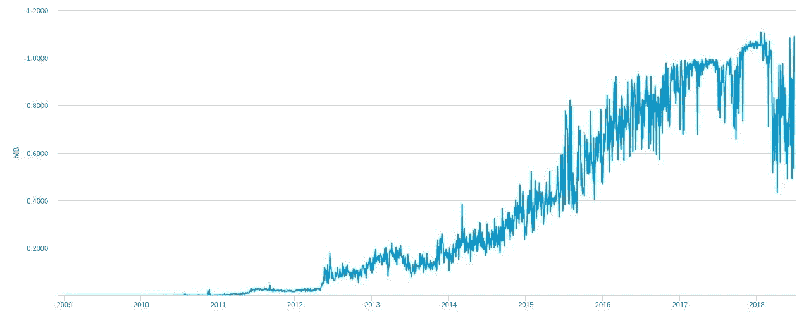

图 9.6: 比特币平均区块大小的表现（来源：www.blockchain.info）

# 增加区块大小的动机

增加区块大小是实现更高交易吞吐量的明显途径。但还有一些其他因素可能推动增加区块大小：

+   增加的交易活跃度可能导致瓶颈，从而堵塞区块链网络。一些交易可能会延迟或永久丢失。

+   微支付的等待时间增加会阻碍技术创新。

+   目前，用户被迫支付更高的交易费以优先处理交易。

# 增加区块大小的担忧

尽管增加区块大小是增加交易吞吐量的一种直观方法，但这种方法存在一些问题。以下是其中一些问题:

+   由于增加的大小，交换区块数据将变得更加困难

+   增加区块大小是一个即时的解决方案，但不是一个永久性的解决方案。

+   改变区块大小将导致硬分叉，并可能导致共识失败。

+   更大的区块将需要更高的带宽来交换数据，这可能不会激励普通完整节点用户，并且由于维护成本增加，可能不再能够维护整个区块链。

# 拟议解决方案

从 2010 年初开始，已经有人尝试通过不同的提案来增加区块大小。甚至有一些名为**比特币改进建议**（**BIP**）的提案来跟踪这个问题。其中一些是 BIP 100 - 103 和 BIP 109，它们都处于草案或被拒绝的状态。

最初的一个提案之一，由比特币核心的最初开发人员之一 Gavin Andreson 提出的 BIP 101 建议将区块大小增加到 8 MB，并且每两年将限制加倍，大小在两年内呈线性增长。尽管该提案得到了大多数矿工的支持，但由于需要硬分叉，由于没有获得经济上的多数，该提案未能获得一致意见。一个名为**比特币 XT**的替代比特币客户端在 2015 年实施了 BIP 101，但未能获得实施 BIP 101 的共识。后来，BIP 实施被从比特币 XT 中移除。

尽管有许多提出的解决方案，比特币未能获得新区块大小批准的多数票。但是提出了一种解决方案，以增加区块容量并保护免受交易可塑性的影响，这就是所谓的隔离见证协议升级。隔离见证定义了一个称为见证的新结构，其中存储了交易的所有签名信息，将其与区块中的交易信息分开。可以从见证结构中的信息验证交易的有效性。

隔离见证定义了一个新的权重单位，并允许创建多达 400 万个单位。在新的见证结构中，1 个字节被视为 1 个单位，但在旧的区块区域中，1 个字节的数据被视为 4 个单位。这使得旧的区块的限制为 1 MB，而使用升级后的协议创建的区块则不受 1 MB 限制的约束。这个提案最大的优势之一是它不需要对区块链进行硬分叉以达成共识。

区块大小改进只是区块链可扩展性问题的短期解决方案。比特币社区不断提出更好的解决方案，以便从长远来看解决网络可扩展性问题。

# 区块链增强

有许多改进措施已经建立在现有的区块链协议之上，以更高效地运行或使区块链应用程序适合实现所需的功能。我们将讨论一些需要进行重大协议修改的改进措施。

# 分片

比特币和其他现有的区块链平台面临的一个关键问题是扩展区块链网络中的应用程序。存储是减慢去中心化应用可扩展性的主要因素。区块链中的每个完整节点都存储整个区块链历史记录以验证交易。数据可以被巧妙地分布在网络上，而不是在每个节点上存储冗余数据，这将有助于实现可扩展性以及去中心化。以太坊提出了一种分片机制来实现分布式行为，以实现可扩展性。在本节中，我们将讨论以太坊提出的一些分片关键概念。

有关以太坊分片路线图的更多详细信息，请访问[`github.com/ethereum/wiki/wiki/Sharding-roadmap`](https://github.com/ethereum/wiki/wiki/Sharding-roadmap)。

# 数据库分片的动机

分片涉及将数据分区以将其分布到多个设备中。分片并不是实现计算资源分布的新概念。它已被用于数据库中实现可扩展性。数据库分片通过水平分区表来创建。通常，每个分区或分片都存储在物理上分离的服务器上以平衡负载。

将数据库表水平划分为分片将减少行数，从而减少索引大小，从而优化搜索。如果数据库分区是基于真实世界的数据分段执行的，比如将与不同国家相关的数据存储在不同的分片上，那么只查询相关分片将变得容易。

*图 9.7* 显示了一个最初将用户详细信息存储在全局数据库中的数据库表如何被分区：

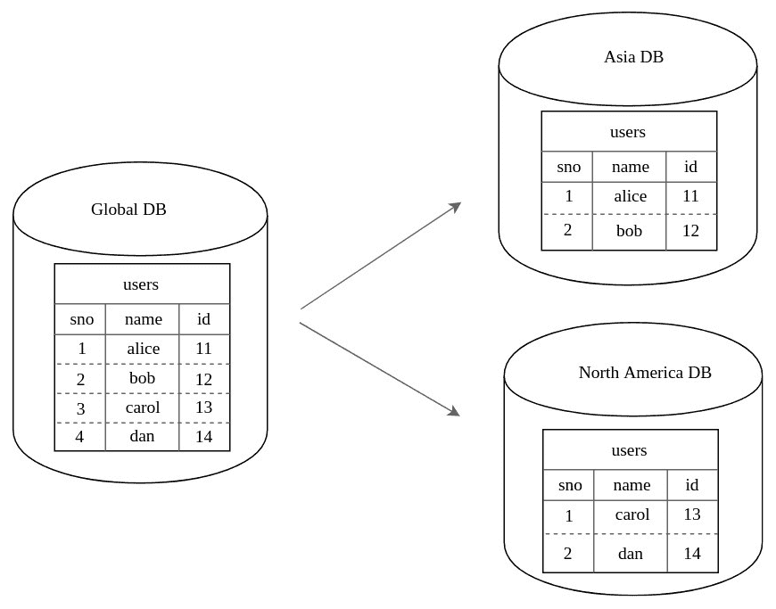

图 9.7：基于物理位置的数据库分片

数据库表被水平划分成两个不同的表，每个表维护原始表中的一部分行。这些表的分区基于第一个表包含来自亚洲的用户的详细信息，而第二个表包含来自北美的用户的详细信息。以这种方式对数据库表进行分区将提高查询性能。数据库表也可以通过使用一种特殊的哈希方式（称为**一致性哈希**）将其分区并分布到多个服务器上。

当一个有 *N* 个槽位的哈希表被调整大小时，大多数的键（K）需要重新映射到这些槽位上。一致性哈希是一种特殊的哈希方式，其中槽位数的变化只需要重新映射 *K/N* 个键。

# 区块链中的分片

为了实现尽可能高的去中心化级别，分散的区块链网络由许多节点组成。网络的安全性随着添加到网络中的节点数量而增加。但节点的数量并不会增加网络的可伸缩性。事实上，随着节点数量的增加，扩展变得困难。以太坊提出了一种分片技术，其中整个区块链及其状态被分割成称为分片的分区。

以太坊中的分片方案可以分为任意数量的分片，每个分片都维护自己的历史和状态。让我们考虑一种方案，根据某些标准将区块链分为 *K* 个分片的情况。分片的一个示例标准可以是资产，其中属于不同资产的交易被维护在不同的分片上。由于每个分片维护自己的状态，因此在分片中创建的交易的影响仅限于该分片的状态。

# 分片中的组件

每个分片在一个整理中维护数据，这类似于主区块链中的块。每个整理包含一组以 blob 形式的数据。每个整理者都包含一个头部和主体，类似于主链中的块。*图 9.8*描述了 blob 如何被转换为块，然后通过构建由块作为叶子的 Merkle 树为这些块创建 Merkle 证明。创建了一系列整理，这是分片的区块链。主链仍然存在，由每个人处理，但他们只存储分片的整理头。分片的最长链称为规范链，其头部将驻留在主链上：

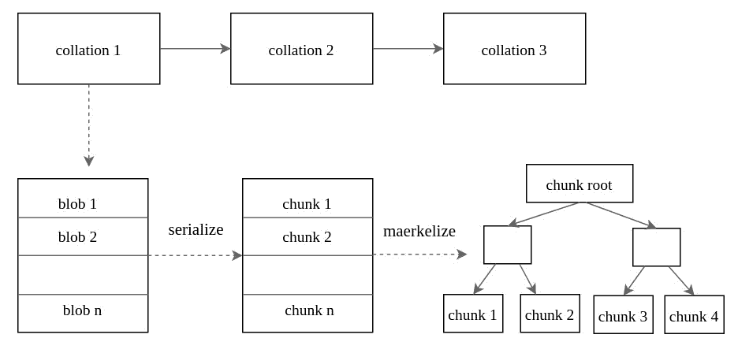

图 9.8：分片中的整理和 blob

分片中有称为**提议者**的节点。这些节点可以选择分片或随机选择它们。提议者负责接受 blob 并创建整理。因此他们也充当整理者。**公证人**是下载和验证整理的实体。它们被分配到分片，并通过随机信标链（使用一些可验证的随机函数）在每个时期随机洗牌到新的分片。他们还将就整理数据的可用性进行投票。

一个**委员会**将检查投票，并决定是否将整理头包含在主链中。整理头将建立与驻留在分片中的整理数据的链接。

# 分片区块链的设计

对区块链进行分区并将其分布到不同的分片需要各种参与者，正如前一节所述。网络中的所有这些参与者将确保每个分片的整理数据与主链相连。分片架构由于分布式分片和去中心化网络中的多种类型的参与者而存在几个安全问题。

如果区块链的设计能够保持诚实多数，其中超过 50%的验证者遵循协议的诚实行为，则该设计被认为是安全的。如果存在无协调的多数，则该值可以较低。

无协调的多数是一种实现多数的行为，但其中不超过 50%（通常在 20%到 50%之间）的验证者能够协调行动。

分片区块链的设计将网络中一个分片的交易与其他分片隔离开来。如果一个节点需要与其他分片上的节点执行交易，那么这并不像经典区块链设计那样简单。以太坊分片使用了一个称为 receipt 的概念来执行跨分片通信。

# 跨分片通信

可能会出现一种情况，即一笔交易需要在两个或多个分片之间共享。以太坊使用由一个分片中的节点创建的收据来确认交易。让我们考虑这样一个场景，即位于分片*M*中的用户*A*想要将 100 枚硬币发送给分片*N*中的用户*B*。跨分片通信可以通过以下步骤建立：

1.  在分片*M*上创建一笔用于扣除硬币的交易。

1.  为用户*A*到*B*之间的 100 枚硬币的交易创建一个收据。这笔交易不会保存在状态上，但是收据的存在可以由分片*N*中的用户验证。

1.  在分片*N*上创建并发送一笔包含收据默克尔证明的交易。该交易还确认了收据未被使用。用户*B*在分片*N*上的余额增加了 100 枚硬币。

一些复杂的情况可能会导致跨多个分片进行通信，以从其他分片的状态中查询数据。

# 共识算法的演进

我们已经在本书的几个章节中接触了比特币的**工作证明**（**PoW**）共识算法。 PoW 算法是去中心化网络协议的支柱。尽管比特币的共识算法已被证明在无信任网络中实现共识是有效的，但由于挖矿过程中花费的计算资源而导致的成本效率仍然不高。

已经开发并实施了许多替代共识算法，以在不产生过多开销的情况下达到相同程度的去中心化信任。

# 股权证明（PoS）

PoS 算法通过不依赖计算资源来实现共识，消除了 PoW 的大部分问题。PoS 使用验证者，与 PoW 中的矿工相反，它们不执行任何工作来促进去中心化。 PoS 验证者的贡献取决于他们在系统中流通的加密货币硬币的份额。持有三枚硬币的验证者比持有一枚硬币的验证者更有可能对验证做出贡献。还有其他因素会随机化该过程，以避免持有主要利益的一个验证者垄断验证过程。Peercoin 是第一个采用 PoS 的，随后是 Nxt 和 BlackCoin。以太坊目前正在使用 PoW，但 PoS 正在积极开发中，并计划在不久的将来在主网上实施 PoS。

除了其广泛的益处外，在实施过程中也存在一些问题。有关 PoS 与 PoW 的白皮书（[`bitfury.com/content/downloads/pos-vs-pow-

由 BitFury 团队发布的[1.0.2.pdf`](https://bitfury.com/content/downloads/pos-vs-pow-1.0.2.pdf)列出了一些可能的攻击，例如长期攻击，贿赂攻击，硬币年龄累积攻击和预计算攻击。 在公共分散网络中确保完全安全并不容易。 即使弹性的 PoW 从理论上也容易受到 51％攻击的威胁，这可能导致双重花费（我们将在第十章中介绍 PoW 的安全问题，*区块链安全*）。 PoS 算法通过对节点进行惩罚防止攻击。 以太坊要求每个节点拥有至少 1250 个以太来参与验证。 验证者的最低押金防止它们在网络中不诚实。

# 活动证明（PoA）

大多数使用 PoW 的加密货币和区块链平台的代币供应有限。 例如，比特币只会铸造 2100 万个硬币，最后一个硬币将在 2140 年左右铸造。 当所有硬币被铸造后，矿工将不得不完全依赖交易费用作为他们的激励。 根据比特币当前的难度水平，它可能达到一个水平，使得矿工参与挖矿过程可能不经济。 现有的矿工可能会尝试执行不诚实的行为，并通过无效的交易破坏区块链系统以获取自己的利益。 PoA 被提议作为比特币可以采用的替代共识算法。 它是一种混合方法，结合了 PoW 和 PoS。

在区块创建期间，挖矿节点利用计算资源通过解决哈希难题执行 PoW。 PoW 过程不会添加任何交易； 相反，它们只创建带有矿工详细信息的块头。 PoS 用于根据块头信息随机选择验证者来进一步处理块。 这个共识阶段的处理方式与基于 PoS 的系统类似。 如果选择的验证者无法对块进行签名，则选择下一个最佳块，并应用相同的 PoS 验证过程。 每个块被包含在区块链中后，PoW 和 PoS 矿工都会收到他们的激励。

Decred 是一种加密货币，于 2016 年 2 月推出，并利用 PoA 来实现网络中的共识。

# 拜占庭容错（BFT）共识模型

共识算法设计在分布式系统中以容忍与拜占庭将军问题相关的拜占庭故障（有关拜占庭将军问题的定义，请参阅第一章，*介绍*）。 尽管 PoW 和 PoS 对拜占庭故障有容忍度，但是要付出代价。 几种变体的**拜占庭容错**（**BFT**）共识模型已被提出作为在不受信任的分布式网络中解决此问题的解决方案。

# Practical Byzantine Fault Tolerance (PBFT)

PBFT 共识算法由 Miguel Castro 和 Barbara Liskov 提出，作为分布式系统中拜占庭将军问题的实际解决方案。如果状态发生变化，它通过投票机制在节点之间达成共识。该算法在*3f+1*个节点中至少需要*f*个失败节点。PBFT 对系统总体的开销约为 3%，这是对基于 PoW 共识的系统的巨大改进。就节点规模而言，PBFT 仍然是一个挑战，因为随着节点数量的增加，开销会增加。

Hyperledger Fabric 项目使用 PBFT 协议在许可区块链中实现高交易吞吐量。

# 联邦拜占庭容错（FBFT）

FBFT 是 BFT 算法的一种变体，已在基于支付协议的区块链平台（如 Ripple 和 Stellar）中实现。这些平台都执行关键交易，如跨境支付，涉及法定货币。由于它们的关键性，共识模型应具有容错性，以避免任何攻击。

**Ripple 共识协议**

Ripple 共识协议的概述在上一章中进行了介绍，以及其平台的架构。每个节点通过对交易进行投票来实现 FBFT 共识模型。网络中的每个节点都维护一个称为**Unique Node List**（**UNL**）的列表，其中包含受信任的 Ripple 节点。每个节点向其 UNL 中的节点广播一组称为候选集的交易。每个节点将验证交易并为每个交易广播其投票。根据收到的每个交易的投票，每个节点调整候选集。当特定候选集收到来自 UNL 中所有节点 80%的投票时，所有候选集中的交易都通过将其添加到区块链分类帐中进行确认。Ripple 分类帐进入封闭状态，并且所有未确认的交易将在下一轮投票中继续进行。

Ripple 通过轮次进行投票机制，以从所有节点中获得最小共识，然后才能提交交易。FBFT 甚至比无权限网络实现更高的交易速率。因此，它可以应用于需要更高可伸缩性的关键金融系统中。

# 时间证明（PoET）

PoET 是一种旨在解决现有共识协议面临的性能问题的共识算法。它使用受信任的执行环境解决拜占庭将军问题。由于其受信任的执行模型，它仅适用于许可区块链网络。PoET 共识已在由 Intel 支持的许可区块链项目 Hyperledger Sawtooth 中实现。网络中的受信任执行环境是通过 Intel 的**软件保护扩展**（**SGX**）实现的，这是一组指令集，允许用户代码分配私有内存区域。

类似于 PoS 算法，PoET 选举一个随机的节点来构建下一个块，但不涉及质押。相反，节点需要在参与块创建过程之前等待随机的时间量。由于每个节点都会有一个随机的等待时间，第一个完成等待时间的节点将创建块。每个节点都必须向网络证明几件事情，以使自己有资格成为被选举的节点：

+   证明节点已经选择了随机等待时间

+   证明节点已经等待了选择的随机等待时间

每个节点通过在受保护环境中运行受信任的代码来满足这些要求，借助英特尔的 SGX 指令集。参与选举的节点从受信任的函数中获取等待时间。等待时间最短的节点将成为下一个要创建的块的领导者。一个函数，比如说，`CreateTimer`，会设置计时器，另一个函数，比如说，`CheckTimer`，会在计时器到期时创建一个证明。这个证明证明了节点在创建块之前等待了指定的等待时间。网络上的每个节点都将使用这个证明来验证块。

网络中的每个节点都将下载受信任的代码，并执行初始握手以建立受信任的网络。作为握手的一部分，节点将为受信任的代码创建一对密钥，并将其公钥发布到整个网络。

PoET 承诺通过其基于时间的选举机制实现共识的更高性能，并且对于私有企业区块链网络而言是理想的。但是，由于需要专门的硬件来创建受保护的执行环境，权限模型对于公共网络来说并不实用。

# 跨链协议

分布式区块链账本是一个不断发展的领域，许多应用程序经常被实现。就像任何计算机技术一样，需要定期更新一样，现有的区块链系统需要更新以跟上不断发展的技术。与其他集中式系统不同，对现有区块链的广泛更改将导致硬分叉，因为节点的去中心化。现有的区块链系统受到受限的创新或与发展的协议集成的限制。

跨链协议的开发是为了将现有的区块链应用与新发展的系统集成，并使多个区块链网络能够相互通信。跨链通信协议还有助于通过集成多个账本来扩展区块链网络。

几个项目一直致力于实施跨链协议。*Cosmos*、*Polkadot* 和 *Interledger* 是一些以自己的方式实施跨链协议的项目。Cosmos 和 Polkadot 拥有自己的区块链生态系统，具有几个组件可以与其他独立的区块链系统进行通信。Interledger 是一个用于在支付系统之间进行支付的协议。在接下来的部分中，我们将分析使用 Interledger 在支付系统中实现跨链协议。

# Interledger 协议（ILP）

全球范围内的所有支付系统都建立在单一的支付网络中运行，并且所有资产和交易细节都由单一的分类帐维护。即使是比特币等数字货币也将所有交易记录在单一的公共分类帐中，尽管分类帐的副本分布在整个网络中。在单一分类帐中可以轻松维护交易，但要垂直扩展这样的分类帐将会很困难。我们在本章的*分片*部分分析了单一分类帐的可扩展性。除此之外，各种不同的支付系统永远不会就单一的分布式分类帐或其相应的共识机制达成一致。能够连接多个支付系统并在网络中执行低成本交易的协议将是现有分类帐垂直扩展的一个很好的解决方案。

Interledger 协议提供了一种安全地在不同分类帐之间转移价值的系统，它也经常与其他支付系统一起使用。Interledger 在参与者的分类帐之间指定连接器来执行交易。与任何现有的支付网关服务不同，由于分类帐提供的托管，参与者无需信任这些连接器。该协议不仅可以在基于区块链的分类帐之间实现价值转移，还可以与传统支付系统（如 PayPal）建立连接：

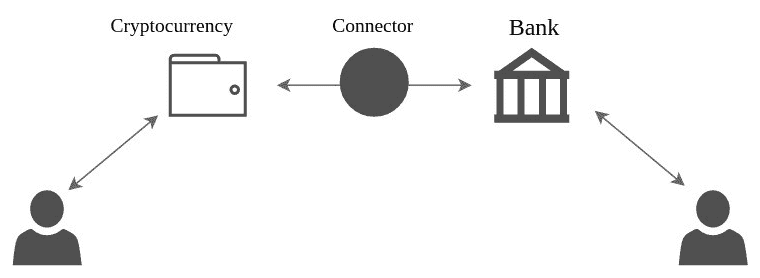

图 9.9：Interledger 协议（ILP）用例

# Interledger 组件

+   **发送者** 将资产发送给已知的接收者。他们将通过选择连接器来启动付款。

+   **接收者** 将期望从特定发送者处收到资产。他们需要成为 Interledger 付款网络的一部分。

+   **连接器** 将发送者与接收者连接起来，使 ILP 付款成为可能。连接器还会与其他连接器建立连接。这是为了通过为每笔付款建立的连接器链将尽可能多的发送者连接到接收者。

+   **分类帐** 对网络中每个参与者的资产信息进行簿记：

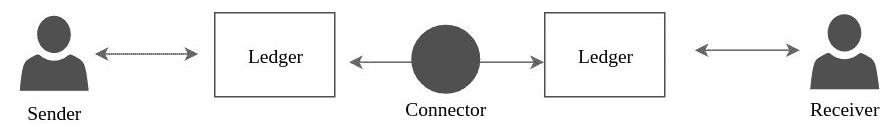

图 9.10：Interledger 组件

# Interledger 设计

当前的支付系统提供了一种在不同账本之间转移价值的方式，即支付网关。它们充当支付银行之间的中介。现有系统的主要关注点是安全性和速度。这些网关由第三方管理，用户需要依赖这些实体来确保安全。在这样的支付网络中，交易结算较慢，因为网关必须处理多个支付银行。Interledger 引入了账本之间的连接器，建立了发送者和接收者之间的联系。该系统中的账本创建了一个托管机制，这是在账本之间进行交易时将资金锁定的密码条件。账本创建的密码条件作为托管机制保证只有在接收者确认后才将资金转移到连接器：

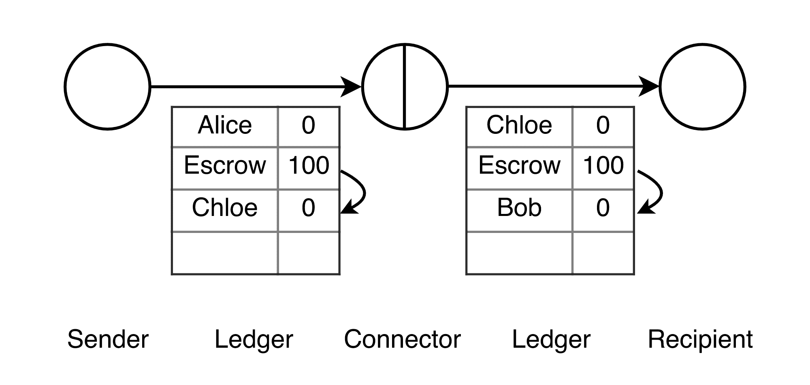

图 9.11：将资金转移给连接器（来源：https://interledger.org）

分布式网络受到错误或恶意行为者的威胁。条件托管的资金是一个重要的安全功能，可以确保资金只有在收到确认后才会转移。

账本托管使用密码签名。任何人都可以验证签名以检查条件是否已满足。

支付过程可以使用 Interledger 中的两种模型来执行。这些是原子支付和通用支付。

**原子支付**

Interledger 支付保证了转移要么执行要么中止。它使用一种承诺协议，在决定是否执行或中止交易之前，会先确定系统的准备情况。分布式系统中的承诺协议使用一组被称为记账人的交易管理器。这些记账人用于在不受信任的拜占庭节点之间达成共识。

当交易发生之前，支付网络中可能涉及多个连接器在发送者和接收者之间。连接器的数量取决于参与者之间的选择路线，这取决于跳数或涉及的费用。*图 9.12*显示，在节点**p[1]**和**p[n]**之间进行交易时，有`n-1`个账本之间有`n-2`个连接器：

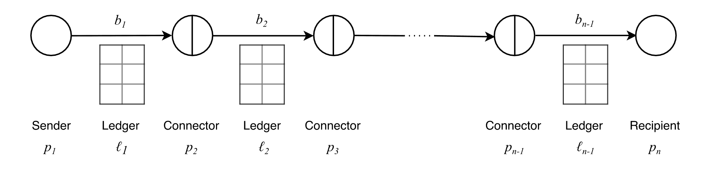

图 9.12：具有多个连接器的支付路线（来源：https://interledger.org）

支付网络中的所有连接器都是可能在交易过程中表现出错误行为的拜占庭节点。选定的记账人* N *需要在拜占庭节点之间达成共识。不可信的记账人需要具有容错能力，以创建原子交易。网络应确保在*3f+1*个节点中，不超过*f*个故障的记账人节点。

在发送方可以开始转账之前，必须选择连接器路径，考虑到它们的费用和汇率。一旦选择了最佳路径，在交易过程中可以观察到以下阶段：

1.  参与者选举了一组公证人。选举应确保故障公证人的数量应少于 *3f+1* 个公证人中的 *f* 个。

1.  付款发送方向每个连接器提出转账请求。所有连接器都将验证汇率是否与其汇率匹配。一旦所有连接器确认批准提案，发送方将开始准备转账。

1.  发送方准备从总账向连接器进行转账，并请求连接器准备好从路径中相邻连接器到下一个总账的转账。每个连接器在确认资金已经托管后将准备好进行转账。

1.  资金的最终接收方在每个总账的资金被托管后将签署收据。如果公证人及时收到收据，则公证人将向交易中的所有参与者转发执行消息。

**通用支付**

与原子支付模型不同，此模型中没有充当交易管理器的公证人。它使用网络内部的参与者来达成共识。尽管它消除了与外部协调器的交互，但它可以确保在已知环境中只对非故障参与者进行安全保障。由于网络的不信任参与者显示出故障行为，通用支付的实际考虑并不简单。

除了提供多个总账之间的连接外，Interledger 不依赖于任何其他系统，因此可以根据需要自由扩展系统。它还保护交易详情的隐私。因此，Interledger 提供的跨总账支付协议极大地简化了金融系统之间的通信。Interledger 项目的更多实现细节可以在 [`github.com/interledger`](https://github.com/interledger) 找到。

# 隐私增强

众所周知，比特币在区块中存储了交易中账户拥有的资金历史。每个交易包含诸如发送方地址、接收方地址和价值等敏感信息。所有数据都被网络中的每个节点用于在区块可以包含在区块链之前验证交易。比特币的去中心化验证强制交易透明，因为没有中央机构。

比特币的区块链提供了安全性，防止交易被篡改，尽管它们对所有人都是可见的。尽管区块链保护了交易免受许多攻击，但它并不像其他支付服务那样向账户持有者提供完整的隐私保护。比特币网络上的任何人都可以追踪交易的历史，而无需进行任何身份验证。披露交易历史可能会暴露特定账户的敏感信息，如最近的交易或账户余额。比特币网络上的有限隐私一直是用户的主要关注点之一。由于大多数区块链项目都是从比特币发展而来的，它们遵循了类似的透明度模型。大多数区块链应用程序的伪匿名特性为其用户提供了一定程度的隐私。

伪匿名（伪匿名）是一个个人或团体的身份，它不披露其真实身份。比特币用户通过其公共地址进行标识，而不会透露其真实身份。

一种名为 Zerocoin 的匿名加密货币是由约翰斯·霍普金斯大学的研究人员提出的。Zerocoin 使用零知识证明来为比特币提供一个扩展，通过创建匿名交易来增强其隐私。后来提出了一种改进的协议，称为 Zerocash，它是一种使用一种特殊类型的零知识证明称为 **zk-SNARKs** 的独立加密货币。Zerocash 后来发展成了一种名为 **Zcash** 的完整数字加密货币。

自 Zcash 发明以来，已经开发了几种应用程序，通过实现类似的协议来提供隐私保护。Monero、Dash、Verge，甚至是比特币的一个分叉称为 Bitcoin Private 都是一些后来推出的基于隐私的加密货币。在本节中，我们将更详细地探讨 Zcash，以及用于确保其交易隐私的基础协议。

# 零知识证明

零知识证明是实现 Zcash 中的匿名性的重要密码原语。这是一种方法，其中一方，比如说，Alice，拥有一些秘密信息，可以向另一方，Bob，证明她拥有这些信息，而不实际披露它。每个零知识证明都会涉及两个当事人，一个证明者和一个验证者。证明者始终拥有被保密的知识，而验证者将验证证明者的陈述。证明者应该在创建证明时始终利用秘密知识，这意味着验证者不应该能够在没有秘密知识的情况下向其他方复制证明。每当证明者创建零知识证明时，它应该满足以下属性：

+   **完整性**：如果一个陈述是真实的，那么一个诚实的验证者应该被一个诚实的证明者的陈述所说服。

+   **声明的正确性**：如果陈述是错误的，没有不诚实的证明者可以说服验证者它是真的。可能有一些可以忽略的特例。

+   **零知识**：如果陈述为真，验证者除了陈述本身之外不会学到任何东西。

零知识证明是概率证明。存在着声明错误的小概率，其中不诚实的证明者可以说服验证者一个错误的陈述。

# 一般的例子

让我们来看一些零知识证明系统的示例。

**一名扑克魔术师**

让我们来看一个扑克魔术师的例子，他声称自己知道一种魔术，可以预测观众所猜的任意一张牌。在这个例子中，魔术师是证明者，观众是验证者，魔术是秘密知识。证明他们知道这个魔术的唯一方法是进行表演。魔术师要求观众想一张牌。观众想好一张牌后，魔术师挥动魔棒，拿出一张牌。观众确认这正是选中的牌，他们现在相信魔术师知道这个魔术。如果观众仍需确认，他们可以要求魔术师再次表演魔术。

这个例子模拟了零知识证明系统。魔术师是证明者，观众是验证者。魔术师证明他们知道这个魔术，而不实际透露魔术，这符合零知识要求。如果魔术师知道这个魔术，他们将永远能够表演，从而证明了完备性。如果魔术师虚假声称知道这个魔术，表演魔术将揭露他们的虚假声明。尽管有很小的可能性，魔术师会在不知道魔术的情况下预测对卡，概率是 1/52（因为一副牌中有 52 张卡）。这个概率很小，如果多次进行魔术表演，这个概率将变得微乎其微。

# zk-SNARKs

**zk-SNARK** 代表 **Zero-Knowledge Succinct Non-Interactive Argument of Knowledge**。正如其名，这是零知识证明的一个变种，其中你可以证明拥有秘密信息，而无需证明者和验证者之间的互动。

许多零知识证明需要证明者和验证者通过建立一个通道进行持续通信以证明知识。即使之前考虑的例子也需要证明者和验证者的持续参与。zk-SNARK 有一个初始设置阶段，在这个阶段中，证明者和验证者之间共享一个称为公共参数的公共字符串。

Zcash 使用了一个分叉的实现（[`github.com/zcash/libsnark`](https://github.com/zcash/libsnark)）的`libsnarks`（用 C++实现）库来执行 zk-SNARK 操作。

zk-SNARK 允许我们在不必了解执行了什么的情况下验证已执行程序的正确性。虽然这个概念听起来很简单，但 zk-SNARK 的内部工作在第一眼看起来可能会很棘手。我们将根据以太坊博客的建议，将 zk-SNARK 的实现分解为四个主要因素：

+   **二次算术程序的构建**（**QAPs**）: zk-SNARK 在交易上执行的验证应该返回 true 或 false，而不泄露任何信息。这是通过将交易的逻辑转换为可以在不泄露敏感信息的情况下进行评估的二次多项式方程来实现的。

+   **在随机点进行评估以实现简洁性**: 方程中使用的多项式可能相当大。因此，验证者会在随机选择的点上对多项式进行评估。验证者选择的随机点应保持秘密。如果泄露了随机点，则证明者可能会生成一个无效的多项式，该多项式仅在所选点上满足。

+   **同态加密**: zk-SNARK 还使用同态加密技术来评估多项式，而不知道秘密点。同态加密技术确保对多项式执行的操作与对秘密点执行的操作相同。

+   **零知识**: 证明者必须确保实现了零知识，以便不泄露敏感信息，同时可以评估交易。

# Zcash 交易

Zcash 交易涉及发送者和接收者，他们可以具有盲签或透明地址。交易可以具有任何地址组合。具有透明地址的交易是公开交易，而具有盲签地址的交易是私人交易。在某些情况下，发送者或接收者地址可以是盲签的。如果交易的任一端都是盲签的，则需要生成零知识证明：

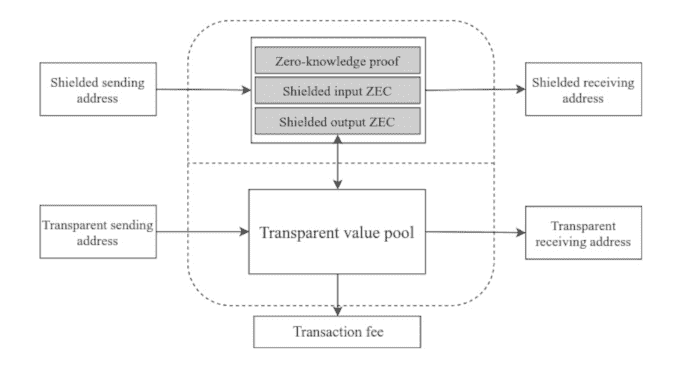

图 9.13: 具有不同类型地址的 Zcash 交易

如果用户使用透明地址执行交易，则所有未花费的交易输出对公众可见。在涉及透明地址的任意数量的交易中间的单个盲签交易地址可以打破交易链。因此，将任何交易价值追溯到实际来源将变得困难。即使有少量的盲签地址，也可能在区块链网络中提供大量的隐私。目前，Zcash 网络中不到 5%的交易是盲签交易，这仍然为其用户提供了相当多的隐私。

由于具有隐蔽地址的交易需要创建零知识证明，因此需要更多的资源和时间（最长 40 秒）。但验证时间可以忽略不计，这对于分散化来说是理想的，因为每个节点都进行验证。与其提供的改进隐私相比，创建隐蔽交易所需的资源和时间成本可以忽略不计。

# 私人交易

零知识证明及其变体 zk-SNARK 的主要目的是使交易私密化。在诸如比特币的普通交易中，通过未花费的输出（UTXOs）声明交易价值。每个 UTXO 由所有者的公共地址和价值描述。让我们假设 Alice 有`1`比特币，用`UTXO[1]`表示：

```
UTXO1 = (PK1) 
```

`PK[1]`是 Alice 的公钥。每个 UTXO 后面还存储了一个随机数，后来 Alice 用这个随机数来保持隐私：

```
UTXO1 = (PK1, r1) 
```

现在让我们将 UTXOs 存储为哈希以获得更好的隐私：

```
H1 = HASH (UTXO1) 
```

这些哈希值在每个节点上都会被存储，即使已经花费。所以，为了区分已花费和 UTXOs 之间的区别，需要维护一个称为 nullifier set 的单独列表。

Alice 想将 1 比特币转给公钥为`PK[2]`的 Bob。在花费了`UTXO[1]`后，Alice 为 Bob 创建了一个新的 UTXO，其价值为 1 比特币：

```
UTXO2 = (PK2, r2) 
```

Alice 创建一个 nullifier 来花费 `UTXO[1]`，`nf[1] = HASH (r[1])`。她还创建了`UTXO[2]`的哈希值，并将其与 nullifier `nf[1]` 一起转发给所有公共节点（卡罗尔在*图 9.14*中）。她还根据*图 9.14*将新创建的`UTXO[2]`仅发送给 Bob 的私人渠道：

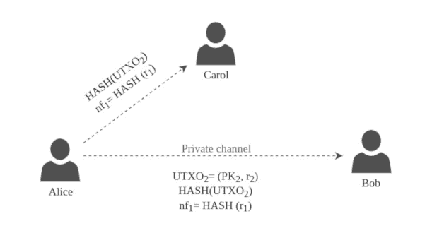

图 9.14: Zcash 中的交易交换

当 Bob 收到**UTXO[2]**的哈希值和 nullifier **nf[1]** 时，他通过检查本地的 nullifier set 来确保**UTXO[2]**尚未被花费。如果其不存在，他就将 **nf[1]** 添加到 nullifier set 中。虽然 Bob 已经验证了**UTXO[2]**的合法性，但他无法确定**UTXO[2]**是否真的属于 Alice。唯一能够确认 UTXO 实际属于 Alice 而不暴露密钥的方法，就是借助零知识证明。

除了 Alice 转发的信息之外，*图 9.14*中还发布了一个零知识证明字符串*π*，以说服所有节点她知道关于**PK[1]**、**sk[1]**和**r[1]**的信息，其中**sk[1]**是与**PK[1]**对应的私钥。虽然*π*字符串证明了知识，但不会透露任何机密信息。

# 摘要

在本章中，我们已经调查了大多数优化和增强区块链技术的技术，以改进这项技术的范围。我们从比特币的基本可扩展性问题开始，并提出了一些解决方案。我们涵盖了区块链应用的网络、共识和应用层的问题，并提出了解决方案。本章后面还讨论了区块链技术的未来可能性，以探索区块链的增强想法。

在接下来的章节中，我们将深入讨论区块链技术的安全方面。
