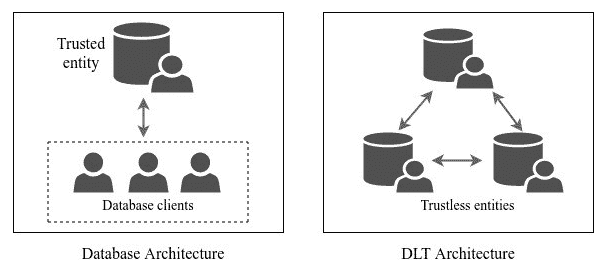
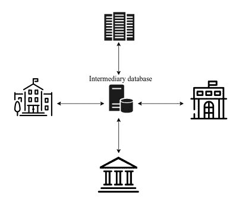
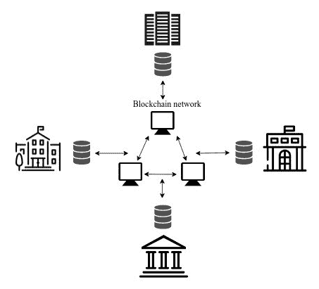
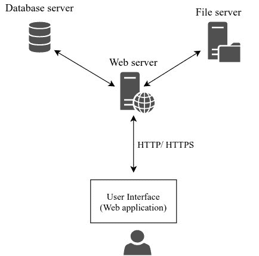
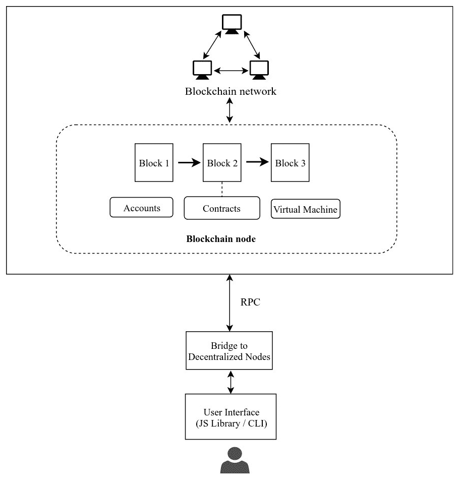
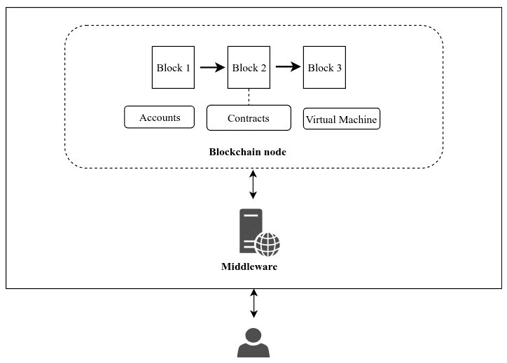
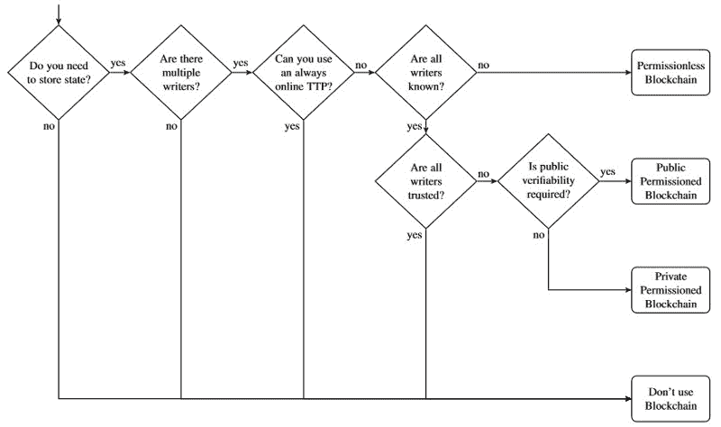
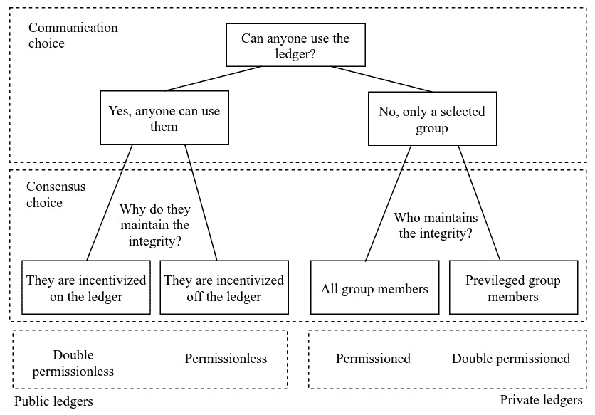
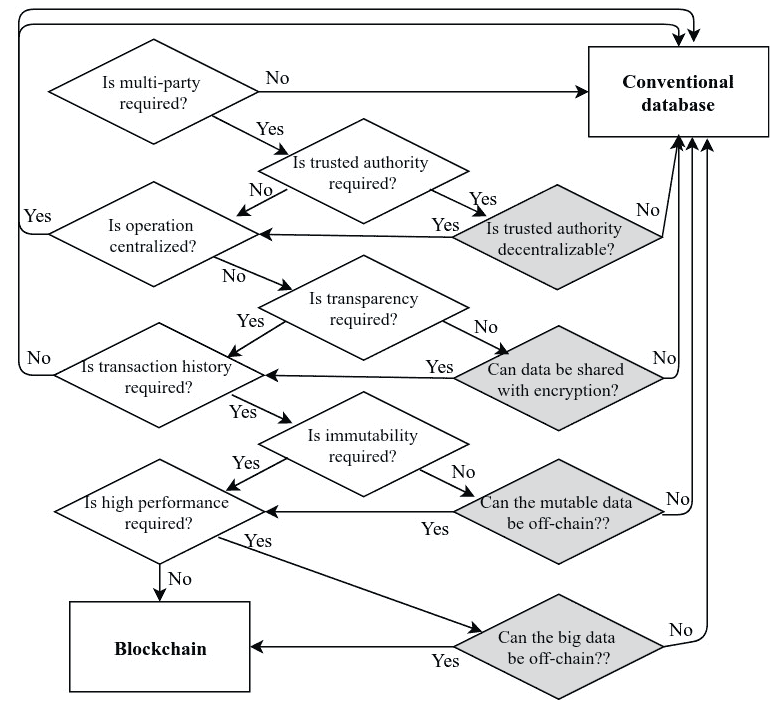
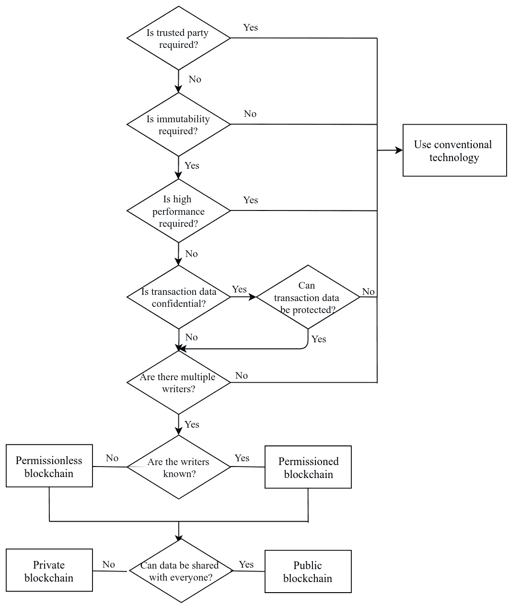

# 什么时候不应该使用区块链？

到目前为止，在本书中，我们已经学习了许多区块链概念，以了解区块链的基本功能。在前几章中，我们也深入研究了技术，以便熟悉去中心化应用程序。然而，由于我们正在研究可以帮助我们在去中心化网络中构建应用程序的区块链技术的基础，因此重要的是我们问自己一个问题，*为什么要使用区块链？* 只有在用例需要区块链的特性时，才有用处使用区块链。

在本章中，我们将探讨区块链的特点，并分析它们如何影响区块链用例的实施。我们还将研究一些用于分析区块链用例的框架。

本章中，我们将涵盖以下主题：

+   分布式数据库与**分布式分类账技术（DLT）**的区别

+   在区块链上存储什么

+   集中化与去中心化架构的差异

+   区块链的特性

+   我们可以用来评估用例的框架

区块链是一种不断演进的技术，由热衷者在各种可能的用例中不断实施。区块链的一些特点吸引了许多社区的关注，他们决定在去中心化网络中构建自己的应用程序。除此之外，众多区块链平台的可用性推动了对该技术的吸引力。一些研究人员、爱好者甚至企业已经开始在去中心化网络中构建应用程序。其中一些人提出了新的解决方案，而其他人则试图用传统的解决方案解决问题。

但并非所有提出的区块链解决方案都一定可接受；事实上，其中许多是在错误的方向上不必要地去中心化应用程序。在采用区块链之前了解区块链能提供什么是很重要的。

区块链提供了许多功能，促进了无信任网络的构建。然而，它也有自己的一套限制。AngelList的联合创始人之一、也在2017年CoinDesk区块链最具影响力人物榜单上的Naval Ravikant在一次采访中说：“*区块链非常低效，只有在需要去中心化时才值得支付成本，但在不需要时则不值得*”，他指出了区块链技术被用来构建应用程序而没有经过适当评估的担忧。由于缺乏区块链的普遍接受定义，大多数此类项目都是错误的。

尽管我们对区块链技术有很深的了解，但在进行任何区块链项目之前，我们需要了解和衡量几个参数。有几种评估模型将证明使用分散的区块链而不是传统的集中式系统。在本章中，我们将研究一些参数以及能够帮助我们回答“何时不应该使用区块链？”的评估策略。

# 分布式数据库与分布式分类账技术（DLT）

当我们考虑实施区块链时，第一个冒出来的问题是，“区块链动力分类账技术与传统数据库有何不同？”传统数据库是集中式的，而大多数区块链平台使用数据库在每个节点上本地存储交易。因此，实际的比较应该是由区块链驱动的DLT与分布式数据库之间的比较，这将是我们在本节中重点关注的。

尽管在分布式数据库的情况下数据库是分布式的，但仍然涉及中心化，因为数据库由中央受信任的实体管理，而DLT中的分类账由网络中的不可信节点维护。因此，分布式数据库不能保证去中心化，仍然提倡具有受信任的权威的集中式架构。架构差异清晰地描绘在*图11.1*中。

正在试图将区块链作为存储技术采用的业务用例必须了解每种存储技术的优势和缺点。区块链具有一系列特性，这些特性可能有利于或不利于使用案例。我们将指出一些基于区块链的DLT的特性，这将有助于我们分析技术在讨论的任何用例中的适用性：

图11.1：数据库与DLT架构的对比

# 信息的去中心化控制

DLT通过实现数据跨信任边界共享，去中心化信息控制。传统数据库通常由实体控制，无法轻易与其他不受信任的实体共享。在每个实体数据库中共享信息的一种方法是通过中间人。每个实体将与另一个实体通信所需的信息共享；这将通过每个人信任的中央管理机构完成。*图11.2* 显示了四个实体通过中介数据库进行通信以获取和发送可共享的信息：

图11.2：不受信任的实体通过中间人数据库共享数据

另一方面，DLT的去中心化使得每个实体都可以共享数据，而区块链将维护所有信息，并得到网络中每个节点的信任。每个实体都可以验证区块链上的数据，并确保信息未经修改，而无需中央值得信任的机构。每个实体将维护共享信息的副本，这些信息在网络中进行同步，如*图11.3*所示：

图11.3：无需中间人，信任实体相互共享数据

DLT所实现的去中心化有助于共享信息而无需依赖中央实体。摆脱对中央数据库的依赖有助于消除维护它所涉及的所有流程。这些流程可能包括雇佣员工来设置基础设施、审计、备份、迁移等。DLT消除了对人类组织的依赖，创建了一个完全去中心化的自治组织。总之，当信息需要跨越信任边界共享时，去中心化是完全合理的。

# 信息的机密性

由中央实体管理的数据库通过建立认证和授权机制来维护信息的机密性。只有经过认证并被授权访问资源的用户才能对该信息执行操作。

使用加密技术增强数据库的数据安全性，以便即使数据库被入侵，机密性也得以保持。

公开账本（DLT）是可被任何人在未经认证的情况下访问的公共分类账。完全无需许可的DLT不强制访问控制，数据将对网络中的每个人开放。以交易形式存在的数据必须在去中心化网络中是透明的，以便每个节点都能验证它们。区块链上存储的数据的开放性是去中心化成为可能的原因。比特币或任何其他公共区块链平台（如以太坊）提供了内嵌在区块中的交易的完全透明性。由于在区块链网络中创建的身份没有与真实世界的身份映射在一起，参与者即使交易是公开的，也可以匿名。但这可能不适合需要完全或部分隐私的用例。

一些高级技术，如**零知识证明**（**zk-SNARKS**）或加密，可用于保护用户的隐私。支付通道，如[第9章](35b56abd-53ae-479b-81b7-857a5baebcbc.xhtml)中讨论的*闪电网络*，*区块链优化和增强*，可以用于将只有期望的交易提交到区块链，同时在链下执行其余交易。还有其他解决方案，如将状态变更存储在安全保险库中，并仅在区块链中存储参考地址。安全保险库中的资源只能被授权实体访问。

DLTs提供了保护实体隐私的解决方案。然而，这些解决方案会使实施变得复杂且低效。所提出的解决方案将违反DLT的原则。因此，任何隐私是主要关注的用例都最好使用传统数据库来存储信息。

# 健壮性

DLTs由于技术的去中心化性质而将受到公众的严重关注。DLTs越暴露于公共网络，就越具有弹性。账本实现的不可变性确保了信息不易被入侵者篡改。去中心化有助于在网络上实现信息的冗余，这将确保一个容错系统。系统的整体健康状况不依赖于任何特定的实体，这将使系统更加健壮。

传统数据库可以复制和分区。复制数据库记录将使数据库具有容错能力。复制策略并不是大多数数据库的固有特性。虽然分布式数据库系统会在几个节点中复制记录，但它们并不像DLT那样去中心化。

网络中的节点之间将存在延迟和同步问题。因此，它们不像DLTs那样具有容错性，并且需要为数据库采用灾难恢复机制，尤其是那些集中式的数据库。基于区块链的DLT是在用例需要实现容错和健壮系统时存储记录的首选选择。

# 性能

我们在前一节中得出结论，DLTs比传统数据库更加健壮。但这种容错系统的成本是性能降低。我们已经遇到了区块链技术面临的可扩展性问题。这是由于需要验证和其他共识机制才能实现去中心化。比特币使用**工作量证明**（**PoW**）算法来实现共识，这限制了区块创建时间为10分钟。这将限制交易添加到区块链的速率。数据库在插入记录时没有任何限制。在数据库表中创建记录比在区块链中插入交易要快得多。

几个区块链平台都有解决方案来提高交易速度。然而，它们无法达到传统数据库所达到的性能水平。数据库可以通过为特定应用选择特定类型的数据库来实现更高的性能。关系数据库以及各种非关系数据库，如键值存储、表格数据库和图形数据库，可以根据应用的需求使用。此外，数据库可以通过使用内存存储技术来增加读操作的性能。

数据库非常适合实现高交易吞吐量。当一个用例需要快速读写操作时，数据库应该是首选的技术选择。

# 我们可以在区块链上存储什么？

我们之前将区块链与数据库进行了比较，并分析了它们的各自属性，以评估它们作为存储机制的适用性，然后选择了其中一个。我们假设区块链可以存储与可以插入数据库中的类似信息。尽管可以将任何数据插入区块链，但它不是静态数据的首选存储机制。在本节中，我们将列出在区块链上存储数据的一些约束。

# 将数据存储为交易

区块链上的数据以称为交易的原子事件的形式存储。在比特币等加密货币中，交易包含帮助转移资产的脚本。但它们也可以包含诸如充当智能合约的可执行程序等任意信息。交易还应确保具有一组经过优化的指令，这些指令将决定区块链的当前状态。

# 存储最小数据

尽管可以在区块链交易中存储任意信息，但不建议在区块链上存储大量数据。区块链不是分散式存储解决方案。还有其他几种分布式文件共享协议，例如 IPFS，更适合存储超媒体。

由于交易费是根据交易中数据的大小计算的，所以您应该尽量保持交易的大小足够小，以完成任务。

# 存储需要最小更改的数据

尽管区块链不允许修改数据，但可以通过创建新的交易来更新以前存储的数据。重要的是要注意，交易在区块链网络中不会快速处理，建议在交易被包含在区块中后甚至等待一定数量的区块确认。如果特定的数据项需要经常更新，那么在所有相关交易被处理之前需要花费相当长的时间。许多节点甚至可能拒绝引用其他未确认交易的交易。因此，建议将这些数据存储和处理在链下。

# 集中式与分散式应用架构

我们通过分析其特性比较了DLT和数据库。 但在实施之前分析应用程序架构也很重要。 我们将描述集中式和分散式应用程序的架构，以便更清楚地了解组件及其相互通信的方式。

在使用基本集中式服务器架构的应用程序中，所有涉及的组件只有一个单一实例。 *图11.4*显示了Web服务器应用程序的架构图。 用户可以通过Web应用程序提供的用户界面与Web服务器通信。 Web应用程序是使用脚本语言（如JavaScript）和标记语言（如HTML）的组合进行编程的。 一个简单的Web应用程序将有一个托管应用程序的Web服务器。 但是，Web服务器可以与数据库、文件或应用程序所需的任何其他服务器进行交互。 由于集中式服务器具有单个物理地址，它们会映射到域地址。 用户可以访问**域名系统**（**DNS**）服务器以查找Web服务器的物理地址，然后使用应用程序协议（如HTTP）进行通信。

在集中式架构中，任何数量的组件可以独立运作并在需要时相互通信。 一个典型的Web应用程序将具有数据库、存储和Web服务器作为它们的组件，如*图11.4*所示：

图11.4：集中式应用程序的架构图

分散式应用将与执行类似功能的节点网络通信。 使用分散式应用程序的客户端可以与网络中的任何节点通信以执行任何操作。 与集中式服务器不同，分散式架构不使用DNS服务器，因为不存在单个服务器。

*图11.5*展示了区块链网络中的一个节点。 用户直接与此节点通信以使用应用程序的任何功能。 正如我们在几个区块链平台中看到的那样，每个节点都会暴露一个端口以使用**远程过程调用**（**RPC**）协议进行通信。 如果客户端希望使用Web应用程序进行通信，JavaScript库可以用于建立RPC连接。 一些区块链平台提供桥梁以便与分散网络通信。 MetaMask是以太坊中使用的桥接应用程序。

在一个集中式应用架构的图表中可以看到，基础设施设计是灵活的，因为一个单一实体负责维护基础设施。在分散式架构中，当涉及到设计时，节点没有太多的灵活性。一个纯分散式架构不会与任何其他集中式组件集成，因为这会违反分散化模型。一个需要集成多个组件的应用将形成一个复杂的架构，并且这样的架构不受分散式网络的欢迎：

图11.5：分散式应用架构图

正如我们在*图11.5*中所看到的，客户端将直接与分散式网络进行通信，而没有中间人。但有一些用例将需要集中式可信实体与分散式网络集成，在其中功能由智能合约定义。可以通过在中间件中部署可信实体来创建混合架构，如*图11.6*所示。

中间件通常用作客户端和区块链网络之间的中介。它可以是一个能够与区块链节点通信并在需要时创建和转发交易的网络服务器。中间件基本上是一个提供可信数据给区块链的可信实体。以太坊平台利用称为**预言机**的特殊可信实体。这些预言机可以向区块链节点中的合约提供可信的外部信息。

当区块链单独不合适时，企业通常会实现混合架构：

图11.6：带有中间件的分散式应用架构图

# 区块链的特性

到目前为止，我们已经讨论了一些区块链的特性，同时将分布式分类账技术与数据库进行比较。但由于其分散化的特性，区块链具有一些固有属性，这些属性将极大地有利于某些用例，而对其他用例则不增加价值。在本节中，我们将讨论这些属性，以便您能够正确评估区块链是否适用于您自己的用例。

# 不可变性

区块链是一种分类账，不允许您更新或删除现有记录。在区块链上记录的数据应该永远保留。这使得区块链成为一种不可变的数据结构。与传统的记录技术不同，一旦记录包含在区块链中，就无法擦除记录。更新记录的唯一方法是创建一个新记录，它将撤消以前记录的影响。在区块链中，更新操作是昂贵的，因为每次记录插入都会消耗时间和费用。

不可变性是区块链的关键特征之一，因此所选用例能否利用区块链的不可变性是至关重要的。

# 不可否认性

存储在区块链中的每笔交易均由签署交易的实体创建。一旦添加到区块链中，就不可能删除交易，这是由于区块链的不可变性。因此，签署交易的实体无法否认交易的存在。在集中式系统中由于其可变性可以观察到否认，但在分散式系统中是非常不可能的。

# 安全性

分散化的主要优势之一是增强的安全性。我们已经讨论了区块链技术在 [第10章](53dc28ad-de3d-463a-8244-e48d0d19d616.xhtml) 中提供的安全级别，*区块链安全*。区块链网络的分散化将使系统对许多可以针对集中系统执行的传统攻击具有抵抗力。

使用区块链实施的任何用例都不必担心系统受到许多传统攻击的保护。

# 冗余

所有区块链记录都复制到网络的所有节点上，实现了高度的分散化。网络实现的冗余确保了它是一个容错系统。然而，冗余将在网络中引入延迟，这对性能产生负面影响。在实施任何用例之前，考虑容错和性能之间的权衡是非常重要的。

# 降低成本

在分散网络中创建应用程序的一个吸引人的特点是消除了管理组织、创建和维护基础设施所涉及的成本。在没有单一实体承担功能成本的用例中实施是理想的。**分散自治组织**（**DAOs**）是一个没有实体负责承担费用的用例。

# 透明度

存储在区块链中的每笔交易均需由网络中的每个节点进行验证。验证过程要求区块链中存储的所有交易的透明性。在实施用例时，决定要包含在区块链中的数据至关重要。保密性是高优先级的应用程序对于公共区块链来说并不是一个好的用例。

# 区块链的决策模型

基于对区块链技术及其对现实问题的影响的深入理解，许多研究人员提出了几种决策模型，这些决策模型将有助于快速评估任何用例中区块链的适用性。这些决策模型考虑了区块链的所有基本原则，并决定用例是否适合在基于区块链的生态系统中实施。

# 卡尔·沃斯特和阿瑟·杰尔韦伊

计算机科学研究人员卡尔·吴斯特（Karl Wüst）和亚瑟·格尔韦（Arthur Gervais）在文章《你需要区块链吗？》中提出了一个决策模型，该文章发表在IACR Cryptology（[https://eprint.iacr.org/2017/375](https://eprint.iacr.org/2017/375)）。该模型帮助在系统中存在相互不信任的实体时决定是否需要使用许可和无许可的区块链。

*图11.7* 描述了区块链决策模型的流程图，该模型根据使用情况确定区块链的适用性，并帮助确定区块链的类型。它建议，如果使用情况满足以下所有条件，则区块链是一个解决方案：

+   它需要存储状态

+   存在多个写入者

+   没有在线**可信第三方**（**TTP**）

+   所有写入者都是不受信任的

它进一步建议，如果所有写入者都是未知的，则使用无许可的区块链，并在其他情况下建议使用许可的区块链。如果交易由所有人验证，则许可的区块链将是公共的；否则，区块链可以在私有网络中维护：

图11.7：区块链决策模型的流程图（来源：https://eprint.iacr.org）

他们还列出了区块链和数据库的不同属性以进行比较。 *表11.1* 显示了无许可区块链、许可区块链和可信数据库的若干属性：

|  | **无许可区块链** | **许可区块链** | **中央数据库** |
| --- | --- | --- | --- |
| 吞吐量 | 低 | 高 | 非常高 |
| 延迟 | 慢 | 中等 | 快 |
| 读者数量 | 高 | 高 | 高 |
| 写入者数量 | 高 | 低 | 高 |
| 不信任写入者数量 | 高 | 低 | 0 |
| 共识机制 | 主要是 PoW，一些 PoS | BFT 协议（如 PBFT） | 无 |
| 中央管理 | 否 | 是 | 是 |

表11.1：比较不同类型区块链和中央数据库的属性

# Birch-Brown-Parulava 模型

大卫·伯奇（David Birch）、理查德·布朗（Richard Brown）和萨洛梅·帕鲁拉瓦（Salome Parulava）在文章《面向金融服务的环境问责：共享分类帐、半透明交易和大规模金融危机的技术遗产》中提出了一个评估模型，该文章发表在《支付策略与系统杂志》上。该论文提出了一个模型来探索在金融服务中应用共享分类帐的可能性。他们还设想了一个具有半透明交易的金融市场。

*图11.8* 展示了所提出的决策模型，该模型评估了区块链在金融服务中的应用。根据分配给分类帐用户的权限，确定要使用的区块链类型。它们还根据用户对共享分类帐功能的影响程度进行了更细粒度的分类：

图11.8：金融服务的决策模型（来源：Birch-Brown-Parulava模型）

# 评估区块链适用性的框架

一些研究人员，包括罗新光、许希伟、詹英佳和陆清华，在一篇题为 *评估应用区块链适用性* 的论文中创建了一个评估框架。该框架考虑了区块链的许多特性，以评估它是否符合用例的要求。

提出的框架由七个问题组成，在评估用例之前需要回答，如 *图11.9* 所示。该框架建议在满足以下条件时使用区块链：

+   场景需要多个实体。

+   操作不是集中化的。

+   需要保证交易历史的完整性。

+   性能不是首要考虑因素。

+   没有可信的第三方参与。

+   数据透明度是期望的。

+   插入的数据不应该是可修改的（immutable）。

该框架进一步评估了是否可以使用替代解决方案保留一些区块链的特性。如 *图11.9* 所示的框架进一步评估了是否应该将受信任的权威去中心化，如果不需要透明度，数据是否可以受到保护，以及可修改和大批量数据是否可以在链外维护。与其他决策模型相比，该框架在评估用例的要求时不那么严格： 

图11.9：评估框架（来源：评估应用区块链适用性）

该框架在论文中评估了一些工业用例。在框架中执行每个用例的需求后，得出的结论是供应链和身份管理相关的应用可以轻松适应区块链。另一方面，诸如电子健康记录和股票市场等信息敏感型用例不适合在区块链中实施，因为区块链网络的透明度和吞吐量低。在下一章中，我们将分析几个用例，在评估它们的适用性后。

# 通用的决策模型

我们已经看到了区块链研究人员提出的几种决策模型。虽然所有这些模型都可以用来评估用例的需求，但是没有一个普遍认可的条件列表来决定何时使用传统技术，何时使用区块链。基于前面提到的决策模型以及前一节讨论的区块链的所有特性，*区块链的特性*，我们创建了一个通用的决策模型，如 *图11.10* 所示：

图11.10：通用决策模型的流程图

在决定区块链适用于用例之前，图11.10所描述的决策模型考虑了区块链的所有特性。与之前的决策模型类似，它需要同意以下条件：

+   没有信任方参与

+   期望交易数据的不可变性

+   场景不需要高性能

+   交易数据不是机密的，或者可以通过加密来保护

+   有多个写入者

+   数据可以在网络上共享和复制

如果所有条件都满足，使用区块链技术来实现用例是合适的。还需要确定区块链的类型，以便为实施选择合适的区块链平台。决策模型建议基于写入实体的性质选择无许可或有许可的区块链，如*图11.10*所示。如果数据可以被网络中的每个人共享和验证，则还建议使用公共区块链网络，否则使用私有区块链，如果有共享数据的限制。

我们将在下一章中使用决策模型评估、分析和选择各种用例的适当区块链平台。

# 概要

本章提供了在决定是否开发分布式应用程序时使用的策略的见解。通过比较分布式数据库和基于区块链的分布式账本，探讨了区块链的属性。深入探讨了集中式和分布式应用程序架构，以解释何时区块链架构增加价值。我们还探讨了几种区块链架构的关键属性，以便读者了解区块链的本质。最后，我们探讨了一些决策模型，评估了区块链是否适用于某些已探索的用例。

现在我们能够借助决策模型区分区块链和非区块链用例，我们将继续讨论几个金融和非金融区块链用例，指出当前实施中的问题，并证明区块链技术提供的解决方案。
