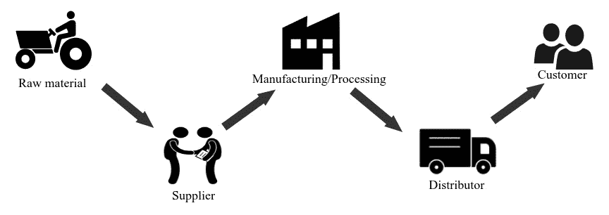
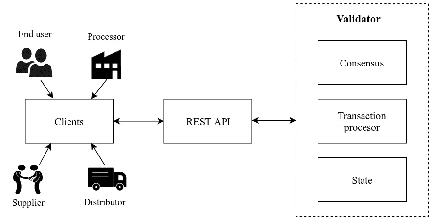
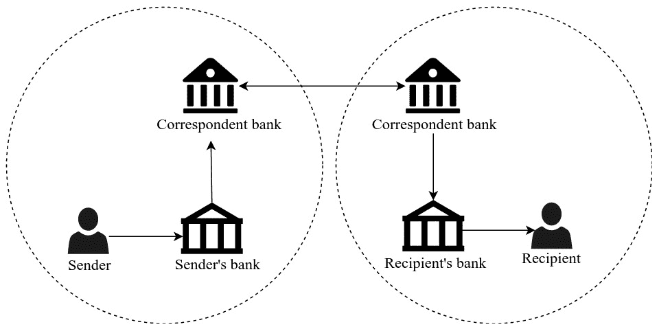
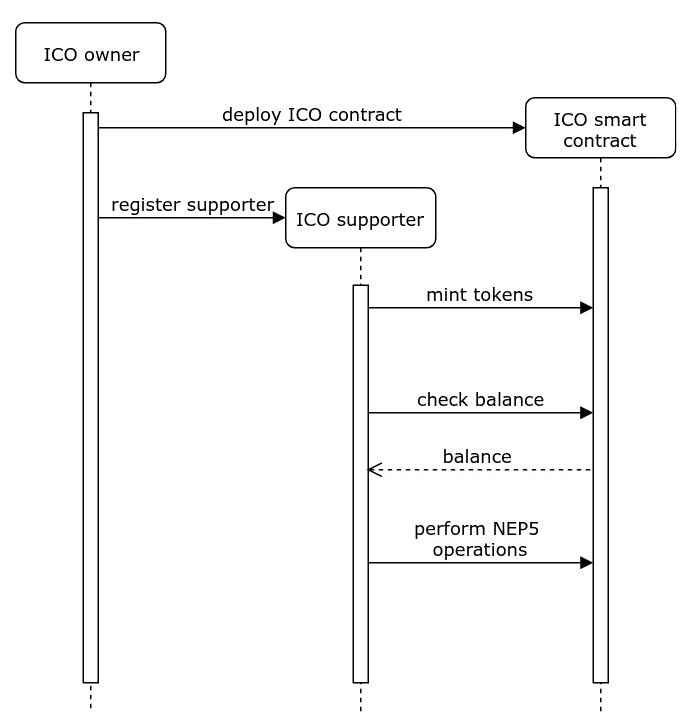

# 区块链使用案例

现在我们已经深入探讨了区块链适用性框架，正如在上一章中所见，我们现在已经具备了区分区块链和非区块链使用案例所需的信息。在本章中，我们将专注于定义更广泛的区块链使用案例，这将有助于我们激励我们为这些使用案例创建实现。

本章将涵盖以下主题：

+   溯源跟踪

+   支付系统

+   众筹

+   去中心化自治组织

区块链技术实现的去中心化可以为我们提供许多现有集中式系统中存在的问题的解决方案。尽管区块链可以为我们现有的集中式系统中面临的许多问题提供解决方案，但它也有自己的一套限制。在前一章中，我们遇到了几个评估框架，这些框架帮助我们选择了真正的区块链使用案例。在本章中，我们将分析评估框架选择的使用案例，以便我们可以通过分析这些案例来证明其使用去中心化架构的实施。

最明显的区块链使用案例涉及多个实体的参与，没有信任的权威进行集中操作；相反，这些操作是分散的。由于实施此类使用案例的明显优势，有几个使用案例立即符合实施的条件。我们在审查实施这些案例的可行性后，缩小了使用案例的范围，以提供解决现实世界问题的解决方案。

# 追踪供应链中的溯源

供应链是一个涉及到创建产品并将其分配给消费者的实体的系统。这个供应链通常涉及到供应商、制造商、批发商、零售商和消费者，在这个过程中产品按照图12.1所示的方向移动。参与供应链的角色通常分布在多个地点，这可能会使得跟踪供应链中的货物变得具有挑战性：



图12.1：典型供应链的流程图

由于在生产和分销过程中涉及多个实体，每个成品都沿着供应链移动。但由于供应链的复杂性，很难追踪溯源。大多数现有的溯源跟踪是在信任的第三方的帮助下进行的，因为供应链中涉及的实体之间都不相互信任。在这些实体之间使用区块链作为共享账本可以为我们提供一种有效的方法来跟踪供应链中任何产品的溯源。它允许系统中不信任的实体相信溯源数据，而不允许单个实体拥有和维护它。

# 供应链中的痛点

在产品最终被最终用户消费之前，市场上的每个产品都必须经过多个实体。然而，由于缺乏有效的追踪溯源机制，供应链一直存在一些关注。这些关注可以归纳为以下几个例子：

+   最终用户常常被误导，不清楚产品的来源，在许多情况下，会被提供次优产品欺骗。供应链中的任何实体也可能故意或无意地伪造产品的任何信息。

+   较低端的供应链实体，如供应商和制造商，受到大型零售商的剥削。

+   现有流程使供应链不透明，其实体无法分析供需数据。

这些要点总结了典型供应链中所面临的主要问题，即没有有效机制来跟踪产品所有权。这强调了追踪产品的公平方式的必要性，这正是区块链承诺提供引人注目解决方案的地方。

# 区块链作为解决方案

我们已经在[第7章](6bcd989e-2411-4096-91e1-943698f1702e.xhtml)中遇到了所有权证明的概念，即*深入区块链 - 所有权证明*。作为提醒，所有权证明使用数字身份和数字资产来跟踪任何资产的溯源，使用公共分类账。类似地，供应链中的每个实体将拥有可以在任何时刻拥有资产的数字身份。使用区块链进行溯源跟踪的复杂解决方案将具有以下阶段：

1.  供应链实体在溯源跟踪系统中注册为参与者

1.  初始供应商（通常为原材料供应商）将创建具有唯一身份的数字资产

1.  然后，资产被转移到下一个供应商或制造商，无论是物理上还是数字上

1.  制造商将使用相同的产品身份，以及每个转换产品的标签，以便可以追溯到来源

1.  最后，零售商在接收资产后可以将产品转移给消费者

当使用区块链和数字资产以及身份来实施供应链的溯源跟踪时，供应链可以从区块链中看到的许多特性中受益。供应链流程需要以下功能：

+   多个实体可以执行读写操作。

+   希望每一次交易的透明度，以便每个实体都了解整个供应链的供需信息。

+   交易历史需要完整性和不可变性，以便可以追溯到其来源的产品。不可变性确保没有参与者或潜在攻击者能够修改溯源数据。

+   不需要高交易速度，因为供应链信息不需要实时数据。

供应链的期望特性表明，这个用例适合使用区块链来实现，因为它满足了上一章讨论的区块链决策模型的所有要求。

# 区块链实现的供应链

供应链中的溯源追踪可以通过使用许多现有的区块链平台来实现，包括我们已经讨论过的一些平台，如以太坊、NEO或MultiChain。然而，一个名为**Hyperledger Sawtooth**的特定项目已经被许多供应链用例中的企业广泛采用。

Hyperledger Sawtooth是Hyperledger伞形项目下针对开源区块链项目的一个项目。Sawtooth项目最初由英特尔贡献，它允许共识算法被插入核心软件中。Sawtooth区块链支持受权限控制和无权限控制的实现。

Hyperledger Sawtooth具有模块化体系结构，允许其组件被轻松操纵。与其他区块链平台相比，它提供了可扩展的解决方案，具有高交易吞吐量。Sawtooth网络主要由两种类型的参与者组成：**客户端**和**验证者**。客户端将交易发送到区块链网络，而验证者则确保它们被验证并包含在区块链中。验证者遵循共识机制，并维护分类账的全局状态。Sawtooth验证者根据交易处理器中指定的业务逻辑对每笔交易进行验证。交易处理器是使用Sawtooth平台创建的任何分布式应用程序的核心，它通过状态和交易逻辑描述应用程序。因此，客户端创建的每笔交易都将使用交易处理器进行验证。

为了展示供应链实现，我们将使用一个名为**Sawtooth Supply Chain**的应用，该应用是构建在Hyperledger Sawtooth之上的。此应用程序旨在允许用户跟踪供应链中的货物，从而使他们能够跟踪货物的所有权和其他属性，如温度、重量和位置。

所有Sawtooth Supply Chain的参与者和组件都可以在*图12.2*中看到。客户端将通过由验证者节点提供的**Representational State Transfer**（**REST**）网络接口与区块链进行通信。供应链应用的交易处理器，它位于每个验证者节点中，将处理不同类型的交易，如创建、转移和接受新的资产记录：



图12.2：Hyperledger Sawtooth Supply Chain的架构图

注意：Sawtooth 供应链可以从 GitHub 存储库下载：[https://github.com/hyperledger/sawtooth-supply-chain](https://github.com/hyperledger/sawtooth-supply-chain)。

该应用程序具有几个不同的组件，并且可以通过在每个组件上运行容器来使用`docker-compose`执行。 一旦代码已被克隆，并且`docker-compose`已设置，容器可以使用`docker-compose`启动：

```
$ docker-compose up 
```

值得注意的是，`docker-compose`将花费几分钟来设置所有容器。 一旦一切都设置好，将创建 Sawtooth 供应链的以下必要组件：

+   Sawtooth 区块链和供应链的 REST API 端点

+   供应链事务处理器

+   Sawtooth 节点所需的数据库（**RethinkDB**）

+   用于与区块链交互的客户端应用程序

所有这些组件都将作为独立服务在每个 Sawtooth 节点上运行。 Sawtooth 供应链将创建一个客户端应用程序，其中供应链的每个实体都可以注册和管理资产。 Sawtooth 供应链然后在本地端口`8021`上启动名为**AssetTrack**的客户端应用程序。 一旦它们在应用程序中注册为代理，这些实体将成为供应链的一部分。 然后会为每个实体生成公钥和私钥对，并且可以通过其公钥识别实体。

已登录的实体可以添加具有一组属性的资产并提交交易。 只有给定资产的现有所有者才能使用不同的属性更新资产并将其转移到不同的所有者。 供应链中的每个实体也能够查看所有资产和代理，但只有资产的所有者才能将资产移动到不同的实体，从而确保了每个资产的可追溯性。

与此同时，Sawtooth 供应链还通过 Docker 容器提供了 shell 访问权限，我们可以使用该容器运行任意脚本，这些脚本将自动更新供应链数据。 可以使用以下 Docker 命令登录 shell：

```
$ docker exec -it a supply-shell bash 
```

一旦我们登录到 shell，可以在使用以下命令导航到`server`文件夹后执行更新一些示例资产的脚本：

```
$ npm run update-sample-assets 
```

此示例实现将帮助您了解通过在供应链中包含多个实体来跟踪出处。

有关 Sawtooth 供应链交易系列的更多详细信息，请参阅官方文档：[https://sawtooth.hyperledger.org/docs/supply-chain/](https://sawtooth.hyperledger.org/docs/supply-chain/)。

# 金融系统

金融一直是区块链的最大用例之一，可以追溯到比特币的发明。 乍一看，区块链似乎是许多影响全球经济的实施方案的最佳选择，无论是银行业、股票交易所还是支付网络。 然而，在过去，由于世界各地不同金融系统的各种解决方案以及它们之间的障碍，甚至在全球经济中，金融系统都曾被中央当局操纵过； 这涉及到很多复杂性。

银行系统是世界上最大的金融机构。 这些银行系统在每个国家都有不同的监管，这导致了在跨境金融服务方面出现障碍。 如*图12.3*所示，在两个位于不同地区的用户之间进行银行交易，由不同的当局监管，每个地区都有一个相应的银行帮助沿边界安全地进行通信和结算交易：



图 12.3：跨境交易的流程图

如今，银行机构允许用户使用不同的支付系统在线执行资金转账。 大多数国家支持**实时毛额结算**（**RTGS**）支付系统，以便实时结算银行之间的交易。 还有许多其他支付系统支持国内银行之间的互联交易，收取少量费用； 例如，印度有**全国电子基金转账**（**NEFT**）、**即时支付服务**（**IMPS**）和**统一支付接口**（**UPI**）作为其支付系统。 但是，当必须在不同国家的银行之间执行交易时，银行会使用安全系统（如**SWIFT**或**Fedwire**）进行电汇。 尽管这些支付网络的功能如预期那样运作，但在全球范围内实施时存在一些限制。

由于创建支付系统涉及到的所有复杂性，需要一个单一的系统，可以适应创建高效的支付网络。 区块链技术可以帮助我们消除金融机构之间的障碍，让无需信任的实体有效地进行通信。 当比特币创建时，它的目的是提供一个可以跨越国界使用的支付网络，因为它无法被任何单一实体所规管。

# 支付系统中的痛点

银行系统使用的复杂支付系统在与系统中的不同实体合作时具有一系列限制。 在以下列表中，您将了解现有支付系统的一些限制：

+   由于每日交易限额，不适合进行大额资金转移。

+   您经常会遇到高额的交易费用。

+   银行间交易结算速度较慢。尽管当前支付系统可以为国内银行提供快速交易结算，跨境交易仍然非常缓慢。

+   你可能发现一些支付系统仅在银行的工作时间内运作。

+   由于所有支付系统仍然是集中化的，它们容易出现错误和遭受攻击。

尽管银行交易可以以电子方式执行，值得记住的是，并非所有机构都有能力处理数字交易，对于一些机构来说，使用实体货币进一步复杂化了金融系统。制作一种无法伪造的实体货币成本高昂，还存在诸如难以验证货币原始性的问题。所有这些复杂性导致了腐败的金融系统。

# 区块链作为解决方案

区块链是比特币的产物，旨在用点对点电子现金取代当前的支付系统。即便如此，自比特币和区块链的发展以来，这项技术已经远远不仅仅是一种备用支付系统。区块链的性质为解决支付系统和其他金融系统的问题提供了很多空间。一个高效的支付系统需要具备以下特性：

+   交易的实时结算

+   国内和国际交易低费用

+   转账金额没有限制

+   安全的通信和记录保存机制

借助去中心化网络的帮助，区块链可用于构建一个去除支付系统中介的系统，从而实现快速和廉价的解决方案。然而，由于流动性可以立即转移到收款方，对交易金额没有限制。同样，区块链的共识机制在本质上保护了不可变的分类账。

我们讨论的支付系统案例满足了区块链决策模型，因为它需要大多数区块链的特性。然而，保密性可能成为区块链实施的问题，因为交易信息在公共区块链中是透明的。但你会发现，大多数支付系统的区块链实施都涉及银行和其他金融机构作为最终用户，而不是银行账户持有人自己。因此，它提供了进行私人交易并向第三方观察者隐藏私人细节的方法。即使直接在最终用户之间执行支付交易的支付系统也可以利用匿名交易以保护隐私，就像[第8章](02eed23a-0a39-4a19-8d88-a72a810ddb0d.xhtml)中讨论的那样，*区块链项目*。

# 区块链实施的支付系统

正如我们将要讨论的那样，有几种正在尝试利用区块链技术提供比现有金融系统更好的解决方案的实施。Ripple 和 Stellar 是两个提供网络的平台，充当参与者之间的桥梁，并帮助消除任何其他中介的需求。银行之间建立的网络充当跨境支付系统，甚至在没有太多延迟的情况下进行货币兑换。现在让我们更深入地了解 Ripple 和 Stellar。

# Ripple

Ripple 是一个基于分布式账本的网络，允许传输一种名为 XRP 的数字资产。Ripple 的愿景和目标是构建一个面向金融机构（如银行）的加密货币，能够以低成本实现跨境资金转移。

与其他加密货币不同，Ripple 不会创建并行支付系统。相反，它提供了一个名为**RippleNet**的网络，用于现有支付系统的全球结算。Ripple 目前提供了三种不同类型的支付解决方案：

+   **xCurrent**：这是一种用于银行之间跨境支付的软件解决方案，具有端到端跟踪功能；交易在几秒钟内安全地结算。

+   **xVia**：这允许用户通过 RippleNet 使用支付提供商发送国际资金。它提供了一组 API，用户可以直接使用这些 API 全球发送支付。

+   **xRapid**：这使用 Ripple 的数字资产 XRP 作为跨境支付的流动性。它使用交易所在 XRP 和本地货币之间转换资金。交易所中 XRP 的数量越多，系统运行得越好。它还消除了银行在全球拥有本地货币预付账户的需求。

可以在 [https://ripple.com/use-cases](https://ripple.com/use-cases) 找到使用 Ripple 的支付提供商的一些用例。

# Stellar

Stellar 是一个开源平台，支持通过两种货币之间的价值交换实现跨境交易。它旨在通过更可靠、更便宜的系统连接银行、支付系统和最终用户。

Stellar 网络是一个由称为**Stellar Cores**的分布式节点组成的集合，使用**Stellar 共识协议**（**SCP**）运作。任何支付应用程序都可以构建在 Stellar 网络之上。Stellar 提供了一个名为**Horizon**的 HTTP API 与网络通信。要构建一个能够在两种货币之间进行转换的支付网络，需要一个能够帮助进行交换的支付架构。该架构包括称为**锚点**的受信任实体，它们将在 Stellar 网络中为每笔存款创建信用。金融机构（如银行）通常是支付系统中的锚点。为了发送和接收支付，Stellar 需要联邦和合规服务器，以及一个桥接服务器来协调这些服务器。

关于Stellar网络的更多详细信息可以在[https://www.stellar.org/developers/guides/get-started/index.html](https://www.stellar.org/developers/guides/get-started/index.html)找到。

Stellar提供了几种支付解决方案，包括更快的微支付和低成本汇款。 有关Stellar的一个很棒的事情是，它已经被应用在一些现实世界的用例中，并且最近与包括IBM、Deloitte、SureRemit和KlickEx在内的几家公司合作，以进行跨境交易并解决汇款挑战。

您可以在[https://www.stellar.org/how-it-works/use-cases](https://www.stellar.org/how-it-works/use-cases)找到有关Stellar用例的更多详细信息。

# 众筹

众筹是从大众中筹集少量资金以支持特定事业的一种方式。 众筹经常用于您需要为初创创意创建初始资金的情况，通常是那些处于发展初期的创意。 近年来，众筹通过从多个参与者获取资金并消除银行和风险投资者等实体的方式改变了筹集资本的方式。

众筹可以为任何类型的倡议组织，包括慈善事业、艺术和社区项目。 根据组织的意图，可以使用各种类型的众筹，例如以下类型：

+   **基于回报的**，其中众筹活动的支持者将获得商品或产品本身的提前访问作为回报。 Kickstarter和Indiegogo等在线平台提供基于回报的众筹。

+   **基于股权的**，其中对众筹的贡献者根据其贡献的金额获得公司股权。

+   **基于债务的**类似于向银行借钱，但是公众借出的是钱，而不是集中银行。 出借人将因投资而获得利息，类似于传统银行系统中的贷款。 利率对借款人和出借人都是公平的。

+   **基于捐赠的**：经常被慈善组织、开源项目或任何其他非营利组织使用，以筹集不同的原因资金。

所有提到的众筹类型至少有三个参与者：发起者、平台提供者和支持者，如下图所示：


图12.4：众筹中的参与者

成功的众筹将确保众筹活动在平台上以有效的方式进行宣传。 众筹平台应确保资金操作对众筹发起者和支持者都是无缝的。 区块链技术允许在去中心化网络中轻松创建和转移代币，无需任何中介来维护众筹平台。 众筹发起者将启动代币分发过程，称为**首次代币发行**（**ICO**）。 支持者将资助ICO，随后将获得他们所贡献金额的代币。 这些代币在ICO阶段将具有价值，而在ICO之后，它们的价值可能会有所不同。 这些代币有时甚至可以代表提供代币的组织的股权。

# 众筹中的痛点

与传统融资相比，众筹具有许多优点，例如它提供了让任何人轻松创建或资助项目的机会。 话虽如此，它确实有局限性：

+   众筹仍然需要为大部分的资金过程（如果涉及奖励、股权或债务）之间的发起者和贡献者创建协议。

+   一些众筹格式没有为支持者提供灵活的投资选项，这导致参与度不高。

+   项目的支持者需要相信他们将在资助项目后获得他们的股权或奖励，因此他们需要相信众筹平台和项目。

+   大多数众筹将由遵循捐赠模式的非营利组织发起。 使用此方法时，当使用此模型时，支持者数量往往有限，并且通常情况下，组织往往未能达到其目标。

# 区块链作为解决方案

区块链通过创建ICO在去中心化网络中提供代币分发机制。 执行ICO比任何其他形式的众筹要简单得多。 典型的ICO将涉及以下阶段：

1.  寻求筹款的项目将通过指定ICO结构（例如初始代币价值、总代币限制、代币销售期等）来启动ICO。

1.  一旦代币销售开始，支持者可以通过使用法定货币或现有加密货币资助项目来投资该项目。 支持者将获得与投资金额相当的代币。

1.  与其他众筹解决方案类似，如果ICO未达到目标，该活动被视为失败，资金将退还给投资者。

1.  一次成功的ICO可以利用资金执行项目的路线图。

ICO经常与**首次公开发行**（**IPO**）进行比较，私人组织向公众提供股份。 但是，有几个特点将ICO与IPO区分开来，如下所述：

+   大多数国家的政府对ICO并没有严格的监管。尽管这使得发起ICO更容易，但也鼓励了欺诈性的众筹。

+   由于ICO中的代币分配是去中心化的，没有单一方管理资金运作，不像IPO。

+   与首次公开募股（IPO）相比，发行初始代币（ICO）更便宜且更容易。

+   ICO是由初创组织进行的，而IPO通常由成熟的私人组织进行。

IPO是由希望通过向公众投资者提供股票来筹集资本的私人公司提供的。由于IPO涉及的程序复杂且冗长，公司寻求投资银行的帮助来协助进行流程。

# 使用ICO进行众筹的区块链实施

ICO是在去中心化网络中创建的，其目标是分发代币以筹集给定项目的资金。由于代币分配是在去中心化网络中执行的，ICO的整个逻辑都写入了智能合约中。然后，这些合约部署在区块链网络中，并由区块链节点在执行任何ICO操作时执行。

ICO主要在现有的区块链网络上启动，例如以太坊、NEO、Wanchain和Waves。以太坊和NEO都广泛用于开发和部署智能合约，目的是创建代币并启动ICO。这两个平台都提出了标准，以编程智能合约来实施在ICO期间分配的代币。

以太坊拥有ERC-20、ERC-223和ERC-721代币标准。ERC-20是用于创建可替换代币的代币标准，是ICO中使用最广泛的代币。在以下代码块中，我们可以查看一个显示ERC-20智能合约接口的代码片段：

```
contract ERC20Interface { 
  function totalSupply() public constant returns (uint); 
  function balanceOf(address tokenOwner) public constant returns 
 (uint balance); 
  function allowance(address tokenOwner, address spender) public 
 constant returns (uint remaining); 
  function transfer(address to, uint tokens) public returns 
 (bool success); 
  function approve(address spender, uint tokens) public returns 
 (bool success); 
  function transferFrom(address from, address to, uint tokens) 
 public returns (bool success); 

  event Transfer(address indexed from, address indexed to, 
 uint tokens); 
  event Approval(address indexed tokenOwner, address indexed 
 spender, uint tokens); 
} 
```

在**以太坊改进提案**（**EIP**）20中提议的ERC-20规范摘要可以在[https://github.com/ethereum/EIPs/blob/master/EIPS/eip-20.md](https://github.com/ethereum/EIPs/blob/master/EIPS/eip-20.md)找到。

ERC-223代币标准旨在提供更好的安全性并减少交易中的GAS使用。ERC-20和ERC-223代币都是可替换代币，这意味着每个代币与其他代币相同。ERC-721代币标准旨在提供不可替代的代币，其中每个创建的代币都是唯一的。

尽管ERC-721代币在典型的ICO中不常用，但它们在几个去中心化应用中越来越受欢迎。像CryptoKitties使用的可收藏加密资产就使用了ERC-721代币。

NEO平台还提供了一个称为NEP5的代币标准。这些是可替换代币，该平台允许使用相同标准的每个代币与其他代币交易。NEP5代币实现了以下方法：

```
name() returns string; 

symbol() returns string; 

decimals() returns byte; 

totalSupply() returns BigInteger; 

balanceOf(byte[] account) returns BigInteger; 

transfer(byte[] from, byte[] to, BigInteger amount) returns bool; 
```

NEP5 规范中使用的方法摘要可以在 [https://github.com/neo-project/proposals/blob/master/nep-5.mediawiki](https://github.com/neo-project/proposals/blob/master/nep-5.mediawiki) 找到。

为了更深入地了解 ICO 实现，我们将部署一个 ICO 模板，创建一个实现所有众筹功能的代币。由于我们已经熟悉了 NEO 智能合约的部署，让我们将基于 NEP5 代币的 ICO 模板部署到 NEO 区块链上。

NEX 开发的用 Python 编程的 ICO 模板，可以在[https://github.com/neonexchange/neo-ico-template](https://github.com/neonexchange/neo-ico-template)找到。

首先，我们必须确保 neo-python 配置为 Python 3.6。参考[第 7 章](6bcd989e-2411-4096-91e1-943698f1702e.xhtml)，*深入区块链-所有权的证明*，了解如何使用 neo-python 配置 NEO 区块链节点。同样，我们必须确保已设置私有区块链，如[第 7 章](6bcd989e-2411-4096-91e1-943698f1702e.xhtml)，*深入区块链-所有权的证明*中所述。下一步是启动 NEO shell 以连接到此私有区块链，可以通过执行以下命令完成：

```
$ np-prompt -p [private-network-node]
```

打开预装有 NEO 和 GAS 的示例钱包：

```
open wallet neo-privnet.sample.wallet
```

一旦从 [https://github.com/neonexchange/neo-ico-template](https://github.com/neonexchange/neo-ico-template) 克隆了 ICO 模板，我们就可以开始构建并部署 ICO 智能合约；我们需要了解智能合约的一些配置。

一组配置可以在 `nex/token.py` 文件中找到。与代币和 ICO 销售相关的配置包括代币名称、符号、代币所有者、总供应量、所有者的初始数量、每个 NEO 的代币数以及每个 GAS 的代币数。

ICO 智能合约中有一些方法只能由所有者执行，如 *图 12.5* 所示的序列图所示。因此，在`nex/token.py`文件中提供所有者信息（`TOKEN_OWNER`）是必要的：



图 12.5：ICO 活动的序列图

一旦智能合约配置完成，就需要构建并部署到 NEO 区块链上：

```
build ico_template.py test 0710 05 True False name [] 

import contract ico_template.avm 0710 05 True False 
```

在部署过程中提供所有详细信息后，NEO shell 输出合约的哈希。这里，`0xce4a9966dfd3c7c02b48646a6aac281e4c914c2d`是智能合约的地址。此地址可用于使用`testinvoke`命令执行任何 ICO 操作，如下所示：

```
Please fill out the following contract details: 
[Contract Name] > Packt ICO 
[Contract Version] > 1.0.0 
[Contract Author] > Alice 
[Contract Email] > alice@packtcoin.com 
[Contract Description] > Basic ICO contract 
Creating smart contract.... 
                 Name: Packt ICO 
                 Version: 1.0.0 
                 Author: Alice 
                 Email: alice@packtcoin.com 
                 Description: Basic ICO contract 
                 Needs Storage: True 
                 Needs Dynamic Invoke: False 
{ 
    "hash": "0xce4a9966dfd3c7c02b48646a6aac281e4c914c2d", 
     ... 
} 
```

`deploy`操作只能由我们已经配置的代币所有者执行：

```
testinvoke 0xce4a9966dfd3c7c02b48646a6aac281e4c914c2d 
 deploy [] 
```

一旦`deploy`方法被调用，ICO 就被认为是活动的。`totalSupply`和`circulation`等方法可以被任何参与者调用：

```
testinvoke 0xce4a9966dfd3c7c02b48646a6aac281e4c914c2d 
 circulation [] 
```

这些方法将返回供应的总代币数量（1000万）和最初分配给所有者的总代币数量（250万），如配置文件中配置的那样。

在这个ICO模板中，代币所有者必须通过注册来添加想参与众筹的参与者：

```
testinvoke 0xce4a9966dfd3c7c02b48646a6aac281e4c914c2d 
 crowdsale_register ["AXoZMHm7bxCF5oCkudRjJerJy5AvuRDxp2"] 
```

注册参与者可以通过附加NEO或GAS来参与众筹，从而铸造ICO代币：

```
testinvoke 0xce4a9966dfd3c7c02b48646a6aac281e4c914c2d 
 mintTokens --attach-neo=50 
```

新创建的代币必须导入到钱包中以反映所创建的代币：

```
import token 0xce4a9966dfd3c7c02b48646a6aac281e4c914c2d 
```

`wallet`命令将在钱包中反映新创建的`PCKT`代币：

```
Wallet { 
  "addresses": [ 
    { 
      ... 
      "balances": { 
      "0xc56f33fc6ecfcd0c225c4ab356fee59390af8560be0e930faebe74a6
 daff7c9b": "99993495.0", 
      "0x602c79718b16e442de58778e148d0b1084e3b2dffd5de6b7b16cee
 7969282de7": "14033.9996" 
      }, 
      "tokens": [ 
        "[ce4a9966dfd3c7c02b48646a6aac281e4c914c2d] PCKT : 
 2000.00000000" 
      ] 
    } 
  ], 
  ... 
  "synced_balances": [ 
    "[NEO]: 99993495.0 ", 
    "[NEOGas]: 14033.9996 ", 
    "[PCKT]: 2000 " 
  ], 
... 
} 
```

然后新创建的`PCKT`代币可以执行任何NEP5方法，比如`transfer`和`allowance`。 

在以太坊创建ICO将遵循类似的步骤。

可以在[https://www.ethereum.org/crowdsale](https://www.ethereum.org/crowdsale)找到使用以太坊的样本众筹智能合约实现。

有几个加密资产发行平台可以帮助创建和管理所有ICO操作，而无需手动创建和部署智能合约。一些例子包括CoinLaunch、Coinfactory和MyContract，它们是进行ICO的最受欢迎的平台之一。

# 非营利自治组织

非营利组织是在不寻求盈利的情况下提供商品和服务的机构。这些组织由志愿者为特定事业服务，一些主要的例子包括慈善机构、**非政府组织**（**NGO**）或者任何自愿组织。尽管这些组织大多由志愿者运作，但每个组织都由自主机构控制。

由自治组织运营的非营利项目有很多限制，而且可能并不总是免于腐败。然而，它们确实倾向于给决策过程带来很大的中心化，这可能导致很多争议。同样，通过引入区块链技术来消除组织中的任何中间人，自治组织可以实现去中心化。在这样的组织中，去中心化为它们带来了巨大的好处，因为非营利组织不应完全归任何权威所有。

# 非营利自治组织的痛点

正如讨论的那样，由自治组织管理的非营利项目给组织的运营带来很大的中心化。在管理志愿者项目的组织中可以观察到几个痛点：

+   组织运营不透明

+   决策权的中心化可能导致组织中只有少数人参与决策。

+   与外部组织的沟通不足

自治组织中缺乏透明度和权力的集中化可能会阻止非盈利组织的支持者了解项目的进展或参与决策。这可能导致组织内部腐败，从而导致竞选管理失败。通过创建**去中心化自治组织**（**DAO**），您可以实现透明度，并在社区成员之间分配权力。

# 区块链作为解决方案

去中心化自治组织是防止这类机构腐败的最佳方式。 DAO 可以借助区块链技术在不可信实体之间构建。在这种情况下，非盈利组织应该是透明的，并提供分散治理。基于区块链的 DAO 可以通过维护公共账本来实现这一点，从而保证透明度和去中心化。

非盈利 DAO 将具有以下属性：

+   组织所有交易的透明度。

+   通过消除任何中间人进行自我治理。

+   由股东控制。项目的支持者可以参与决策。

+   对 DAO 规则的修改必须得到社区的批准。

+   所有非盈利 DAO 的属性都符合区块链决策树的条件，这使得 DAO 成为区块链的理想用例。

# 非盈利 DAO 的区块链实现

一个非盈利的 DAO 是通过维护一个由网络中的不可信实体管理的公共账本来实现的。任何愿意为项目做出贡献或监控项目的人都可以加入 DAO，同时，DAO 的规则由社区决定，而不是自治组织。组织的所有规则都写在智能合约中，并部署到区块链上。对规则的任何修改都必须得到整个社区的同意。

可以使用 DAO 来实现非盈利、非政府组织或政府福利项目，以确保过程的完全透明性。

# 摘要

在本章中，我们详细分析了一些区块链用例，并看到它们如何适合使用区块链技术进行实现。我们还成功选择了诸如供应链溯源、支付系统、众筹和 DAO 等用例。

通过阅读本章，我们探讨了在选择适合其实施的正确区块链技术之前如何处理和分析用例。本章还帮助融合了我们在本书中探讨的所有主题的精华，并快速决定了其用例的实施。

现在我们已经完成了探索区块链技术基础的最终章节，我们应该有动力成为不断发展和引人入胜的区块链技术世界的一部分。
