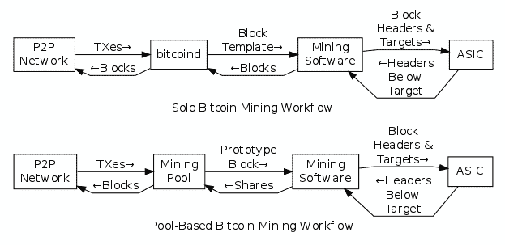
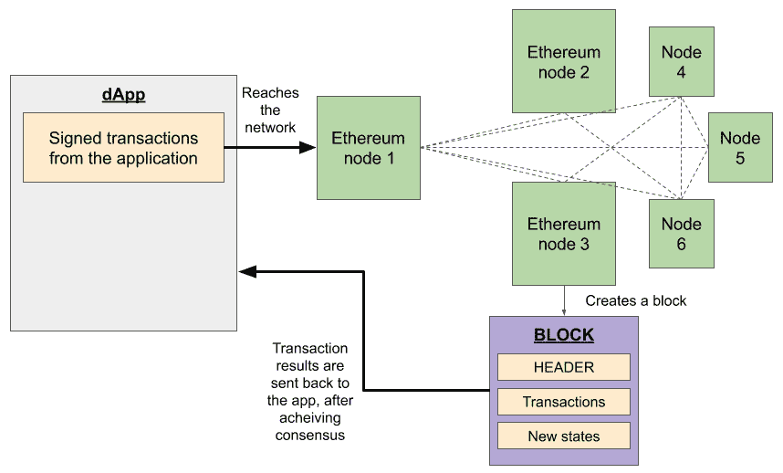

入门区块链*"每天一块链，中心化远离我们！"*

区块链和人工智能等新兴技术已经达到了可见性、接受度以及一些学术界和行业专家的猜测的顶峰。这两种新兴技术的共同目标是减少运营效率低下，并增加透明度，因此现在它们的需求非常高。从颠覆性的初创公司到大型企业，每个人都在竞相追逐成为基于区块链和人工智能的解决方案领导者的机会。本书旨在为您准备好迎接这两种技术的融合的下一个飞跃，并指导您在技术上能够构建这些解决方案。

本章简要介绍了当前区块链领域的概况。本章涵盖的主要主题如下：

+   区块链与分布式账本技术与分布式数据库

+   公共区块链与私有区块链与许可区块链

+   区块链隐私

+   了解比特币

+   以太坊介绍

+   超级账本介绍

+   其他区块链平台 – 哈希图、Corda 和 IOTA

+   共识算法

+   使用区块链工具构建 DApps

# 技术要求

本章假设您对区块链及其对传统交易系统的影响有基本的了解。

# 区块链与分布式账本技术与分布式数据库

关于如何区分区块链、**分布式账本技术（DLT）**和分布式数据库，已经进行了几场辩论。根据一些用户和应用级别的特性和启发，我们可以观察到以下差异：

| **特性** | **区块链** | **分布式账本技术** | **分布式数据库** |
| --- | --- | --- | --- |
| **不变性** | 存储在区块链中的信息无法在没有新标识符指向目标数据的情况下移除或更新。 | 尽管大多数分布式账本技术都倾向于支持不变性，但也有一些例外，不变性并非设计约束。 | 由于设计限制，大多数分布式数据库并不是不可变的。 |
| **逻辑执行** | 智能合约可用于对来自区块链的数据执行业务逻辑。 | 分布式账本技术提供对其中的数据以及用户输入进行逻辑执行的功能。 | 用户定义的函数和存储过程是常用的方法。 |
| **可访问性** | 公开区块链中的数据以交易或区块中的账户状态的形式存储，并通过中间件可见和访问。 | 在分布式账本技术中，数据是私有的，并且在某些情况下可能被加密在账本条目中。数据只能由参与者访问。 | 数据在分布在全球的分布式数据集群中持久存在，以便使用传统的客户端-服务器技术进行更快速的访问。 |
| 可验证性 | 所有交易在更改账户状态之前都经过验证。 | 大多数 DLT 不提供验证算法或模块，这是一种设计限制，适用于应用程序。 | 数据的可验证性不被提供，因为账户状态不是以特定结构持久化的。 |
| 激励 | 大多数区块链使用多种经济模型来激励他们的利益相关者。 | DLT 组中的利益相关者托管节点，并自我激励地更加自信地运营他们的业务。 | 该公司管理数据以实现可持续性，因此不会观察到额外的激励。 |

现在让我们将这些技术与以下部分讨论的一个示例用例进行比较。

## 通过示例比较技术

以下场景供您理解前面三种实现之间的核心差异。

想象一下，您计划为库存摄影创建一个新的数字平台。如果您想邀请全世界的摄影师使用该平台，并允许他们上传作品，并通过消费者自动支付版税来激励他们，您将使用区块链来提供公共访问和激励，并将版税直接从消费者转移到摄影师，从而消除了第三方执行责任支付收费的需求，但需要支付服务费。

但是，如果您希望您的平台形成一个摄影师的私人联盟，他们的艺术作品专门提供给有限的观众，并与其他方式一起处理版税，您将使用 DLT。

最后，如果您打算利用您的平台展示一组全球可访问的合格摄影师的艺术作品，无论是否有版税（这是线下处理的），您都会形成一个托管这些数据和处理访问和支付逻辑的节点集群。因此，您将使用分布式数据库。

现在让我们进一步讨论不同用例的可用区块链类型。

# 公共区块链与私有区块链与许可区块链的比较

公共区块链的设计和开发重点是确保任意数量的利益相关方可以执行业务逻辑并访问交易信息。同样，任何感兴趣的方也可以验证和验证发送到网络的交易，并因此获得奖励。

私有区块链的实施旨在确保对业务信息的访问受到限制，并且仅对有限的参与者利益相关者可访问。

许可区块链是公共区块链和私有区块链所提供的混合实现。如果数据需要被特定的利益相关者访问，则实施许可区块链。这是通过利用私有网络和交易用户数据的加密来实现的，该数据也存储在可能包含与财团其他利益相关者相关的交易的区块中。

## 比较使用场景

下表显示了三种类型的区块链在各种场景中的使用方式。它们是：

| **属性与变体** | **公共区块链** | **私有区块链** | **许可区块链** |
| --- | --- | --- | --- |
| 网络屏障 | 访问网络不受限制。公共区块链中的详细信息对所有用户都是广泛可访问的。 | 访问网络受限于 IP 或 DNS。只有少数拥有合适凭据的人可以加入网络。 | 访问网络仅限于经过验证的参与者。只有选定的人可以加入网络，并具有有限的读取、写入或两者权限。 |
| 限制 | 用户可以执行许多不同的操作，如开发智能合约并使用它，作为验证者托管节点等。 | 实际上，在私有区块链中，成员只有两个常见角色——作为验证者的托管节点和 DApps 用户。 | 基于成员的角色，用户可以部署 DApps、使用 DApps、验证交易或同时执行这三种操作。 |
| 加密 | 区块中几乎所有用户数据都未加密，因为一般目标是向公众提供信息。 | 如果参与利益相关者之间存在信任因素，则可能不使用加密。 | 加密被广泛使用，因为它涉及网络中的各方利益相关者，可能存在利益冲突。 |

在接下来的部分，我们将进一步了解区块链中的隐私选项。

# 区块链中的隐私

区块链增加了诸如信息透明度和信息溯源之类的新价值。然而，许多人错误地认为所有交易都可以在区块链上公开查看。然而，事实上，并不是所有区块链都必然促进具有公开可视性的交易：

+   **动机：** 区块链上的几个应用不仅仅是为企业用例而构建的。现在，许多区块链应用都针对大众用户群体。近年来，互联网已成为各种保护用户隐私方法的试验平台。与互联网当前状态的任何其他趋势或改进不同，大多数区块链项目旨在通过利用匿名的加密钱包向用户提供隐私优先的操作模式，而不会透露发送方和接收方的身份。一些隐私优先的区块链示例包括 Monero、Quorum 和 Zcash。

+   **方法：** 正如我们已经了解的那样，公共区块链在隐私方面存在设计限制。由于全球访问用户数据是公共区块链的突出目标之一，我们在其中看到的密码学应用很少。然而，像 Zcash、Monero 等新兴区块链旨在为用户提供自己的加密货币的不可追踪、安全和抗分析的交易环境。这是通过利用零知识证明机制实现的，该机制防止了相同加密货币的双重花费，但同时保留了区块链的基本价值。

另一方面，私有和许可区块链将保护参与者隐私视为高优先级。一个众所周知的私有实现是 JP 摩根大通开发的 Quorum 区块链。Quorum 提供了交易级别的隐私，同时利用名为 **Constellation** 的隐私引擎提供了所有参与者的网络级透明度。Constellation 使用与交易相关用户的公钥/私钥对生成的特殊密钥对交易有效载荷进行加密。它还促进了在现有网络内部部署和运行私有智能合约。

现在让我们来探索比特币，这是最早的加密货币，市值最大。

## 理解比特币

**比特币**是一个基于点对点网络的虚拟货币，用户和验证者分布在网络中。借助比特币区块链网络，用户可以以真正分散的方式转移加密货币，而无需中央银行、清算机构或中介。用户之间比特币的转移以交易的形式记录，稍后经过验证、挖矿，并添加到区块链的规范链中。

比特币被认为是由一个使用化名 Satoshi Nakamoto 的团队创建的，其大部分特性和功能都是基于现有的加密哈希、点对点网络通信和不可变数据结构的技术。

在下图中，我们说明了比特币挖矿在单个节点以及池环境中的工作原理：

图 1.1：比特币区块链网络中的两种挖矿类型

您可以通过访问 [https://git.io/JJZzN](https://git.io/JJZzN) 和 [https://git.io/JJZzx](https://git.io/JJZzx) 查看详细信息。

## 比特币简要概述

本节提供了比特币加密货币的历史背景，以及市场专家对其当前状态以及技术和架构限制的事实信息。

我们现在将快速了解一些进一步章节所需的必要细节：

+   **动机**：这种加密货币的核心动机之一是，中央银行发布的货币可能不受真实抵押物的支持，因此不能信任。这导致采用了自由市场的方法来生产、分配和管理货币，对于每个产生的比特币都需要工作证明，从而消除了中央银行和其他中介的需求。

+   **事实**：虚拟货币于2009年开放源代码，最大供应量为2100万比特币。迄今为止，已经开采了约1830万比特币，并至少有三个分叉。

以下是知名的比特币分叉：

+   比特币现金（采用较大的区块大小）

+   比特币黄金（保留基于GPU的**工作证明**（**PoW**）挖矿而不是ASIC）和比特币**可调区块大小上限**（**ABC**），区块大小为32 MB）。

+   比特币**中本聪的愿景**（**SV**）采用了128 MB的增大区块大小

    在撰写本书时，每个**比特币**的价值约为6,806.00美元。比特币区块链网络通过向转移比特币的用户收取小费，来激励验证矿工，并按照PoW算法将其授予获胜的区块制造者。

+   **批评**：据称，这种加密货币被指控是非法交易的主要选择之一。此类使用的主要打击之一来自知名的暗网上的在线黑市**丝绸之路**。FBI在2013年底关闭了该网站。

有关区块链的基本知识，现在让我们学习一下以太坊。

# 介绍以太坊

以太坊是一种公共区块链，于2013年由Vitalik Buterin设计，旨在增强现有比特币区块链，包括使用一种特殊用途的编程语言和称为**以太坊虚拟机**（**EVM**）的虚拟机进行基于交易的状态管理和业务逻辑脚本编写。

下图概述了以太坊区块创建的基础知识：

图1.2：以太坊的区块创建

在下一节中，我们将简要介绍一下以太坊。

## 以太坊简要概述

本节提供了有关以太坊加密货币的历史背景，以及市场专家对其当前状态以及技术和架构限制的实际信息：

+   **动机**：以太坊的主要动机是支持在强大的区块链媒介上构建去中心化应用程序。未能说服比特币社区需要脚本语言，Vitalik和一群志同道合的人创建了以太坊。

+   **事实**：该项目于 2015 年 7 月 30 日开源，初始版本发布。以太坊网络的研究和开发升级由以太坊基金会管理，该基金会的财政支持来自 2014 年 7 月至 8 月的以太币（ETH）代币的初始众筹。到目前为止，已铸造了约 1.05 亿个 ETH。以太坊有一个主要的分叉称为以太坊经典（原始的以太坊区块链，否定了 DAO 硬分叉，并保留了以太坊网络的原始未更改状态）。撰写本书时，每个 ETH 的价值约为 156.00 美元。以太坊区块链网络还通过向在 DApps 上进行交易或转移 ETH 的用户收取小费来激励验证节点，该费用将授予获胜的区块生成者。创建区块和接受区块的规则由称为 PoW 或 **权益证明**（**PoS**）的共识算法指定。我们将在本章的后续部分更详细地探讨 PoW 和 PoS。

+   **批评**：以太坊社区因团队做出的硬分叉决定而面临一些最早期的批评，这与一些区块链的意识形态和价值观相矛盾，如不可变性和免受人类政治动态的影响。随后，由于据称 ICO（首次代币发行）提供了没有稳定产品或服务的庞氏骗局，网络受到监管机构的批评和严格审查。

硬分叉被定义为对协议进行的重大更改，从而使一些先前的区块及其交易无效。

在对以太坊有了基本了解之后，让我们继续了解 Hyperledger 平台。

# Hyperledger 简介

Hyperledger 是一个由 Linux 基金会与金融、银行、供应链、制造业等各行业领导者合作的开源项目，旨在创建标准的区块链技术。现在我们将更深入地了解 Hyperledger 及其旗下的一些项目。

## 项目概述

Linux 基金会于 2016 年 2 月 9 日宣布了 Hyperledger 项目，最初有 30 家创始企业成员，包括 Accenture、IBM、DTCC、Intel 和 R3 等。截至目前，全球 Hyperledger 治理委员会由 21 名委员和约 200 家企业成员组成。该项目托管了数十个区块链框架和工具的代码存储库。以下部分介绍了一些重要的例子。

## Hyperledger Fabric

**Hyperledger Fabric**是最初由IBM和数字资产成员开发的区块链框架。Fabric是一个旨在为开发人员提供模块化架构的DLT，以便开发人员只使用必要的部分。该框架支持抽象为名为**chaincode**的容器的逻辑执行。使用Fabric可以轻松启用，因为可用于部署业务网络的大量文档，教程和工具。

## Hyperledger Sawtooth

**Hyperledger Sawtooth**是一个区块链框架，为企业提供了网络中节点的安全领导选举，并提供了执行指令的特殊模式。Sawtooth为大多数语言提供了强大的、开发者友好的**软件开发工具包**（**SDK**），用于编写和部署智能合约。值得注意的是，Sawtooth是早期实验使用**WebAssembly**（**WASM**）作为智能合约执行的虚拟介质的生产项目之一。

## 其他Hyperledger框架和工具

Hyperledger伞下孵化的其他一些值得注意的项目如下：

+   **Hyperledger Indy**：一个区块链平台，专门处理内部或外部系统中的分散式身份

+   **Hyperledger Grid**：一个基于WASM的项目，用于构建供应链解决方案

+   **Hyperledger Quilt**：一个连接不同协议的区块链领域的区块链工具，使用**Interledger Protocol**（**ILP**）规范

+   **Hyperledger Caliper**：一种区块链基准测试工具，用于评估特定区块链的性能和特定参数，如**每秒交易**（**TPS**），交易延迟，资源利用率等

有了对Hyperledger的基本了解，现在让我们探索开发人员可用的其他区块链平台。

# 其他区块链平台-Hashgraph，Corda和IOTA

**Hashgraph**是具有优越共识机制的DLT，利用**有向无环图**（**DAGs**）。值得注意的是，该项目的实现并不是完全开源的。该算法由Leemon Baird设计和发布，并于2017年首次发布。

**Corda**是由金融服务联盟R3维护的开源DLT。Corda提供了一个智能合约平台，允许企业执行复杂协议，涉及多种资产类别跨不同业务领域，包括供应链、医疗保健和金融。

**IOTA**是一个开源DLT，为物联网设备之间的支付自动化和安全通信提供支持。该项目由非营利性组织IOTA基金会维护。作为一种有前途的ICO之一，该项目提供了令人印象深刻的钱包、传感器数据的数据市场以及用于更快交易结算的支付通道，使用了一种名为**Tangle**的新特殊数据结构，消除了矿工和传统区块链中的交易数据的规范表示的需要。

有了对区块链平台的基本了解，现在让我们转而查看典型区块链网络的内部组件。

# 共识算法

人类社会依赖的法律在涉及计算机时要难以执行得多。**共识算法** 是编程在网络中的计算机上的特定指令，以便它们对对象和指令有一个共同的定义，并就变更达成一致意见。计算机中的崩溃、失败和拜占庭错误导致了在数字网络中形成协议的更好方法，因此共识算法在互联网的曙光之前就已崭露头角。这个概念得以重新审视，要归功于区块链领域的新飞跃。

接下来的部分将介绍区块链使用的一些重要共识算法。

## 工作量证明

**工作量证明** (**PoW**) 是比特币的匿名创始人——中本聪引入的一种共识算法。 PoW 共识算法是区块链环境中最早使用的共识算法之一。它利用了加密学、P2P 网络通信和 Merkle 数据结构的组合，在比特币区块链中提供了分布式、不可变和累积的账户状态。第一个节点计算的解决方案由其余节点验证，并且区块生成者在网络中广播：

+   **优点**：PoW 算法在比特币区块链网络中经受了时间的考验，网络中的账户状态没有发生任何一次黑客攻击/妥协，从而导致双重花费。

+   **缺点**：由于 PoW 算法需要找到一个数学问题的解决方案，因此需要大量的 CPU 循环来生成哈希，因此这是一种能源密集型的技术。

## 权益证明

**权益证明** (**PoS)** 是一种旨在解决 PoW 算法的一些权衡的新型共识算法，其设计和开发旨在通过应用涉及一些决定性因素的数学函数来确定区块生成节点，例如权益（例如，ETH）、节点的年龄以及符合条件的节点候选人的随机化：

+   **优点**：PoS 算法具有节能高效的特点，因为它需要较少的计算要求，并且不是基于解决方案验证模型选择区块生成节点。

+   **缺点**：虽然 PoS 算法在其区块时间方面是高效的，并且环保，但人们对该算法的批评主要涉及到该算法对节点所有者网络的资本主义攻击的脆弱性，以及试图通过押注大量加密货币来与其他候选人竞争，其数量远远超过其他所有候选人。

## 燃烧证明

**燃烧证明**（**PoB**）是一种共识算法，采用有趣的方法解决区块链中的加密货币从一种版本过渡到另一种版本的问题。通过PoB算法，旧的加密货币（或其先前版本）被销毁，以减少其供应量，并逐渐增加新加密货币（或其后续版本）的供应量。这种共识算法有多种形式，包括一种方法，用户可以将旧的加密货币转移到一个不可花费的钱包地址，以换取新的加密货币：

+   **优点**：如果系统信任参与实体，PoB算法便在加密货币过渡和网络升级期间很方便。

+   **缺点**：PoB算法通常适用于基于PoW的区块链，因此有适用性的限制。这是由于需要可验证的证据以及能够随时间衰减销毁的硬币，这是通过PoW算法自然能够实现的。

### 委托权益证明

**委托权益证明**（**dPOS**）是由Block.one EOS平台开发和使用的共识算法。根据dPOS，代币持有者有权提名验证者（也称为区块生产者）。区块生产者的选择是一个持续的过程，并承担将用户交易打包成具有拜占庭容错安全性的区块的责任：

+   **优点**：dPOS是**拜占庭容错**（**BFT**）准备就绪，在公共网络环境中容易扩展。

+   **缺点**：虽然dPOS高效，但容易受到资本主义的努力，以超越其他小股东的努力。

## 权威证明

如其名，**权威证明**（**PoA**）算法通过几个合格的可验证节点促进分布式共识，这些节点有权将交易添加到区块中，如果满足某些标准的话。PoA算法有许多变种，在公共、私有和许可的区块链中使用验证节点的声誉或不使用验证节点的声誉：

+   **优点**：PoA算法是节能高效的，不容易受到资本主义的陷阱，因为验证节点有权根据自己的声誉向区块中添加交易。如果观察到节点功能失常，其声誉将受到严重影响，无法继续作为验证者。

+   **缺点**：PoA算法在一定程度上是中心化的，因为添加或拒绝交易的权力掌握在网络中很少的几个节点手中。

## 实用的拜占庭容错

**实用的拜占庭容错**（**PBFT**）是学术研究中介绍的复制算法之一。这个算法由Miguel Castro和Barbara Liskov在1999年拟定([http://pmg.csail.mit.edu/papers/osdi99.pdf](http://pmg.csail.mit.edu/papers/osdi99.pdf))，它的主要目的是解决网络节点中由任意点故障引起的拜占庭故障。 

值得注意的是，PBFT 算法是 Hyperledger Fabric 区块链框架使用的：

+   **优点**：PBFT 算法高效，交易处理快速，并在私人网络中可扩展到数百个节点。

+   **缺点**：该算法基于门卫技术，因此因其集中化方法而受到批评。 PBFT 不适用于公共区块链。

## 经过时间的证明

**经过时间证明**（**PoET**）是 Hyperledger Sawtooth 区块链框架开发和使用的一种共识算法。 PoET 算法确保了在大多数具有安全虚拟环境的高级处理器中可用的特殊 CPU 指令涉及验证节点领导权和随机性的安全性：

+   **优点**：PoET 允许任何具有合格硬件的人参与作为验证节点，从而允许合法验证领导选举的方式。

+   **缺点**：尽管 PoET 不涉及押注加密货币来形成一个验证节点，但负担得起专用硬件的成本并不便宜。 因此，有人批评这是进入网络的不公平门槛。

## RAFT

**RAFT** 是由 Diego Ongaro 和 John Ousterhout 设计和开发的共识算法，其主要动机是提出一个比 Paxos 更易于理解的分布式共识算法。 值得注意的是，RAFT 确保安全的领导选举，在分布式方式下附加日志条目和状态机一致性。 RAFT 共识在 Quorum 区块链中实施，以继承前述的安全特性：

+   **优点**：RAFT 是处理复杂交易负载中最快的算法之一，并具有领导权和状态机一致性的安全性。

+   **缺点**：RAFT 仅适用于许可或私人区块链。

## 三元增强 RAFT 架构

**三元增强 RAFT 架构**（**TARA**）是专为大规模拜占庭分布式网络设计的一种共识算法。 它是 RAFT 共识算法的增强版本，通过利用 PBFT 加强和加密消息交换来处理其资产类别可识别的异构交易。 TARA 引入动态层次结构到网络，以确保其权力不集中在少数节点之间：

+   **优点**：TARA 提供服务集群，以确保高可用性、吞吐量和规模。 它具有各种形式因子的硬件，能够计算和存储交易。 TARA 可应用于公共、私人和许可的区块链网络。

+   **缺点**：领导选举并不是固有地依赖于节点的声誉，从而允许对系统的潜在攻击。 必须明确实施这些约束。

## 雪崩

**Avalanche** 共识是分布式系统的一种协议，引入了无领导的拜占庭容错，使用一种亚稳机制在节点之间实现了相同级别的安全性和一致性。Avalanche依赖于Snowball系列来形成DAG，该系列存储用户的交易数据，而不是区块：

+   **优点**：Avalanche保证了网络的活跃性，并且对网络中的竞态条件具有免疫力。

+   **缺点**：领导共识可能不适用于所有区块链环境，因为没有经过仔细分析的启发式方法来确保一致性。

通过对共识算法的详细分析，现在让我们来看看区块链开发人员可用的开发工具。

# 使用区块链工具构建DApps

区块链主流采用的主要原因之一是开发人员主导的技术传播浪潮。这体现在开发人员可利用的框架和工具的形式。在接下来的部分中，我们将介绍为公众消费提供的各种工具和平台，用于构建基于区块链的软件解决方案。

## 区块链工具链和框架

以下列表介绍了几个在开发人员和相关解决方案社区中受欢迎的区块链工具链和框架：

+   **Truffle**：Truffle框架是ConsenSys开发的一个开源项目，提供了一个针对EVM的智能合约开发、测试和部署的流程。

+   **Embark**：Embark框架是Status开发的一个开源项目，为以太坊智能合约开发人员提供了一个调试和集成环境。值得注意的是，Embark与IPFS更紧密地集成，用于合约数据的分散存储。

+   **Hyperledger Composer**：这是Linux基金会的一个开源项目，提供工具来帮助开发人员将需求转化为**概念验证**，用于DevOps流程，根据需要启动新网络。

+   **MetaMask**：这是一个中间件，将在浏览器中运行的应用程序与以太坊区块链连接起来。这是一个受到广泛支持和消费的开源倡议，所有以太坊开发人员都广泛使用。用户可以通过MetaMask在Web应用程序中执行交易。

+   **Ethers.js**：这是一个基于JavaScript的库，完全按照以太坊钱包的规范实现。开发人员使用这个开源库创建用户钱包，执行交易等。这个库还因其最近对**以太坊名称服务**（**ENS**）的支持而广受关注。

+   **Nethereum**：这是一个用于在.NET环境中构建基于以太坊的区块链解决方案的开源库。Nethereum为.NET开发人员提供了一个称为NuGet的SDK，该SDK集成到Visual Studio **集成开发环境**（**IDE**）中，用于在Web和移动应用程序中使用web3功能。

接下来，让我们研究使用 IDE 和插件开发智能合约。

## 使用 IDE 和插件开发智能合约

传统的软件开发人员更熟悉并且更喜欢在集成开发环境（IDE）中工作，而区块链充满活力的开发者社区已经考虑到了这一点。在接下来的部分中，我们将观察一些著名的基于 Web 的 IDE 和独立 IDE 可用的插件。

### [Remix IDE](链接)

Remix 一直是智能合约开发和部署的事实标准 IDE。这个开源 IDE 被对以太坊网络开发、调试和部署 solidity 智能合约感兴趣的开发者所使用。值得注意的是，这个 IDE 在私有网络上表现良好，并提供定期更新。

### [EthFiddle IDE](链接)

EthFiddle 是 Loom Network 推出的一个开源倡议，旨在方便在线代码实验，并提供与开发者之间更轻松合作的实验性 solidity 智能合约代码片段共享功能。

### [Eclipse 的 YAKINDU 插件](链接)

一些企业开发人员渴望为当前的 IDE 提供插件，而这个插件正好提供了这个功能。YAKINDU 提供了基本的语法高亮和其他常见的 solidity 智能合约开发语言功能，用于 Eclipse IDE 中的开发。

### [Visual Studio Code 的 Solidity 插件](链接)

这个插件可以安装在**Visual Studio Code**上，这是最常用的 IDE 之一。它自称是用于 solidity 智能合约开发的领先插件之一。

### [Visual Studio Code 的 Etheratom 插件](链接)

Etheratom 是 GitHub 的 Atom 编辑器上的一个插件，提供诸如语法高亮等 IDE 功能，包括将接口部署到本地以太坊节点的部署界面。它使用 web3.js 与本地以太坊节点进行交互。

# 摘要

区块链受到了很多关注，我们现在正在观察到一些激情通过形成成熟的实践、框架、工具和实际应用来实现。了解当前区块链的现状及其当前的提供帮助我们评估将新兴要求转化为产品的能力，减少市场摩擦。

在本章中，我们探讨了区块链的概念，现在我们可以自信地区分分布式账本技术（DLT）和分布式数据库之间的相似之处和不同之处。我们还观察了开放和私有区块链中不同类型的设计模式，并提供了实际示例。我们列举了多个区块链项目、加密货币实现、框架和工具。

在下一章中，我们将向您介绍人工智能的当代基础知识，我们将观察不同类型和形式的人工智能，以及更多人工智能的应用。
