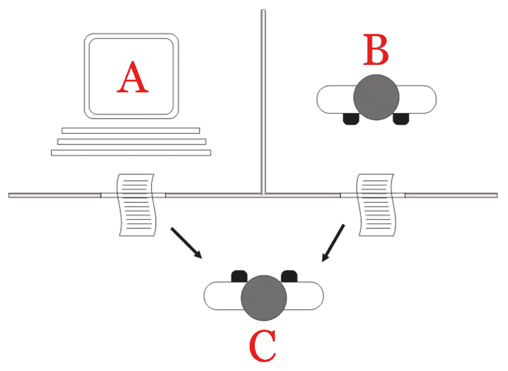
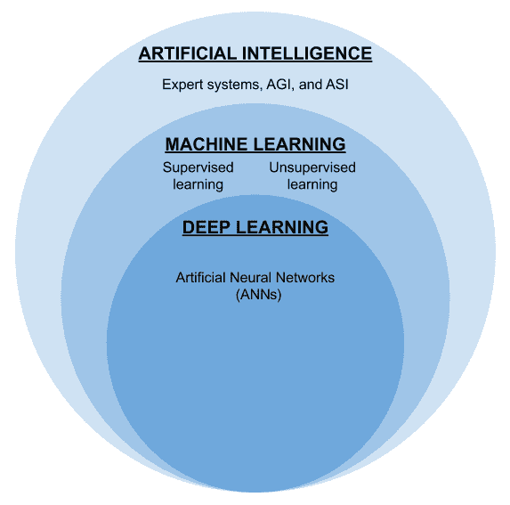
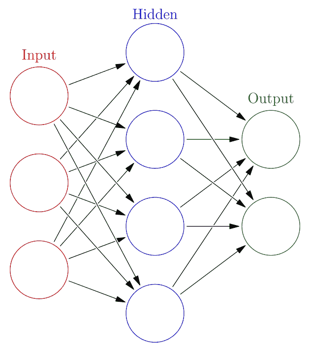
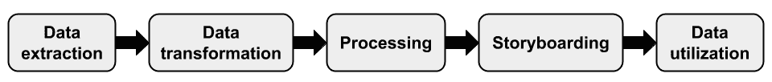
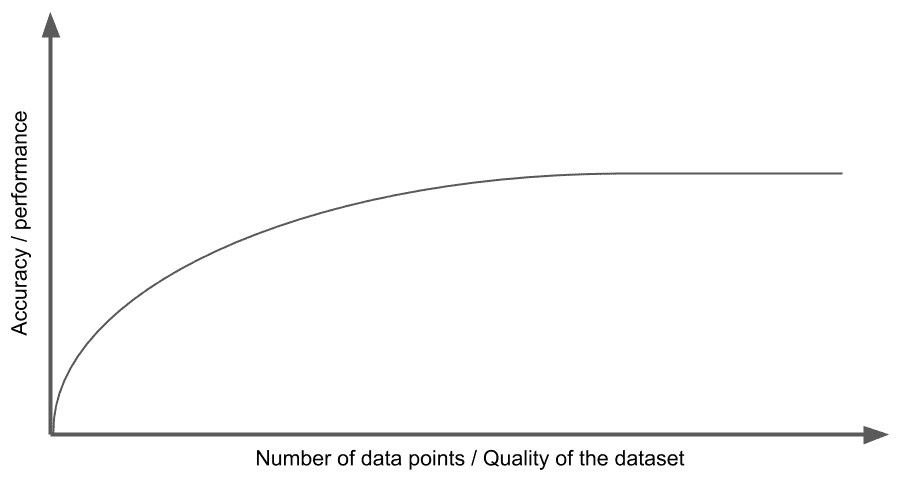

# 第四章

人工智能景观介绍*“AI 看到了看不见的东西，触及到了不可触及的地方。**”*

**人工智能**（**AI**）是早在计算机出现在全球各地家庭和办公室的桌子上之前就已经演变的基本概念之一。如今，AI 被应用于各个领域，以优化流程并解决人类能力和触角无法提供可行解决方案的问题。在本章中，我们将简要探讨 AI 的历史、分类以及企业中 AI 的应用。

本章提供了人工智能领域的详细概述，涵盖了以下关键主题：

+   AI - 关键概念

+   AI 的类型

+   AI 的形式和方法

+   数字化转型中的人工智能

+   AI 平台和工具

# 技术要求

本章假设您对各种形式的 AI 的一些基本概念有所了解，并具有一些了解 AI 如何影响日常生活的知识。本章对初学者解释了基本概念，因此不需要强制性的技术知识。

# AI - 关键概念

人工智能（[AI](https://zh.wikipedia.org/wiki/%E4%BA%BA%E5%B7%A5%E6%99%BA%E8%83%BD)）根据其技术的性质、用途以及研究时间线而有许多定义。然而，最常见的定义如下——AI 是计算机展现的智能和能力，能够感知、学习和解决问题，并且具有最小的失败概率。

人工智能比人类更短的时间内计算和达到结果的能力使得计算机成为各行业自动化的基石。人类的计算工作往往容易出错，耗时，随着问题难度的增加而准确度下降。然而，计算机长期以来一直能够填补这一角色，从自动化的早期开始，在我们日常生活中可以观察到许多被动形式的自动化。这种自动化的最佳例子之一就是**光学字符识别**（**OCR**），它将图像或文档中的嵌入文本转换为可以进行计算的文本源。配备 OCR 设备的计算机比人类更准确，重现内容的时间更短。同样，条形码扫描器使得零售店的结账时间更快。尽管早期系统本身并不完全*智能*，但它们仍然因其效率而受到认可。

尽管在早期缺乏 AI 的普遍标准，但我们将在下一节考虑研究人员在过去八十年中所做的主要努力。

## AI 的历史

我们可以在艺术、文学和计算机科学中观察到形式各样的 AI 描述，如机器人、人造人或人形机器人，可以追溯到公元前 4 世纪的希腊神话。20 世纪初，AI 研究与发展取得了主流进展。术语 **人工智能** 是在 1956 年新罕布什尔州达特茅斯学院举办的夏季研讨会上创造的。这个研讨会被称为 **达特茅斯人工智能夏季研究项目**，由麻省理工学院（**MIT**）的数学教授之一约翰·麦卡锡教授组织。这个研讨会导致了 AI 在数学和计算机科学重叠学科中成为一个特殊领域的发展。

然而，值得注意的是，在达特茅斯研讨会之前的二十年，英国数学家阿兰·图灵于 1936 年提出了**图灵机**的概念，这是一种可以处理算法的计算模型。他后来在一篇名为 *Computing Machinery and Intelligence* 的论文中（[`www.csee.umbc.edu/courses/471/papers/turing.pdf`](https://www.csee.umbc.edu/courses/471/papers/turing.pdf)）提出了区分机器智能响应与人类响应的概念。这个概念今天被广泛称为 **图灵测试**。

在下图中，我们可以看到图灵测试是如何进行的，以测试 AI 的响应是否能被另一个人类区分开来：

图 2.1：由一个询问者（C）执行的图灵测试，介于 AI（A）和人类（B）之间。

您可以在 [`en.wikipedia.org/wiki/Turing_test#/media/File:Turing_test_diagram.png`](https://en.wikipedia.org/wiki/Turing_test#/media/File:Turing_test_diagram.png) 上详细查看 Juan Alberto Sánchez Margallo 提供的上图。以下是图表的许可证，[`creativecommons.org/licenses/by/2.5/`](https://creativecommons.org/licenses/by/2.5/)。

在达特茅斯学院夏季研讨会后的将近十年时间里，第一个名为 ELIZA 的聊天机器人于 1966 年由 AI 研究人员 Joseph Weizenbaum 在 MIT 展示。这是最早尝试图灵测试的几个聊天机器人之一。在 ELIZA 发明之后，一系列新的专家系统和学习模式在接下来的两个世纪直到 20 世纪 80 年代逐渐演化。

在我们对 AI 及其历史有了基本了解之后，让我们在下一节考虑一些早期 AI 研究人员面临的障碍。

## AI 冬季

**AI 冬季**是 IT 行业中许多人用来定义一个时期的术语，这一时期 AI 研究人员面临许多挑战，导致资金大幅削减，以及 AI 作为一个专业领域的减速。

在 20 世纪 70 年代早期，由于一些不合理的人工智能猜测和随后的批评，美国和英国政府突然中断了在人工智能领域的学术研究与发展。当时复杂的国际形势也促使许多人工智能研究项目完全停顿。

人们普遍观察到人工智能寒冬始于 20 世纪 70 年代早期，但在将近两个十年后结束，原因是由于研究失败、动机受挫以及政府机构之间达成共识，以及一些最初设定的基础目标在几项研究项目启动前的崩溃。

现在我们已经了解了一点关于人工智能的历史，接下来，在下一节中，我们将探讨不同类型的人工智能以及人工智能呈现的不同形式。

# 人工智能的类型

人工智能有几种形式，每种形式都旨在解决不同的问题。人工智能可以按照各种不同的标准进行分类和归类，包括用于设计人工智能和预期用途领域的理论方法。

努力分类的行为受到一些参数的直接影响，如在没有监督的情况下学习特定任务的能力，获取认知能力，以及执行类似人类推理的能力。基于这些和一系列复杂的期望，我们将研究三种基本类型的人工智能。

## 弱人工智能

也通常称为**狭义** **人工智能**，**弱人工智能**可用于执行狭窄和重复的任务。弱人工智能功能基于预先存在的逻辑和数据的组合。用户输入是根据相同的逻辑进行处理，因此，弱人工智能缺乏自我意识和进取学习能力。一些突出的弱人工智能实现的例子包括语音助手、聊天机器人和语言专家系统。由于逻辑的狭窄实现，弱人工智能适用于用户输入和期望输出定义明确的情况。

聊天机器人接收用户的文本输入并处理输入数据，以识别所需的信息，将文本输入转换为某种形式的动作。聊天机器人通常应用于电子商务和支持领域，在这些领域中，人类干预并不总是必需的。在在线购物的情况下，聊天机器人的存在为用户提供了个人化的体验，并为用户提供了一种传统的与系统进行交流的方式，而不是传统的搜索。同样，在支持的情况下，应用聊天机器人可以降低为产品维护支持团队的人均成本。还要意识到，新一代用户更倾向于通过消息传达而不是传统电话通话。聊天机器人可以利用这种文化转变，同时减少支持过程中涉及的潜在摩擦。

## 强人工智能

通常也称为**人工通用智能**（**AGI**），强 AI 可以应用进取的学习能力来解决多变量范围内的问题。强 AI 能够感知到所面临的问题，并借助其认知能力得到帮助。由于其在削减现有流程中的运营成本以及探索未知领域中的应用潜力，强 AI 已成为研究的一个更为突出的领域之一。

由于强 AI 具有推理和做出最优判断的能力，强 AI 的应用可以在商业领域中观察到。专家系统、机器学习和深度学习技术是一些最著名的强 AI 表现形式。由于它们能够根据给定的数据点进行预测和推理，这些表现形式通常被企业广泛使用。

在各行业中应用强 AI 的其他一些示例包括**计算机视觉**（**CV**）、**自然语言处理**（**NLP**）、**自然语言理解**（**NLU**）和**强化学习**（**RL**）。

例如，NLP 可以用于根据用户的心情调整系统，并帮助系统与用户进行更有效的交流，与弱 AI 实现相比，更为高效。同样，强 AI 也可以用于更准确地进行语言翻译，从而提高不同语言之间的转换准确性。

## 超级 AI

**超级 AI**，或**人工超级智能**（**ASI**），是计算机超越人类思维意识的假设能力。许多专家推测，一旦达到奇点，AI 可能会达到这个阶段。普遍认为，超级 AI 最终将导致计算机对人类思维的技术支配。尽管超级 AI 尚不存在，但有少数机构和组织正在准备从 AGI 进化到超级 AI，专注于基因工程、人工数字神经元和量子计算。目前，超级 AI 的应用尚不清楚，因为很少有人能够理解奇点之后可能实现的成果。然而，预计一些原始的超级 AI 变体将有助于探索太空、创建新语言，并预测战争中的意外后果。

奇点是约翰·冯·诺依曼提出的一个假设情景，在这种情况下，AI 的认知能力超过了人类思维。因此，人们认为奇点可能导致一系列不同的结果，其中人类灭绝被认为是可能的结果之一。

在理论基础上，对弱 AI、强 AI 和超级 AI 的前述理解，现在让我们看看 AI 如何在各种形式中实际显现。

# AI 的形式和方法

由于预期应用的性质和可用解决方案的技术的不同，AI 的实现以各种形式出现。因此，AI 以各种形式的代码出现，在不同领域的各种开发人员中用于各自的问题。

在以下的维恩图中，我们可以看到各种形式的 AI：

图 2.2：AI 形式之间的关系

在上图中，我提到了所有主要形式的 AI，分为三种主要表现形式。每种形式在下一节中都会有详细的解释，分解为专家系统、机器学习和神经网络。

现在，我们将通过简要介绍它们的背景和应用来探索这些主要的 AI 方法和形式。

## 统计和专家系统

**统计系统**是最原始的人工智能形式之一，可以追溯到 1960 年代末。顾名思义，统计方法使用大量数据来得出最理想的结果。然而，很快就意识到结果与现实世界的场景几乎无关，并且仅基于 AI 的理性决策能力产生输出。这些限制导致统计人工智能的衰落，为 1980 年代早期的专家系统铺平了道路。

**专家系统**是一种成熟的强人工智能形式，具有挖掘数据集并得出更与问题背景相关的答案的能力。这一飞跃得到了信息理论的支持，结合了硬件方面的新能力。尽管专家系统是在 1960 年代早期开发的，但直到 1980 年代由于个人计算机革命才变得负担得起。与统计人工智能使用的科学方法不同，专家系统利用语义和语言编程以高概率得出期望的输出。

专家系统的一个使用示例如下图所示：

图 2.3：专家系统的使用照片

您可以在以下链接中查看 Michael L. Umbricht 和 Carl R. Friend 拍摄的前一张照片：[`en.wikipedia.org/wiki/Expert_system#/media/File:Symbolics3640_Modified.JPG`](https://en.wikipedia.org/wiki/Expert_system#/media/File:Symbolics3640_Modified.JPG)。以下是该照片的许可证：[`creativecommons.org/licenses/by-sa/3.0/`](https://creativecommons.org/licenses/by-sa/3.0/)。

虽然专家系统为早期人工智能的采用打开了大门，但是机器学习才真正满足了行业的需求。在接下来的部分中，我们将了解机器学习。

## 机器学习

**机器学习**是一种依赖于预先存在的数据集作为输入的 AI 形式，有时输出会有所变化，以在给定数据上应用数学模型产生类似人类思维的结果。该术语由 IBM 的 AI 研究先驱之一 Arthur Samuel 于 1959 年创造。如果特定的机器学习算法系统旨在基于给定的预测数据推断结果，那么它被称为**预测分析**，这在各种新兴的计算机应用领域中得到了应用。

尽管在机器学习之前存在着类似的 AI 形式，但人们认为自 20 世纪 90 年代初以来，大多数研究现在都已经在这个标签下进行了整合，也被称为机器学习的黄金时代。机器学习概念的最早应用包括 CV、电子邮件垃圾邮件过滤和运营优化。

近期观察到的机器学习算法有三种方法，我们将在接下来的章节中进行讨论。

### 监督学习

这种方法中的模型直接依赖于作为训练数据输入的数据集，同时也依赖于预期的输出。该模型在训练阶段使用输入数据本身，通过学习与几个输入范围相关联的输出结果，这些输出结果以标记样本的形式出现。这些样本被馈送到算法模型中，以便成功地实现预期的结果。通常，预期的结果是分类、回归或预测的形式。

### 无监督学习

在这种方法下，模型提供训练数据作为输入，但缺乏最终用户指定的任何预期输出。这种方法的预期结果是获得对数据中存在的未探索的合理共性的可见性。

### 强化学习

这是一种基于奖励的学习方法，通过以累积的方式奖励成功的代理来实现全面优化，采用了广泛的技术。

现在我们对机器学习有了基本的了解，让我们继续研究神经网络。

## 神经网络

人工神经网络（**ANN**），也称为**深度学习**，是一组合成神经元形成的电路，用于解决困难问题。这是一种专门的 AI 形式，采用激进的策略设计来实现预期目标。然而，与机器学习算法不同，人工神经网络中的启发式和执行模式不是线性的，因此这种 AI 可以在广泛的应用中找到，如自动驾驶、文本和面部模式识别、交易决策软件、数字艺术和药物配方。

下图是神经网络的一般表示，以及三个层之间的基本关系—**输入**、**隐藏**和**输出**：

图 2.4：典型神经网络的图形表示

您可以在[`commons.wikimedia.org/wiki/File:Colored_neural_network.svg`](https://commons.wikimedia.org/wiki/File:Colored_neural_network.svg)查看上述图表的前一张图表，这是 Glosser.ca 绘制的。这是图表的许可证，[`creativecommons.org/licenses/by-sa/3.0/`](https://creativecommons.org/licenses/by-sa/3.0/)。

## 进化计算

AI 长期以来一直被视为生物技术未来的关键推动力。进化 AI，如遗传算法等形式，也是这一领域早期的研究领域之一。AI 在分析、模拟和预测我们体内突变行为方面发挥了帮助作用。值得注意的是，一些基因组研究中的 AI 实践受到了积极的批评，人们担心在实验过程中对人类未来产生严重影响。

## 群集计算

除了以中心化方式行事外，AI 还明显改变了分布式和协作计算机系统的功能。**群体智能**是一组系统以有序方式合作实现共同目标的能力。群体智能被利用来理解群体行为，并在可能的情况下优化流程。

多个代理根据一组启发式规则共同工作，以消耗大量数据，并根据一个或多个计算设备之间的协调产生有意义的结果。可以在机器人技术、卡车编队等物流自动化领域观察到群体 AI 的应用。

以下照片是使用群集计算技术进行协调应用的真实示例：

图 2.5：一群协调机器人在群集中为充电。

您可以在[`commons.wikimedia.org/wiki/File:RechargingSwarm.jpg`](https://commons.wikimedia.org/wiki/File:RechargingSwarm.jpg)查看上述照片的前一张照片，这是 Serge Kernbach 拍摄的。这是照片的许可证，[`creativecommons.org/licenses/by-sa/3.0/`](https://creativecommons.org/licenses/by-sa/3.0/)。

有了对 AI 及其类型、形式和方法的基本理解，我们现在将在下一节探讨将 AI 应用于过程的程序。

# AI 在数字化转型中的应用

许多组织已经为下一波数字化转型做好了准备。虽然少数数字解决方案已成功采用了 AI 技术并正在收获成果，但大部分数字解决方案空间正忙于为即将到来的 AI 飞跃做准备。我们将简要观察一些关键里程碑，AI 在其中可以实现未来数字化转型项目并解决主要挑战。

我们将从以下图表中观察由 AI 启用的数字化转型项目中涉及的一些关键里程碑：

图 2.6：使用 AI 进行数字化转型的重要里程碑

上图表示了 AI 主导的数字转型项目的所有重要里程碑。该图还表示了连接一个里程碑到另一个里程碑的流程。以下各节将详细介绍每个里程碑。

## 数据提取

在 AI 可以用于推动数字转型项目之前，必须收集和归档与流程和实践相关的基本信息，以便进一步进行适当的打包。

数据提取步骤涉及从现有系统的各个模块中严格获取原始数据和信息。提取的数据不仅有助于我们了解现有流程，还有助于我们量化并建立进一步分析的边界和检查点。

用于提取数据的方法是 AI 赋予数字转型项目的最基本步骤。因此，确保数据质量由团队与主要利益相关者共同审查和测量是至关重要的。

假设一家乳制品公司计划进行业务数字化转型，并有兴趣利用 AI 获得更好的见解。我们将通过识别产品和收入的概要信息来了解乳制品业务，然后是有关来自许多地区的原材料的具体信息。数据提取过程还包括识别具有关键检查点的业务流程。

考虑以下 AI 模型性能的图表：

图 2.7：AI 模型性能增长的通用说明

上述折线图是一个通用的示例，说明了随着新数据点的增加（由*x*轴表示），AI 模型的性能可以更好地提高，并在*y*轴上获得准确性。这意味着随着对不断增长的数据集质量的仔细审查，随着时间的推移，AI 模型可以变得更好。

## 数据转换

前一个阶段收集的数据可能是非结构化或半结构化的。这意味着当数据点放在一起时，数据点不一致的可能性更高，这可能会成为对收集的数据进行分析的障碍。

为了帮助 AI 理解给定情景，收集的数据必须根据主要利益相关者同意的标准格式进行结构化。然而，如果数据是从数据仓库中提取的，则所需的工作量可能很小。

如果数据是一系列非结构化数据流，则市场上有多种**提取**、**转换**、**加载**（**ETL**）工具可用于以最小的工作量结构化庞大的数据量，包括 Apache NiFi 和 Apache StreamSets ([`dzone.com/articles/top-5-enterprise-etl-tools`](https://dzone.com/articles/top-5-enterprise-etl-tools))。

除了独立的和本地部署的软件之外，市场上还提供了云托管的 ETL 服务，例如 AWS Data Pipeline 和 AWS Glue。

一旦根据指定方案转换数据，我们就可以将其转发到数据处理。

假设我们已经从乳品公司获得了必要的信息。现在，我们可以通过识别数据集中的关键信息将数据与噪音分离。在数据转换过程中，我们删除不必要的列。我们还根据数据类型合并一些列，例如纬度和经度。如果当地乳品的纬度和经度数据分开保存在不同的列中，我们可以考虑将它们合并到一列中。同样，我们可以考虑跳过可能没有关键列值的行。

## 处理

来自各业务单元的结构化数据，以及训练数据，现在被用作挖掘、模拟和推断预期结果的输入数据，以更好地理解数字转型计划下计划的任何努力。

根据数据点的性质、来源和复杂性，您可以选择各种 AI 模型和技术。例如，如果数据是卖家和买家之间的对话，则可以使用**自然语言处理**（NLP）。

假设从乳制品业务中获取的数据已经清理干净，我们现在可以将数据提供给一个预测模型进行训练。一旦数据输入，我们可以与业务团队检查模型的结果，以确认结果是否符合给定的业务目标。例如，模型可能正在预测当地牛场的奶制品剩余库存。根据生成的剩余奶数据，我们也可能能够确定可以生产的乳制品。因此，通过处理数据产生的这些结果可以帮助我们获得更好的见解。

## 故事板

一旦计算出预期的结果，就应该将信息传达和分享以获得反馈。这有助于确定结果的相关性。

在乳制品示例中，我们可以使用预测来做出业务决策，及时为生产选定的乳制品分配剩余奶。通过市场上可用的可视化库和仪表板软件，可以在故事板中传达通过销售乳制品节省的成本和增加的收入。

## 数据利用

一旦对获得的结果达成共识，收集的见解就会转化为更新的实践，并通过网络、移动和**物联网**（**IoT**）设备在生态系统中的多个代理中投入使用。这种参与循环会重复，直到通过对数据采集、数据处理和算法设计的不断改进实现优化的期望结果。

在乳制品示例中，通过 AI 的帮助生成的见解和利润预测不仅通过故事板传达给关键人员。这些见解也可以通过对现有业务流程进行适当的更改进一步付诸行动。

现在我们已经了解了基于人工智能的数字化转型项目中的关键里程碑，让我们通过列举潜在失败的原因来探讨可能的失败场景。

## 失败场景

基于人工智能的数字化转型项目可能由于各种原因而失败，包括市场需求、适应性、技能差距以及业务流程中的意外变化。让我们在接下来的部分了解更多关于这些原因。

### 商业需求

在评估数字化转型项目中任何人工智能的应用之前，我们必须确保业务需求得到了一致的认可。必须列出所有那些会受益于改进其流程的利益相关者名单，以评估在过程中是否存在任何潜在风险以及其他利益相关者的参与。

### 适应能力

尽管技术已经为企业大多数组织提供了便利，但这并不一定意味着应用人工智能来进行转型能给企业带来益处。应用人工智能可能实际上会增加流程中的复杂性和问题。因此，我们必须对行业的士气敏感，并且只有在大多数利益相关者愿意接受新兴解决方案时才能做出坚定的决定。

### 技能差距

在一些行业垂直领域，不是所有涉及方都了解新兴技术。在向一群不习惯按照标准人工智能实践所要求条件下运作的涉及方介绍启用人工智能的数字化转型时可能会有严重障碍，而这些条件通常要求用户群具备分析能力。

### 流程改革

我们知道，人们往往对生活中的变化产生负面反应。与生活中一样，评估将这些新兴解决方案引入对业务变化非常敏感的利益相关方的风险非常重要。此外，数字化转型的重大突破可能会影响当前的商业模式，并影响涉及业务的利益相关方的隐私政策。必须进行仔细审查，以确保数据符合当地的数据法规和法律。

了解了人工智能数字化转型项目中涉及的流程的基本概览之后，让我们来探讨一些可用于支持此类数字化转型的工具。

# 人工智能平台和工具

人工智能生态系统成熟的主要标志之一是使用新工具和框架。其他指标，如创新、互操作性和准确性，同样对确定人工智能生态系统及其工具的成熟度起着重要作用。在接下来的部分中，我们可以看到许多工程师在世界各地使用的一些人工智能平台和工具的简短列表。

## TensorFlow

**TensorFlow** 是由互联网巨头 Google 所支持的一个开源项目。它是一个用于机器学习项目的复杂框架。它提供了一个广泛的生态系统，包括全面的工具包、库和文档，使研究人员和开发人员能够轻松设计、构建和部署基于机器学习的应用程序。在 [`www.tensorflow.org`](https://www.tensorflow.org) 上了解更多关于这些工具的信息。

## 微软认知工具包

**微软认知工具包**（**CNTK**）是一个用于商业级分布式深度学习的开源工具包。它通过使用有向图将神经网络描述为一系列计算步骤。在 GitHub 上了解更多关于该工具包的信息，网址为 [`github.com/Microsoft/CNTK`](https://github.com/Microsoft/CNTK)。

## IBM 沃森

**IBM 沃森** 是一个开源的、多云平台，可以让您以更流畅、更简化的体验构建强大的模型并部署它们。这个 IBM 套件提供了企业级的人工智能服务、应用和工具，拥有丰富的支持。在 [`www.ibm.com/watson/about/`](https://www.ibm.com/watson/about/) 上了解更多关于 IBM 沃森的信息。

# 摘要

人工智能一直处于创新的前沿，大多数商业应用程序在各个领域都采用了它。在本章中，我们能够观察到人工智能的关键概念、简要历史以及目前的进展。我们还涵盖了人工智能领域中使用的不同方法，并通过一个图表了解了人工智能中的多种实现和类别。然后，我们观察了将人工智能应用于数字转型计划以实现最佳结果所需的步骤。最后，我们介绍了全球人工智能社区积极使用的一些最新工具和平台。

在接下来的章节中，我们将探讨一些人工智能和区块链的有趣应用，以及一些真实场景的详细案例研究。
