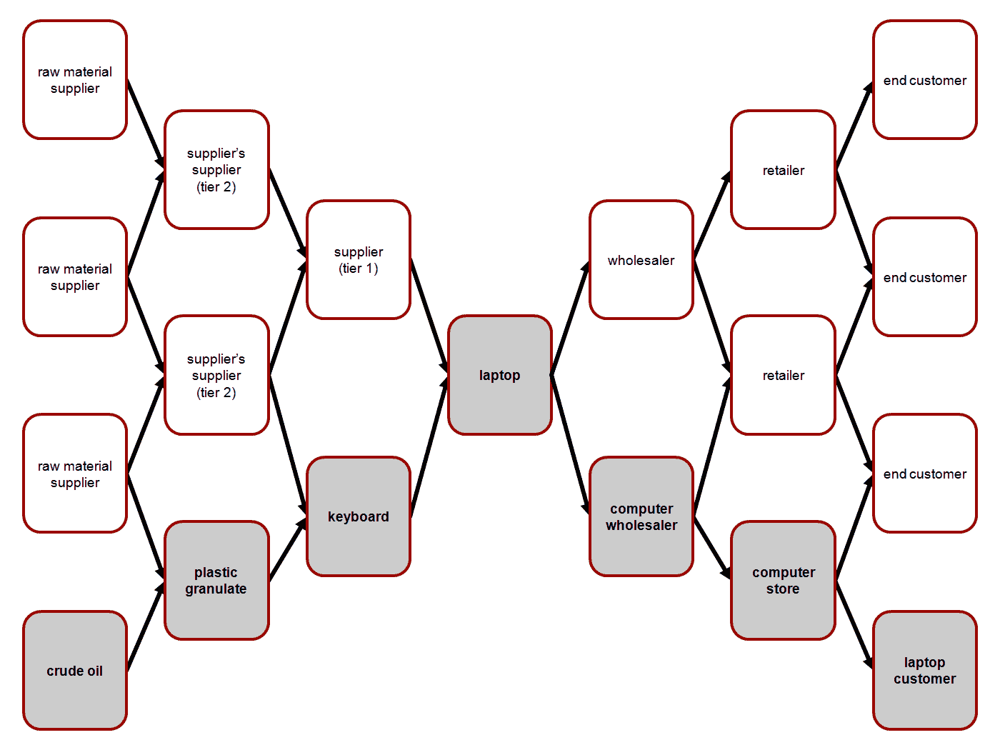
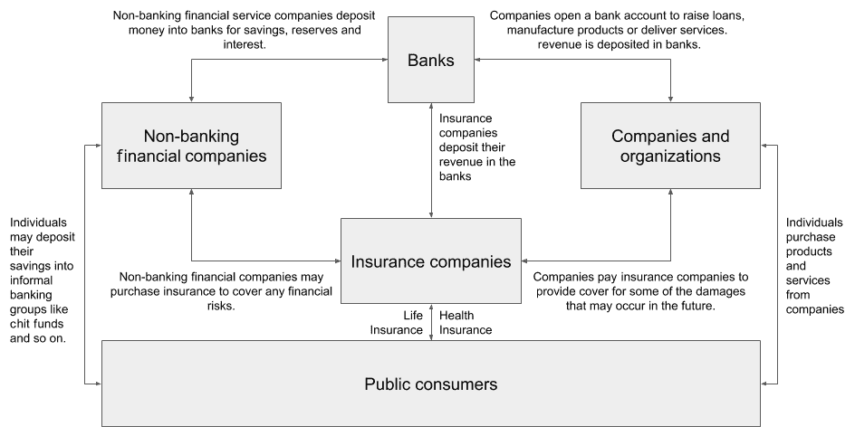
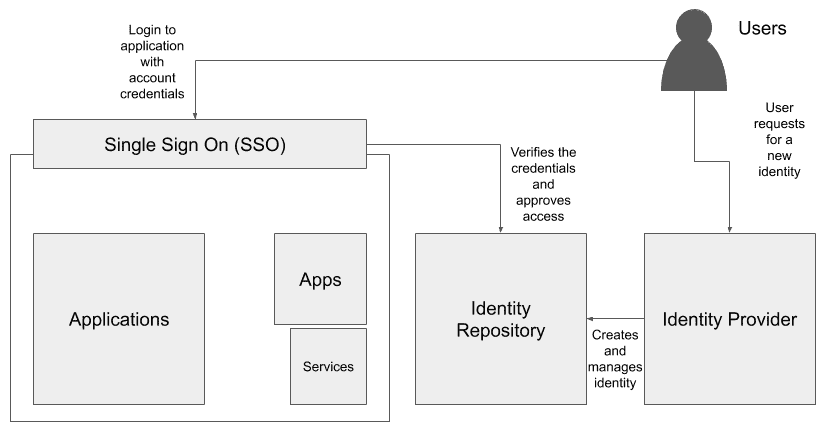
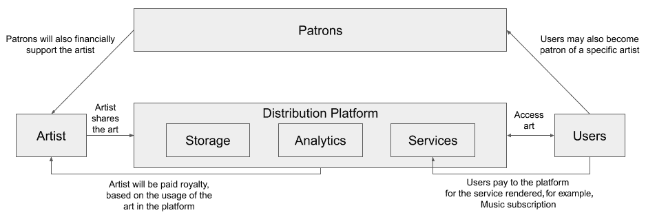
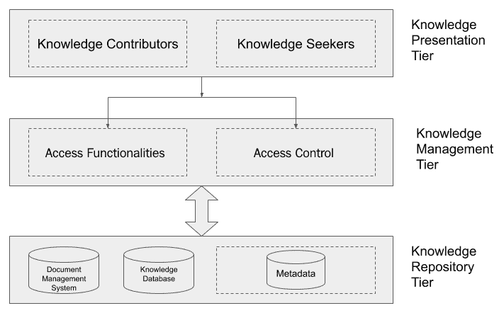

# 第六章

领域特定的人工智能和区块链应用*“区块链和人工智能：未来的掌握。**”*

区块链和人工智能已被用于构建许多解决方案。 在本章中，我们将展示一些区块链技术的应用。 我们还将展示一些使用人工智能技术的应用。 我们将分析面临的问题和提供的解决方案，并为您提供当前解决方案的视角。

我们将覆盖几个领域垂直的解决方案，如以下所示：

+   将人工智能和区块链应用于医疗保健

+   将人工智能和区块链应用于供应链

+   将人工智能和区块链应用于金融服务

+   将人工智能和区块链应用于其他领域

让我们开始吧！

# **技术要求**

本章需要您能够分析人工智能和区块链的应用，基于其在应用领域的关键能力。

# **将人工智能和区块链应用于医疗保健**

人工智能在医疗领域的实验性应用可以追溯到 20 世纪 70 年代初。应用于该领域的最早人工智能之一是一种称为**Dendral**的专家系统。 然而，Dendral 没有成为医疗保健领域的主流应用程序; 其后继者之一**MYCIN**则在医学领域的一些具有挑战性的问题上取得了一些治疗治疗。 如今，IBM，微软，谷歌和其他初创公司等顶级公司在医疗保健领域应用人工智能和区块链的应用受到热捧。

在以下屏幕截图中，您可以看到患者的**电子健康记录**（**EHR**）：

图 3.1：电子健康记录的示例视图

您可以在[`en.wikipedia.org/wiki/Electronic_health_record#/media/File:Electronic_medical_record.jpg`](https://en.wikipedia.org/wiki/Electronic_health_record#/media/File:Electronic_medical_record.jpg)查看图表。

现在，让我们了解一下医疗保健行业面临的一些问题。

## **领域中的问题**

尽管人工智能的应用在医疗保健领域取得了重大进展，但它们未能解决一些困扰该领域的治理问题和一些非法行为。 区块链在这里起到了强大的作用，它辅助人工智能作为合法数据的存储支持，通过透明和可发现的行为。 让我们看一看：

+   **电子医疗记录隐私和安全**：电子医疗记录（也称为电子健康记录）是患者健康信息的数字副本，并由医生在治疗过程中填写。通常，电子健康记录由患者的病史、症状、诊断信息和实验室结果组成。电子健康记录使组织能够提供更加连接、高效和便捷的护理。在过去的几十年里，电子健康记录的应用已经受到发达国家的严格监管，主要是欧盟和美国，它们分别通过了跨境健康指令和 1996 年的**健康保险便携性和责任法案**（**HIPAA**）隐私和安全规则。尽管这些规则得到了严格的执行，但已经发生了多起影响数百万用户的电子医疗记录数据泄露事件。这在一定程度上可以追溯到中心化的信息架构，这导致黑客发现了门户级别的入侵。

+   **药物配方**：药物配方（也称为制药配方）是研究一组化学物质以形成新药物或药品治疗特定疾病的过程。寻找一种合乎道德的方法来共享临床试验记录以完善药物配方的分析过程是一个挑战。大多数药物配方中使用的新技术利用了基于药物递送和临床测试记录获得的数据的各种分析过程。与电子医疗记录类似，底层数据非常敏感。

+   **预测性医疗**：预测性医疗的共同目标是在患者出现症状之前提供治疗或通知。通过对患者的个人数据进行准实时的预测性分析，这变得可能。获取有关身体的前所未有的数据可能非常有用，但也必须谨慎处理。基于区块链数据的人工智能实践可以在诊断期间使用可验证的数据发现提供预防性治疗。

现在，让我们学习如何使用区块链或人工智能来解决医疗行业的问题。

## 医疗领域的新兴解决方案

以下列表包括一些由活跃的企业和初创公司在医疗领域启动的基于区块链的倡议：

+   **IOTA eHealth**：IOTA eHealth 是 IOTA 基金会发起的一个解决方案倡议，提供远程患者监测、患者健康数据交换等功能，并确保 IOTA 账本支持临床研究数据的完整性。您可以在[`www.iota.org/verticals/ehealth`](https://www.iota.org/verticals/ehealth)了解更多关于 IOTA eHealth 的信息。

+   **IBM 区块链**：据报道，IBM 区块链研究团队正在研究使用许可区块链以及特殊的移动界面来防止假药的解决方案。该解决方案据称托管了一个区块链网络，在该网络上的参与者经过认证并获得授权执行交易，并跟踪和验证它们。您可以在[`www.research.ibm.com/haifa/dept/services/bc-iot.shtml`](http://www.research.ibm.com/haifa/dept/services/bc-iot.shtml)上了解更多关于当前工作的最新动态。

现在我们已经看过了关键的解决方案，让我们回顾一下当前的医疗保健行业现状。

## **回顾**

利用人工智能和区块链可以帮助彻底改变医疗保健领域，监管机构和诸如**世界卫生组织**（**WHO**）和**食品药品监督管理局**（**FDA**）等国际机构据称渴望利用这项技术。他们正在积极与致力于此方向的企业合作。预计本十年健康和医疗保健领域将有显著增长，我建议您对此领域保持关注，以获取更多通过区块链和人工智能带来的创新。

现在，我们已经看过医疗保健行业的当前解决方案，让我们探索由区块链或人工智能驱动的供应链中使用的产品和解决方案。

# **将人工智能和区块链应用于供应链**

供应链管理对于世界许多行业和增长中的经济体的成功至关重要；一些人认为供应链是贸易的神经系统。管理供应链是一种注重操作的实践，需要从计划、采购和仓储的早期阶段到从生产者到消费者的物流过程的效率和效力。

以下示例图表显示了涉及笔记本供应链管理的利益相关者：

图 3.2：笔记本供应链中的利益相关者

您可以查看 Andreas Wieland 制作的此图表，链接为[`en.wikipedia.org/wiki/Supply_chain_management#/media/File:Supply_and_demand_network_(en).png`](https://en.wikipedia.org/wiki/Supply_chain_management#/media/File:Supply_and_demand_network_(en).png)。这是该图表的许可证链接[`creativecommons.org/licenses/by-sa/3.0/`](https://creativecommons.org/licenses/by-sa/3.0/)。

现在，让我们了解供应链行业面临的一些问题。

## **领域中的问题**

以下是供应链行业面临的三大问题：

+   **运营成本和风险**：供应链中高比例仍处于纸质工作模式。这意味着系统中的数据极易被篡改。供应链中的数据对于确定产品的价值至关重要，包括其基本属性，如有效性和保质期。如果货运文件被篡改，价值链中可能存在很大的差距。基于手工纸质工作的供应链也可能因潜在情况，如重复计费而吸引财务问题，从而在利益相关者之间制造更多的审计问题和混淆。虽然相对较新的供应链解决方案已经在数字化转变一些供应链交易的纸质本质方面发挥了作用，但在处理潜在的数据丢失或伪造方面，技术上能力较少的系统较少。区块链可以通过智能合约来缓解这些问题，并可以自动化几个关键流程。

+   **安全性和真实性**：尽管供应链的端到端流程利用传统企业软件进行数字化连接，但它们在各自之间并不严密定义和耦合。这意味着数据完整性并不被当作一流特性对待。这可以通过基于不可变性概念的区块链技术来解决，并确保没有记录可以被窃取、撤回或替换为不准确的数据。由于区块链上的交易数据是开放的，相关利益相关者可以访问信息并验证唯一的真相来源。

+   **实时可见性**：在与传统金融紧密耦合的本地数字平台上的交易也可能引发其他业务挑战，如结算延迟。供应链中的企业严重依赖营运资本，资本的主要来源是通过贷款或其服务的收入。在价值链上实现实时付款可以实现更快的支付处理，成本相对较低，而与传统金融相比。这对行业来说是一个改变者。

让我们利用区块链或人工智能来解决供应链行业中的问题。

## **供应链行业中新兴的解决方案**

以下是一些应用，它们使用区块链或人工智能来解决前面提到的一些问题：

+   **IBM Sterling 供应链套件**：由 IBM Watson 提供支持，这个基于云的数字化业务网络提供实时智能和可操作的建议。该套件提供了供应商管理、库存管理和订单管理等多种功能。值得注意的是，该套件提供了一个开放平台和一个开发人员中心，用于使用区块链和人工智能构建定制解决方案。您可以在这里了解更多关于他们的产品和服务：[`www.ibm.com/in-en/supply-chain`](https://www.ibm.com/in-en/supply-chain)。

+   **OpenText**：OpenText 的目标是使供应链更加联通、协作、智能和安全，正在开发一个能够应用人工智能、物联网和区块链的自主智能供应链。您可以在这里了解更多关于他们的产品和服务：[`www.opentext.com/info/ai-iot/connected-supply-chain#form`](https://www.opentext.com/info/ai-iot/connected-supply-chain#form)。

接下来，我们将看一下供应链行业的当前情况。

## **回顾**

尽管人工智能和区块链正在被用于更有效地跟踪订单和管理库存，但仍然存在许多需要填补的业务空白。降低准入门槛至关重要，以吸引全球各地的多样化利益相关者，使他们能够参与一个具有全球可验证供应链网络的愿景，以提高质量和效率，并促进透明度。这可以通过暴露 API 来实现，以便不是所有供应商都必须在同一区块链或网络上运行；相反，他们可以简单地交换可信赖的数据，并将它们记录为跨网络的交叉交易，以实现更好的兼容性。必须努力使这些产品具有互操作性，以便全球供应链经济能够在区块链提供的多样性上蓬勃发展。

现在，让我们探讨由区块链或人工智能驱动的银行和金融服务行业（**BFSI**）中使用的产品和解决方案。

# **将人工智能和区块链应用于金融服务**

正如我们所知，BFSI 是整个世界经济运作的支柱。随着数万亿美元的资产管理规模，有效管理数字化规模的资金已成为一个有利可图的机会，因此由于目前通常依赖于传统方法的系统存在一些低效率而需要重新审视。

以下图示了 BFSI 行业利益相关者之间的关系：

图 3.3：BFSI 利益相关者

如前图所示，我们这样的普通消费者通过银行、保险公司和**非银行金融公司**（**NBFC**）获得资本和服务。还要注意，向我们提供服务的公司和组织也依赖于这些金融机构。

现在，让我们探讨一下 BFSI 行业面临的一些问题。

## **领域中的问题**

以下是 BFSI 行业面临的前三个主要问题：

+   **资本获取**：无银行业和未充分银行业者受到资格标准问题的严重影响，从而在市场上造成了巨大的漏洞，进而导致非正规经济的出现。如果资本获取变得更容易，我们可以规范非正规经济并最大程度地发挥其潜力。

+   **欺诈和违约**：据估计，金融欺诈和违约通过损失了全球经济 6000 亿美元。这是困扰 BFSI 行业的严重问题，特别是由于最近有关坏账的揭示，特别是在印度。在撰写本文时，根据彭博文章，印度在坏账排名中排名第二，累计达到 1600 亿美元。您可以在此链接了解更多信息：[`www.bloomberg.com/news/articles/2019-09-27/asia-s-640-billion-bad-loan-pile-lures-investors-deloitte-says`](https://www.bloomberg.com/news/articles/2019-09-27/asia-s-640-billion-bad-loan-pile-lures-investors-deloitte-says)。

+   **缺乏适当的流程自动化**：尽管已经进行了许多尝试来保障并自动化 BFSI 行业，但我们需要一个更好的模式，可以在行业透明度之间取得平衡，同时也保持机构之间的秩序。因此，使用区块链带来透明度，以及使用 AI 技术实现自动化的优化工作流程可能是改革该行业的关键。

现在，让我们浏览一些可用于解决 BFSI 行业问题的解决方案。

## **BFSI 中的新兴解决方案**

以下是一些应用程序，它们要么使用区块链，要么使用 AI 来解决前面提到的 BFSI 中的一些问题：

+   **Teradata**：Teradata 是一家总部位于加利福尼亚的公司，以其面向金融服务行业的数据分析产品而闻名。有一个有趣的案例研究，在一家著名银行利用深度学习和 AI 来检测复杂的欺诈并减少虚假阳性。与据报道检测到总欺诈的传统规则引擎相比，Teradata 的分析解决方案将该比率提高到 80%。该解决方案还大幅减少了虚假阳性 60%，并增加了真正的阳性 50%。使用冠军/挑战者方法来确保实时使用最佳的深度学习模型来检测欺诈。

您可以通过阅读 Teradata 的案例研究文档了解更多有关解决方案的信息，网址为，[`www.teradata.co.uk/Resources/Case-Studies/Danske-Bank-Fight-Fraud-With-Deep-Learning-and-AI`](https://www.teradata.co.uk/Resources/Case-Studies/Danske-Bank-Fight-Fraud-With-Deep-Learning-and-AI)。

+   **Nuo Network**：Nuo 是一个点对点的出借人和借款人网络，可以实现抵押加密货币贷款。出借人可以以利率提供他们的加密货币，借款人可以以抵押品抵押贷款，抵押品以折价价出，贷款期末需支付溢价。截至目前，许多用户已经通过 Nuo 网络筹集了高达 3000 万美元的贷款。此外，需要注意的是，Nuo 网络是非托管的，意味着拥有资金的钱包不受公司的直接或间接控制。这是通过使用以太坊区块链实现的，智能合同用于交易**以太币（ETH）**和 ERC20 代币。您可以在这里了解更多关于他们的产品和服务：[`nuo.network/index.html`](https://nuo.network/index.html)。

接下来，我们将回顾当前 BFSI 行业的情况。

## **回顾**

一些新兴解决方案已经解决了 BFSI 行业的关键问题。然而，如果我们能够将这些点连接起来，可能会取得解决方案空间的飞跃。人工智能解决优化问题，区块链实现透明度，但主要是这些技术被部署在可能无法跨越价值的独立隔间中。因此，必须以一种允许用户和机构发现超越其自身系统的价值的方式来连接这些隔间，以便他们可以发现新的潜力和收入来源。

现在我们已经看了回顾提供的当前 BFSI 行业解决方案，让我们探索在其它领域使用的产品和解决方案，无论是由区块链还是人工智能驱动。

# **将人工智能和区块链应用于其他领域**

尽管今天大多数解决方案主要商业部署在供应链和金融服务上，然而很多新型解决方案正在被应用于各个领域。我们将观察这些解决方案如何利用人工智能和区块链来解决企业当前的问题，并释放其真正的潜力。

现在，让我们探索在知识管理领域使用的产品和解决方案，无论是由区块链还是人工智能驱动。

## **将人工智能和区块链应用于知识管理**

大多数人，包括我自己，在开源知识库（如维基百科）上获得了对互联网的了解。本书中的一些内容在到达您手中或设备时也可能已经过时，这一代的事物发展迅速。在这个迅速变化的世界中，对于任何互联网知识库来说，灵活性维持准确性非常重要。如果知识库涉及多个主题，并且每个主题都在维护多个子主题和文章，那么这将是一个巨大的问题。

现在，让我们探讨一些知识管理领域面临的问题。

### **领域内的问题**

知识管理中面临的主要问题之一是信息的准确性。

在维基百科的文章中保持任何过时信息的准确性和相关性都需要大量的时间和人工编辑的几轮手工努力。作为全球最大百科全书之一存储和提供数百万篇文章，维基百科还必须保持事实正确性。此外，这些开放信息不应随着时间而变得容易受到虚假新闻或宣传的影响。

现在，让我们来看一下解决知识管理领域问题的解决方案。

### 知识管理领域的新兴解决方案

让我们看一个应用示例，该示例使用区块链或人工智能来解决前面提到的一些问题。

马萨诸塞理工学院（**MIT**）**计算机科学与人工智能实验室**（**CSAIL**）的一组研究人员已经创建了一种自动文本生成系统，该系统可以准确定位和替换维基百科句子中的特定信息，以满足需要，同时保留人类的语法和风格。

尽管今天存在许多基于规则的机器人可以进行某些预定义或程序化的更改，但机器人通常缺乏推理能力，因此无法以人类可读的格式连贯地将两个事实联系在一起。这不仅可能会打断文档的流程，还可能导致加倍努力来解决此类问题。此外，在更新任何文档时进行事实检查变得至关重要，以确保虚假新闻或宣传不会改变概念的看法，导致偏见。据报道，研究人员使用增强数据集，通过让模型查看同意-不同意对中的证据和样本，成功将假阳性减少了 13％。您可以在[`news.mit.edu/2020/automated-rewrite-wikipedia-articles-0212`](https://news.mit.edu/2020/automated-rewrite-wikipedia-articles-0212)了解更多关于这项研究的信息。

现在，让我们回顾一下知识管理领域的当前情况。

### **回顾**

知识管理系统的实践正在重新思考，云端不断进行创新。我认为现在是培养区块链技术和人工智能技术的有效性，以丰富用户体验，降低总体成本并保持数据安全的主要时期。

现在，让我们探索由区块链或人工智能驱动的房地产领域中使用的产品和解决方案。

## **将人工智能和区块链应用于房地产**

在过去的几十年里，印度经济的增长导致了许多大都市的崛起和新购买市场的活跃。然而，由于糟糕的记录保存做法和/或腐败，已经发生了激进的土地占有等严重问题。在交易任何房地产之前验证所有权是一个繁琐的过程。我们还可以观察到一些历史案例，其中在印度的一些地方仍然存在有关土地所有权的种族冲突。

尽管我已经解释了印度房地产的当代问题，但这些都是困扰许多发展中国家的常见问题。

现在，让我们探讨一下房地产领域面临的一些问题。

### **领域中的问题**

以下是房地产行业面临的两个主要问题之一：

+   **土地记录不一致**：与财产相关的销售或转让涉及多个部门。不幸的是，这些部门像孤岛一样运作，如果相同的数据不可供所有当局使用，就会产生差异。这可能导致土地所有者的法律立场复杂化。

+   **缺乏即时可追溯性**：如果买方希望购买特定的房产，必须有一种方法在几秒钟内通过产权证书或其他符合条件的文件追溯所有权的转移。今天，地方政府提供的服务通常需要一些时间，可能需要付出相当大的代价。

现在，让我们看一下解决房地产领域问题的解决方案。

### **房地产领域的新兴解决方案**

在这一部分，我们将看一下一款名为 **emBlock** 的应用程序，它使用区块链来解决前面提到的一些问题：  

基于 Hyperledger Fabric，emBlock 是 eMudhra 的 emLabs 构建的解决方案。emBlock 是为企业和政府设计的，以从即时共识、实时信息共享和智能合约中受益。eMudhra 成立于 2008 年，是印度和毛里求斯颁发数字签名证书的认证机构。他们是印度的市场领导者，曾与大型银行、金融服务公司以及印度的几个政府机构合作，实施基于数字签名的解决方案。

这个解决方案建议记录销售契约，使其存储在区块链上，从而允许各个政府部门访问，如登记和印花税部门、测量和解决部门、税务部门和法院，以及银行等企业实体。你可以在[`www.emudhra.com/us/case-studies/blockchain/emBlock_land_records_case_study.pdf`](https://www.emudhra.com/us/case-studies/blockchain/emBlock_land_records_case_study.pdf)了解更多关于 emBlock 土地记录的案例研究。

现在，让我们回顾一下房地产领域的当前情况。

### **回顾**

尽管有一些基于区块链的解决方案可能符合现有要求，但人工智能也应该被用来识别潜在的欺诈行为或感知数据的任何腐败。此外，政府机构和相关监管机构必须鼓励使用这些新技术作为试点项目。

一些印度邦已经接受了这种技术变革，但需要更广泛的思考来建立一个适当的数字战略，以实现 100%的数字记录保存实践。就我个人而言，我相信这将在未来 5 到 10 年内实现。

现在，让我们探讨媒体领域中使用的产品和解决方案，无论是由区块链还是人工智能驱动的。

## **将人工智能和区块链应用于媒体**

过去几年，虚假新闻已经成为一个严重问题，导致许多国家发生政治动荡。最近爆发的冠状病毒疫情也引起了中国以外一些社区的异常反应，传播了恐惧和污名。

现在，让我们来看看媒体领域面临的一些问题。

### **领域中的问题**

让我们来看看这个领域面临的最重要问题。

假设你每天都从一家知名报纸上读新闻。你可能信任那家报纸的信息，也可能是因为它的历史和记者的声誉，所有这些都可以社会认同。现在，考虑一下你从一个在线杂志上读了一点内容——情况已经完全对你不利了。尽管你可能是那个网站的忠实读者，但并不能保证文章是由一个可信赖的作者发表的。有时，很有可能是一个骗子发布了一篇文章，同时使用了一个有良好声誉和读者信任的记者的名字。在这些情况下，无论是读者还是发布新闻的网站，都很难评估信息的有效性，因为这类文章的数量如此之大。区块链不仅可以用于帮助验证故事是否来自你喜欢的记者，还可以通过实时学习的事实核查人员来验证主张。

现在，让我们看看可以用来解决媒体领域问题的解决方案。

### **媒体领域的新兴解决方案**

在这一部分中，我们将看看一个可以解决前文提到的一些问题的解决方案：

Civil 是一个基于区块链的网络，传播社区所有的新闻报道，实现信任和透明。Civil 允许读者和记者都设定一定程度的信任。记者可以获得声誉和赞同，使他们的内容值得信任。读者可以决定信任哪家新闻社作为他们的新闻来源。这使用户可以根据自己的偏好和信任程度定制他们的新闻源；这不是由传统上挖掘用户行为数据的供应商决定的。这也意味着新闻社发现了一种筹集资金或产生收入的新方式，因为传统的订阅模式已经衰退。在撰写本书时，Civil 允许用户直接支付记者，不抽成。此外，Civil 自豪地宣布在 28 个国家和 6 大洲拥有 1000 多名记者。不幸的是，在本书出版时，Civil 已关闭他们的运营。然而，你仍然可以在[`github.com/joincivil`](https://github.com/joincivil)找到 Civil 背后的代码。

现在，让我们回顾一下媒体领域当前的情况。

### **回顾**

Civil 等许多公司都能帮助读者区分噪音和信号。这是由于区块链在内容质量上的根本进步。然而，如果设计严格且极其倡导隐私，则变得难以个性化故事。我们应该鼓励 DApp 仅在用户选择加入时使用人工智能来定制信息流。

现在，让我们探索身份管理领域使用的产品和解决方案，其动力来源于区块链或人工智能。

## **将人工智能和区块链应用于身份管理**

在互联网出现之前，我们可能唯一的身份证明是政府发放的照片 ID，它被用于获取一些服务，如配给等。在互联网的第二代中，我们使用的大多数数字服务都与我们的电子邮件 ID 相关联。这缓解了照片 ID 的需求，但并未脱离。由于传统 ID 和我们 ID 的数字版本在某种程度上被滥用，今天用户很难管理这个问题。将身份绑定到**分散式标识符**（**DID**）一直是过去几年中研究的前沿领域之一。

DID 是一种提供可验证数字身份的新类型标识符。这些标识符是**自主**性质的，意味着数字身份不依赖于集中式身份提供者。因此，用户控制自己的 DID。

以下图表描述了企业用户身份管理领域的利益相关者：

图 3.4：企业身份管理领域的利益相关者

如前图所示，企业用户（如员工、客户和供应商）通常通过单点登录（SSO）认证机制访问应用程序。这个 SSO 需要一个来自一组白名单域或提供者的企业 ID。将由参与行业合作的所有公司管理。

现在，让我们探讨一些身份管理领域面临的问题。

### **领域中的问题**

让我们来看看身份管理中面临的主要问题。

我们大多数人都使用手机，因此在某个时候使用过我们的照片 ID 来验证自己，以便在获得手机服务之前进行身份验证。虽然这是为了保持责任和保持我们社会的安全性所必需的，但一些不良分子可能会滥用您的身份证明，并在未经您同意的情况下冒充您。

现在，让我们来看看可以帮助解决身份管理领域问题的解决方案。

### **身份管理中的新兴解决方案**

让我们来看看使用区块链的分散式身份应用程序之一，以解决之前提到的一些问题。

使用去中心化标识（DIDs），Sovrin 网络允许用户安全验证和发行自己的数字凭证，控制它们，并使用一种称为**零知识证明**（**ZKPs**）的安全标准进行管理。假设您需要在银行账户中有超过 1,000 美元才能进入赌场。今天，如果有这样的规定，验证您的余额给赌场的唯一方式是出示您的账户报表，该报表也已由银行经理证明过。您可能不想这样做，因为这暴露了您的银行余额，这可能会导致某些社会和个人风险。ZKPs 以一种创新的方式解决了相同的问题 - 只要您的余额超过 50,000 美元，您就不必展示您当前的余额。您不必透露您的银行余额，但服务提供商，例如上述例子中的赌场，仍然能够验证您的余额超过 1,000 美元的事实。这对于用户隐私来说是巨大的胜利，因为诸如您当前的银行余额之类的敏感数据未被共享。同样的情况可能适用于验证居住地址、出生日期等。您可以在 [`sovrin.org/the-sovrin-network-and-zero-knowledge-proofs/`](https://sovrin.org/the-sovrin-network-and-zero-knowledge-proofs/) 查找有关 ZKP 概念的更多信息。要了解更多关于 Sovrin 的信息，您可以阅读他们的白皮书，链接如下：[`sovrin.org/wp-content/uploads/2018/03/Sovrin-Protocol-and-Token-White-Paper.pdf`](https://sovrin.org/wp-content/uploads/2018/03/Sovrin-Protocol-and-Token-White-Paper.pdf)。

现在，让我们回顾一下身份管理领域的当前情况。

### **回顾**

采用是 DID 和 ZKP 的关键问题。在用户试用它们之前，发行方需要使用 ZKP 的服务提供商来验证它们。今天，在参与的三个层面都存在瓶颈：

+   **发行方**：政府机构和当局需要了解使用基于 ZKP 的 DID 的好处，以降低自己管理成本和潜在数据泄漏的风险。

+   **用户**：用户需要了解隐私，并开始使用一些当今可用的社交可验证证据。

+   **验证者**：服务提供商也应该受到激励，利用这些技术，避免数据泄漏。

现在，让我们探讨在版税管理领域使用的产品和解决方案，无论是由区块链还是人工智能提供动力。

## **将人工智能和区块链应用于版税管理**

内容创作者和出版商花费了大量时间创作各种形式的新颖艺术，如音乐、视频和游戏等。用户通过应用访问这些内容，但通常不会直接支付内容创作者。虽然这并不是期望的，但公司会代表所有用户定期支付他们的消费。正如你可能已经注意到的，这里的中间人是通过平台提供内容的应用。然而，并不能确定这些平台是否以合理的方式向内容创作者支付版税。

以下图表突出了版税管理涉及的主要利益相关者：

图 3.5：版税领域的利益相关者

正如前面的图表所示，当用户通过分发平台访问他们的作品时，艺术家会得到版税。很明显，用户和资助者是艺术家的收入来源。

现在，让我们来研究版税管理领域面临的一些问题。

### **领域中的问题**

在本节中，我们将看一下版税管理面临的一个主要问题。

如果组织不是公开的，内容创作者将无法完全了解销售统计数据。产品可能并不总是提供完整的对账或证明金额的合理性，使贡献者或内容创作者一直处于黑暗中。

现在，让我们看一下可以帮助解决版税管理领域问题的解决方案。

### **版税管理中的新兴解决方案**

让我们看一个应用程序，该应用程序使用区块链来解决前面提到的问题。

微软公司与**安永**（**EY**）合作开发了一种基于区块链的解决方案，允许 Xbox 游戏发行商几乎实时地访问他们的版税报表，而无需等待数天进行调和。该解决方案使用了微软 Azure、Azure 区块链服务、Azure Cosmos DB 和 Microsoft Power BI。您可以通过查看微软网站上的案例研究文档来了解更多关于此解决方案的信息：[`customers.microsoft.com/en-us/story/microsoft-financial-operations-professional-services-azure`](https://customers.microsoft.com/en-us/story/microsoft-financial-operations-professional-services-azure)。

现在，让我们回顾一下版权管理领域的当前情况。

### **回顾**

在过去的几年中，我们看到越来越多的人订阅了 Hulu、Netflix 和 Amazon Prime 等点播内容服务。一些人估计，在未来 5 年内，点播内容服务的总市场规模将增长到 1000 亿美元。这一重大转变意味着最终用户对内容（如音乐和视频）的感知已经从**免费**转向**付费**。尽管用户愿意为这些服务付费，但我们尚未看到内容创作者和艺术家在平台上将如何支付的重大改革。

现在，让我们探讨在信息安全领域使用的产品和解决方案，无论是由区块链还是人工智能提供支持。

## **将人工智能和区块链应用于信息安全**

我们可能听过这句话**信息就是新的石油**。信息无处不在。作为读者，与您与世界的离线关系相比，今天大部分数字身份和您的互动都是在线持久存在的。称之为人类历史上的一次重大转变并不夸张。因此，我们必须注意保护我们的信息安全。在过去的几十年中，我们已经观察到许多无法保护我们在线身份和互动的低效架构。今天，我们可以通过应用人工智能来纠正这一问题，因为它可以用于密切监视系统中的任何后门漏洞。但从根本上说，数据的所有权大部分仍然掌握在供应商手中。这必须改变，而且，多亏了区块链，我们可以很容易地建立一些关于信息隐私和所有权的基本规则。

现在，让我们看看信息安全领域面临的一些问题。

### **领域中的问题**

让我们看看信息安全行业面临的一个主要问题。

存储、读取、更改和持久化信息都是有成本的。今天大多数区块链和去中心化文件存储服务都使用波动的加密货币来收取您管理的数据费用。这意味着许多用户面临进入门槛较高的问题，要么是因为波动影响了他们持久信息的预算，要么是因为加密货币的使用在一些国家受到严格限制或严格禁止。因此，我们必须找到一种方法，提供一种去中心化的文件存储服务，可以使用传统方式收费，即用法定货币收费，但也提供对所拥有数据的完全控制。

现在，让我们看看可以用来解决信息安全领域问题的解决方案。

### **信息安全领域的新兴解决方案**

让我们来看看 IPFS 的一个特殊应用，解决了我们之前提到的问题。

MóiBit 提供了一个个性化的、去中心化的安全存储网络，由区块链系统的不可变性和溯源性驱动。法语中的 Mói 意味着“我”。Bit 是两个单词“binary digit”的合并，它指的是数据的一个单位。MóiBit 提供给企业和 DApp 开发者使用区块链和去中心化文件系统所有优势的能力，在一个可预测的成本环境中。要了解更多关于 MóiBit 的信息，请访问 [`www.moibit.io`](https://www.moibit.io)。如果您对在 MóiBit 之上开发应用程序感兴趣，请参考此链接：[`github.com/moibit/Moibit-Sample-DApp/tree/matic-dapp`](https://github.com/moibit/Moibit-Sample-DApp/tree/matic-dapp)。

现在，让我们回顾一下当前信息安全领域的现状。

### **回顾**

企业对于安全文件存储系统尚未表现出浓厚兴趣，因为它们大多是去中心化的。我们必须明白，说服企业采用这种系统是一场非常重要但艰苦的斗争。尽管 MóiBit 和其他解决方案已经解决了这个问题，但问题在于集中化的低成本与去中心化中数据复制或复制的成本相比。正在努力通过使这些操作在应用程序级别和网络级别更加原子化来定制数据复制的控制，以适应独立系统。

但是，这可能会再次导致信息孤岛的产生。因此，必须注意在生态系统中创建平衡，一方面保证了成本的独立系统，另一方面保证了去中心化的问责制和安全性。

现在，让我们探讨一下在文件管理领域使用的产品和解决方案，这些解决方案由区块链或人工智能驱动。

## **将人工智能和区块链应用于文件管理**

最近，文档和纸质记录变得必不可少，用于确立真实性、出处和法律优先性。尽管大多数业务操作现在都是在线进行的，但我们需要找到方法来实现不可变和可验证的机制，以保护我们免受敏感业务数据的黑客攻击或泄露。

下图描述了文档和知识管理系统中的利益相关者：

图 3.6：文档和知识管理系统中的利益相关者

如前图所示，文档管理主要包括贡献内容的用户和寻求此内容的另一组用户。这些功能由访问控制管理，然后存储在数据库中。

现在，让我们看一下文档管理领域面临的一些问题。

### **领域中的问题**

在文档管理中面临的前两个主要问题如下：

+   **权限管理**：虽然有几个应用程序可以为文档提供**存在证明**，但很少有应用可以自定义文档的访问权限。这在很大程度上是由于区块链的性质，在其中数据对所有人都是可访问的。

+   **报告**：在共享敏感业务数据后，必须准确报告对其的访问。监视此访问并寻找异常仍然是一项在公司中尚未解决的问题，这些公司可能会因为员工作为企业间谍的一部分而遭受数据泄露。

现在，让我们看一下可用于解决文档管理领域问题的解决方案。

### **文档管理中的新兴解决方案**

在本节中，我们将介绍一个应用程序，该应用程序使用区块链和人工智能来解决前面提到的问题。

Signy 是一个基于区块链和人工智能的应用套件，允许用户提交任何类型的申请表格，数字签名和共同签署证书，创建和自定义自己的智能证书，并以完全安全的方式分享数字证书并具备审计追踪功能。它利用区块链的透明性、安全性和文件、证书和资产的安全性。它还利用人工智能和机器学习技术来创建创新产品和服务，并增强其区块链解决方案，使其更具适应性和智能化。您可以在[`signy.io/certificates`](https://signy.io/certificates)了解更多关于 Signy 在客户入职、证书和文件管理方面的用例。

现在，让我们回顾一下文档管理领域的当前情况。

### **回顾**

尽管去中心化文档管理的采用速度正在加快，但有必要为业务所有者提供精细的控制。仅靠区块链的设计范式并不能提供足够的能力来构建这样的系统。将这些技术与现有的**身份和访问管理**（**IAM**）系统结合起来是未来整合和发展的关键。

# **摘要**

在本章中，我们确定了一些大型产业中的最佳用例，确定了这些产业面临的问题，并阐明了人工智能和区块链在多个领域的真实应用。我们涵盖了知识管理、房地产、媒体、身份管理和版税管理等多个领域的这些方面。我们还涵盖了信息安全领域面临的一些特殊问题以及如何使用 IPFS 来解决这些问题。我希望你在本章学到的知识能够让你在观察、分析和开发相关案例方面发展实践技能，并帮助你提出更广泛的想法，以便你能够制定更好的解决方案并培养批判性思维的能力。

在下一章中，我们将了解去中心化数据库概念的基础知识，并更多地了解去中心化数据服务提供商及其提供的服务。
